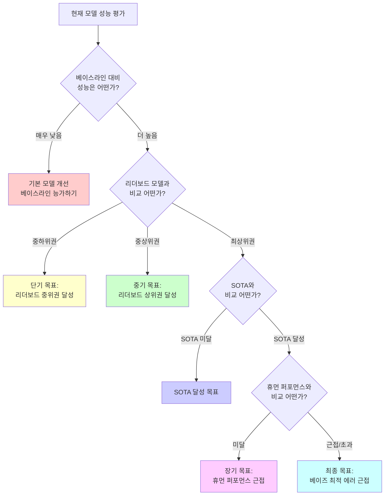
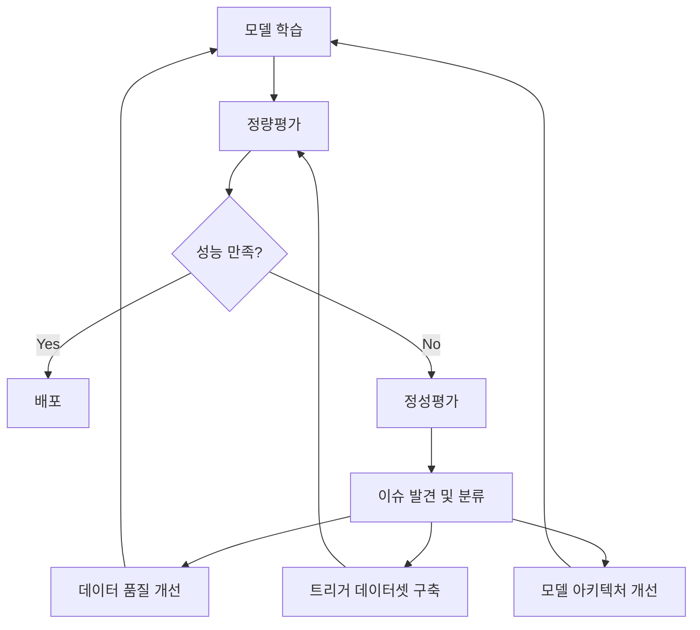

## 🚀 TL;DR


## 📦 사용하는 python package

- 
- 

## 📓 실습 Jupyter Notebook


## 📊 모델 평가의 중요성과 복잡성

### 모델 평가가 왜 중요한가

머신러닝 모델을 개발할 때 가장 중요한 단계 중 하나는 모델의 성능을 제대로 평가하는 것이다. 학습 과정에서 손실함수 값이 0에 가까워지더라도, 그것만으로는 모델이 원하는 기능을 완벽히 수행한다고 보장할 수 없다.

> 모델 평가는 단순히 정확도를 측정하는 것이 아니라, 모델이 실제 환경에서 얼마나 잘 작동할지 예측하는 과정이다. {: .prompt-tip}

이는 고전소설 "원숭이 손"(The Monkey's Paw, 1902)의 교훈과 유사하다. 소설에서 주인공은 "200달러를 벌게 해달라"는 소원을 빌었지만, 결과적으로 아들을 사고로 잃고 그 보상금으로 200달러를 받게 된다. 머신러닝에서도 마찬가지로, 단순히 손실함수를 최소화하는 것만 집중하면 의도치 않은 결과를 초래할 수 있다.

### 잘못된 평가의 위험성

모델 평가를 제대로 하지 않을 경우 발생할 수 있는 문제의 예시:

- **강화학습에서의 리워드 해킹**: 레이싱 게임을 학습하는 AI가 실제로 경주를 완주하는 대신 제자리에서 빙빙 돌며 아이템만 먹는 행동을 학습하게 되는 경우
- **종이클립 아포칼립스**: 클립 생산량만을 최적화하는 AI가 모든 자원을 클립으로 만들어 재앙을 초래하는 시나리오
- **추천 알고리즘의 편향**: 사용자 참여도만 높이도록 설계된 소셜 미디어 알고리즘이 자극적인 콘텐츠와 가짜뉴스를 우선 추천하게 되는 문제

이러한 사례들은 모델의 목표와 평가 방식을 신중하게 설계해야 함을 보여준다.

## 🔍 모델 평가의 구성요소

### 정성평가와 정량평가

모델의 성능을 제대로 평가하기 위해서는 두 가지 접근 방식이 필요하다:

**정성평가(Qualitative Evaluation)**는 사람이 직접 모델의 입출력을 검토하는 방식이다. 이는 모델의 결과가 직관적으로 이해 가능한지, 특정 상황에서 예상대로 작동하는지 판단하는 데 유용하다.

**정량평가(Quantitative Evaluation)**는 수치적 지표를 사용해 모델의 성능을 객관적으로 측정하는 방식이다. 이는 서로 다른 모델을 비교하거나 개선 여부를 판단하는 데 필수적이다.

> 효과적인 모델 평가를 위해서는 정성평가와 정량평가를 함께 사용해야 한다. 정량적 지표만으로는 모델의 실제 유용성을 완전히 파악할 수 없다. {: .prompt-tip}

### 손실함수와 평가 지표의 차이

손실함수(Loss Function)와 평가 지표(Evaluation Metric)는 비슷해 보이지만 중요한 차이가 있다:

- **손실함수**: 모델 학습 과정에서 파라미터를 최적화하기 위해 사용되는 함수로, 모델에 피드백을 제공해 학습을 진행시킨다.
- **평가 지표**: 학습된 모델의 성능을 측정하기 위한 지표로, 모델의 현재 수준을 파악하고 이후 실험 방향을 결정하는 데 도움이 된다.

항해 비유를 사용하면, 손실함수는 배를 앞으로 밀어주는 바람과 같고, 평가 지표는 현재 위치와 목적지를 확인할 수 있게 해주는 별과 같다.

[시각적 표현 넣기 - 손실함수와 평가 지표의 차이를 보여주는 그래프]

### 주요 평가 지표

머신러닝에서 자주 사용되는 평가 지표들:

**회귀 문제의 평가 지표**:

```python
# 회귀 모델 평가 지표 예시
from sklearn.metrics import mean_absolute_error, mean_squared_error, r2_score

# MAE (Mean Absolute Error)
mae = mean_absolute_error(y_true, y_pred)
# 출력: 0.35

# MSE (Mean Squared Error)
mse = mean_squared_error(y_true, y_pred)
# 출력: 0.25

# RMSE (Root Mean Squared Error)
rmse = np.sqrt(mse)
# 출력: 0.5

# R² (결정계수)
r2 = r2_score(y_true, y_pred)
# 출력: 0.85
```

**분류 문제의 평가 지표**:

```python
# 분류 모델 평가 지표 예시
from sklearn.metrics import accuracy_score, precision_score, recall_score, f1_score

# 정확도 (Accuracy)
accuracy = accuracy_score(y_true, y_pred)
# 출력: 0.92

# 정밀도 (Precision)
precision = precision_score(y_true, y_pred)
# 출력: 0.88

# 재현율 (Recall)
recall = recall_score(y_true, y_pred)
# 출력: 0.85

# F1 점수
f1 = f1_score(y_true, y_pred)
# 출력: 0.86
```

서비스 특성에 맞는 평가 지표를 선택하는 것이 중요하다. 예를 들어, 유튜브 추천 시스템은 시청 시간을, 의료 진단 모델은 오탐지(false negative)를 최소화하는 평가 지표를 중요시할 수 있다.

## 🔢 평가 데이터셋의 구성

### Train-Test 데이터셋 분할의 필요성

모델이 새로운 데이터에서도 잘 작동하는지 평가하기 위해서는 전체 데이터셋을 학습용과 평가용으로 분할해야 한다.

```python
from sklearn.model_selection import train_test_split

# 데이터셋을 학습용(80%)과 테스트용(20%)으로 분할
X_train, X_test, y_train, y_test = train_test_split(
    X, y, test_size=0.2, random_state=42
)

# 모델 학습
model = RandomForestClassifier()
model.fit(X_train, y_train)

# 테스트 데이터로 평가
y_pred = model.predict(X_test)
accuracy = accuracy_score(y_test, y_pred)
print(f"모델 정확도: {accuracy:.4f}")
# 출력: 모델 정확도: 0.9231
```

이렇게 분할하는 이유는 현대 머신러닝 모델이 학습 데이터의 손실함수를 거의 0에 가깝게 최소화할 수 있지만, 이것만으로는 새로운 데이터에 대한 성능을 보장할 수 없기 때문이다.

### 검증용 데이터셋(Validation Dataset)

실제 모델 개발에서는 데이터를 세 가지로 분할하는 것이 일반적이다:

- **학습용 데이터셋(Train Dataset)**: 모델 학습에 사용
- **검증용 데이터셋(Validation Dataset)**: 하이퍼파라미터 튜닝과 모델 선택에 사용
- **테스트용 데이터셋(Test Dataset)**: 최종 모델 평가에만 사용

```python
# 데이터를 학습(70%), 검증(15%), 테스트(15%)로 분할
X_train, X_temp, y_train, y_temp = train_test_split(
    X, y, test_size=0.3, random_state=42
)
X_val, X_test, y_val, y_test = train_test_split(
    X_temp, y_temp, test_size=0.5, random_state=42
)

# 모델 학습 및 검증
model.fit(X_train, y_train)
val_score = model.score(X_val, y_val)
print(f"검증 데이터 점수: {val_score:.4f}")
# 출력: 검증 데이터 점수: 0.8956

# 최종 테스트
test_score = model.score(X_test, y_test)
print(f"테스트 데이터 점수: {test_score:.4f}")
# 출력: 테스트 데이터 점수: 0.9012
```

이러한 접근 방식은 모델 개발 과정에서 테스트 데이터의 정보가 모델에 유출되는 것을 방지하여 더 신뢰할 수 있는 성능 평가를 가능하게 한다.

## 🔄 모델 선택과 정규화

### 모델 복잡도(Complexity)와 과적합

모델의 복잡도는 얼마나 복잡한 패턴을 학습할 수 있는지를 나타낸다. 일반적으로 파라미터 수가 많을수록(딥러닝의 경우 레이어와 뉴런 수가 많을수록) 복잡도가 높아진다.

복잡도가 높은 모델은 학습 데이터에 과도하게 맞추는 **과적합(Overfitting)** 현상이 발생할 수 있다. 과적합된 모델은 학습 데이터에서는 뛰어난 성능을 보이지만, 새로운 데이터에서는 형편없는 결과를 내게 된다.

[시각적 표현 넣기 - 과적합을 보여주는 그래프]

```python
from sklearn.linear_model import LinearRegression
from sklearn.preprocessing import PolynomialFeatures
from sklearn.pipeline import make_pipeline

# 단순한 모델 (1차 다항식)
simple_model = LinearRegression()
simple_model.fit(X_train.reshape(-1, 1), y_train)

# 복잡한 모델 (10차 다항식)
complex_model = make_pipeline(
    PolynomialFeatures(degree=10),
    LinearRegression()
)
complex_model.fit(X_train.reshape(-1, 1), y_train)

# 학습 데이터에서의 성능
train_score_simple = simple_model.score(X_train.reshape(-1, 1), y_train)
train_score_complex = complex_model.score(X_train.reshape(-1, 1), y_train)
print(f"학습 데이터 성능 - 단순 모델: {train_score_simple:.4f}, 복잡한 모델: {train_score_complex:.4f}")
# 출력: 학습 데이터 성능 - 단순 모델: 0.6532, 복잡한 모델: 0.9987

# 테스트 데이터에서의 성능
test_score_simple = simple_model.score(X_test.reshape(-1, 1), y_test)
test_score_complex = complex_model.score(X_test.reshape(-1, 1), y_test)
print(f"테스트 데이터 성능 - 단순 모델: {test_score_simple:.4f}, 복잡한 모델: {test_score_complex:.4f}")
# 출력: 테스트 데이터 성능 - 단순 모델: 0.6487, 복잡한 모델: 0.2354
```

### 정규화(Regularization) 기법

과적합을 방지하기 위해 모델의 복잡도를 제한하는 정규화 기법이 사용된다:

```python
from sklearn.linear_model import Ridge, Lasso

# L2 정규화 (릿지 회귀)
ridge_model = Ridge(alpha=1.0)
ridge_model.fit(X_train, y_train)

# L1 정규화 (라쏘 회귀)
lasso_model = Lasso(alpha=0.1)
lasso_model.fit(X_train, y_train)

# 테스트 데이터에서의 성능 비교
ridge_score = ridge_model.score(X_test, y_test)
lasso_score = lasso_model.score(X_test, y_test)
complex_score = complex_model.score(X_test.reshape(-1, 1), y_test)

print(f"테스트 데이터 성능 - 릿지: {ridge_score:.4f}, 라쏘: {lasso_score:.4f}, 정규화 없음: {complex_score:.4f}")
# 출력: 테스트 데이터 성능 - 릿지: 0.6423, 라쏘: 0.6312, 정규화 없음: 0.2354
```

주요 정규화 기법으로는:

- **L1 정규화(Lasso)**: 불필요한 특성의 가중치를 0으로 만들어 특성 선택 효과
- **L2 정규화(Ridge)**: 모든 가중치를 작게 유지해 전반적인 복잡도 감소
- **Dropout**: 딥러닝에서 학습 과정 중 일부 뉴런을 무작위로 비활성화
- **Early Stopping**: 검증 오차가 증가하기 시작하면 학습을 중단

## 📈 실무에서의 모델 평가 적용

### 교차 검증(Cross-Validation)

데이터가 제한적일 때 더 안정적인 평가를 위해 교차 검증을 사용할 수 있다:

```python
from sklearn.model_selection import cross_val_score

# 5-겹 교차 검증
cv_scores = cross_val_score(model, X, y, cv=5)
print(f"교차 검증 점수: {cv_scores}")
print(f"평균 점수: {cv_scores.mean():.4f}, 표준편차: {cv_scores.std():.4f}")
# 출력: 교차 검증 점수: [0.92 0.89 0.91 0.88 0.90]
# 출력: 평균 점수: 0.9000, 표준편차: 0.0158
```

### 앙상블 기법

여러 모델의 예측을 결합하여 더 안정적인 성능을 얻을 수 있다:

```python
from sklearn.ensemble import VotingClassifier
from sklearn.tree import DecisionTreeClassifier
from sklearn.svm import SVC

# 앙상블 모델 구성
ensemble = VotingClassifier(
    estimators=[
        ('rf', RandomForestClassifier()),
        ('dt', DecisionTreeClassifier()),
        ('svm', SVC(probability=True))
    ],
    voting='soft'
)

# 학습 및 평가
ensemble.fit(X_train, y_train)
ensemble_score = ensemble.score(X_test, y_test)
print(f"앙상블 모델 점수: {ensemble_score:.4f}")
# 출력: 앙상블 모델 점수: 0.9324
```

### 실시간 모니터링과 A/B 테스트

프로덕션 환경에서는 모델의 성능을 지속적으로 모니터링하고 새 모델을 검증하기 위한 A/B 테스트가 중요하다:

```python
# 간단한 A/B 테스트 결과 분석 (실제로는 서비스에 통합됨)
import scipy.stats as stats

# 두 모델의 결과 비교
conversion_a = [1, 0, 1, 1, 0, 1, 0, 0, 1, 1]  # 모델 A의 전환율
conversion_b = [1, 1, 1, 1, 0, 1, 1, 0, 1, 1]  # 모델 B의 전환율

# 통계적 유의성 검정
t_stat, p_value = stats.ttest_ind(conversion_a, conversion_b)
print(f"t-통계량: {t_stat:.4f}, p-값: {p_value:.4f}")
# 출력: t-통계량: -1.5811, p-값: 0.1308

if p_value < 0.05:
    print("두 모델 간에 통계적으로 유의한 차이가 있습니다.")
else:
    print("두 모델 간에 통계적으로 유의한 차이가 없습니다.")
# 출력: 두 모델 간에 통계적으로 유의한 차이가 없습니다.
```

## 🧠 결론 및 실전 팁

머신러닝 모델 평가는 단순히 정확도를 측정하는 것 이상의 복잡한 과정이다. 효과적인 모델 평가를 위한 핵심 팁:

1. **다양한 평가 지표 사용**: 하나의 지표만으로는 모델의 전체 성능을 판단할 수 없다
2. **적절한 데이터 분할**: 학습/검증/테스트 데이터를 명확히 분리하여 신뢰할 수 있는 평가 수행
3. **정규화 기법 적용**: 과적합을 방지하고 일반화 성능을 향상시키는 정규화 기법 활용
4. **서비스 목표 반영**: 비즈니스 목표와 연계된 평가 지표 선정
5. **지속적인 모니터링**: 배포 후에도 모델 성능을 지속적으로 모니터링하고 개선

> 모델 평가는 일회성 작업이 아닌 지속적인 프로세스이다. 데이터 특성이 시간에 따라 변할 수 있으므로(데이터 드리프트), 정기적인 재평가와 업데이트가 필요하다. {: .prompt-tip}

머신러닝 모델 평가의 궁극적인 목표는 실제 환경에서 안정적으로 작동하는 모델을 구축하는 것이다. 이는 단순히 높은 정확도를 달성하는 것이 아니라, 문제 도메인과 서비스 목표에 최적화된 모델을 개발하는 것을 의미한다.

## 🔍 데이터셋 분할의 필요성

### 왜 별도의 평가 데이터셋이 필요한가?

머신러닝 모델을 개발할 때 흔히 저지르는 실수 중 하나는 학습 데이터셋의 성능만으로 모델의 품질을 판단하는 것이다. 이는 잘못된 접근 방식이다. 다음 예시를 살펴보자:

```python
# 5차 다항함수 예시
def polynomial_function(x):
    return (x - 1) * (x - 2) * (x - 3) * (x - 4) * (x - 5) + x

# 학습 데이터
x_train = [1, 2, 3, 4, 5]
y_train = [1, 2, 3, 4, 5]

# f(6)의 값은?
result = polynomial_function(6)
print(f"f(6) = {result}")  # 출력: f(6) = 126
```

위 예시에서 5차 다항함수는 학습 데이터(x=1,2,3,4,5)에서 완벽하게 동작하지만, 새로운 데이터 포인트(x=6)에서는 기대값(6)과 크게 다른 결과(126)를 내놓는다. 이처럼 학습 데이터에서의 손실함수 값이 0이라는 사실만으로는 모델이 실제 환경에서 얼마나 잘 작동할지 판단할 수 없다.

> 모델은 학습 데이터의 패턴을 암기하는 것이 아니라, 데이터의 일반적인 규칙을 학습해야 한다. 이를 확인하기 위해 모델이 보지 못한 데이터에서의 성능을 평가해야 한다. {: .prompt-tip}

현대적인 딥러닝 모델들은 충분한 파라미터와 학습 시간이 주어지면 거의 모든 학습 데이터셋을 완벽하게 암기할 수 있다. 그러나 이는 실제 목표가 아니다. 모델이 학습 데이터에 과적합되면, 학습 데이터의 세세한 노이즈까지 학습하게 되어 새로운 데이터에서는 예측 성능이 크게 저하된다.

```python
# 과적합된 모델은 학습 데이터의 작은 부분까지 암기한다
# 이미지의 한 픽셀 패턴 예시
pixel_pattern = """
234, 222, 201, 192
231, 213, 206, 187
221, 206, 198, 181
207, 212, 196, 184
"""
print("이 의미 없는 픽셀 패턴까지 암기하면 새로운 이미지에서는 제대로 작동하지 못한다")
```

### 잘못된 데이터셋 분할의 결과

데이터셋을 잘못 분할하면 심각한 문제가 발생할 수 있다:

1. **데이터 누출(Data Leakage)**: 학습 데이터의 일부가 평가용 데이터에 포함되어 모델의 성능이 비정상적으로 높게 측정되는 문제

```python
# 데이터 누출 예시 - 이렇게 하면 안 된다!
X = np.random.randn(1000, 10)
y = np.random.randint(0, 2, 1000)

# 이미 분할된 데이터를 전처리 후 다시 분할
X_processed = preprocess_data(X)  # 전체 데이터로 특성 스케일링 등 수행
X_train, X_test, y_train, y_test = train_test_split(X_processed, y)  # 문제: 테스트 데이터 정보가 학습에 누출됨

# 올바른 방법
X_train, X_test, y_train, y_test = train_test_split(X, y)
X_train_processed = preprocess_data(X_train)  # 학습 데이터만으로 전처리 과정을 결정
X_test_processed = apply_preprocessing(X_test)  # 학습 데이터에서 결정된 전처리를 테스트 데이터에 적용
```

데이터 누출은 종종 발견하기 어려운 문제다. 만약 모델의 정확도가 비정상적으로 높게 나타난다면(예: 분류 문제에서 99.9% 정확도), 이는 데이터 누출이 의심되는 상황이다.

2. **평가용 데이터셋의 대표성 부족**: 테스트셋이 너무 작거나 편향된 경우, 평가 결과의 신뢰도가 하락한다.

```python
# 너무 작은 테스트셋 예시
X_train, X_test, y_train, y_test = train_test_split(X, y, test_size=0.01)  # 테스트셋이 전체의 1%에 불과
print(f"테스트셋 크기: {len(X_test)} 샘플")  # 매우 적은 샘플로는 성능을 신뢰할 수 없다

# 불균형한 테스트셋 예시
# 예: 이진 분류 문제에서 테스트셋에 한 클래스의 샘플만 포함된 경우
test_class_distribution = np.bincount(y_test)
print(f"테스트셋 클래스 분포: {test_class_distribution}")  # [10, 0] 같은 결과가 나오면 문제
```

## 📊 데이터셋의 적절한 분할 방법

### 평가용과 검증용 데이터셋의 역할

데이터셋 분할 방식은 크게 2분할과 3분할로 나뉜다:

**2분할 방법**:

- 전체 데이터를 학습용(train)과 검증용(validation)으로 분할
- 많은 오픈소스 코드에서는 검증용 데이터를 test로 표기하기도 한다

**3분할 방법**:

- 전체 데이터를 학습용(train), 검증용(validation), 평가용(test)으로 분할
- 일반적으로 더 권장되는 방식

각 데이터셋의 역할은 다음과 같다:

1. **학습용 데이터셋(Train Dataset)**: 모델의 파라미터를 직접 학습시키는 데 사용
2. **검증용 데이터셋(Validation Dataset)**: 학습 과정에서 하이퍼파라미터 튜닝과 모델 구조 변경에 사용
3. **평가용 데이터셋(Test Dataset)**: 최종 모델의 성능을 객관적으로 평가하는 데 사용

```python
# 3분할 예시
from sklearn.model_selection import train_test_split

# 첫 번째 분할: 학습용 vs (검증용+평가용)
X_train, X_temp, y_train, y_temp = train_test_split(X, y, test_size=0.3, random_state=42)

# 두 번째 분할: 검증용 vs 평가용
X_val, X_test, y_val, y_test = train_test_split(X_temp, y_temp, test_size=0.5, random_state=42)

print(f"학습용 데이터: {len(X_train)} 샘플 ({len(X_train)/len(X):.1%})")
print(f"검증용 데이터: {len(X_val)} 샘플 ({len(X_val)/len(X):.1%})")
print(f"평가용 데이터: {len(X_test)} 샘플 ({len(X_test)/len(X):.1%})")
```

검증용 데이터셋은 모델의 내삽(interpolation) 성능을 주로 확인하는 반면, 평가용 데이터셋은 외삽(extrapolation) 성능까지 평가하는 데 활용된다.

### k-fold 교차검증의 활용

데이터셋의 크기가 제한적일 때 효율적인 평가 방법으로 k-fold 교차검증이 있다:

```python
from sklearn.model_selection import KFold, cross_val_score
from sklearn.ensemble import RandomForestClassifier

# 5-fold 교차검증 설정
kf = KFold(n_splits=5, shuffle=True, random_state=42)
model = RandomForestClassifier(random_state=42)

# 교차검증 수행
cv_scores = cross_val_score(model, X, y, cv=kf, scoring='accuracy')

print(f"각 fold의 정확도: {cv_scores}")
print(f"평균 정확도: {cv_scores.mean():.4f}, 표준편차: {cv_scores.std():.4f}")
```

k-fold 교차검증은 다음과 같은 이점이 있다:

- 전체 데이터를 학습과 평가에 모두 활용하므로 데이터 효율성 증가
- 다양한 데이터 분할에서의 결과를 평균내어 더 안정적인 성능 측정 가능
- 특히 데이터셋 크기가 작을 때 유용

단점으로는:

- 대규모 데이터셋이나 복잡한 모델에서는 계산 비용이 크게 증가

### 외삽, 내삽과 일반화 성능

머신러닝 모델의 일반화 능력은 다음과 같이 구분할 수 있다:

**내삽(Interpolation)**: 학습 데이터의 범위 내에서 새로운 데이터를 예측하는 능력

**외삽(Extrapolation)**: 학습 데이터의 범위를 벗어난 새로운 데이터를 예측하는 능력

```python
import matplotlib.pyplot as plt
import numpy as np

# 내삽과 외삽 시각화
x_train = np.array([1, 2, 3, 4, 5])
y_train = np.array([1, 4, 9, 16, 25])  # y = x^2

# 모델 학습 (2차 다항식 피팅)
from sklearn.preprocessing import PolynomialFeatures
from sklearn.linear_model import LinearRegression
from sklearn.pipeline import make_pipeline

model = make_pipeline(PolynomialFeatures(2), LinearRegression())
model.fit(x_train.reshape(-1, 1), y_train)

# 예측 (내삽 및 외삽)
x_new = np.linspace(0, 8, 100).reshape(-1, 1)
y_pred = model.predict(x_new)

# 시각화
plt.figure(figsize=(10, 6))
plt.scatter(x_train, y_train, color='blue', label='학습 데이터')
plt.plot(x_new, y_pred, color='red', label='모델 예측')
plt.axvspan(min(x_train), max(x_train), alpha=0.2, color='blue', label='내삽 영역')
plt.axvspan(max(x_train), max(x_new), alpha=0.2, color='red', label='외삽 영역')
plt.axvspan(0, min(x_train), alpha=0.2, color='red')
plt.legend()
plt.title('내삽 vs 외삽')
plt.xlabel('x')
plt.ylabel('y')
plt.savefig('interpolation_extrapolation.png')
```

[시각적 표현 넣기 - 내삽과 외삽을 보여주는 그래프]

일반화 성능(Generalization Ability)은 모델이 처음 접하는 데이터에서 얼마나 잘 작동하는지를 나타내는 종합적인 개념이다. 이는 내삽 성능과 외삽 성능을 모두 포함한다.

3분할 방법에서 검증용 데이터셋은 내삽 성능 측정에 중점을 두고, 평가용 데이터셋은 보다 다양한 상황(외삽 포함)에서의 성능 측정을 목표로 한다.

### 데이터셋 규모에 따른 분할방법

데이터셋의 크기에 따라 적절한 분할 방법이 달라진다:

- **적당한 크기(1,000~10,000개)**: 7:1:2 비율로 3분할 권장
    
    ```python
    X_train, X_temp, y_train, y_temp = train_test_split(X, y, test_size=0.3)
    X_val, X_test, y_val, y_test = train_test_split(X_temp, y_temp, test_size=2/3)
    ```
    
- **매우 작은 크기(~100개)**: 50:50 2분할 또는 5-fold 교차검증 권장
    
    ```python
    # 50:50 분할
    X_train, X_test, y_train, y_test = train_test_split(X, y, test_size=0.5)
    
    # 또는 5-fold 교차검증
    from sklearn.model_selection import KFold
    kf = KFold(n_splits=5, shuffle=True)
    for train_idx, test_idx in kf.split(X):
        X_train, X_test = X[train_idx], X[test_idx]
        y_train, y_test = y[train_idx], y[test_idx]
        # 모델 학습 및 평가
    ```
    
- **매우 큰 크기(1,000,000+)**: 평가/검증용 데이터셋의 샘플 수보다 품질이 중요
    
    ```python
    # 예: 970,000 : 10,000 : 20,000 분할
    X_train, X_temp, y_train, y_temp = train_test_split(X, y, test_size=30000/len(X))
    X_val, X_test, y_val, y_test = train_test_split(X_temp, y_temp, test_size=2/3)
    ```
    

> 평가/검증용 데이터셋은 어느 정도 샘플 수가 확보된 이후에는 양을 늘리는 것보다 품질을 관리하는 것이 더 중요하다. {: .prompt-tip}

### 시계열 데이터셋의 검증

시계열 데이터는 시간 순서가 중요하므로 일반적인 랜덤 분할을 사용하면 안 된다:

```python
from sklearn.model_selection import TimeSeriesSplit

# 시계열 데이터 예시
dates = pd.date_range(start='2023-01-01', periods=100, freq='D')
X = np.random.randn(100, 5)  # 5개 특성을 가진 100일치 데이터
y = np.random.randn(100)     # 예측 목표값

# 시계열 분할
tscv = TimeSeriesSplit(n_splits=3)

plt.figure(figsize=(10, 6))
for i, (train_idx, test_idx) in enumerate(tscv.split(X)):
    plt.scatter(dates[train_idx], [i] * len(train_idx), c='blue', label='학습 데이터' if i == 0 else "")
    plt.scatter(dates[test_idx], [i] * len(test_idx), c='red', label='테스트 데이터' if i == 0 else "")

plt.title('시계열 데이터 분할')
plt.legend()
plt.savefig('time_series_split.png')
```

[시각적 표현 넣기 - 시계열 데이터 분할 그래프]

시계열 데이터에서는 현재 시점을 기준으로:

- 과거 데이터는 학습용
- 최근 데이터는 검증용
- 현재 이후 데이터는 평가용 으로 사용하는 것이 바람직하다.

### 데이터셋의 계층적 분할

불균형한 데이터셋(특정 클래스의 샘플이 매우 적은 경우)에서는 계층적 분할(Stratified Splitting)을 사용해야 한다:

```python
from sklearn.model_selection import StratifiedKFold

# 불균형 데이터 예시
y_imbalanced = np.concatenate([np.zeros(950), np.ones(50)])  # 95:5 비율의 이진 클래스
X_imbalanced = np.random.randn(1000, 10)

# 일반 분할
X_train, X_test, y_train, y_test = train_test_split(X_imbalanced, y_imbalanced, test_size=0.2)
print(f"일반 분할 - 학습 데이터 클래스 비율: {np.mean(y_train):.3f}, 테스트 데이터 클래스 비율: {np.mean(y_test):.3f}")

# 계층적 분할
X_train, X_test, y_train, y_test = train_test_split(
    X_imbalanced, y_imbalanced, test_size=0.2, stratify=y_imbalanced
)
print(f"계층적 분할 - 학습 데이터 클래스 비율: {np.mean(y_train):.3f}, 테스트 데이터 클래스 비율: {np.mean(y_test):.3f}")

# 시각화
plt.figure(figsize=(12, 5))

plt.subplot(1, 2, 1)
plt.title('일반 랜덤 분할')
plt.pie([np.sum(y_test == 0), np.sum(y_test == 1)], labels=['클래스 0', '클래스 1'], autopct='%1.1f%%')

plt.subplot(1, 2, 2)
plt.title('계층적 분할')
plt.pie([np.sum(y_test == 0), np.sum(y_test == 1)], labels=['클래스 0', '클래스 1'], autopct='%1.1f%%')

plt.savefig('stratified_split.png')
```

[시각적 표현 넣기 - 계층적 분할 시각화]

계층적 분할은 다음과 같은 상황에서 특히 중요하다:

- 희귀 질병 진단 모델 (양성 샘플이 매우 적은 경우)
- 사기 탐지 시스템 (사기 케이스가 전체의 1% 미만인 경우)
- 이상 탐지 알고리즘 (이상치가 드물게 발생하는 경우)

## 🧠 데이터셋 분할의 모범 사례

### 데이터 누출 방지하기

데이터 누출은 평가 결과의 신뢰성을 크게 해치는 문제다. 다음과 같은 방법으로 방지할 수 있다:

```python
# 잘못된 예시
scaler = StandardScaler()
X_scaled = scaler.fit_transform(X)  # 전체 데이터로 스케일러 학습
X_train, X_test, y_train, y_test = train_test_split(X_scaled, y)  # 이미 전처리된 데이터 분할

# 올바른 예시
X_train, X_test, y_train, y_test = train_test_split(X, y)  # 원본 데이터 분할
scaler = StandardScaler()
X_train_scaled = scaler.fit_transform(X_train)  # 학습 데이터로만 스케일러 학습
X_test_scaled = scaler.transform(X_test)  # 학습된 스케일러로 테스트 데이터 변환
```

특별히 주의해야 할 상황:

1. 특성 선택/추출 과정에서의 누출
2. 데이터 증강/합성 과정에서의 누출
3. 시계열 데이터에서 미래 정보의 누출

### 재현 가능한 분할 설정하기

실험의 재현성을 위해 항상 랜덤 시드를 설정하는 것이 중요하다:

```python
# 재현 가능한 분할
X_train, X_test, y_train, y_test = train_test_split(X, y, random_state=42)

# 교차검증에도 적용
kf = KFold(n_splits=5, shuffle=True, random_state=42)
```

### 데이터셋 분할 자동화하기

대규모 프로젝트에서는 데이터셋 분할을 자동화하는 유틸리티 함수를 만드는 것이 유용하다:

```python
def create_dataset_splits(X, y, test_size=0.2, val_size=0.25, random_state=42, stratify=None):
    """
    데이터를 학습/검증/테스트 세트로 분할하는 유틸리티 함수
    
    Parameters:
    -----------
    X : 특성 행렬
    y : 타겟 벡터
    test_size : 전체 데이터 중 테스트 세트 비율
    val_size : 학습+검증 데이터 중 검증 세트 비율
    random_state : 재현성을 위한 랜덤 시드
    stratify : 계층적 분할을 위한 라벨 (보통 y와 동일)
    
    Returns:
    --------
    X_train, X_val, X_test, y_train, y_val, y_test
    """
    # 계층적 분할을 위한 설정
    stratify_test = stratify
    
    # 1단계: 테스트 세트 분리
    X_temp, X_test, y_temp, y_test = train_test_split(
        X, y, test_size=test_size, random_state=random_state, stratify=stratify_test
    )
    
    # 계층적 분할을 사용하는 경우 두 번째 분할을 위한 stratify 업데이트
    if stratify is not None:
        stratify_val = y_temp
    else:
        stratify_val = None
    
    # 2단계: 학습/검증 세트 분리
    X_train, X_val, y_train, y_val = train_test_split(
        X_temp, y_temp, test_size=val_size, random_state=random_state, stratify=stratify_val
    )
    
    return X_train, X_val, X_test, y_train, y_val, y_test
```

## 📈 결론

데이터셋의 적절한 분할은 머신러닝 모델의 성공에 결정적인 역할을 한다. 핵심 포인트를 요약하면:

1. 학습 데이터만으로는 모델의 일반화 성능을 판단할 수 없으므로 별도의 평가 데이터셋이 필요하다.
2. 데이터셋은 일반적으로 학습/검증/평가용으로 3분할하며, 각각 다른 목적을 가진다.
3. 데이터 누출은 모델 성능을 비현실적으로 높게 측정하게 하므로 주의해야 한다.
4. 데이터셋의 크기와 특성에 따라 적절한 분할 방법이 달라진다.
5. 시계열 데이터와 불균형 데이터는 특별한 분할 방법이 필요하다.
6. k-fold 교차검증은 데이터를 효율적으로 활용하는 방법으로, 특히 적은 데이터셋에서 유용하다.

> 데이터셋 분할은 모델 학습과 평가의 토대가 되는 기술이다. 분할이 잘못되면 아무리 좋은 모델과 학습 알고리즘을 사용해도 신뢰할 수 없는 결과가 나온다. {: .prompt-tip}

올바른 데이터셋 분할 방법을 적용함으로써, 모델이 실제 환경에서 얼마나 잘 작동할지 더 정확히 예측할 수 있으며, 이는 머신러닝 프로젝트의 성공과 직결된다.

## 🔍 다양한 평가지표가 필요한 이유

### 정확도의 한계와 Medical Test Paradox

단순히 정확도(Accuracy)만으로 모델을 평가하면 심각한 오해를 불러일으킬 수 있다. 이를 가장 잘 보여주는 예가 Medical Test Paradox이다.

정확도 95%인 질병 검사에서 양성 판정을 받았다면, 실제로 그 질병에 걸렸을 확률은 몇일까? 직관적으로는 95%라고 생각하기 쉽지만, 실제로는 그렇지 않다.

질병의 유병률(전체 인구 중 질병을 가진 사람의 비율)이 1%라면:

- 100,000명 중 실제 질병에 걸린 사람은 1,000명
- 이 중 95%인 950명이 양성 판정(True Positive)을 받음
- 건강한 99,000명 중 5%인 4,950명이 잘못된 양성 판정(False Positive)을 받음
- 따라서 양성 판정을 받은 총 5,900명(950+4,950) 중 실제 질병에 걸린 사람은 950명으로, 확률은 약 16%에 불과함

$$p(질병|양성) = \frac{p(질병)p(양성|질병)}{p(질병)p(양성|질병) + p(건강)p(양성|건강)} = \frac{950}{950+4950} \approx 0.16$$

> 이처럼 정확도만으로는 모델의 실제 성능을 제대로 평가할 수 없으며, 데이터의 분포와 문제의 특성을 고려한 다양한 평가 지표가 필요하다. {: .prompt-tip}

### 평가지표의 기본 특성 이해하기

정량평가 지표를 사용할 때는 해당 지표의 기본 특성을 이해하는 것이 중요하다:

1. **최소화 지표와 최대화 지표**
    
    - 값이 작을수록 좋은 지표는 최소화(Minimizing) 지표: MAE, MSE, RMSE 등
    - 값이 클수록 좋은 지표는 최대화(Maximizing) 지표: 정확도, 정밀도, 재현율, F1 스코어 등
2. **평가지표 값의 범위**
    
    - 정확도, 정밀도, 재현율, F1 스코어: 0~1(또는 0~100%)
    - MAE, MSE: 0~∞(오차가 클수록 값이 커짐)

## 💡 분류 문제의 정량평가 지표

### 혼동 행렬(Confusion Matrix)

분류 모델의 성능을 평가하는 가장 기본적인 도구는 혼동 행렬이다. 이진 분류 문제에서 혼동 행렬은 다음과 같은 네 가지 결과를 보여준다:

```python
# 혼동 행렬 계산 및 시각화
from sklearn.metrics import confusion_matrix
import seaborn as sns

cm = confusion_matrix(y_true, y_pred)
plt.figure(figsize=(8, 6))
sns.heatmap(cm, annot=True, fmt='d', cmap='Blues',
            xticklabels=['Negative', 'Positive'],
            yticklabels=['Negative', 'Positive'])
plt.xlabel('Predicted')
plt.ylabel('Actual')
plt.title('Confusion Matrix')
plt.show()
```

혼동 행렬의 구성 요소:

- **True Positive (TP)**: 실제 양성을 양성으로 예측 (정답)
- **False Positive (FP)**: 실제 음성을 양성으로 예측 (오답, 제1종 오류)
- **True Negative (TN)**: 실제 음성을 음성으로 예측 (정답)
- **False Negative (FN)**: 실제 양성을 음성으로 예측 (오답, 제2종 오류)

[시각적 표현 넣기 - 혼동 행렬을 보여주는 그림]

### 정밀도(Precision)와 재현율(Recall)

혼동 행렬에서 파생된 두 가지 중요한 평가 지표는 정밀도와 재현율이다.

**정밀도(Precision)**:

- 양성으로 예측한 샘플 중 실제 양성의 비율
- TP / (TP + FP)
- 모델이 양성이라고 예측할 때 얼마나 신뢰할 수 있는지를 측정

**재현율(Recall)**:

- 실제 양성 샘플 중 양성으로 정확하게 예측한 비율
- TP / (TP + FN)
- 모델이 실제 양성 케이스를 얼마나 잘 찾아내는지를 측정

```python
# 정밀도와 재현율 계산
from sklearn.metrics import precision_score, recall_score

precision = precision_score(y_true, y_pred)
recall = recall_score(y_true, y_pred)

print(f"정밀도: {precision:.4f}")
print(f"재현율: {recall:.4f}")
```

### F1 스코어

정밀도와 재현율은 종종 서로 상충관계(trade-off)에 있어, 하나를 높이면 다른 하나가 낮아지는 경향이 있다. F1 스코어는 이 두 지표의 조화평균을 계산하여 균형 잡힌 평가를 제공한다.

$$F1 = \frac{2}{\frac{1}{Precision} + \frac{1}{Recall}} = \frac{2 \times Precision \times Recall}{Precision + Recall}$$

```python
# F1 스코어 계산
from sklearn.metrics import f1_score

f1 = f1_score(y_true, y_pred)
print(f"F1 스코어: {f1:.4f}")
```

F1 스코어는 특히 클래스 불균형이 있는 데이터셋에서 유용하다. 정확도가 높더라도 소수 클래스에 대한 성능이 좋지 않을 수 있기 때문이다.

### ROC 곡선과 AUC

ROC(Receiver Operating Characteristic) 곡선은 다양한 분류 임계값(threshold)에서 모델의 성능을 시각화하는 방법이다. 이 곡선은 False Positive Rate(1-특이도)에 대한 True Positive Rate(민감도)의 변화를 보여준다.

AUC(Area Under the Curve)는 ROC 곡선 아래 영역의 면적으로, 0.5(무작위 추측)부터 1.0(완벽한 분류)까지의 값을 가진다.

```python
# ROC 곡선과 AUC 계산 및 시각화
from sklearn.metrics import roc_curve, auc

# 예측 확률이 필요함 (이진 분류기의 predict_proba 메서드 사용)
y_prob = model.predict_proba(X_test)[:, 1]
fpr, tpr, thresholds = roc_curve(y_true, y_prob)
roc_auc = auc(fpr, tpr)

plt.figure(figsize=(8, 6))
plt.plot(fpr, tpr, color='darkorange', lw=2, label=f'ROC curve (AUC = {roc_auc:.3f})')
plt.plot([0, 1], [0, 1], color='navy', lw=2, linestyle='--')
plt.xlim([0.0, 1.0])
plt.ylim([0.0, 1.05])
plt.xlabel('False Positive Rate')
plt.ylabel('True Positive Rate')
plt.title('Receiver Operating Characteristic')
plt.legend(loc="lower right")
plt.show()
```

[시각적 표현 넣기 - ROC 곡선과 AUC를 보여주는 그래프]

## 📏 회귀 문제의 정량평가 지표

회귀 모델은 연속적인 값을 예측하므로, 분류 문제와는 다른 평가 지표를 사용한다.

### MAE (Mean Absolute Error)

예측값과 실제값 간의 절대 오차의 평균이다. 이상치(outlier)에 상대적으로 덜 민감하다.

$$MAE = \frac{1}{n} \sum_{i=1}^{n} |y_i - \hat{y}_i|$$

```python
# MAE 계산
from sklearn.metrics import mean_absolute_error

mae = mean_absolute_error(y_true, y_pred)
print(f"MAE: {mae:.4f}")
```

### MSE (Mean Squared Error)

예측값과 실제값 간의 제곱 오차의 평균이다. 큰 오차에 더 큰 가중치를 부여하므로 이상치에 민감하다.

$$MSE = \frac{1}{n} \sum_{i=1}^{n} (y_i - \hat{y}_i)^2$$

```python
# MSE 계산
from sklearn.metrics import mean_squared_error

mse = mean_squared_error(y_true, y_pred)
print(f"MSE: {mse:.4f}")
```

### RMSE (Root Mean Squared Error)

MSE의 제곱근으로, MSE와 같은 정보를 제공하지만 원래 데이터와 같은 단위로 표현된다.

$$RMSE = \sqrt{MSE} = \sqrt{\frac{1}{n} \sum_{i=1}^{n} (y_i - \hat{y}_i)^2}$$

```python
# RMSE 계산
rmse = np.sqrt(mse)
print(f"RMSE: {rmse:.4f}")
```

### MAE vs MSE: 이상치 감지

회귀 모델에서 MAE와 MSE의 선택은 이상치 처리 전략에 따라 달라질 수 있다:

```python
# 이상치가 있는 경우와 없는 경우의 MAE, MSE 비교
import numpy as np

# 일반적인 데이터
y_true = np.array([1, 2, 3, 4, 5])
y_pred = np.array([1.1, 2.2, 2.9, 4.1, 5.2])

mae_normal = mean_absolute_error(y_true, y_pred)
mse_normal = mean_squared_error(y_true, y_pred)

# 이상치가 있는 데이터
y_true_outlier = np.array([1, 2, 3, 4, 15])  # 15는 이상치
y_pred_outlier = np.array([1.1, 2.2, 2.9, 4.1, 5.2])

mae_outlier = mean_absolute_error(y_true_outlier, y_pred_outlier)
mse_outlier = mean_squared_error(y_true_outlier, y_pred_outlier)

print(f"이상치가 없을 때 - MAE: {mae_normal:.4f}, MSE: {mse_normal:.4f}")
print(f"이상치가 있을 때 - MAE: {mae_outlier:.4f}, MSE: {mse_outlier:.4f}")
```

[시각적 표현 넣기 - MAE와 MSE의 이상치 민감도 차이를 보여주는 그래프]

## 🔄 그 외의 다양한 정량평가 지표

### 편집 거리(Edit Distance)

시계열 모델이나 텍스트 생성 모델에서 사용되는 지표로, 한 문자열을 다른 문자열로 변환하기 위해 필요한 최소 연산(삽입, 삭제, 대체) 횟수를 측정한다.

```python
# 편집 거리 계산 예시
from Levenshtein import distance

target = "Chrome"
prediction = "home"

edit_dist = distance(target, prediction)
print(f"편집 거리: {edit_dist}")  # 출력: 2 (C와 r을 추가해야 함)
```

### 컴퓨팅 자원 관련 지표

모델의 실행 성능과 관련된 지표들도 중요하다:

1. **인퍼런스 시간(Latency)**: 모델이 입력을 받아 출력을 생성하는 데 걸리는 시간
2. **처리율(Throughput)**: 단위 시간당 처리할 수 있는 샘플의 수
3. **메모리 사용량(Memory Usage)**: 모델이 실행될 때 필요한 메모리 양

```python
# 모델 실행 시간 및 메모리 사용량 측정 예시
import time
import tracemalloc

# 메모리 추적 시작
tracemalloc.start()

# 실행 시간 측정 시작
start_time = time.time()

# 모델 예측 실행
predictions = model.predict(X_test)

# 실행 시간 측정 종료
end_time = time.time()
latency = end_time - start_time

# 메모리 사용량 측정
current, peak = tracemalloc.get_traced_memory()
tracemalloc.stop()

print(f"인퍼런스 시간: {latency:.4f}초")
print(f"최대 메모리 사용량: {peak / 10**6:.2f} MB")
```

## 🧩 정량평가의 체계적인 활용

### 적절한 평가 지표 선택하기

평가 지표는 문제의 특성과 서비스 목표에 따라 선택해야 한다:

1. **연구 목적**: 기존 연구에서 사용한 평가 지표를 참고하여 결과를 비교 가능하게 한다.
2. **서비스 목적**: 서비스의 비즈니스 목표와 직접적으로 연결된 평가 지표를 선택한다.

예를 들어, 유튜브의 추천 시스템은 시간이 지남에 따라 평가 지표가 발전했다:

- 초기: 단순 조회수 기반 평가
- 2012년 이후: 시청 시간 기반 평가
- 2016년 이후: 시청 시간과 사용자 만족도를 결합한 'Valued Watchtime' 평가

> 평가 지표는 고정된 것이 아니라, 서비스의 발전에 따라 함께 진화해야 한다. 단일 지표에 지나치게 의존하면 의도치 않은 결과를 초래할 수 있다. {: .prompt-tip}

### 여러 평가 지표 함께 활용하기

복잡한 문제에서는 단일 지표만으로 모델의 성능을 완전히 평가하기 어렵다. 이런 경우 여러 지표를 함께 활용하는 방법을 고려해야 한다:

1. **여러 지표의 동시 사용**: 서로 다른 특성을 가진 지표(예: MSE와 MAE)를 함께 사용
2. **여러 데이터셋에서의 평가**: 동일한 지표를 다양한 테스트 데이터셋에 적용

```python
# 여러 지표를 가중 평균하여 종합 평가 점수 계산 예시
# A: 웹 크롤링 데이터(2000개), B: 실제 서비스 데이터(100개)

accuracy_A = accuracy_score(y_A_true, y_A_pred)
accuracy_B = accuracy_score(y_B_true, y_B_pred)

# B 데이터셋이 더 중요하므로 더 높은 가중치 부여
weighted_score = 0.3 * accuracy_A + 0.7 * accuracy_B

print(f"테스트셋 A 정확도: {accuracy_A:.4f}")
print(f"테스트셋 B 정확도: {accuracy_B:.4f}")
print(f"가중 평균 점수: {weighted_score:.4f}")
```

### 충돌하는 평가 지표의 우선순위 설정

여러 평가 지표가 서로 상충할 때는 다음과 같이 우선순위를 설정할 수 있다:

1. **최적화 지표(Optimizing Metric)**: 모델의 성능에 가장 중요한 영향을 미치는 지표로, 최대한 개선하려고 노력한다.
2. **충족 지표(Satisficing Metric)**: 일정 수준 이상을 유지하면 되는 지표로, 최적화 지표를 개선하는 과정에서 크게 악화되지 않도록 제약 조건으로 사용한다.

예를 들어, 정확도와 메모리 사용량이 상충할 때:

- 정확도를 최적화 지표로 설정
- 메모리 사용량을 충족 지표로 설정(예: 24GB 이하)
- 메모리 제약 내에서 정확도가 가장 높은 모델 선택

```python
# 최적화 지표와 충족 지표를 고려한 모델 선택 예시
models = [
    {"name": "Model A", "accuracy": 0.91, "memory_gb": 16},
    {"name": "Model B", "accuracy": 0.94, "memory_gb": 18},
    {"name": "Model C", "accuracy": 0.95, "memory_gb": 27}
]

# 메모리 제약: 24GB 이하
memory_constraint = 24

# 메모리 제약을 만족하는 모델 중 가장 정확한 모델 선택
best_model = None
best_accuracy = 0

for model in models:
    if model["memory_gb"] <= memory_constraint and model["accuracy"] > best_accuracy:
        best_model = model
        best_accuracy = model["accuracy"]

print(f"선택된 모델: {best_model['name']}, 정확도: {best_model['accuracy']}, 메모리: {best_model['memory_gb']}GB")
```

## 🔎 실전 적용 사례

### 불균형 데이터셋에서의 평가

클래스 불균형이 심한 경우(예: 사기 탐지, 질병 진단), 정확도보다 정밀도, 재현율, F1 스코어가 더 중요할 수 있다.

```python
# 불균형 데이터셋에서의 평가 예시
from sklearn.metrics import classification_report

# 가상의 불균형 데이터셋 (사기 탐지: 1%만 사기)
# y_true에는 1(사기)이 1% 미만
# y_pred는 모델의 예측 결과

report = classification_report(y_true, y_pred)
print(report)
```

### 서비스 KPI와 연결된 평가 지표

실제 서비스에서는 평가 지표를 비즈니스 KPI와 연결하는 것이 중요하다:

- **검색 엔진**: 정확도보다 상위 10개 결과의 관련성(precision@10)이 더 중요할 수 있음
- **추천 시스템**: 시청/읽기/구매 완료율이 클릭률보다 중요할 수 있음
- **자연어 처리**: 단순 정확도보다 사용자 만족도와 연관된 지표가 중요할 수 있음

## 📊 결론

머신러닝 모델의 정량평가는 단순히 숫자를 측정하는 것 이상의 의미를 갖는다. 좋은 평가 체계는 다음과 같은 특성을 가진다:

1. **문제 특성에 맞는 다양한 지표 활용**: 단일 지표에만 의존하지 않고, 문제의 다양한 측면을 평가할 수 있는 여러 지표를 함께 사용한다.
    
2. **서비스 목표와의 연계**: 평가 지표는 궁극적으로 서비스의 목표와 연결되어야 한다. 지표 자체가 목적이 아니라 수단임을 기억해야 한다.
    
3. **평가 체계의 지속적 개선**: 서비스와 사용자 요구가 변화함에 따라 평가 지표도 함께 발전시켜야 한다.
    

> 정량평가 지표는 모델 개발의 나침반이다. 잘못된 지표에 의존하면 목적지에 도달할 수 없다. 따라서 평가 지표의 선택과 활용은 머신러닝 프로젝트의 성공을 좌우하는 핵심 요소이다. {: .prompt-tip}

적절한 평가 체계를 구축함으로써, 모델이 단순히 학습 데이터에 잘 맞추는 것이 아니라 실제 환경에서 가치를 창출할 수 있도록 개발 방향을 설정할 수 있다.

## 📊 모델 성능의 비교

모델의 정량평가 수치는 그 자체로는 의미를 파악하기 어렵다. 어떤 모델의 성능이 42점이라고 할 때, 이 수치만으로는 모델의 성능이 좋은지 나쁜지 판단하기 어렵다. 성능 지표의 의미를 제대로 해석하기 위해서는 다양한 비교 기준이 필요하다.

### 낯선 평가지표와 친해지기

새로운 평가지표를 접했을 때 가장 먼저 확인해야 할 사항:

- **최적화 방향**: 낮을수록 좋은 지표인가(Minimizing Metric), 높을수록 좋은 지표인가(Maximizing Metric)?
- **이론상 범위**: 가능한 최저/최고 스코어는 얼마인가?

예를 들어, '42'라는 점수가 주어졌을 때:

- MSE(평균제곱오차)라면 낮을수록 좋은 지표이므로 상당히 안 좋은 성능
- 정확도(Accuracy)라면 높을수록 좋은 지표이지만 100점 만점 기준으로는 중간 정도의 성능
- BLEU Score(기계번역 평가지표)라면 매우 높은 성능을 의미

> 평가 데이터셋의 특성을 함께 고려하지 않으면 성능 비교는 의미가 없다. 데이터의 분포, 크기, 복잡성에 따라 같은 수치라도 의미가 크게 달라질 수 있다. {: .prompt-tip}

[시각적 표현 넣기 - 각 지표별 42점의 의미를 스케일로 표현]

## 🔍 베이스라인과 리더보드

### 베이스라인 모델의 활용

**베이스라인(Baseline) 스코어**는 높은 성능을 내기 위한 목적이 아니라 실험과정에서 비교용으로 사용하는 모델의 점수를 의미한다.

#### 랜덤 베이스라인

입력값을 무시하고 k개의 클래스 중 무작위로 하나를 선택하는 랜덤 베이스라인 모델의 정확도는 이론적으로 다음과 같다:

$$ \text{Random Baseline Accuracy} = \frac{1}{k} \times 100\% $$

여기서 k는 클래스의 수이다.

예를 들어, 5개 클래스 분류 문제에서 랜덤 베이스라인의 정확도는 20%가 된다. 만약 학습된 모델의 성능이 이보다 낮다면, 모델 구현이나 평가 과정에 오류가 있을 가능성이 높다.

#### 베이스라인 성능의 활용

1. **평가지표 측정 검증**: 구현한 평가 코드가 제대로 작동하는지 확인
2. **학습 과정 오류 확인**: 모델 학습이 제대로 이루어지는지 확인

```python
import numpy as np
from sklearn.metrics import accuracy_score
from sklearn.dummy import DummyClassifier

# 랜덤 베이스라인 모델 구현
def random_baseline(n_classes, n_samples):
    # 무작위 예측 생성
    y_pred = np.random.randint(0, n_classes, size=n_samples)
    return y_pred

# 실제 데이터에 적용
n_classes = 5
n_samples = 1000
y_true = np.random.randint(0, n_classes, size=n_samples)
y_pred_random = random_baseline(n_classes, n_samples)

# 랜덤 베이스라인 성능 계산
random_accuracy = accuracy_score(y_true, y_pred_random)
print(f"랜덤 베이스라인 정확도: {random_accuracy:.4f}")
# 출력: 랜덤 베이스라인 정확도: ~0.2000 (약간의 변동 있음)

# scikit-learn의 DummyClassifier 사용
dummy_clf = DummyClassifier(strategy='uniform')
dummy_clf.fit(np.zeros((n_samples, 1)), y_true)
y_pred_dummy = dummy_clf.predict(np.zeros((n_samples, 1)))
dummy_accuracy = accuracy_score(y_true, y_pred_dummy)
print(f"Dummy 분류기 정확도: {dummy_accuracy:.4f}")
# 출력: Dummy 분류기 정확도: ~0.2000 (약간의 변동 있음)
```

#### 다른 방식의 베이스라인

단순 랜덤 베이스라인보다 조금 더 나은 성능을 보이는 간단한 모델들:

- **나이브 베이즈 분류기 (Naive Bayes Classifier)**: 확률 기반의 간단한 분류 알고리즘
- **k-최근접이웃 분류 (k-Nearest Neighbor)**: 거리 기반의 분류 알고리즘
- **다중 로지스틱 회귀 (Multiclass Logistic Regression)**: 선형 모델 기반의 분류 알고리즘

이러한 모델들은 구현이 간단하고 사용 조건이 까다롭지 않아 베이스라인으로 자주 활용된다.

```python
from sklearn.naive_bayes import GaussianNB
from sklearn.neighbors import KNeighborsClassifier
from sklearn.linear_model import LogisticRegression
from sklearn.model_selection import train_test_split
from sklearn.datasets import make_classification

# 샘플 데이터 생성
X, y = make_classification(n_samples=1000, n_features=20, n_classes=5, random_state=42)
X_train, X_test, y_train, y_test = train_test_split(X, y, test_size=0.3, random_state=42)

# 모델 정의
models = {
    'Naive Bayes': GaussianNB(),
    'KNN (k=3)': KNeighborsClassifier(n_neighbors=3),
    'Logistic Regression': LogisticRegression(max_iter=1000, multi_class='multinomial')
}

# 각 모델 훈련 및 평가
baseline_scores = {}
for name, model in models.items():
    model.fit(X_train, y_train)
    score = model.score(X_test, y_test)
    baseline_scores[name] = score
    print(f"{name} 정확도: {score:.4f}")
# 출력:
# Naive Bayes 정확도: ~0.7000
# KNN (k=3) 정확도: ~0.8000
# Logistic Regression 정확도: ~0.8500
```

머신러닝 프로젝트에서 이러한 간단한 모델들의 성능은 복잡한 모델의 성능을 평가하는 기준점이 된다. 만약 복잡한 딥러닝 모델이 이러한 간단한 베이스라인보다 성능이 좋지 않다면, 모델 설계나 학습 과정에 문제가 있을 가능성이 크다.

### 리더보드 점수의 활용

**리더보드(Leaderboard)**는 공개 데이터셋에 대해 연구자들이 각자 학습한 모델의 성능을 공유하고 비교하는 순위표이다. 많은 경진대회나 벤치마크 데이터셋에서 리더보드를 제공한다.

**SOTA(State Of The Art)**는 '최첨단'이라는 뜻으로, 리더보드에서 1위를 달성한 세계 최고 성능의 모델을 의미한다.

```python
import pandas as pd
import matplotlib.pyplot as plt
import seaborn as sns

# 가상의 리더보드 데이터
leaderboard = pd.DataFrame({
    'Model': ['Transformer Cycle', 'Noisy back-translation', 'Transformer+Rep', 'T5-11B', 'BART'],
    'BLEU': [35.14, 35.0, 33.89, 32.1, 31.26],
    'Year': [2023, 2022, 2023, 2019, 2021]
})

# 리더보드 시각화
plt.figure(figsize=(10, 6))
sns.barplot(x='BLEU', y='Model', data=leaderboard.sort_values('BLEU', ascending=False))
plt.title('Machine Translation Leaderboard (WMT2014 English-German)')
plt.xlabel('BLEU Score')
plt.tight_layout()
plt.show()
# 출력: 모델별 BLEU 점수 바차트
```

리더보드를 활용하면 현재 모델의 성능이 기존 연구들과 비교했을 때 어느 위치에 있는지 파악할 수 있다. 하지만 리더보드가 없거나 SOTA를 달성한 이후에는 어떻게 모델을 평가해야 할까? 이때 필요한 것이 **베이즈 최적 에러**와 **휴먼 퍼포먼스**이다.

## 🧠 베이즈 에러와 휴먼 퍼포먼스

### 베이즈 최적 에러의 정의와 특성

**베이즈 최적 에러(Bayes Optimal Error)**는 현재의 정량평가 방식에서 이론상 도달할 수 있는 이상적인 분류 체계의 성능을 의미한다. 이는 문제 자체의 복잡성과 데이터의 노이즈로 인해 발생하는 불가피한 오차를 포함한다.

베이즈 최적 에러의 주요 특성:

- 대부분의 상황에서 정확한 값을 직접 계산하기는 어렵지만, 다양한 방법을 통해 추정할 수 있다.
- 충분히 큰 평가용 데이터셋에서는 일반적으로 이론상 최고값(Perfect Score)보다 약간 낮다.
- 문제 자체의 난이도뿐만 아니라 데이터의 라벨 노이즈에 의해서도 결정된다.
- 평가 방식이 바뀌면 베이즈 최적 에러도 바뀐다. 테스트셋이 변경되거나 라벨 노이즈가 제거되면 다시 추정해야 한다.

예를 들어, 새의 이미지를 보고 종을 분류하는 문제를 생각해보자:

- 일반적인 샘플: 전형적인 특성을 가진 새의 사진, 식별이 용이
- 어려운 샘플: 불분명한 특성이나 부분적으로 가려진 새의 사진
- 분류 불가능 샘플: 개나 다른 동물의 사진, 또는 너무 희귀한 종의 새

베이즈 최적 에러는 이러한 데이터셋의 특성에 따라 달라진다. 아무리 뛰어난 모델이라도 잘못 라벨링된 데이터나 식별 불가능한 샘플에서는 완벽한 성능을 보일 수 없다.

### 휴먼 퍼포먼스의 활용

**휴먼 퍼포먼스(Human Performance)**는 주어진 문제를 사람이 얼마나 잘 해결하는지를 측정한 것으로, 베이즈 최적 에러를 추정하는 데 중요한 지표가 된다.

휴먼 퍼포먼스를 측정할 때는 다양한 방법이 있다:

- 직접 분류해보기 (비전문가)
- 지인이나 임의의 사람들에게 물어보기 (비전문가)
- 해당 분야 전문가에게 문의 (전문가)
- 여러 전문가들이 논의하여 결론 도출 (전문가 합의)

이론적으로 가능한 최고 성능을 추정하는 것이 목적이므로, 전문가 집단의 합의된 결과를 사용하는 것이 가장 적합하다. 예를 들어, 새 분류 문제에서 여러 조류 전문가들이 논의한 결과 94%의 정확도를 보였다면, 이를 베이즈 최적 에러 추정의 기준으로 사용할 수 있다.

```python
import matplotlib.pyplot as plt
import numpy as np

# 가상의 성능 데이터
performance_metrics = {
    'Random Baseline': 20,
    'Simple Models Baseline': 35,
    'Current Model': 42,
    'Leaderboard Models Range': (65, 85),
    'SOTA Model': 91,
    'Expert Human Performance': 94,
    'Bayes Optimal Error': 97  # 추정치
}

# 시각화
fig, ax = plt.subplots(figsize=(12, 6))
ax.axhline(y=0, color='k', linestyle='-', alpha=0.3)
ax.axhline(y=100, color='k', linestyle='-', alpha=0.3)

# 랜덤 베이스라인
ax.scatter(0, performance_metrics['Random Baseline'], color='blue', s=100, label='Random Baseline')
ax.annotate(f"{performance_metrics['Random Baseline']}%", (0, performance_metrics['Random Baseline']), 
            xytext=(5, 5), textcoords='offset points')

# 간단한 모델 베이스라인
ax.scatter(1, performance_metrics['Simple Models Baseline'], color='blue', s=100, label='Simple Models')
ax.annotate(f"{performance_metrics['Simple Models Baseline']}%", (1, performance_metrics['Simple Models Baseline']), 
            xytext=(5, 5), textcoords='offset points')

# 현재 모델
ax.scatter(2, performance_metrics['Current Model'], color='orange', s=150, label='Current Model')
ax.annotate(f"{performance_metrics['Current Model']}%", (2, performance_metrics['Current Model']), 
            xytext=(5, 5), textcoords='offset points')

# 리더보드 범위
ax.errorbar(3, np.mean(performance_metrics['Leaderboard Models Range']), 
           yerr=[(np.mean(performance_metrics['Leaderboard Models Range']) - performance_metrics['Leaderboard Models Range'][0]), 
                 (performance_metrics['Leaderboard Models Range'][1] - np.mean(performance_metrics['Leaderboard Models Range']))],
           fmt='o', color='green', capsize=10, label='Leaderboard Range')
ax.annotate(f"{performance_metrics['Leaderboard Models Range'][0]}-{performance_metrics['Leaderboard Models Range'][1]}%", 
            (3, np.mean(performance_metrics['Leaderboard Models Range'])), 
            xytext=(5, 5), textcoords='offset points')

# SOTA 모델
ax.scatter(4, performance_metrics['SOTA Model'], color='purple', s=150, label='SOTA Model')
ax.annotate(f"{performance_metrics['SOTA Model']}%", (4, performance_metrics['SOTA Model']), 
            xytext=(5, 5), textcoords='offset points')

# 휴먼 퍼포먼스
ax.scatter(5, performance_metrics['Expert Human Performance'], color='red', s=150, label='Human Performance')
ax.annotate(f"{performance_metrics['Expert Human Performance']}%", (5, performance_metrics['Expert Human Performance']), 
            xytext=(5, 5), textcoords='offset points')

# 베이즈 최적 에러
ax.scatter(6, performance_metrics['Bayes Optimal Error'], color='cyan', s=150, label='Bayes Optimal Error')
ax.annotate(f"{performance_metrics['Bayes Optimal Error']}%", (6, performance_metrics['Bayes Optimal Error']), 
            xytext=(5, 5), textcoords='offset points')

plt.xticks(range(7), ['Random\nBaseline', 'Simple\nModels', 'Current\nModel', 'Leaderboard\nRange', 
                      'SOTA\nModel', 'Human\nPerformance', 'Bayes\nOptimal'])
plt.ylabel('Accuracy (%)')
plt.title('Performance Comparison Across Different Benchmarks')
plt.ylim(0, 105)
plt.legend(loc='upper left', bbox_to_anchor=(1, 1))
plt.tight_layout()
plt.show()
# 출력: 다양한 성능 지표를 비교한 그래프
```

### 프로젝트 목표의 설정

베이스라인, 리더보드, 휴먼 퍼포먼스, 베이즈 최적 에러 등 다양한 레퍼런스 성능 지표를 고려하여 현실적인 프로젝트 목표를 설정할 수 있다.

프로젝트 성격에 따른 목표 설정 전략:

1. **탐색적 연구**: 현재 성능에서 베이스라인 모델 대비 일정 수준(예: 20-30%) 향상
2. **경쟁적 연구**: 리더보드의 상위권 모델 성능에 도달하거나 능가하기
3. **혁신적 연구**: 현재 SOTA 모델을 능가하여 새로운 SOTA 달성
4. **한계 탐구 연구**: 휴먼 퍼포먼스나 베이즈 최적 에러에 근접하기

```python
# 목표 설정 시각화 (mermaid 다이어그램)
```



## 🎯 실무 적용 전략

### 휴먼 베이스라인 구축하기

실제 프로젝트에서 휴먼 베이스라인을 구축하는 방법:

1. **샘플링**: 평가 데이터셋에서 무작위로 적절한 수(100-300개)의 샘플 선택
2. **어노테이터 선정**: 문제 도메인에 맞는 적절한 전문성을 가진 평가자 선정
3. **평가 프로세스 설계**: 명확한 지침과 평가 기준 마련
4. **다중 평가**: 동일 샘플에 대해 여러 평가자의 결과 수집
5. **합의 도출**: 불일치하는 경우 논의를 통한 합의 과정 진행
6. **성능 계산**: 전체 평가 결과에 대한 정확도 등 성능 지표 계산

```python
# 휴먼 베이스라인 구축 예시 코드
def calculate_human_performance(annotations, true_labels):
    """
    여러 어노테이터의 결과를 집계하여 휴먼 퍼포먼스 계산
    
    Parameters:
    -----------
    annotations : dict
        key: 평가자 ID, value: 각 샘플에 대한 예측 라벨 리스트
    true_labels : list
        실제 라벨 목록
    
    Returns:
    --------
    float
        휴먼 퍼포먼스 정확도
    dict
        상세 성능 지표
    """
    import numpy as np
    from sklearn.metrics import accuracy_score, f1_score, confusion_matrix
    
    n_annotators = len(annotations)
    n_samples = len(true_labels)
    
    # 각 샘플별 다수결 투표
    majority_votes = []
    for i in range(n_samples):
        sample_annotations = [annotations[annotator_id][i] for annotator_id in annotations]
        # 최빈값 계산
        unique_values, counts = np.unique(sample_annotations, return_counts=True)
        majority_vote = unique_values[np.argmax(counts)]
        majority_votes.append(majority_vote)
    
    # 성능 계산
    accuracy = accuracy_score(true_labels, majority_votes)
    f1 = f1_score(true_labels, majority_votes, average='weighted')
    conf_matrix = confusion_matrix(true_labels, majority_votes)
    
    # 세부 결과
    results = {
        'accuracy': accuracy,
        'f1_score': f1,
        'confusion_matrix': conf_matrix,
        'individual_accuracies': {
            annotator_id: accuracy_score(true_labels, annotations[annotator_id])
            for annotator_id in annotations
        }
    }
    
    return accuracy, results

# 사용 예시
annotations = {
    'expert1': [0, 1, 2, 1, 0, 2, 1, 0],
    'expert2': [0, 1, 2, 1, 0, 1, 1, 0],
    'expert3': [0, 1, 1, 1, 0, 2, 1, 2],
}
true_labels = [0, 1, 2, 1, 0, 2, 1, 0]

human_accuracy, detailed_results = calculate_human_performance(annotations, true_labels)
print(f"휴먼 퍼포먼스 정확도: {human_accuracy:.4f}")
print(f"전문가별 정확도: {detailed_results['individual_accuracies']}")
# 출력:
# 휴먼 퍼포먼스 정확도: 0.8750
# 전문가별 정확도: {'expert1': 1.0, 'expert2': 0.875, 'expert3': 0.625}
```

### 프로젝트 목표 달성 전략

성능 개선을 위한 단계별 접근법:

1. **베이스라인 모델 능가하기**
    
    - 데이터 전처리 개선
    - 피처 엔지니어링
    - 모델 하이퍼파라미터 최적화
2. **리더보드 중상위권 달성하기**
    
    - 앙상블 기법 적용
    - 교차 검증 활용
    - 고급 모델 아키텍처 적용
3. **SOTA 달성 및 휴먼 퍼포먼스 근접하기**
    
    - 데이터 증강 기법 적용
    - 전이학습 및 사전학습 모델 활용
    - 도메인 지식 기반 커스텀 손실함수 개발
4. **베이즈 최적 에러 근접하기**
    
    - 모델 불확실성 추정 및 활용
    - 액티브 러닝을 통한 데이터셋 확장
    - 멀티모달 접근법 시도

> 매우 높은 성능(휴먼 퍼포먼스 이상)을 달성했다면, 모델의 일반화 능력과 견고성을 검증하는 데 집중해야 한다. 과적합이나 데이터 누수 가능성을 철저히 검토하라. {: .prompt-tip}

## 📈 결론

모델 성능 평가는 단일 수치로만 판단할 수 없는 복잡한 작업이다. 베이스라인 모델, 리더보드, 휴먼 퍼포먼스, 베이즈 최적 에러 등 다양한 레퍼런스 성능 지표를 활용하여 현재 모델의 위치를 파악하고 현실적인 목표를 설정하는 것이 중요하다.

- **베이스라인 모델**은 최소한의 성능 기준을 제공하고 구현 오류를 탐지하는 데 도움이 된다.
- **리더보드**는 다른 연구자들의 성과와 비교할 수 있는 기회를 제공한다.
- **휴먼 퍼포먼스**는 사람의 능력과 모델을 비교할 수 있게 해준다.
- **베이즈 최적 에러**는 이론적으로 달성 가능한 최대 성능에 대한 통찰을 제공한다.

이러한 다양한 지표를 종합적으로 고려하면, 모델 개발 과정을 보다 체계적으로 관리하고 성능 향상을 위한 명확한 전략을 수립할 수 있다.

## 📊 정성평가의 중요성

### 정량적 측정과 최적화의 한계

"측정할 수 없다면 관리할 수 없다(If You Can't Measure It, You Can't Manage It)"라는 말은 경영이론의 대가 피터 드러커(Peter Drucker)의 말로 알려져 있으나, 사실 그는 이런 말을 한 적이 없다. 오히려 그는 기업문화와 같이 측정이 어려운 영역의 관리 중요성을 강조했다. 하지만 정량적 측정이 어떤 현상을 관리하는 데 매우 효과적이라는 점은 많은 사람들이 공감하는 부분이다.

> 정량적 측정은 머신러닝 모델 개발 및 평가에서 필수적이지만, 측정되지 않는 부분도 관리해야 한다. 정성평가는 바로 이 부분을 담당한다. {: .prompt-tip}

머신러닝 분야에서 정량평가는 정확도, 손실함수, F1 스코어 등 수치화된 지표로 모델 성능을 평가하는 방법이다. 정량평가는 모델의 학습 및 선택을 효율적으로 진행할 수 있게 하고, 일부 과정을 자동화하기에도 매우 편리하다. 하지만 정량평가만으로 모델을 평가할 경우, 모델이 가진 여러 심각한 문제가 드러나지 않은 채 방치될 수 있다.

### 정량평가로는 드러나지 않는 것들

정량평가의 한계점을 이해하는 것은 정성평가의 필요성을 이해하는 첫 걸음이다. 정량평가가 놓치기 쉬운 중요한 측면들을 살펴보자.

#### 1. 평가용 데이터셋의 대표성 문제

정량평가는 평가용, 검증용 데이터셋을 기반으로 수행하므로, 데이터셋 자체에 없거나 매우 희귀한 데이터에서 모델의 결과는 정량평가를 통해 드러나기 어렵다.

```python
# 데이터셋 분포 시각화 예시 코드
import matplotlib.pyplot as plt
import seaborn as sns

# 클래스별 샘플 수 계산
class_counts = train_df['class'].value_counts()

# 시각화
plt.figure(figsize=(12, 6))
sns.barplot(x=class_counts.index, y=class_counts.values)
plt.title('클래스별 샘플 분포')
plt.xlabel('클래스')
plt.ylabel('샘플 수')
plt.xticks(rotation=45)
plt.tight_layout()
plt.show()
# 출력: 클래스별 샘플 분포를 보여주는 바 차트
```

데이터셋 자체에 노이즈가 포함된 경우에도 정량평가만으로는 확인하기 힘들다. 2015년 구글의 이미지 인식 시스템이 흑인을 고릴라로 분류한 사건은 데이터셋의 대표성 부족과 편향이 얼마나 심각한 문제를 일으킬 수 있는지 보여주는 대표적인 사례이다.

#### 2. 모델의 이해할 수 없는 오답 패턴

모델이 학습 과정에서 어떤 과정으로 정답을 도출하는지는 사람이 투명하게 알 수 없는 경우가 대부분이다. 모델이 똑같이 틀린 답을 내놓더라도, 실제로 어려운 난이도의 샘플을 틀리는 경우와 알 수 없는 이유로 쉬운 난이도의 샘플을 틀리는 경우를 구분해야 한다.

후자의 경우, 그대로 방치했을 때 서비스 사용자가 모델의 결과를 신뢰하기 어렵게 만들지만, 의외로 데이터 노이즈의 제거나 모델 구조 개선 등으로 전자보다 쉽게 개선할 수 있는 경우가 많다. 이런 문제를 발견하려면 정성평가가 필수적이다.

#### 3. 평가지표 자체의 빈틈

데이터의 모호성 등의 이유로, 평가지표 자체에서 특정 케이스에 대해 모델 출력값의 품질을 제대로 평가하기 어려운 경우가 있다.

- **이미지 생성모델의 사람 손 그림**: 비지도학습 모델의 경우, 비교를 위한 레이블이 없어 정량적 평가가 어려운 경우가 많다.
- **OCR(광학문자인식)** 문제의 띄어쓰기 이슈: 평가 기준에 따라 결과가 크게 달라질 수 있다.

## 🔍 모델 성능의 정성평가

### 데이터셋 정성평가와 모델 정성평가의 관계

매우 간단한 구조의 몇몇 모델이 아니라면, 학습된 파라미터를 사람이 직접 들여다봐서 알 수 있는 것은 별로 없다. 따라서 모델의 정성평가는 다음과 같은 방식으로 진행된다:

1. 평가(또는 검증)용 데이터셋의 입력값과 목표값 확인
2. 해당 입력에 대한 모델의 출력값 함께 관찰

이는 데이터셋의 정성평가와 매우 유사한 방식이다.

```python
# 모델 예측 결과 시각화 예시 코드
import numpy as np
import matplotlib.pyplot as plt
from sklearn.metrics import confusion_matrix
import seaborn as sns

# 테스트 데이터에 대한 예측
y_pred = model.predict(X_test)
y_pred_classes = np.argmax(y_pred, axis=1)
y_true = np.argmax(y_test, axis=1)

# 혼동 행렬 계산
cm = confusion_matrix(y_true, y_pred_classes)

# 혼동 행렬 시각화
plt.figure(figsize=(10, 8))
sns.heatmap(cm, annot=True, fmt='d', cmap='Blues', 
            xticklabels=class_names, yticklabels=class_names)
plt.xlabel('예측 클래스')
plt.ylabel('실제 클래스')
plt.title('혼동 행렬')
plt.tight_layout()
plt.show()
# 출력: 모델 예측 결과의 혼동 행렬
```

### 가상의 조류 이미지 분류 문제

이해를 돕기 위해 가상의 새 이미지 분류 모델을 예로 들어보자. 이 모델은 10,000장의 평가용 데이터셋에서 75%의 정확도를 보였다. 즉, 약 2,500장의 이미지를 모델이 틀리게 분류했다. 이제 이 이미지들에 대해 정성평가를 진행해야 한다.

[시각적 표현 넣기 - 샘플 이미지와 모델 예측 결과 시각화]

## 🧪 체계적인 정성평가 방법론

### 정성평가가 어려운 이유

#### 1. 확장성이 떨어지는 정성평가

정성평가는 결국 사람이 직접 진행해야 하는 과정이다. 매우 지루하고 비슷한 일이 반복되는 작업인 경우가 많아 데이터셋의 양이 많아질수록 시간 소모와 평가자의 피로도가 매우 커진다.

프로젝트를 진행하며 데이터가 점점 쌓일수록, 모두가 정성평가의 필요성에는 공감하지만 아무도 먼저 이야기를 꺼내지 않는, '방 안의 코끼리'와 같은 것이 되어버릴 수 있다.

#### 2. 주관성을 배제하기 힘든 정성평가

정성평가는 사람의 판단기준으로 모델의 예측결과를 판단하는 것이므로 완전히 객관적으로 진행하기가 쉽지 않다. 이는 앞의 확장성 문제와도 연결된다:

- 시간에 따라 평가자의 피로가 누적되며 판단기준이 흐려지거나
- 여러 명이 함께 평가에 참여하면서 각자 주관적인 기준으로 평가를 진행해 평가의 일관성이 사라지고, 결과의 신뢰도가 떨어지는 문제가 발생할 수 있다.

### 지속가능한 정성평가를 위한 팁

그렇다면 정성평가의 단점들을 극복하기 위한 방법은 무엇일까? 다음은 효율적이고 체계적인 정성평가를 위한 실용적인 팁들이다.

#### 1. 정성평가 과정에 대한 대략적인 분석

가장 먼저 할 일은 풀려는 문제와 모델, 데이터에 대해 잘 알고 있는 한 명 또는 소수의 몇 명이 여러 방법으로 소규모 정성평가를 직접 진행해보며 효율성을 분석하는 것이다.

- 10분마다 몇 개의 샘플을 확인했는지, 또는 샘플 20장을 확인하는 데 얼마나 오래 걸렸는지 체크해보는 등 정성평가의 속도를 대략적으로 확인한다.
- 평가 과정에서 비효율적인 부분이 있는지, 이를 간단히 개선해볼 방법이 있는지 찾아본다.
    - 예: 모델이 틀린 파일명을 확인하고 파일탐색기로 찾아서 열어보는 대신, 엔터를 누르면 모델이 틀린 이미지를 하나씩 띄워주는 코드를 작성한다.

```python
# 정성평가 도구 예시 코드
import matplotlib.pyplot as plt
from IPython.display import display, clear_output
import ipywidgets as widgets

def show_misclassified_samples(X_test, y_true, y_pred, class_names, start_idx=0):
    """
    잘못 분류된 샘플을 인터랙티브하게 보여주는 함수
    
    Parameters:
    -----------
    X_test : 테스트 이미지 배열
    y_true : 실제 레이블
    y_pred : 예측 레이블
    class_names : 클래스 이름 목록
    start_idx : 시작 인덱스
    """
    # 잘못 분류된 인덱스 찾기
    misclassified_idx = np.where(y_true != y_pred)[0]
    
    if len(misclassified_idx) == 0:
        print("잘못 분류된 샘플이 없습니다.")
        return
    
    current_idx = widgets.IntSlider(
        value=start_idx,
        min=0,
        max=len(misclassified_idx) - 1,
        step=1,
        description='샘플 인덱스:',
        continuous_update=False
    )
    
    # 노트 입력을 위한 텍스트 상자
    notes = widgets.Textarea(
        value='',
        placeholder='이 샘플에 대한 노트를 입력하세요',
        description='평가 노트:',
        disabled=False
    )
    
    # 오류 유형 선택을 위한 드롭다운
    error_types = ['데이터 품질 문제', '어려운 샘플', '모델 오류', '라벨링 오류', '기타']
    error_dropdown = widgets.Dropdown(
        options=error_types,
        description='오류 유형:',
        disabled=False,
    )
    
    # 저장된 노트를 담을 딕셔너리
    saved_notes = {}
    
    def view_sample(idx):
        clear_output(wait=True)
        
        # 현재 샘플 인덱스
        sample_idx = misclassified_idx[idx]
        
        # 이미지 표시
        plt.figure(figsize=(10, 8))
        plt.imshow(X_test[sample_idx])
        plt.title(f'실제: {class_names[y_true[sample_idx]]}, 예측: {class_names[y_pred[sample_idx]]}')
        plt.axis('off')
        plt.show()
        
        # 이전에 저장된 노트가 있으면 불러오기
        if idx in saved_notes:
            notes.value = saved_notes[idx]['note']
            error_dropdown.value = saved_notes[idx]['error_type']
        else:
            notes.value = ''
            error_dropdown.value = error_types[0]
    
    def save_note(b):
        idx = current_idx.value
        saved_notes[idx] = {
            'note': notes.value,
            'error_type': error_dropdown.value,
            'sample_idx': misclassified_idx[idx]
        }
        print(f"샘플 {idx}의 노트가 저장되었습니다.")
    
    def next_sample(b):
        current_idx.value = min(current_idx.value + 1, len(misclassified_idx) - 1)
        view_sample(current_idx.value)
    
    def prev_sample(b):
        current_idx.value = max(current_idx.value - 1, 0)
        view_sample(current_idx.value)
    
    def export_notes(b):
        import pandas as pd
        
        if not saved_notes:
            print("저장된 노트가 없습니다.")
            return
        
        # 노트를 데이터프레임으로 변환
        notes_df = pd.DataFrame([
            {
                'sample_idx': info['sample_idx'],
                'true_class': class_names[y_true[info['sample_idx']]],
                'pred_class': class_names[y_pred[info['sample_idx']]],
                'error_type': info['error_type'],
                'note': info['note']
            }
            for idx, info in saved_notes.items()
        ])
        
        # CSV로 저장
        notes_df.to_csv('qualitative_evaluation_notes.csv', index=False)
        print("노트가 'qualitative_evaluation_notes.csv'로 저장되었습니다.")
    
    # 위젯 UI 구성
    save_button = widgets.Button(description='노트 저장')
    save_button.on_click(save_note)
    
    next_button = widgets.Button(description='다음 >')
    next_button.on_click(next_sample)
    
    prev_button = widgets.Button(description='< 이전')
    prev_button.on_click(prev_sample)
    
    export_button = widgets.Button(description='노트 내보내기')
    export_button.on_click(export_notes)
    
    # 샘플 개수 표시
    total_count = widgets.HTML(value=f"전체 오류 샘플: {len(misclassified_idx)}개")
    
    # 버튼 배치
    nav_buttons = widgets.HBox([prev_button, next_button])
    action_buttons = widgets.HBox([save_button, export_button])
    
    # 전체 UI 배치
    ui = widgets.VBox([
        total_count,
        current_idx,
        nav_buttons,
        error_dropdown,
        notes,
        action_buttons
    ])
    
    # UI 표시 및 첫 샘플 보여주기
    display(ui)
    view_sample(current_idx.value)
    
    return saved_notes

# 사용 예시
# show_misclassified_samples(X_test, y_true, y_pred, class_names)
# 출력: 정성평가를 위한 인터랙티브 UI
```

#### 2. 샘플 관찰 계획 세우기

앞 단계에서 확인한 속도 정보를 기반으로 몇 명이 참여해 몇 시간 동안 몇 개의 샘플을 확인할 것인지, 무리하지 않는 범위에서 계획을 세운다.

- 모든 샘플(2,500장)을 한번에 확인하기보다는 우선 200~300장 정도 소규모로 진행해본 뒤 추가 진행 여부를 판단한다.
- 데이터셋을 순서대로 보지 말고, 랜덤한 순서로 샘플링해서 봐야 한다. 모델이 틀린 것 중 특정 클래스의 이미지만 확인하는 것은 의미가 없다.

#### 3. 점진적인 정성평가 프로세스

소규모 분석이 더 효율적인 이유는 전체 틀린 케이스 중 상당수가 한 가지 문제로 인해 발생하는 경우가 많기 때문이다.

- 만약 200장 중 100장이 같은 패턴의, 간단히 해결 가능한 버그 때문에 발생했다면, 살펴볼 샘플 2,500장에서 절반을 미리 걸러낼 수 있다.
- 학습 데이터셋에도 같은 처리를 적용해 더 높은 성능의 모델을 만들 수 있다면, 새 모델을 이용해 틀린 샘플을 다시 추려서 진행하는 것이 훨씬 효율적이다.

#### 4. 발견된 이슈의 기록 및 분류

정성평가를 진행하며 발견된 문제를 최대한 구체적, 객관적으로 기록한다.

- "사람이 봐도 어려운 샘플" (X)
- "빛 번짐이 심해 알아보기 힘든 샘플" (O)

자주 등장하는 이슈들은 간결한 표현으로 카테고리화하여 기록해둔다. 각 이슈가 발생하는 빈도를 확인하고 이를 기반으로 해결의 우선순위를 설정한다.

```python
# 이슈 카테고리 분석 예시 코드
import pandas as pd
import matplotlib.pyplot as plt

# CSV로 저장된 정성평가 결과 불러오기
notes_df = pd.read_csv('qualitative_evaluation_notes.csv')

# 오류 유형별 빈도 분석
error_counts = notes_df['error_type'].value_counts()

# 시각화
plt.figure(figsize=(10, 6))
error_counts.plot(kind='barh', color='skyblue')
plt.title('오류 유형별 발생 빈도')
plt.xlabel('샘플 수')
plt.tight_layout()
plt.show()
# 출력: 오류 유형별 발생 빈도를 보여주는 바 차트
```

#### 5. 트리거 샘플 관리

모델의 성능에 문제를 일으키는 입력 데이터의 패턴을 '트리거(trigger)'라고 한다.

- 트리거 샘플들을 모아 별도의 평가용 데이터셋을 구성하면, 정량평가만으로도 해당 이슈의 추적이 가능해진다.
- 새로운 데이터셋을 수집, 라벨링하는 과정에서도 이런 경우를 잘 처리하도록 관리해, 데이터의 품질을 높인다.

테슬라(Tesla)의 경우, 자동차의 자율주행 시 발생할 수 있는 상황들 중 221가지를 트리거로 분류해 관리한다고 한다(2021년 기준).

## 🔄 정성평가와 정량평가의 순환적 프로세스

정성평가와 정량평가는 서로 보완적인 관계에 있다. 모델 개발 과정에서 두 가지 평가 방식을 번갈아가며 사용하는 순환적 프로세스를 구축하면 효율적인 모델 개선이 가능하다.



이 순환적 프로세스는 다음과 같은 단계로 진행된다:

1. 모델 학습
2. 정량평가를 통한 성능 측정
3. 성능이 목표에 미치지 못하면 정성평가 진행
4. 정성평가를 통해 발견된 이슈를 분류하고 기록
5. 이슈에 따라 데이터 품질 개선, 모델 아키텍처 개선, 트리거 데이터셋 구축 등의 조치 수행
6. 개선된 조건으로 다시 모델 학습 및 평가 반복

## 📈 실무 적용을 위한 체크리스트

체계적인 정성평가를 위한 체크리스트를 만들어 프로젝트에 적용해보자:

1. **정성평가 준비**
    
    - [ ] 모델 예측 결과 중 오류 샘플 추출
    - [ ] 정성평가 도구 구축 (시각화, 노트 기록 기능 등)
    - [ ] 평가 프로세스 및 기준 정의
2. **소규모 파일럿 평가**
    
    - [ ] 200~300개 샘플 랜덤 선택
    - [ ] 2-3명의 평가자 선정
    - [ ] 평가 속도 및 효율성 측정
3. **이슈 패턴 분석**
    
    - [ ] 발견된 오류 카테고리화
    - [ ] 오류 빈도 분석
    - [ ] 우선순위 결정
4. **모델 및 데이터 개선**
    
    - [ ] 데이터 품질 개선 (노이즈 제거, 라벨 수정 등)
    - [ ] 모델 아키텍처 수정
    - [ ] 트리거 데이터셋 구축
5. **개선 효과 검증**
    
    - [ ] 개선된 모델 재학습
    - [ ] 트리거 데이터셋에서의 성능 측정
    - [ ] 전체 테스트셋에서의 성능 측정

## 🎯 결론

정성평가는 머신러닝 모델 개발 과정에서 종종 간과되지만, 모델의 실제 성능과 문제점을 파악하기 위해 필수적인 과정이다. 정량평가로는 드러나지 않는 데이터셋의 대표성 문제, 모델의 오답 패턴, 평가지표의 빈틈 등을 발견하는 데 정성평가가 중요한 역할을 한다.

효율적이고 체계적인 정성평가를 위해서는 다음 사항을 기억하자:

- 정성평가의 시간과 노력을 인정하고 적절한 계획 수립하기
- 소규모로 시작해 점진적으로 확장하기
- 발견된 이슈를 구체적이고 객관적으로 기록하고 분류하기
- 트리거 샘플을 별도로 관리하여 정량평가와 연결하기
- 정성평가와 정량평가를 순환적으로 활용하기

머신러닝 모델 개발에서 정량평가와 정성평가는 서로 보완적인 관계에 있다. 두 가지 평가 방식을 균형 있게 활용하여 더 견고하고 신뢰할 수 있는 모델을 개발하자.

> 정성평가는 시간이 많이 소요되는 작업이지만, 그 결과로 얻는 인사이트는 모델 성능 향상에 결정적인 역할을 한다. 정성평가에 투자하는 시간은 결국 더 나은 모델과 제품으로 돌아온다. {: .prompt-tip}

## 📊 머신러닝 모델의 최적화

### 모델의 복잡도와 과적합, 과소적합 이해하기

머신러닝 모델을 개발할 때 핵심 과제는 모델이 데이터의 패턴을 얼마나 잘 학습하는지, 그리고 새로운 데이터에 대해 얼마나 잘 일반화할 수 있는지를 균형 있게 조절하는 것이다. 이 균형을 맞추기 위해서는 모델의 복잡도와 데이터의 특성을 이해해야 한다.

#### 모델의 복잡도(Complexity, Capacity)

**모델의 복잡도**는 모델이 얼마나 복잡한 패턴을 학습할 수 있는지를 나타내는 개념이다. 일반적으로 파라미터의 수가 많고 구조가 복잡할수록 복잡도가 높아진다. 딥러닝 모델의 경우 레이어와 뉴런 수가 많을수록 복잡도가 증가한다.

```python
# 다양한 복잡도의 모델 생성 예시
from sklearn.linear_model import LinearRegression
from sklearn.preprocessing import PolynomialFeatures
from sklearn.pipeline import make_pipeline
import numpy as np
import matplotlib.pyplot as plt

# 데이터 생성
np.random.seed(42)
X = np.sort(np.random.rand(100, 1), axis=0)
y = np.sin(2 * np.pi * X).ravel() + np.random.normal(0, 0.1, X.shape[0])

# 다양한 복잡도의 모델 학습
degrees = [1, 3, 15]  # 다항식의 차수 (복잡도)
plt.figure(figsize=(14, 5))

for i, degree in enumerate(degrees):
    ax = plt.subplot(1, 3, i + 1)
    
    # 다항 회귀 모델 생성
    model = make_pipeline(PolynomialFeatures(degree), LinearRegression())
    model.fit(X, y)
    
    # 예측 및 시각화
    X_test = np.linspace(0, 1, 100)[:, np.newaxis]
    plt.scatter(X, y, color='navy', s=30, marker='o', label="학습 데이터")
    plt.plot(X_test, model.predict(X_test), color='red', label=f"{degree}차 다항식")
    plt.title(f"복잡도: {degree}차 다항식")
    plt.xlabel("X")
    plt.ylabel("y")
    plt.legend(loc="best")
    
    if degree == 1:
        plt.annotate("과소적합", xy=(0.5, 0.2), fontsize=14)
    elif degree == 15:
        plt.annotate("과적합", xy=(0.5, 0.2), fontsize=14)
    else:
        plt.annotate("적절한 복잡도", xy=(0.5, 0.2), fontsize=14)

plt.tight_layout()
plt.show()
# 출력: 다양한 복잡도의 모델 비교 그래프
```

> 모델의 복잡도가 높아진다고 항상 더 좋은 성능을 내는 것은 아니다. 적절한 복잡도를 찾는 것이 중요하다. {: .prompt-tip}

#### 과적합(Overfitting)

**과적합**은 모델이 학습 데이터의 패턴에 과하게 학습되어, 학습 데이터에서는 높은 성능을 보이지만 새로운 데이터에서는 성능이 크게 저하되는 현상이다.

과적합이 발생하는 원인:

- 모델의 복잡도가 데이터의 복잡성에 비해 지나치게 높을 때
- 학습 데이터가 너무 적거나 품질이 낮을 때
- 모델이 학습 데이터의 노이즈까지 학습하게 되어 일반화 능력이 저하될 때

[시각적 표현 넣기 - 과적합 모델의 결정 경계]

#### 과소적합(Underfitting)

**과소적합**은 과적합과 반대로, 모델이 학습 데이터의 패턴조차 충분히 학습하지 못해 학습 데이터와 새로운 데이터 모두에서 낮은 성능을 보이는 현상이다.

과소적합이 발생하는 원인:

- 모델의 복잡도가 데이터의 복잡성에 비해 지나치게 낮을 때
- 학습 시간이 충분하지 않거나 학습률이 너무 낮을 때
- 모델의 표현력이 문제의 복잡성을 담아내기에 부족할 때

```python
# 과적합과 과소적합 현상을 시각화하는 코드
import numpy as np
import matplotlib.pyplot as plt
from sklearn.model_selection import train_test_split
from sklearn.preprocessing import PolynomialFeatures
from sklearn.linear_model import LinearRegression
from sklearn.metrics import mean_squared_error

# 데이터 생성 함수
def generate_data(n_samples=100, noise=0.1):
    X = np.linspace(0, 1, n_samples)[:, np.newaxis]
    y_true = np.sin(2 * np.pi * X).ravel()  # 기본 패턴: 사인 함수
    y = y_true + np.random.normal(0, noise, y_true.shape)  # 노이즈 추가
    return X, y, y_true

# 다항식 특성 생성 및 모델 학습
def fit_polynomial_model(X_train, y_train, degree):
    poly_features = PolynomialFeatures(degree=degree, include_bias=False)
    X_poly = poly_features.fit_transform(X_train)
    
    model = LinearRegression()
    model.fit(X_poly, y_train)
    
    return poly_features, model

# 예측 및 MSE 계산
def predict_and_calculate_mse(X, y, poly_features, model):
    X_poly = poly_features.transform(X)
    y_pred = model.predict(X_poly)
    mse = mean_squared_error(y, y_pred)
    return y_pred, mse

# 메인 코드
X, y, y_true = generate_data(100, 0.2)
X_train, X_test, y_train, y_test = train_test_split(X, y, test_size=0.3, random_state=42)

# 다양한 복잡도의 모델 비교
degrees = [1, 3, 15]  # 다항식 차수
colors = ['red', 'green', 'blue']
labels = ['과소적합 (1차)', '적합 (3차)', '과적합 (15차)']

plt.figure(figsize=(12, 6))

# 왼쪽: 모델 비교
plt.subplot(1, 2, 1)
plt.scatter(X, y, s=20, color='black', label='데이터')
plt.plot(X, y_true, 'k--', label='실제 함수')

for i, degree in enumerate(degrees):
    poly_features, model = fit_polynomial_model(X_train, y_train, degree)
    y_train_pred, train_mse = predict_and_calculate_mse(X_train, y_train, poly_features, model)
    y_test_pred, test_mse = predict_and_calculate_mse(X_test, y_test, poly_features, model)
    
    # 정렬된 X에 대한 예측 계산
    X_plot = np.linspace(0, 1, 100)[:, np.newaxis]
    X_plot_poly = poly_features.transform(X_plot)
    y_plot = model.predict(X_plot_poly)
    
    plt.plot(X_plot, y_plot, color=colors[i], label=f'{labels[i]}')
    
    print(f"차수: {degree}, 훈련 MSE: {train_mse:.4f}, 테스트 MSE: {test_mse:.4f}")

plt.xlabel('X')
plt.ylabel('y')
plt.title('과소적합 vs 과적합')
plt.legend()

# 오른쪽: 학습 곡선
plt.subplot(1, 2, 2)
train_sizes = np.linspace(0.1, 1.0, 10)
train_errors = []
test_errors = []

for degree in degrees:
    train_degree_errors = []
    test_degree_errors = []
    
    for size in train_sizes:
        n_train = int(size * len(X_train))
        X_train_sub = X_train[:n_train]
        y_train_sub = y_train[:n_train]
        
        poly_features, model = fit_polynomial_model(X_train_sub, y_train_sub, degree)
        _, train_mse = predict_and_calculate_mse(X_train_sub, y_train_sub, poly_features, model)
        _, test_mse = predict_and_calculate_mse(X_test, y_test, poly_features, model)
        
        train_degree_errors.append(train_mse)
        test_degree_errors.append(test_mse)
    
    train_errors.append(train_degree_errors)
    test_errors.append(test_degree_errors)

for i, degree in enumerate(degrees):
    plt.plot(train_sizes, train_errors[i], 'o-', color=colors[i], label=f'훈련 (차수={degree})')
    plt.plot(train_sizes, test_errors[i], 's--', color=colors[i], label=f'테스트 (차수={degree})')

plt.xlabel('훈련 데이터 비율')
plt.ylabel('MSE')
plt.title('학습 곡선')
plt.legend(loc='upper right')

plt.tight_layout()
plt.show()
# 출력: 과적합/과소적합 모델 비교 및 학습 곡선
```

### 적합도 균형의 조절

과적합과 과소적합 문제는 **모델의 복잡도**와 **학습 데이터의 품질 및 다양성**(데이터의 복잡성) 사이의 불균형에 의해 발생한다. 이러한 불균형 문제는 두 측면 중 하나를 조정하여 해결할 수 있다.

- **과적합 해결**: 모델의 복잡도 > 학습 데이터의 복잡성
    
    - 모델 복잡도를 줄이거나 학습 데이터를 늘린다.
- **과소적합 해결**: 모델의 복잡도 < 학습 데이터의 복잡성
    
    - 모델 복잡도를 늘리거나 학습 데이터를 정제한다.

현재 모델이 과적합 상태인지 과소적합 상태인지 판단하려면 학습, 검증, 테스트 데이터셋에서의 성능을 비교 분석해야 한다.

## 🔍 최적화 문제의 진단과 해결

### 외삽, 내삽과 일반화 성능

모델의 성능을 이해하기 위해서는 내삽(Interpolation)과 외삽(Extrapolation)의 개념을 이해해야 한다.

- **내삽(Interpolation)**: 학습 데이터셋의 범위 내에서 새로운 데이터를 예측하는 것
- **외삽(Extrapolation)**: 학습 데이터셋의 범위를 벗어나는 새로운 데이터를 예측하는 것

**일반화 성능(Generalization Ability)**은 모델이 처음 접하는(Unseen) 데이터에서 얼마나 좋은 성능을 내는지를 나타내는 개념이다. 좋은 모델은 내삽과 외삽 모두에서 안정적인 성능을 보여야 한다.

```python
# 내삽 vs 외삽 시각화
import numpy as np
import matplotlib.pyplot as plt
from sklearn.linear_model import LinearRegression

# 데이터 생성
np.random.seed(42)
X_train = np.sort(np.random.uniform(0.3, 0.7, 20))[:, np.newaxis]
y_train = np.sin(2 * np.pi * X_train).ravel() + np.random.normal(0, 0.1, X_train.shape[0])

# 모델 학습
model = LinearRegression()
model.fit(X_train, y_train)

# 전체 구간에 대한 예측 (내삽 + 외삽)
X_full = np.linspace(0, 1, 100)[:, np.newaxis]
y_pred = model.predict(X_full)

# 시각화
plt.figure(figsize=(10, 6))
plt.scatter(X_train, y_train, color='black', label='학습 데이터')
plt.plot(X_full, y_pred, color='blue', label='모델 예측')
plt.plot(X_full, np.sin(2 * np.pi * X_full), 'r--', label='실제 함수')

# 내삽/외삽 영역 표시
plt.axvspan(0, 0.3, alpha=0.2, color='red', label='외삽 영역')
plt.axvspan(0.7, 1, alpha=0.2, color='red')
plt.axvspan(0.3, 0.7, alpha=0.2, color='green', label='내삽 영역')

plt.title('내삽 vs 외삽')
plt.xlabel('X')
plt.ylabel('y')
plt.legend()
plt.show()
# 출력: 내삽/외삽 영역이 표시된 그래프
```

### 편향, 분산과 에러 분석

모델 성능 최적화의 핵심은 **편향(Bias)**과 **분산(Variance)** 사이의 균형을 찾는 것이다.

#### 편향(Bias)

**편향**은 예측값과 목표값 사이에 발생하는 에러의 평균적인 크기를 나타낸다. 높은 편향은 모델이 데이터의 중요한 패턴을 놓치고 있다는 의미로, 일반적으로 과소적합 문제와 연관된다.

높은 편향을 가진 모델은:

- 너무 단순한 가정에 기반하고 있다.
- 복잡한 패턴을 표현하기에 충분한 복잡도를 갖지 못한다.
- 학습 데이터와 테스트 데이터 모두에서 낮은 성능을 보인다.

#### 분산(Variance)

**분산**은 모델의 예측값이 서로 얼마나 퍼져있는지, 즉 다양한 데이터셋에 대한 모델 예측의 변동성을 나타낸다. 높은 분산은 모델이 학습 데이터의 노이즈까지 학습했다는 의미로, 일반적으로 과적합 문제와 연관된다.

높은 분산을 가진 모델은:

- 너무 복잡한 가정에 기반하고 있다.
- 학습 데이터에 지나치게 맞춰져 있다.
- 학습 데이터에서는 높은 성능을 보이지만 테스트 데이터에서는 성능이 크게 저하된다.

```python
# 편향-분산 트레이드오프 시각화
import numpy as np
import matplotlib.pyplot as plt
from sklearn.model_selection import train_test_split
from sklearn.preprocessing import PolynomialFeatures
from sklearn.linear_model import Ridge
from sklearn.metrics import mean_squared_error

# 데이터 생성
np.random.seed(42)
X = np.sort(np.random.rand(200, 1), axis=0)
y_true = np.sin(2 * np.pi * X).ravel()
y = y_true + np.random.normal(0, 0.1, y_true.shape)

X_train, X_test, y_train, y_test = train_test_split(X, y, test_size=0.3, random_state=42)

# 다양한 복잡도와 정규화 강도에 따른 편향-분산 측정
degrees = [1, 2, 3, 5, 10, 15, 20]
alphas = [0, 0.0001, 0.001, 0.01, 0.1, 1, 10, 100]

train_errors = np.zeros((len(degrees), len(alphas)))
test_errors = np.zeros((len(degrees), len(alphas)))
bias_values = np.zeros((len(degrees), len(alphas)))
variance_values = np.zeros((len(degrees), len(alphas)))

for i, degree in enumerate(degrees):
    for j, alpha in enumerate(alphas):
        poly = PolynomialFeatures(degree=degree, include_bias=False)
        X_train_poly = poly.fit_transform(X_train)
        X_test_poly = poly.transform(X_test)
        
        model = Ridge(alpha=alpha)
        model.fit(X_train_poly, y_train)
        
        y_train_pred = model.predict(X_train_poly)
        y_test_pred = model.predict(X_test_poly)
        
        # 오차 계산
        train_errors[i, j] = mean_squared_error(y_train, y_train_pred)
        test_errors[i, j] = mean_squared_error(y_test, y_test_pred)
        
        # 편향-분산 분해 (간소화된 계산)
        bias_values[i, j] = np.mean((y_test_pred - y_true[X_test.ravel().argsort()]) ** 2)
        variance_values[i, j] = np.var(y_test_pred)

# 결과 시각화
plt.figure(figsize=(18, 6))

# 1. 편향-분산 그래프 (복잡도에 따른 변화)
ax1 = plt.subplot(1, 3, 1)
for j, alpha in enumerate(alphas):
    if j % 2 == 0:  # 간격을 두고 표시
        plt.plot(degrees, bias_values[:, j], 'o-', label=f'Bias (α={alpha})')
        plt.plot(degrees, variance_values[:, j], 's--', label=f'Variance (α={alpha})')

plt.xlabel('모델 복잡도 (다항식 차수)')
plt.ylabel('Error')
plt.title('편향-분산 트레이드오프')
plt.legend()
plt.xscale('log')
plt.grid(True)

# 2. 학습/테스트 에러 (복잡도에 따른 변화)
ax2 = plt.subplot(1, 3, 2)
for j, alpha in enumerate(alphas):
    if j % 2 == 0:
        plt.plot(degrees, train_errors[:, j], 'o-', label=f'Train Error (α={alpha})')
        plt.plot(degrees, test_errors[:, j], 's--', label=f'Test Error (α={alpha})')

plt.xlabel('모델 복잡도 (다항식 차수)')
plt.ylabel('MSE')
plt.title('학습/테스트 오차')
plt.legend()
plt.xscale('log')
plt.grid(True)

# 3. 총 에러와 구성 요소
ax3 = plt.subplot(1, 3, 3)
j = 0  # 정규화 없음 (α=0)
total_error = bias_values[:, j] + variance_values[:, j]
plt.plot(degrees, bias_values[:, j], 'b-', label='Bias²')
plt.plot(degrees, variance_values[:, j], 'r-', label='Variance')
plt.plot(degrees, total_error, 'k--', label='Total Error')

plt.xlabel('모델 복잡도 (다항식 차수)')
plt.ylabel('Error')
plt.title('총 에러 = 편향² + 분산')
plt.legend()
plt.xscale('log')
plt.grid(True)

plt.tight_layout()
plt.show()
# 출력: 편향-분산 트레이드오프를 보여주는 그래프
```

#### 에러 분석(Error Analysis)

에러 분석은 모델의 전체 에러 중에서 학습 과정의 적합도 조절을 통해 개선이 가능한, 모델의 큰 편향이나 큰 분산 때문에 발생하는 에러가 어느 정도인지를 알아내는 방법이다.

트레인, 검증, 테스트 데이터셋에서 모델 성능을 비교하면 현재 모델이 과적합 상태인지 과소적합 상태인지 진단할 수 있다.

|모델|Train|Valid|Test|진단|
|---|---|---|---|---|
|A|99%|98%|78%|작은 편향, 작은 분산 → 최적화는 잘 되었으나, 평가셋과의 분포 차이가 있다.|
|B|99%|83%|73%|작은 편향, 큰 분산 → 학습 데이터에 과적합|
|C|70%|62%|72%|큰 편향, 큰 분산 → 과소적합|

이러한 분석을 통해 모델 개선 방향을 결정할 수 있다:

- 모델 A: 학습/검증/테스트 데이터셋의 분포 일관성 확인 필요
- 모델 B: 과적합 해결 기법 적용 필요
- 모델 C: 더 복잡한 모델 구조 필요

### 과적합 문제의 해결방법

#### 1. L1, L2 정규화(Regularization)

정규화는 모델 파라미터의 크기를 제한하여 모델의 복잡도를 줄이는 방법이다. 손실함수에 파라미터 크기에 대한 패널티 항을 추가한다.

- **L1 정규화(Lasso)**: 일부 파라미터를 정확히 0으로 만들어 희소한(sparse) 모델을 만든다.
- **L2 정규화(Ridge)**: 모든 파라미터를 작게 만들어 더 부드러운 모델을 만든다.

```python
# L1, L2 정규화 효과 비교
from sklearn.linear_model import Ridge, Lasso
import numpy as np
import matplotlib.pyplot as plt

# 예시 데이터 생성 (비선형 관계)
np.random.seed(42)
X = np.sort(np.random.rand(100, 1), axis=0)
y = np.sin(2 * np.pi * X).ravel() + np.random.normal(0, 0.1, X.shape[0])

# 더 복잡한 특성 만들기
from sklearn.preprocessing import PolynomialFeatures
poly = PolynomialFeatures(degree=10, include_bias=False)
X_poly = poly.fit_transform(X)

# 모델 학습
alphas = [0, 0.001, 0.01, 0.1, 1.0, 10.0]
ridge_models = [Ridge(alpha=alpha).fit(X_poly, y) for alpha in alphas]
lasso_models = [Lasso(alpha=alpha, max_iter=10000).fit(X_poly, y) for alpha in alphas]

# 시각화
plt.figure(figsize=(16, 8))

# 1. 모델 예측 시각화
X_test = np.linspace(0, 1, 100)[:, np.newaxis]
X_test_poly = poly.transform(X_test)

plt.subplot(1, 2, 1)
plt.scatter(X, y, s=30, color='black', label='학습 데이터')

for i, alpha in enumerate(alphas):
    y_ridge = ridge_models[i].predict(X_test_poly)
    plt.plot(X_test, y_ridge, label=f'Ridge (α={alpha})')

plt.xlabel('X')
plt.ylabel('y')
plt.title('Ridge 정규화의 효과')
plt.legend(loc='upper right')

plt.subplot(1, 2, 2)
plt.scatter(X, y, s=30, color='black', label='학습 데이터')

for i, alpha in enumerate(alphas):
    y_lasso = lasso_models[i].predict(X_test_poly)
    plt.plot(X_test, y_lasso, label=f'Lasso (α={alpha})')

plt.xlabel('X')
plt.ylabel('y')
plt.title('Lasso 정규화의 효과')
plt.legend(loc='upper right')

plt.tight_layout()
plt.show()

# 2. 계수 크기 시각화
plt.figure(figsize=(16, 8))

plt.subplot(1, 2, 1)
for i, alpha in enumerate(alphas):
    plt.plot(ridge_models[i].coef_, 'o-', label=f'Ridge (α={alpha})')

plt.xlabel('계수 인덱스')
plt.ylabel('계수 값')
plt.title('Ridge 정규화: 계수 크기 변화')
plt.legend()

plt.subplot(1, 2, 2)
for i, alpha in enumerate(alphas):
    plt.plot(lasso_models[i].coef_, 'o-', label=f'Lasso (α={alpha})')

plt.xlabel('계수 인덱스')
plt.ylabel('계수 값')
plt.title('Lasso 정규화: 계수 크기 변화')
plt.legend()

plt.tight_layout()
plt.show()
# 출력: 정규화 방법에 따른 예측 및 계수 변화 그래프
```

#### 2. 학습 데이터의 증강(Augmentation)

데이터 증강은 정답 라벨이 바뀌지 않는 범위 내에서 입력 데이터를 다양하게 변형시켜 새로운 데이터를 생성하는 방법이다. 이를 통해 데이터의 다양성을 증가시키고 과적합 문제를 해결할 수 있다.

이미지 데이터의 일반적인 증강 방법:

- 좌우/상하 반전
- 회전, 이동, 확대/축소
- 밝기, 대비, 채도 조정
- 노이즈 추가

정형 데이터의 증강 방법:

- 연속형 변수에 작은 노이즈 추가
- 데이터 샘플 간 보간(interpolation)
- SMOTE(Synthetic Minority Over-sampling Technique) 등의 기법 활용

```python
# 이미지 데이터 증강 예시
from tensorflow.keras.preprocessing.image import ImageDataGenerator
import matplotlib.pyplot as plt
import numpy as np
from tensorflow.keras.datasets import mnist

# MNIST 데이터 로드
(X_train, y_train), (_, _) = mnist.load_data()
X_train = X_train.astype('float32') / 255.0
X_train = np.expand_dims(X_train, axis=-1)  # 채널 차원 추가

# 데이터 증강 설정
datagen = ImageDataGenerator(
    rotation_range=10,
    width_shift_range=0.1,
    height_shift_range=0.1,
    zoom_range=0.1,
    shear_range=0.1,
    fill_mode='nearest'
)

# 시각화
plt.figure(figsize=(12, 6))
sample_idx = 42  # 임의의 샘플 인덱스
sample_image = X_train[sample_idx:sample_idx+1]

# 원본 이미지
plt.subplot(2, 5, 1)
plt.imshow(sample_image[0, :, :, 0], cmap='gray')
plt.title('원본')
plt.axis('off')

# 증강된 이미지
aug_iter = datagen.flow(sample_image, batch_size=1)
for i in range(9):
    plt.subplot(2, 5, i+2)
    aug_img = aug_iter.next()
    plt.imshow(aug_img[0, :, :, 0], cmap='gray')
    plt.title(f'증강 #{i+1}')
    plt.axis('off')

plt.tight_layout()
plt.show()
# 출력: 원본 이미지와 증강된 이미지들
```

#### 3. Early Stopping

Early Stopping은 학습 과정에서 검증 데이터셋의 손실이 더 이상 감소하지 않고 증가하기 시작할 때 학습을 중단하는 방법이다. 이를 통해 과적합을 방지하고 모델의 일반화 성능을 향상시킬 수 있다.

```python
# Early Stopping 시각화
import numpy as np
import matplotlib.pyplot as plt
from sklearn.model_selection import train_test_split
from tensorflow.keras.models import Sequential
from tensorflow.keras.layers import Dense
from tensorflow.keras.callbacks import EarlyStopping
from sklearn.preprocessing import StandardScaler
from sklearn.datasets import make_classification

# 데이터 생성
X, y = make_classification(n_samples=1000, n_features=20, n_informative=10,
                          n_redundant=5, n_classes=2, random_state=42)
X_train, X_test, y_train, y_test = train_test_split(X, y, test_size=0.2, random_state=42)

# 데이터 표준화
scaler = StandardScaler()
X_train = scaler.fit_transform(X_train)
X_test = scaler.transform(X_test)

# 모델 정의
def create_model(hidden_units=100):
    model = Sequential()
    model.add(Dense(hidden_units, activation='relu', input_shape=(X_train.shape[1],)))
    model.add(Dense(hidden_units, activation='relu'))
    model.add(Dense(1, activation='sigmoid'))
    model.compile(optimizer='adam', loss='binary_crossentropy', metrics=['accuracy'])
    return model

# Early Stopping 적용
early_stopping = EarlyStopping(
    monitor='val_loss',
    patience=10,
    restore_best_weights=True,
    verbose=1
)

# 모델 학습
model_with_es = create_model(hidden_units=100)
history_with_es = model_with_es.fit(
    X_train, y_train,
    epochs=100,
    batch_size=32,
    validation_split=0.2,
    callbacks=[early_stopping],
    verbose=0
)

# Early Stopping 없이 학습
model_without_es = create_model(hidden_units=100)
history_without_es = model_without_es.fit(
    X_train, y_train,
    epochs=100,
    batch_size=32,
    validation_split=0.2,
    verbose=0
)

# 시각화
plt.figure(figsize=(12, 5))

# 1. 손실 그래프
plt.subplot(1, 2, 1)
plt.plot(history_with_es.history['loss'], label='Train (Early Stopping)')
plt.plot(history_with_es.history['val_loss'], label='Valid (Early Stopping)')
plt.plot(history_without_es.history['loss'], '--', label='Train (Full)')
plt.plot(history_without_es.history['val_loss'], '--', label='Valid (Full)')

# Early Stopping 지점 표시
es_epoch = len(history_with_es.history['loss'])
plt.axvline(x=es_epoch-early_stopping.patience, color='r', linestyle='--', label='Early Stop')

plt.xlabel('Epoch')
plt.ylabel('Loss')
plt.title('학습 곡선 (Loss)')
plt.legend()

# 2. 정확도 그래프
plt.subplot(1, 2, 2)
plt.plot(history_with_es.history['accuracy'], label='Train (Early Stopping)')
plt.plot(history_with_es.history['val_accuracy'], label='Valid (Early Stopping)')
plt.plot(history_without_es.history['accuracy'], '--', label='Train (Full)')
plt.plot(history_without_es.history['val_accuracy'], '--', label='Valid (Full)')

# Early Stopping 지점 표시
plt.axvline(x=es_epoch-early_stopping.patience, color='r', linestyle='--', label='Early Stop')

plt.xlabel('Epoch')
plt.ylabel('Accuracy')
plt.title('학습 곡선 (Accuracy)')
plt.legend()

plt.tight_layout()
plt.show()

# 테스트 셋 성능 평가
es_test_loss, es_test_acc = model_with_es.evaluate(X_test, y_test, verbose=0)
full_test_loss, full_test_acc = model_without_es.evaluate(X_test, y_test, verbose=0)

print(f"Early Stopping 적용 모델 - 테스트 정확도: {es_test_acc:.4f}")
print(f"Early Stopping 미적용 모델 - 테스트 정확도: {full_test_acc:.4f}")
# 출력: Early Stopping 적용 여부에 따른 학습 곡선 및 테스트 성능
```

### 편향과 분산의 Trade-off 관계

편향과 분산 사이에는 하나가 감소하면 다른 하나가 증가하는 트레이드오프(Trade-off) 관계가 있다. 이는 모델 복잡도에 따라 달라진다:

- 모델 복잡도가 낮을 때: 높은 편향, 낮은 분산 (과소적합)
- 모델 복잡도가 높을 때: 낮은 편향, 높은 분산 (과적합)
- 최적 복잡도: 적절한 편향과 분산의 균형 (최소 총 오차)

그러나 최근 연구 중 **Double Descent** 현상은 이러한 전통적인 편향-분산 트레이드오프 관점에 새로운 시각을 제시한다.

#### Double Descent 학습 곡선

모델의 복잡도를 계속해서 증가시키면, 처음에는 과적합으로 인해 테스트 오차가 증가하지만, 특정 지점(보통 데이터 포인트 수와 같은 파라미터 수)을 넘어서면 테스트 오차가 다시 감소하는 현상이 관찰된다.

이는 특히 딥러닝과 같은 오버파라미터화된(over-parameterized) 모델에서 자주 관찰되는 현상으로, 모델이 충분히 큰 경우 오히려 과적합을 피하고 더 일반화된 표현을 학습할 수 있다는 것을 시사한다.

> 프로젝트가 충분히 복잡하고 데이터가 풍부하다면, 모델 크기를 키우고 정규화 기법을 적용하는 것이 더 나은 성능을 얻는 전략일 수 있다. {: .prompt-tip}

## 📝 결론

머신러닝 모델의 에러 분석과 최적화는 모델 개발 과정에서 핵심적인 단계이다. 모델의 성능을 최대화하기 위해서는 다음 사항을 고려해야 한다:

1. **모델 복잡도와 데이터 복잡성의 균형**: 모델의 복잡도가 데이터의 복잡성과 균형을 이루도록 조절해야 한다.
    
2. **편향-분산 트레이드오프 이해**: 모델의 편향과 분산 사이의 균형을 이해하고, 적절한 균형점을 찾아야 한다.
    
3. **정규화, 데이터 증강, Early Stopping 등 적용**: 과적합을 방지하기 위한 다양한 기법을 적용해야 한다.
    
4. **학습 곡선 모니터링**: 학습 과정에서 훈련 및 검증 오차를 지속적으로 모니터링하여 적절한 시점에 학습을 중단해야 한다.
    
5. **Double Descent 현상 고려**: 복잡한 문제에서는 오버파라미터화된 모델이 오히려 더 나은 일반화 성능을 보일 수 있다.
    

머신러닝 모델의 성능 최적화는 과학과 예술의 조합이다. 이론적 원칙을 이해하고 실제 데이터와 문제에 맞게 적용하는 경험이 필요하다. 다양한 접근 방식을 시도하고, 그 결과를 분석하며, 지속적으로 모델을 개선해 나가는 것이 핵심이다.