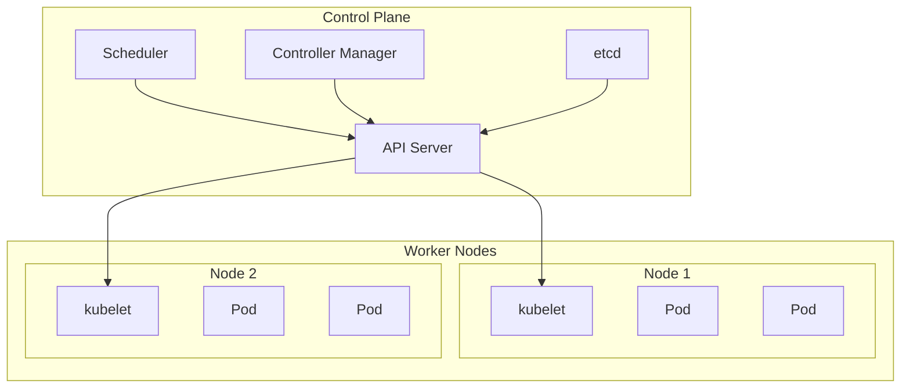

## 📦 사용하는 기술 스택

- **Docker**: 24.0+
- **Docker Swarm**: Docker Engine 내장
- **Kubernetes (k8s)**: 1.28+
- **kubectl**: 1.28+
- **Docker Compose**: 2.20+

## 🚀 TL;DR

**컨테이너 오케스트레이터(Container Orchestrator)** 는 여러 컨테이너를 자동으로 관리하고 배포하는 도구다. 마치 오케스트라 지휘자가 여러 악기를 조화롭게 연주하도록 지휘하는 것처럼, 오케스트레이터는 수많은 컨테이너들을 효율적으로 관리한다.

- **Docker Swarm**: Docker 네이티브 오케스트레이션 도구, 설정이 간단하고 학습 곡선이 완만함
- **Kubernetes**: 구글이 개발한 강력한 오케스트레이션 플랫폼, 복잡하지만 기능이 풍부함
- **주요 기능**: 자동 스케일링, 로드 밸런싱, 롤링 업데이트, 서비스 디스커버리, 헬스 체크
- **선택 기준**: 프로젝트 규모와 복잡성에 따라 결정
- **실무 활용**: MSA 아키텍처, CI/CD 파이프라인, 클라우드 네이티브 애플리케이션

## 📓 실습 환경

```bash
# Docker Swarm 실습 환경 구성
git clone https://github.com/example/orchestrator-tutorial
cd orchestrator-tutorial/docker-swarm

# Kubernetes 실습 환경 구성  
cd ../kubernetes
```

## 🎼 컨테이너 오케스트레이터란?

### 개념 소개

**컨테이너 오케스트레이터(Container Orchestrator)**는 여러 개의 컨테이너를 자동으로 배포, 관리, 확장, 네트워킹하는 도구다. 하나의 애플리케이션이 여러 개의 마이크로서비스로 구성되어 있을 때, 각각을 수동으로 관리하는 것은 거의 불가능하다.

오케스트레이터는 다음과 같은 복잡한 작업들을 자동화한다:

- **배포 관리**: 컨테이너를 적절한 서버에 배치
- **스케일링**: 트래픽에 따라 컨테이너 수를 조절
- **로드 밸런싱**: 요청을 여러 컨테이너에 분산
- **장애 복구**: 문제가 생긴 컨테이너를 자동으로 재시작
- **서비스 디스커버리**: 서비스 간 통신을 자동으로 설정

[시각적 표현 넣기: 오케스트레이터가 없을 때 vs 있을 때의 컨테이너 관리 차이]

### 왜 오케스트레이터가 필요한가?

현대의 애플리케이션은 **마이크로서비스 아키텍처(MSA)**로 구성되는 경우가 많다. 하나의 서비스가 수십 개의 작은 서비스로 나뉘어져 있고, 각각이 컨테이너로 실행된다.

```bash
# 수동으로 관리해야 하는 작업들 (오케스트레이터 없이)
docker run -d webapp:v1
docker run -d database:v1  
docker run -d redis:v1
docker run -d nginx:v1

# 각 컨테이너의 상태를 수동으로 체크
docker ps
docker logs webapp
docker logs database

# 스케일링도 수동으로
docker run -d webapp:v1  # 추가 인스턴스
docker run -d webapp:v1  # 또 추가...
```

> 컨테이너가 10개만 되어도 수동 관리는 악몽이 된다. 
> 오케스트레이터는 이런 반복적이고 복잡한 작업을 자동화해서 개발자가 비즈니스 로직에 집중할 수 있게 해준다.
{: .prompt-tip}

## 🐳 Docker Swarm: 간편한 시작

### Docker Swarm 소개

**Docker Swarm**은 Docker에 내장된 **네이티브 오케스트레이션** 도구다. Docker를 이미 사용하고 있다면 추가 설치 없이 바로 사용할 수 있다는 큰 장점이 있다.

### 주요 특징

- **간단한 설정**: Docker CLI로 모든 작업 가능
- **낮은 학습 곡선**: Docker Compose와 유사한 문법
- **Docker 네이티브**: 추가 도구 설치 불필요
- **적은 리소스 사용**: 가벼운 오버헤드

### Docker Swarm 실습

```bash
# 1. Swarm 모드 초기화
docker swarm init
# 출력: Swarm initialized: current node (abc123) is now a manager.

# 2. 노드 상태 확인
docker node ls
# 출력: ID    HOSTNAME    STATUS    AVAILABILITY    MANAGER STATUS
#       abc*  docker-vm   Ready     Active          Leader

# 3. 서비스 배포
docker service create --name web --replicas 3 --publish 80:80 nginx
# 출력: Service created: web

# 4. 서비스 상태 확인
docker service ls
# 출력: ID     NAME    MODE         REPLICAS    IMAGE
#       def    web     replicated   3/3         nginx:latest

# 5. 스케일링
docker service scale web=5
# 출력: web scaled to 5 overall progress: 5 out of 5 tasks
```

### Docker Compose를 Swarm으로 배포

```yaml
# docker-compose.yml
version: '3.8'
services:
  web:
    image: nginx:alpine
    ports:
      - "80:80"
    deploy:
      replicas: 3
      update_config:
        parallelism: 1
        delay: 10s
      restart_policy:
        condition: on-failure
  
  app:
    image: myapp:latest
    deploy:
      replicas: 2
    networks:
      - app-network

networks:
  app-network:
    driver: overlay
```

```bash
# Swarm에 스택 배포
docker stack deploy -c docker-compose.yml myapp
# 출력: Creating network myapp_app-network
#       Creating service myapp_web
#       Creating service myapp_app
```

### 실무에서의 활용

**Docker Swarm**은 다음과 같은 상황에서 특히 유용하다:

- **소규모 팀이나 프로젝트**: 복잡한 설정 없이 빠른 시작
- **Docker 중심 환경**: 이미 Docker를 잘 알고 있는 팀
- **프로토타입이나 개발 환경**: 빠른 테스트와 검증
- **레거시 시스템 마이그레이션**: 기존 Docker Compose에서 쉬운 전환

## ⚓ Kubernetes: 강력한 플랫폼

### Kubernetes 소개

**Kubernetes(쿠버네티스, k8s)**는 구글이 개발한 **컨테이너 오케스트레이션 플랫폼**이다. 현재 클라우드 네이티브 생태계의 사실상 표준이 되었으며, 대부분의 클라우드 서비스 제공업체가 관리형 Kubernetes 서비스를 제공한다.

### 핵심 개념과 아키텍처

Kubernetes는 **선언적 설정(Declarative Configuration)**을 기반으로 동작한다. "어떻게 해라"가 아니라 "이런 상태가 되어야 한다"고 선언하면, Kubernetes가 알아서 그 상태를 만들고 유지한다.

[시각적 표현 넣기: Kubernetes 클러스터 아키텍처 다이어그램]



### 주요 구성 요소

- **Pod**: 가장 작은 배포 단위, 하나 이상의 컨테이너를 포함
- **Service**: Pod들에 대한 네트워크 접근을 제공
- **Deployment**: Pod의 배포와 업데이트를 관리
- **Namespace**: 리소스를 논리적으로 분리하는 가상 클러스터

### Kubernetes 실습

```yaml
# nginx-deployment.yaml
apiVersion: apps/v1
kind: Deployment
metadata:
  name: nginx-deployment
  labels:
    app: nginx
spec:
  replicas: 3
  selector:
    matchLabels:
      app: nginx
  template:
    metadata:
      labels:
        app: nginx
    spec:
      containers:
      - name: nginx
        image: nginx:1.20
        ports:
        - containerPort: 80
        resources:
          requests:
            memory: "64Mi"
            cpu: "250m"
          limits:
            memory: "128Mi"
            cpu: "500m"
```

```bash
# 1. 배포 생성
kubectl apply -f nginx-deployment.yaml
# 출력: deployment.apps/nginx-deployment created

# 2. 배포 상태 확인
kubectl get deployments
# 출력: NAME               READY   UP-TO-DATE   AVAILABLE   AGE
#       nginx-deployment   3/3     3            3           30s

# 3. Pod 확인
kubectl get pods
# 출력: NAME                                READY   STATUS    RESTARTS   AGE
#       nginx-deployment-6b7d88fdb-abc123   1/1     Running   0          30s
#       nginx-deployment-6b7d88fdb-def456   1/1     Running   0          30s
#       nginx-deployment-6b7d88fdb-ghi789   1/1     Running   0          30s

# 4. 서비스 생성
kubectl expose deployment nginx-deployment --type=LoadBalancer --port=80
# 출력: service/nginx-deployment exposed

# 5. 스케일링
kubectl scale deployment nginx-deployment --replicas=5
# 출력: deployment.apps/nginx-deployment scaled
```

### 고급 기능들

**Kubernetes**는 엔터프라이즈급 기능들을 제공한다:

```yaml
# hpa.yaml - 자동 스케일링
apiVersion: autoscaling/v2
kind: HorizontalPodAutoscaler
metadata:
  name: nginx-hpa
spec:
  scaleTargetRef:
    apiVersion: apps/v1
    kind: Deployment
    name: nginx-deployment
  minReplicas: 3
  maxReplicas: 10
  metrics:
  - type: Resource
    resource:
      name: cpu
      target:
        type: Utilization
        averageUtilization: 70
```

```bash
# HPA 적용
kubectl apply -f hpa.yaml
# 출력: horizontalpodautoscaler.autoscaling/nginx-hpa created

# HPA 상태 확인
kubectl get hpa
# 출력: NAME        REFERENCE                     TARGETS   MINPODS   MAXPODS   REPLICAS   AGE
#       nginx-hpa   Deployment/nginx-deployment   15%/70%   3         10        3          1m
```

### 실무에서의 활용

**Kubernetes**는 다음과 같은 상황에서 필수적이다:

- **대규모 프로덕션 환경**: 수백, 수천 개의 서비스 관리
- **클라우드 네이티브 애플리케이션**: MSA, 서버리스 등
- **DevOps/MLOps 파이프라인**: 자동화된 배포와 운영
- **멀티 클라우드 전략**: 벤더 종속성 없는 배포

## ⚖️ Docker Swarm vs Kubernetes 비교

### 복잡성과 학습 곡선

| 기준 | Docker Swarm | Kubernetes |
|------|--------------|------------|
| **학습 난이도** | 낮음 (Docker 지식만 있으면 됨) | 높음 (새로운 개념들 학습 필요) |
| **설정 복잡성** | 간단 (Docker CLI 사용) | 복잡 (YAML 파일, kubectl 사용) |
| **운영 복잡성** | 낮음 | 높음 |

### 기능과 확장성

```bash
# Docker Swarm - 간단한 스케일링
docker service scale web=10

# Kubernetes - 더 세밀한 제어
kubectl scale deployment web --replicas=10
kubectl autoscale deployment web --cpu-percent=50 --min=1 --max=10
```

| 기능 | Docker Swarm | Kubernetes |
|------|--------------|------------|
| **자동 스케일링** | 제한적 | 강력함 (HPA, VPA, CA) |
| **롤링 업데이트** | 기본 지원 | 고급 전략 지원 |
| **서비스 메시** | 기본적 | Istio 등 연계 가능 |
| **모니터링** | 제한적 | Prometheus 등 생태계 |

### 선택 가이드

> **Docker Swarm을 선택해야 하는 경우:**
> - 팀이 Docker에 익숙하고 빠른 시작이 필요할 때
> - 소규모 애플리케이션이나 개발/테스트 환경
> - 복잡한 오케스트레이션 기능이 필요 없을 때
{: .prompt-tip}

> **Kubernetes를 선택해야 하는 경우:**
> - 대규모 프로덕션 환경
> - 복잡한 마이크로서비스 아키텍처
> - 클라우드 네이티브 기능이 필요할 때
> - 장기적인 확장성을 고려해야 할 때
{: .prompt-warning}

## 🔧 핵심 명령어 마스터하기

### Docker Swarm 필수 명령어

**Docker Swarm**의 모든 작업은 익숙한 `docker` 명령어를 통해 수행된다. 다음은 실무에서 가장 자주 사용되는 명령어들이다.

#### 클러스터 관리 명령어

```bash
# 1. Swarm 모드 초기화 (매니저 노드에서 실행)
docker swarm init --advertise-addr 192.168.1.100
# 출력: Swarm initialized: current node (abc123def456) is now a manager.
#       To add a worker to this swarm, run the following command:
#       docker swarm join --token SWMTKN-1-xxxx 192.168.1.100:2377

# 2. 워커 노드 추가 (각 워커 노드에서 실행)
docker swarm join --token SWMTKN-1-xxxx 192.168.1.100:2377
# 출력: This node joined a swarm as a worker.

# 3. 클러스터 노드 상태 확인
docker node ls
# 출력: ID              HOSTNAME    STATUS    AVAILABILITY    MANAGER STATUS    ENGINE VERSION
#       abc123def456 *  manager-1   Ready     Active          Leader            20.10.7
#       def456ghi789    worker-1    Ready     Active                            20.10.7
#       ghi789jkl012    worker-2    Ready     Active                            20.10.7

# 4. 노드에 라벨 추가 (특정 노드에 서비스 배치용)
docker node update --label-add environment=production worker-1
# 출력: worker-1

# 5. 노드 상세 정보 확인
docker node inspect worker-1 --pretty
# 출력: 노드의 상세 정보 (라벨, 리소스, 상태 등)
```

#### 서비스 관리 명령어

```bash
# 1. 서비스 생성 (기본)
docker service create --name web --replicas 3 --publish 80:80 nginx:alpine
# 출력: Service created: ksj9d0k2l3m4n5o6p7q8r9s0

# 2. 서비스 생성 (고급 옵션)
docker service create \
  --name api-server \
  --replicas 5 \
  --publish 8080:8080 \
  --env DATABASE_URL=postgresql://... \
  --mount type=volume,source=api-data,target=/data \
  --constraint 'node.labels.environment == production' \
  --update-parallelism 2 \
  --update-delay 10s \
  myapp:v1.2.0
# 출력: Service created

# 3. 서비스 목록 확인
docker service ls
# 출력: ID        NAME         MODE         REPLICAS    IMAGE         PORTS
#       ksj9d0k   web          replicated   3/3         nginx:alpine  *:80->80/tcp
#       lmn4o5p   api-server   replicated   5/5         myapp:v1.2.0  *:8080->8080/tcp

# 4. 서비스 상세 정보 확인
docker service inspect web --pretty
# 출력: 서비스의 상세 설정 정보

# 5. 서비스 로그 확인
docker service logs web --follow --tail 100
# 출력: 모든 replica의 통합 로그

# 6. 서비스 스케일링
docker service scale web=7 api-server=10
# 출력: web scaled to 7, api-server scaled to 10

# 7. 서비스 업데이트 (무중단 배포)
docker service update --image myapp:v1.3.0 api-server
# 출력: 롤링 업데이트 진행 상황

# 8. 서비스 제거
docker service rm web api-server
# 출력: web, api-server
```

#### 스택 관리 명령어

```bash
# 1. 스택 배포
docker stack deploy -c docker-compose.yml myapp-stack
# 출력: Creating network myapp-stack_default
#       Creating service myapp-stack_web
#       Creating service myapp-stack_db

# 2. 스택 목록 확인
docker stack ls
# 출력: NAME          SERVICES    ORCHESTRATOR
#       myapp-stack   2           Swarm

# 3. 스택 서비스 확인
docker stack services myapp-stack
# 출력: 스택에 포함된 모든 서비스 목록

# 4. 스택 제거
docker stack rm myapp-stack
# 출력: Removing service myapp-stack_web
#       Removing service myapp-stack_db
#       Removing network myapp-stack_default
```

### Kubernetes 필수 명령어

**Kubernetes**는 `kubectl` 명령어를 통해 모든 작업을 수행한다. 명령어가 많지만 패턴을 이해하면 쉽게 익힐 수 있다.

#### 클러스터 정보 및 기본 명령어

```bash
# 1. 클러스터 정보 확인
kubectl cluster-info
# 출력: Kubernetes control plane is running at https://127.0.0.1:6443
#       CoreDNS is running at https://127.0.0.1:6443/api/v1/namespaces/kube-system/services/kube-dns:dns/proxy

# 2. 노드 정보 확인
kubectl get nodes -o wide
# 출력: NAME       STATUS   ROLES    AGE   VERSION   INTERNAL-IP   EXTERNAL-IP   OS-IMAGE             KERNEL-VERSION      CONTAINER-RUNTIME
#       master-1   Ready    master   10d   v1.28.0   10.0.1.10     <none>        Ubuntu 20.04.3 LTS   5.4.0-88-generic    containerd://1.6.6
#       worker-1   Ready    <none>   10d   v1.28.0   10.0.1.11     <none>        Ubuntu 20.04.3 LTS   5.4.0-88-generic    containerd://1.6.6

# 3. 네임스페이스 확인
kubectl get namespaces
# 출력: NAME              STATUS   AGE
#       default           Active   10d
#       kube-system       Active   10d
#       kube-public       Active   10d
#       kube-node-lease   Active   10d

# 4. 모든 리소스 확인 (특정 네임스페이스)
kubectl get all -n kube-system
# 출력: 해당 네임스페이스의 모든 Kubernetes 리소스
```

#### Pod 관리 명령어

```bash
# 1. Pod 목록 확인
kubectl get pods
# 출력: NAME                     READY   STATUS    RESTARTS   AGE
#       nginx-6d4cf56db6-abc123   1/1     Running   0          5m

# 2. Pod 상세 정보 확인
kubectl describe pod nginx-6d4cf56db6-abc123
# 출력: Pod의 상세 정보 (이벤트, 볼륨, 환경변수 등)

# 3. Pod 로그 확인
kubectl logs nginx-6d4cf56db6-abc123 --follow --tail=100
# 출력: Pod의 실시간 로그

# 4. Pod 내부 접속 (디버깅용)
kubectl exec -it nginx-6d4cf56db6-abc123 -- /bin/bash
# 출력: Pod 내부 셸 접속

# 5. Pod 포트 포워딩 (로컬 테스트용)
kubectl port-forward nginx-6d4cf56db6-abc123 8080:80
# 출력: Forwarding from 127.0.0.1:8080 -> 80
#       Forwarding from [::1]:8080 -> 80

# 6. Pod 삭제
kubectl delete pod nginx-6d4cf56db6-abc123
# 출력: pod "nginx-6d4cf56db6-abc123" deleted
```

#### Deployment 관리 명령어

```bash
# 1. Deployment 생성
kubectl create deployment nginx --image=nginx:1.20 --replicas=3
# 출력: deployment.apps/nginx created

# 2. Deployment 목록 확인
kubectl get deployments
# 출력: NAME    READY   UP-TO-DATE   AVAILABLE   AGE
#       nginx   3/3     3            3           2m

# 3. Deployment 스케일링
kubectl scale deployment nginx --replicas=5
# 출력: deployment.apps/nginx scaled

# 4. Deployment 이미지 업데이트 (롤링 업데이트)
kubectl set image deployment/nginx nginx=nginx:1.21
# 출력: deployment.apps/nginx image updated

# 5. 롤아웃 상태 확인
kubectl rollout status deployment/nginx
# 출력: Waiting for deployment "nginx" rollout to finish: 2 of 5 updated replicas are available...
#       deployment "nginx" successfully rolled out

# 6. 롤아웃 히스토리 확인
kubectl rollout history deployment/nginx
# 출력: REVISION  CHANGE-CAUSE
#       1         <none>
#       2         <none>

# 7. 이전 버전으로 롤백
kubectl rollout undo deployment/nginx --to-revision=1
# 출력: deployment.apps/nginx rolled back
```

#### Service 관리 명령어

```bash
# 1. Service 생성 (Deployment 노출)
kubectl expose deployment nginx --port=80 --type=LoadBalancer
# 출력: service/nginx exposed

# 2. Service 목록 확인
kubectl get services
# 출력: NAME         TYPE           CLUSTER-IP      EXTERNAL-IP   PORT(S)        AGE
#       kubernetes   ClusterIP      10.96.0.1       <none>        443/TCP        10d
#       nginx        LoadBalancer   10.96.180.145   <pending>     80:30859/TCP   1m

# 3. Service 상세 정보 확인
kubectl describe service nginx
# 출력: Service의 상세 정보 (엔드포인트, 셀렉터 등)

# 4. 엔드포인트 확인
kubectl get endpoints nginx
# 출력: NAME    ENDPOINTS                     AGE
#       nginx   10.244.1.3:80,10.244.2.4:80   2m
```

## 📄 YAML 설정 파일 완전 가이드

### Docker Swarm Compose 파일

```yaml
# docker-compose.yml - Docker Swarm용 설정
version: '3.8'  # Compose 파일 버전 (3.8은 Swarm 모드 기능 지원)

# 네트워크 정의
networks:
  # 오버레이 네트워크: 여러 노드 간 통신 가능
  frontend:
    driver: overlay
    attachable: true  # 개별 컨테이너도 연결 가능
  backend:
    driver: overlay
    # 네트워크 암호화 (성능 오버헤드 있음)
    driver_opts:
      encrypted: "true"

# 볼륨 정의
volumes:
  # 명명된 볼륨: 데이터 영속성 보장
  db-data:
    driver: local
  app-logs:
    driver: local
    # 외부 NFS 볼륨 사용 예시
    # driver_opts:
    #   type: nfs
    #   o: addr=192.168.1.100,rw
    #   device: ":/path/to/nfs/share"

# 서비스 정의
services:
  # 웹 프론트엔드 서비스
  web:
    image: nginx:alpine
    ports:
      - "80:80"      # 호스트:컨테이너 포트 매핑
      - "443:443"
    
    # 배포 설정 (Swarm 모드에서만 유효)
    deploy:
      replicas: 3    # 복제본 개수
      
      # 업데이트 설정
      update_config:
        parallelism: 1       # 동시 업데이트할 컨테이너 수
        delay: 10s          # 각 업데이트 간 대기 시간
        failure_action: rollback  # 실패 시 롤백
        monitor: 60s        # 모니터링 시간
        max_failure_ratio: 0.3    # 최대 실패 허용 비율
      
      # 재시작 정책
      restart_policy:
        condition: on-failure  # 실패 시에만 재시작
        delay: 5s             # 재시작 대기 시간
        max_attempts: 3       # 최대 재시작 횟수
        window: 120s          # 재시작 윈도우 시간
      
      # 리소스 제한
      resources:
        limits:
          cpus: '0.50'        # CPU 제한 (0.5 코어)
          memory: 512M        # 메모리 제한
        reservations:
          cpus: '0.25'        # 최소 CPU 보장
          memory: 256M        # 최소 메모리 보장
      
      # 배치 제약 조건
      placement:
        constraints:
          - "node.role==worker"           # 워커 노드에만 배치
          - "node.labels.zone==frontend"  # 특정 라벨이 있는 노드
        preferences:
          - spread: node.labels.zone      # 가용영역 간 분산 배치
    
    # 네트워크 연결
    networks:
      - frontend
      - backend
    
    # 설정 파일 마운트
    configs:
      - source: nginx_config
        target: /etc/nginx/nginx.conf
    
    # 민감 정보 마운트
    secrets:
      - ssl_cert
      - ssl_key
    
    # 헬스체크 설정
    healthcheck:
      test: ["CMD", "curl", "-f", "http://localhost/health"]
      interval: 30s         # 체크 간격
      timeout: 10s          # 타임아웃
      retries: 3           # 재시도 횟수
      start_period: 40s    # 시작 후 대기 시간

  # 애플리케이션 서버
  app:
    image: myapp:v1.2.0
    
    # 환경 변수 설정
    environment:
      - NODE_ENV=production
      - DATABASE_URL=postgresql://user:pass@db:5432/myapp
      - REDIS_URL=redis://redis:6379
    
    # 외부 환경 변수 파일 사용
    env_file:
      - .env.production
    
    deploy:
      replicas: 5
      
      # 전역 서비스 (모든 노드에 하나씩)
      # mode: global
      
      placement:
        constraints:
          - "node.labels.app-tier==backend"
      
      # 로그 설정
      logging:
        driver: json-file
        options:
          max-size: "10m"
          max-file: "3"
    
    networks:
      - backend
    
    # 볼륨 마운트
    volumes:
      - app-logs:/var/log/app
    
    # 다른 서비스에 의존성
    depends_on:
      - db
      - redis

  # 데이터베이스 서비스
  db:
    image: postgres:13
    
    environment:
      - POSTGRES_DB=myapp
      - POSTGRES_USER=user
      - POSTGRES_PASSWORD_FILE=/run/secrets/db_password
    
    deploy:
      replicas: 1
      placement:
        constraints:
          - "node.labels.storage==ssd"  # SSD 스토리지가 있는 노드
      restart_policy:
        condition: any  # 항상 재시작
    
    networks:
      - backend
    
    volumes:
      - db-data:/var/lib/postgresql/data
    
    secrets:
      - db_password

  # 캐시 서버
  redis:
    image: redis:6-alpine
    
    deploy:
      replicas: 1
      resources:
        limits:
          memory: 256M
    
    networks:
      - backend
    
    # 커맨드 오버라이드
    command: redis-server --appendonly yes --maxmemory 200mb

# 설정 파일 정의
configs:
  nginx_config:
    file: ./nginx.conf  # 로컬 파일에서 읽기
    # external: true    # 외부에서 생성된 설정 사용

# 민감 정보 정의
secrets:
  ssl_cert:
    file: ./ssl/cert.pem
  ssl_key:
    file: ./ssl/key.pem
  db_password:
    external: true  # 외부에서 생성된 시크릿 사용
```

### Kubernetes 설정 파일

```yaml
# kubernetes/namespace.yaml - 네임스페이스 정의
apiVersion: v1
kind: Namespace
metadata:
  name: myapp-production
  labels:
    environment: production
    team: backend

---
# kubernetes/deployment.yaml - 애플리케이션 배포 정의
apiVersion: apps/v1
kind: Deployment
metadata:
  name: myapp-deployment
  namespace: myapp-production
  labels:
    app: myapp
    version: v1.2.0
  # 주석으로 메타데이터 추가
  annotations:
    deployment.kubernetes.io/revision: "1"
    kubernetes.io/change-cause: "Initial deployment"

spec:
  # 복제본 개수
  replicas: 5
  
  # 롤링 업데이트 전략
  strategy:
    type: RollingUpdate
    rollingUpdate:
      maxUnavailable: 25%    # 업데이트 중 사용 불가한 Pod 비율
      maxSurge: 25%          # 업데이트 중 추가 생성 가능한 Pod 비율
  
  # Pod 선택 규칙
  selector:
    matchLabels:
      app: myapp
  
  # Pod 템플릿 정의
  template:
    metadata:
      labels:
        app: myapp
        version: v1.2.0
      annotations:
        # Prometheus 모니터링 설정
        prometheus.io/scrape: "true"
        prometheus.io/port: "8080"
        prometheus.io/path: "/metrics"
    
    spec:
      # 서비스 어카운트 (권한 관리)
      serviceAccountName: myapp-sa
      
      # 보안 컨텍스트 (Pod 레벨)
      securityContext:
        runAsUser: 1000      # 실행 사용자 ID
        runAsGroup: 3000     # 실행 그룹 ID
        fsGroup: 2000        # 파일시스템 그룹 ID
      
      # 초기화 컨테이너 (메인 컨테이너 실행 전)
      initContainers:
      - name: db-migration
        image: myapp:v1.2.0
        command: ['npm', 'run', 'migrate']
        env:
        - name: DATABASE_URL
          valueFrom:
            secretKeyRef:
              name: db-secret
              key: url
      
      # 메인 컨테이너
      containers:
      - name: myapp
        image: myapp:v1.2.0
        
        # 컨테이너 포트 정의
        ports:
        - containerPort: 8080
          name: http
          protocol: TCP
        - containerPort: 9090
          name: metrics
          protocol: TCP
        
        # 환경 변수 설정
        env:
        - name: NODE_ENV
          value: "production"
        - name: PORT
          value: "8080"
        # ConfigMap에서 환경 변수 가져오기
        - name: API_BASE_URL
          valueFrom:
            configMapKeyRef:
              name: myapp-config
              key: api-base-url
        # Secret에서 환경 변수 가져오기
        - name: DB_PASSWORD
          valueFrom:
            secretKeyRef:
              name: db-secret
              key: password
        
        # ConfigMap 전체를 환경 변수로 로드
        envFrom:
        - configMapRef:
            name: myapp-config
        - secretRef:
            name: myapp-secrets
        
        # 리소스 요청 및 제한
        resources:
          requests:
            memory: "256Mi"   # 최소 메모리 요청
            cpu: "250m"       # 최소 CPU 요청 (0.25 코어)
          limits:
            memory: "512Mi"   # 최대 메모리 제한
            cpu: "500m"       # 최대 CPU 제한 (0.5 코어)
        
        # 볼륨 마운트
        volumeMounts:
        - name: app-logs
          mountPath: /var/log/app
        - name: config-volume
          mountPath: /etc/config
          readOnly: true
        - name: secret-volume
          mountPath: /etc/secrets
          readOnly: true
        
        # 헬스체크 설정
        livenessProbe:         # 컨테이너 생존 여부 체크
          httpGet:
            path: /health
            port: 8080
          initialDelaySeconds: 30  # 시작 후 대기 시간
          periodSeconds: 10        # 체크 간격
          timeoutSeconds: 5        # 타임아웃
          failureThreshold: 3      # 실패 허용 횟수
        
        readinessProbe:        # 트래픽 수신 준비 여부 체크
          httpGet:
            path: /ready
            port: 8080
          initialDelaySeconds: 5
          periodSeconds: 5
          timeoutSeconds: 3
          failureThreshold: 3
        
        startupProbe:          # 시작 완료 여부 체크 (느린 시작용)
          httpGet:
            path: /startup
            port: 8080
          initialDelaySeconds: 10
          periodSeconds: 10
          timeoutSeconds: 5
          failureThreshold: 30   # 최대 5분 대기 (30 * 10초)
        
        # 보안 컨텍스트 (컨테이너 레벨)
        securityContext:
          allowPrivilegeEscalation: false
          readOnlyRootFilesystem: true
          runAsNonRoot: true
          capabilities:
            drop:
            - ALL
      
      # 볼륨 정의
      volumes:
      - name: app-logs
        emptyDir: {}           # 임시 볼륨
      - name: config-volume
        configMap:
          name: myapp-config
          defaultMode: 0644    # 파일 권한
      - name: secret-volume
        secret:
          secretName: myapp-secrets
          defaultMode: 0600    # 보안 파일 권한
      
      # Pod 배치 규칙
      nodeSelector:
        kubernetes.io/arch: amd64    # 특정 아키텍처 노드 선택
      
      # 고급 배치 규칙
      affinity:
        # Pod 안티 어피니티 (같은 노드에 배치 방지)
        podAntiAffinity:
          preferredDuringSchedulingIgnoredDuringExecution:
          - weight: 100
            podAffinityTerm:
              labelSelector:
                matchExpressions:
                - key: app
                  operator: In
                  values:
                  - myapp
              topologyKey: kubernetes.io/hostname
      
      # 톨러레이션 (특정 노드의 taint 허용)
      tolerations:
      - key: "app-tier"
        operator: "Equal"
        value: "backend"
        effect: "NoSchedule"

---
# kubernetes/service.yaml - 서비스 정의
apiVersion: v1
kind: Service
metadata:
  name: myapp-service
  namespace: myapp-production
  labels:
    app: myapp
  annotations:
    # AWS Load Balancer 설정 (EKS 환경)
    service.beta.kubernetes.io/aws-load-balancer-type: "nlb"
    service.beta.kubernetes.io/aws-load-balancer-cross-zone-load-balancing-enabled: "true"

spec:
  type: LoadBalancer      # 서비스 타입 (ClusterIP, NodePort, LoadBalancer)
  
  # 로드 밸런서 클래스 지정 (여러 LB 컨트롤러가 있을 때)
  loadBalancerClass: service.k8s.aws/nlb
  
  # 포트 설정
  ports:
  - port: 80              # 서비스 포트
    targetPort: 8080      # 컨테이너 포트
    protocol: TCP
    name: http
  - port: 443
    targetPort: 8080
    protocol: TCP
    name: https
  
  # Pod 선택 규칙
  selector:
    app: myapp
  
  # 세션 어피니티 (같은 클라이언트를 같은 Pod로)
  sessionAffinity: ClientIP
  sessionAffinityConfig:
    clientIP:
      timeoutSeconds: 10800  # 3시간

---
# kubernetes/configmap.yaml - 설정 정보
apiVersion: v1
kind: ConfigMap
metadata:
  name: myapp-config
  namespace: myapp-production

data:
  # 키-값 형태의 설정
  api-base-url: "https://api.example.com"
  log-level: "info"
  max-connections: "100"
  
  # 파일 형태의 설정
  app.properties: |
    server.port=8080
    server.servlet.context-path=/api
    spring.datasource.pool.max-active=20
    spring.cache.type=redis
  
  nginx.conf: |
    events {
        worker_connections 1024;
    }
    http {
        upstream backend {
            server myapp-service:8080;
        }
        server {
            listen 80;
            location / {
                proxy_pass http://backend;
            }
        }
    }

---
# kubernetes/secret.yaml - 민감 정보
apiVersion: v1
kind: Secret
metadata:
  name: myapp-secrets
  namespace: myapp-production

type: Opaque
data:
  # Base64로 인코딩된 값들
  database-password: cGFzc3dvcmQxMjM=    # password123
  api-key: YWJjZGVmZ2hpams=              # abcdefghijk
  ssl-cert: LS0tLS1CRUdJTi0tLS0t...      # SSL 인증서

---
# kubernetes/hpa.yaml - 수평 자동 스케일링
apiVersion: autoscaling/v2
kind: HorizontalPodAutoscaler
metadata:
  name: myapp-hpa
  namespace: myapp-production

spec:
  # 스케일링 대상 지정
  scaleTargetRef:
    apiVersion: apps/v1
    kind: Deployment
    name: myapp-deployment
  
  # 스케일링 범위
  minReplicas: 3          # 최소 Pod 수
  maxReplicas: 20         # 최대 Pod 수
  
  # 스케일링 메트릭 정의
  metrics:
  # CPU 사용률 기반 스케일링
  - type: Resource
    resource:
      name: cpu
      target:
        type: Utilization
        averageUtilization: 70    # 평균 CPU 70% 초과 시 스케일 아웃
  
  # 메모리 사용률 기반 스케일링
  - type: Resource
    resource:
      name: memory
      target:
        type: Utilization
        averageUtilization: 80    # 평균 메모리 80% 초과 시 스케일 아웃
  
  # 커스텀 메트릭 기반 스케일링 (예: 큐 길이)
  - type: Pods
    pods:
      metric:
        name: queue_length
      target:
        type: AverageValue
        averageValue: "5"         # Pod당 평균 큐 길이 5개 초과 시
  
  # 스케일링 동작 설정
  behavior:
    scaleUp:
      stabilizationWindowSeconds: 60    # 스케일 업 안정화 시간
      policies:
      - type: Percent
        value: 100              # 최대 100% 증가
        periodSeconds: 15       # 15초마다 평가
    scaleDown:
      stabilizationWindowSeconds: 300   # 스케일 다운 안정화 시간 (5분)
      policies:
      - type: Percent
        value: 10               # 최대 10% 감소
        periodSeconds: 60       # 60초마다 평가
```

> **YAML 파일 작성 팁:**
> - 들여쓰기는 반드시 공백(space) 사용, 탭 사용 금지
> - 주석은 `#`으로 시작하며 설정 이해에 도움
> - 리소스 이름은 소문자와 하이픈 사용 권장
> - 네임스페이스별로 파일을 구분하여 관리
{: .prompt-tip}

## ☁️ AWS 클라우드 연동 가이드

### Amazon ECS (Elastic Container Service)

**Amazon ECS**는 AWS의 완전 관리형 컨테이너 오케스트레이션 서비스다. Docker Swarm과 유사한 간편함을 제공하면서도 AWS 서비스와의 긴밀한 통합을 지원한다.

#### ECS 클러스터 생성

```bash
# AWS CLI를 통한 ECS 클러스터 생성
aws ecs create-cluster --cluster-name myapp-production
# 출력: {
#   "cluster": {
#     "clusterArn": "arn:aws:ecs:us-west-2:123456789012:cluster/myapp-production",
#     "clusterName": "myapp-production",
#     "status": "ACTIVE"
#   }
# }

# Fargate 용량 공급자 등록 (서버리스 컨테이너)
aws ecs put-cluster-capacity-providers \
    --cluster myapp-production \
    --capacity-providers FARGATE FARGATE_SPOT \
    --default-capacity-provider-strategy \
        capacityProvider=FARGATE,weight=1,base=0 \
        capacityProvider=FARGATE_SPOT,weight=4,base=0
# 출력: 용량 공급자 설정 완료
```

#### ECS 태스크 정의 생성

```json
{
  "family": "myapp-task",
  "networkMode": "awsvpc",
  "requiresCompatibilities": ["FARGATE"],
  "cpu": "256",
  "memory": "512",
  "executionRoleArn": "arn:aws:iam::123456789012:role/ecsTaskExecutionRole",
  "taskRoleArn": "arn:aws:iam::123456789012:role/myapp-task-role",
  "containerDefinitions": [
    {
      "name": "myapp",
      "image": "123456789012.dkr.ecr.us-west-2.amazonaws.com/myapp:v1.2.0",
      "portMappings": [
        {
          "containerPort": 8080,
          "protocol": "tcp"
        }
      ],
      "environment": [
        {
          "name": "NODE_ENV",
          "value": "production"
        }
      ],
      "secrets": [
        {
          "name": "DATABASE_PASSWORD",
          "valueFrom": "arn:aws:secretsmanager:us-west-2:123456789012:secret:myapp/db-password"
        }
      ],
      "logConfiguration": {
        "logDriver": "awslogs",
        "options": {
          "awslogs-group": "/ecs/myapp",
          "awslogs-region": "us-west-2",
          "awslogs-stream-prefix": "ecs"
        }
      },
      "healthCheck": {
        "command": ["CMD-SHELL", "curl -f http://localhost:8080/health || exit 1"],
        "interval": 30,
        "timeout": 5,
        "retries": 3,
        "startPeriod": 60
      }
    }
  ]
}
```

```bash
# 태스크 정의 등록
aws ecs register-task-definition --cli-input-json file://myapp-task-definition.json
# 출력: 태스크 정의 등록 완료

# ECS 서비스 생성 (Application Load Balancer 연동)
aws ecs create-service \
    --cluster myapp-production \
    --service-name myapp-service \
    --task-definition myapp-task:1 \
    --desired-count 3 \
    --launch-type FARGATE \
    --network-configuration "awsvpcConfiguration={subnets=[subnet-12345,subnet-67890],securityGroups=[sg-abcdef],assignPublicIp=ENABLED}" \
    --load-balancers "targetGroupArn=arn:aws:elasticloadbalancing:us-west-2:123456789012:targetgroup/myapp-tg/abc123,containerName=myapp,containerPort=8080"
# 출력: 서비스 생성 완료
```

### Amazon EKS (Elastic Kubernetes Service)

**Amazon EKS**는 AWS의 완전 관리형 Kubernetes 서비스다. Kubernetes의 강력한 기능을 AWS 클라우드에서 안전하고 확장 가능하게 사용할 수 있다.

#### EKS 클러스터 생성

```bash
# eksctl을 사용한 클러스터 생성 (가장 간단)
eksctl create cluster \
    --name myapp-cluster \
    --version 1.28 \
    --region us-west-2 \
    --nodegroup-name standard-workers \
    --node-type m5.large \
    --nodes 3 \
    --nodes-min 1 \
    --nodes-max 4 \
    --managed
# 출력: 클러스터 생성 중... (약 15-20분 소요)

# kubectl 설정 업데이트
aws eks update-kubeconfig --region us-west-2 --name myapp-cluster
# 출력: kubeconfig 업데이트 완료

# 클러스터 정보 확인
kubectl cluster-info
# 출력: Kubernetes control plane is running at https://ABC123.gr7.us-west-2.eks.amazonaws.com
```

#### EKS 클러스터 설정 파일

```yaml
# eksctl-config.yaml - 더 세밀한 클러스터 설정
apiVersion: eksctl.io/v1alpha5
kind: ClusterConfig

metadata:
  name: myapp-cluster
  region: us-west-2
  version: "1.28"

# VPC 설정
vpc:
  subnets:
    private:
      us-west-2a: { id: subnet-12345 }
      us-west-2b: { id: subnet-67890 }
    public:
      us-west-2a: { id: subnet-abcdef }
      us-west-2b: { id: subnet-ghijkl }

# IAM 역할 설정
iam:
  withOIDC: true  # OIDC 제공자 생성 (서비스 어카운트 IAM 역할 연동용)

# 관리형 노드 그룹
managedNodeGroups:
- name: general
  instanceType: m5.large
  minSize: 1
  maxSize: 10
  desiredCapacity: 3
  
  # 스팟 인스턴스 사용 (비용 절약)
  spot: true
  
  # EBS 최적화
  volumeSize: 50
  volumeType: gp3
  
  # 노드 라벨 및 태그
  labels:
    role: general
    environment: production
  
  tags:
    Environment: production
    Team: backend
  
  # 보안 그룹 규칙
  securityGroups:
    withShared: true
    withLocal: true
  
  # SSH 접근 설정
  ssh:
    allow: true
    publicKeyName: myapp-keypair

# Fargate 프로파일 (서버리스 Pod)
fargateProfiles:
- name: fp-default
  selectors:
  - namespace: default
    labels:
      compute-type: fargate
  - namespace: kube-system

# 클러스터 애드온
addons:
- name: vpc-cni
  version: latest
- name: coredns
  version: latest
- name: kube-proxy
  version: latest
- name: aws-ebs-csi-driver
  version: latest

# CloudWatch 로깅
cloudWatch:
  clusterLogging:
    enable: ["audit", "authenticator", "controllerManager"]
```

```bash
# 설정 파일로 클러스터 생성
eksctl create cluster -f eksctl-config.yaml
# 출력: 클러스터 생성 진행

# 클러스터 상태 확인
eksctl get cluster --region us-west-2
# 출력: NAME           REGION      EKSCTL CREATED
#       myapp-cluster  us-west-2   True
```

#### AWS Load Balancer Controller 설치

```bash
# AWS Load Balancer Controller 설치 (ALB/NLB 지원)
curl -o iam_policy.json https://raw.githubusercontent.com/kubernetes-sigs/aws-load-balancer-controller/main/docs/install/iam_policy.json

# IAM 정책 생성
aws iam create-policy \
    --policy-name AWSLoadBalancerControllerIAMPolicy \
    --policy-document file://iam_policy.json

# 서비스 어카운트와 IAM 역할 연결
eksctl create iamserviceaccount \
  --cluster=myapp-cluster \
  --namespace=kube-system \
  --name=aws-load-balancer-controller \
  --attach-policy-arn=arn:aws:iam::123456789012:policy/AWSLoadBalancerControllerIAMPolicy \
  --override-existing-serviceaccounts \
  --approve

# Helm을 통한 AWS Load Balancer Controller 설치
helm repo add eks https://aws.github.io/eks-charts
helm install aws-load-balancer-controller eks/aws-load-balancer-controller \
  -n kube-system \
  --set clusterName=myapp-cluster \
  --set serviceAccount.create=false \
  --set serviceAccount.name=aws-load-balancer-controller
# 출력: AWS Load Balancer Controller 설치 완료
```

#### EKS에서 애플리케이션 배포

```yaml
# eks-deployment.yaml - EKS 환경에 최적화된 배포
apiVersion: apps/v1
kind: Deployment
metadata:
  name: myapp-deployment
  namespace: default
  
spec:
  replicas: 3
  selector:
    matchLabels:
      app: myapp
  
  template:
    metadata:
      labels:
        app: myapp
      annotations:
        # EKS에서 Fargate 사용 시 필요
        eks.amazonaws.com/compute-type: fargate
    
    spec:
      serviceAccountName: myapp-sa
      
      containers:
      - name: myapp
        # ECR 이미지 사용
        image: 123456789012.dkr.ecr.us-west-2.amazonaws.com/myapp:v1.2.0
        
        ports:
        - containerPort: 8080
        
        env:
        - name: AWS_REGION
          value: us-west-2
        # AWS Secrets Manager에서 값 가져오기
        - name: DB_PASSWORD
          valueFrom:
            secretKeyRef:
              name: aws-secret
              key: password
        
        resources:
          requests:
            memory: "256Mi"
            cpu: "250m"
          limits:
            memory: "512Mi"
            cpu: "500m"

---
# ALB Ingress 설정
apiVersion: networking.k8s.io/v1
kind: Ingress
metadata:
  name: myapp-ingress
  annotations:
    # AWS Application Load Balancer 사용
    kubernetes.io/ingress.class: alb
    alb.ingress.kubernetes.io/scheme: internet-facing
    alb.ingress.kubernetes.io/target-type: ip
    
    # SSL 설정
    alb.ingress.kubernetes.io/certificate-arn: arn:aws:acm:us-west-2:123456789012:certificate/abc123
    alb.ingress.kubernetes.io/ssl-policy: ELBSecurityPolicy-TLS-1-2-2017-01
    alb.ingress.kubernetes.io/listen-ports: '[{"HTTP": 80}, {"HTTPS": 443}]'
    alb.ingress.kubernetes.io/ssl-redirect: '443'
    
    # 헬스체크 설정
    alb.ingress.kubernetes.io/healthcheck-path: /health
    alb.ingress.kubernetes.io/healthcheck-interval-seconds: '30'
    alb.ingress.kubernetes.io/healthcheck-timeout-seconds: '5'
    alb.ingress.kubernetes.io/healthy-threshold-count: '2'
    alb.ingress.kubernetes.io/unhealthy-threshold-count: '2'

spec:
  rules:
  - host: myapp.example.com
    http:
      paths:
      - path: /
        pathType: Prefix
        backend:
          service:
            name: myapp-service
            port:
              number: 80

---
# Service 정의
apiVersion: v1
kind: Service
metadata:
  name: myapp-service
  
spec:
  type: ClusterIP  # ALB Ingress 사용 시 ClusterIP로 설정
  ports:
  - port: 80
    targetPort: 8080
  selector:
    app: myapp
```

### AWS 서비스와의 통합

#### ECR (Elastic Container Registry) 연동

```bash
# ECR 로그인
aws ecr get-login-password --region us-west-2 | docker login --username AWS --password-stdin 123456789012.dkr.ecr.us-west-2.amazonaws.com

# 이미지 빌드 및 푸시
docker build -t myapp:v1.2.0 .
docker tag myapp:v1.2.0 123456789012.dkr.ecr.us-west-2.amazonaws.com/myapp:v1.2.0
docker push 123456789012.dkr.ecr.us-west-2.amazonaws.com/myapp:v1.2.0
# 출력: 이미지 푸시 완료

# ECR에서 이미지 목록 확인
aws ecr describe-images --repository-name myapp
# 출력: 저장된 이미지 목록
```

#### Secrets Manager 연동

```bash
# Secrets Manager에 비밀 저장
aws secretsmanager create-secret \
    --name myapp/database \
    --description "Database credentials for myapp" \
    --secret-string '{"username":"admin","password":"secretpassword123","host":"myapp-db.cluster-xyz.us-west-2.rds.amazonaws.com","port":"5432"}'
# 출력: 시크릿 생성 완료

# EKS에서 Secrets Manager 사용을 위한 CSI 드라이버 설치
kubectl apply -f https://raw.githubusercontent.com/kubernetes-sigs/secrets-store-csi-driver/main/deploy/secrets-store-csi-driver.yaml

# AWS Secrets Manager CSI 드라이버 설치
kubectl apply -f https://raw.githubusercontent.com/aws/secrets-store-csi-driver-provider-aws/main/deployment/aws-provider-installer.yaml
```

```yaml
# secrets-store.yaml - Secrets Manager를 Kubernetes에서 사용
apiVersion: secrets-store.csi.x-k8s.io/v1
kind: SecretProviderClass
metadata:
  name: myapp-secrets
  
spec:
  provider: aws
  parameters:
    objects: |
      - objectName: "myapp/database"
        objectType: "secretsmanager"
        jmesPath:
          - path: "username"
            objectAlias: "db-username"
          - path: "password"
            objectAlias: "db-password"
          - path: "host"
            objectAlias: "db-host"

---
# Pod에서 Secrets Manager 사용
apiVersion: v1
kind: Pod
metadata:
  name: myapp-pod
  
spec:
  serviceAccountName: myapp-sa  # Secrets Manager 접근 권한 필요
  
  containers:
  - name: myapp
    image: myapp:latest
    
    volumeMounts:
    - name: secrets-store
      mountPath: "/mnt/secrets"
      readOnly: true
    
    env:
    - name: DB_USERNAME
      valueFrom:
        secretKeyRef:
          name: myapp-secrets
          key: db-username
  
  volumes:
  - name: secrets-store
    csi:
      driver: secrets-store.csi.k8s.io
      readOnly: true
      volumeAttributes:
        secretProviderClass: "myapp-secrets"
```

> **AWS 클라우드 연동 시 주의사항:**
> - IAM 권한을 최소 권한 원칙에 따라 설정
> - 비용 최적화를 위해 스팟 인스턴스나 Fargate 활용
> - 보안 그룹과 네트워크 ACL 설정 검토
> - CloudWatch를 통한 모니터링 및 로깅 설정
{: .prompt-warning}

### 비용 최적화 전략

```bash
# EKS 클러스터 비용 분석
aws ce get-cost-and-usage \
    --time-period Start=2024-01-01,End=2024-01-31 \
    --granularity MONTHLY \
    --metrics BlendedCost \
    --group-by Type=DIMENSION,Key=SERVICE
# 출력: 서비스별 비용 분석

# 스팟 인스턴스 사용률 확인
kubectl get nodes -l eks.amazonaws.com/capacityType=SPOT
# 출력: 스팟 인스턴스 노드 목록

# 리소스 사용률 모니터링
kubectl top nodes
kubectl top pods --all-namespaces
# 출력: CPU/메모리 사용률
```

> **AWS 비용 최적화 팁:**
> - 스팟 인스턴스로 최대 90% 비용 절약 가능
> - Fargate는 사용한 만큼만 비용 지불
> - Reserved Instances로 장기 실행 워크로드 비용 절약
> - Cluster Autoscaler로 자동 스케일링하여 불필요한 리소스 제거
{: .prompt-tip}

## 🚀 실무 적용 사례

### MSA 환경에서의 오케스트레이션

**전자상거래 플랫폼**을 예로 들어보자. 다음과 같은 서비스들이 있다고 가정하자:

- **사용자 서비스**: 회원가입, 로그인
- **상품 서비스**: 상품 정보 관리
- **주문 서비스**: 주문 처리
- **결제 서비스**: 결제 처리
- **알림 서비스**: 이메일, SMS 발송

```yaml
# kubernetes/ecommerce-platform.yaml
apiVersion: v1
kind: Namespace
metadata:
  name: ecommerce
---
apiVersion: apps/v1
kind: Deployment
metadata:
  name: user-service
  namespace: ecommerce
spec:
  replicas: 3
  selector:
    matchLabels:
      app: user-service
  template:
    metadata:
      labels:
        app: user-service
    spec:
      containers:
      - name: user-service
        image: ecommerce/user-service:v1.2.0
        ports:
        - containerPort: 8080
        env:
        - name: DB_HOST
          value: "user-db-service"
        - name: REDIS_HOST  
          value: "redis-service"
---
apiVersion: v1
kind: Service
metadata:
  name: user-service
  namespace: ecommerce
spec:
  selector:
    app: user-service
  ports:
  - port: 80
    targetPort: 8080
  type: ClusterIP
```

### CI/CD 파이프라인과의 연동

```bash
# .github/workflows/deploy.yml의 일부
- name: Deploy to Kubernetes
  run: |
    # 이미지 빌드 및 푸시
    docker build -t myregistry.io/myapp:${{ github.sha }} .
    docker push myregistry.io/myapp:${{ github.sha }}
    
    # Kubernetes 배포 업데이트
    kubectl set image deployment/myapp \
      myapp=myregistry.io/myapp:${{ github.sha }} \
      --namespace=production
    
    # 롤아웃 상태 확인
    kubectl rollout status deployment/myapp --namespace=production
    # 출력: deployment "myapp" successfully rolled out
```

### 모니터링과 로깅

```yaml
# monitoring/prometheus-config.yaml
apiVersion: v1
kind: ConfigMap
metadata:
  name: prometheus-config
data:
  prometheus.yml: |
    global:
      scrape_interval: 15s
    scrape_configs:
    - job_name: 'kubernetes-pods'
      kubernetes_sd_configs:
      - role: pod
      relabel_configs:
      - source_labels: [__meta_kubernetes_pod_annotation_prometheus_io_scrape]
        action: keep
        regex: true
```

## 🔮 미래 전망과 트렌드

### 서버리스와 컨테이너의 융합

**Knative**와 같은 기술이 등장하면서 서버리스와 컨테이너 오케스트레이션이 결합되고 있다.

```yaml
# knative-service.yaml
apiVersion: serving.knative.dev/v1
kind: Service
metadata:
  name: hello-world
spec:
  template:
    spec:
      containers:
      - image: gcr.io/knative-samples/helloworld-go
        env:
        - name: TARGET
          value: "Knative"
```

### GitOps와 선언적 배포

**ArgoCD**, **Flux** 등을 통한 GitOps 방식의 배포가 주목받고 있다.

```yaml
# argocd-application.yaml
apiVersion: argoproj.io/v1alpha1
kind: Application
metadata:
  name: myapp
spec:
  source:
    repoURL: https://github.com/myorg/myapp-config
    path: kubernetes
    targetRevision: HEAD
  destination:
    server: https://kubernetes.default.svc
    namespace: myapp
  syncPolicy:
    automated:
      prune: true
      selfHeal: true
```

## 💡 마무리

컨테이너 오케스트레이터는 현대 소프트웨어 개발에서 **필수 도구**가 되었다. **Docker Swarm**으로 시작해서 점진적으로 **Kubernetes**로 발전시키는 것이 일반적인 여정이다.

중요한 것은 도구 자체가 아니라 **비즈니스 요구사항에 맞는 선택**을 하는 것이다. 작은 프로젝트에 Kubernetes를 도입하는 것은 과도할 수 있고, 대규모 시스템에 Docker Swarm만으로는 한계가 있을 수 있다.

> **핵심 포인트:**
> - 오케스트레이터는 수동 작업을 자동화하여 개발자가 비즈니스 로직에 집중할 수 있게 해준다
> - Docker Swarm은 시작하기 쉽고, Kubernetes는 강력하다
> - 프로젝트의 규모와 복잡성에 따라 적절한 도구를 선택하라
> - 클라우드 네이티브 환경에서는 Kubernetes가 사실상의 표준이다
> - AWS 클라우드와의 연동으로 엔터프라이즈급 기능을 쉽게 구현할 수 있다
{: .prompt-tip}

오케스트레이터를 마스터하면 **확장 가능하고 안정적인 시스템**을 구축할 수 있게 된다. 단순히 컨테이너를 실행하는 것을 넘어서, 진정한 **클라우드 네이티브 개발자**로 성장할 수 있는 발판이 될 것이다.