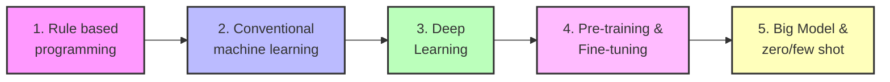
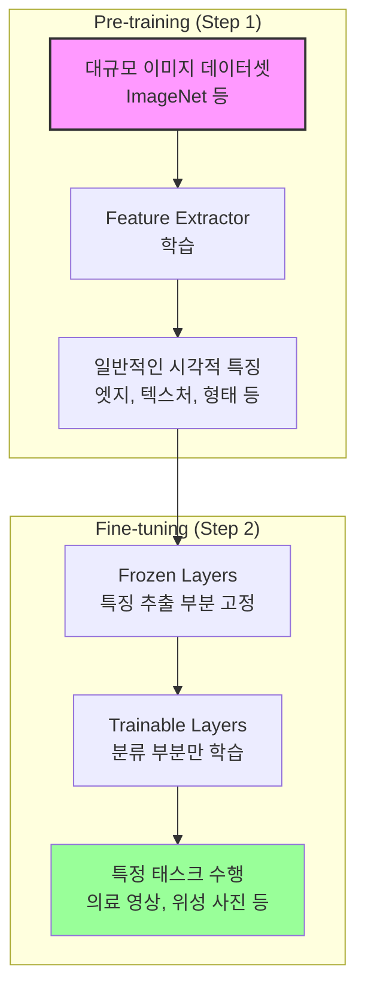
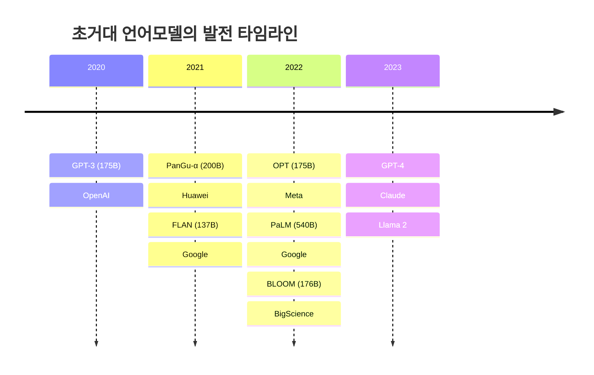

## 🎯 AI, ML, DL의 관계 이해하기

AI(Artificial Intelligence), ML(Machine Learning), DL(Deep Learning)의 관계를 먼저 정리해보자.

### AI, ML, DL의 개념적 포함 관계

**AI(인공지능)**는 감지, 추론, 행동, 적응이 가능한 프로그램을 의미하며, 가장 포괄적인 개념이다. **ML(머신러닝)**은 데이터 기반으로 개발되는 AI의 한 분야이고, **DL(딥러닝)**은 모델의 구조가 뉴럴넷 기반인 ML의 한 분야다.

```python
# AI, ML, DL의 관계를 시각화
import matplotlib.pyplot as plt
import matplotlib.patches as patches

fig, ax = plt.subplots(figsize=(8, 8))

# AI 원 (가장 큰 원)
ai_circle = patches.Circle((0.5, 0.5), 0.4, fill=False, edgecolor='blue', linewidth=2)
ax.add_patch(ai_circle)
ax.text(0.5, 0.85, 'AI', ha='center', fontsize=14, weight='bold')

# ML 원
ml_circle = patches.Circle((0.5, 0.45), 0.25, fill=False, edgecolor='green', linewidth=2)
ax.add_patch(ml_circle)
ax.text(0.5, 0.65, 'ML', ha='center', fontsize=12, weight='bold')

# DL 원
dl_circle = patches.Circle((0.5, 0.4), 0.12, fill=False, edgecolor='red', linewidth=2)
ax.add_patch(dl_circle)
ax.text(0.5, 0.4, 'DL', ha='center', fontsize=10, weight='bold')

ax.set_xlim(0, 1)
ax.set_ylim(0, 1)
ax.set_aspect('equal')
ax.axis('off')
plt.title('AI, ML, DL의 포함 관계', fontsize=16)
plt.show()
```

[시각적 표현 넣기]

## 📊 딥러닝 발전의 5단계 개요

AI/ML/DL 관점에서 개발 방법론은 크게 5단계로 진화해왔다. 이를 소프트웨어 버전으로 표현하면 SW1.0, SW1.5, SW2.0, SW2.5, SW3.0으로 나눌 수 있다.



## 🔧 1단계: 규칙 기반 프로그래밍 (Rule-based Programming)

### 개념 소개

규칙 기반 프로그래밍은 목표 달성에 필요한 모든 연산 방법을 사람이 직접 설계하는 방식이다. 예를 들어, 고양이를 인식하는 프로그램을 만든다면 "귀 길이가 10 이상이고, 코 색깔이 검은색이고, 눈 색깔이 초록색이면 고양이"와 같은 규칙을 사람이 직접 코딩한다.

### 코드 예시

```python
def classify_animal(ear_length, nose_color, eye_color, nose_size):
    """
    규칙 기반으로 동물을 분류하는 함수
    """
    # 고양이 판별 규칙
    if ear_length > 10 and nose_color == "black" and eye_color == "green":
        if nose_size > 3:
            return "CAT"
    
    # 강아지 판별 규칙
    elif ear_length > 15 and nose_color == "brown" and eye_color == "brown":
        return "DOG"
    
    # 기타
    else:
        return "UNKNOWN"

# 사용 예시
result = classify_animal(12, "black", "green", 4)
print(f"분류 결과: {result}")  # 출력: 분류 결과: CAT
```

### 머신러닝/소프트웨어 개발에서의 활용 사례

- **전문가 시스템**: 의료 진단, 법률 자문 등에서 사용
- **게임 AI**: 체스, 바둑 등의 초기 AI (규칙 기반)
- **비즈니스 로직**: 신용 평가, 보험 심사 등

> 규칙 기반 프로그래밍의 한계는 복잡한 패턴을 모두 규칙으로 정의하기 어렵다는 것이다. 실제 세계의 고양이는 너무나 다양한 모습을 가지고 있기 때문이다. {: .prompt-tip}

## 🤖 2단계: 전통 머신러닝 기법 (Conventional Machine Learning)

### 개념 소개

전통 머신러닝은 **특징값(feature) 추출은 사람이 설계**하되, **특징값들로 판별하는 로직은 기계가 스스로 학습**하는 방식이다. SW1.0과 SW2.0의 하이브리드 방식이라고 볼 수 있다.

### 수학적 표현

머신러닝의 핵심은 **오차를 최소화하는 함수**를 찾는 것이다:

$$ \min_{\theta} \sum_{i=1}^{n} L(f_{\theta}(x_i), y_i) $$

여기서 $f_{\theta}$는 학습할 모델, $x_i$는 입력 특징값, $y_i$는 정답 레이블, $L$은 손실 함수다.

### 머신러닝 동작 과정 상세 설명

[시각적 표현 넣기]

#### 학습 데이터 준비

```python
import pandas as pd
import numpy as np
from sklearn.model_selection import train_test_split
from sklearn.ensemble import RandomForestClassifier

# 특징값 추출 (사람이 설계)
def extract_features(image):
    """
    이미지에서 특징값을 추출하는 함수
    사람이 어떤 특징을 볼지 미리 정의
    """
    features = {
        'ear_length': measure_ear_length(image),
        'nose_color_r': get_nose_color(image)[0],
        'nose_color_g': get_nose_color(image)[1],
        'nose_color_b': get_nose_color(image)[2],
        'eye_color_r': get_eye_color(image)[0],
        'eye_color_g': get_eye_color(image)[1],
        'eye_color_b': get_eye_color(image)[2],
        'hair_color_r': get_hair_color(image)[0],
        'hair_color_g': get_hair_color(image)[1],
        'hair_color_b': get_hair_color(image)[2]
    }
    return features

# 데이터 준비
data = []
labels = []

for image, label in dataset:
    features = extract_features(image)
    data.append(list(features.values()))
    labels.append(label)

X = np.array(data)
y = np.array(labels)

# 데이터 분할
X_train, X_test, y_train, y_test = train_test_split(X, y, test_size=0.2)
```

#### Try & Error 방식의 학습

```python
# 여러 모델을 시도해보고 최적의 모델 찾기
from sklearn.svm import SVC
from sklearn.tree import DecisionTreeClassifier
from sklearn.metrics import accuracy_score

models = {
    'RandomForest': RandomForestClassifier(n_estimators=100),
    'SVM': SVC(kernel='rbf'),
    'DecisionTree': DecisionTreeClassifier()
}

best_model = None
best_score = 0

for name, model in models.items():
    # 모델 학습
    model.fit(X_train, y_train)
    
    # 예측 및 평가
    predictions = model.predict(X_test)
    score = accuracy_score(y_test, predictions)
    
    print(f"{name} 정확도: {score:.2f}")
    
    # 최적 모델 업데이트
    if score > best_score:
        best_score = score
        best_model = model

print(f"\n최적 모델의 정확도: {best_score:.2f}")
```

### 머신러닝/소프트웨어 개발에서의 활용 사례

- **스팸 필터링**: 이메일의 특징(단어 빈도, 발신자 등)을 추출하여 분류
- **추천 시스템**: 사용자와 아이템의 특징을 추출하여 매칭
- **이상 탐지**: 정상 패턴에서 벗어난 특징을 감지

> 전통 머신러닝의 성능은 특징 추출의 품질에 크게 좌우된다. 도메인 전문가의 지식이 매우 중요한 이유다. {: .prompt-warning}

## 🧠 3단계: 딥러닝 (Deep Learning)

### 개념 소개

딥러닝은 **특징 추출부터 판별까지 모든 과정을 기계가 스스로 학습**하는 혁명적인 방식이다. 사람은 단지 원시 데이터(raw data)와 정답만 제공하면 된다.

### 딥러닝의 구조적 특징

```python
import tensorflow as tf
from tensorflow import keras

# 딥러닝 모델 구성 예시
def create_deep_learning_model(input_shape, num_classes):
    """
    간단한 CNN 모델 생성
    """
    model = keras.Sequential([
        # 특징 추출 부분 (자동으로 학습됨)
        keras.layers.Conv2D(32, (3, 3), activation='relu', input_shape=input_shape),
        keras.layers.MaxPooling2D((2, 2)),
        keras.layers.Conv2D(64, (3, 3), activation='relu'),
        keras.layers.MaxPooling2D((2, 2)),
        keras.layers.Conv2D(64, (3, 3), activation='relu'),
        
        # 분류 부분
        keras.layers.Flatten(),
        keras.layers.Dense(64, activation='relu'),
        keras.layers.Dense(num_classes, activation='softmax')
    ])
    
    return model

# 모델 생성 및 컴파일
model = create_deep_learning_model((224, 224, 3), 2)  # 고양이/강아지 분류
model.compile(optimizer='adam',
              loss='sparse_categorical_crossentropy',
              metrics=['accuracy'])

# 모델 구조 출력
model.summary()
```

### 전통 머신러닝과 딥러닝의 데이터 준비 과정 비교

[시각적 표현 넣기]

#### 전통 머신러닝의 데이터 준비

```python
# 전통 머신러닝: 특징을 수동으로 추출
traditional_ml_data = {
    'ear_length': [3, 5, 4, ...],
    'nose_color': [(124,10,25), (200,150,100), ...],
    'eye_color': [(33,77,88), (120,80,50), ...],
    'label': ['cat', 'dog', 'cat', ...]
}
```

#### 딥러닝의 데이터 준비

```python
# 딥러닝: 원시 이미지 데이터 그대로 사용
from tensorflow.keras.preprocessing.image import ImageDataGenerator

# 이미지 데이터 제너레이터
datagen = ImageDataGenerator(
    rescale=1./255,
    rotation_range=20,
    width_shift_range=0.2,
    height_shift_range=0.2,
    horizontal_flip=True
)

# 디렉토리에서 직접 이미지 로드
train_generator = datagen.flow_from_directory(
    'data/train',
    target_size=(224, 224),
    batch_size=32,
    class_mode='categorical'
)
```

### 딥러닝이 더 많은 데이터를 필요로 하는 이유

딥러닝은 특징 추출과 분류를 모두 스스로 학습해야 하므로, 전통 머신러닝보다 훨씬 더 많은 데이터가 필요하다.

```python
# 데이터 양에 따른 성능 비교 시뮬레이션
import matplotlib.pyplot as plt

data_sizes = [100, 500, 1000, 5000, 10000, 50000, 100000]
traditional_ml_acc = [0.65, 0.72, 0.75, 0.78, 0.79, 0.80, 0.80]
deep_learning_acc = [0.45, 0.55, 0.65, 0.75, 0.82, 0.88, 0.92]

plt.figure(figsize=(10, 6))
plt.plot(data_sizes, traditional_ml_acc, 'o-', label='Traditional ML', linewidth=2)
plt.plot(data_sizes, deep_learning_acc, 's-', label='Deep Learning', linewidth=2)
plt.xlabel('데이터 크기', fontsize=12)
plt.ylabel('정확도', fontsize=12)
plt.title('데이터 크기에 따른 성능 비교', fontsize=14)
plt.xscale('log')
plt.grid(True, alpha=0.3)
plt.legend()
plt.show()
```

### 머신러닝/소프트웨어 개발에서의 활용 사례

- **컴퓨터 비전**: 이미지 분류, 객체 탐지, 세그멘테이션
- **자연어 처리**: 번역, 감정 분석, 챗봇
- **음성 인식**: 음성을 텍스트로 변환
- **자율주행**: 도로 상황 인식 및 판단

## 🎯 4단계: Pre-training & Fine-tuning

### 기존 딥러닝의 문제점

3단계 딥러닝의 가장 큰 문제는 **태스크가 바뀔 때마다 새로운 모델이 필요**하다는 것이다. 예를 들어:

- 고양이/강아지 분류 모델
- 개구리/소 분류 모델
- 토끼/개구리 분류 모델

각각 별도로 학습해야 했다.

[시각적 표현 넣기]

### Pre-training & Fine-tuning의 핵심 아이디어

**"범용적인 특징을 먼저 학습하고, 특정 태스크에 맞게 조정하자!"**

```python
import torch
from transformers import AutoModel, AutoTokenizer

# Step 1: Pre-trained 모델 불러오기
pretrained_model = AutoModel.from_pretrained("bert-base-uncased")

# Step 2: 태스크별 헤드 추가
class TaskSpecificModel(torch.nn.Module):
    def __init__(self, pretrained_model, num_classes):
        super().__init__()
        self.base_model = pretrained_model
        self.classifier = torch.nn.Linear(768, num_classes)  # BERT hidden size = 768
        
        # Pre-trained 부분은 freeze (선택적)
        for param in self.base_model.parameters():
            param.requires_grad = False
    
    def forward(self, input_ids, attention_mask):
        outputs = self.base_model(input_ids=input_ids, 
                                 attention_mask=attention_mask)
        pooled_output = outputs.last_hidden_state[:, 0]  # [CLS] token
        return self.classifier(pooled_output)

# 태스크별 모델 생성
model_task1 = TaskSpecificModel(pretrained_model, num_classes=2)  # 이진 분류
model_task2 = TaskSpecificModel(pretrained_model, num_classes=5)  # 5개 클래스 분류
```

### 컴퓨터 비전에서의 Pre-training & Fine-tuning



### 텍스트 데이터에서의 혁신: GPT 시리즈

#### Self-supervised Pre-training의 등장

GPT의 핵심 혁신은 **레이블이 없는 텍스트에서 자동으로 학습 데이터를 생성**하는 것이다.

```python
def create_language_modeling_data(text):
    """
    텍스트에서 언어 모델 학습 데이터 생성
    입력: "곰 세마리가 한 집에 있어"
    """
    tokens = text.split()
    training_examples = []
    
    for i in range(1, len(tokens)):
        input_text = " ".join(tokens[:i])
        target = tokens[i]
        training_examples.append({
            "input": input_text,
            "target": target
        })
    
    return training_examples

# 예시
text = "곰 세마리가 한 집에 있어 아빠곰 엄마곰 아기곰"
examples = create_language_modeling_data(text)

for ex in examples[:3]:
    print(f"입력: {ex['input']} → 정답: {ex['target']}")
    
# 출력:
# 입력: 곰 → 정답: 세마리가
# 입력: 곰 세마리가 → 정답: 한
# 입력: 곰 세마리가 한 → 정답: 집에
```

> Self-supervised learning은 레이블이 필요 없어 인터넷의 방대한 텍스트를 모두 학습 데이터로 활용할 수 있다. 이것이 GPT의 성공 비결이다. {: .prompt-tip}

### GPT 시리즈의 놀라운 성장

GPT1, GPT2, GPT3의 발전 과정을 보면 **"크기가 곧 성능"**이라는 공식이 성립한다.

```python
import matplotlib.pyplot as plt
import numpy as np

# GPT 시리즈 데이터
models = ['GPT-1', 'GPT-2', 'GPT-3']
params = [0.117, 1.5, 175]  # 단위: Billion
data_size = [5, 40, 45000]  # 단위: GB
tokens = [512, 1024, 2048]

fig, (ax1, ax2, ax3) = plt.subplots(1, 3, figsize=(15, 5))

# 파라미터 수
ax1.bar(models, params, color=['#FF6B6B', '#4ECDC4', '#45B7D1'])
ax1.set_ylabel('Parameters (Billion)')
ax1.set_title('모델 파라미터 수의 증가')
ax1.set_yscale('log')

# 데이터 크기
ax2.bar(models, data_size, color=['#FF6B6B', '#4ECDC4', '#45B7D1'])
ax2.set_ylabel('Data Size (GB)')
ax2.set_title('학습 데이터 크기의 증가')
ax2.set_yscale('log')

# 토큰 길이
ax3.bar(models, tokens, color=['#FF6B6B', '#4ECDC4', '#45B7D1'])
ax3.set_ylabel('Max Tokens')
ax3.set_title('처리 가능한 토큰 수')

plt.tight_layout()
plt.show()
```

[시각적 표현 넣기]

#### 실제 Fine-tuning 예시

```python
from transformers import GPT2LMHeadModel, GPT2Tokenizer, Trainer, TrainingArguments

# Pre-trained GPT2 모델 로드
model = GPT2LMHeadModel.from_pretrained('gpt2')
tokenizer = GPT2Tokenizer.from_pretrained('gpt2')

# Fine-tuning을 위한 데이터 준비
def prepare_dataset(texts, labels):
    """감정 분류를 위한 데이터 준비"""
    inputs = [f"Review: {text}\nSentiment:" for text in texts]
    targets = [f" {label}" for label in labels]
    
    # 토큰화
    encodings = tokenizer(inputs, targets, truncation=True, 
                         padding=True, return_tensors='pt')
    return encodings

# Fine-tuning
training_args = TrainingArguments(
    output_dir='./results',
    num_train_epochs=3,
    per_device_train_batch_size=16,
    warmup_steps=500,
    weight_decay=0.01,
    logging_dir='./logs',
)

# 특정 레이어만 학습 (효율성을 위해)
for param in model.transformer.h[:10].parameters():
    param.requires_grad = False
```

### 머신러닝/소프트웨어 개발에서의 활용 사례

- **BERT**: 구글의 검색 엔진 개선
- **GPT-2**: GitHub Copilot의 기반 기술
- **Vision Transformer**: 의료 영상 진단
- **CLIP**: 텍스트-이미지 검색 시스템

## 🚀 5단계: Big Model & Zero/Few shot

### 패러다임의 전환: In-context Learning

5단계의 핵심은 **학습 없이도 태스크를 수행**할 수 있다는 것이다.

[시각적 표현 넣기]

### Zero-shot, One-shot, Few-shot의 개념

```python
class InContextLearning:
    def __init__(self, model):
        self.model = model
    
    def zero_shot(self, task_description, query):
        """
        Zero-shot: 태스크 설명만으로 수행
        """
        prompt = f"{task_description}\n\nInput: {query}\nOutput:"
        return self.model.generate(prompt)
    
    def one_shot(self, task_description, example, query):
        """
        One-shot: 하나의 예시와 함께
        """
        prompt = f"""{task_description}
        
Example:
Input: {example['input']}
Output: {example['output']}

Input: {query}
Output:"""
        return self.model.generate(prompt)
    
    def few_shot(self, task_description, examples, query):
        """
        Few-shot: 여러 예시와 함께
        """
        prompt = f"{task_description}\n\n"
        
        for ex in examples:
            prompt += f"Input: {ex['input']}\nOutput: {ex['output']}\n\n"
        
        prompt += f"Input: {query}\nOutput:"
        return self.model.generate(prompt)

# 사용 예시
icl = InContextLearning(gpt3_model)

# Zero-shot 번역
result = icl.zero_shot(
    "Translate English to French:",
    "Hello, how are you?"
)

# One-shot 감정 분석
result = icl.one_shot(
    "Classify the sentiment of movie reviews:",
    {"input": "This movie was fantastic!", "output": "Positive"},
    "The acting was terrible and the plot made no sense."
)

# Few-shot 코드 생성
examples = [
    {"input": "Sort a list", "output": "def sort_list(lst): return sorted(lst)"},
    {"input": "Find maximum", "output": "def find_max(lst): return max(lst)"}
]
result = icl.few_shot(
    "Generate Python functions:",
    examples,
    "Calculate factorial"
)
```

### GPT-3의 놀라운 성능

```python
import matplotlib.pyplot as plt
import numpy as np

# 모델 크기에 따른 성능 변화
model_sizes = [0.1, 0.4, 0.8, 1.3, 2.6, 6.7, 13, 175]  # Billion parameters
zero_shot = [10, 15, 20, 30, 40, 50, 60, 85]  # 정확도
one_shot = [15, 20, 25, 35, 45, 55, 65, 90]
few_shot = [20, 25, 30, 40, 50, 60, 70, 95]

plt.figure(figsize=(10, 6))
plt.semilogx(model_sizes, zero_shot, 'o-', label='Zero-shot', linewidth=2)
plt.semilogx(model_sizes, one_shot, 's-', label='One-shot', linewidth=2)
plt.semilogx(model_sizes, few_shot, '^-', label='Few-shot (K=64)', linewidth=2)

plt.xlabel('Parameters (Billions)', fontsize=12)
plt.ylabel('Accuracy (%)', fontsize=12)
plt.title('모델 크기와 In-context Learning 성능', fontsize=14)
plt.legend()
plt.grid(True, alpha=0.3)
plt.show()
```

[시각적 표현 넣기]

### In-context Learning의 장점

**기존 방식 (Fine-tuning):**

- 태스크별 데이터 수집 필요
- 태스크별 모델 학습 필요
- 시간과 비용이 많이 듦

**새로운 방식 (In-context Learning):**

- 데이터 수집 불필요
- 모델 학습 불필요
- 즉시 사용 가능

> GPT-3의 등장으로 AI 개발 패러다임이 완전히 바뀌었다. 이제는 "어떻게 학습시킬까"가 아니라 "어떻게 프롬프트를 작성할까"가 중요해졌다. {: .prompt-tip}

### 초거대 모델 경쟁

2022년 이후 초거대 모델 경쟁이 본격화되었다:



### 머신러닝/소프트웨어 개발에서의 활용 사례

**Zero-shot 응용:**

- 다국어 번역 (학습하지 않은 언어쌍도 번역)
- 코드 생성 (자연어로 설명하면 코드 생성)
- 질의응답 시스템

**Few-shot 응용:**

- 맞춤형 챗봇 (몇 가지 예시로 스타일 학습)
- 도메인 특화 분류기
- 창의적 글쓰기

## 💡 5단계 발전의 의미와 미래

### 각 단계별 비교

|단계|특징 추출|분류/판별|필요 데이터|개발 속도|
|---|---|---|---|---|
|1단계 (규칙)|사람|사람|없음|매우 느림|
|2단계 (전통 ML)|사람|기계|중간|중간|
|3단계 (딥러닝)|기계|기계|많음|느림|
|4단계 (Pre-train)|기계|기계|적음|빠름|
|5단계 (Zero-shot)|기계|기계|없음|즉시|

### 실무 적용 가이드

```python
def choose_approach(task_complexity, data_availability, time_constraint):
    """
    프로젝트에 적합한 접근 방식 선택
    """
    if data_availability == "none" and time_constraint == "immediate":
        return "5단계: Zero/Few-shot with GPT-3/4"
    
    elif data_availability == "limited" and task_complexity == "specific":
        return "4단계: Fine-tune pre-trained model"
    
    elif data_availability == "abundant" and task_complexity == "complex":
        return "3단계: Train deep learning from scratch"
    
    elif task_complexity == "simple" and data_availability == "structured":
        return "2단계: Traditional ML"
    
    else:
        return "1단계: Rule-based (최후의 수단)"

# 예시
approach = choose_approach(
    task_complexity="specific",
    data_availability="limited",
    time_constraint="moderate"
)
print(f"추천 접근법: {approach}")
```

## 🎯 핵심 정리

딥러닝의 발전은 단순히 기술의 진보가 아니라 **문제 해결 방식의 혁명**이다.

1. **자동화의 확대**: 사람의 개입이 점점 줄어듦
2. **범용성의 증가**: 하나의 모델로 다양한 태스크 수행
3. **접근성의 향상**: 전문 지식 없이도 AI 활용 가능

> 미래의 AI는 더 크고, 더 똑똑하고, 더 쉽게 사용할 수 있을 것이다. 중요한 것은 이러한 도구를 어떻게 활용할 것인가이다.
{: .prompt-warning}
