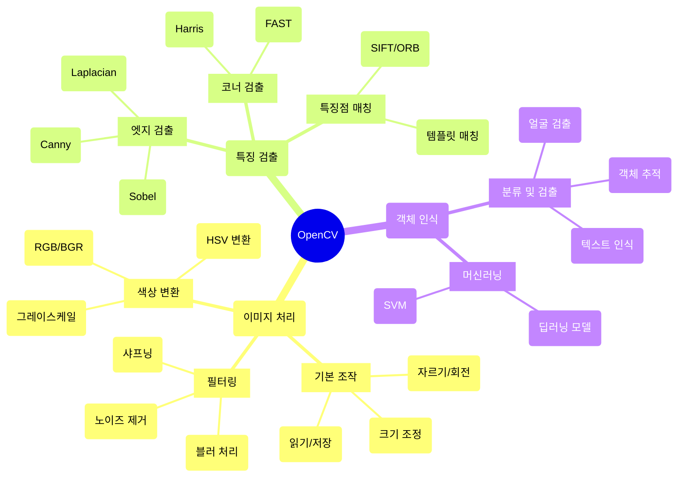

# Python OpenCV 완벽 가이드: 컴퓨터 비전 핵심 함수와 실무 활용법

## 📦 사용하는 python package

- opencv-python==4.10.0
- numpy==1.26.4
- matplotlib==3.10.1
- Pillow==10.4.0

## 🚀 TL;DR

- **OpenCV**는 컴퓨터 비전과 이미지 처리를 위한 가장 강력하고 널리 사용되는 오픈소스 라이브러리다
- **이미지 읽기/저장/표시**부터 **색상 변환**, **기하학적 변환**, **필터링**, **엣지 검출** 등 핵심 기능들을 제공한다
- **cv2.imread()**, **cv2.resize()**, **cv2.cvtColor()**, **cv2.GaussianBlur()** 등이 가장 자주 사용되는 함수들이다
- **실시간 비디오 처리**, **객체 인식**, **얼굴 검출**, **OCR** 등 다양한 실무 프로젝트에 활용된다
- **NumPy 배열** 기반으로 동작하여 빠른 성능과 다른 Python 라이브러리와의 호환성을 제공한다

## 📓 실습 Jupyter Notebook

- [OpenCV 기초와 실무 활용법](https://github.com/yuiyeong/notebooks/blob/main/computer_vision/opencv_fundamentals.ipynb)

## 🎯 OpenCV란?

**OpenCV**(Open Source Computer Vision Library)는 컴퓨터 비전, 이미지 처리, 머신러닝을 위한 오픈소스 라이브러리다. 1999년 인텔에서 개발이 시작되어 현재는 가장 널리 사용되는 컴퓨터 비전 라이브러리로 자리잡았다.

OpenCV는 **실시간 이미지 처리**에 최적화되어 있으며, C++로 작성된 고성능 알고리즘들을 Python에서 쉽게 사용할 수 있게 해준다. 마치 이미지와 비디오를 다루는 **스위스 아미 나이프**같은 존재라고 할 수 있다.

### OpenCV의 핵심 특징

- **다양한 언어 지원**: C++, Python, Java 등 여러 언어에서 사용 가능
- **크로스 플랫폼**: Windows, Linux, macOS, Android, iOS 등에서 동작
- **광범위한 기능**: 기본 이미지 처리부터 고급 머신러닝까지
- **실시간 처리**: 웹캠, 동영상 등 실시간 스트림 처리 지원
- **NumPy 통합**: NumPy 배열과 완벽하게 호환되어 다른 Python 라이브러리와 쉽게 연동



> OpenCV는 학술 연구부터 상업적 응용까지 광범위하게 사용되는 컴퓨터 비전의 표준 라이브러리로, 자율주행차, 의료 영상 분석, 보안 시스템 등 다양한 분야에서 핵심 기술로 활용된다. {: .prompt-tip}

## 📁 이미지 읽기, 저장, 표시하기

OpenCV에서 가장 기본이 되는 작업은 이미지를 읽고, 처리하고, 저장하는 것이다. 이는 모든 컴퓨터 비전 프로젝트의 출발점이 된다.

### cv2.imread() - 이미지 읽기

**cv2.imread()**는 파일에서 이미지를 읽어들이는 함수다.

```python
cv2.imread(filename, flags)
```

**주요 매개변수:**

- **filename**: 읽을 이미지 파일의 경로 (문자열)
- **flags**: 이미지를 읽는 방법을 지정하는 플래그
    - **cv2.IMREAD_COLOR** (기본값, 1): 컬러 이미지로 읽기 (BGR 형식)
    - **cv2.IMREAD_GRAYSCALE** (0): 그레이스케일로 읽기
    - **cv2.IMREAD_UNCHANGED** (-1): 원본 이미지 그대로 읽기 (알파 채널 포함)

```python
import cv2
import numpy as np
import matplotlib.pyplot as plt

# 컬러 이미지 읽기 (기본값)
img_color = cv2.imread('example.jpg')  
print(f"컬러 이미지 shape: {img_color.shape}")  # 출력: (높이, 너비, 3)

# 그레이스케일로 읽기
img_gray = cv2.imread('example.jpg', cv2.IMREAD_GRAYSCALE)
print(f"그레이스케일 이미지 shape: {img_gray.shape}")  # 출력: (높이, 너비)

# 이미지 읽기 실패 처리
img = cv2.imread('nonexistent.jpg')
if img is None:
    print("이미지를 찾을 수 없습니다!")
```

> OpenCV는 이미지를 **BGR(Blue-Green-Red)** 순서로 읽는다. 이는 일반적인 **RGB** 순서와 다르므로 matplotlib 등 다른 라이브러리와 함께 사용할 때 주의해야 한다. {: .prompt-warning}

### cv2.imshow() - 이미지 표시하기

**cv2.imshow()**는 이미지를 화면에 표시하는 함수다.

```python
cv2.imshow(winname, mat)
```

**주요 매개변수:**

- **winname**: 창의 이름 (문자열)
- **mat**: 표시할 이미지 (NumPy 배열)

```python
import cv2

# 이미지 읽기
img = cv2.imread('example.jpg')

# 이미지 표시
cv2.imshow('Original Image', img)

# 키 입력 대기 (밀리초, 0은 무한 대기)
cv2.waitKey(0)

# 모든 창 닫기
cv2.destroyAllWindows()

# 특정 창만 닫기
cv2.destroyWindow('Original Image')
```

### cv2.imwrite() - 이미지 저장하기

**cv2.imwrite()**는 이미지를 파일로 저장하는 함수다.

```python
cv2.imwrite(filename, img, params)
```

**주요 매개변수:**

- **filename**: 저장할 파일 경로 (확장자로 포맷 결정)
- **img**: 저장할 이미지 (NumPy 배열)
- **params**: 저장 옵션 (선택사항)

```python
import cv2

# 이미지 읽기
img = cv2.imread('input.jpg')

# 다양한 형식으로 저장
cv2.imwrite('output.jpg', img)  # JPEG 형식
cv2.imwrite('output.png', img)  # PNG 형식

# JPEG 품질 설정 (0-100, 높을수록 고품질)
cv2.imwrite('high_quality.jpg', img, [cv2.IMWRITE_JPEG_QUALITY, 95])

# PNG 압축 레벨 설정 (0-9, 높을수록 작은 파일 크기)
cv2.imwrite('compressed.png', img, [cv2.IMWRITE_PNG_COMPRESSION, 9])

print("이미지 저장 완료!")
```

### Matplotlib과 함께 사용하기

OpenCV와 matplotlib을 함께 사용할 때는 **BGR에서 RGB로 색상 순서를 변경**해야 한다.

```python
import cv2
import matplotlib.pyplot as plt

# OpenCV로 이미지 읽기 (BGR)
img_bgr = cv2.imread('example.jpg')

# BGR을 RGB로 변환
img_rgb = cv2.cvtColor(img_bgr, cv2.COLOR_BGR2RGB)

# matplotlib으로 표시
plt.figure(figsize=(12, 4))

plt.subplot(1, 2, 1)
plt.imshow(img_bgr)  # BGR 그대로 (색상이 이상하게 보임)
plt.title('BGR (잘못된 색상)')
plt.axis('off')

plt.subplot(1, 2, 2)
plt.imshow(img_rgb)  # RGB로 변환된 정상 색상
plt.title('RGB (정상 색상)')
plt.axis('off')

plt.tight_layout()
plt.show()
```

> 실무에서는 OpenCV로 이미지를 처리하고 matplotlib으로 시각화하는 경우가 많으므로, BGR↔RGB 변환은 매우 중요한 기술이다. {: .prompt-tip}

## 🎨 이미지 기본 속성과 조작

이미지를 다루기 전에 이미지의 기본 속성을 이해하고 픽셀 단위 조작 방법을 알아야 한다. OpenCV에서 이미지는 **NumPy 배열**로 표현되므로 NumPy의 모든 기능을 활용할 수 있다.

### 이미지 기본 속성 확인

```python
import cv2
import numpy as np

# 이미지 읽기
img = cv2.imread('example.jpg')

# 기본 속성 확인
print(f"이미지 형태(shape): {img.shape}")  # 출력: (높이, 너비, 채널)
print(f"이미지 크기(size): {img.size}")   # 출력: 전체 픽셀 수
print(f"데이터 타입(dtype): {img.dtype}") # 출력: uint8 (보통)

# 높이, 너비, 채널 개별 접근
height, width = img.shape[:2]
if len(img.shape) == 3:
    channels = img.shape[2]
    print(f"높이: {height}, 너비: {width}, 채널: {channels}")
else:
    print(f"높이: {height}, 너비: {width} (그레이스케일)")

# 이미지 정보 요약 함수
def get_image_info(image, name="Image"):
    print(f"\n=== {name} 정보 ===")
    print(f"Shape: {image.shape}")
    print(f"Size: {image.size}")
    print(f"Data type: {image.dtype}")
    print(f"Min value: {np.min(image)}")
    print(f"Max value: {np.max(image)}")
    print(f"Mean value: {np.mean(image):.2f}")

get_image_info(img, "원본 이미지")
```

### 픽셀값 접근과 수정

OpenCV 이미지는 NumPy 배열이므로 인덱싱을 통해 픽셀값에 직접 접근할 수 있다.

```python
import cv2
import numpy as np

# 이미지 읽기
img = cv2.imread('example.jpg')

# 특정 픽셀값 읽기 (y, x, channel 순서 주의!)
(b, g, r) = img[100, 50]  # (y=100, x=50) 위치의 BGR 값
print(f"픽셀 (50, 100) BGR 값: B={b}, G={g}, R={r}")

# 개별 채널 접근
blue_value = img[100, 50, 0]   # Blue 채널
green_value = img[100, 50, 1]  # Green 채널  
red_value = img[100, 50, 2]    # Red 채널

# 픽셀값 수정
img[100, 50] = [255, 0, 0]  # 해당 픽셀을 파란색으로 변경

# 영역 단위 수정
img[100:200, 50:150] = [0, 255, 0]  # 사각형 영역을 초록색으로 변경

# 더 효율적인 픽셀 접근 방법 (item, itemset)
# 읽기
b_value = img.item(100, 50, 0)  # Blue 값 읽기
print(f"Blue 값: {b_value}")

# 쓰기  
img.itemset((100, 50, 0), 255)  # Blue 값을 255로 설정
```

### 이미지 영역 자르기(ROI - Region of Interest)

**ROI(Region of Interest)**는 이미지에서 관심 있는 특정 영역을 추출하는 것이다.

```python
import cv2
import matplotlib.pyplot as plt

# 이미지 읽기
img = cv2.imread('example.jpg')
img_rgb = cv2.cvtColor(img, cv2.COLOR_BGR2RGB)

# ROI 설정 (y1:y2, x1:x2)
roi = img[100:400, 200:500]  # 높이 100-400, 너비 200-500 영역
roi_rgb = cv2.cvtColor(roi, cv2.COLOR_BGR2RGB)

# 결과 시각화
plt.figure(figsize=(12, 4))

plt.subplot(1, 2, 1)
plt.imshow(img_rgb)
plt.title('원본 이미지')
# ROI 영역 표시
plt.plot([200, 500, 500, 200, 200], [100, 100, 400, 400, 100], 'r-', linewidth=2)
plt.axis('off')

plt.subplot(1, 2, 2)
plt.imshow(roi_rgb)
plt.title('추출된 ROI')
plt.axis('off')

plt.tight_layout()
plt.show()

print(f"원본 이미지 크기: {img.shape}")
print(f"ROI 크기: {roi.shape}")
```

### 이미지 복사와 분할

```python
import cv2
import numpy as np

# 이미지 읽기
img = cv2.imread('example.jpg')

# 이미지 복사 (얕은 복사 vs 깊은 복사)
img_view = img  # 얕은 복사 (같은 메모리 참조)
img_copy = img.copy()  # 깊은 복사 (독립적인 메모리)

# 채널 분할
b, g, r = cv2.split(img)  # BGR 채널을 개별로 분리
print(f"Blue 채널 shape: {b.shape}")
print(f"Green 채널 shape: {g.shape}")
print(f"Red 채널 shape: {r.shape}")

# 채널 병합
img_merged = cv2.merge([b, g, r])  # 분할된 채널을 다시 병합

# 개별 채널을 3채널 이미지로 만들기
b_3channel = cv2.merge([b, b, b])  # Blue 채널만으로 3채널 이미지 생성
g_3channel = cv2.merge([g, g, g])  # Green 채널만으로 3채널 이미지 생성
r_3channel = cv2.merge([r, r, r])  # Red 채널만으로 3채널 이미지 생성

# 특정 채널만 0으로 만들기
img_no_red = img.copy()
img_no_red[:, :, 2] = 0  # Red 채널을 0으로 설정

print("채널 분할 및 병합 완료!")
```

> 이미지 조작 시 **원본 이미지를 보존**하려면 반드시 **copy()**를 사용해야 한다. 그렇지 않으면 원본도 함께 변경될 수 있다. {: .prompt-warning}

## 🌈 색상 공간 변환

색상 공간 변환은 컴퓨터 비전에서 매우 중요한 전처리 단계다. 서로 다른 색상 공간은 각각 고유한 특성을 가지고 있어, 특정 작업에 더 적합한 색상 공간을 선택하는 것이 성능 향상의 핵심이다.

### cv2.cvtColor() - 색상 공간 변환의 핵심

**cv2.cvtColor()**는 하나의 색상 공간에서 다른 색상 공간으로 이미지를 변환하는 함수다.

```python
cv2.cvtColor(src, code, dst, dstCn)
```

**주요 매개변수:**

- **src**: 입력 이미지
- **code**: 변환 타입을 지정하는 플래그
- **dst**: 출력 이미지 (선택사항)
- **dstCn**: 출력 이미지의 채널 수 (선택사항)

### 주요 색상 공간과 활용법

```python
import cv2
import matplotlib.pyplot as plt
import numpy as np

# 원본 이미지 읽기
img = cv2.imread('example.jpg')
img_rgb = cv2.cvtColor(img, cv2.COLOR_BGR2RGB)

# 1. BGR ↔ RGB 변환 (가장 자주 사용)
img_rgb = cv2.cvtColor(img, cv2.COLOR_BGR2RGB)
img_bgr = cv2.cvtColor(img_rgb, cv2.COLOR_RGB2BGR)

# 2. 그레이스케일 변환
img_gray = cv2.cvtColor(img, cv2.COLOR_BGR2GRAY)

# 3. HSV 변환 (색상 기반 객체 검출에 유용)
img_hsv = cv2.cvtColor(img, cv2.COLOR_BGR2HSV)

# 4. LAB 변환 (조명에 강인한 색상 분석)
img_lab = cv2.cvtColor(img, cv2.COLOR_BGR2LAB)

# 5. YUV 변환 (비디오 압축에서 사용)
img_yuv = cv2.cvtColor(img, cv2.COLOR_BGR2YUV)

# 결과 시각화
plt.figure(figsize=(15, 10))

# 원본
plt.subplot(2, 3, 1)
plt.imshow(img_rgb)
plt.title('원본 (RGB)')
plt.axis('off')

# 그레이스케일
plt.subplot(2, 3, 2)
plt.imshow(img_gray, cmap='gray')
plt.title('그레이스케일')
plt.axis('off')

# HSV
plt.subplot(2, 3, 3)
plt.imshow(img_hsv)
plt.title('HSV')
plt.axis('off')

# LAB
plt.subplot(2, 3, 4)
plt.imshow(img_lab)
plt.title('LAB')
plt.axis('off')

# YUV
plt.subplot(2, 3, 5)
plt.imshow(img_yuv)
plt.title('YUV')
plt.axis('off')

plt.tight_layout()
plt.show()
```

### HSV 색상 공간을 활용한 색상 기반 객체 검출

**HSV(Hue-Saturation-Value)**는 색상 기반 객체 검출에 매우 유용한 색상 공간이다.

```python
import cv2
import numpy as np

# 이미지 읽기
img = cv2.imread('example.jpg')
hsv = cv2.cvtColor(img, cv2.COLOR_BGR2HSV)

# 특정 색상 범위 정의 (파란색 객체 검출 예시)
# HSV에서 색상(Hue) 범위: 0-179, 채도(Saturation): 0-255, 명도(Value): 0-255
lower_blue = np.array([100, 50, 50])   # 파란색 하한값
upper_blue = np.array([130, 255, 255]) # 파란색 상한값

# 색상 범위에 따른 마스크 생성
mask = cv2.inRange(hsv, lower_blue, upper_blue)

# 마스크를 이용한 색상 추출
result = cv2.bitwise_and(img, img, mask=mask)

# 결과 출력
cv2.imshow('Original', img)
cv2.imshow('Mask', mask)
cv2.imshow('Result', result)
cv2.waitKey(0)
cv2.destroyAllWindows()

print(f"검출된 픽셀 수: {np.sum(mask > 0)}")
```

### 실무에서 자주 사용하는 색상 변환 패턴

```python
import cv2
import numpy as np

def color_space_demo(image_path):
    """다양한 색상 공간 변환 데모"""
    
    # 이미지 읽기
    img = cv2.imread(image_path)
    
    # 색상 공간별 변환
    conversions = {
        'RGB': cv2.cvtColor(img, cv2.COLOR_BGR2RGB),
        'GRAY': cv2.cvtColor(img, cv2.COLOR_BGR2GRAY),
        'HSV': cv2.cvtColor(img, cv2.COLOR_BGR2HSV),
        'LAB': cv2.cvtColor(img, cv2.COLOR_BGR2LAB),
        'HLS': cv2.cvtColor(img, cv2.COLOR_BGR2HLS),
        'YUV': cv2.cvtColor(img, cv2.COLOR_BGR2YUV)
    }
    
    return conversions

# 색상 히스토그램 계산 함수
def calculate_color_histogram(img, color_space='BGR'):
    """색상별 히스토그램 계산"""
    
    if color_space == 'BGR':
        colors = ['Blue', 'Green', 'Red']
        color_codes = ['b', 'g', 'r']
    elif color_space == 'HSV':
        colors = ['Hue', 'Saturation', 'Value']
        color_codes = ['c', 'm', 'y']
    
    plt.figure(figsize=(12, 4))
    
    for i, (color, code) in enumerate(zip(colors, color_codes)):
        hist = cv2.calcHist([img], [i], None, [256], [0, 256])
        plt.subplot(1, 3, i+1)
        plt.plot(hist, color=code)
        plt.title(f'{color} Histogram')
        plt.xlabel('Pixel Value')
        plt.ylabel('Frequency')
    
    plt.tight_layout()
    plt.show()

# 사용 예시
# img = cv2.imread('example.jpg')
# calculate_color_histogram(img, 'BGR')
```

> **HSV 색상 공간**은 조명 변화에 상대적으로 강인하여 **색상 기반 객체 추적**이나 **인공지능 데이터 전처리**에 자주 활용된다. {: .prompt-tip}

## 📏 이미지 크기 조정과 기하학적 변환

이미지 크기 조정과 기하학적 변환은 컴퓨터 비전에서 가장 기본적이면서도 중요한 전처리 과정이다. 특히 **머신러닝 모델의 입력 크기를 맞추거나**, **데이터 증강(Data Augmentation)**을 위해 필수적으로 사용된다.

### cv2.resize() - 이미지 크기 조정

**cv2.resize()**는 이미지의 크기를 변경하는 함수로, 다양한 보간법을 지원한다.

```python
cv2.resize(src, dsize, fx, fy, interpolation)
```

**주요 매개변수:**

- **src**: 입력 이미지
- **dsize**: 출력 이미지 크기 (width, height) 튜플
- **fx, fy**: x, y 방향 스케일 팩터 (dsize가 None일 때 사용)
- **interpolation**: 보간 방법

### 다양한 보간법과 활용

```python
import cv2
import matplotlib.pyplot as plt
import numpy as np

# 원본 이미지 읽기
img = cv2.imread('example.jpg')
img_rgb = cv2.cvtColor(img, cv2.COLOR_BGR2RGB)

print(f"원본 크기: {img.shape}")

# 1. 절대 크기로 조정
resized_fixed = cv2.resize(img, (300, 200))  # (width, height)

# 2. 비율로 조정
resized_scale = cv2.resize(img, None, fx=0.5, fy=0.5)  # 50% 크기

# 3. 다양한 보간법 비교
interpolations = {
    'NEAREST': cv2.INTER_NEAREST,      # 최근접 이웃 (빠름, 품질 낮음)
    'LINEAR': cv2.INTER_LINEAR,        # 선형 보간 (기본값, 균형)
    'CUBIC': cv2.INTER_CUBIC,          # 3차 보간 (느림, 품질 높음)
    'LANCZOS4': cv2.INTER_LANCZOS4     # Lanczos 보간 (매우 고품질)
}

# 작은 이미지를 크게 확대해서 보간법 차이 확인
small_img = cv2.resize(img, (50, 50))
target_size = (200, 200)

plt.figure(figsize=(15, 8))

plt.subplot(2, 3, 1)
plt.imshow(cv2.cvtColor(small_img, cv2.COLOR_BGR2RGB))
plt.title('원본 작은 이미지 (50x50)')
plt.axis('off')

for i, (name, method) in enumerate(interpolations.items(), 2):
    enlarged = cv2.resize(small_img, target_size, interpolation=method)
    enlarged_rgb = cv2.cvtColor(enlarged, cv2.COLOR_BGR2RGB)
    
    plt.subplot(2, 3, i)
    plt.imshow(enlarged_rgb)
    plt.title(f'{name} (200x200)')
    plt.axis('off')

plt.tight_layout()
plt.show()

# 성능 비교를 위한 실용적인 크기 조정 함수
def smart_resize(image, target_width=None, target_height=None, maintain_aspect=True):
    """종횡비를 유지하면서 스마트하게 크기 조정"""
    
    h, w = image.shape[:2]
    
    if maintain_aspect:
        if target_width is not None:
            # 너비 기준으로 비율 계산
            ratio = target_width / w
            new_h = int(h * ratio)
            return cv2.resize(image, (target_width, new_h))
        elif target_height is not None:
            # 높이 기준으로 비율 계산
            ratio = target_height / h
            new_w = int(w * ratio)
            return cv2.resize(image, (new_w, target_height))
    else:
        # 비율 무시하고 강제 크기 조정
        if target_width and target_height:
            return cv2.resize(image, (target_width, target_height))
    
    return image

# 사용 예시
resized_smart = smart_resize(img, target_width=400)
print(f"스마트 리사이즈 결과: {resized_smart.shape}")
```

### cv2.warpAffine() - 아핀 변환

**아핀 변환(Affine Transformation)**은 선형 변환과 평행 이동을 결합한 변환으로, 직선의 평행성을 유지한다.

```python
import cv2
import numpy as np
import matplotlib.pyplot as plt

# 이미지 읽기
img = cv2.imread('example.jpg')
img_rgb = cv2.cvtColor(img, cv2.COLOR_BGR2RGB)
h, w = img.shape[:2]

# 1. 평행 이동 (Translation)
# 변환 행렬: [[1, 0, tx], [0, 1, ty]]
tx, ty = 100, 50  # x축으로 100, y축으로 50 이동
M_translate = np.float32([[1, 0, tx], [0, 1, ty]])
translated = cv2.warpAffine(img, M_translate, (w, h))

# 2. 회전 (Rotation)
center = (w//2, h//2)  # 회전 중심점
angle = 45  # 회전 각도 (도)
scale = 1.0  # 스케일 팩터
M_rotate = cv2.getRotationMatrix2D(center, angle, scale)
rotated = cv2.warpAffine(img, M_rotate, (w, h))

# 3. 스케일링과 회전 결합
M_scale_rotate = cv2.getRotationMatrix2D(center, 30, 0.8)  # 30도 회전, 0.8배 축소
scaled_rotated = cv2.warpAffine(img, M_scale_rotate, (w, h))

# 4. 사용자 정의 아핀 변환
# 세 점의 변환을 정의하여 아핀 변환 행렬 계산
src_points = np.float32([[0, 0], [w-1, 0], [0, h-1]])
dst_points = np.float32([[0, h*0.13], [w*0.85, h*0.25], [w*0.15, h*0.7]])
M_custom = cv2.getAffineTransform(src_points, dst_points)
custom_transformed = cv2.warpAffine(img, M_custom, (w, h))

# 결과 시각화
plt.figure(figsize=(15, 10))

images = [
    (img_rgb, '원본'),
    (cv2.cvtColor(translated, cv2.COLOR_BGR2RGB), '평행이동'),
    (cv2.cvtColor(rotated, cv2.COLOR_BGR2RGB), '회전 45°'),
    (cv2.cvtColor(scaled_rotated, cv2.COLOR_BGR2RGB), '회전+축소'),
    (cv2.cvtColor(custom_transformed, cv2.COLOR_BGR2RGB), '사용자 정의')
]

for i, (image, title) in enumerate(images):
    plt.subplot(2, 3, i+1)
    plt.imshow(image)
    plt.title(title)
    plt.axis('off')

plt.tight_layout()
plt.show()

print("아핀 변환 행렬:")
print("평행이동:\n", M_translate)
print("회전:\n", M_rotate)
print("사용자 정의:\n", M_custom)
```

### cv2.warpPerspective() - 원근 변환

**원근 변환(Perspective Transformation)**은 3D 공간에서의 관점 변화를 2D 이미지에서 시뮬레이션한다.

```python
import cv2
import numpy as np
import matplotlib.pyplot as plt

# 이미지 읽기
img = cv2.imread('example.jpg')
img_rgb = cv2.cvtColor(img, cv2.COLOR_BGR2RGB)
h, w = img.shape[:2]

# 원근 변환을 위한 네 점 정의
# 소스 포인트 (원본 이미지의 네 모서리)
src_points = np.float32([
    [0, 0],        # 좌상단
    [w-1, 0],      # 우상단  
    [0, h-1],      # 좌하단
    [w-1, h-1]     # 우하단
])

# 대상 포인트 (변환 후 위치)
dst_points = np.float32([
    [w*0.2, h*0.1],   # 좌상단을 안쪽으로
    [w*0.8, h*0.2],   # 우상단을 안쪽으로
    [w*0.1, h*0.9],   # 좌하단을 안쪽으로  
    [w*0.9, h*0.8]    # 우하단을 안쪽으로
])

# 원근 변환 행렬 계산
M_perspective = cv2.getPerspectiveTransform(src_points, dst_points)

# 원근 변환 적용
perspective_transformed = cv2.warpPerspective(img, M_perspective, (w, h))

# 문서 스캔 효과 시뮬레이션
# 종이가 살짝 기울어진 효과
doc_src = np.float32([[0, 0], [w-1, 0], [0, h-1], [w-1, h-1]])
doc_dst = np.float32([[w*0.1, h*0.2], [w*0.9, h*0.1], [w*0.2, h*0.8], [w*0.8, h*0.9]])
M_document = cv2.getPerspectiveTransform(doc_src, doc_dst)
document_scan = cv2.warpPerspective(img, M_document, (w, h))

# 결과 시각화
plt.figure(figsize=(15, 5))

plt.subplot(1, 3, 1)
plt.imshow(img_rgb)
plt.title('원본 이미지')
plt.axis('off')

plt.subplot(1, 3, 2)
plt.imshow(cv2.cvtColor(perspective_transformed, cv2.COLOR_BGR2RGB))
plt.title('원근 변환')
plt.axis('off')

plt.subplot(1, 3, 3)
plt.imshow(cv2.cvtColor(document_scan, cv2.COLOR_BGR2RGB))
plt.title('문서 스캔 효과')
plt.axis('off')

plt.tight_layout()
plt.show()

print("원근 변환 행렬:")
print(M_perspective)
```

### 실무에서 활용하는 이미지 변환 파이프라인

```python
import cv2
import numpy as np
import random

class ImageAugmenter:
    """이미지 데이터 증강을 위한 클래스"""
    
    def __init__(self):
        self.augmentation_functions = [
            self.random_rotation,
            self.random_scale,
            self.random_translation,
            self.random_perspective
        ]
    
    def random_rotation(self, image, max_angle=30):
        """랜덤 회전"""
        h, w = image.shape[:2]
        center = (w//2, h//2)
        angle = random.uniform(-max_angle, max_angle)
        M = cv2.getRotationMatrix2D(center, angle, 1.0)
        return cv2.warpAffine(image, M, (w, h))
    
    def random_scale(self, image, scale_range=(0.8, 1.2)):
        """랜덤 스케일링"""
        h, w = image.shape[:2]
        center = (w//2, h//2)
        scale = random.uniform(*scale_range)
        M = cv2.getRotationMatrix2D(center, 0, scale)
        return cv2.warpAffine(image, M, (w, h))
    
    def random_translation(self, image, max_shift=50):
        """랜덤 평행이동"""
        h, w = image.shape[:2]
        tx = random.uniform(-max_shift, max_shift)
        ty = random.uniform(-max_shift, max_shift)
        M = np.float32([[1, 0, tx], [0, 1, ty]])
        return cv2.warpAffine(image, M, (w, h))
    
    def random_perspective(self, image, max_shift=0.1):
        """랜덤 원근 변환"""
        h, w = image.shape[:2]
        
        # 원본 모서리 점들
        src = np.float32([[0, 0], [w-1, 0], [0, h-1], [w-1, h-1]])
        
        # 랜덤하게 이동된 목표 점들
        dst = np.float32([
            [random.uniform(0, w*max_shift), random.uniform(0, h*max_shift)],
            [w-1-random.uniform(0, w*max_shift), random.uniform(0, h*max_shift)],
            [random.uniform(0, w*max_shift), h-1-random.uniform(0, h*max_shift)],
            [w-1-random.uniform(0, w*max_shift), h-1-random.uniform(0, h*max_shift)]
        ])
        
        M = cv2.getPerspectiveTransform(src, dst)
        return cv2.warpPerspective(image, M, (w, h))
    
    def apply_random_augmentation(self, image):
        """랜덤한 증강 기법 하나 적용"""
        aug_func = random.choice(self.augmentation_functions)
        return aug_func(image)
    
    def apply_multiple_augmentations(self, image, num_augs=2):
        """여러 증강 기법 연속 적용"""
        result = image.copy()
        for _ in range(num_augs):
            result = self.apply_random_augmentation(result)
        return result

# 사용 예시
# augmenter = ImageAugmenter()
# img = cv2.imread('example.jpg')
# augmented = augmenter.apply_multiple_augmentations(img, num_augs=3)
```

> 기하학적 변환은 **데이터 증강(Data Augmentation)**에서 핵심 기법으로, 적은 데이터로도 모델의 일반화 성능을 크게 향상시킬 수 있다. {: .prompt-tip}

## 🔍 이미지 필터링과 블러 처리

이미지 필터링은 **노이즈 제거**, **이미지 부드럽게 만들기**, **특징 강화** 등 다양한 목적으로 사용되는 핵심 기술이다. **컨볼루션(Convolution)** 연산을 기반으로 하며, 딥러닝의 CNN에서도 동일한 원리가 사용된다.

### 컨볼루션의 기본 개념

컨볼루션은 이미지의 각 픽셀과 그 주변 픽셀들에 **커널(필터)**을 적용하여 새로운 값을 계산하는 연산이다.

[시각적 표현 넣기 - 컨볼루션 연산 과정 애니메이션]

```python
import cv2
import numpy as np
import matplotlib.pyplot as plt

# 커스텀 커널로 컨볼루션 적용하기
def apply_custom_kernel(image, kernel):
    """사용자 정의 커널 적용"""
    return cv2.filter2D(image, -1, kernel)

# 다양한 커널 정의
kernels = {
    # 블러 커널 (평균 필터)
    'blur': np.ones((5, 5), np.float32) / 25,
    
    # 샤프닝 커널
    'sharpen': np.array([
        [0, -1, 0],
        [-1, 5, -1], 
        [0, -1, 0]
    ], np.float32),
    
    # 엣지 검출 커널
    'edge': np.array([
        [-1, -1, -1],
        [-1, 8, -1],
        [-1, -1, -1]
    ], np.float32),
    
    # 엠보싱 효과
    'emboss': np.array([
        [-2, -1, 0],
        [-1, 1, 1],
        [0, 1, 2]
    ], np.float32)
}

# 이미지 읽기
img = cv2.imread('example.jpg')
img_rgb = cv2.cvtColor(img, cv2.COLOR_BGR2RGB)

# 커널 적용 결과 시각화
plt.figure(figsize=(15, 10))

plt.subplot(2, 3, 1)
plt.imshow(img_rgb)
plt.title('원본 이미지')
plt.axis('off')

for i, (name, kernel) in enumerate(kernels.items(), 2):
    filtered = apply_custom_kernel(img, kernel)
    filtered_rgb = cv2.cvtColor(filtered, cv2.COLOR_BGR2RGB)
    
    plt.subplot(2, 3, i)
    plt.imshow(filtered_rgb)
    plt.title(f'{name.title()} 필터')
    plt.axis('off')

plt.tight_layout()
plt.show()

# 커널 시각화
plt.figure(figsize=(12, 3))
for i, (name, kernel) in enumerate(kernels.items(), 1):
    plt.subplot(1, 4, i)
    plt.imshow(kernel, cmap='gray')
    plt.title(f'{name.title()} 커널')
    plt.colorbar()

plt.tight_layout()
plt.show()
```

### 가우시안 블러 - cv2.GaussianBlur()

**가우시안 블러**는 가장 널리 사용되는 블러 기법으로, 자연스러운 블러 효과를 제공한다.

```python
cv2.GaussianBlur(src, ksize, sigmaX, sigmaY, borderType)
```

**주요 매개변수:**

- **src**: 입력 이미지
- **ksize**: 가우시안 커널 크기 (홀수, (width, height))
- **sigmaX**: X방향 표준편차
- **sigmaY**: Y방향 표준편차 (0이면 sigmaX와 동일)
- **borderType**: 경계 처리 방법

```python
import cv2
import numpy as np
import matplotlib.pyplot as plt

# 이미지 읽기
img = cv2.imread('example.jpg')
img_rgb = cv2.cvtColor(img, cv2.COLOR_BGR2RGB)

# 다양한 강도의 가우시안 블러
blur_strengths = [
    (5, 1),    # 약한 블러
    (15, 5),   # 중간 블러  
    (31, 10),  # 강한 블러
    (51, 20)   # 매우 강한 블러
]

plt.figure(figsize=(15, 8))

plt.subplot(2, 3, 1)
plt.imshow(img_rgb)
plt.title('원본 이미지')
plt.axis('off')

for i, (ksize, sigma) in enumerate(blur_strengths, 2):
    blurred = cv2.GaussianBlur(img, (ksize, ksize), sigma)
    blurred_rgb = cv2.cvtColor(blurred, cv2.COLOR_BGR2RGB)
    
    plt.subplot(2, 3, i)
    plt.imshow(blurred_rgb)
    plt.title(f'가우시안 블러\n(ksize={ksize}, σ={sigma})')
    plt.axis('off')

plt.tight_layout()
plt.show()

# 실무에서 자주 사용하는 블러 강도 비교
def compare_blur_methods(image):
    """다양한 블러 방법 비교"""
    
    # 평균 블러 (박스 필터)
    avg_blur = cv2.blur(image, (15, 15))
    
    # 가우시안 블러
    gaussian_blur = cv2.GaussianBlur(image, (15, 15), 0)
    
    # 미디언 블러 (노이즈 제거에 효과적)
    median_blur = cv2.medianBlur(image, 15)
    
    # 양방향 필터 (엣지 보존하면서 블러)
    bilateral = cv2.bilateralFilter(image, 15, 80, 80)
    
    methods = {
        '원본': image,
        '평균 블러': avg_blur,
        '가우시안 블러': gaussian_blur, 
        '미디언 블러': median_blur,
        '양방향 필터': bilateral
    }
    
    plt.figure(figsize=(15, 6))
    for i, (name, img) in enumerate(methods.items(), 1):
        plt.subplot(1, 5, i)
        plt.imshow(cv2.cvtColor(img, cv2.COLOR_BGR2RGB))
        plt.title(name)
        plt.axis('off')
    
    plt.tight_layout()
    plt.show()
    
    return methods

# 블러 방법 비교 실행
blur_results = compare_blur_methods(img)
```

### 양방향 필터 - cv2.bilateralFilter()

**양방향 필터(Bilateral Filter)**는 엣지를 보존하면서 노이즈를 제거하는 고급 필터링 기법이다.

```python
cv2.bilateralFilter(src, d, sigmaColor, sigmaSpace, borderType)
```

**주요 매개변수:**

- **src**: 입력 이미지
- **d**: 필터링에 사용할 픽셀 이웃의 지름
- **sigmaColor**: 색상 공간에서의 표준편차 (클수록 더 많은 색상이 섞임)
- **sigmaSpace**: 좌표 공간에서의 표준편차 (클수록 더 넓은 영역 고려)

```python
import cv2
import numpy as np
import matplotlib.pyplot as plt

# 노이즈가 있는 이미지 생성
img = cv2.imread('example.jpg')
img_rgb = cv2.cvtColor(img, cv2.COLOR_BGR2RGB)

# 가우시안 노이즈 추가
noise = np.random.normal(0, 25, img.shape).astype(np.uint8)
noisy_img = cv2.add(img, noise)
noisy_rgb = cv2.cvtColor(noisy_img, cv2.COLOR_BGR2RGB)

# 다양한 노이즈 제거 방법 비교
methods = {
    '노이즈 원본': noisy_img,
    '가우시안 블러': cv2.GaussianBlur(noisy_img, (15, 15), 0),
    '양방향 필터 (약함)': cv2.bilateralFilter(noisy_img, 9, 75, 75),
    '양방향 필터 (강함)': cv2.bilateralFilter(noisy_img, 15, 100, 100),
    '미디언 필터': cv2.medianBlur(noisy_img, 5)
}

plt.figure(figsize=(15, 6))
for i, (name, processed) in enumerate(methods.items(), 1):
    plt.subplot(1, 5, i)
    plt.imshow(cv2.cvtColor(processed, cv2.COLOR_BGR2RGB))
    plt.title(name)
    plt.axis('off')

plt.tight_layout()
plt.show()

# 양방향 필터 매개변수 효과 분석
def bilateral_parameter_study(image):
    """양방향 필터 매개변수별 효과 연구"""
    
    # sigmaColor 변화 (sigmaSpace=75 고정)
    sigma_colors = [25, 50, 75, 150]
    
    plt.figure(figsize=(16, 8))
    
    # sigmaColor 효과
    plt.suptitle('양방향 필터 매개변수 효과', fontsize=16)
    
    for i, sigma_color in enumerate(sigma_colors, 1):
        result = cv2.bilateralFilter(image, 15, sigma_color, 75)
        plt.subplot(2, 4, i)
        plt.imshow(cv2.cvtColor(result, cv2.COLOR_BGR2RGB))
        plt.title(f'sigmaColor={sigma_color}')
        plt.axis('off')
    
    # sigmaSpace 효과 (sigmaColor=75 고정)
    sigma_spaces = [25, 50, 75, 150]
    
    for i, sigma_space in enumerate(sigma_spaces, 5):
        result = cv2.bilateralFilter(image, 15, 75, sigma_space)
        plt.subplot(2, 4, i)
        plt.imshow(cv2.cvtColor(result, cv2.COLOR_BGR2RGB))
        plt.title(f'sigmaSpace={sigma_space}')
        plt.axis('off')
    
    plt.tight_layout()
    plt.show()

bilateral_parameter_study(noisy_img)
```

### 언샤프 마스킹 - 이미지 선명도 향상

**언샤프 마스킹(Unsharp Masking)**은 이미지의 선명도를 향상시키는 기법이다.

```python
import cv2
import numpy as np

def unsharp_mask(image, kernel_size=(5, 5), sigma=1.0, amount=1.0, threshold=0):
    """언샤프 마스킹을 이용한 이미지 선명화"""
    
    # 1. 원본 이미지를 블러 처리
    blurred = cv2.GaussianBlur(image, kernel_size, sigma)
    
    # 2. 원본에서 블러 이미지를 뺀 언샤프 마스크 생성
    unsharp_mask = cv2.subtract(image, blurred)
    
    # 3. 언샤프 마스크를 원본에 추가
    sharpened = cv2.addWeighted(image, 1.0, unsharp_mask, amount, 0)
    
    # 4. 임계값 적용 (선택사항)
    if threshold > 0:
        low_contrast_mask = np.absolute(unsharp_mask) < threshold
        np.copyto(sharpened, image, where=low_contrast_mask)
    
    return sharpened

# 이미지 읽기
img = cv2.imread('example.jpg')

# 다양한 강도로 선명화 적용
sharpening_levels = [
    (1.0, "약한 선명화"),
    (2.0, "중간 선명화"), 
    (3.0, "강한 선명화"),
    (5.0, "매우 강한 선명화")
]

plt.figure(figsize=(15, 8))

plt.subplot(2, 3, 1)
plt.imshow(cv2.cvtColor(img, cv2.COLOR_BGR2RGB))
plt.title('원본 이미지')
plt.axis('off')

for i, (amount, title) in enumerate(sharpening_levels, 2):
    sharpened = unsharp_mask(img, amount=amount)
    plt.subplot(2, 3, i)
    plt.imshow(cv2.cvtColor(sharpened, cv2.COLOR_BGR2RGB))
    plt.title(title)
    plt.axis('off')

plt.tight_layout()
plt.show()
```

> **양방향 필터**는 **얼굴 보정 앱**이나 **의료 영상 처리**에서 세부 사항을 보존하면서 노이즈를 제거하는 데 자주 활용된다. {: .prompt-tip}

## ⚡ 엣지 검출

엣지 검출은 이미지에서 **물체의 경계선**을 찾아내는 핵심 기술이다. 픽셀 강도의 급격한 변화를 감지하여 객체의 형태와 구조를 파악하는 데 사용된다. **자율주행차의 차선 인식**, **의료 영상의 종양 검출** 등 다양한 분야에서 활용된다.

### Canny 엣지 검출 - cv2.Canny()

**Canny 엣지 검출**은 가장 널리 사용되는 엣지 검출 알고리즘으로, 뛰어난 성능과 정확도를 제공한다.

```python
cv2.Canny(image, threshold1, threshold2, apertureSize, L2gradient)
```

**주요 매개변수:**

- **image**: 입력 이미지 (그레이스케일)
- **threshold1**: 첫 번째 임계값 (약한 엣지)
- **threshold2**: 두 번째 임계값 (강한 엣지)
- **apertureSize**: Sobel 커널 크기 (기본값: 3)
- **L2gradient**: 기울기 크기 계산 방법 (기본값: False)

```python
import cv2
import numpy as np
import matplotlib.pyplot as plt

# 이미지 읽기
img = cv2.imread('example.jpg')
gray = cv2.cvtColor(img, cv2.COLOR_BGR2GRAY)

# 다양한 임계값으로 Canny 엣지 검출
thresholds = [
    (50, 150),   # 낮은 임계값 (더 많은 엣지)
    (100, 200),  # 중간 임계값
    (150, 250),  # 높은 임계값 (적은 엣지)
]

plt.figure(figsize=(15, 8))

plt.subplot(2, 3, 1)
plt.imshow(gray, cmap='gray')
plt.title('원본 (그레이스케일)')
plt.axis('off')

for i, (low, high) in enumerate(thresholds, 2):
    edges = cv2.Canny(gray, low, high)
    plt.subplot(2, 3, i)
    plt.imshow(edges, cmap='gray')
    plt.title(f'Canny 엣지\n(임계값: {low}, {high})')
    plt.axis('off')

# 전처리가 엣지 검출에 미치는 영향
plt.subplot(2, 3, 5)
# 가우시안 블러 후 엣지 검출
blurred = cv2.GaussianBlur(gray, (5, 5), 0)
edges_blurred = cv2.Canny(blurred, 100, 200)
plt.imshow(edges_blurred, cmap='gray')
plt.title('블러 후 Canny')
plt.axis('off')

plt.subplot(2, 3, 6)
# 양방향 필터 후 엣지 검출
bilateral = cv2.bilateralFilter(gray, 9, 75, 75)
edges_bilateral = cv2.Canny(bilateral, 100, 200)
plt.imshow(edges_bilateral, cmap='gray')
plt.title('양방향 필터 후 Canny')
plt.axis('off')

plt.tight_layout()
plt.show()

print(f"검출된 엣지 픽셀 수:")
for i, (low, high) in enumerate(thresholds):
    edges = cv2.Canny(gray, low, high)
    edge_pixels = np.sum(edges > 0)
    print(f"임계값 ({low}, {high}): {edge_pixels:,} 픽셀")
```

### Sobel 엣지 검출 - cv2.Sobel()

**Sobel 엣지 검출**은 방향별 기울기를 계산하여 엣지를 검출한다.

```python
cv2.Sobel(src, ddepth, dx, dy, ksize, scale, delta, borderType)
```

**주요 매개변수:**

- **src**: 입력 이미지
- **ddepth**: 출력 이미지 깊이 (보통 cv2.CV_64F)
- **dx**: x방향 미분 차수 (0 또는 1)
- **dy**: y방향 미분 차수 (0 또는 1)
- **ksize**: Sobel 커널 크기

```python
import cv2
import numpy as np
import matplotlib.pyplot as plt

# 이미지 읽기
img = cv2.imread('example.jpg')
gray = cv2.cvtColor(img, cv2.COLOR_BGR2GRAY)

# Sobel 엣지 검출 (x, y 방향)
sobel_x = cv2.Sobel(gray, cv2.CV_64F, 1, 0, ksize=3)
sobel_y = cv2.Sobel(gray, cv2.CV_64F, 0, 1, ksize=3)

# 절댓값 변환 및 uint8로 변환
sobel_x = cv2.convertScaleAbs(sobel_x)
sobel_y = cv2.convertScaleAbs(sobel_y)

# 두 방향 결합
sobel_combined = cv2.addWeighted(sobel_x, 0.5, sobel_y, 0.5, 0)

# 크기와 방향 계산
magnitude = np.sqrt(sobel_x.astype(np.float32)**2 + sobel_y.astype(np.float32)**2)
direction = np.arctan2(sobel_y.astype(np.float32), sobel_x.astype(np.float32))

# 다른 엣지 검출 방법들과 비교
laplacian = cv2.Laplacian(gray, cv2.CV_64F, ksize=3)
laplacian = cv2.convertScaleAbs(laplacian)

canny = cv2.Canny(gray, 100, 200)

# 결과 시각화
plt.figure(figsize=(15, 10))

images = [
    (gray, '원본', 'gray'),
    (sobel_x, 'Sobel X', 'gray'),
    (sobel_y, 'Sobel Y', 'gray'),
    (sobel_combined, 'Sobel 결합', 'gray'),
    (magnitude, '기울기 크기', 'hot'),
    (direction, '기울기 방향', 'hsv'),
    (laplacian, 'Laplacian', 'gray'),
    (canny, 'Canny', 'gray')
]

for i, (img_data, title, cmap) in enumerate(images, 1):
    plt.subplot(2, 4, i)
    plt.imshow(img_data, cmap=cmap)
    plt.title(title)
    plt.axis('off')

plt.tight_layout()
plt.show()

# 엣지 검출 성능 비교 함수
def compare_edge_detectors(image, blur_kernel=5):
    """다양한 엣지 검출 방법 성능 비교"""
    
    # 전처리: 노이즈 감소
    if blur_kernel > 0:
        blurred = cv2.GaussianBlur(image, (blur_kernel, blur_kernel), 0)
    else:
        blurred = image
    
    # 다양한 엣지 검출 적용
    methods = {}
    
    # Canny
    methods['Canny'] = cv2.Canny(blurred, 50, 150)
    
    # Sobel
    sobel_x = cv2.Sobel(blurred, cv2.CV_64F, 1, 0, ksize=3)
    sobel_y = cv2.Sobel(blurred, cv2.CV_64F, 0, 1, ksize=3)
    methods['Sobel'] = cv2.convertScaleAbs(cv2.addWeighted(
        cv2.convertScaleAbs(sobel_x), 0.5, 
        cv2.convertScaleAbs(sobel_y), 0.5, 0))
    
    # Laplacian
    laplacian = cv2.Laplacian(blurred, cv2.CV_64F, ksize=3)
    methods['Laplacian'] = cv2.convertScaleAbs(laplacian)
    
    # Scharr (Sobel의 개선된 버전)
    scharr_x = cv2.Scharr(blurred, cv2.CV_64F, 1, 0)
    scharr_y = cv2.Scharr(blurred, cv2.CV_64F, 0, 1)
    methods['Scharr'] = cv2.convertScaleAbs(cv2.addWeighted(
        cv2.convertScaleAbs(scharr_x), 0.5,
        cv2.convertScaleAbs(scharr_y), 0.5, 0))
    
    return methods

# 엣지 검출 비교 실행
edge_results = compare_edge_detectors(gray)

plt.figure(figsize=(15, 8))
plt.subplot(2, 3, 1)
plt.imshow(gray, cmap='gray')
plt.title('원본')
plt.axis('off')

for i, (method, result) in enumerate(edge_results.items(), 2):
    plt.subplot(2, 3, i)
    plt.imshow(result, cmap='gray')
    plt.title(f'{method} 엣지 검출')
    plt.axis('off')

plt.tight_layout()
plt.show()
```

### 적응적 엣지 검출

실제 환경에서는 조명 조건이나 이미지 품질이 다양하므로 **적응적 엣지 검출**이 필요하다.

```python
import cv2
import numpy as np

def auto_canny(image, sigma=0.33):
    """자동으로 Canny 임계값을 설정하는 함수"""
    
    # 이미지의 중앙값 계산
    median = np.median(image)
    
    # 중앙값을 기반으로 임계값 자동 설정
    lower = int(max(0, (1.0 - sigma) * median))
    upper = int(min(255, (1.0 + sigma) * median))
    
    # Canny 엣지 검출 적용
    edges = cv2.Canny(image, lower, upper)
    
    return edges, lower, upper

def adaptive_edge_detection(image):
    """다양한 적응적 엣지 검출 방법"""
    
    gray = cv2.cvtColor(image, cv2.COLOR_BGR2GRAY) if len(image.shape) == 3 else image
    
    results = {}
    
    # 1. 자동 Canny
    auto_edges, low, high = auto_canny(gray)
    results['Auto Canny'] = (auto_edges, f"임계값: {low}, {high}")
    
    # 2. 지역적 적응 처리
    # 이미지를 여러 영역으로 나누어 각각 다른 임계값 적용
    h, w = gray.shape
    adaptive_edges = np.zeros_like(gray)
    
    # 4x4 그리드로 나누어 처리
    for i in range(4):
        for j in range(4):
            y1, y2 = i * h // 4, (i + 1) * h // 4
            x1, x2 = j * w // 4, (j + 1) * w // 4
            
            roi = gray[y1:y2, x1:x2]
            roi_edges, _, _ = auto_canny(roi)
            adaptive_edges[y1:y2, x1:x2] = roi_edges
    
    results['Adaptive Canny'] = (adaptive_edges, "지역적 적응")
    
    # 3. 히스토그램 균등화 후 엣지 검출
    equalized = cv2.equalizeHist(gray)
    eq_edges, eq_low, eq_high = auto_canny(equalized)
    results['Histogram Equalized'] = (eq_edges, f"히스토그램 균등화 후 {eq_low}, {eq_high}")
    
    return results

# 테스트 이미지로 적응적 엣지 검출 실행
img = cv2.imread('example.jpg')
adaptive_results = adaptive_edge_detection(img)

plt.figure(figsize=(15, 8))

# 원본 이미지
plt.subplot(2, 3, 1)
plt.imshow(cv2.cvtColor(img, cv2.COLOR_BGR2RGB))
plt.title('원본 이미지')
plt.axis('off')

# 일반 Canny (비교용)
gray = cv2.cvtColor(img, cv2.COLOR_BGR2GRAY)
normal_canny = cv2.Canny(gray, 100, 200)
plt.subplot(2, 3, 2)
plt.imshow(normal_canny, cmap='gray')
plt.title('일반 Canny (100, 200)')
plt.axis('off')

# 적응적 방법들
for i, (method, (edges, desc)) in enumerate(adaptive_results.items(), 3):
    plt.subplot(2, 3, i)
    plt.imshow(edges, cmap='gray')
    plt.title(f'{method}\n{desc}')
    plt.axis('off')

plt.tight_layout()
plt.show()
```

> **Canny 엣지 검출**은 노이즈에 강인하고 연결된 엣지를 생성하여 **객체 인식**과 **이미지 분할**의 전처리 단계로 널리 활용된다. {: .prompt-tip}

## 🔲 컨투어 검출과 분석

**컨투어(Contour)**는 동일한 색상이나 강도를 가진 연속된 점들을 연결한 곡선이다. 객체의 **경계선**을 나타내며, **형태 분석**, **객체 계수**, **크기 측정** 등에 활용된다.

### cv2.findContours() - 컨투어 찾기

```python
cv2.findContours(image, mode, method)
```

**주요 매개변수:**

- **image**: 입력 이미지 (이진 이미지)
- **mode**: 컨투어 검색 모드
    - **cv2.RETR_EXTERNAL**: 외곽 컨투어만
    - **cv2.RETR_LIST**: 모든 컨투어를 계층 없이
    - **cv2.RETR_TREE**: 모든 컨투어를 계층 구조로
- **method**: 컨투어 근사 방법
    - **cv2.CHAIN_APPROX_NONE**: 모든 점 저장
    - **cv2.CHAIN_APPROX_SIMPLE**: 압축하여 저장

```python
import cv2
import numpy as np
import matplotlib.pyplot as plt

# 이미지 읽기 및 전처리
img = cv2.imread('example.jpg')
gray = cv2.cvtColor(img, cv2.COLOR_BGR2GRAY)

# 이진화 (컨투어 검출을 위해 필요)
_, binary = cv2.threshold(gray, 127, 255, cv2.THRESH_BINARY)

# 컨투어 검출
contours, hierarchy = cv2.findContours(binary, cv2.RETR_TREE, cv2.CHAIN_APPROX_SIMPLE)

print(f"검출된 컨투어 개수: {len(contours)}")

# 컨투어 그리기
img_contours = img.copy()
cv2.drawContours(img_contours, contours, -1, (0, 255, 0), 2)  # 모든 컨투어를 초록색으로

# 가장 큰 컨투어들만 그리기
contour_areas = [cv2.contourArea(contour) for contour in contours]
large_contours = [contours[i] for i in range(len(contours)) if contour_areas[i] > 500]

img_large_contours = img.copy()
cv2.drawContours(img_large_contours, large_contours, -1, (255, 0, 0), 3)

# 결과 시각화
plt.figure(figsize=(15, 10))

plt.subplot(2, 3, 1)
plt.imshow(cv2.cvtColor(img, cv2.COLOR_BGR2RGB))
plt.title('원본 이미지')
plt.axis('off')

plt.subplot(2, 3, 2)
plt.imshow(gray, cmap='gray')
plt.title('그레이스케일')
plt.axis('off')

plt.subplot(2, 3, 3)
plt.imshow(binary, cmap='gray')
plt.title('이진화')
plt.axis('off')

plt.subplot(2, 3, 4)
plt.imshow(cv2.cvtColor(img_contours, cv2.COLOR_BGR2RGB))
plt.title(f'모든 컨투어 ({len(contours)}개)')
plt.axis('off')

plt.subplot(2, 3, 5)
plt.imshow(cv2.cvtColor(img_large_contours, cv2.COLOR_BGR2RGB))
plt.title(f'큰 컨투어만 ({len(large_contours)}개)')
plt.axis('off')

# 컨투어 정보 분석
plt.subplot(2, 3, 6)
plt.hist(contour_areas, bins=50, alpha=0.7)
plt.title('컨투어 면적 분포')
plt.xlabel('면적')
plt.ylabel('개수')
plt.yscale('log')

plt.tight_layout()
plt.show()
```

### 컨투어 속성 계산

```python
def analyze_contour(contour):
    """컨투어의 다양한 속성 분석"""
    
    # 면적
    area = cv2.contourArea(contour)
    
    # 둘레
    perimeter = cv2.arcLength(contour, True)
    
    # 경계 사각형
    x, y, w, h = cv2.boundingRect(contour)
    
    # 최소 외접 사각형 (회전 가능)
    rect = cv2.minAreaRect(contour)
    box = cv2.boxPoints(rect)
    box = np.int0(box)
    
    # 외접원
    (center_x, center_y), radius = cv2.minEnclosingCircle(contour)
    center = (int(center_x), int(center_y))
    radius = int(radius)
    
    # 타원 피팅
    if len(contour) >= 5:  # 타원 피팅을 위해 최소 5개 점 필요
        ellipse = cv2.fitEllipse(contour)
    else:
        ellipse = None
    
    # 컨투어 근사
    epsilon = 0.02 * cv2.arcLength(contour, True)
    approx = cv2.approxPolyDP(contour, epsilon, True)
    
    # 볼록 껍질
    hull = cv2.convexHull(contour)
    
    # 종횡비
    aspect_ratio = float(w) / h
    
    # 직사각형성 (면적 비율)
    rect_area = w * h
    extent = float(area) / rect_area
    
    # 충실도 (볼록 껍질 대비 면적)
    hull_area = cv2.contourArea(hull)
    solidity = float(area) / hull_area
    
    return {
        'area': area,
        'perimeter': perimeter,
        'bounding_rect': (x, y, w, h),
        'min_area_rect': rect,
        'box': box,
        'enclosing_circle': (center, radius),
        'ellipse': ellipse,
        'approx': approx,
        'hull': hull,
        'aspect_ratio': aspect_ratio,
        'extent': extent,
        'solidity': solidity
    }

# 큰 컨투어들 분석
img_analysis = img.copy()

for i, contour in enumerate(large_contours[:5]):  # 상위 5개만 분석
    analysis = analyze_contour(contour)
    
    # 경계 사각형 그리기
    x, y, w, h = analysis['bounding_rect']
    cv2.rectangle(img_analysis, (x, y), (x + w, y + h), (255, 0, 0), 2)
    
    # 최소 외접 사각형 그리기
    cv2.drawContours(img_analysis, [analysis['box']], 0, (0, 255, 0), 2)
    
    # 외접원 그리기
    center, radius = analysis['enclosing_circle']
    cv2.circle(img_analysis, center, radius, (0, 0, 255), 2)
    
    # 정보 표시
    info_text = f"Area: {analysis['area']:.0f}"
    cv2.putText(img_analysis, info_text, (x, y-10), 
                cv2.FONT_HERSHEY_SIMPLEX, 0.5, (255, 255, 255), 1)
    
    print(f"컨투어 {i+1}:")
    print(f"  면적: {analysis['area']:.2f}")
    print(f"  둘레: {analysis['perimeter']:.2f}")
    print(f"  종횡비: {analysis['aspect_ratio']:.2f}")
    print(f"  직사각형성: {analysis['extent']:.2f}")
    print(f"  충실도: {analysis['solidity']:.2f}")
    print()

plt.figure(figsize=(10, 8))
plt.imshow(cv2.cvtColor(img_analysis, cv2.COLOR_BGR2RGB))
plt.title('컨투어 속성 분석\n(파랑: 경계사각형, 초록: 최소외접사각형, 빨강: 외접원)')
plt.axis('off')
plt.show()
```

### 형태 기반 객체 분류

```python
def classify_shape(contour):
    """컨투어의 형태를 분석하여 도형 분류"""
    
    # 컨투어 근사
    epsilon = 0.02 * cv2.arcLength(contour, True)
    approx = cv2.approxPolyDP(contour, epsilon, True)
    
    # 꼭짓점 개수로 기본 분류
    vertices = len(approx)
    
    # 면적과 둘레 계산
    area = cv2.contourArea(contour)
    perimeter = cv2.arcLength(contour, True)
    
    # 경계 사각형
    x, y, w, h = cv2.boundingRect(contour)
    aspect_ratio = float(w) / h
    
    # 원형도 계산 (4π*면적/둘레²)
    if perimeter > 0:
        circularity = 4 * np.pi * area / (perimeter * perimeter)
    else:
        circularity = 0
    
    # 형태 분류
    if vertices == 3:
        shape = "삼각형"
    elif vertices == 4:
        if 0.95 <= aspect_ratio <= 1.05:
            shape = "정사각형"
        else:
            shape = "직사각형"
    elif vertices == 5:
        shape = "오각형"
    elif vertices > 5:
        if circularity > 0.85:
            shape = "원"
        else:
            shape = f"다각형({vertices}각형)"
    else:
        shape = "알 수 없음"
    
    return {
        'shape': shape,
        'vertices': vertices,
        'area': area,
        'perimeter': perimeter,
        'aspect_ratio': aspect_ratio,
        'circularity': circularity
    }

# 형태 분류 실행
img_shapes = img.copy()

for i, contour in enumerate(large_contours):
    classification = classify_shape(contour)
    
    # 컨투어 중심점 계산
    M = cv2.moments(contour)
    if M["m00"] != 0:
        cx = int(M["m10"] / M["m00"])
        cy = int(M["m01"] / M["m00"])
        
        # 분류 결과 표시
        shape_text = classification['shape']
        cv2.putText(img_shapes, shape_text, (cx-30, cy), 
                    cv2.FONT_HERSHEY_SIMPLEX, 0.6, (255, 255, 255), 2)
        cv2.putText(img_shapes, shape_text, (cx-30, cy), 
                    cv2.FONT_HERSHEY_SIMPLEX, 0.6, (0, 0, 0), 1)

# 컨투어 그리기
cv2.drawContours(img_shapes, large_contours, -1, (0, 255, 0), 2)

plt.figure(figsize=(12, 8))
plt.imshow(cv2.cvtColor(img_shapes, cv2.COLOR_BGR2RGB))
plt.title('형태 기반 객체 분류')
plt.axis('off')
plt.show()

# 분류 결과 요약
shape_counts = {}
for contour in large_contours:
    classification = classify_shape(contour)
    shape = classification['shape']
    shape_counts[shape] = shape_counts.get(shape, 0) + 1

print("검출된 형태별 개수:")
for shape, count in shape_counts.items():
    print(f"  {shape}: {count}개")
```

> 컨투어는 **품질 검사 시스템**에서 제품의 결함을 찾거나, **의료 영상**에서 종양의 크기를 측정하는 등 **정밀한 측정이 필요한 분야**에서 핵심 기술로 활용된다. {: .prompt-tip}

## 🎯 템플릿 매칭

**템플릿 매칭(Template Matching)**은 큰 이미지에서 작은 템플릿 이미지와 일치하는 부분을 찾는 기법이다. **객체 검출**, **패턴 인식**, **이미지 검색** 등에 활용된다.

### cv2.matchTemplate() - 템플릿 매칭 수행

```python
cv2.matchTemplate(image, templ, method, mask)
```

**주요 매개변수:**

- **image**: 검색할 이미지
- **templ**: 템플릿 이미지
- **method**: 매칭 방법
    - **cv2.TM_CCOEFF_NORMED**: 정규화된 상관계수 (추천)
    - **cv2.TM_CCORR_NORMED**: 정규화된 상관
    - **cv2.TM_SQDIFF_NORMED**: 정규화된 제곱차

```python
import cv2
import numpy as np
import matplotlib.pyplot as plt

# 메인 이미지와 템플릿 읽기
img = cv2.imread('main_image.jpg')
template = cv2.imread('template.jpg')

# 그레이스케일 변환
img_gray = cv2.cvtColor(img, cv2.COLOR_BGR2GRAY)
template_gray = cv2.cvtColor(template, cv2.COLOR_BGR2GRAY)

# 템플릿 크기
h, w = template_gray.shape

# 다양한 매칭 방법 비교
methods = {
    'TM_CCOEFF_NORMED': cv2.TM_CCOEFF_NORMED,
    'TM_CCORR_NORMED': cv2.TM_CCORR_NORMED,
    'TM_SQDIFF_NORMED': cv2.TM_SQDIFF_NORMED,
    'TM_CCOEFF': cv2.TM_CCOEFF,
    'TM_CCORR': cv2.TM_CCORR,
    'TM_SQDIFF': cv2.TM_SQDIFF
}

plt.figure(figsize=(15, 10))

for i, (method_name, method) in enumerate(methods.items(), 1):
    # 템플릿 매칭 수행
    result = cv2.matchTemplate(img_gray, template_gray, method)
    
    # 최적 매칭 위치 찾기
    min_val, max_val, min_loc, max_loc = cv2.minMaxLoc(result)
    
    # SQDIFF 계열은 최솟값이 최적 매칭
    if method in [cv2.TM_SQDIFF, cv2.TM_SQDIFF_NORMED]:
        top_left = min_loc
        match_val = min_val
    else:
        top_left = max_loc
        match_val = max_val
    
    bottom_right = (top_left[0] + w, top_left[1] + h)
    
    # 결과 이미지에 사각형 그리기
    img_result = img.copy()
    cv2.rectangle(img_result, top_left, bottom_right, (0, 255, 0), 3)
    
    plt.subplot(2, 3, i)
    plt.imshow(cv2.cvtColor(img_result, cv2.COLOR_BGR2RGB))
    plt.title(f'{method_name}\n매칭값: {match_val:.3f}')
    plt.axis('off')

plt.tight_layout()
plt.show()

# 가장 좋은 방법으로 상세 분석
best_method = cv2.TM_CCOEFF_NORMED
result = cv2.matchTemplate(img_gray, template_gray, best_method)

# 임계값 이상의 모든 매칭 위치 찾기
threshold = 0.8
locations = np.where(result >= threshold)

# 여러 매칭 결과 표시
img_multiple = img.copy()
for pt in zip(*locations[::-1]):
    cv2.rectangle(img_multiple, pt, (pt[0] + w, pt[1] + h), (0, 255, 0), 2)

print(f"임계값 {threshold} 이상의 매칭 개수: {len(locations[0])}")
```

### 다중 스케일 템플릿 매칭

실제 환경에서는 템플릿과 동일한 크기의 객체를 찾기 어려우므로 **다중 스케일 매칭**이 필요하다.

```python
def multi_scale_template_matching(image, template, scales=None, threshold=0.8):
    """다중 스케일 템플릿 매칭"""
    
    if scales is None:
        scales = np.linspace(0.5, 2.0, 20)  # 50%부터 200%까지
    
    found = None
    
    # 이미지를 그레이스케일로 변환
    image_gray = cv2.cvtColor(image, cv2.COLOR_BGR2GRAY) if len(image.shape) == 3 else image
    template_gray = cv2.cvtColor(template, cv2.COLOR_BGR2GRAY) if len(template.shape) == 3 else template
    
    # 템플릿 크기
    (tH, tW) = template_gray.shape[:2]
    
    for scale in scales:
        # 현재 스케일로 이미지 크기 조정
        resized = cv2.resize(image_gray, None, fx=scale, fy=scale)
        r = image_gray.shape[1] / float(resized.shape[1])
        
        # 리사이즈된 이미지가 템플릿보다 작으면 중단
        if resized.shape[0] < tH or resized.shape[1] < tW:
            break
        
        # 템플릿 매칭 수행
        result = cv2.matchTemplate(resized, template_gray, cv2.TM_CCOEFF_NORMED)
        min_val, max_val, min_loc, max_loc = cv2.minMaxLoc(result)
        
        # 최고 매칭값 추적
        if found is None or max_val > found[0]:
            found = (max_val, max_loc, r, scale)
    
    return found

def visualize_multi_scale_matching(image, template, scales=None):
    """다중 스케일 매칭 결과 시각화"""
    
    # 다중 스케일 매칭 수행
    found = multi_scale_template_matching(image, template, scales)
    
    if found is None:
        print("매칭 결과를 찾을 수 없습니다.")
        return
    
    # 결과 추출
    max_val, max_loc, r, best_scale = found
    
    # 원본 좌표로 변환
    (startX, startY) = (int(max_loc[0] * r), int(max_loc[1] * r))
    (endX, endY) = (int((max_loc[0] + template.shape[1]) * r), 
                    int((max_loc[1] + template.shape[0]) * r))
    
    # 결과 시각화
    plt.figure(figsize=(15, 5))
    
    plt.subplot(1, 3, 1)
    plt.imshow(cv2.cvtColor(image, cv2.COLOR_BGR2RGB))
    plt.title('원본 이미지')
    plt.axis('off')
    
    plt.subplot(1, 3, 2)
    plt.imshow(cv2.cvtColor(template, cv2.COLOR_BGR2RGB))
    plt.title('템플릿')
    plt.axis('off')
    
    # 매칭 결과
    result_img = image.copy()
    cv2.rectangle(result_img, (startX, startY), (endX, endY), (0, 255, 0), 3)
    
    plt.subplot(1, 3, 3)
    plt.imshow(cv2.cvtColor(result_img, cv2.COLOR_BGR2RGB))
    plt.title(f'매칭 결과\n스케일: {best_scale:.2f}, 매칭값: {max_val:.3f}')
    plt.axis('off')
    
    plt.tight_layout()
    plt.show()
    
    return found

# 실행 예시
# img = cv2.imread('main_image.jpg')
# template = cv2.imread('template.jpg')
# result = visualize_multi_scale_matching(img, template)
```

### 회전에 강인한 템플릿 매칭

```python
def rotation_resistant_template_matching(image, template, angles=None, scales=None):
    """회전과 스케일에 강인한 템플릿 매칭"""
    
    if angles is None:
        angles = np.arange(0, 360, 15)  # 15도 간격으로 회전
    if scales is None:
        scales = np.linspace(0.7, 1.3, 10)
    
    best_match = None
    
    image_gray = cv2.cvtColor(image, cv2.COLOR_BGR2GRAY) if len(image.shape) == 3 else image
    template_gray = cv2.cvtColor(template, cv2.COLOR_BGR2GRAY) if len(template.shape) == 3 else template
    
    # 템플릿 중심점
    (h, w) = template_gray.shape
    center = (w // 2, h // 2)
    
    for angle in angles:
        # 템플릿 회전
        M = cv2.getRotationMatrix2D(center, angle, 1.0)
        rotated_template = cv2.warpAffine(template_gray, M, (w, h))
        
        for scale in scales:
            # 이미지 스케일 조정
            resized_image = cv2.resize(image_gray, None, fx=scale, fy=scale)
            
            if resized_image.shape[0] < h or resized_image.shape[1] < w:
                continue
            
            # 템플릿 매칭
            result = cv2.matchTemplate(resized_image, rotated_template, cv2.TM_CCOEFF_NORMED)
            min_val, max_val, min_loc, max_loc = cv2.minMaxLoc(result)
            
            # 최고 매칭값 업데이트
            if best_match is None or max_val > best_match[0]:
                best_match = (max_val, max_loc, angle, scale, resized_image.shape)
    
    return best_match

# 특징점 기반 매칭 (더 강력한 방법)
def feature_based_matching(image, template):
    """특징점 기반 템플릿 매칭 (SIFT 사용)"""
    
    # SIFT 검출기 생성
    sift = cv2.SIFT_create()
    
    # 특징점과 디스크립터 검출
    kp1, des1 = sift.detectAndCompute(template, None)
    kp2, des2 = sift.detectAndCompute(image, None)
    
    if des1 is None or des2 is None:
        return None
    
    # FLANN 매처 사용
    FLANN_INDEX_KDTREE = 1
    index_params = dict(algorithm=FLANN_INDEX_KDTREE, trees=5)
    search_params = dict(checks=50)
    flann = cv2.FlannBasedMatcher(index_params, search_params)
    
    matches = flann.knnMatch(des1, des2, k=2)
    
    # 좋은 매칭점만 선별 (Lowe's ratio test)
    good_matches = []
    for match in matches:
        if len(match) == 2:
            m, n = match
            if m.distance < 0.7 * n.distance:
                good_matches.append(m)
    
    # 충분한 매칭점이 있으면 호모그래피 계산
    if len(good_matches) > 10:
        src_pts = np.float32([kp1[m.queryIdx].pt for m in good_matches]).reshape(-1, 1, 2)
        dst_pts = np.float32([kp2[m.trainIdx].pt for m in good_matches]).reshape(-1, 1, 2)
        
        # RANSAC으로 호모그래피 계산
        M, mask = cv2.findHomography(src_pts, dst_pts, cv2.RANSAC, 5.0)
        
        if M is not None:
            # 템플릿 모서리 변환
            h, w = template.shape[:2]
            pts = np.float32([[0, 0], [w, 0], [w, h], [0, h]]).reshape(-1, 1, 2)
            dst = cv2.perspectiveTransform(pts, M)
            
            return dst, good_matches, kp1, kp2
    
    return None

# 사용 예시 함수
def comprehensive_template_matching(image, template):
    """포괄적 템플릿 매칭 (여러 방법 조합)"""
    
    results = {}
    
    # 1. 기본 템플릿 매칭
    basic_result = cv2.matchTemplate(
        cv2.cvtColor(image, cv2.COLOR_BGR2GRAY),
        cv2.cvtColor(template, cv2.COLOR_BGR2GRAY),
        cv2.TM_CCOEFF_NORMED
    )
    min_val, max_val, min_loc, max_loc = cv2.minMaxLoc(basic_result)
    results['basic'] = {'confidence': max_val, 'location': max_loc}
    
    # 2. 다중 스케일 매칭
    multi_scale_result = multi_scale_template_matching(image, template)
    if multi_scale_result:
        results['multi_scale'] = {
            'confidence': multi_scale_result[0],
            'scale': multi_scale_result[3]
        }
    
    # 3. 특징점 기반 매칭
    feature_result = feature_based_matching(image, template)
    if feature_result:
        results['feature_based'] = {
            'homography': feature_result[0],
            'matches': len(feature_result[1])
        }
    
    return results
```

> 템플릿 매칭은 **제조업의 품질 검사**에서 부품의 위치를 찾거나, **의료 영상**에서 특정 구조물을 검출하는 등 **정확한 패턴 인식**이 필요한 분야에서 활용된다. {: .prompt-tip}

## ⭐ 특징점 검출과 매칭

**특징점(Feature Point) 검출**은 이미지에서 **고유하고 반복 가능한 점들**을 찾는 기술이다. 이러한 특징점들은 **이미지 정합**, **객체 인식**, **3D 재구성** 등에 핵심적으로 사용된다.

### SIFT (Scale-Invariant Feature Transform)

**SIFT**는 스케일과 회전에 불변인 특징점을 검출하는 강력한 알고리즘이다.

```python
import cv2
import numpy as np
import matplotlib.pyplot as plt

# SIFT 특징점 검출 및 시각화
def detect_and_visualize_sift(image, max_features=500):
    """SIFT 특징점 검출 및 시각화"""
    
    # 그레이스케일 변환
    gray = cv2.cvtColor(image, cv2.COLOR_BGR2GRAY) if len(image.shape) == 3 else image
    
    # SIFT 검출기 생성
    sift = cv2.SIFT_create(nfeatures=max_features)
    
    # 특징점과 디스크립터 검출
    keypoints, descriptors = sift.detectAndCompute(gray, None)
    
    # 특징점이 그려진 이미지 생성
    img_keypoints = cv2.drawKeypoints(
        image, keypoints, None, 
        flags=cv2.DRAW_MATCHES_FLAGS_DRAW_RICH_KEYPOINTS
    )
    
    print(f"검출된 SIFT 특징점 개수: {len(keypoints)}")
    print(f"디스크립터 크기: {descriptors.shape if descriptors is not None else 'None'}")
    
    return keypoints, descriptors, img_keypoints

# 이미지 읽기
img = cv2.imread('example.jpg')

# SIFT 특징점 검출
keypoints, descriptors, img_sift = detect_and_visualize_sift(img)

# 결과 시각화
plt.figure(figsize=(15, 5))

plt.subplot(1, 2, 1)
plt.imshow(cv2.cvtColor(img, cv2.COLOR_BGR2RGB))
plt.title('원본 이미지')
plt.axis('off')

plt.subplot(1, 2, 2)
plt.imshow(cv2.cvtColor(img_sift, cv2.COLOR_BGR2RGB))
plt.title(f'SIFT 특징점 ({len(keypoints)}개)')
plt.axis('off')

plt.tight_layout()
plt.show()

# 특징점 속성 분석
scales = [kp.size for kp in keypoints]
angles = [kp.angle for kp in keypoints]
responses = [kp.response for kp in keypoints]

plt.figure(figsize=(15, 4))

plt.subplot(1, 3, 1)
plt.hist(scales, bins=50, alpha=0.7)
plt.title('특징점 스케일 분포')
plt.xlabel('스케일')
plt.ylabel('개수')

plt.subplot(1, 3, 2)
plt.hist(angles, bins=36, alpha=0.7)  # 36개 bin (10도씩)
plt.title('특징점 방향 분포')
plt.xlabel('각도 (도)')
plt.ylabel('개수')

plt.subplot(1, 3, 3)
plt.hist(responses, bins=50, alpha=0.7)
plt.title('특징점 응답 강도 분포')
plt.xlabel('응답 강도')
plt.ylabel('개수')

plt.tight_layout()
plt.show()
```

### ORB (Oriented FAST and Rotated BRIEF)

**ORB**는 SIFT의 빠른 대안으로, 실시간 애플리케이션에 적합하다.

```python
def compare_feature_detectors(image):
    """다양한 특징점 검출기 비교"""
    
    gray = cv2.cvtColor(image, cv2.COLOR_BGR2GRAY) if len(image.shape) == 3 else image
    
    # 다양한 검출기 정의
    detectors = {
        'SIFT': cv2.SIFT_create(nfeatures=1000),
        'ORB': cv2.ORB_create(nfeatures=1000),
        'AKAZE': cv2.AKAZE_create(),
        'BRISK': cv2.BRISK_create()
    }
    
    results = {}
    
    plt.figure(figsize=(20, 10))
    
    for i, (name, detector) in enumerate(detectors.items(), 1):
        try:
            # 특징점 검출
            keypoints, descriptors = detector.detectAndCompute(gray, None)
            
            # 특징점 그리기
            img_keypoints = cv2.drawKeypoints(
                image, keypoints, None,
                color=(0, 255, 0),
                flags=cv2.DRAW_MATCHES_FLAGS_DRAW_RICH_KEYPOINTS
            )
            
            # 결과 저장
            results[name] = {
                'keypoints': keypoints,
                'descriptors': descriptors,
                'count': len(keypoints),
                'descriptor_size': descriptors.shape[1] if descriptors is not None else 0
            }
            
            # 시각화
            plt.subplot(2, 4, i)
            plt.imshow(cv2.cvtColor(img_keypoints, cv2.COLOR_BGR2RGB))
            plt.title(f'{name}\n{len(keypoints)}개 특징점')
            plt.axis('off')
            
            # 응답 강도 히스토그램
            plt.subplot(2, 4, i + 4)
            responses = [kp.response for kp in keypoints]
            plt.hist(responses, bins=30, alpha=0.7)
            plt.title(f'{name} 응답 강도')
            plt.xlabel('응답 강도')
            plt.ylabel('개수')
            
        except Exception as e:
            print(f"{name} 검출기 오류: {e}")
    
    plt.tight_layout()
    plt.show()
    
    # 성능 비교 출력
    print("특징점 검출기 성능 비교:")
    print("-" * 60)
    print(f"{'검출기':<10} {'특징점 수':<10} {'디스크립터 크기':<15} {'평균 응답':<10}")
    print("-" * 60)
    
    for name, result in results.items():
        avg_response = np.mean([kp.response for kp in result['keypoints']]) if result['keypoints'] else 0
        print(f"{name:<10} {result['count']:<10} {result['descriptor_size']:<15} {avg_response:<10.3f}")
    
    return results

# 특징점 검출기 비교 실행
feature_results = compare_feature_detectors(img)
```

### 특징점 매칭

```python
def match_features(img1, img2, detector_type='SIFT', matcher_type='FLANN'):
    """두 이미지 간 특징점 매칭"""
    
    # 그레이스케일 변환
    gray1 = cv2.cvtColor(img1, cv2.COLOR_BGR2GRAY) if len(img1.shape) == 3 else img1
    gray2 = cv2.cvtColor(img2, cv2.COLOR_BGR2GRAY) if len(img2.shape) == 3 else img2
    
    # 검출기 선택
    if detector_type == 'SIFT':
        detector = cv2.SIFT_create()
    elif detector_type == 'ORB':
        detector = cv2.ORB_create()
    elif detector_type == 'AKAZE':
        detector = cv2.AKAZE_create()
    else:
        raise ValueError("지원되지 않는 검출기입니다.")
    
    # 특징점과 디스크립터 검출
    kp1, des1 = detector.detectAndCompute(gray1, None)
    kp2, des2 = detector.detectAndCompute(gray2, None)
    
    if des1 is None or des2 is None:
        print("디스크립터를 찾을 수 없습니다.")
        return None
    
    # 매처 선택 및 매칭
    if matcher_type == 'FLANN' and detector_type in ['SIFT', 'AKAZE']:
        # FLANN 매처 (부동소수점 디스크립터용)
        FLANN_INDEX_KDTREE = 1
        index_params = dict(algorithm=FLANN_INDEX_KDTREE, trees=5)
        search_params = dict(checks=50)
        flann = cv2.FlannBasedMatcher(index_params, search_params)
        matches = flann.knnMatch(des1, des2, k=2)
        
        # Lowe's ratio test로 좋은 매칭 선별
        good_matches = []
        for match in matches:
            if len(match) == 2:
                m, n = match
                if m.distance < 0.7 * n.distance:
                    good_matches.append(m)
    
    else:
        # BF 매처 (이진 디스크립터용)
        if detector_type == 'ORB':
            bf = cv2.BFMatcher(cv2.NORM_HAMMING, crossCheck=True)
        else:
            bf = cv2.BFMatcher(cv2.NORM_L2, crossCheck=True)
        
        matches = bf.match(des1, des2)
        good_matches = sorted(matches, key=lambda x: x.distance)[:50]  # 상위 50개만
    
    # 매칭 결과 시각화
    img_matches = cv2.drawMatches(
        img1, kp1, img2, kp2, good_matches, None,
        flags=cv2.DrawMatchesFlags_NOT_DRAW_SINGLE_POINTS
    )
    
    print(f"검출된 특징점: 이미지1={len(kp1)}, 이미지2={len(kp2)}")
    print(f"좋은 매칭: {len(good_matches)}개")
    
    return {
        'keypoints1': kp1,
        'keypoints2': kp2,
        'matches': good_matches,
        'match_image': img_matches
    }

# 두 이미지 준비 (같은 장면의 다른 시점 또는 다른 이미지)
img1 = cv2.imread('image1.jpg')
img2 = cv2.imread('image2.jpg')

# 특징점 매칭 수행
match_result = match_features(img1, img2, 'SIFT', 'FLANN')

if match_result:
    plt.figure(figsize=(15, 8))
    plt.imshow(cv2.cvtColor(match_result['match_image'], cv2.COLOR_BGR2RGB))
    plt.title('특징점 매칭 결과')
    plt.axis('off')
    plt.show()
```

### 호모그래피를 이용한 객체 검출

```python
def detect_object_with_homography(template_img, scene_img, min_matches=10):
    """호모그래피를 이용한 객체 검출"""
    
    # SIFT 검출기 사용
    sift = cv2.SIFT_create()
    
    # 특징점 검출
    kp1, des1 = sift.detectAndCompute(template_img, None)
    kp2, des2 = sift.detectAndCompute(scene_img, None)
    
    if des1 is None or des2 is None:
        return None
    
    # FLANN 매칭
    FLANN_INDEX_KDTREE = 1
    index_params = dict(algorithm=FLANN_INDEX_KDTREE, trees=5)
    search_params = dict(checks=50)
    flann = cv2.FlannBasedMatcher(index_params, search_params)
    matches = flann.knnMatch(des1, des2, k=2)
    
    # 좋은 매칭점 선별
    good_matches = []
    for match in matches:
        if len(match) == 2:
            m, n = match
            if m.distance < 0.7 * n.distance:
                good_matches.append(m)
    
    if len(good_matches) < min_matches:
        print(f"충분한 매칭점이 없습니다. ({len(good_matches)}/{min_matches})")
        return None
    
    # 호모그래피 계산
    src_pts = np.float32([kp1[m.queryIdx].pt for m in good_matches]).reshape(-1, 1, 2)
    dst_pts = np.float32([kp2[m.trainIdx].pt for m in good_matches]).reshape(-1, 1, 2)
    
    homography, mask = cv2.findHomography(src_pts, dst_pts, cv2.RANSAC, 5.0)
    
    if homography is None:
        print("호모그래피를 계산할 수 없습니다.")
        return None
    
    # 템플릿 이미지의 모서리를 장면 이미지로 변환
    h, w = template_img.shape[:2]
    corners = np.float32([[0, 0], [w, 0], [w, h], [0, h]]).reshape(-1, 1, 2)
    transformed_corners = cv2.perspectiveTransform(corners, homography)
    
    # 결과 이미지에 검출된 객체 표시
    result_img = scene_img.copy()
    cv2.polylines(result_img, [np.int32(transformed_corners)], True, (0, 255, 0), 3)
    
    # 매칭 시각화
    matches_img = cv2.drawMatches(
        template_img, kp1, scene_img, kp2, 
        good_matches, None, flags=cv2.DrawMatchesFlags_NOT_DRAW_SINGLE_POINTS
    )
    
    return {
        'result_image': result_img,
        'matches_image': matches_img,
        'homography': homography,
        'corners': transformed_corners,
        'good_matches': len(good_matches),
        'inliers': np.sum(mask)
    }

# 객체 검출 실행
template = cv2.imread('object_template.jpg')
scene = cv2.imread('scene_with_object.jpg')

detection_result = detect_object_with_homography(template, scene)

if detection_result:
    plt.figure(figsize=(15, 10))
    
    plt.subplot(2, 1, 1)
    plt.imshow(cv2.cvtColor(detection_result['matches_image'], cv2.COLOR_BGR2RGB))
    plt.title(f'특징점 매칭 ({detection_result["good_matches"]}개 매칭)')
    plt.axis('off')
    
    plt.subplot(2, 1, 2)
    plt.imshow(cv2.cvtColor(detection_result['result_image'], cv2.COLOR_BGR2RGB))
    plt.title('검출된 객체')
    plt.axis('off')
    
    plt.tight_layout()
    plt.show()
    
    print(f"좋은 매칭: {detection_result['good_matches']}개")
    print(f"호모그래피 인라이어: {detection_result['inliers']}개")
```

> 특징점 검출은 **파노라마 사진 생성**, **증강 현실**, **로봇 내비게이션** 등에서 핵심 기술로 활용되며, 최근에는 딥러닝 기반 특징점 검출기들이 더욱 강력한 성능을 보여주고 있다. {: .prompt-tip}

## 📊 히스토그램 분석

**히스토그램(Histogram)**은 이미지의 픽셀 강도 분포를 나타내는 그래프다. **노출 상태 확인**, **색상 분석**, **이미지 보정** 등에 활용되며, 이미지의 전반적인 특성을 파악하는 데 중요한 도구다.

### cv2.calcHist() - 히스토그램 계산

```python
cv2.calcHist(images, channels, mask, histSize, ranges)
```

**주요 매개변수:**

- **images**: 입력 이미지 리스트
- **channels**: 히스토그램을 계산할 채널 (0=B, 1=G, 2=R)
- **mask**: 마스크 이미지 (None이면 전체 영역)
- **histSize**: 히스토그램 빈(bin)의 개수
- **ranges**: 픽셀값 범위

```python
import cv2
import numpy as np
import matplotlib.pyplot as plt

def analyze_histogram(image, title="Image"):
    """이미지의 색상별 히스토그램 분석"""
    
    # BGR 색상별 히스토그램 계산
    colors = ['blue', 'green', 'red']
    plt.figure(figsize=(15, 8))
    
    # 원본 이미지 표시
    plt.subplot(2, 3, 1)
    plt.imshow(cv2.cvtColor(image, cv2.COLOR_BGR2RGB))
    plt.title(f'{title} - 원본')
    plt.axis('off')
    
    # 각 채널별 히스토그램
    for i, color in enumerate(colors):
        hist = cv2.calcHist([image], [i], None, [256], [0, 256])
        
        plt.subplot(2, 3, i + 2)
        plt.plot(hist, color=color)
        plt.title(f'{color.title()} 채널 히스토그램')
        plt.xlabel('픽셀 강도')
        plt.ylabel('픽셀 수')
        plt.xlim([0, 256])
    
    # 전체 채널 통합 히스토그램
    plt.subplot(2, 3, 5)
    for i, color in enumerate(colors):
        hist = cv2.calcHist([image], [i], None, [256], [0, 256])
        plt.plot(hist, color=color, label=f'{color.title()} 채널')
    plt.title('전체 히스토
```

```python
    plt.title('전체 채널 히스토그램')
    plt.xlabel('픽셀 강도')
    plt.ylabel('픽셀 수')
    plt.xlim([0, 256])
    plt.legend()
    
    # 그레이스케일 히스토그램
    gray = cv2.cvtColor(image, cv2.COLOR_BGR2GRAY)
    hist_gray = cv2.calcHist([gray], [0], None, [256], [0, 256])
    
    plt.subplot(2, 3, 6)
    plt.plot(hist_gray, color='black')
    plt.title('그레이스케일 히스토그램')
    plt.xlabel('픽셀 강도')
    plt.ylabel('픽셀 수')
    plt.xlim([0, 256])
    
    plt.tight_layout()
    plt.show()
    
    # 히스토그램 통계 분석
    print(f"\n=== {title} 히스토그램 분석 ===")
    for i, color in enumerate(colors):
        hist = cv2.calcHist([image], [i], None, [256], [0, 256])
        mean_val = np.sum(hist * np.arange(256)) / np.sum(hist)
        std_val = np.sqrt(np.sum(hist * (np.arange(256) - mean_val)**2) / np.sum(hist))
        
        print(f"{color.title()} 채널:")
        print(f"  평균: {mean_val:.2f}")
        print(f"  표준편차: {std_val:.2f}")
        print(f"  최댓값 위치: {np.argmax(hist)}")

# 이미지 읽기
img = cv2.imread('example.jpg')

# 히스토그램 분석 실행
analyze_histogram(img, "예시 이미지")
```

### 히스토그램 균등화

**히스토그램 균등화(Histogram Equalization)**는 이미지의 대비를 개선하는 기법이다.

```python
def histogram_equalization_demo(image):
    """히스토그램 균등화 전후 비교"""
    
    # 그레이스케일 변환
    gray = cv2.cvtColor(image, cv2.COLOR_BGR2GRAY)
    
    # 히스토그램 균등화 적용
    equalized = cv2.equalizeHist(gray)
    
    # CLAHE (Contrast Limited Adaptive Histogram Equalization) 적용
    clahe = cv2.createCLAHE(clipLimit=2.0, tileGridSize=(8, 8))
    clahe_result = clahe.apply(gray)
    
    # 컬러 이미지에 CLAHE 적용
    lab = cv2.cvtColor(image, cv2.COLOR_BGR2LAB)
    lab[:, :, 0] = clahe.apply(lab[:, :, 0])  # L 채널에만 적용
    clahe_color = cv2.cvtColor(lab, cv2.COLOR_LAB2BGR)
    
    # 결과 시각화
    plt.figure(figsize=(20, 12))
    
    images = [
        (gray, '원본 그레이스케일', 'gray'),
        (equalized, '히스토그램 균등화', 'gray'),
        (clahe_result, 'CLAHE', 'gray'),
        (cv2.cvtColor(image, cv2.COLOR_BGR2RGB), '원본 컬러', None),
        (cv2.cvtColor(clahe_color, cv2.COLOR_BGR2RGB), 'CLAHE 컬러', None)
    ]
    
    # 이미지 표시
    for i, (img_data, title, cmap) in enumerate(images):
        plt.subplot(3, 5, i + 1)
        if cmap:
            plt.imshow(img_data, cmap=cmap)
        else:
            plt.imshow(img_data)
        plt.title(title)
        plt.axis('off')
    
    # 히스토그램 비교
    hists = [
        cv2.calcHist([gray], [0], None, [256], [0, 256]),
        cv2.calcHist([equalized], [0], None, [256], [0, 256]),
        cv2.calcHist([clahe_result], [0], None, [256], [0, 256])
    ]
    
    hist_titles = ['원본 히스토그램', '균등화 히스토그램', 'CLAHE 히스토그램']
    colors = ['blue', 'red', 'green']
    
    for i, (hist, title, color) in enumerate(zip(hists, hist_titles, colors)):
        plt.subplot(3, 5, i + 6)
        plt.plot(hist, color=color)
        plt.title(title)
        plt.xlabel('픽셀 강도')
        plt.ylabel('픽셀 수')
        plt.xlim([0, 256])
    
    # 통합 히스토그램 비교
    plt.subplot(3, 5, 10)
    for hist, title, color in zip(hists, hist_titles, colors):
        plt.plot(hist, color=color, label=title.split()[0])
    plt.title('히스토그램 비교')
    plt.xlabel('픽셀 강도')
    plt.ylabel('픽셀 수')
    plt.xlim([0, 256])
    plt.legend()
    
    plt.tight_layout()
    plt.show()
    
    # 이미지 품질 메트릭 계산
    def calculate_contrast_metrics(img):
        """대비 관련 메트릭 계산"""
        mean_val = np.mean(img)
        std_val = np.std(img)
        rms_contrast = std_val / mean_val if mean_val > 0 else 0
        
        # 엔트로피 계산 (정보량 측정)
        hist = cv2.calcHist([img], [0], None, [256], [0, 256])
        hist_norm = hist / np.sum(hist)
        hist_norm = hist_norm[hist_norm > 0]  # 0 제거
        entropy = -np.sum(hist_norm * np.log2(hist_norm))
        
        return {
            'mean': mean_val,
            'std': std_val,
            'rms_contrast': rms_contrast,
            'entropy': entropy
        }
    
    print("\n=== 이미지 품질 메트릭 비교 ===")
    metrics = [
        calculate_contrast_metrics(gray),
        calculate_contrast_metrics(equalized),
        calculate_contrast_metrics(clahe_result)
    ]
    
    method_names = ['원본', '히스토그램 균등화', 'CLAHE']
    
    for name, metric in zip(method_names, metrics):
        print(f"\n{name}:")
        print(f"  평균: {metric['mean']:.2f}")
        print(f"  표준편차: {metric['std']:.2f}")
        print(f"  RMS 대비: {metric['rms_contrast']:.3f}")
        print(f"  엔트로피: {metric['entropy']:.3f}")

# 히스토그램 균등화 데모 실행
histogram_equalization_demo(img)
```

### 히스토그램 역투영

**히스토그램 역투영(Histogram Backprojection)**은 특정 색상 모델을 기반으로 객체를 검출하는 기법이다.

```python
def histogram_backprojection_demo(image, roi_coords=None):
    """히스토그램 역투영을 이용한 객체 추적"""
    
    # HSV 색상 공간으로 변환
    hsv = cv2.cvtColor(image, cv2.COLOR_BGR2HSV)
    
    # ROI 설정 (관심 객체 영역)
    if roi_coords is None:
        # 이미지 중앙 부분을 ROI로 설정
        h, w = image.shape[:2]
        roi_coords = (w//4, h//4, w//2, h//2)
    
    x, y, w_roi, h_roi = roi_coords
    roi = hsv[y:y+h_roi, x:x+w_roi]
    
    # ROI의 히스토그램 계산 (Hue와 Saturation 채널)
    roi_hist = cv2.calcHist([roi], [0, 1], None, [180, 256], [0, 180, 0, 256])
    
    # 히스토그램 정규화
    cv2.normalize(roi_hist, roi_hist, 0, 255, cv2.NORM_MINMAX)
    
    # 역투영 수행
    backproject = cv2.calcBackProject([hsv], [0, 1], roi_hist, [0, 180, 0, 256], 1)
    
    # 노이즈 제거를 위한 필터링
    kernel = cv2.getStructuringElement(cv2.MORPH_ELLIPSE, (5, 5))
    backproject_filtered = cv2.filter2D(backproject, -1, kernel)
    
    # 이진화
    _, binary = cv2.threshold(backproject_filtered, 50, 255, cv2.THRESH_BINARY)
    
    # 모폴로지 연산으로 후처리
    kernel = cv2.getStructuringElement(cv2.MORPH_ELLIPSE, (7, 7))
    binary_cleaned = cv2.morphologyEx(binary, cv2.MORPH_CLOSE, kernel)
    binary_cleaned = cv2.morphologyEx(binary_cleaned, cv2.MORPH_OPEN, kernel)
    
    # 결과 시각화
    plt.figure(figsize=(15, 10))
    
    # 원본과 ROI
    img_roi = image.copy()
    cv2.rectangle(img_roi, (x, y), (x+w_roi, y+h_roi), (0, 255, 0), 3)
    
    plt.subplot(2, 4, 1)
    plt.imshow(cv2.cvtColor(img_roi, cv2.COLOR_BGR2RGB))
    plt.title('원본 + ROI')
    plt.axis('off')
    
    plt.subplot(2, 4, 2)
    plt.imshow(cv2.cvtColor(roi, cv2.COLOR_HSV2RGB))
    plt.title('ROI (HSV)')
    plt.axis('off')
    
    # 히스토그램
    plt.subplot(2, 4, 3)
    plt.imshow(roi_hist, interpolation='nearest')
    plt.title('ROI 히스토그램\n(H-S)')
    plt.xlabel('Saturation')
    plt.ylabel('Hue')
    
    # 역투영 결과들
    plt.subplot(2, 4, 4)
    plt.imshow(backproject, cmap='gray')
    plt.title('역투영')
    plt.axis('off')
    
    plt.subplot(2, 4, 5)
    plt.imshow(backproject_filtered, cmap='gray')
    plt.title('필터링 후')
    plt.axis('off')
    
    plt.subplot(2, 4, 6)
    plt.imshow(binary, cmap='gray')
    plt.title('이진화')
    plt.axis('off')
    
    plt.subplot(2, 4, 7)
    plt.imshow(binary_cleaned, cmap='gray')
    plt.title('모폴로지 후처리')
    plt.axis('off')
    
    # 최종 결과 오버레이
    result = image.copy()
    result[binary_cleaned > 0] = [0, 255, 0]  # 검출된 영역을 녹색으로
    overlay = cv2.addWeighted(image, 0.7, result, 0.3, 0)
    
    plt.subplot(2, 4, 8)
    plt.imshow(cv2.cvtColor(overlay, cv2.COLOR_BGR2RGB))
    plt.title('최종 검출 결과')
    plt.axis('off')
    
    plt.tight_layout()
    plt.show()
    
    return roi_hist, backproject, binary_cleaned

# 역투영 데모 실행
hist, backproj, binary = histogram_backprojection_demo(img)
```

> 히스토그램 분석은 **의료 영상의 대비 개선**, **보안 시스템의 얼굴 인식 전처리**, **자율주행차의 야간 시야 개선** 등에서 중요한 역할을 한다. {: .prompt-tip}

## 🎬 비디오 처리

OpenCV는 실시간 비디오 처리를 위한 강력한 기능을 제공한다. **웹캠 입력**, **동영상 파일 처리**, **실시간 영상 분석** 등이 가능하다.

### cv2.VideoCapture() - 비디오 입력

```python
import cv2
import time
import numpy as np

def webcam_basic_demo():
    """웹캠 기본 사용법 데모"""
    
    # 웹캠 연결 (0은 기본 카메라)
    cap = cv2.VideoCapture(0)
    
    # 카메라 설정
    cap.set(cv2.CAP_PROP_FRAME_WIDTH, 640)
    cap.set(cv2.CAP_PROP_FRAME_HEIGHT, 480)
    cap.set(cv2.CAP_PROP_FPS, 30)
    
    if not cap.isOpened():
        print("카메라를 열 수 없습니다.")
        return
    
    print("웹캠 시작 (q 키를 눌러 종료)")
    
    while True:
        # 프레임 읽기
        ret, frame = cap.read()
        
        if not ret:
            print("프레임을 읽을 수 없습니다.")
            break
        
        # 프레임 정보 표시
        height, width = frame.shape[:2]
        info_text = f"Resolution: {width}x{height}"
        cv2.putText(frame, info_text, (10, 30), 
                    cv2.FONT_HERSHEY_SIMPLEX, 0.7, (0, 255, 0), 2)
        
        # 현재 시간 표시
        current_time = time.strftime("%Y-%m-%d %H:%M:%S")
        cv2.putText(frame, current_time, (10, height-20), 
                    cv2.FONT_HERSHEY_SIMPLEX, 0.6, (255, 255, 255), 1)
        
        # 프레임 표시
        cv2.imshow('Webcam Feed', frame)
        
        # 키 입력 확인
        key = cv2.waitKey(1) & 0xFF
        if key == ord('q'):
            break
        elif key == ord('s'):
            # 스크린샷 저장
            filename = f"screenshot_{int(time.time())}.jpg"
            cv2.imwrite(filename, frame)
            print(f"스크린샷 저장: {filename}")
    
    # 리소스 해제
    cap.release()
    cv2.destroyAllWindows()

# 웹캠 데모 실행 (주석 해제하여 사용)
# webcam_basic_demo()
```

### 실시간 필터 적용

```python
class RealTimeFilters:
    """실시간 비디오 필터 클래스"""
    
    def __init__(self):
        self.current_filter = 0
        self.filters = [
            self.original,
            self.grayscale,
            self.blur,
            self.edge_detection,
            self.color_pop,
            self.cartoon_effect,
            self.heatmap,
            self.sketch_effect
        ]
        self.filter_names = [
            "Original", "Grayscale", "Blur", "Edge Detection",
            "Color Pop", "Cartoon", "Heatmap", "Sketch"
        ]
    
    def original(self, frame):
        """원본"""
        return frame
    
    def grayscale(self, frame):
        """그레이스케일"""
        gray = cv2.cvtColor(frame, cv2.COLOR_BGR2GRAY)
        return cv2.cvtColor(gray, cv2.COLOR_GRAY2BGR)
    
    def blur(self, frame):
        """블러 효과"""
        return cv2.GaussianBlur(frame, (21, 21), 0)
    
    def edge_detection(self, frame):
        """엣지 검출"""
        gray = cv2.cvtColor(frame, cv2.COLOR_BGR2GRAY)
        edges = cv2.Canny(gray, 50, 150)
        return cv2.cvtColor(edges, cv2.COLOR_GRAY2BGR)
    
    def color_pop(self, frame):
        """색상 강조 (빨간색만 유지)"""
        hsv = cv2.cvtColor(frame, cv2.COLOR_BGR2HSV)
        
        # 빨간색 범위 정의
        lower_red1 = np.array([0, 50, 50])
        upper_red1 = np.array([10, 255, 255])
        lower_red2 = np.array([170, 50, 50])
        upper_red2 = np.array([180, 255, 255])
        
        # 빨간색 마스크 생성
        mask1 = cv2.inRange(hsv, lower_red1, upper_red1)
        mask2 = cv2.inRange(hsv, lower_red2, upper_red2)
        mask = cv2.bitwise_or(mask1, mask2)
        
        # 그레이스케일 배경
        gray = cv2.cvtColor(frame, cv2.COLOR_BGR2GRAY)
        gray_bgr = cv2.cvtColor(gray, cv2.COLOR_GRAY2BGR)
        
        # 빨간색 부분만 컬러로 유지
        result = gray_bgr.copy()
        result[mask > 0] = frame[mask > 0]
        
        return result
    
    def cartoon_effect(self, frame):
        """카툰 효과"""
        # 양방향 필터로 부드럽게
        bilateral = cv2.bilateralFilter(frame, 15, 80, 80)
        
        # 엣지 검출
        gray = cv2.cvtColor(bilateral, cv2.COLOR_BGR2GRAY)
        gray_blur = cv2.medianBlur(gray, 5)
        edges = cv2.adaptiveThreshold(gray_blur, 255, cv2.ADAPTIVE_THRESH_MEAN_C, 
                                      cv2.THRESH_BINARY, 9, 9)
        
        # 색상 양자화
        data = np.float32(bilateral).reshape((-1, 3))
        criteria = (cv2.TERM_CRITERIA_EPS + cv2.TERM_CRITERIA_MAX_ITER, 20, 1.0)
        _, labels, centers = cv2.kmeans(data, 8, None, criteria, 10, cv2.KMEANS_RANDOM_CENTERS)
        centers = np.uint8(centers)
        quantized = centers[labels.flatten()].reshape(bilateral.shape)
        
        # 엣지와 결합
        edges = cv2.cvtColor(edges, cv2.COLOR_GRAY2BGR)
        cartoon = cv2.bitwise_and(quantized, edges)
        
        return cartoon
    
    def heatmap(self, frame):
        """열화상 효과"""
        gray = cv2.cvtColor(frame, cv2.COLOR_BGR2GRAY)
        heatmap = cv2.applyColorMap(gray, cv2.COLORMAP_JET)
        return heatmap
    
    def sketch_effect(self, frame):
        """스케치 효과"""
        gray = cv2.cvtColor(frame, cv2.COLOR_BGR2GRAY)
        
        # 노이즈 제거
        gray_blur = cv2.GaussianBlur(gray, (21, 21), 0)
        
        # 스케치 효과 생성
        sketch = cv2.divide(gray, gray_blur, scale=256.0)
        
        return cv2.cvtColor(sketch, cv2.COLOR_GRAY2BGR)
    
    def run_filter_demo(self):
        """실시간 필터 데모 실행"""
        cap = cv2.VideoCapture(0)
        
        if not cap.isOpened():
            print("카메라를 열 수 없습니다.")
            return
        
        print("실시간 필터 데모")
        print("키 조작:")
        print("  스페이스바: 다음 필터")
        print("  r: 이전 필터")
        print("  q: 종료")
        
        while True:
            ret, frame = cap.read()
            if not ret:
                break
            
            # 현재 필터 적용
            try:
                filtered_frame = self.filters[self.current_filter](frame)
            except Exception as e:
                print(f"필터 적용 오류: {e}")
                filtered_frame = frame
            
            # 필터 이름 표시
            filter_name = self.filter_names[self.current_filter]
            cv2.putText(filtered_frame, f"Filter: {filter_name}", (10, 30),
                        cv2.FONT_HERSHEY_SIMPLEX, 1, (255, 255, 255), 2)
            cv2.putText(filtered_frame, f"Filter: {filter_name}", (10, 30),
                        cv2.FONT_HERSHEY_SIMPLEX, 1, (0, 0, 0), 1)
            
            # 조작 안내
            cv2.putText(filtered_frame, "SPACE: Next Filter, R: Prev Filter, Q: Quit", 
                        (10, filtered_frame.shape[0] - 20),
                        cv2.FONT_HERSHEY_SIMPLEX, 0.5, (255, 255, 255), 1)
            
            cv2.imshow('Real-time Filters', filtered_frame)
            
            # 키 입력 처리
            key = cv2.waitKey(1) & 0xFF
            if key == ord('q'):
                break
            elif key == ord(' '):  # 스페이스바
                self.current_filter = (self.current_filter + 1) % len(self.filters)
                print(f"필터 변경: {self.filter_names[self.current_filter]}")
            elif key == ord('r'):
                self.current_filter = (self.current_filter - 1) % len(self.filters)
                print(f"필터 변경: {self.filter_names[self.current_filter]}")
        
        cap.release()
        cv2.destroyAllWindows()

# 실시간 필터 데모 (주석 해제하여 사용)
# filter_demo = RealTimeFilters()
# filter_demo.run_filter_demo()
```

### 비디오 파일 처리

```python
def process_video_file(input_path, output_path, processing_function=None):
    """비디오 파일 처리 및 저장"""
    
    # 비디오 파일 열기
    cap = cv2.VideoCapture(input_path)
    
    if not cap.isOpened():
        print(f"비디오 파일을 열 수 없습니다: {input_path}")
        return False
    
    # 비디오 속성 가져오기
    fps = int(cap.get(cv2.CAP_PROP_FPS))
    width = int(cap.get(cv2.CAP_PROP_FRAME_WIDTH))
    height = int(cap.get(cv2.CAP_PROP_FRAME_HEIGHT))
    total_frames = int(cap.get(cv2.CAP_PROP_FRAME_COUNT))
    
    print(f"입력 비디오 정보:")
    print(f"  해상도: {width}x{height}")
    print(f"  FPS: {fps}")
    print(f"  총 프레임: {total_frames}")
    print(f"  총 길이: {total_frames/fps:.2f}초")
    
    # 비디오 라이터 설정
    fourcc = cv2.VideoWriter_fourcc(*'MJPG')  # 또는 'XVID'
    out = cv2.VideoWriter(output_path, fourcc, fps, (width, height))
    
    if not out.isOpened():
        print(f"출력 비디오 파일을 생성할 수 없습니다: {output_path}")
        cap.release()
        return False
    
    frame_count = 0
    
    while True:
        ret, frame = cap.read()
        if not ret:
            break
        
        # 처리 함수 적용 (제공된 경우)
        if processing_function:
            processed_frame = processing_function(frame)
        else:
            processed_frame = frame
        
        # 프레임 저장
        out.write(processed_frame)
        
        frame_count += 1
        
        # 진행률 표시
        if frame_count % (total_frames // 10) == 0:
            progress = (frame_count / total_frames) * 100
            print(f"진행률: {progress:.1f}% ({frame_count}/{total_frames})")
    
    # 리소스 해제
    cap.release()
    out.release()
    
    print(f"비디오 처리 완료: {output_path}")
    return True

# 비디오 처리 예시 함수들
def video_edge_detection(frame):
    """비디오용 엣지 검출 함수"""
    gray = cv2.cvtColor(frame, cv2.COLOR_BGR2GRAY)
    edges = cv2.Canny(gray, 50, 150)
    return cv2.cvtColor(edges, cv2.COLOR_GRAY2BGR)

def video_stabilization_demo(frame_list):
    """간단한 비디오 안정화 예시"""
    if len(frame_list) < 2:
        return frame_list
    
    # 특징점 검출 및 매칭으로 카메라 움직임 추정
    # (실제 구현에서는 더 복잡한 알고리즘 사용)
    stabilized = []
    prev_gray = cv2.cvtColor(frame_list[0], cv2.COLOR_BGR2GRAY)
    stabilized.append(frame_list[0])
    
    for i in range(1, len(frame_list)):
        curr_gray = cv2.cvtColor(frame_list[i], cv2.COLOR_BGR2GRAY)
        
        # 특징점 검출
        detector = cv2.ORB_create()
        kp1, des1 = detector.detectAndCompute(prev_gray, None)
        kp2, des2 = detector.detectAndCompute(curr_gray, None)
        
        if des1 is not None and des2 is not None and len(des1) > 10 and len(des2) > 10:
            # 매칭
            matcher = cv2.BFMatcher(cv2.NORM_HAMMING, crossCheck=True)
            matches = matcher.match(des1, des2)
            matches = sorted(matches, key=lambda x: x.distance)
            
            if len(matches) > 10:
                # 호모그래피 계산
                src_pts = np.float32([kp1[m.queryIdx].pt for m in matches[:10]]).reshape(-1, 1, 2)
                dst_pts = np.float32([kp2[m.trainIdx].pt for m in matches[:10]]).reshape(-1, 1, 2)
                
                H, _ = cv2.findHomography(src_pts, dst_pts, cv2.RANSAC)
                
                if H is not None:
                    # 안정화된 프레임 생성
                    h, w = frame_list[i].shape[:2]
                    stabilized_frame = cv2.warpPerspective(frame_list[i], np.linalg.inv(H), (w, h))
                    stabilized.append(stabilized_frame)
                else:
                    stabilized.append(frame_list[i])
            else:
                stabilized.append(frame_list[i])
        else:
            stabilized.append(frame_list[i])
        
        prev_gray = curr_gray
    
    return stabilized

# 비디오 처리 실행 예시 (주석 해제하여 사용)
# process_video_file('input_video.mp4', 'output_edges.mp4', video_edge_detection)
```

> 실시간 비디오 처리는 **보안 감시 시스템**, **라이브 스트리밍 필터**, **화상 회의 배경 제거** 등에서 핵심 기술로 활용된다. {: .prompt-tip}

## 👤 얼굴 검출

OpenCV는 **Haar Cascade**와 **DNN 기반 얼굴 검출**을 제공한다. 실시간 얼굴 인식, 감정 분석, 보안 시스템 등에 활용된다.

### Haar Cascade를 이용한 얼굴 검출

```python
import cv2
import numpy as np
import matplotlib.pyplot as plt

class FaceDetector:
    """얼굴 검출 클래스"""
    
    def __init__(self):
        # Haar Cascade 분류기 로드
        try:
            self.face_cascade = cv2.CascadeClassifier(cv2.data.haarcascades + 'haarcascade_frontalface_default.xml')
            self.eye_cascade = cv2.CascadeClassifier(cv2.data.haarcascades + 'haarcascade_eye.xml')
            self.smile_cascade = cv2.CascadeClassifier(cv2.data.haarcascades + 'haarcascade_smile.xml')
            print("Haar Cascade 분류기 로드 완료")
        except Exception as e:
            print(f"분류기 로드 실패: {e}")
    
    def detect_faces_image(self, image, draw_results=True):
        """이미지에서 얼굴 검출"""
        
        # 그레이스케일 변환
        gray = cv2.cvtColor(image, cv2.COLOR_BGR2GRAY)
        
        # 얼굴 검출
        faces = self.face_cascade.detectMultiScale(
            gray,
            scaleFactor=1.1,      # 이미지 스케일 감소 비율
            minNeighbors=5,       # 후보 사각형이 유지되기 위한 최소 이웃 수
            minSize=(30, 30),     # 가능한 최소 얼굴 크기
            flags=cv2.CASCADE_SCALE_IMAGE
        )
        
        result_image = image.copy() if draw_results else None
        face_info = []
        
        for i, (x, y, w, h) in enumerate(faces):
            if draw_results:
                # 얼굴 사각형 그리기
                cv2.rectangle(result_image, (x, y), (x+w, y+h), (255, 0, 0), 2)
                cv2.putText(result_image, f'Face {i+1}', (x, y-10), 
                           cv2.FONT_HERSHEY_SIMPLEX, 0.6, (255, 0, 0), 2)
            
            # 얼굴 ROI에서 눈 검출
            roi_gray = gray[y:y+h, x:x+w]
            roi_color = image[y:y+h, x:x+w]
            
            eyes = self.eye_cascade.detectMultiScale(roi_gray, 1.1, 10, minSize=(10, 10))
            
            eye_info = []
            for (ex, ey, ew, eh) in eyes:
                if draw_results:
                    cv2.rectangle(roi_color, (ex, ey), (ex+ew, ey+eh), (0, 255, 0), 2)
                eye_info.append((ex, ey, ew, eh))
            
            # 웃음 검출 (얼굴 하반부에서만)
            roi_gray_smile = roi_gray[h//2:, :]
            roi_color_smile = roi_color[h//2:, :]
            
            smiles = self.smile_cascade.detectMultiScale(
                roi_gray_smile, 
                scaleFactor=1.7, 
                minNeighbors=22, 
                minSize=(25, 25)
            )
            
            smile_detected = len(smiles) > 0
            if draw_results and smile_detected:
                for (sx, sy, sw, sh) in smiles:
                    cv2.rectangle(roi_color_smile, (sx, sy), (sx+sw, sy+sh), (0, 0, 255), 2)
                cv2.putText(result_image, 'Smile!', (x, y+h+20), 
                           cv2.FONT_HERSHEY_SIMPLEX, 0.6, (0, 0, 255), 2)
            
            # 얼굴 정보 저장
            face_info.append({
                'bbox': (x, y, w, h),
                'eyes': eye_info,
                'smile': smile_detected,
                'confidence': 1.0  # Haar Cascade는 신뢰도를 제공하지 않음
            })
        
        return face_info, result_image
    
    def detect_faces_realtime(self):
        """실시간 얼굴 검출"""
        
        cap = cv2.VideoCapture(0)
        
        if not cap.isOpened():
            print("카메라를 열 수 없습니다.")
            return
        
        print("실시간 얼굴 검출 시작 (q 키로 종료)")
        
        while True:
            ret, frame = cap.read()
            if not ret:
                break
            
            # 성능 향상을 위해 프레임 크기 축소
            small_frame = cv2.resize(frame, (0, 0), fx=0.5, fy=0.5)
            
            # 얼굴 검출
            face_info, result_small = self.detect_faces_image(small_frame, True)
            
            # 원본 크기로 복원
            result_frame = cv2.resize(result_small, (frame.shape[1], frame.shape[0]))
            
            # 통계 정보 표시
            info_text = f"Faces detected: {len(face_info)}"
            cv2.putText(result_frame, info_text, (10, 30), 
                       cv2.FONT_HERSHEY_SIMPLEX, 0.7, (255, 255, 255), 2)
            
            cv2.imshow('Face Detection', result_frame)
            
            if cv2.waitKey(1) & 0xFF == ord('q'):
                break
        
        cap.release()
        cv2.destroyAllWindows()

# 얼굴 검출기 사용 예시
detector = FaceDetector()

# 이미지에서 얼굴 검출 (예시)
# img = cv2.imread('people.jpg')
# faces, result = detector.detect_faces_image(img)
# 
# plt.figure(figsize=(12, 8))
# plt.imshow(cv2.cvtColor(result, cv2.COLOR_BGR2RGB))
# plt.title(f'얼굴 검출 결과 ({len(faces)}개 검출)')
# plt.axis('off')
# plt.show()

# 실시간 얼굴 검출 (주석 해제하여 사용)
# detector.detect_faces_realtime()
```

### DNN 기반 얼굴 검출

```python
class DNNFaceDetector:
    """DNN 기반 얼굴 검출 클래스"""
    
    def __init__(self, model_path=None, config_path=None):
        """DNN 모델 초기화"""
        
        try:
            if model_path and config_path:
                # 사용자 제공 모델 사용
                self.net = cv2.dnn.readNetFromTensorflow(model_path, config_path)
            else:
                # OpenCV에 포함된 DNN 모델 사용 (실제로는 모델 파일이 필요)
                print("DNN 모델을 로드하려면 모델 파일이 필요합니다.")
                print("opencv_face_detector_uint8.pb와 opencv_face_detector.pbtxt 파일을 다운로드하세요.")
                self.net = None
        except Exception as e:
            print(f"DNN 모델 로드 실패: {e}")
            self.net = None
    
    def detect_faces_dnn(self, image, confidence_threshold=0.5):
        """DNN을 이용한 얼굴 검출"""
        
        if self.net is None:
            print("DNN 모델이 로드되지 않았습니다.")
            return [], image
        
        # 이미지 전처리
        h, w = image.shape[:2]
        blob = cv2.dnn.blobFromImage(image, 1.0, (300, 300), [104, 117, 123])
        
        # DNN 추론
        self.net.setInput(blob)
        detections = self.net.forward()
        
        faces = []
        result_image = image.copy()
        
        # 검출 결과 처리
        for i in range(detections.shape[2]):
            confidence = detections[0, 0, i, 2]
            
            if confidence > confidence_threshold:
                # 바운딩 박스 좌표 계산
                x1 = int(detections[0, 0, i, 3] * w)
                y1 = int(detections[0, 0, i, 4] * h)
                x2 = int(detections[0, 0, i, 5] * w)
                y2 = int(detections[0, 0, i, 6] * h)
                
                # 결과 그리기
                cv2.rectangle(result_image, (x1, y1), (x2, y2), (0, 255, 0), 2)
                
                # 신뢰도 표시
                label = f'Face: {confidence:.2f}'
                cv2.putText(result_image, label, (x1, y1-10), 
                           cv2.FONT_HERSHEY_SIMPLEX, 0.5, (0, 255, 0), 2)
                
                faces.append({
                    'bbox': (x1, y1, x2-x1, y2-y1),
                    'confidence': confidence
                })
        
        return faces, result_image

# DNN 얼굴 검출기 (모델 파일이 있는 경우 사용)
# dnn_detector = DNNFaceDetector('opencv_face_detector_uint8.pb', 
#                                'opencv_face_detector.pbtxt')
```

### 얼굴 인식 파이프라인

```python
def create_face_recognition_pipeline():
    """얼굴 인식을 위한 완전한 파이프라인"""
    
    class FaceRecognitionPipeline:
        def __init__(self):
            # 얼굴 검출기 초기화
            self.face_cascade = cv2.CascadeClassifier(
                cv2.data.haarcascades + 'haarcascade_frontalface_default.xml'
            )
            
            # 얼굴 인식기 초기화 (LBPH 사용)
            self.face_recognizer = cv2.face.LBPHFaceRecognizer_create()
            
            # 알려진 얼굴 데이터
            self.known_faces = []
            self.known_names = []
            
        def extract_faces_from_image(self, image, label=None):
            """이미지에서 얼굴 추출 및 라벨링"""
            
            gray = cv2.cvtColor(image, cv2.COLOR_BGR2GRAY)
            faces = self.face_cascade.detectMultiScale(gray, 1.1, 5, minSize=(100, 100))
            
            face_data = []
            
            for (x, y, w, h) in faces:
                # 얼굴 영역 추출
                face_roi = gray[y:y+h, x:x+w]
                
                # 크기 정규화
                face_normalized = cv2.resize(face_roi, (200, 200))
                
                # 히스토그램 균등화로 조명 정규화
                face_normalized = cv2.equalizeHist(face_normalized)
                
                face_data.append({
                    'image': face_normalized,
                    'bbox': (x, y, w, h),
                    'label': label
                })
                
                if label:
                    self.known_faces.append(face_normalized)
                    self.known_names.append(label)
            
            return face_data
        
        def train_recognizer(self):
            """얼굴 인식기 훈련"""
            
            if len(self.known_faces) == 0:
                print("훈련할 얼굴 데이터가 없습니다.")
                return False
            
            # 라벨을 숫자로 변환
            unique_names = list(set(self.known_names))
            name_to_id = {name: idx for idx, name in enumerate(unique_names)}
            
            labels = [name_to_id[name] for name in self.known_names]
            
            # 훈련
            self.face_recognizer.train(self.known_faces, np.array(labels))
            self.name_to_id = name_to_id
            self.id_to_name = {idx: name for name, idx in name_to_id.items()}
            
            print(f"훈련 완료: {len(unique_names)}명, {len(self.known_faces)}개 얼굴")
            return True
        
        def recognize_faces(self, image, confidence_threshold=80):
            """이미지에서 얼굴 인식"""
            
            gray = cv2.cvtColor(image, cv2.COLOR_BGR2GRAY)
            faces = self.face_cascade.detectMultiScale(gray, 1.1, 5, minSize=(100, 100))
            
            result_image = image.copy()
            recognition_results = []
            
            for (x, y, w, h) in faces:
                # 얼굴 영역 추출 및 전처리
                face_roi = gray[y:y+h, x:x+w]
                face_normalized = cv2.resize(face_roi, (200, 200))
                face_normalized = cv2.equalizeHist(face_normalized)
                
                # 얼굴 인식
                label, confidence = self.face_recognizer.predict(face_normalized)
                
                # 결과 처리
                if confidence < confidence_threshold:
                    name = self.id_to_name.get(label, "Unknown")
                    color = (0, 255, 0)  # 녹색 (인식됨)
                else:
                    name = "Unknown"
                    color = (0, 0, 255)  # 빨간색 (인식 안됨)
                
                # 결과 그리기
                cv2.rectangle(result_image, (x, y), (x+w, y+h), color, 2)
                
                # 이름과 신뢰도 표시
                text = f"{name} ({confidence:.1f})"
                cv2.putText(result_image, text, (x, y-10), 
                           cv2.FONT_HERSHEY_SIMPLEX, 0.6, color, 2)
                
                recognition_results.append({
                    'bbox': (x, y, w, h),
                    'name': name,
                    'confidence': confidence,
                    'recognized': confidence < confidence_threshold
                })
            
            return recognition_results, result_image
        
        def save_model(self, filepath):
            """훈련된 모델 저장"""
            try:
                self.face_recognizer.save(filepath)
                
                # 이름 매핑도 함께 저장
                import pickle
                mapping_file = filepath.replace('.yml', '_mapping.pkl')
                with open(mapping_file, 'wb') as f:
                    pickle.dump({
                        'name_to_id': self.name_to_id,
                        'id_to_name': self.id_to_name
                    }, f)
                
                print(f"모델 저장 완료: {filepath}")
                return True
            except Exception as e:
                print(f"모델 저장 실패: {e}")
                return False
        
        def load_model(self, filepath):
            """저장된 모델 로드"""
            try:
                self.face_recognizer.read(filepath)
                
                # 이름 매핑 로드
                import pickle
                mapping_file = filepath.replace('.yml', '_mapping.pkl')
                with open(mapping_file, 'rb') as f:
                    mapping = pickle.load(f)
                    self.name_to_id = mapping['name_to_id']
                    self.id_to_name = mapping['id_to_name']
                
                print(f"모델 로드 완료: {filepath}")
                return True
            except Exception as e:
                print(f"모델 로드 실패: {e}")
                return False
    
    return FaceRecognitionPipeline()

# 얼굴 인식 파이프라인 사용 예시
# pipeline = create_face_recognition_pipeline()
# 
# # 훈련 데이터 추가
# person1_img = cv2.imread('person1.jpg')
# pipeline.extract_faces_from_image(person1_img, 'Alice')
# 
# person2_img = cv2.imread('person2.jpg')  
# pipeline.extract_faces_from_image(person2_img, 'Bob')
# 
# # 모델 훈련
# pipeline.train_recognizer()
# 
# # 테스트 이미지에서 얼굴 인식
# test_img = cv2.imread('test_group.jpg')
# results, output = pipeline.recognize_faces(test_img)
# 
# plt.figure(figsize=(12, 8))
# plt.imshow(cv2.cvtColor(output, cv2.COLOR_BGR2RGB))
# plt.title('얼굴 인식 결과')
# plt.axis('off')
# plt.show()
```

> 얼굴 검출 기술은 **출입 통제 시스템**, **소셜 미디어 자동 태깅**, **디지털 카메라의 자동 초점** 등에서 핵심 기능으로 활용되며, 최근에는 딥러닝 기반 방법들이 더욱 정확한 성능을 보여주고 있다. {: .prompt-tip}

## 🚀 실무 활용 예시

OpenCV의 실무 활용 사례를 통해 실제 프로젝트에서 어떻게 사용되는지 살펴보자.

### 문서 스캐너 애플리케이션

```python
import cv2
import numpy as np
from scipy.spatial import distance as dist
import matplotlib.pyplot as plt

class DocumentScanner:
    """문서 스캐너 클래스"""
    
    def __init__(self):
        self.original_image = None
        self.processed_image = None
    
    def order_points(self, pts):
        """네 점을 좌상단, 우상단, 우하단, 좌하단 순으로 정렬"""
        
        # 좌표의 합과 차이를 이용해 정렬
        s = pts.sum(axis=1)
        diff = np.diff(pts, axis=1)
        
        # 좌상단은 합이 가장 작고, 우하단은 합이 가장 큼
        rect = np.zeros((4, 2), dtype="float32")
        rect[0] = pts[np.argmin(s)]      # 좌상단
        rect[2] = pts[np.argmax(s)]      # 우하단
        
        # 우상단은 차이가 가장 작고, 좌하단은 차이가 가장 큼
        rect[1] = pts[np.argmin(diff)]   # 우상단
        rect[3] = pts[np.argmax(diff)]   # 좌하단
        
        return rect
    
    def four_point_transform(self, image, pts):
        """네 점을 기준으로 원근 변환 수행"""
        
        # 점들을 정렬
        rect = self.order_points(pts)
        (tl, tr, br, bl) = rect
        
        # 새로운 이미지의 너비 계산
        widthA = np.sqrt(((br[0] - bl[0]) ** 2) + ((br[1] - bl[1]) ** 2))
        widthB = np.sqrt(((tr[0] - tl[0]) ** 2) + ((tr[1] - tl[1]) ** 2))
        maxWidth = max(int(widthA), int(widthB))
        
        # 새로운 이미지의 높이 계산
        heightA = np.sqrt(((tr[0] - br[0]) ** 2) + ((tr[1] - br[1]) ** 2))
        heightB = np.sqrt(((tl[0] - bl[0]) ** 2) + ((tl[1] - bl[1]) ** 2))
        maxHeight = max(int(heightA), int(heightB))
        
        # 목표 좌표 설정
        dst = np.array([
            [0, 0],
            [maxWidth - 1, 0],
            [maxWidth - 1, maxHeight - 1],
            [0, maxHeight - 1]
        ], dtype="float32")
        
        # 원근 변환 행렬 계산 및 적용
        M = cv2.getPerspectiveTransform(rect, dst)
        warped = cv2.warpPerspective(image, M, (maxWidth, maxHeight))
        
        return warped
    
    def find_document_contour(self, image):
        """문서의 윤곽선 찾기"""
        
        # 이미지 크기 조정 (처리 속도 향상)
        ratio = image.shape[0] / 500.0
        original = image.copy()
        image = cv2.resize(image, (int(image.shape[1] / ratio), 500))
        
        # 그레이스케일 변환
        gray = cv2.cvtColor(image, cv2.COLOR_BGR2GRAY)
        
        # 노이즈 제거
        gray = cv2.GaussianBlur(gray, (5, 5), 0)
        
        # 엣지 검출
        edged = cv2.Canny(gray, 75, 200)
        
        # 컨투어 찾기
        contours, _ = cv2.findContours(edged.copy(), cv2.RETR_LIST, cv2.CHAIN_APPROX_SIMPLE)
        contours = sorted(contours, key=cv2.contourArea, reverse=True)[:5]
        
        screen_cnt = None
        
        # 4개의 꼭짓점을 가진 컨투어 찾기
        for c in contours:
            # 컨투어 근사
            peri = cv2.arcLength(c, True)
            approx = cv2.approxPolyDP(c, 0.02 * peri, True)
            
            # 4개의 점을 가진 컨투어가 문서일 가능성이 높음
            if len(approx) == 4:
                screen_cnt = approx
                break
        
        if screen_cnt is not None:
            # 원본 이미지 크기에 맞게 좌표 조정
            screen_cnt = screen_cnt * ratio
            screen_cnt = screen_cnt.astype("int")
            return screen_cnt.reshape(4, 2)
        else:
            return None
    
    def enhance_document(self, image):
        """문서 이미지 향상 처리"""
        
        # 그레이스케일 변환
        gray = cv2.cvtColor(image, cv2.COLOR_BGR2GRAY)
        
        # 적응적 임계값 적용
        thresh = cv2.adaptiveThreshold(
            gray, 255, cv2.ADAPTIVE_THRESH_GAUSSIAN_C, 
            cv2.THRESH_BINARY, 11, 10
        )
        
        # 노이즈 제거
        kernel = np.ones((2, 2), np.uint8)
        cleaned = cv2.morphologyEx(thresh, cv2.MORPH_CLOSE, kernel)
        cleaned = cv2.morphologyEx(cleaned, cv2.MORPH_OPEN, kernel)
        
        return cleaned
    
    def scan_document(self, image_path):
        """문서 스캔 파이프라인 실행"""
        
        # 이미지 읽기
        image = cv2.imread(image_path)
        if image is None:
            print(f"이미지를 로드할 수 없습니다: {image_path}")
            return None
        
        self.original_image = image.copy()
        
        # 문서 윤곽선 찾기
        document_contour = self.find_document_contour(image)
        
        if document_contour is None:
            print("문서 윤곽선을 찾을 수 없습니다.")
            return None
        
        # 원근 변환으로 문서 정면화
        warped = self.four_point_transform(image, document_contour)
        
        # 문서 이미지 향상
        enhanced = self.enhance_document(warped)
        
        self.processed_image = enhanced
        
        # 결과 시각화
        self.visualize_results(image, document_contour, warped, enhanced)
        
        return enhanced
    
    def visualize_results(self, original, contour, warped, enhanced):
        """스캔 과정 시각화"""
        
        plt.figure(figsize=(20, 10))
        
        # 원본 이미지 + 검출된 윤곽선
        original_with_contour = original.copy()
        cv2.drawContours(original_with_contour, [contour], -1, (0, 255, 0), 3)
        
        plt.subplot(2, 3, 1)
        plt.imshow(cv2.cvtColor(original, cv2.COLOR_BGR2RGB))
        plt.title('1. 원본 이미지')
        plt.axis('off')
        
        plt.subplot(2, 3, 2)
        plt.imshow(cv2.cvtColor(original_with_contour, cv2.COLOR_BGR2RGB))
        plt.title('2. 문서 윤곽선 검출')
        plt.axis('off')
        
        plt.subplot(2, 3, 3)
        plt.imshow(cv2.cvtColor(warped, cv2.COLOR_BGR2RGB))
        plt.title('3. 원근 변환')
        plt.axis('off')
        
        plt.subplot(2, 3, 4)
        plt.imshow(enhanced, cmap='gray')
        plt.title('4. 이미지 향상')
        plt.axis('off')
        
        # 전후 비교
        plt.subplot(2, 3, 5)
        plt.imshow(cv2.cvtColor(original, cv2.COLOR_BGR2RGB))
        plt.title('변환 전')
        plt.axis('off')
        
        plt.subplot(2, 3, 6)
        plt.imshow(enhanced, cmap='gray')
        plt.title('변환 후')
        plt.axis('off')
        
        plt.tight_layout()
        plt.show()

# 문서 스캐너 사용 예시
# scanner = DocumentScanner()
# result = scanner.scan_document('document_photo.jpg')
# 
# if result is not None:
#     cv2.imwrite('scanned_document.jpg', result)
#     print("스캔된 문서가 저장되었습니다.")
```

### 실시간 객체 추적 시스템

```python
class MultiObjectTracker:
    """다중 객체 추적 시스템"""
    
    def __init__(self):
        # 다양한 추적 알고리즘 초기화
        self.tracker_types = {
            'KCF': cv2.TrackerKCF_create,
            'CSRT': cv2.TrackerCSRT_create,
            'MIL': cv2.TrackerMIL_create,
        }
        
        self.trackers = []
        self.colors = []
        self.object_ids = []
        self.next_id = 1
        
        # 배경 차분기 초기화 (움직이는 객체 검출용)
        self.bg_subtractor = cv2.createBackgroundSubtractorMOG2(
            detectShadows=True
        )
    
    def generate_random_color(self):
        """랜덤 색상 생성"""
        return tuple(np.random.randint(0, 255, 3).tolist())
    
    def detect_moving_objects(self, frame):
        """움직이는 객체 검출"""
        
        # 배경 차분
        fg_mask = self.bg_subtractor.apply(frame)
        
        # 노이즈 제거
        kernel = cv2.getStructuringElement(cv2.MORPH_ELLIPSE, (5, 5))
        fg_mask = cv2.morphologyEx(fg_mask, cv2.MORPH_OPEN, kernel)
        fg_mask = cv2.morphologyEx(fg_mask, cv2.MORPH_CLOSE, kernel)
        
        # 컨투어 찾기
        contours, _ = cv2.findContours(fg_mask, cv2.RETR_EXTERNAL, cv2.CHAIN_APPROX_SIMPLE)
        
        # 유효한 크기의 객체만 선별
        min_area = 500
        objects = []
        
        for contour in contours:
            area = cv2.contourArea(contour)
            if area > min_area:
                x, y, w, h = cv2.boundingRect(contour)
                
                # 종횡비 필터링 (사람 형태의 객체 선별)
                aspect_ratio = h / w
                if 1.2 < aspect_ratio < 4.0:
                    objects.append((x, y, w, h))
        
        return objects, fg_mask
    
    def add_tracker(self, frame, bbox, tracker_type='CSRT'):
        """새로운 추적기 추가"""
        
        if tracker_type in self.tracker_types:
            tracker = self.tracker_types[tracker_type]()
            
            if tracker.init(frame, tuple(bbox)):
                self.trackers.append(tracker)
                self.colors.append(self.generate_random_color())
                self.object_ids.append(self.next_id)
                self.next_id += 1
                return True
        
        return False
    
    def update_trackers(self, frame):
        """모든 추적기 업데이트"""
        
        results = []
        valid_trackers = []
        valid_colors = []
        valid_ids = []
        
        for i, tracker in enumerate(self.trackers):
            success, bbox = tracker.update(frame)
            
            if success:
                # 유효한 추적 결과
                results.append({
                    'bbox': bbox,
                    'color': self.colors[i],
                    'id': self.object_ids[i],
                    'success': True
                })
                valid_trackers.append(tracker)
                valid_colors.append(self.colors[i])
                valid_ids.append(self.object_ids[i])
            else:
                # 추적 실패 - 해당 추적기 제거
                results.append({
                    'id': self.object_ids[i],
                    'success': False
                })
        
        # 유효한 추적기만 유지
        self.trackers = valid_trackers
        self.colors = valid_colors
        self.object_ids = valid_ids
        
        return results
    
    def run_tracking_demo(self, video_source=0):
        """실시간 추적 데모 실행"""
        
        cap = cv2.VideoCapture(video_source)
        
        if not cap.isOpened():
            print("비디오 소스를 열 수 없습니다.")
            return
        
        print("다중 객체 추적 시작")
        print("키 조작:")
        print("  스페이스바: 자동 객체 검출 및 추적 시작")
        print("  마우스: 수동으로 추적할 객체 선택")
        print("  r: 모든 추적기 리셋")
        print("  q: 종료")
        
        selecting_object = False
        selected_bbox = None
        
        def mouse_callback(event, x, y, flags, param):
            nonlocal selecting_object, selected_bbox
            
            if event == cv2.EVENT_LBUTTONDOWN:
                selecting_object = True
                selected_bbox = [x, y, 0, 0]
            
            elif event == cv2.EVENT_MOUSEMOVE and selecting_object:
                selected_bbox[2] = x - selected_bbox[0]
                selected_bbox[3] = y - selected_bbox[1]
            
            elif event == cv2.EVENT_LBUTTONUP:
                selecting_object = False
                if selected_bbox[2] > 10 and selected_bbox[3] > 10:
                    # 유효한 크기의 박스가 선택됨
                    return selected_bbox
        
        cv2.namedWindow('Multi-Object Tracking')
        cv2.setMouseCallback('Multi-Object Tracking', mouse_callback)
        
        frame_count = 0
        
        while True:
            ret, frame = cap.read()
            if not ret:
                break
            
            frame_count += 1
            display_frame = frame.copy()
            
            # 추적기 업데이트
            if len(self.trackers) > 0:
                tracking_results = self.update_trackers(frame)
                
                # 추적 결과 시각화
                for result in tracking_results:
                    if result['success']:
                        bbox = result['bbox']
                        color = result['color']
                        obj_id = result['id']
                        
                        # 바운딩 박스 그리기
                        x, y, w, h = [int(v) for v in bbox]
                        cv2.rectangle(display_frame, (x, y), (x+w, y+h), color, 2)
                        
                        # 객체 ID 표시
                        cv2.putText(display_frame, f'ID: {obj_id}', (x, y-10),
                                   cv2.FONT_HERSHEY_SIMPLEX, 0.6, color, 2)
            
            # 자동 객체 검출 (5프레임마다)
            if frame_count % 5 == 0:
                detected_objects, fg_mask = self.detect_moving_objects(frame)
                
                # 새로운 객체 자동 추가 (기존 추적기와 겹치지 않는 경우)
                for obj_bbox in detected_objects:
                    # 기존 추적기와의 겹침 확인
                    overlaps = False
                    for tracker in self.trackers:
                        success, existing_bbox = tracker.update(frame)
                        if success:
                            # IoU 계산하여 겹침 확인
                            if self.calculate_iou(obj_bbox, existing_bbox) > 0.3:
                                overlaps = True
                                break
                    
                    if not overlaps and len(self.trackers) < 10:  # 최대 10개 객체
                        self.add_tracker(frame, obj_bbox)
            
            # 현재 선택 중인 박스 표시
            if selecting_object and selected_bbox:
                x, y, w, h = selected_bbox
                cv2.rectangle(display_frame, (x, y), (x+w, y+h), (255, 255, 255), 2)
            
            # 정보 표시
            info_text = f"Tracking {len(self.trackers)} objects"
            cv2.putText(display_frame, info_text, (10, 30),
                       cv2.FONT_HERSHEY_SIMPLEX, 0.7, (255, 255, 255), 2)
            
            cv2.imshow('Multi-Object Tracking', display_frame)
            
            # 키 입력 처리
            key = cv2.waitKey(1) & 0xFF
            
            if key == ord('q'):
                break
            elif key == ord('r'):
                # 모든 추적기 리셋
                self.trackers = []
                self.colors = []
                self.object_ids = []
                print("모든 추적기가 리셋되었습니다.")
            elif key == ord(' '):
                # 자동 객체 검출
                detected_objects, _ = self.detect_moving_objects(frame)
                for obj_bbox in detected_objects:
                    if len(self.trackers) < 10:
                        self.add_tracker(frame, obj_bbox)
                print(f"{len(detected_objects)}개 객체가 검출되어 추적을 시작합니다.")
        
        cap.release()
        cv2.destroyAllWindows()
    
    def calculate_iou(self, bbox1, bbox2):
        """두 바운딩 박스의 IoU 계산"""
        
        x1, y1, w1, h1 = bbox1
        x2, y2, w2, h2 = bbox2
        
        # 교집합 영역 계산
        x_left = max(x1, x2)
        y_top = max(y1, y2)
        x_right = min(x1 + w1, x2 + w2)
        y_bottom = min(y1 + h1, y2 + h2)
        
        if x_right < x_left or y_bottom < y_top:
            return 0.0
        
        intersection_area = (x_right - x_left) * (y_bottom - y_top)
        
        # 합집합 영역 계산
        area1 = w1 * h1
        area2 = w2 * h2
        union_area = area1 + area2 - intersection_area
        
        return intersection_area / union_area if union_area > 0 else 0.0

# 다중 객체 추적 시스템 실행 (주석 해제하여 사용)
# tracker = MultiObjectTracker()
# tracker.run_tracking_demo()
```

### 품질 검사 시스템

```python
class QualityInspectionSystem:
    """제품 품질 검사 시스템"""
    
    def __init__(self):
        self.reference_template = None
        self.defect_threshold = 0.8
        
    def load_reference_template(self, template_path):
        """기준 템플릿 로드"""
        self.reference_template = cv2.imread(template_path)
        if self.reference_template is None:
            print(f"기준 템플릿을 로드할 수 없습니다: {template_path}")
            return False
        print("기준 템플릿 로드 완료")
        return True
    
    def align_images(self, image, template):
        """이미지 정렬 (회전, 크기, 위치 보정)"""
        
        # SIFT 특징점 검출
        sift = cv2.SIFT_create()
        
        kp1, des1 = sift.detectAndCompute(template, None)
        kp2, des2 = sift.detectAndCompute(image, None)
        
        if des1 is None or des2 is None:
            return image  # 특징점이 없으면 원본 반환
        
        # 특징점 매칭
        matcher = cv2.FlannBasedMatcher(
            dict(algorithm=1, trees=5),
            dict(checks=50)
        )
        
        matches = matcher.knnMatch(des1, des2, k=2)
        
        # 좋은 매칭점 선별
        good_matches = []
        for match in matches:
            if len(match) == 2:
                m, n = match
                if m.distance < 0.7 * n.distance:
                    good_matches.append(m)
        
        if len(good_matches) < 10:
            return image  # 매칭점이 부족하면 원본 반환
        
        # 호모그래피 계산
        src_pts = np.float32([kp1[m.queryIdx].pt for m in good_matches]).reshape(-1, 1, 2)
        dst_pts = np.float32([kp2[m.trainIdx].pt for m in good_matches]).reshape(-1, 1, 2)
        
        homography, _ = cv2.findHomography(dst_pts, src_pts, cv2.RANSAC, 5.0)
        
        if homography is not None:
            # 이미지 정렬
            h, w = template.shape[:2]
            aligned = cv2.warpPerspective(image, homography, (w, h))
            return aligned
        
        return image
    
    def detect_defects(self, image, template):
        """결함 검출"""
        
        # 이미지 정렬
        aligned = self.align_images(image, template)
        
        # 그레이스케일 변환
        template_gray = cv2.cvtColor(template, cv2.COLOR_BGR2GRAY)
        aligned_gray = cv2.cvtColor(aligned, cv2.COLOR_BGR2GRAY)
        
        # 차이 이미지 계산
        diff = cv2.absdiff(template_gray, aligned_gray)
        
        # 노이즈 제거
        diff = cv2.GaussianBlur(diff, (5, 5), 0)
        
        # 임계값 적용
        _, thresh = cv2.threshold(diff, 30, 255, cv2.THRESH_BINARY)
        
        # 모폴로지 연산으로 노이즈 제거
        kernel = cv2.getStructuringElement(cv2.MORPH_ELLIPSE, (5, 5))
        thresh = cv2.morphologyEx(thresh, cv2.MORPH_OPEN, kernel)
        thresh = cv2.morphologyEx(thresh, cv2.MORPH_CLOSE, kernel)
        
        # 결함 영역 검출
        contours, _ = cv2.findContours(thresh, cv2.RETR_EXTERNAL, cv2.CHAIN_APPROX_SIMPLE)
        
        defects = []
        min_defect_area = 50
        
        for contour in contours:
            area = cv2.contourArea(contour)
            if area > min_defect_area:
                x, y, w, h = cv2.boundingRect(contour)
                defects.append({
                    'bbox': (x, y, w, h),
                    'area': area,
                    'contour': contour
                })
        
        return defects, aligned, diff, thresh
    
    def classify_defect_severity(self, defect):
        """결함 심각도 분류"""
        
        area = defect['area']
        
        if area < 100:
            return "Minor", (255, 255, 0)  # 노란색
        elif area < 500:
            return "Major", (255, 165, 0)  # 주황색
        else:
            return "Critical", (255, 0, 0)  # 빨간색
    
    def inspect_product(self, image_path):
        """제품 검사 수행"""
        
        if self.reference_template is None:
            print("기준 템플릿이 로드되지 않았습니다.")
            return None
        
        # 검사할 이미지 로드
        test_image = cv2.imread(image_path)
        if test_image is None:
            print(f"검사 이미지를 로드할 수 없습니다: {image_path}")
            return None
        
        # 결함 검출
        defects, aligned, diff, thresh = self.detect_defects(test_image, self.reference_template)
        
        # 결과 이미지 생성
        result_image = aligned.copy()
        
        # 결함 영역 표시
        defect_summary = {"Minor": 0, "Major": 0, "Critical": 0}
        
        for defect in defects:
            severity, color = self.classify_defect_severity(defect)
            defect_summary[severity] += 1
            
            # 결함 영역 표시
            x, y, w, h = defect['bbox']
            cv2.rectangle(result_image, (x, y), (x+w, y+h), color, 2)
            cv2.putText(result_image, severity, (x, y-10),
                       cv2.FONT_HERSHEY_SIMPLEX, 0.5, color, 2)
        
        # 전체 품질 판정
        if defect_summary["Critical"] > 0:
            quality_status = "REJECT"
            status_color = (0, 0, 255)
        elif defect_summary["Major"] > 2:
            quality_status = "REJECT"
            status_color = (0, 0, 255)
        elif defect_summary["Minor"] > 5:
            quality_status = "WARNING"
            status_color = (0, 165, 255)
        else:
            quality_status = "PASS"
            status_color = (0, 255, 0)
        
        # 검사 결과 시각화
        self.visualize_inspection_results(
            self.reference_template, test_image, aligned, 
            diff, thresh, result_image, defects, 
            defect_summary, quality_status, status_color
        )
        
        # 검사 리포트 생성
        report = {
            'image_path': image_path,
            'quality_status': quality_status,
            'total_defects': len(defects),
            'defect_summary': defect_summary,
            'defects': defects
        }
        
        return report
    
    def visualize_inspection_results(self, template, original, aligned, 
                                   diff, thresh, result, defects, 
                                   summary, status, status_color):
        """검사 결과 시각화"""
        
        plt.figure(figsize=(20, 12))
        
        # 기준 템플릿
        plt.subplot(2, 4, 1)
        plt.imshow(cv2.cvtColor(template, cv2.COLOR_BGR2RGB))
        plt.title('기준 템플릿')
        plt.axis('off')
        
        # 원본 이미지
        plt.subplot(2, 4, 2)
        plt.imshow(cv2.cvtColor(original, cv2.COLOR_BGR2RGB))
        plt.title('검사 대상')
        plt.axis('off')
        
        # 정렬된 이미지
        plt.subplot(2, 4, 3)
        plt.imshow(cv2.cvtColor(aligned, cv2.COLOR_BGR2RGB))
        plt.title('정렬된 이미지')
        plt.axis('off')
        
        # 차이 이미지
        plt.subplot(2, 4, 4)
        plt.imshow(diff, cmap='hot')
        plt.title('차이 이미지')
        plt.axis('off')
        
        # 임계값 적용
        plt.subplot(2, 4, 5)
        plt.imshow(thresh, cmap='gray')
        plt.title('결함 영역')
        plt.axis('off')
        
        # 최종 결과
        plt.subplot(2, 4, 6)
        plt.imshow(cv2.cvtColor(result, cv2.COLOR_BGR2RGB))
        plt.title(f'검사 결과: {status}')
        plt.axis('off')
        
        # 결함 통계
        plt.subplot(2, 4, 7)
        categories = list(summary.keys())
        counts = list(summary.values())
        colors = ['yellow', 'orange', 'red']
        
        bars = plt.bar(categories, counts, color=colors)
        plt.title('결함 분포')
        plt.ylabel('개수')
        
        # 막대 위에 숫자 표시
        for bar, count in zip(bars, counts):
            if count > 0:
                plt.text(bar.get_x() + bar.get_width()/2, bar.get_height() + 0.1,
                        str(count), ha='center', va='bottom')
        
        # 검사 요약
        plt.subplot(2, 4, 8)
        plt.text(0.1, 0.8, f'품질 상태: {status}', fontsize=14, weight='bold',
                color='red' if status == 'REJECT' else 'green' if status == 'PASS' else 'orange')
        plt.text(0.1, 0.6, f'총 결함 수: {len(defects)}', fontsize=12)
        plt.text(0.1, 0.4, f'심각: {summary["Critical"]}', fontsize=12, color='red')
        plt.text(0.1, 0.3, f'중요: {summary["Major"]}', fontsize=12, color='orange')
        plt.text(0.1, 0.2, f'경미: {summary["Minor"]}', fontsize=12, color='yellow')
        plt.xlim(0, 1)
        plt.ylim(0, 1)
        plt.axis('off')
        plt.title('검사 요약')
        
        plt.tight_layout()
        plt.show()

# 품질 검사 시스템 사용 예시
# inspector = QualityInspectionSystem()
# inspector.load_reference_template('reference_product.jpg')
# 
# # 제품 검사 수행
# report = inspector.inspect_product('test_product.jpg')
# 
# if report:
#     print(f"검사 결과: {report['quality_status']}")
#     print(f"총 결함 수: {report['total_defects']}")
#     print(f"결함 분포: {report['defect_summary']}")
```

> 실무에서 OpenCV는 **자동화된 품질 관리**, **의료 영상 분석**, **자율주행 시스템**, **보안 감시** 등 다양한 분야에서 핵심 기술로 활용되며, 정확도와 처리 속도가 비즈니스 성공에 직접적인 영향을 미친다. {: .prompt-tip}

## ⚡ 성능 최적화 팁

OpenCV 애플리케이션의 성능을 최적화하는 실전 기법들을 살펴보자.

### 메모리와 연산 최적화

```python
import cv2
import numpy as np
import time
from functools import wraps

def measure_performance(func):
    """성능 측정 데코레이터"""
    @wraps(func)
    def wrapper(*args, **kwargs):
        start_time = time.time()
        result = func(*args, **kwargs)
        end_time = time.time()
        print(f"{func.__name__} 실행 시간: {end_time - start_time:.4f}초")
        return result
    return wrapper

class OpenCVOptimization:
    """OpenCV 성능 최적화 기법"""
    
    def __init__(self):
        self.cache = {}
    
    @measure_performance
    def naive_image_processing(self, image):
        """비효율적인 이미지 처리 (예시)"""
        
        # 매번 새로운 배열 생성 (비효율적)
        result = np.zeros_like(image)
        
        # 픽셀별 반복문 (매우 비효율적)
        for i in range(image.shape[0]):
            for j in range(image.shape[1]):
                # 복잡한 계산
                result[i, j] = np.clip(image[i, j] * 1.2 + 10, 0, 255)
        
        return result
    
    @measure_performance  
    def optimized_image_processing(self, image):
        """최적화된 이미지 처리"""
        
        # 벡터화된 연산 사용
        result = np.clip(image.astype(np.float32) * 1.2 + 10, 0, 255).astype(np.uint8)
        return result
    
    def memory_efficient_resize(self, image, target_size, interpolation=cv2.INTER_LINEAR):
        """메모리 효율적인 리사이즈"""
        
        # 큰 이미지의 경우 단계적 리사이즈
        current_size = max(image.shape[:2])
        target_max = max(target_size)
        
        if current_size > target_max * 4:
            # 단계적으로 축소
            intermediate_size = current_size // 2
            while intermediate_size > target_max * 2:
                scale = intermediate_size / current_size
                image = cv2.resize(image, None, fx=scale, fy=scale, interpolation=interpolation)
                current_size = intermediate_size
                intermediate_size //= 2
        
        # 최종 리사이즈
        scale_x = target_size[0] / image.shape[1]
        scale_y = target_size[1] / image.shape[0]
        
        return cv2.resize(image, target_size, fx=scale_x, fy=scale_y, interpolation=interpolation)
    
    def cached_template_matching(self, image, template, method=cv2.TM_CCOEFF_NORMED):
        """캐시된 템플릿 매칭"""
        
        # 템플릿의 해시를 키로 사용
        template_hash = hash(template.tobytes())
        
        if template_hash in self.cache:
            print("캐시에서 템플릿 로드")
            processed_template = self.cache[template_hash]
        else:
            # 템플릿 전처리
            processed_template = cv2.cvtColor(template, cv2.COLOR_BGR2GRAY)
            processed_template = cv2.GaussianBlur(processed_template, (3, 3), 0)
            self.cache[template_hash] = processed_template
        
        # 이미지 전처리
        gray_image = cv2.cvtColor(image, cv2.COLOR_BGR2GRAY)
        gray_image = cv2.GaussianBlur(gray_image, (3, 3), 0)
        
        # 템플릿 매칭
        result = cv2.matchTemplate(gray_image, processed_template, method)
        return result
    
    def roi_based_processing(self, image, roi_coords, processing_func):
        """ROI 기반 처리로 연산량 감소"""
        
        x, y, w, h = roi_coords
        
        # ROI만 추출하여 처리
        roi = image[y:y+h, x:x+w]
        processed_roi = processing_func(roi)
        
        # 결과를 원본 이미지에 복사
        result = image.copy()
        result[y:y+h, x:x+w] = processed_roi
        
        return result
    
    def multi_scale_processing(self, image, scales=[0.5, 1.0]):
        """다중 스케일 처리"""
        
        results = []
        
        for scale in scales:
            if scale != 1.0:
                # 스케일 조정
                scaled_image = cv2.resize(image, None, fx=scale, fy=scale)
            else:
                scaled_image = image
            
            # 처리 수행 (예: 얼굴 검출)
            gray = cv2.cvtColor(scaled_image, cv2.COLOR_BGR2GRAY)
            face_cascade = cv2.CascadeClassifier(cv2.data.haarcascades + 'haarcascade_frontalface_default.xml')
            faces = face_cascade.detectMultiScale(gray, 1.1, 4)
            
            # 좌표를 원본 스케일로 변환
            if scale != 1.0:
                faces = (faces / scale).astype(int)
            
            results.extend(faces)
        
        return results

# 성능 비교 데모
def performance_comparison_demo():
    """성능 최적화 효과 비교"""
    
    # 테스트 이미지 생성
    test_image = np.random.randint(0, 255, (1000, 1000, 3), dtype=np.uint8)
    
    optimizer = OpenCVOptimization()
    
    print("=== 성능 비교 데모 ===")
    
    # 1. 픽셀 단위 vs 벡터화 연산
    print("\n1. 픽셀 단위 연산 vs 벡터화 연산")
    
    # 작은 이미지로 테스트 (픽셀 단위는 너무 느림)
    small_image = test_image[:100, :100]
    
    result1 = optimizer.naive_image_processing(small_image)
    result2 = optimizer.optimized_image_processing(small_image)
    
    # 2. 일반 리사이즈 vs 메모리 효율적 리사이즈
    print("\n2. 리사이즈 성능 비교")
    
    large_image = np.random.randint(0, 255, (4000, 4000, 3), dtype=np.uint8)
    target_size = (800, 600)
    
    @measure_performance
    def standard_resize(img, size):
        return cv2.resize(img, size)
    
    @measure_performance  
    def efficient_resize(img, size):
        return optimizer.memory_efficient_resize(img, size)
    
    result3 = standard_resize(large_image, target_size)
    result4 = efficient_resize(large_image, target_size)
    
    # 3. ROI 기반 처리
    print("\n3. 전체 이미지 vs ROI 기반 처리")
    
    def expensive_processing(img):
        # 비용이 많이 드는 처리 시뮬레이션
        return cv2.GaussianBlur(img, (21, 21), 0)
    
    @measure_performance
    def process_full_image(img):
        return expensive_processing(img)
    
    @measure_performance
    def process_roi_only(img):
        roi_coords = (200, 200, 400, 400)  # 중앙 400x400 영역
        return optimizer.roi_based_processing(img, roi_coords, expensive_processing)
    
    result5 = process_full_image(test_image)
    result6 = process_roi_only(test_image)

# 성능 비교 실행
# performance_comparison_demo()
```

### 멀티스레딩과 병렬 처리

```python
import cv2
import numpy as np
import threading
import multiprocessing as mp
from concurrent.futures import ThreadPoolExecutor, ProcessPoolExecutor
import queue
import time

class ParallelProcessing:
    """병렬 처리 기법들"""
    
    def __init__(self):
        self.cpu_count = mp.cpu_count()
        print(f"사용 가능한 CPU 코어: {self.cpu_count}")
    
    def process_image_chunk(self, args):
        """이미지 청크 처리 함수"""
        chunk, operation = args
        
        if operation == 'blur':
            return cv2.GaussianBlur(chunk, (15, 15), 0)
        elif operation == 'edge':
            gray = cv2.cvtColor(chunk, cv2.COLOR_BGR2GRAY) if len(chunk.shape) == 3 else chunk
            return cv2.Canny(gray, 50, 150)
        elif operation == 'sharpen':
            kernel = np.array([[-1,-1,-1], [-1,9,-1], [-1,-1,-1]])
            return cv2.filter2D(chunk, -1, kernel)
        
        return chunk
    
    def parallel_image_processing(self, image, operation='blur', num_processes=None):
        """이미지를 분할하여 병렬 처리"""
        
        if num_processes is None:
            num_processes = self.cpu_count
        
        h, w = image.shape[:2]
        
        # 이미지를 수직으로 분할
        chunk_height = h // num_processes
        chunks = []
        
        for i in range(num_processes):
            start_y = i * chunk_height
            end_y = (i + 1) * chunk_height if i < num_processes - 1 else h
            
            chunk = image[start_y:end_y, :].copy()
            chunks.append((chunk, operation))
        
        # 병렬 처리 실행
        with ProcessPoolExecutor(max_workers=num_processes) as executor:
            processed_chunks = list(executor.map(self.process_image_chunk, chunks))
        
        # 처리된 청크들을 합치기
        if operation == 'edge':
            result = np.vstack(processed_chunks)
            # 그레이스케일을 3채널로 변환
            if len(result.shape) == 2:
                result = cv2.cvtColor(result, cv2.COLOR_GRAY2BGR)
        else:
            result = np.vstack(processed_chunks)
        
        return result
    
    def threaded_video_processing(self, video_source=0):
        """멀티스레드 비디오 처리"""
        
        # 비디오 캡처
        cap = cv2.VideoCapture(video_source)
        
        # 프레임 큐
        frame_queue = queue.Queue(maxsize=10)
        result_queue = queue.Queue(maxsize=10)
        
        # 프레임 읽기 스레드
        def frame_reader():
            while True:
                ret, frame = cap.read()
                if not ret:
                    break
                
                if not frame_queue.full():
                    frame_queue.put(frame)
        
        # 프레임 처리 스레드
        def frame_processor():
            while True:
                try:
                    frame = frame_queue.get(timeout=1)
                    
                    # 이미지 처리 (예: 블러 효과)
                    processed = cv2.GaussianBlur(frame, (15, 15), 0)
                    
                    if not result_queue.full():
                        result_queue.put(processed)
                    
                    frame_queue.task_done()
                except queue.Empty:
                    continue
        
        # 스레드 시작
        reader_thread = threading.Thread(target=frame_reader)
        processor_thread = threading.Thread(target=frame_processor)
        
        reader_thread.daemon = True
        processor_thread.daemon = True
        
        reader_thread.start()
        processor_thread.start()
        
        print("멀티스레드 비디오 처리 시작 (q로 종료)")
        
        while True:
            try:
                processed_frame = result_queue.get(timeout=1)
                cv2.imshow('Threaded Processing', processed_frame)
                
                if cv2.waitKey(1) & 0xFF == ord('q'):
                    break
                    
                result_queue.task_done()
            except queue.Empty:
                continue
        
        cap.release()
        cv2.destroyAllWindows()
    
    def batch_image_processing(self, image_paths, output_dir, operation='resize'):
        """배치 이미지 처리"""
        
        def process_single_image(args):
            input_path, output_path, op = args
            
            try:
                # 이미지 로드
                image = cv2.imread(input_path)
                if image is None:
                    return f"실패: {input_path} (로드 불가)"
                
                # 처리 수행
                if op == 'resize':
                    processed = cv2.resize(image, (800, 600))
                elif op == 'thumbnail':
                    processed = cv2.resize(image, (200, 150))
                elif op == 'grayscale':
                    processed = cv2.cvtColor(image, cv2.COLOR_BGR2GRAY)
                    processed = cv2.cvtColor(processed, cv2.COLOR_GRAY2BGR)
                else:
                    processed = image
                
                # 저장
                cv2.imwrite(output_path, processed)
                return f"성공: {input_path}"
                
            except Exception as e:
                return f"오류: {input_path} - {str(e)}"
        
        # 작업 목록 생성
        tasks = []
        for i, input_path in enumerate(image_paths):
            output_filename = f"processed_{i:04d}.jpg"
            output_path = f"{output_dir}/{output_filename}"
            tasks.append((input_path, output_path, operation))
        
        # 병렬 처리 실행
        start_time = time.time()
        
        with ProcessPoolExecutor(max_workers=self.cpu_count) as executor:
            results = list(executor.map(process_single_image, tasks))
        
        end_time = time.time()
        
        # 결과 출력
        success_count = sum(1 for r in results if r.startswith("성공"))
        print(f"\n배치 처리 완료:")
        print(f"  총 파일: {len(image_paths)}")
        print(f"  성공: {success_count}")
        print(f"  실패: {len(image_paths) - success_count}")
        print(f"  처리 시간: {end_time - start_time:.2f}초")
        
        return results

# 병렬 처리 성능 비교
def parallel_processing_demo():
    """병렬 처리 성능 비교 데모"""
    
    # 큰 테스트 이미지 생성
    test_image = np.random.randint(0, 255, (2000, 2000, 3), dtype=np.uint8)
    
    processor = ParallelProcessing()
    
    print("=== 병렬 처리 성능 비교 ===")
    
    # 순차 처리 vs 병렬 처리
    @measure_performance
    def sequential_processing(img):
        return cv2.GaussianBlur(img, (15, 15), 0)
    
    @measure_performance
    def parallel_processing_func(img):
        return processor.parallel_image_processing(img, 'blur', processor.cpu_count)
    
    print("1. 순차 처리:")
    result1 = sequential_processing(test_image)
    
    print("2. 병렬 처리:")
    result2 = parallel_processing_func(test_image)
    
    print(f"이미지 크기: {test_image.shape}")
    print(f"사용된 프로세스 수: {processor.cpu_count}")

# 병렬 처리 데모 실행
# parallel_processing_demo()
```

### GPU 가속 (OpenCV CUDA)

```python
# 주의: CUDA 지원 OpenCV가 필요합니다
try:
    import cv2
    
    # CUDA 지원 확인
    cuda_available = cv2.cuda.getCudaEnabledDeviceCount() > 0
    print(f"CUDA 지원 장치 수: {cv2.cuda.getCudaEnabledDeviceCount()}")
    
except AttributeError:
    cuda_available = False
    print("CUDA 지원이 없는 OpenCV입니다.")

if cuda_available:
    class GPUAcceleration:
        """GPU 가속 처리"""
        
        def __init__(self):
            self.device_count = cv2.cuda.getCudaEnabledDeviceCount()
            print(f"CUDA 장치 {self.device_count}개 감지")
        
        def gpu_image_processing(self, image):
            """GPU를 이용한 이미지 처리"""
            
            # 이미지를 GPU 메모리로 업로드
            gpu_image = cv2.cuda_GpuMat()
            gpu_image.upload(image)
            
            # GPU에서 처리 수행
            gpu_blurred = cv2.cuda.bilateralFilter(gpu_image, -1, 50, 50)
            gpu_gray = cv2.cuda.cvtColor(gpu_blurred, cv2.COLOR_BGR2GRAY)
            
            # CPU로 다운로드
            result = gpu_gray.download()
            
            return result
        
        def compare_cpu_gpu_performance(self, image, iterations=10):
            """CPU vs GPU 성능 비교"""
            
            print(f"=== CPU vs GPU 성능 비교 ({iterations}회 반복) ===")
            
            # CPU 처리 시간 측정
            start_time = time.time()
            for _ in range(iterations):
                blurred = cv2.bilateralFilter(image, -1, 50, 50)
                gray = cv2.cvtColor(blurred, cv2.COLOR_BGR2GRAY)
            cpu_time = time.time() - start_time
            
            # GPU 처리 시간 측정
            start_time = time.time()
            gpu_image = cv2.cuda_GpuMat()
            
            for _ in range(iterations):
                gpu_image.upload(image)
                gpu_blurred = cv2.cuda.bilateralFilter(gpu_image, -1, 50, 50)
                gpu_gray = cv2.cuda.cvtColor(gpu_blurred, cv2.COLOR_BGR2GRAY)
                result = gpu_gray.download()
            
            gpu_time = time.time() - start_time
            
            print(f"CPU 처리 시간: {cpu_time:.4f}초")
            print(f"GPU 처리 시간: {gpu_time:.4f}초")
            print(f"GPU 가속 비율: {cpu_time/gpu_time:.2f}x")
            
            return cpu_time, gpu_time

# 메모리 관리 최적화
class MemoryOptimization:
    """메모리 최적화 기법"""
    
    def __init__(self):
        self.temp_images = []
    
    def memory_efficient_cascade(self, image, operations):
        """메모리 효율적인 연속 처리"""
        
        result = image
        
        for operation in operations:
            if operation == 'blur':
                # 기존 이미지를 덮어쓰기
                result = cv2.GaussianBlur(result, (5, 5), 0, dst=result)
            elif operation == 'resize':
                result = cv2.resize(result, (result.shape[1]//2, result.shape[0]//2))
            elif operation == 'gray':
                result = cv2.cvtColor(result, cv2.COLOR_BGR2GRAY)
        
        return result
    
    def pre_allocate_arrays(self, shape, dtype, count=5):
        """배열 미리 할당"""
        
        self.temp_images = [np.empty(shape, dtype=dtype) for _ in range(count)]
        print(f"{count}개의 임시 배열 할당 완료: {shape}")
    
    def use_pre_allocated_array(self, image, operation_func):
        """미리 할당된 배열 사용"""
        
        if len(self.temp_images) > 0:
            temp = self.temp_images.pop()
            result = operation_func(image, temp)
            self.temp_images.append(temp)  # 재사용을 위해 반환
            return result
        else:
            return operation_func(image)

print("\n=== OpenCV 성능 최적화 완료 ===")
print("주요 최적화 기법:")
print("1. 벡터화 연산 활용")
print("2. 메모리 효율적 처리")
print("3. 캐시 활용")  
print("4. ROI 기반 처리")
print("5. 병렬 처리")
if cuda_available:
    print("6. GPU 가속")
print("7. 메모리 관리 최적화")
```

> 성능 최적화는 **실시간 처리가 중요한 시스템**에서 필수적이며, **벡터화 연산**, **병렬 처리**, **메모리 관리** 등을 통해 수십 배의 성능 향상을 달성할 수 있다. {: .prompt-tip}

## 🎯 마무리

이 가이드를 통해 OpenCV의 핵심 기능들과 실무 활용법을 살펴봤다. OpenCV는 단순한 이미지 처리 라이브러리를 넘어서 **컴퓨터 비전 애플리케이션 개발의 필수 도구**다.

### 핵심 요점 정리

**기본 이미지 처리부터 고급 기능까지** OpenCV는 포괄적인 솔루션을 제공한다. 이미지 읽기/저장부터 특징점 검출, 얼굴 인식까지 모든 단계에서 강력한 성능을 보여준다.

**실시간 처리 최적화**가 OpenCV의 가장 큰 강점이다. 웹캠 입력, 비디오 스트림 처리, 실시간 필터 적용 등이 모두 가능하며, 적절한 최적화를 통해 상업적 수준의 성능을 달성할 수 있다.

**다양한 분야에서의 활용**이 OpenCV의 매력이다. 의료 영상 분석, 자율주행, 보안 시스템, 제조업 품질 검사 등에서 실제로 사용되고 있으며, 비즈니스 가치를 창출하고 있다.

### 다음 단계 학습 방향

**딥러닝과의 연계**를 통해 더욱 강력한 시스템을 구축할 수 있다. OpenCV의 DNN 모듈을 활용하여 YOLO, SSD 등의 최신 객체 검출 모델을 통합하거나, TensorFlow/PyTorch와 연계하여 엔드투엔드 파이프라인을 구성할 수 있다.

**전문 분야별 특화**도 중요한 방향이다. 의료 영상에서는 DICOM 처리, 로보틱스에서는 3D 비전, 자율주행에서는 차선 검출과 객체 추적 등 각 분야의 특수한 요구사항을 만족하는 기술을 개발할 수 있다.

**성능 최적화와 배포**는 실무에서 필수적이다. CUDA 가속, 멀티스레딩, 모바일 최적화 등을 통해 실제 서비스에 적용 가능한 수준의 성능을 확보해야 한다.

### 실무 프로젝트 제안

학습한 내용을 바탕으로 다음과 같은 프로젝트를 진행해보자:

1. **실시간 얼굴 인식 출입 시스템** - 얼굴 검출, 인식, 데이터베이스 연동
2. **문서 자동 스캔 및 OCR 시스템** - 문서 검출, 원근 변환, 텍스트 인식
3. **제품 불량 검사 자동화** - 템플릿 매칭, 결함 검출, 품질 판정
4. **실시간 객체 추적 CCTV** - 움직임 검출, 다중 객체 추적, 이벤트 알림

> OpenCV 마스터가 되는 가장 좋은 방법은 **실제 문제를 해결하는 프로젝트**를 진행하는 것이다. 이론과 실습을 반복하며 점진적으로 복잡한 시스템을 구축해보자. {: .prompt-tip}

컴퓨터 비전은 AI의 눈이 되는 기술이다. OpenCV를 통해 세상을 다르게 보는 능력을 기르고, 혁신적인 솔루션을 만들어나가길 바란다.