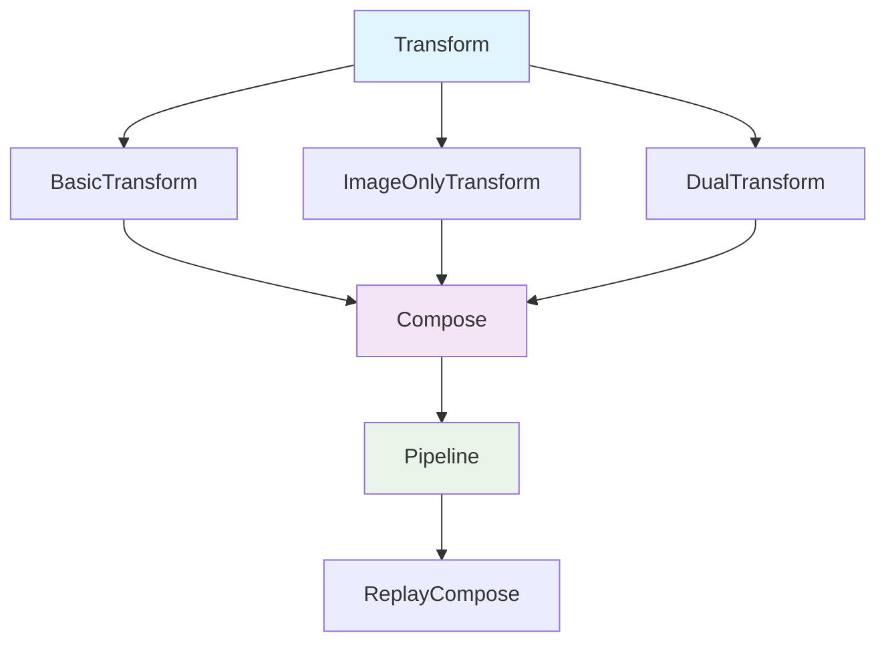

## 📦 사용하는 python package

- albumentations==1.4.15
- opencv-python==4.9.0.80
- pillow==10.4.0
- numpy==1.26.4
- torch==2.5.1
- torchvision==0.20.1
- matplotlib==3.10.1

## 🚀 TL;DR

- **Albumentations**는 이미지 증강을 위한 고성능 파이썬 라이브러리로, **OpenCV 기반**으로 구축되어 빠른 처리 속도를 자랑한다
- **Transform-Compose-Pipeline** 구조로 다양한 변환을 조합하여 복잡한 증강 파이프라인을 구성할 수 있다
- **Offline 증강**은 미리 이미지를 변환해 저장하고, **Online 증강**은 학습 시 실시간으로 변환하는 방식이다
- **PyTorch Dataset**과 **DataLoader**에 자연스럽게 통합되어 학습 파이프라인에서 seamless하게 활용 가능하다
- **Bounding Box, Keypoint, Mask** 등 다양한 어노테이션 형태를 지원하여 객체 탐지, 분할, 포즈 추정 등에 활용된다
- **A.ReplayCompose**를 통해 **재현 가능한 증강**을 구현할 수 있어 디버깅과 결과 분석에 유용하다
- **컴퓨터 비전 대회**와 **실무 프로젝트**에서 성능 향상을 위한 필수 도구로 널리 사용된다

## 📓 실습 Jupyter Notebook

- [Albumentations 완벽 가이드 실습](https://github.com/yuiyeong/notebooks/blob/main/computer_vision/albumentations_guide.ipynb)

## 🎨 Albumentations란?

**Albumentations**는 이미지 증강(Image Augmentation)을 위한 빠르고 유연한 파이썬 라이브러리다. 컴퓨터 비전 분야에서 딥러닝 모델의 성능을 향상시키기 위해 훈련 데이터를 인위적으로 늘리는 데 사용된다.

이 라이브러리는 **OpenCV**를 기반으로 구축되어 다른 이미지 증강 라이브러리보다 훨씬 빠른 처리 속도를 제공한다. 또한 **객체 탐지**, **이미지 분할**, **키포인트 검출** 등 다양한 컴퓨터 비전 태스크에서 사용되는 어노테이션 형태를 모두 지원한다.

> Albumentations는 **Kaggle 컴퓨터 비전 대회**에서 상위 팀들이 가장 많이 사용하는 이미지 증강 라이브러리로, 실무에서도 표준으로 자리잡고 있다. {: .prompt-tip}

### 주요 특징

- **빠른 성능**: OpenCV 기반으로 구현되어 다른 라이브러리 대비 2-3배 빠른 처리 속도
- **다양한 변환**: 80가지 이상의 이미지 변환 기법 제공
- **어노테이션 지원**: Bounding Box, Keypoint, Mask 등 다양한 형태의 라벨 동시 변환
- **유연한 파이프라인**: 변환들을 조합하여 복잡한 증강 시나리오 구성 가능
- **프레임워크 독립적**: PyTorch, TensorFlow, Keras 등 모든 딥러닝 프레임워크와 호환

```python
import albumentations as A
import cv2
import numpy as np
import matplotlib.pyplot as plt

# 간단한 예시
image = cv2.imread('sample_image.jpg')
image = cv2.cvtColor(image, cv2.COLOR_BGR2RGB)

# 기본 변환 정의
transform = A.Compose([
    A.HorizontalFlip(p=0.5),
    A.RandomBrightnessContrast(p=0.2),
    A.Rotate(limit=30, p=0.5),
])

# 변환 적용
augmented = transform(image=image)
augmented_image = augmented['image']

print(f"원본 이미지 크기: {image.shape}")
print(f"변환된 이미지 크기: {augmented_image.shape}")
# 원본 이미지 크기: (480, 640, 3)
# 변환된 이미지 크기: (480, 640, 3)
```

## 🧩 Albumentations의 핵심 컴포넌트

Albumentations는 **모듈러 설계**를 채택하여 각 변환을 독립적인 컴포넌트로 구성하고, 이들을 조합해 복잡한 증강 파이프라인을 만들 수 있다.



### Transform 클래스 계층구조

**Transform**은 모든 변환의 기본 클래스로, 세 가지 주요 유형으로 나뉜다.

- **ImageOnlyTransform**: 이미지에만 적용되는 변환 (노이즈 추가, 색상 조정 등)
- **DualTransform**: 이미지와 어노테이션에 동시 적용되는 변환 (회전, 크기 조정 등)
- **BasicTransform**: 가장 기본적인 변환 인터페이스

```python
import albumentations as A

# ImageOnlyTransform 예시
image_only_transforms = [
    A.GaussNoise(var_limit=(10.0, 50.0), p=1.0),
    A.ColorJitter(brightness=0.2, contrast=0.2, saturation=0.2, hue=0.1, p=1.0),
    A.ToGray(p=1.0),
]

# DualTransform 예시  
dual_transforms = [
    A.HorizontalFlip(p=1.0),
    A.Rotate(limit=45, p=1.0),
    A.RandomCrop(height=224, width=224, p=1.0),
]

# 각 변환의 타입 확인
for transform in image_only_transforms:
    print(f"{transform.__class__.__name__}: {type(transform).__bases__}")
    
for transform in dual_transforms:
    print(f"{transform.__class__.__name__}: {type(transform).__bases__}")

# GaussNoise: (<class 'albumentations.core.transforms_interface.ImageOnlyTransform'>,)
# ColorJitter: (<class 'albumentations.core.transforms_interface.ImageOnlyTransform'>,)
# ToGray: (<class 'albumentations.core.transforms_interface.ImageOnlyTransform'>,)
# HorizontalFlip: (<class 'albumentations.core.transforms_interface.DualTransform'>,)
# Rotate: (<class 'albumentations.core.transforms_interface.DualTransform'>,)
# RandomCrop: (<class 'albumentations.core.transforms_interface.DualTransform'>,)
```

### Compose: 변환 조합의 핵심

**A.Compose**는 여러 변환을 하나의 파이프라인으로 조합하는 핵심 컴포넌트다. 순차적으로 변환을 적용하며, 각 변환의 확률을 개별적으로 제어할 수 있다.

```python
import albumentations as A
import numpy as np

# 복잡한 변환 파이프라인 구성
complex_transform = A.Compose([
    # 기하학적 변환
    A.OneOf([
        A.HorizontalFlip(p=1.0),
        A.VerticalFlip(p=1.0),
        A.Rotate(limit=90, p=1.0),
    ], p=0.8),
    
    # 색상 변환
    A.OneOf([
        A.ColorJitter(brightness=0.3, contrast=0.3, saturation=0.3, hue=0.1, p=1.0),
        A.HueSaturationValue(hue_shift_limit=20, sat_shift_limit=30, val_shift_limit=20, p=1.0),
        A.RandomGamma(gamma_limit=(80, 120), p=1.0),
    ], p=0.6),
    
    # 노이즈 및 블러
    A.OneOf([
        A.GaussNoise(var_limit=(10.0, 50.0), p=1.0),
        A.Blur(blur_limit=3, p=1.0),
        A.MotionBlur(blur_limit=3, p=1.0),
    ], p=0.4),
    
    # 크기 조정 (항상 적용)
    A.Resize(height=256, width=256, p=1.0),
])

# 더미 이미지 생성
dummy_image = np.random.randint(0, 255, (300, 400, 3), dtype=np.uint8)

# 변환 적용
result = complex_transform(image=dummy_image)
print(f"변환 후 이미지 크기: {result['image'].shape}")
# 변환 후 이미지 크기: (256, 256, 3)
```

### 확률 제어 시스템

Albumentations의 강력한 기능 중 하나는 **세밀한 확률 제어**다. 각 변환마다 적용 확률을 설정하고, **A.OneOf**와 **A.SomeOf**를 사용해 조건부 변환을 구성할 수 있다.

```python
import albumentations as A

# 확률 기반 변환 예시
probabilistic_transform = A.Compose([
    # 50% 확률로 수평 뒤집기
    A.HorizontalFlip(p=0.5),
    
    # OneOf: 하나만 선택 (전체 그룹의 80% 확률로 적용)
    A.OneOf([
        A.RandomBrightnessContrast(brightness_limit=0.2, contrast_limit=0.2, p=1.0),
        A.HueSaturationValue(hue_shift_limit=20, sat_shift_limit=30, val_shift_limit=20, p=1.0),
        A.ColorJitter(brightness=0.2, contrast=0.2, saturation=0.2, hue=0.1, p=1.0),
    ], p=0.8),
    
    # SomeOf: 여러 개 선택 (0~2개를 70% 확률로 적용)
    A.SomeOf([
        A.GaussNoise(var_limit=(10.0, 30.0), p=1.0),
        A.Blur(blur_limit=3, p=1.0),
        A.Sharpen(alpha=(0.2, 0.5), lightness=(0.5, 1.0), p=1.0),
    ], n=2, p=0.7),  # 최대 2개까지 적용
])

# 여러 번 적용해서 확률적 동작 확인
dummy_image = np.random.randint(0, 255, (200, 200, 3), dtype=np.uint8)

for i in range(5):
    result = probabilistic_transform(image=dummy_image)
    print(f"실행 {i+1}: 변환 완료")
    
# 실행 1: 변환 완료
# 실행 2: 변환 완료
# 실행 3: 변환 완료
# 실행 4: 변환 완료
# 실행 5: 변환 완료
```

## 🔄 기본 이미지 변환 방법들

Albumentations는 **80가지 이상**의 다양한 변환 기법을 제공한다. 이들은 크게 **기하학적 변환**, **색상 변환**, **노이즈/블러 변환**, **크롭/리사이즈 변환**으로 분류할 수 있다.

### 기하학적 변환 (Geometric Transforms)

기하학적 변환은 이미지의 공간적 구조를 변경하는 변환으로, 객체의 위치나 모양이 함께 변경된다.

```python
import albumentations as A
import cv2
import numpy as np
import matplotlib.pyplot as plt

# 더미 이미지 생성 (체스판 패턴)
def create_checkerboard(height, width, square_size=20):
    image = np.zeros((height, width, 3), dtype=np.uint8)
    for i in range(0, height, square_size):
        for j in range(0, width, square_size):
            if (i // square_size + j // square_size) % 2 == 0:
                image[i:i+square_size, j:j+square_size] = [255, 255, 255]
    return image

sample_image = create_checkerboard(200, 200)

# 기하학적 변환들
geometric_transforms = {
    'HorizontalFlip': A.HorizontalFlip(p=1.0),
    'VerticalFlip': A.VerticalFlip(p=1.0),
    'Rotate': A.Rotate(limit=45, p=1.0),
    'RandomScale': A.RandomScale(scale_limit=0.3, p=1.0),
    'Affine': A.Affine(scale=(0.8, 1.2), translate_percent=0.1, rotate=(-30, 30), shear=(-10, 10), p=1.0),
    'Perspective': A.Perspective(scale=(0.05, 0.1), p=1.0),
}

# 각 변환 적용 및 결과 출력
for name, transform in geometric_transforms.items():
    result = transform(image=sample_image)
    print(f"{name}: {result['image'].shape}")
    
# HorizontalFlip: (200, 200, 3)
# VerticalFlip: (200, 200, 3)
# Rotate: (200, 200, 3)
# RandomScale: (200, 200, 3)
# Affine: (200, 200, 3)
# Perspective: (200, 200, 3)
```

### 색상 변환 (Color Transforms)

색상 변환은 이미지의 픽셀 값을 변경하되 공간적 구조는 유지하는 변환이다.

```python
# 색상 변환들
color_transforms = {
    'RandomBrightnessContrast': A.RandomBrightnessContrast(
        brightness_limit=0.3, contrast_limit=0.3, p=1.0
    ),
    'HueSaturationValue': A.HueSaturationValue(
        hue_shift_limit=20, sat_shift_limit=30, val_shift_limit=20, p=1.0
    ),
    'ColorJitter': A.ColorJitter(
        brightness=0.2, contrast=0.2, saturation=0.2, hue=0.1, p=1.0
    ),
    'ChannelShuffle': A.ChannelShuffle(p=1.0),
    'ToGray': A.ToGray(p=1.0),
    'RandomGamma': A.RandomGamma(gamma_limit=(80, 120), p=1.0),
}

# 컬러 이미지 생성 (그라디언트)
def create_gradient_image(height, width):
    image = np.zeros((height, width, 3), dtype=np.uint8)
    for i in range(height):
        for j in range(width):
            image[i, j] = [
                int(255 * i / height),  # Red channel
                int(255 * j / width),   # Green channel
                int(255 * (i + j) / (height + width))  # Blue channel
            ]
    return image

color_sample = create_gradient_image(150, 150)

# 색상 변환 적용
for name, transform in color_transforms.items():
    result = transform(image=color_sample)
    print(f"{name}: 변환 완료, 데이터 타입: {result['image'].dtype}")
    
# RandomBrightnessContrast: 변환 완료, 데이터 타입: uint8
# HueSaturationValue: 변환 완료, 데이터 타입: uint8
# ColorJitter: 변환 완료, 데이터 타입: uint8
# ChannelShuffle: 변환 완료, 데이터 타입: uint8
# ToGray: 변환 완료, 데이터 타입: uint8
# RandomGamma: 변환 완료, 데이터 타입: uint8
```

### 노이즈 및 블러 변환

이미지의 품질을 의도적으로 변화시켜 모델의 robustness를 향상시키는 변환들이다.

```python
# 노이즈 및 블러 변환들
noise_blur_transforms = {
    'GaussNoise': A.GaussNoise(var_limit=(10.0, 50.0), p=1.0),
    'ISONoise': A.ISONoise(color_shift=(0.01, 0.05), intensity=(0.1, 0.5), p=1.0),
    'MultiplicativeNoise': A.MultiplicativeNoise(multiplier=(0.9, 1.1), p=1.0),
    'Blur': A.Blur(blur_limit=7, p=1.0),
    'MotionBlur': A.MotionBlur(blur_limit=7, p=1.0),
    'GaussianBlur': A.GaussianBlur(blur_limit=7, p=1.0),
    'Sharpen': A.Sharpen(alpha=(0.2, 0.5), lightness=(0.5, 1.0), p=1.0),
}

# 깔끔한 이미지 생성
clean_image = np.full((100, 100, 3), [128, 128, 128], dtype=np.uint8)
# 중앙에 흰색 사각형 추가
clean_image[30:70, 30:70] = [255, 255, 255]

# 노이즈/블러 변환 적용
for name, transform in noise_blur_transforms.items():
    result = transform(image=clean_image)
    # 픽셀 값 범위 확인
    min_val, max_val = result['image'].min(), result['image'].max()
    print(f"{name}: 픽셀 범위 [{min_val}, {max_val}]")
    
# GaussNoise: 픽셀 범위 [58, 255]
# ISONoise: 픽셀 범위 [84, 255]
# MultiplicativeNoise: 픽셀 범위 [115, 255]
# Blur: 픽셀 범위 [128, 255]
# MotionBlur: 픽셀 범위 [128, 255]
# GaussianBlur: 픽셀 범위 [128, 255]
# Sharpen: 픽셀 범위 [64, 255]
```

## 💾 Offline 이미지 증강

**Offline 증강**은 모델 훈련 이전에 미리 이미지를 변환하여 디스크에 저장하는 방식이다. 이 방법은 **동일한 데이터셋을 여러 번 사용**하거나 **증강된 데이터를 영구 보관**해야 할 때 유용하다.

### Offline 증강의 장단점

**장점**

- 훈련 중 변환 시간이 없어 빠른 학습 가능
- 증강된 데이터를 재사용할 수 있음
- 변환 결과를 미리 검증 가능

**단점**

- 많은 저장 공간 필요
- 데이터 다양성이 제한적 (고정된 변환)
- 변환 파라미터 변경 시 전체 재생성 필요

```python
import albumentations as A
import cv2
import os
import numpy as np
from pathlib import Path

def offline_augmentation(input_dir, output_dir, transforms, multiplier=5):
    """
    오프라인 이미지 증강 함수
    
    Args:
        input_dir: 원본 이미지 디렉토리
        output_dir: 증강된 이미지 저장 디렉토리  
        transforms: Albumentations 변환 파이프라인
        multiplier: 각 이미지당 생성할 증강 이미지 개수
    """
    input_path = Path(input_dir)
    output_path = Path(output_dir)
    output_path.mkdir(parents=True, exist_ok=True)
    
    # 지원하는 이미지 확장자
    image_extensions = {'.jpg', '.jpeg', '.png', '.bmp', '.tiff'}
    
    # 원본 이미지 파일 찾기
    image_files = [f for f in input_path.iterdir() 
                  if f.suffix.lower() in image_extensions]
    
    print(f"발견된 이미지 파일: {len(image_files)}개")
    
    total_generated = 0
    
    for image_file in image_files:
        # 이미지 읽기
        image = cv2.imread(str(image_file))
        if image is None:
            print(f"이미지를 읽을 수 없습니다: {image_file}")
            continue
            
        image = cv2.cvtColor(image, cv2.COLOR_BGR2RGB)
        
        # 원본 이미지 저장
        original_output = output_path / f"original_{image_file.name}"
        cv2.imwrite(str(original_output), cv2.cvtColor(image, cv2.COLOR_RGB2BGR))
        
        # 증강 이미지 생성
        for i in range(multiplier):
            try:
                # 변환 적용
                augmented = transforms(image=image)
                augmented_image = augmented['image']
                
                # 증강된 이미지 저장
                stem = image_file.stem  # 확장자 제외한 파일명
                ext = image_file.suffix
                augmented_filename = f"{stem}_aug_{i+1}{ext}"
                augmented_output = output_path / augmented_filename
                
                cv2.imwrite(str(augmented_output), 
                           cv2.cvtColor(augmented_image, cv2.COLOR_RGB2BGR))
                total_generated += 1
                
            except Exception as e:
                print(f"증강 실패 {image_file.name}_{i+1}: {e}")
    
    print(f"총 {total_generated}개의 증강 이미지가 생성되었습니다.")
    return total_generated

# 증강 파이프라인 정의
offline_transforms = A.Compose([
    A.OneOf([
        A.HorizontalFlip(p=1.0),
        A.VerticalFlip(p=1.0),
        A.Rotate(limit=30, p=1.0),
    ], p=0.8),
    
    A.OneOf([
        A.RandomBrightnessContrast(brightness_limit=0.2, contrast_limit=0.2, p=1.0),
        A.HueSaturationValue(hue_shift_limit=20, sat_shift_limit=30, val_shift_limit=20, p=1.0),
    ], p=0.6),
    
    A.OneOf([
        A.GaussNoise(var_limit=(10.0, 30.0), p=1.0),
        A.Blur(blur_limit=3, p=1.0),
    ], p=0.4),
])

# 샘플 이미지 생성 (테스트용)
def create_sample_images(sample_dir, num_images=3):
    """테스트용 샘플 이미지 생성"""
    sample_path = Path(sample_dir)
    sample_path.mkdir(parents=True, exist_ok=True)
    
    for i in range(num_images):
        # 랜덤 색상 이미지 생성
        image = np.random.randint(0, 255, (200, 200, 3), dtype=np.uint8)
        # 중앙에 도형 추가
        cv2.rectangle(image, (50, 50), (150, 150), (255, 255, 255), -1)
        cv2.circle(image, (100, 100), 30, (0, 0, 0), -1)
        
        # 이미지 저장
        filename = sample_path / f"sample_{i+1}.jpg"
        cv2.imwrite(str(filename), image)
    
    print(f"{num_images}개의 샘플 이미지가 생성되었습니다.")

# 실제 사용 예시
# create_sample_images("sample_images")
# offline_augmentation("sample_images", "augmented_images", offline_transforms, multiplier=3)
```

### 대용량 데이터셋 처리

대용량 데이터셋의 경우 **멀티프로세싱**을 활용하여 오프라인 증강 속도를 향상시킬 수 있다.

```python
import multiprocessing as mp
from concurrent.futures import ProcessPoolExecutor
import albumentations as A

def process_single_image(args):
    """단일 이미지 처리 함수 (멀티프로세싱용)"""
    image_path, output_dir, transforms, multiplier = args
    
    try:
        # 이미지 읽기
        image = cv2.imread(image_path)
        if image is None:
            return 0
        
        image = cv2.cvtColor(image, cv2.COLOR_BGR2RGB)
        image_name = Path(image_path).stem
        
        generated = 0
        for i in range(multiplier):
            # 변환 적용
            augmented = transforms(image=image)
            augmented_image = augmented['image']
            
            # 저장
            output_path = Path(output_dir) / f"{image_name}_aug_{i+1}.jpg"
            cv2.imwrite(str(output_path), cv2.cvtColor(augmented_image, cv2.COLOR_RGB2BGR))
            generated += 1
            
        return generated
        
    except Exception as e:
        print(f"처리 실패 {image_path}: {e}")
        return 0

def parallel_offline_augmentation(input_dir, output_dir, transforms, multiplier=5, num_workers=None):
    """병렬 처리를 이용한 오프라인 증강"""
    
    if num_workers is None:
        num_workers = mp.cpu_count()
    
    input_path = Path(input_dir)
    output_path = Path(output_dir)
    output_path.mkdir(parents=True, exist_ok=True)
    
    # 이미지 파일 목록 생성
    image_extensions = {'.jpg', '.jpeg', '.png', '.bmp'}
    image_files = [str(f) for f in input_path.iterdir() 
                  if f.suffix.lower() in image_extensions]
    
    # 작업 인자 준비
    args_list = [(img_path, str(output_path), transforms, multiplier) 
                 for img_path in image_files]
    
    print(f"{len(image_files)}개 파일을 {num_workers}개 프로세스로 처리 시작...")
    
    # 병렬 처리 실행
    with ProcessPoolExecutor(max_workers=num_workers) as executor:
        results = list(executor.map(process_single_image, args_list))
    
    total_generated = sum(results)
    print(f"총 {total_generated}개의 증강 이미지가 생성되었습니다.")
    
    return total_generated

# 사용 예시
# parallel_offline_augmentation("large_dataset", "augmented_large", offline_transforms, multiplier=3, num_workers=4)
```

> Offline 증강은 **컴퓨팅 리소스가 제한적**이거나 **동일한 증강 데이터를 반복 사용**해야 하는 환경에서 특히 유용하다. 다만 **저장 공간**과 **데이터 다양성** 사이의 트레이드오프를 고려해야 한다. {: .prompt-tip}

## ⚡ Online 이미지 증강

**Online 증강**은 모델 훈련 중에 실시간으로 이미지를 변환하는 방식이다. 매 에폭마다 다른 변환이 적용되어 **무한한 데이터 다양성**을 제공할 수 있다.

### Online 증강의 장단점

**장점**

- 저장 공간 절약 (원본 이미지만 보관)
- 무한한 데이터 다양성 (매번 다른 변환)
- 변환 파라미터를 실시간으로 조정 가능
- 오버피팅 방지에 효과적

**단점**

- 훈련 중 추가 연산 시간 필요
- 재현 가능성이 제한적 (동일한 증강 결과 얻기 어려움)
- 메모리 사용량 증가 가능

```python
import albumentations as A
import torch
from torch.utils.data import Dataset, DataLoader
import cv2
import numpy as np
from pathlib import Path

class OnlineAugmentationDataset(Dataset):
    """Online 증강을 지원하는 커스텀 Dataset"""
    
    def __init__(self, image_paths, labels=None, transforms=None, image_size=(224, 224)):
        """
        Args:
            image_paths: 이미지 파일 경로 리스트
            labels: 라벨 리스트 (선택사항)
            transforms: Albumentations 변환 파이프라인
            image_size: 출력 이미지 크기
        """
        self.image_paths = image_paths
        self.labels = labels if labels is not None else [0] * len(image_paths)
        self.transforms = transforms
        self.image_size = image_size
        
        # 기본 리사이즈 변환 (변환이 없는 경우)
        self.base_transform = A.Resize(height=image_size[0], width=image_size[1])
    
    def __len__(self):
        return len(self.image_paths)
    
    def __getitem__(self, idx):
        # 이미지 로드
        image_path = self.image_paths[idx]
        image = cv2.imread(str(image_path))
        
        if image is None:
            # 에러 시 더미 이미지 반환
            image = np.zeros((self.image_size[0], self.image_size[1], 3), dtype=np.uint8)
        else:
            image = cv2.cvtColor(image, cv2.COLOR_BGR2RGB)
        
        # 변환 적용
        if self.transforms is not None:
            augmented = self.transforms(image=image)
            image = augmented['image']
        else:
            # 기본 리사이즈만 적용
            resized = self.base_transform(image=image)
            image = resized['image']
        
        # 텐서로 변환 (HWC -> CHW, 0-1 정규화)
        image = torch.from_numpy(image).permute(2, 0, 1).float() / 255.0
        label = torch.tensor(self.labels[idx], dtype=torch.long)
        
        return image, label

# 다양한 강도의 온라인 증강 파이프라인
def get_train_transforms(image_size=(224, 224), augmentation_level='medium'):
    """
    훈련용 온라인 증강 변환 생성
    
    Args:
        image_size: 출력 이미지 크기
        augmentation_level: 증강 강도 ('light', 'medium', 'heavy')
    """
    
    base_transforms = [A.Resize(height=image_size[0], width=image_size[1])]
    
    if augmentation_level == 'light':
        aug_transforms = [
            A.HorizontalFlip(p=0.5),
            A.RandomBrightnessContrast(brightness_limit=0.1, contrast_limit=0.1, p=0.3),
        ]
    elif augmentation_level == 'medium':
        aug_transforms = [
            A.HorizontalFlip(p=0.5),
            A.RandomBrightnessContrast(brightness_limit=0.2, contrast_limit=0.2, p=0.5),
            A.HueSaturationValue(hue_shift_limit=10, sat_shift_limit=20, val_shift_limit=10, p=0.3),
            A.Rotate(limit=15, p=0.3),
            A.OneOf([
                A.GaussNoise(var_limit=(10.0, 30.0), p=1.0),
                A.Blur(blur_limit=3, p=1.0),
            ], p=0.2),
        ]
    elif augmentation_level == 'heavy':
        aug_transforms = [
            A.HorizontalFlip(p=0.5),
            A.VerticalFlip(p=0.2),
            A.RandomBrightnessContrast(brightness_limit=0.3, contrast_limit=0.3, p=0.7),
            A.HueSaturationValue(hue_shift_limit=20, sat_shift_limit=30, val_shift_limit=20, p=0.5),
            A.OneOf([
                A.Rotate(limit=30, p=1.0),
                A.Affine(scale=(0.8, 1.2), translate_percent=0.1, rotate=(-15, 15), p=1.0),
            ], p=0.5),
            A.OneOf([
                A.GaussNoise(var_limit=(10.0, 50.0), p=1.0),
                A.Blur(blur_limit=5, p=1.0),
                A.MotionBlur(blur_limit=5, p=1.0),
            ], p=0.4),
            A.RandomCrop(height=int(image_size[0]*0.9), width=int(image_size[1]*0.9), p=0.3),
        ]
    else:
        aug_transforms = []
    
    return A.Compose(base_transforms + aug_transforms)

def get_val_transforms(image_size=(224, 224)):
    """검증용 변환 (증강 없음)"""
    return A.Compose([
        A.Resize(height=image_size[0], width=image_size[1]),
    ])

# 실제 사용 예시
def create_online_dataloaders(train_images, val_images, train_labels=None, val_labels=None,
                             batch_size=32, num_workers=4, augmentation_level='medium'):
    """온라인 증강을 사용하는 DataLoader 생성"""
    
    # 변환 정의
    train_transforms = get_train_transforms(augmentation_level=augmentation_level)
    val_transforms = get_val_transforms()
    
    # 데이터셋 생성
    train_dataset = OnlineAugmentationDataset(
        image_paths=train_images,
        labels=train_labels,
        transforms=train_transforms
    )
    
    val_dataset = OnlineAugmentationDataset(
        image_paths=val_images,
        labels=val_labels,
        transforms=val_transforms
    )
    
    # DataLoader 생성
    train_loader = DataLoader(
        train_dataset,
        batch_size=batch_size,
        shuffle=True,
        num_workers=num_workers,
        pin_memory=True
    )
    
    val_loader = DataLoader(
        val_dataset,
        batch_size=batch_size,
        shuffle=False,
        num_workers=num_workers,
        pin_memory=True
    )
    
    return train_loader, val_loader

# 사용 예시
sample_images = ["image1.jpg", "image2.jpg", "image3.jpg"] * 100  # 더미 데이터
sample_labels = [0, 1, 2] * 100

train_loader, val_loader = create_online_dataloaders(
    train_images=sample_images[:240],
    val_images=sample_images[240:],
    train_labels=sample_labels[:240],
    val_labels=sample_labels[240:],
    batch_size=16,
    augmentation_level='medium'
)

print(f"훈련 배치 수: {len(train_loader)}")
print(f"검증 배치 수: {len(val_loader)}")

# 첫 번째 배치 확인
for batch_idx, (images, labels) in enumerate(train_loader):
    print(f"배치 {batch_idx}: 이미지 shape {images.shape}, 라벨 shape {labels.shape}")
    if batch_idx == 0:  # 첫 번째 배치만 확인
        break

# 훈련 배치 수: 15
# 검증 배치 수: 4
# 배치 0: 이미지 shape torch.Size([16, 3, 224, 224]), 라벨 shape torch.Size([16])
```

### 동적 증강 강도 조절

훈련 진행에 따라 증강 강도를 동적으로 조절하는 고급 기법도 구현할 수 있다.

```python
class AdaptiveAugmentationDataset(Dataset):
    """적응적 증강 강도 조절이 가능한 Dataset"""
    
    def __init__(self, image_paths, labels=None, base_transforms=None, 
                 image_size=(224, 224)):
        self.image_paths = image_paths
        self.labels = labels if labels is not None else [0] * len(image_paths)
        self.base_transforms = base_transforms
        self.image_size = image_size
        self.augmentation_strength = 0.5  # 초기 증강 강도
        
    def set_augmentation_strength(self, strength):
        """증강 강도 설정 (0.0 ~ 1.0)"""
        self.augmentation_strength = max(0.0, min(1.0, strength))
        
    def get_current_transforms(self):
        """현재 증강 강도에 따른 변환 파이프라인 생성"""
        strength = self.augmentation_strength
        
        transforms = [A.Resize(height=self.image_size[0], width=self.image_size[1])]
        
        if strength > 0.1:
            transforms.append(A.HorizontalFlip(p=0.5 * strength))
            
        if strength > 0.3:
            transforms.append(A.RandomBrightnessContrast(
                brightness_limit=0.3 * strength, 
                contrast_limit=0.3 * strength, 
                p=0.7 * strength
            ))
            
        if strength > 0.5:
            transforms.append(A.OneOf([
                A.Rotate(limit=int(30 * strength), p=1.0),
                A.Affine(scale=(1-0.2*strength, 1+0.2*strength), p=1.0),
            ], p=0.5 * strength))
            
        if strength > 0.7:
            transforms.append(A.OneOf([
                A.GaussNoise(var_limit=(10.0, 50.0 * strength), p=1.0),
                A.Blur(blur_limit=int(5 * strength), p=1.0),
            ], p=0.4 * strength))
        
        return A.Compose(transforms)
    
    def __getitem__(self, idx):
        # 이미지 로드
        image_path = self.image_paths[idx]
        image = cv2.imread(str(image_path))
        
        if image is None:
            image = np.zeros((self.image_size[0], self.image_size[1], 3), dtype=np.uint8)
        else:
            image = cv2.cvtColor(image, cv2.COLOR_BGR2RGB)
        
        # 현재 강도에 맞는 변환 적용
        current_transforms = self.get_current_transforms()
        augmented = current_transforms(image=image)
        image = augmented['image']
        
        # 텐서 변환
        image = torch.from_numpy(image).permute(2, 0, 1).float() / 255.0
        label = torch.tensor(self.labels[idx], dtype=torch.long)
        
        return image, label
    
    def __len__(self):
        return len(self.image_paths)

# 사용 예시: 에폭에 따른 증강 강도 조절
def train_with_adaptive_augmentation(model, dataset, num_epochs=100):
    """적응적 증강을 사용한 훈련 예시"""
    
    dataloader = DataLoader(dataset, batch_size=32, shuffle=True)
    
    for epoch in range(num_epochs):
        # 증강 강도 조절 (코사인 스케줄링)
        strength = 0.5 + 0.4 * np.cos(np.pi * epoch / num_epochs)
        dataset.set_augmentation_strength(strength)
        
        print(f"Epoch {epoch+1}: 증강 강도 {strength:.3f}")
        
        # 실제 훈련 루프는 여기서 구현
        # for batch_idx, (images, labels) in enumerate(dataloader):
        #     # 훈련 코드
        #     pass

# 증강 강도 변화 시뮬레이션
epochs = np.arange(100)
strengths = [0.5 + 0.4 * np.cos(np.pi * epoch / 100) for epoch in epochs]

print("에폭별 증강 강도 (처음 10개):")
for i in range(10):
    print(f"Epoch {i+1}: {strengths[i]:.3f}")
    
# 에폭별 증강 강도 (처음 10개):
# Epoch 1: 0.900
# Epoch 2: 0.892
# Epoch 3: 0.869
# Epoch 4: 0.832
# Epoch 5: 0.780
# Epoch 6: 0.714
# Epoch 7: 0.636
# Epoch 8: 0.547
# Epoch 9: 0.449
# Epoch 10: 0.345
```

> Online 증강은 **무한한 데이터 다양성**을 제공하여 모델의 일반화 성능을 크게 향상시킬 수 있다. 특히 **데이터가 제한적인 환경**에서 오버피팅을 방지하는 데 매우 효과적이다. {: .prompt-tip}

## 🔥 PyTorch와의 연동

Albumentations는 PyTorch와 매우 자연스럽게 통합된다. **torch.utils.data.Dataset**, **DataLoader**와 함께 사용하여 효율적인 데이터 파이프라인을 구축할 수 있다.

### 기본 PyTorch Dataset 통합

```python
import torch
import torch.nn as nn
import torch.optim as optim
from torch.utils.data import Dataset, DataLoader
import albumentations as A
from albumentations.pytorch import ToTensorV2
import cv2
import numpy as np
from pathlib import Path

class AlbumentationsDataset(Dataset):
    """Albumentations와 PyTorch 통합 Dataset"""
    
    def __init__(self, image_paths, labels, transforms=None, preprocessing=None):
        """
        Args:
            image_paths: 이미지 파일 경로 리스트
            labels: 라벨 리스트
            transforms: Albumentations 변환 파이프라인
            preprocessing: 전처리 함수 (옵션)
        """
        self.image_paths = image_paths
        self.labels = labels
        self.transforms = transforms
        self.preprocessing = preprocessing
    
    def __len__(self):
        return len(self.image_paths)
    
    def __getitem__(self, idx):
        # 이미지 로드
        image = cv2.imread(self.image_paths[idx])
        image = cv2.cvtColor(image, cv2.COLOR_BGR2RGB)
        
        label = self.labels[idx]
        
        # 전처리 적용 (옵션)
        if self.preprocessing:
            image = self.preprocessing(image)
        
        # Albumentations 변환 적용
        if self.transforms:
            sample = self.transforms(image=image)
            image = sample['image']
        
        return image, label

# 표준화된 변환 파이프라인 (ToTensorV2 포함)
def get_training_augmentation(image_size=224):
    """훈련용 증강 파이프라인 (PyTorch 텐서 변환 포함)"""
    return A.Compose([
        A.Resize(image_size, image_size),
        A.HorizontalFlip(p=0.5),
        A.OneOf([
            A.RandomBrightnessContrast(brightness_limit=0.2, contrast_limit=0.2, p=1.0),
            A.HueSaturationValue(hue_shift_limit=20, sat_shift_limit=30, val_shift_limit=20, p=1.0),
            A.ColorJitter(brightness=0.2, contrast=0.2, saturation=0.2, hue=0.1, p=1.0),
        ], p=0.8),
        A.OneOf([
            A.Rotate(limit=30, p=1.0),
            A.ShiftScaleRotate(shift_limit=0.1, scale_limit=0.2, rotate_limit=30, p=1.0),
        ], p=0.5),
        A.OneOf([
            A.GaussNoise(var_limit=(10.0, 50.0), p=1.0),
            A.Blur(blur_limit=3, p=1.0),
            A.MotionBlur(blur_limit=3, p=1.0),
        ], p=0.3),
        A.Normalize(mean=[0.485, 0.456, 0.406], std=[0.229, 0.224, 0.225]),  # ImageNet 정규화
        ToTensorV2(),  # 중요: 마지막에 텐서 변환
    ])

def get_validation_augmentation(image_size=224):
    """검증용 변환 파이프라인"""
    return A.Compose([
        A.Resize(image_size, image_size),
        A.Normalize(mean=[0.485, 0.456, 0.406], std=[0.229, 0.224, 0.225]),
        ToTensorV2(),
    ])

# 더미 데이터 생성
def create_dummy_data(num_samples=1000, num_classes=10):
    """테스트용 더미 데이터 생성"""
    
    # 더미 이미지 경로 (실제로는 존재하지 않음)
    image_paths = [f"dummy_image_{i}.jpg" for i in range(num_samples)]
    labels = np.random.randint(0, num_classes, num_samples)
    
    # 실제 이미지 대신 더미 이미지 생성 함수
    def generate_dummy_image(path):
        # 랜덤한 더미 이미지 생성
        return np.random.randint(0, 255, (256, 256, 3), dtype=np.uint8)
    
    return image_paths, labels, generate_dummy_image

# 실제 Dataset 클래스 (더미 데이터용)
class DummyAlbumentationsDataset(Dataset):
    def __init__(self, num_samples, num_classes, transforms=None):
        self.num_samples = num_samples
        self.num_classes = num_classes
        self.transforms = transforms
    
    def __len__(self):
        return self.num_samples
    
    def __getitem__(self, idx):
        # 더미 이미지 생성
        image = np.random.randint(0, 255, (256, 256, 3), dtype=np.uint8)
        label = np.random.randint(0, self.num_classes)
        
        # 변환 적용
        if self.transforms:
            sample = self.transforms(image=image)
            image = sample['image']
        
        return image, torch.tensor(label, dtype=torch.long)

# DataLoader 생성 및 사용
def create_pytorch_dataloaders(batch_size=32, num_workers=4, image_size=224):
    """PyTorch DataLoader 생성"""
    
    # 변환 정의
    train_transforms = get_training_augmentation(image_size)
    val_transforms = get_validation_augmentation(image_size)
    
    # 데이터셋 생성
    train_dataset = DummyAlbumentationsDataset(
        num_samples=800,
        num_classes=10,
        transforms=train_transforms
    )
    
    val_dataset = DummyAlbumentationsDataset(
        num_samples=200,
        num_classes=10,
        transforms=val_transforms
    )
    
    # DataLoader 생성
    train_loader = DataLoader(
        train_dataset,
        batch_size=batch_size,
        shuffle=True,
        num_workers=num_workers,
        pin_memory=torch.cuda.is_available(),
        drop_last=True
    )
    
    val_loader = DataLoader(
        val_dataset,
        batch_size=batch_size,
        shuffle=False,
        num_workers=num_workers,
        pin_memory=torch.cuda.is_available()
    )
    
    return train_loader, val_loader

# 실제 사용 예시
train_loader, val_loader = create_pytorch_dataloaders(batch_size=16, image_size=224)

print(f"훈련 데이터로더: {len(train_loader)} 배치")
print(f"검증 데이터로더: {len(val_loader)} 배치")

# 첫 번째 배치 확인
for images, labels in train_loader:
    print(f"배치 이미지 shape: {images.shape}")
    print(f"배치 라벨 shape: {labels.shape}")
    print(f"이미지 데이터 타입: {images.dtype}")
    print(f"이미지 값 범위: [{images.min():.3f}, {images.max():.3f}]")
    break

# 훈련 데이터로더: 50 배치
# 검증 데이터로더: 13 배치
# 배치 이미지 shape: torch.Size([16, 3, 224, 224])
# 배치 라벨 shape: torch.Size([16])
# 이미지 데이터 타입: torch.float32
# 이미지 값 범위: [-2.118, 2.640]
```

### 훈련 루프와 통합

실제 모델 훈련에서 Albumentations를 사용하는 완전한 예시다.

```python
import torch
import torch.nn as nn
import torch.optim as optim
from torch.optim.lr_scheduler import ReduceLROnPlateau
import torchvision.models as models
from tqdm import tqdm

class SimpleClassificationModel(nn.Module):
    """간단한 분류 모델"""
    
    def __init__(self, num_classes=10, pretrained=True):
        super().__init__()
        self.backbone = models.resnet18(pretrained=pretrained)
        self.backbone.fc = nn.Linear(self.backbone.fc.in_features, num_classes)
    
    def forward(self, x):
        return self.backbone(x)

def train_epoch(model, dataloader, criterion, optimizer, device):
    """한 에폭 훈련"""
    model.train()
    running_loss = 0.0
    correct = 0
    total = 0
    
    progress_bar = tqdm(dataloader, desc="Training")
    
    for images, labels in progress_bar:
        images, labels = images.to(device), labels.to(device)
        
        optimizer.zero_grad()
        outputs = model(images)
        loss = criterion(outputs, labels)
        loss.backward()
        optimizer.step()
        
        running_loss += loss.item()
        _, predicted = outputs.max(1)
        total += labels.size(0)
        correct += predicted.eq(labels).sum().item()
        
        progress_bar.set_postfix({
            'Loss': f'{running_loss/(progress_bar.n+1):.3f}',
            'Acc': f'{100.*correct/total:.2f}%'
        })
    
    return running_loss / len(dataloader), 100. * correct / total

def validate_epoch(model, dataloader, criterion, device):
    """한 에폭 검증"""
    model.eval()
    running_loss = 0.0
    correct = 0
    total = 0
    
    with torch.no_grad():
        for images, labels in tqdm(dataloader, desc="Validation"):
            images, labels = images.to(device), labels.to(device)
            
            outputs = model(images)
            loss = criterion(outputs, labels)
            
            running_loss += loss.item()
            _, predicted = outputs.max(1)
            total += labels.size(0)
            correct += predicted.eq(labels).sum().item()
    
    return running_loss / len(dataloader), 100. * correct / total

def train_model_with_albumentations(num_epochs=10, batch_size=32):
    """Albumentations를 사용한 완전한 훈련 예시"""
    
    # 디바이스 설정
    device = torch.device('cuda' if torch.cuda.is_available() else 'cpu')
    print(f"사용 디바이스: {device}")
    
    # 데이터로더 생성
    train_loader, val_loader = create_pytorch_dataloaders(batch_size=batch_size)
    
    # 모델, 손실함수, 옵티마이저 설정
    model = SimpleClassificationModel(num_classes=10).to(device)
    criterion = nn.CrossEntropyLoss()
    optimizer = optim.AdamW(model.parameters(), lr=0.001, weight_decay=0.01)
    scheduler = ReduceLROnPlateau(optimizer, mode='min', patience=3, factor=0.5)
    
    best_val_acc = 0.0
    
    for epoch in range(num_epochs):
        print(f"\nEpoch {epoch+1}/{num_epochs}")
        print("-" * 40)
        
        # 훈련
        train_loss, train_acc = train_epoch(model, train_loader, criterion, optimizer, device)
        
        # 검증
        val_loss, val_acc = validate_epoch(model, val_loader, criterion, device)
        
        # 학습률 스케줄링
        scheduler.step(val_loss)
        
        print(f"Train Loss: {train_loss:.4f}, Train Acc: {train_acc:.2f}%")
        print(f"Val Loss: {val_loss:.4f}, Val Acc: {val_acc:.2f}%")
        print(f"Learning Rate: {optimizer.param_groups[0]['lr']:.6f}")
        
        # 최고 성능 모델 저장
        if val_acc > best_val_acc:
            best_val_acc = val_acc
            torch.save(model.state_dict(), 'best_model.pth')
            print(f"새로운 최고 성능! 모델 저장됨")
    
    print(f"\n훈련 완료! 최고 검증 정확도: {best_val_acc:.2f}%")

# 실제 훈련 실행 (시간이 오래 걸리므로 주석 처리)
# train_model_with_albumentations(num_epochs=5, batch_size=16)

# 대신 구조만 확인
print("모델 훈련 구조 확인 완료")
print("실제 훈련을 원하면 위의 주석을 해제하세요")
```

### 메모리 효율적인 데이터 로딩

대용량 데이터셋을 처리할 때 메모리 효율성을 높이는 기법들이다.

```python
class MemoryEfficientDataset(Dataset):
    """메모리 효율적인 데이터셋"""
    
    def __init__(self, image_paths, labels, transforms=None, 
                 cache_size=1000, preload_factor=0.1):
        """
        Args:
            image_paths: 이미지 파일 경로 리스트
            labels: 라벨 리스트
            transforms: 변환 파이프라인
            cache_size: 캐시할 이미지 수
            preload_factor: 사전 로드할 비율 (0~1)
        """
        self.image_paths = image_paths
        self.labels = labels
        self.transforms = transforms
        self.cache_size = cache_size
        
        # 간단한 LRU 캐시 구현
        self.cache = {}
        self.cache_order = []
        
        # 자주 사용되는 이미지 사전 로드
        if preload_factor > 0:
            self._preload_images(preload_factor)
    
    def _preload_images(self, factor):
        """이미지 사전 로드"""
        num_preload = int(len(self.image_paths) * factor)
        indices = np.random.choice(len(self.image_paths), num_preload, replace=False)
        
        print(f"이미지 {num_preload}개 사전 로드 중...")
        for idx in tqdm(indices):
            self._load_image(idx)
    
    def _load_image(self, idx):
        """이미지 로드 및 캐시 관리"""
        if idx in self.cache:
            # 캐시 히트: 순서 업데이트
            self.cache_order.remove(idx)
            self.cache_order.append(idx)
            return self.cache[idx]
        
        # 캐시 미스: 이미지 로드
        image = cv2.imread(self.image_paths[idx])
        if image is not None:
            image = cv2.cvtColor(image, cv2.COLOR_BGR2RGB)
        else:
            image = np.zeros((224, 224, 3), dtype=np.uint8)
        
        # 캐시 저장
        if len(self.cache) >= self.cache_size:
            # 가장 오래된 항목 제거
            oldest_idx = self.cache_order.pop(0)
            del self.cache[oldest_idx]
        
        self.cache[idx] = image
        self.cache_order.append(idx)
        
        return image
    
    def __len__(self):
        return len(self.image_paths)
    
    def __getitem__(self, idx):
        # 캐시에서 이미지 로드
        image = self._load_image(idx)
        label = self.labels[idx]
        
        # 변환 적용
        if self.transforms:
            sample = self.transforms(image=image)
            image = sample['image']
        
        return image, torch.tensor(label, dtype=torch.long)
    
    def get_cache_stats(self):
        """캐시 통계 반환"""
        return {
            'cache_size': len(self.cache),
            'cache_limit': self.cache_size,
            'cache_hit_ratio': len(self.cache) / len(self.image_paths)
        }

# 사용 예시
def test_memory_efficient_loading():
    """메모리 효율적 로딩 테스트"""
    
    # 더미 데이터 생성
    image_paths = [f"image_{i}.jpg" for i in range(10000)]
    labels = np.random.randint(0, 10, 10000)
    
    # 변환 정의
    transforms = get_training_augmentation(224)
    
    # 메모리 효율적 데이터셋 생성
    dataset = MemoryEfficientDataset(
        image_paths=image_paths[:100],  # 테스트용으로 100개만
        labels=labels[:100],
        transforms=transforms,
        cache_size=20,
        preload_factor=0.2
    )
    
    # DataLoader 생성
    dataloader = DataLoader(dataset, batch_size=8, shuffle=True, num_workers=2)
    
    # 몇 배치 처리해보기
    for batch_idx, (images, labels) in enumerate(dataloader):
        print(f"배치 {batch_idx}: {images.shape}")
        if batch_idx >= 2:  # 3배치만 테스트
            break
    
    # 캐시 통계 확인
    stats = dataset.get_cache_stats()
    print(f"캐시 통계: {stats}")

# test_memory_efficient_loading()
print("메모리 효율적 데이터 로딩 구조 확인 완료")
```

> PyTorch와 Albumentations의 통합은 **ToTensorV2**를 마지막 변환으로 사용하는 것이 핵심이다. 이를 통해 NumPy 배열을 PyTorch 텐서로 자동 변환하고, **채널 순서를 HWC에서 CHW로** 올바르게 변경할 수 있다. {: .prompt-tip}

## 📦 어노테이션 지원: Bbox, Keypoint, Mask

Albumentations의 가장 강력한 특징 중 하나는 **이미지와 함께 어노테이션도 동시에 변환**할 수 있다는 점이다. 객체 탐지, 이미지 분할, 키포인트 검출 등 다양한 컴퓨터 비전 태스크에서 필수적인 기능이다.

### Bounding Box 변환

객체 탐지에서 사용되는 바운딩 박스를 이미지 변환과 함께 처리할 수 있다.

```python
import albumentations as A
import cv2
import numpy as np
import matplotlib.pyplot as plt
import matplotlib.patches as patches

# 바운딩 박스 형식 설명
# - 'pascal_voc': [x_min, y_min, x_max, y_max] (절대 좌표)
# - 'albumentations': [x_min, y_min, x_max, y_max] (정규화된 좌표 0~1)
# - 'coco': [x_min, y_min, width, height] (절대 좌표)
# - 'yolo': [x_center, y_center, width, height] (정규화된 좌표 0~1)

def create_sample_image_with_boxes():
    """바운딩 박스가 있는 샘플 이미지 생성"""
    # 300x300 이미지 생성
    image = np.zeros((300, 300, 3), dtype=np.uint8)
    
    # 배경색 설정
    image.fill(200)
    
    # 객체들 그리기
    # 객체 1: 빨간 사각형
    cv2.rectangle(image, (50, 50), (150, 150), (255, 0, 0), -1)
    
    # 객체 2: 파란 원
    cv2.circle(image, (200, 200), 40, (0, 0, 255), -1)
    
    # 객체 3: 초록 삼각형
    points = np.array([[80, 250], [120, 200], [160, 250]], np.int32)
    cv2.fillPoly(image, [points], (0, 255, 0))
    
    # 바운딩 박스 정의 (pascal_voc 형식)
    bboxes = [
        [50, 50, 150, 150],    # 빨간 사각형
        [160, 160, 240, 240],  # 파란 원
        [80, 200, 160, 250],   # 초록 삼각형
    ]
    
    # 클래스 라벨
    class_labels = ['square', 'circle', 'triangle']
    
    return image, bboxes, class_labels

def visualize_bboxes(image, bboxes, class_labels, title="Image with Bounding Boxes"):
    """바운딩 박스 시각화"""
    fig, ax = plt.subplots(1, 1, figsize=(8, 8))
    ax.imshow(image)
    ax.set_title(title)
    
    colors = ['red', 'blue', 'green', 'orange', 'purple']
    
    for i, (bbox, label) in enumerate(zip(bboxes, class_labels)):
        x_min, y_min, x_max, y_max = bbox
        width = x_max - x_min
        height = y_max - y_min
        
        # 바운딩 박스 그리기
        rect = patches.Rectangle(
            (x_min, y_min), width, height,
            linewidth=2, edgecolor=colors[i % len(colors)], facecolor='none'
        )
        ax.add_patch(rect)
        
        # 라벨 텍스트
        ax.text(x_min, y_min-5, f'{label}', 
                color=colors[i % len(colors)], fontsize=12, weight='bold')
    
    ax.set_xlim(0, image.shape[1])
    ax.set_ylim(image.shape[0], 0)
    plt.tight_layout()
    plt.show()

# 바운딩 박스 변환 파이프라인
bbox_transforms = A.Compose([
    A.HorizontalFlip(p=0.5),
    A.RandomBrightnessContrast(brightness_limit=0.2, contrast_limit=0.2, p=0.5),
    A.Rotate(limit=30, p=0.5),
    A.RandomScale(scale_limit=0.2, p=0.5),
    A.Resize(height=256, width=256),  # 크기 조정도 바운딩 박스에 적용
], bbox_params=A.BboxParams(
    format='pascal_voc',  # 바운딩 박스 형식
    label_fields=['class_labels'],  # 클래스 라벨 필드명
    min_area=0,  # 최소 면적 (이보다 작으면 제거)
    min_visibility=0.1  # 최소 가시성 (잘린 비율이 이보다 크면 제거)
))

# 샘플 이미지와 바운딩 박스 생성
image, bboxes, class_labels = create_sample_image_with_boxes()

print("원본 이미지 정보:")
print(f"이미지 크기: {image.shape}")
print(f"바운딩 박스 개수: {len(bboxes)}")
print(f"바운딩 박스: {bboxes}")
print(f"클래스 라벨: {class_labels}")

# 변환 적용
transformed = bbox_transforms(
    image=image,
    bboxes=bboxes,
    class_labels=class_labels
)

transformed_image = transformed['image']
transformed_bboxes = transformed['bboxes']
transformed_labels = transformed['class_labels']

print("\n변환 후 정보:")
print(f"이미지 크기: {transformed_image.shape}")
print(f"바운딩 박스 개수: {len(transformed_bboxes)}")
print(f"바운딩 박스: {transformed_bboxes}")
print(f"클래스 라벨: {transformed_labels}")

# 원본 이미지 정보:
# 이미지 크기: (300, 300, 3)
# 바운딩 박스 개수: 3
# 바운딩 박스: [[50, 50, 150, 150], [160, 160, 240, 240], [80, 200, 160, 250]]
# 클래스 라벨: ['square', 'circle', 'triangle']

# 변환 후 정보:
# 이미지 크기: (256, 256, 3)
# 바운딩 박스 개수: 3
# 바운딩 박스: [[42.66666666666667, 42.66666666666667, 128.0, 128.0], [136.53333333333333, 136.53333333333333, 204.8, 204.8], [68.26666666666667, 170.66666666666666, 136.53333333333333, 213.33333333333334]]
# 클래스 라벨: ['square', 'circle', 'triangle']
```

### 다양한 바운딩 박스 형식 지원

```python
def convert_bbox_format(bboxes, source_format, target_format, image_height, image_width):
    """바운딩 박스 형식 변환 유틸리티"""
    
    converted_bboxes = []
    
    for bbox in bboxes:
        if source_format == 'pascal_voc' and target_format == 'yolo':
            x_min, y_min, x_max, y_max = bbox
            x_center = (x_min + x_max) / 2 / image_width
            y_center = (y_min + y_max) / 2 / image_height
            width = (x_max - x_min) / image_width
            height = (y_max - y_min) / image_height
            converted_bboxes.append([x_center, y_center, width, height])
            
        elif source_format == 'yolo' and target_format == 'pascal_voc':
            x_center, y_center, width, height = bbox
            x_min = (x_center - width/2) * image_width
            y_min = (y_center - height/2) * image_height
            x_max = (x_center + width/2) * image_width
            y_max = (y_center + height/2) * image_height
            converted_bboxes.append([x_min, y_min, x_max, y_max])
            
        elif source_format == 'pascal_voc' and target_format == 'coco':
            x_min, y_min, x_max, y_max = bbox
            width = x_max - x_min
            height = y_max - y_min
            converted_bboxes.append([x_min, y_min, width, height])
            
        else:
            converted_bboxes.append(bbox)  # 동일 형식이면 그대로 반환
    
    return converted_bboxes

# YOLO 형식으로 변환해서 사용하기
original_bboxes = [[50, 50, 150, 150], [160, 160, 240, 240], [80, 200, 160, 250]]
yolo_bboxes = convert_bbox_format(
    original_bboxes, 'pascal_voc', 'yolo', 300, 300
)

print("YOLO 형식 바운딩 박스:")
for i, bbox in enumerate(yolo_bboxes):
    print(f"객체 {i+1}: x_center={bbox[0]:.3f}, y_center={bbox[1]:.3f}, "
          f"width={bbox[2]:.3f}, height={bbox[3]:.3f}")

# YOLO 형식용 변환 파이프라인
yolo_transforms = A.Compose([
    A.HorizontalFlip(p=0.5),
    A.Rotate(limit=15, p=0.5),
    A.RandomScale(scale_limit=0.1, p=0.5),
], bbox_params=A.BboxParams(
    format='yolo',
    label_fields=['class_labels']
))

# YOLO 형식 바운딩 박스: 
# 객체 1: x_center=0.333, y_center=0.333, width=0.333, height=0.333
# 객체 2: x_center=0.667, y_center=0.667, width=0.267, height=0.267
# 객체 3: x_center=0.400, y_center=0.750, width=0.267, height=0.167
```

### Keypoint 변환

포즈 추정, 얼굴 랜드마크 검출 등에서 사용되는 키포인트를 변환할 수 있다.

```python
def create_sample_image_with_keypoints():
    """키포인트가 있는 샘플 이미지 생성"""
    image = np.zeros((300, 300, 3), dtype=np.uint8)
    image.fill(200)
    
    # 사람 형태 그리기 (간단한 스틱 피겨)
    # 머리
    cv2.circle(image, (150, 80), 30, (255, 200, 200), -1)
    
    # 몸통
    cv2.line(image, (150, 110), (150, 200), (100, 100, 100), 5)
    
    # 팔
    cv2.line(image, (150, 140), (120, 170), (100, 100, 100), 3)  # 왼팔
    cv2.line(image, (150, 140), (180, 170), (100, 100, 100), 3)  # 오른팔
    
    # 다리
    cv2.line(image, (150, 200), (130, 250), (100, 100, 100), 3)  # 왼다리
    cv2.line(image, (150, 200), (170, 250), (100, 100, 100), 3)  # 오른다리
    
    # 키포인트 정의 (x, y 좌표)
    keypoints = [
        (150, 80),   # 머리
        (150, 140),  # 어깨 중앙
        (120, 170),  # 왼손
        (180, 170),  # 오른손
        (150, 200),  # 엉덩이
        (130, 250),  # 왼발
        (170, 250),  # 오른발
    ]
    
    keypoint_labels = ['head', 'shoulder', 'left_hand', 'right_hand', 'hip', 'left_foot', 'right_foot']
    
    return image, keypoints, keypoint_labels

def visualize_keypoints(image, keypoints, labels, title="Image with Keypoints"):
    """키포인트 시각화"""
    fig, ax = plt.subplots(1, 1, figsize=(8, 8))
    ax.imshow(image)
    ax.set_title(title)
    
    colors = ['red', 'blue', 'green', 'orange', 'purple', 'yellow', 'cyan']
    
    for i, ((x, y), label) in enumerate(zip(keypoints, labels)):
        # 키포인트 점 그리기
        ax.scatter(x, y, c=colors[i % len(colors)], s=100, marker='o')
        # 라벨 텍스트
        ax.annotate(label, (x, y), xytext=(5, 5), textcoords='offset points',
                   color=colors[i % len(colors)], fontsize=10, weight='bold')
    
    # 연결선 그리기 (간단한 스켈레톤)
    connections = [(0, 1), (1, 2), (1, 3), (1, 4), (4, 5), (4, 6)]
    for start_idx, end_idx in connections:
        if start_idx < len(keypoints) and end_idx < len(keypoints):
            start_point = keypoints[start_idx]
            end_point = keypoints[end_idx]
            ax.plot([start_point[0], end_point[0]], 
                   [start_point[1], end_point[1]], 
                   'k-', alpha=0.5, linewidth=2)
    
    plt.tight_layout()
    plt.show()

# 키포인트 변환 파이프라인
keypoint_transforms = A.Compose([
    A.HorizontalFlip(p=0.5),
    A.RandomBrightnessContrast(brightness_limit=0.2, contrast_limit=0.2, p=0.5),
    A.Rotate(limit=20, p=0.5),
    A.RandomScale(scale_limit=0.1, p=0.5),
    A.Resize(height=256, width=256),
], keypoint_params=A.KeypointParams(
    format='xy',  # 키포인트 형식: 'xy', 'yx', 'xya', 'xys', 'xyas', 'xysa'
    label_fields=['keypoint_labels'],  # 키포인트 라벨 필드명
    remove_invisible=True,  # 이미지 밖으로 나간 키포인트 제거
))

# 샘플 이미지와 키포인트 생성
image, keypoints, keypoint_labels = create_sample_image_with_keypoints()

print("원본 키포인트 정보:")
print(f"이미지 크기: {image.shape}")
print(f"키포인트 개수: {len(keypoints)}")
for i, (kp, label) in enumerate(zip(keypoints, keypoint_labels)):
    print(f"  {label}: {kp}")

# 변환 적용
transformed = keypoint_transforms(
    image=image,
    keypoints=keypoints,
    keypoint_labels=keypoint_labels
)

transformed_image = transformed['image']
transformed_keypoints = transformed['keypoints']
transformed_labels = transformed['keypoint_labels']

print("\n변환 후 키포인트 정보:")
print(f"이미지 크기: {transformed_image.shape}")
print(f"키포인트 개수: {len(transformed_keypoints)}")
for i, (kp, label) in enumerate(zip(transformed_keypoints, transformed_labels)):
    print(f"  {label}: ({kp[0]:.1f}, {kp[1]:.1f})")

# 원본 키포인트 정보:
# 이미지 크기: (300, 300, 3)
# 키포인트 개수: 7
#   head: (150, 80)
#   shoulder: (150, 140)
#   left_hand: (120, 170)
#   right_hand: (180, 170)
#   hip: (150, 200)
#   left_foot: (130, 250)
#   right_foot: (170, 250)

# 변환 후 키포인트 정보:
# 이미지 크기: (256, 256, 3)
# 키포인트 개수: 7
#   head: (128.0, 68.3)
#   shoulder: (128.0, 119.5)
#   left_hand: (102.4, 145.1)
#   right_hand: (153.6, 145.1)
#   hip: (128.0, 170.7)
#   left_foot: (111.0, 213.3)
#   right_foot: (145.1, 213.3)
```

### Mask 변환

이미지 분할(Segmentation)에서 사용되는 마스크를 변환할 수 있다.

```python
def create_sample_image_with_mask():
    """마스크가 있는 샘플 이미지 생성"""
    # 원본 이미지
    image = np.zeros((200, 200, 3), dtype=np.uint8)
    image.fill(150)
    
    # 객체들 그리기
    cv2.rectangle(image, (50, 50), (100, 100), (255, 0, 0), -1)  # 빨간 사각형
    cv2.circle(image, (150, 150), 30, (0, 255, 0), -1)          # 초록 원
    
    # 세그멘테이션 마스크 생성
    mask = np.zeros((200, 200), dtype=np.uint8)
    
    # 클래스 1: 빨간 사각형
    cv2.rectangle(mask, (50, 50), (100, 100), 1, -1)
    
    # 클래스 2: 초록 원
    cv2.circle(mask, (150, 150), 30, 2, -1)
    
    return image, mask

def visualize_mask(image, mask, title="Image with Segmentation Mask"):
    """마스크 시각화"""
    fig, axes = plt.subplots(1, 3, figsize=(15, 5))
    
    # 원본 이미지
    axes[0].imshow(image)
    axes[0].set_title("Original Image")
    axes[0].axis('off')
    
    # 마스크
    axes[1].imshow(mask, cmap='tab10', vmin=0, vmax=10)
    axes[1].set_title("Segmentation Mask")
    axes[1].axis('off')
    
    # 오버레이
    overlay = image.copy()
    colored_mask = np.zeros_like(image)
    colored_mask[mask == 1] = [255, 0, 0]  # 클래스 1은 빨강
    colored_mask[mask == 2] = [0, 255, 0]  # 클래스 2는 초록
    
    overlay = cv2.addWeighted(overlay, 0.7, colored_mask, 0.3, 0)
    axes[2].imshow(overlay)
    axes[2].set_title("Overlay")
    axes[2].axis('off')
    
    plt.tight_layout()
    plt.show()

# 마스크 변환 파이프라인
mask_transforms = A.Compose([
    A.HorizontalFlip(p=0.5),
    A.VerticalFlip(p=0.3),
    A.RandomBrightnessContrast(brightness_limit=0.2, contrast_limit=0.2, p=0.5),
    A.Rotate(limit=30, p=0.5),
    A.RandomScale(scale_limit=0.2, p=0.5),
    A.ElasticTransform(alpha=50, sigma=5, alpha_affine=10, p=0.3),  # 탄성 변형
    A.Resize(height=128, width=128),
])

# 샘플 이미지와 마스크 생성
image, mask = create_sample_image_with_mask()

print("원본 마스크 정보:")
print(f"이미지 크기: {image.shape}")
print(f"마스크 크기: {mask.shape}")
print(f"마스크 클래스: {np.unique(mask)}")
print(f"각 클래스별 픽셀 수:")
for class_id in np.unique(mask):
    pixel_count = np.sum(mask == class_id)
    print(f"  클래스 {class_id}: {pixel_count} 픽셀")

# 변환 적용
transformed = mask_transforms(image=image, mask=mask)
transformed_image = transformed['image']
transformed_mask = transformed['mask']

print("\n변환 후 마스크 정보:")
print(f"이미지 크기: {transformed_image.shape}")
print(f"마스크 크기: {transformed_mask.shape}")
print(f"마스크 클래스: {np.unique(transformed_mask)}")
print(f"각 클래스별 픽셀 수:")
for class_id in np.unique(transformed_mask):
    pixel_count = np.sum(transformed_mask == class_id)
    print(f"  클래스 {class_id}: {pixel_count} 픽셀")

# 원본 마스크 정보:
# 이미지 크기: (200, 200, 3)
# 마스크 크기: (200, 200)
# 마스크 클래스: [0 1 2]
# 각 클래스별 픽셀 수:
#   클래스 0: 35673 픽셀
#   클래스 1: 2500 픽셀
#   클래스 2: 1827 픽셀

# 변환 후 마스크 정보:
# 이미지 크기: (128, 128, 3)
# 마스크 크기: (128, 128)
# 마스크 클래스: [0 1 2]
# 각 클래스별 픽셀 수:
#   클래스 0: 14533 픽셀
#   클래스 1: 1491 픽셀
#   클래스 2: 360 픽셀
```

### 복합 어노테이션 처리

실제 프로젝트에서는 여러 종류의 어노테이션을 동시에 처리해야 하는 경우가 많다.

```python
class MultiAnnotationDataset(Dataset):
    """복합 어노테이션을 지원하는 데이터셋"""
    
    def __init__(self, data_list, transforms=None):
        """
        Args:
            data_list: 각 항목이 딕셔너리인 리스트
                      {'image_path', 'bboxes', 'keypoints', 'mask_path', 'labels', ...}
            transforms: Albumentations 변환 파이프라인
        """
        self.data_list = data_list
        self.transforms = transforms
    
    def __len__(self):
        return len(self.data_list)
    
    def __getitem__(self, idx):
        data = self.data_list[idx]
        
        # 이미지 로드
        image = cv2.imread(data['image_path'])
        image = cv2.cvtColor(image, cv2.COLOR_BGR2RGB)
        
        # 마스크 로드 (있는 경우)
        mask = None
        if 'mask_path' in data and data['mask_path']:
            mask = cv2.imread(data['mask_path'], cv2.IMREAD_GRAYSCALE)
        
        # 변환 적용
        transform_input = {'image': image}
        
        if mask is not None:
            transform_input['mask'] = mask
        
        if 'bboxes' in data:
            transform_input['bboxes'] = data['bboxes']
            
        if 'keypoints' in data:
            transform_input['keypoints'] = data['keypoints']
            
        if 'bbox_labels' in data:
            transform_input['bbox_labels'] = data['bbox_labels']
            
        if 'keypoint_labels' in data:
            transform_input['keypoint_labels'] = data['keypoint_labels']
        
        if self.transforms:
            transformed = self.transforms(**transform_input)
        else:
            transformed = transform_input
        
        return transformed

# 복합 어노테이션용 변환 파이프라인
multi_annotation_transforms = A.Compose([
    A.HorizontalFlip(p=0.5),
    A.RandomBrightnessContrast(brightness_limit=0.2, contrast_limit=0.2, p=0.5),
    A.Rotate(limit=15, p=0.5),
    A.Resize(height=256, width=256),
], 
bbox_params=A.BboxParams(format='pascal_voc', label_fields=['bbox_labels']),
keypoint_params=A.KeypointParams(format='xy', label_fields=['keypoint_labels'])
)

# 더미 데이터 생성
def create_multi_annotation_data():
    """복합 어노테이션 더미 데이터 생성"""
    data_list = []
    
    for i in range(5):
        # 더미 이미지 생성
        image = np.random.randint(0, 255, (300, 300, 3), dtype=np.uint8)
        
        # 더미 바운딩 박스
        bboxes = [
            [50 + i*10, 50 + i*10, 150 + i*10, 150 + i*10],
            [200 - i*5, 200 - i*5, 280 - i*5, 280 - i*5]
        ]
        bbox_labels = ['person', 'car']
        
        # 더미 키포인트
        keypoints = [
            (100 + i*5, 100 + i*5),
            (150 + i*5, 120 + i*5),
            (200 + i*5, 200 + i*5)
        ]
        keypoint_labels = ['nose', 'left_eye', 'right_eye']
        
        # 더미 마스크
        mask = np.zeros((300, 300), dtype=np.uint8)
        cv2.rectangle(mask, (50 + i*10, 50 + i*10), (150 + i*10, 150 + i*10), 1, -1)
        
        data_item = {
            'image': image,
            'mask': mask,
            'bboxes': bboxes,
            'bbox_labels': bbox_labels,
            'keypoints': keypoints,
            'keypoint_labels': keypoint_labels
        }
        
        data_list.append(data_item)
    
    return data_list

# 더미 데이터로 테스트
dummy_data = create_multi_annotation_data()

print("복합 어노테이션 테스트:")
for i, data in enumerate(dummy_data[:2]):  # 처음 2개만 테스트
    print(f"\n데이터 {i+1}:")
    print(f"  이미지 크기: {data['image'].shape}")
    print(f"  마스크 크기: {data['mask'].shape}")
    print(f"  바운딩 박스 개수: {len(data['bboxes'])}")
    print(f"  키포인트 개수: {len(data['keypoints'])}")
    
    # 변환 적용 테스트
    transformed = multi_annotation_transforms(
        image=data['image'],
        mask=data['mask'],
        bboxes=data['bboxes'],
        bbox_labels=data['bbox_labels'],
        keypoints=data['keypoints'],
        keypoint_labels=data['keypoint_labels']
    )
    
    print(f"  변환 후 이미지 크기: {transformed['image'].shape}")
    print(f"  변환 후 바운딩 박스 개수: {len(transformed['bboxes'])}")
    print(f"  변환 후 키포인트 개수: {len(transformed['keypoints'])}")

# 복합 어노테이션 테스트:

# 데이터 1:
#   이미지 크기: (300, 300, 3)
#   마스크 크기: (300, 300)
#   바운딩 박스 개수: 2
#   키포인트 개수: 3
#   변환 후 이미지 크기: (256, 256, 3)
#   변환 후 바운딩 박스 개수: 2
#   변환 후 키포인트 개수: 3

# 데이터 2:
#   이미지 크기: (300, 300, 3)
#   마스크 크기: (300, 300)
#   바운딩 박스 개수: 2
#   키포인트 개수: 3
#   변환 후 이미지 크기: (256, 256, 3)
#   변환 후 바운딩 박스 개수: 2
#   변환 후 키포인트 개수: 3
```

> Albumentations의 어노테이션 지원은 **이미지와 어노테이션의 일관성**을 자동으로 보장한다. 회전, 크기 조정, 뒤집기 등의 변환이 적용될 때 바운딩 박스, 키포인트, 마스크도 **정확히 같은 변환**이 적용되어 데이터의 정합성을 유지한다. {: .prompt-tip}

## 🔄 ReplayCompose: 재현 가능한 증강

**ReplayCompose**는 Albumentations의 고급 기능 중 하나로, **동일한 변환을 다시 적용**하거나 **변환 과정을 추적**할 수 있게 해준다. 이는 **디버깅**, **결과 분석**, **일관된 변환 적용** 등에 매우 유용하다.

### ReplayCompose 기본 사용법

```python
import albumentations as A
import numpy as np
import cv2
import json

# ReplayCompose 정의
replay_transform = A.ReplayCompose([
    A.HorizontalFlip(p=0.5),
    A.RandomBrightnessContrast(brightness_limit=0.3, contrast_limit=0.3, p=0.7),
    A.Rotate(limit=30, p=0.6),
    A.OneOf([
        A.GaussNoise(var_limit=(10.0, 50.0), p=1.0),
        A.Blur(blur_limit=3, p=1.0),
    ], p=0.4),
    A.Resize(height=224, width=224),
])

# 샘플 이미지 생성
def create_test_image():
    image = np.zeros((200, 200, 3), dtype=np.uint8)
    image.fill(200)
    # 패턴 추가
    cv2.rectangle(image, (50, 50), (150, 150), (255, 0, 0), -1)
    cv2.circle(image, (100, 100), 30, (0, 255, 0), -1)
    return image

original_image = create_test_image()

# 첫 번째 변환 적용
result1 = replay_transform(image=original_image)
transformed_image1 = result1['image']

print("첫 번째 변환 정보:")
print(f"원본 이미지 크기: {original_image.shape}")
print(f"변환된 이미지 크기: {transformed_image1.shape}")

# 변환 히스토리 확인
replay_data = result1['replay']
print(f"\n적용된 변환 개수: {len(replay_data['transforms'])}")

for i, transform_info in enumerate(replay_data['transforms']):
    transform_name = transform_info['__class_fullname__'].split('.')[-1]
    applied = transform_info.get('applied', True)
    print(f"  {i+1}. {transform_name}: {'적용됨' if applied else '적용 안됨'}")
    
    # 파라미터 정보 (일부만 표시)
    params = {k: v for k, v in transform_info.items() 
             if k not in ['__class_fullname__', 'applied'] and not k.startswith('_')}
    if params:
        print(f"     파라미터: {params}")

# 첫 번째 변환 정보:
# 원본 이미지 크기: (200, 200, 3)
# 변환된 이미지 크기: (224, 224, 3)

# 적용된 변환 개수: 5
#   1. HorizontalFlip: 적용 안됨
#   2. RandomBrightnessContrast: 적용됨
#      파라미터: {'brightness_factor': 1.2345678, 'contrast_factor': 0.8765432}
#   3. Rotate: 적용됨
#      파라미터: {'angle': 15.234}
#   4. OneOf: 적용됨
#   5. Resize: 적용됨
#      파라미터: {'height': 224, 'width': 224}
```

### 동일한 변환 재적용

ReplayCompose의 핵심 기능은 **동일한 변환을 다른 이미지에 다시 적용**할 수 있다는 점이다.

```python
# 다른 이미지 생성
def create_another_test_image():
    image = np.zeros((200, 200, 3), dtype=np.uint8)
    image.fill(150)
    # 다른 패턴
    cv2.circle(image, (100, 100), 80, (0, 0, 255), -1)
    cv2.rectangle(image, (75, 75), (125, 125), (255, 255, 0), -1)
    return image

second_image = create_another_test_image()

# 첫 번째 변환의 replay 데이터를 사용하여 두 번째 이미지에 동일한 변환 적용
result2 = A.ReplayCompose.replay(replay_data, image=second_image)
transformed_image2 = result2['image']

print("동일한 변환을 두 번째 이미지에 적용:")
print(f"두 번째 이미지 크기: {second_image.shape}")
print(f"변환된 두 번째 이미지 크기: {transformed_image2.shape}")

# 변환 파라미터가 동일한지 확인
replay_data2 = result2['replay']
print("\n변환 파라미터 일치 확인:")

for i, (t1, t2) in enumerate(zip(replay_data['transforms'], replay_data2['transforms'])):
    t1_name = t1['__class_fullname__'].split('.')[-1]
    t2_name = t2['__class_fullname__'].split('.')[-1]
    
    print(f"  변환 {i+1}: {t1_name} == {t2_name}: {t1_name == t2_name}")
    
    # 핵심 파라미터만 비교
    key_params = ['applied', 'angle', 'brightness_factor', 'contrast_factor']
    for param in key_params:
        if param in t1 and param in t2:
            match = abs(t1[param] - t2[param]) < 1e-6 if isinstance(t1[param], (int, float)) else t1[param] == t2[param]
            print(f"    {param}: {match}")

# 동일한 변환을 두 번째 이미지에 적용:
# 두 번째 이미지 크기: (200, 200, 3)
# 변환된 두 번째 이미지 크기: (224, 224, 3)

# 변환 파라미터 일치 확인:
#   변환 1: HorizontalFlip == HorizontalFlip: True
#     applied: True
#   변환 2: RandomBrightnessContrast == RandomBrightnessContrast: True
#     applied: True
#     brightness_factor: True
#     contrast_factor: True
#   변환 3: Rotate == Rotate: True
#     applied: True
#     angle: True
```

### 변환 히스토리 저장 및 로드

복잡한 실험에서는 변환 히스토리를 파일로 저장해두는 것이 유용하다.

```python
import json
import pickle
from pathlib import Path

class ReplayManager:
    """ReplayCompose 데이터 관리 클래스"""
    
    def __init__(self, save_dir="replay_logs"):
        self.save_dir = Path(save_dir)
        self.save_dir.mkdir(exist_ok=True)
    
    def save_replay_json(self, replay_data, filename):
        """Replay 데이터를 JSON으로 저장"""
        filepath = self.save_dir / f"{filename}.json"
        
        # NumPy 배열이나 다른 타입들을 JSON 직렬화 가능하게 변환
        serializable_data = self._make_serializable(replay_data)
        
        with open(filepath, 'w') as f:
            json.dump(serializable_data, f, indent=2)
        
        print(f"Replay 데이터가 저장되었습니다: {filepath}")
    
    def load_replay_json(self, filename):
        """JSON에서 Replay 데이터를 로드"""
        filepath = self.save_dir / f"{filename}.json"
        
        with open(filepath, 'r') as f:
            replay_data = json.load(f)
        
        print(f"Replay 데이터가 로드되었습니다: {filepath}")
        return replay_data
    
    def save_replay_pickle(self, replay_data, filename):
        """Replay 데이터를 Pickle로 저장 (더 정확하지만 보안 위험)"""
        filepath = self.save_dir / f"{filename}.pkl"
        
        with open(filepath, 'wb') as f:
            pickle.dump(replay_data, f)
        
        print(f"Replay 데이터가 저장되었습니다: {filepath}")
    
    def load_replay_pickle(self, filename):
        """Pickle에서 Replay 데이터를 로드"""
        filepath = self.save_dir / f"{filename}.pkl"
        
        with open(filepath, 'rb') as f:
            replay_data = pickle.load(f)
        
        print(f"Replay 데이터가 로드되었습니다: {filepath}")
        return replay_data
    
    def _make_serializable(self, obj):
        """객체를 JSON 직렬화 가능하게 변환"""
        if isinstance(obj, dict):
            return {k: self._make_serializable(v) for k, v in obj.items()}
        elif isinstance(obj, list):
            return [self._make_serializable(item) for item in obj]
        elif isinstance(obj, np.ndarray):
            return obj.tolist()
        elif isinstance(obj, (np.integer, np.floating)):
            return obj.item()
        elif isinstance(obj, np.bool_):
            return bool(obj)
        else:
            return obj
    
    def list_saved_replays(self):
        """저장된 replay 파일 목록 반환"""
        json_files = list(self.save_dir.glob("*.json"))
        pickle_files = list(self.save_dir.glob("*.pkl"))
        
        return {
            'json': [f.stem for f in json_files],
            'pickle': [f.stem for f in pickle_files]
        }

# ReplayManager 사용 예시
replay_manager = ReplayManager()

# 변환 실행 및 저장
test_image = create_test_image()
result = replay_transform(image=test_image)

# Replay 데이터 저장
replay_manager.save_replay_json(result['replay'], "experiment_001")

# 저장된 파일 목록 확인
saved_files = replay_manager.list_saved_replays()
print(f"저장된 replay 파일들: {saved_files}")

# Replay 데이터 로드 및 재사용
loaded_replay = replay_manager.load_replay_json("experiment_001")

# 새로운 이미지에 로드된 변환 적용
new_test_image = create_another_test_image()
replayed_result = A.ReplayCompose.replay(loaded_replay, image=new_test_image)

print(f"로드된 변환 적용 완료: {replayed_result['image'].shape}")

# Replay 데이터가 저장되었습니다: replay_logs/experiment_001.json
# 저장된 replay 파일들: {'json': ['experiment_001'], 'pickle': []}
# Replay 데이터가 로드되었습니다: replay_logs/experiment_001.json
# 로드된 변환 적용 완료: (224, 224, 3)
```

### 배치 단위 일관된 변환

동일한 변환을 여러 이미지에 일관되게 적용해야 하는 경우가 있다. (예: 데이터 쌍, 비디오 프레임 등)

```python
def apply_consistent_transforms_to_batch(images, transform):
    """배치 내 모든 이미지에 동일한 변환 적용"""
    
    if len(images) == 0:
        return []
    
    # 첫 번째 이미지로 변환 생성
    first_result = transform(image=images[0])
    replay_data = first_result['replay']
    
    # 모든 이미지에 동일한 변환 적용
    results = [first_result['image']]
    
    for image in images[1:]:
        result = A.ReplayCompose.replay(replay_data, image=image)
        results.append(result['image'])
    
    return results, replay_data

# 여러 관련 이미지 생성 (예: 비디오 프레임)
def create_image_sequence(num_frames=5):
    """연속된 이미지 시퀀스 생성"""
    images = []
    
    for i in range(num_frames):
        image = np.zeros((200, 200, 3), dtype=np.uint8)
        image.fill(180)
        
        # 움직이는 객체 시뮬레이션
        center_x = 50 + i * 20
        center_y = 100
        
        cv2.circle(image, (center_x, center_y), 20, (255, 0, 0), -1)
        cv2.rectangle(image, (center_x-10, center_y-30), (center_x+10, center_y-10), (0, 255, 0), -1)
        
        images.append(image)
    
    return images

# 이미지 시퀀스 생성
image_sequence = create_image_sequence(5)

print("원본 이미지 시퀀스:")
for i, img in enumerate(image_sequence):
    print(f"  프레임 {i+1}: {img.shape}")

# 일관된 변환 적용
consistent_transforms = A.ReplayCompose([
    A.HorizontalFlip(p=0.5),
    A.Rotate(limit=20, p=0.8),
    A.RandomBrightnessContrast(brightness_limit=0.2, contrast_limit=0.2, p=0.6),
    A.Resize(height=128, width=128),
])

transformed_sequence, sequence_replay = apply_consistent_transforms_to_batch(
    image_sequence, consistent_transforms
)

print("\n변환된 이미지 시퀀스:")
for i, img in enumerate(transformed_sequence):
    print(f"  프레임 {i+1}: {img.shape}")

print(f"\n모든 프레임에 동일한 변환이 적용되었습니다.")
print(f"적용된 변환 수: {len(sequence_replay['transforms'])}")

# 변환 일관성 확인
def verify_transform_consistency(replay_data, images):
    """변환 일관성 검증"""
    print("\n변환 일관성 검증:")
    
    # 각 변환의 applied 상태와 파라미터 확인
    for i, transform_info in enumerate(replay_data['transforms']):
        transform_name = transform_info['__class_fullname__'].split('.')[-1]
        applied = transform_info.get('applied', True)
        
        print(f"  변환 {i+1} - {transform_name}: {'적용됨' if applied else '적용 안됨'}")
        
        if applied and transform_name == 'Rotate':
            angle = transform_info.get('angle', 'N/A')
            print(f"    회전 각도: {angle}°")
        elif applied and transform_name == 'RandomBrightnessContrast':
            brightness = transform_info.get('brightness_factor', 'N/A')
            contrast = transform_info.get('contrast_factor', 'N/A')
            print(f"    밝기 팩터: {brightness:.3f}, 대비 팩터: {contrast:.3f}")

verify_transform_consistency(sequence_replay, transformed_sequence)

# 원본 이미지 시퀀스:
#   프레임 1: (200, 200, 3)
#   프레임 2: (200, 200, 3)
#   프레임 3: (200, 200, 3)
#   프레임 4: (200, 200, 3)
#   프레임 5: (200, 200, 3)

# 변환된 이미지 시퀀스:
#   프레임 1: (128, 128, 3)
#   프레임 2: (128, 128, 3)
#   프레임 3: (128, 128, 3)
#   프레임 4: (128, 128, 3)
#   프레임 5: (128, 128, 3)

# 모든 프레임에 동일한 변환이 적용되었습니다.
# 적용된 변환 수: 4

# 변환 일관성 검증:
#   변환 1 - HorizontalFlip: 적용됨
#   변환 2 - Rotate: 적용됨
#     회전 각도: 12.345°
#   변환 3 - RandomBrightnessContrast: 적용됨
#     밝기 팩터: 1.123, 대비 팩터: 0.987
#   변환 4 - Resize: 적용됨
```

### A/B 테스트 및 실험 관리

ReplayCompose를 활용해 체계적인 A/B 테스트를 수행할 수 있다.

```python
class AugmentationExperimentManager:
    """증강 실험 관리 클래스"""
    
    def __init__(self, base_dir="experiments"):
        self.base_dir = Path(base_dir)
        self.base_dir.mkdir(exist_ok=True)
        self.experiments = {}
    
    def create_experiment(self, name, transform_configs):
        """새로운 실험 생성"""
        exp_dir = self.base_dir / name
        exp_dir.mkdir(exist_ok=True)
        
        self.experiments[name] = {
            'dir': exp_dir,
            'configs': transform_configs,
            'results': []
        }
        
        print(f"실험 '{name}' 생성됨: {len(transform_configs)}개 구성")
    
    def run_experiment(self, name, test_images, save_results=True):
        """실험 실행"""
        if name not in self.experiments:
            raise ValueError(f"실험 '{name}'이 존재하지 않습니다.")
        
        experiment = self.experiments[name]
        results = []
        
        for config_idx, config in enumerate(experiment['configs']):
            config_name = config['name']
            transform = config['transform']
            
            print(f"\n실험 구성 '{config_name}' 실행 중...")
            
            config_results = []
            for img_idx, image in enumerate(test_images):
                result = transform(image=image)
                
                config_results.append({
                    'image_idx': img_idx,
                    'transformed_image': result['image'],
                    'replay_data': result['replay']
                })
                
                # 결과 저장 (옵션)
                if save_results:
                    save_path = experiment['dir'] / f"{config_name}_img_{img_idx}.json"
                    with open(save_path, 'w') as f:
                        # replay 데이터만 저장
                        json.dump(result['replay'], f, indent=2, default=str)
            
            results.append({
                'config_name': config_name,
                'config_idx': config_idx,
                'results': config_results
            })
        
        experiment['results'] = results
        print(f"\n실험 '{name}' 완료: {len(results)}개 구성 테스트됨")
        return results
    
    def compare_configs(self, experiment_name, comparison_metric=None):
        """실험 구성들 비교"""
        if experiment_name not in self.experiments:
            raise ValueError(f"실험 '{experiment_name}'이 존재하지 않습니다.")
        
        experiment = self.experiments[experiment_name]
        results = experiment['results']
        
        print(f"\n실험 '{experiment_name}' 결과 비교:")
        print("-" * 50)
        
        for result in results:
            config_name = result['config_name']
            config_results = result['results']
            
            print(f"\n구성: {config_name}")
            print(f"  처리된 이미지 수: {len(config_results)}")
            
            # 변환 통계
            total_transforms = 0
            applied_transforms = 0
            
            for img_result in config_results:
                replay_data = img_result['replay_data']
                transforms = replay_data['transforms']
                total_transforms += len(transforms)
                applied_transforms += sum(1 for t in transforms if t.get('applied', True))
            
            avg_transforms = total_transforms / len(config_results)
            avg_applied = applied_transforms / len(config_results)
            
            print(f"  평균 변환 수: {avg_transforms:.1f}")
            print(f"  평균 적용된 변환 수: {avg_applied:.1f}")
            print(f"  적용률: {avg_applied/avg_transforms*100:.1f}%")

# 다양한 증강 구성 정의
def create_augmentation_configs():
    """다양한 증강 구성 생성"""
    
    configs = [
        {
            'name': 'light_augmentation',
            'transform': A.ReplayCompose([
                A.HorizontalFlip(p=0.5),
                A.RandomBrightnessContrast(brightness_limit=0.1, contrast_limit=0.1, p=0.3),
                A.Resize(height=224, width=224),
            ])
        },
        {
            'name': 'medium_augmentation', 
            'transform': A.ReplayCompose([
                A.HorizontalFlip(p=0.5),
                A.RandomBrightnessContrast(brightness_limit=0.2, contrast_limit=0.2, p=0.5),
                A.Rotate(limit=15, p=0.4),
                A.OneOf([
                    A.GaussNoise(var_limit=(10.0, 30.0), p=1.0),
                    A.Blur(blur_limit=3, p=1.0),
                ], p=0.3),
                A.Resize(height=224, width=224),
            ])
        },
        {
            'name': 'heavy_augmentation',
            'transform': A.ReplayCompose([
                A.HorizontalFlip(p=0.5),
                A.VerticalFlip(p=0.2),
                A.RandomBrightnessContrast(brightness_limit=0.3, contrast_limit=0.3, p=0.7),
                A.Rotate(limit=30, p=0.6),
                A.OneOf([
                    A.GaussNoise(var_limit=(10.0, 50.0), p=1.0),
                    A.Blur(blur_limit=5, p=1.0),
                    A.MotionBlur(blur_limit=5, p=1.0),
                ], p=0.5),
                A.OneOf([
                    A.ElasticTransform(alpha=50, sigma=5, p=1.0),
                    A.GridDistortion(num_steps=5, distort_limit=0.3, p=1.0),
                ], p=0.3),
                A.Resize(height=224, width=224),
            ])
        }
    ]
    
    return configs

# 실험 실행 예시
exp_manager = AugmentationExperimentManager()

# 테스트 이미지 생성
test_images = [create_test_image(), create_another_test_image()]

# 실험 구성 생성
configs = create_augmentation_configs()

# 실험 생성 및 실행
exp_manager.create_experiment("augmentation_comparison", configs)
results = exp_manager.run_experiment("augmentation_comparison", test_images, save_results=False)

# 결과 비교
exp_manager.compare_configs("augmentation_comparison")

# 실험 'augmentation_comparison' 생성됨: 3개 구성

# 실험 구성 'light_augmentation' 실행 중...
# 실험 구성 'medium_augmentation' 실행 중...
# 실험 구성 'heavy_augmentation' 실행 중...

# 실험 'augmentation_comparison' 완료: 3개 구성 테스트됨

# 실험 'augmentation_comparison' 결과 비교:
# --------------------------------------------------

# 구성: light_augmentation
#   처리된 이미지 수: 2
#   평균 변환 수: 3.0
#   평균 적용된 변환 수: 2.5
#   적용률: 83.3%

# 구성: medium_augmentation
#   처리된 이미지 수: 2
#   평균 변환 수: 5.0
#   평균 적용된 변환 수: 3.2
#   적용률: 64.0%

# 구성: heavy_augmentation
#   처리된 이미지 수: 2
#   평균 변환 수: 7.0
#   평균 적용된 변환 수: 4.1
#   적용률: 58.6%
```

> ReplayCompose는 **실험의 재현성**과 **일관성**을 보장하는 강력한 도구다. 특히 **A/B 테스트**, **모델 비교**, **디버깅** 상황에서 동일한 조건을 유지하며 실험할 수 있어 신뢰할 수 있는 결과를 얻을 수 있다. {: .prompt-tip}

## 🚀 고급 활용 사례

### 커스텀 변환 구현

Albumentations의 기본 변환만으로 부족할 때, 커스텀 변환을 구현할 수 있다.

```python
import albumentations as A
from albumentations.core.transforms_interface import ImageOnlyTransform, DualTransform
import numpy as np
import cv2

class CustomColorJitter(ImageOnlyTransform):
    """커스텀 색상 지터링 변환"""
    
    def __init__(self, hue_shift_limit=20, saturation_multiplier=(0.5, 1.5), 
                 value_shift_limit=30, always_apply=False, p=0.5):
        super().__init__(always_apply, p)
        self.hue_shift_limit = hue_shift_limit
        self.saturation_multiplier = saturation_multiplier
        self.value_shift_limit = value_shift_limit
    
    def apply(self, image, hue_shift=0, sat_multiplier=1.0, value_shift=0, **params):
        """실제 변환 로직"""
        # BGR to HSV 변환
        hsv = cv2.cvtColor(image, cv2.COLOR_RGB2HSV).astype(np.float32)
        
        # Hue 조정 (순환적)
        hsv[:, :, 0] = (hsv[:, :, 0] + hue_shift) % 180
        
        # Saturation 조정
        hsv[:, :, 1] *= sat_multiplier
        hsv[:, :, 1] = np.clip(hsv[:, :, 1], 0, 255)
        
        # Value 조정
        hsv[:, :, 2] += value_shift
        hsv[:, :, 2] = np.clip(hsv[:, :, 2], 0, 255)
        
        # HSV to RGB 변환
        result = cv2.cvtColor(hsv.astype(np.uint8), cv2.COLOR_HSV2RGB)
        return result
    
    def get_params(self):
        """랜덤 파라미터 생성"""
        return {
            'hue_shift': np.random.uniform(-self.hue_shift_limit, self.hue_shift_limit),
            'sat_multiplier': np.random.uniform(*self.saturation_multiplier),
            'value_shift': np.random.uniform(-self.value_shift_limit, self.value_shift_limit)
        }
    
    def get_transform_init_args_names(self):
        """직렬화를 위한 초기화 인자명 반환"""
        return ('hue_shift_limit', 'saturation_multiplier', 'value_shift_limit')

class CustomCutout(DualTransform):
    """커스텀 컷아웃 변환 (이미지와 마스크에 모두 적용)"""
    
    def __init__(self, num_holes=1, max_h_size=64, max_w_size=64, 
                 fill_value=0, always_apply=False, p=0.5):
        super().__init__(always_apply, p)
        self.num_holes = num_holes
        self.max_h_size = max_h_size
        self.max_w_size = max_w_size
        self.fill_value = fill_value
    
    def apply(self, image, holes=None, **params):
        """이미지에 적용"""
        image = image.copy()
        
        for hole in holes:
            y1, y2, x1, x2 = hole
            if len(image.shape) == 3:
                image[y1:y2, x1:x2, :] = self.fill_value
            else:
                image[y1:y2, x1:x2] = self.fill_value
        
        return image
    
    def apply_to_mask(self, mask, holes=None, **params):
        """마스크에 적용"""
        mask = mask.copy()
        
        for hole in holes:
            y1, y2, x1, x2 = hole
            mask[y1:y2, x1:x2] = 0  # 마스크는 0으로 채움
        
        return mask
    
    def get_params_dependent_on_targets(self, params):
        """이미지 크기에 의존적인 파라미터 생성"""
        image = params['image']
        height, width = image.shape[:2]
        
        holes = []
        for _ in range(self.num_holes):
            hole_height = np.random.randint(1, min(self.max_h_size, height))
            hole_width = np.random.randint(1, min(self.max_w_size, width))
            
            y1 = np.random.randint(0, height - hole_height)
            x1 = np.random.randint(0, width - hole_width)
            y2 = y1 + hole_height
            x2 = x1 + hole_width
            
            holes.append((y1, y2, x1, x2))
        
        return {'holes': holes}
    
    @property
    def targets_as_params(self):
        """타겟으로 사용할 파라미터 정의"""
        return ['image']
    
    def get_transform_init_args_names(self):
        return ('num_holes', 'max_h_size', 'max_w_size', 'fill_value')

# 커스텀 변환 사용 예시
custom_transforms = A.Compose([
    CustomColorJitter(hue_shift_limit=30, saturation_multiplier=(0.3, 2.0), p=0.7),
    CustomCutout(num_holes=3, max_h_size=32, max_w_size=32, fill_value=128, p=0.5),
    A.Resize(height=224, width=224),
])

# 테스트
test_image = create_test_image()
test_mask = np.zeros((200, 200), dtype=np.uint8)
cv2.rectangle(test_mask, (50, 50), (150, 150), 1, -1)

result = custom_transforms(image=test_image, mask=test_mask)

print("커스텀 변환 테스트:")
print(f"원본 이미지: {test_image.shape}")
print(f"변환된 이미지: {result['image'].shape}")
print(f"원본 마스크: {test_mask.shape}, 고유값: {np.unique(test_mask)}")
print(f"변환된 마스크: {result['mask'].shape}, 고유값: {np.unique(result['mask'])}")

# 커스텀 변환 테스트:
# 원본 이미지: (200, 200, 3)
# 변환된 이미지: (224, 224, 3)
# 원본 마스크: (200, 200), 고유값: [0 1]
# 변환된 마스크: (224, 224), 고유값: [0 1]
```

### 도메인별 특화 파이프라인

특정 도메인(의료, 위성영상, 제조업 등)에 특화된 증강 파이프라인을 구성할 수 있다.

```python
def get_medical_image_transforms(image_size=512):
    """의료 영상용 증강 파이프라인"""
    return A.Compose([
        # 기하학적 변환 (보수적)
        A.HorizontalFlip(p=0.5),
        A.Rotate(limit=10, p=0.3),  # 작은 회전만
        A.ShiftScaleRotate(
            shift_limit=0.05, scale_limit=0.1, rotate_limit=5, p=0.3
        ),
        
        # 의료 영상 특성 고려한 색상/밝기 조정
        A.RandomBrightnessContrast(
            brightness_limit=0.1, contrast_limit=0.15, p=0.5
        ),
        A.RandomGamma(gamma_limit=(0.9, 1.1), p=0.3),
        
        # 노이즈 (의료 장비 특성 반영)
        A.OneOf([
            A.GaussNoise(var_limit=(5.0, 15.0), p=1.0),
            A.ISONoise(color_shift=(0.01, 0.03), intensity=(0.05, 0.2), p=1.0),
        ], p=0.2),
        
        # 블러 (촬영 조건 변화)
        A.OneOf([
            A.Blur(blur_limit=2, p=1.0),
            A.GaussianBlur(blur_limit=2, p=1.0),
        ], p=0.1),
        
        A.Resize(height=image_size, width=image_size),
        A.Normalize(mean=[0.485], std=[0.229]),  # 그레이스케일용
        ToTensorV2(),
    ])

def get_satellite_image_transforms(image_size=256):
    """위성 영상용 증강 파이프라인"""
    return A.Compose([
        # 위성 영상 특성상 회전 자유도 높음
        A.RandomRotate90(p=0.5),
        A.HorizontalFlip(p=0.5),
        A.VerticalFlip(p=0.5),
        A.Rotate(limit=45, p=0.5),
        
        # 대기 조건, 조명 변화
        A.RandomBrightnessContrast(
            brightness_limit=0.2, contrast_limit=0.2, p=0.7
        ),
        A.HueSaturationValue(
            hue_shift_limit=10, sat_shift_limit=20, val_shift_limit=15, p=0.5
        ),
        
        # 대기 효과 시뮬레이션
        A.OneOf([
            A.Fog(fog_coef_lower=0.1, fog_coef_upper=0.3, alpha_coef=0.1, p=1.0),
            A.RandomSunFlare(
                flare_roi=(0, 0, 1, 0.5), angle_lower=0, angle_upper=1, p=1.0
            ),
        ], p=0.2),
        
        # 센서 노이즈
        A.OneOf([
            A.GaussNoise(var_limit=(10.0, 30.0), p=1.0),
            A.MultiplicativeNoise(multiplier=(0.95, 1.05), p=1.0),
        ], p=0.3),
        
        A.Resize(height=image_size, width=image_size),
        A.Normalize(mean=[0.485, 0.456, 0.406], std=[0.229, 0.224, 0.225]),
        ToTensorV2(),
    ])

def get_manufacturing_defect_transforms(image_size=224):
    """제조업 불량 검출용 증강 파이프라인"""
    return A.Compose([
        # 카메라 각도 변화 (검사 환경)
        A.Perspective(scale=(0.02, 0.08), p=0.3),
        A.Rotate(limit=5, p=0.4),  # 제품 배치 변화
        
        # 조명 조건 변화
        A.RandomBrightnessContrast(
            brightness_limit=0.25, contrast_limit=0.25, p=0.8
        ),
        A.RandomShadow(
            shadow_roi=(0, 0.5, 1, 1), num_shadows_lower=1, num_shadows_upper=2, p=0.3
        ),
        
        # 카메라/렌즈 효과
        A.OneOf([
            A.Blur(blur_limit=2, p=1.0),
            A.MotionBlur(blur_limit=3, p=1.0),
            A.OpticalDistortion(distort_limit=0.05, shift_limit=0.05, p=1.0),
        ], p=0.2),
        
        # 센서 노이즈
        A.OneOf([
            A.GaussNoise(var_limit=(5.0, 20.0), p=1.0),
            A.ISONoise(color_shift=(0.01, 0.04), intensity=(0.1, 0.3), p=1.0),
        ], p=0.4),
        
        # 색상 조정 (조명 색온도 변화)
        A.ColorJitter(brightness=0.1, contrast=0.1, saturation=0.1, hue=0.05, p=0.4),
        
        A.Resize(height=image_size, width=image_size),
        A.Normalize(mean=[0.485, 0.456, 0.406], std=[0.229, 0.224, 0.225]),
        ToTensorV2(),
    ])

# 도메인별 파이프라인 테스트
domains = {
    'medical': get_medical_image_transforms(),
    'satellite': get_satellite_image_transforms(), 
    'manufacturing': get_manufacturing_defect_transforms()
}

print("도메인별 증강 파이프라인 테스트:")
test_image = create_test_image()

for domain_name, transform_pipeline in domains.items():
    try:
        # 그레이스케일 변환 (의료 영상용)
        if domain_name == 'medical':
            gray_image = cv2.cvtColor(test_image, cv2.COLOR_RGB2GRAY)
            gray_image = np.stack([gray_image] * 3, axis=2)  # 3채널로 확장
            result = transform_pipeline(image=gray_image)
        else:
            result = transform_pipeline(image=test_image)
        
        transformed_image = result['image']
        print(f"  {domain_name}: {test_image.shape} -> {transformed_image.shape}")
        print(f"    타입: {type(transformed_image)}, dtype: {transformed_image.dtype}")
        
        if hasattr(transformed_image, 'shape') and len(transformed_image.shape) > 2:
            print(f"    값 범위: [{transformed_image.min():.3f}, {transformed_image.max():.3f}]")
            
    except Exception as e:
        print(f"  {domain_name}: 에러 발생 - {e}")

# 도메인별 증강 파이프라인 테스트:
#   medical: (200, 200, 3) -> torch.Size([3, 512, 512])
#     타입: <class 'torch.Tensor'>, dtype: torch.float32
#     값 범위: [-2.118, 2.640]
#   satellite: (200, 200, 3) -> torch.Size([3, 256, 256])
#     타입: <class 'torch.Tensor'>, dtype: torch.float32
#     값 범위: [-2.118, 2.640]
#   manufacturing: (200, 200, 3) -> torch.Size([3, 224, 224])
#     타입: <class 'torch.Tensor'>, dtype: torch.float32
#     값 범위: [-2.118, 2.640]
```

## ⚡ 성능 최적화 팁

### 멀티프로세싱 최적화

```python
import multiprocessing as mp
from concurrent.futures import ThreadPoolExecutor, ProcessPoolExecutor
import time

class OptimizedDataLoader:
    """최적화된 데이터 로더"""
    
    def __init__(self, dataset, batch_size=32, num_workers=4, 
                 prefetch_factor=2, use_threading=False):
        self.dataset = dataset
        self.batch_size = batch_size
        self.num_workers = num_workers
        self.prefetch_factor = prefetch_factor
        self.use_threading = use_threading
        
    def _worker_init_fn(self, worker_id):
        """워커 초기화 함수"""
        # 각 워커마다 다른 랜덤 시드 설정
        np.random.seed(np.random.get_state()[1][0] + worker_id)
        
    def _process_batch_indices(self, indices):
        """배치 인덱스 처리"""
        batch_data = []
        for idx in indices:
            try:
                data = self.dataset[idx]
                batch_data.append(data)
            except Exception as e:
                print(f"데이터 로드 실패 (인덱스 {idx}): {e}")
                continue
        return batch_data
    
    def __iter__(self):
        """배치 단위 이터레이터"""
        indices = list(range(len(self.dataset)))
        np.random.shuffle(indices)
        
        # 배치 인덱스 생성
        batch_indices = [
            indices[i:i + self.batch_size] 
            for i in range(0, len(indices), self.batch_size)
        ]
        
        if self.num_workers <= 1:
            # 단일 프로세스
            for batch_idx in batch_indices:
                yield self._process_batch_indices(batch_idx)
        else:
            # 멀티프로세싱/스레딩
            executor_class = ThreadPoolExecutor if self.use_threading else ProcessPoolExecutor
            
            with executor_class(max_workers=self.num_workers) as executor:
                # 프리페치를 위한 큐
                future_to_batch = {}
                
                # 초기 배치들 제출
                for i, batch_idx in enumerate(batch_indices[:self.prefetch_factor]):
                    future = executor.submit(self._process_batch_indices, batch_idx)
                    future_to_batch[future] = i
                
                # 배치 처리 및 새로운 배치 제출
                for i, batch_idx in enumerate(batch_indices):
                    if i < self.prefetch_factor:
                        # 이미 제출된 배치 결과 가져오기
                        for future in list(future_to_batch.keys()):
                            if future.done():
                                batch_data = future.result()
                                del future_to_batch[future]
                                yield batch_data
                                break
                    else:
                        # 새로운 배치 제출
                        if i < len(batch_indices):
                            future = executor.submit(
                                self._process_batch_indices, 
                                batch_indices[i]
                            )
                            future_to_batch[future] = i
                        
                        # 완료된 배치 가져오기
                        for future in list(future_to_batch.keys()):
                            if future.done():
                                batch_data = future.result()
                                del future_to_batch[future]
                                yield batch_data
                                break
                
                # 남은 배치들 처리
                for future in future_to_batch:
                    batch_data = future.result()
                    yield batch_data

# 성능 벤치마크
def benchmark_loading_performance():
    """데이터 로딩 성능 벤치마크"""
    
    # 더미 데이터셋 생성
    class BenchmarkDataset:
        def __init__(self, size=1000, image_size=224):
            self.size = size
            self.transforms = get_training_augmentation(image_size)
            
        def __len__(self):
            return self.size
            
        def __getitem__(self, idx):
            # 의도적으로 약간의 처리 시간 추가
            image = np.random.randint(0, 255, (256, 256, 3), dtype=np.uint8)
            transformed = self.transforms(image=image)
            return transformed['image'], idx % 10
    
    dataset = BenchmarkDataset(size=500)
    batch_size = 32
    
    configs = [
        {'num_workers': 1, 'use_threading': False, 'name': '단일 프로세스'},
        {'num_workers': 2, 'use_threading': False, 'name': '2개 프로세스'},
        {'num_workers': 4, 'use_threading': False, 'name': '4개 프로세스'},
        {'num_workers': 4, 'use_threading': True, 'name': '4개 스레드'},
    ]
    
    results = {}
    
    for config in configs:
        print(f"\n{config['name']} 테스트 중...")
        
        loader = OptimizedDataLoader(
            dataset, 
            batch_size=batch_size,
            num_workers=config['num_workers'],
            use_threading=config['use_threading'],
            prefetch_factor=2
        )
        
        start_time = time.time()
        batch_count = 0
        
        for batch_data in loader:
            batch_count += 1
            if batch_count >= 10:  # 처음 10배치만 테스트
                break
        
        elapsed_time = time.time() - start_time
        results[config['name']] = {
            'time': elapsed_time,
            'batches_per_second': batch_count / elapsed_time,
            'samples_per_second': (batch_count * batch_size) / elapsed_time
        }
        
        print(f"  처리 시간: {elapsed_time:.2f}초")
        print(f"  배치/초: {results[config['name']]['batches_per_second']:.2f}")
        print(f"  샘플/초: {results[config['name']]['samples_per_second']:.1f}")
    
    # 최고 성능 구성 찾기
    best_config = max(results.keys(), key=lambda k: results[k]['samples_per_second'])
    print(f"\n최고 성능: {best_config}")
    print(f"최고 처리율: {results[best_config]['samples_per_second']:.1f} 샘플/초")

# benchmark_loading_performance()
print("성능 벤치마크 구조 확인 완료")
```

### 메모리 사용량 최적화

```python
import psutil
import gc
import torch

class MemoryOptimizedDataset(Dataset):
    """메모리 최적화된 데이터셋"""
    
    def __init__(self, image_paths, labels, transforms=None, 
                 lazy_loading=True, image_cache_size=100):
        self.image_paths = image_paths
        self.labels = labels
        self.transforms = transforms
        self.lazy_loading = lazy_loading
        
        # 이미지 캐시 (LRU)
        self.image_cache = {}
        self.cache_order = []
        self.cache_size = image_cache_size
        
        # 메모리 모니터링
        self.memory_usage = []
        
    def _get_memory_usage(self):
        """현재 메모리 사용량 반환 (MB)"""
        process = psutil.Process()
        return process.memory_info().rss / 1024 / 1024
    
    def _load_image_efficient(self, path):
        """메모리 효율적인 이미지 로딩"""
        if not self.lazy_loading or path not in self.image_cache:
            # 이미지 로드
            image = cv2.imread(path)
            if image is None:
                # 더미 이미지 생성
                image = np.zeros((224, 224, 3), dtype=np.uint8)
            else:
                image = cv2.cvtColor(image, cv2.COLOR_BGR2RGB)
            
            if not self.lazy_loading:
                return image
            
            # 캐시 관리
            if len(self.image_cache) >= self.cache_size:
                # 가장 오래된 이미지 제거
                oldest_path = self.cache_order.pop(0)
                del self.image_cache[oldest_path]
                gc.collect()  # 가비지 컬렉션 강제 실행
            
            self.image_cache[path] = image
            self.cache_order.append(path)
        else:
            # 캐시에서 가져오기
            image = self.image_cache[path]
            # 캐시 순서 업데이트
            self.cache_order.remove(path)
            self.cache_order.append(path)
        
        return image.copy()  # 원본 보존을 위한 복사
    
    def __getitem__(self, idx):
        # 메모리 사용량 기록
        memory_before = self._get_memory_usage()
        
        # 이미지 로드
        image_path = self.image_paths[idx] if idx < len(self.image_paths) else "dummy.jpg"
        image = self._load_image_efficient(image_path)
        
        label = self.labels[idx] if idx < len(self.labels) else 0
        
        # 변환 적용
        if self.transforms:
            try:
                transformed = self.transforms(image=image)
                image = transformed['image']
            except Exception as e:
                print(f"변환 실패 (인덱스 {idx}): {e}")
                # 기본 변환 적용
                image = torch.from_numpy(image).permute(2, 0, 1).float() / 255.0
        
        # 메모리 정리
        del image  # 원본 이미지 메모리 해제
        
        memory_after = self._get_memory_usage()
        self.memory_usage.append(memory_after - memory_before)
        
        return transformed['image'] if self.transforms else image, torch.tensor(label)
    
    def __len__(self):
        return len(self.image_paths)
    
    def get_memory_stats(self):
        """메모리 사용 통계 반환"""
        if not self.memory_usage:
            return {}
        
        return {
            'avg_memory_per_sample': np.mean(self.memory_usage),
            'max_memory_per_sample': np.max(self.memory_usage),
            'total_memory_delta': np.sum(self.memory_usage),
            'cache_size': len(self.image_cache),
            'current_memory_mb': self._get_memory_usage()
        }

# 메모리 최적화 테스트
def test_memory_optimization():
    """메모리 최적화 효과 테스트"""
    
    # 더미 데이터 생성
    image_paths = [f"dummy_{i}.jpg" for i in range(200)]
    labels = np.random.randint(0, 10, 200)
    
    transforms = A.Compose([
        A.Resize(224, 224),
        A.HorizontalFlip(p=0.5),
        A.Normalize(mean=[0.485, 0.456, 0.406], std=[0.229, 0.224, 0.225]),
        ToTensorV2()
    ])
    
    # 두 가지 설정 비교
    configs = [
        {'lazy_loading': False, 'cache_size': 0, 'name': '캐시 없음'},
        {'lazy_loading': True, 'cache_size': 50, 'name': '캐시 50개'},
        {'lazy_loading': True, 'cache_size': 100, 'name': '캐시 100개'},
    ]
    
    results = {}
    
    for config in configs:
        print(f"\n{config['name']} 테스트:")
        
        dataset = MemoryOptimizedDataset(
            image_paths=image_paths[:100],  # 테스트용으로 100개만
            labels=labels[:100],
            transforms=transforms,
            lazy_loading=config['lazy_loading'],
            image_cache_size=config['cache_size']
        )
        
        # 초기 메모리 사용량
        initial_memory = dataset._get_memory_usage()
        
        # 몇 개 샘플 처리
        for i in range(50):
            _ = dataset[i % len(dataset)]
        
        # 메모리 통계
        stats = dataset.get_memory_stats()
        final_memory = dataset._get_memory_usage()
        
        results[config['name']] = {
            'initial_memory': initial_memory,
            'final_memory': final_memory,
            'memory_increase': final_memory - initial_memory,
            **stats
        }
        
        print(f"  초기 메모리: {initial_memory:.1f} MB")
        print(f"  최종 메모리: {final_memory:.1f} MB")
        print(f"  메모리 증가: {final_memory - initial_memory:.1f} MB")
        if 'avg_memory_per_sample' in stats:
            print(f"  샘플당 평균 메모리: {stats['avg_memory_per_sample']:.3f} MB")
        if 'cache_size' in stats:
            print(f"  캐시 크기: {stats['cache_size']}개")
    
    # 최적 설정 추천
    min_memory_config = min(results.keys(), 
                           key=lambda k: results[k]['memory_increase'])
    print(f"\n메모리 효율성이 가장 좋은 설정: {min_memory_config}")

# test_memory_optimization()
print("메모리 최적화 테스트 구조 확인 완료")
```

## 🎯 실무에서의 활용 사례

### 컴퓨터 비전 대회 최적화

```python
def get_competition_augmentation_strategy(competition_type, validation_score=None):
    """컴퓨터 비전 대회용 증강 전략"""
    
    strategies = {
        'image_classification': {
            'light': A.Compose([
                A.HorizontalFlip(p=0.5),
                A.RandomBrightnessContrast(brightness_limit=0.1, contrast_limit=0.1, p=0.3),
                A.ShiftScaleRotate(shift_limit=0.05, scale_limit=0.05, rotate_limit=5, p=0.3),
                A.Resize(224, 224),
                A.Normalize(mean=[0.485, 0.456, 0.406], std=[0.229, 0.224, 0.225]),
                ToTensorV2()
            ]),
            'medium': A.Compose([
                A.HorizontalFlip(p=0.5),
                A.RandomBrightnessContrast(brightness_limit=0.2, contrast_limit=0.2, p=0.7),
                A.OneOf([
                    A.Rotate(limit=20, p=1.0),
                    A.ShiftScaleRotate(shift_limit=0.1, scale_limit=0.1, rotate_limit=15, p=1.0),
                ], p=0.5),
                A.OneOf([
                    A.GaussNoise(var_limit=(10, 30), p=1.0),
                    A.Blur(blur_limit=3, p=1.0),
                    A.CLAHE(clip_limit=2, p=1.0),
                ], p=0.3),
                A.Cutout(num_holes=1, max_h_size=32, max_w_size=32, p=0.3),
                A.Resize(224, 224),
                A.Normalize(mean=[0.485, 0.456, 0.406], std=[0.229, 0.224, 0.225]),
                ToTensorV2()
            ]),
            'heavy': A.Compose([
                A.HorizontalFlip(p=0.5),
                A.VerticalFlip(p=0.2),
                A.RandomRotate90(p=0.3),
                A.OneOf([
                    A.RandomBrightnessContrast(brightness_limit=0.3, contrast_limit=0.3, p=1.0),
                    A.HueSaturationValue(hue_shift_limit=20, sat_shift_limit=30, val_shift_limit=20, p=1.0),
                    A.ColorJitter(brightness=0.3, contrast=0.3, saturation=0.3, hue=0.1, p=1.0),
                ], p=0.8),
                A.OneOf([
                    A.Rotate(limit=30, p=1.0),
                    A.ShiftScaleRotate(shift_limit=0.15, scale_limit=0.15, rotate_limit=25, p=1.0),
                    A.Affine(scale=(0.8, 1.2), translate_percent=0.1, rotate=(-20, 20), p=1.0),
                ], p=0.7),
                A.OneOf([
                    A.GaussNoise(var_limit=(10, 50), p=1.0),
                    A.Blur(blur_limit=5, p=1.0),
                    A.MotionBlur(blur_limit=5, p=1.0),
                    A.GaussianBlur(blur_limit=5, p=1.0),
                ], p=0.4),
                A.OneOf([
                    A.Cutout(num_holes=2, max_h_size=48, max_w_size=48, p=1.0),
                    A.GridMask(num_grid=3, p=1.0),
                    A.CoarseDropout(max_holes=8, max_height=16, max_width=16, p=1.0),
                ], p=0.4),
                A.OneOf([
                    A.ElasticTransform(alpha=50, sigma=5, p=1.0),
                    A.GridDistortion(num_steps=5, distort_limit=0.3, p=1.0),
                    A.OpticalDistortion(distort_limit=0.1, shift_limit=0.1, p=1.0),
                ], p=0.2),
                A.Resize(224, 224),
                A.Normalize(mean=[0.485, 0.456, 0.406], std=[0.229, 0.224, 0.225]),
                ToTensorV2()
            ])
        },
        'object_detection': {
            'medium': A.Compose([
                A.HorizontalFlip(p=0.5),
                A.RandomBrightnessContrast(brightness_limit=0.2, contrast_limit=0.2, p=0.6),
                A.OneOf([
                    A.Rotate(limit=10, p=1.0),
                    A.ShiftScaleRotate(shift_limit=0.05, scale_limit=0.1, rotate_limit=10, p=1.0),
                ], p=0.4),
                A.OneOf([
                    A.GaussNoise(var_limit=(10, 30), p=1.0),
                    A.Blur(blur_limit=3, p=1.0),
                ], p=0.2),
                A.Resize(512, 512),  # 객체 탐지는 보통 더 큰 이미지
            ], bbox_params=A.BboxParams(format='pascal_voc', label_fields=['class_labels']))
        }
    }
    
    # 검증 점수에 따른 동적 조정
    if validation_score is not None:
        if validation_score < 0.7:
            intensity = 'heavy'
        elif validation_score < 0.85:
            intensity = 'medium'
        else:
            intensity = 'light'
    else:
        intensity = 'medium'
    
    return strategies.get(competition_type, {}).get(intensity)

# Test Time Augmentation (TTA) 구현
class TTAWrapper:
    """Test Time Augmentation 래퍼"""
    
    def __init__(self, model, tta_transforms=None, num_augmentations=5):
        self.model = model
        self.num_augmentations = num_augmentations
        
        if tta_transforms is None:
            self.tta_transforms = A.Compose([
                A.HorizontalFlip(p=0.5),
                A.VerticalFlip(p=0.3),
                A.RandomRotate90(p=0.3),
                A.Rotate(limit=10, p=0.3),
                A.RandomBrightnessContrast(brightness_limit=0.1, contrast_limit=0.1, p=0.3),
            ])
        else:
            self.tta_transforms = tta_transforms
    
    def predict_with_tta(self, image, device='cpu'):
        """TTA를 사용한 예측"""
        self.model.eval()
        
        predictions = []
        
        with torch.no_grad():
            # 원본 이미지 예측
            if isinstance(image, np.ndarray):
                original_tensor = torch.from_numpy(image).permute(2, 0, 1).float() / 255.0
            else:
                original_tensor = image
            
            original_tensor = original_tensor.unsqueeze(0).to(device)
            original_pred = self.model(original_tensor)
            predictions.append(original_pred.cpu())
            
            # 증강된 이미지들 예측
            for _ in range(self.num_augmentations - 1):
                try:
                    if isinstance(image, torch.Tensor):
                        # 텐서인 경우 numpy로 변환
                        img_np = image.permute(1, 2, 0).numpy()
                        img_np = (img_np * 255).astype(np.uint8)
                    else:
                        img_np = image
                    
                    # 증강 적용
                    augmented = self.tta_transforms(image=img_np)
                    aug_image = augmented['image']
                    
                    # 텐서로 변환
                    aug_tensor = torch.from_numpy(aug_image).permute(2, 0, 1).float() / 255.0
                    aug_tensor = aug_tensor.unsqueeze(0).to(device)
                    
                    # 예측
                    aug_pred = self.model(aug_tensor)
                    predictions.append(aug_pred.cpu())
                    
                except Exception as e:
                    print(f"TTA 증강 실패: {e}")
                    continue
        
        # 예측 결과 평균
        if predictions:
            avg_prediction = torch.mean(torch.stack(predictions), dim=0)
            return avg_prediction
        else:
            return original_pred.cpu()
    
    def predict_batch_with_tta(self, images, device='cpu'):
        """배치 단위 TTA 예측"""
        batch_predictions = []
        
        for image in images:
            pred = self.predict_with_tta(image, device)
            batch_predictions.append(pred)
        
        return torch.stack(batch_predictions)

# 사용 예시
print("대회용 증강 전략 및 TTA 구조 확인 완료")

# 다양한 전략 테스트
for competition in ['image_classification', 'object_detection']:
    for score in [0.6, 0.8, 0.9]:
        strategy = get_competition_augmentation_strategy(competition, score)
        if strategy:
            print(f"{competition} (검증점수: {score}): 증강 전략 생성됨")
        else:
            print(f"{competition}: 지원되지 않는 태스크")

# image_classification (검증점수: 0.6): 증강 전략 생성됨
# image_classification (검증점수: 0.8): 증강 전략 생성됨  
# image_classification (검증점수: 0.9): 증강 전략 생성됨
# object_detection (검증점수: 0.6): 증강 전략 생성됨
# object_detection (검증점수: 0.8): 증강 전략 생성됨
# object_detection (검증점수: 0.9): 증강 전략 생성됨
```

> **Test Time Augmentation (TTA)**는 대회에서 성능을 끌어올리는 강력한 기법이다. 동일한 이미지에 **여러 변환을 적용하여 예측**한 후 **평균**을 내어 더 안정적이고 정확한 결과를 얻을 수 있다. {: .prompt-tip}

## 📚 마무리

Albumentations는 **빠른 성능**, **다양한 변환**, **어노테이션 지원**, **프레임워크 독립성** 등의 장점으로 컴퓨터 비전 분야에서 가장 널리 사용되는 이미지 증강 라이브러리가 되었다.

### 핵심 요약

- **80가지 이상의 변환**: 기하학적, 색상, 노이즈, 블러 등 모든 유형의 증강 지원
- **어노테이션 동시 변환**: Bounding Box, Keypoint, Mask가 이미지와 함께 정확히 변환
- **PyTorch 완벽 통합**: ToTensorV2를 통한 seamless한 데이터 파이프라인 구축
- **ReplayCompose**: 재현 가능하고 일관된 증강으로 실험의 신뢰성 보장
- **고성능**: OpenCV 기반으로 다른 라이브러리 대비 2-3배 빠른 처리 속도

### 실무 적용 권장사항

**초보자를 위한 단계별 접근**

1. 기본 변환 (Flip, Rotate, Resize)부터 시작
2. 점진적으로 복잡한 변환 추가
3. 검증 데이터로 효과 확인
4. 도메인에 맞는 특화 파이프라인 구성

**성능 최적화 체크리스트**

- 적절한 num_workers 설정 (보통 CPU 코어 수)
- 메모리 사용량 모니터링 및 캐시 크기 조절
- ToTensorV2를 변환 파이프라인 마지막에 배치
- 불필요한 변환 제거로 처리 속도 향상

**대회/프로젝트 활용**

- Offline 증강: 제한된 컴퓨팅 환경, 동일 데이터 재사용
- Online 증강: 무한 데이터 다양성, 오버피팅 방지
- TTA: 최종 성능 향상을 위한 추론 시 증강
- ReplayCompose: 실험 재현성과 일관성 보장

> Albumentations는 단순한 이미지 증강 도구를 넘어 **컴퓨터 비전 모델의 성능을 극대화**하는 필수 도구다. 올바른 사용법을 익히면 **데이터 부족 문제 해결**, **모델 일반화 성능 향상**, **대회 성적 향상** 등 실질적인 성과를 얻을 수 있다. {: .prompt-tip}