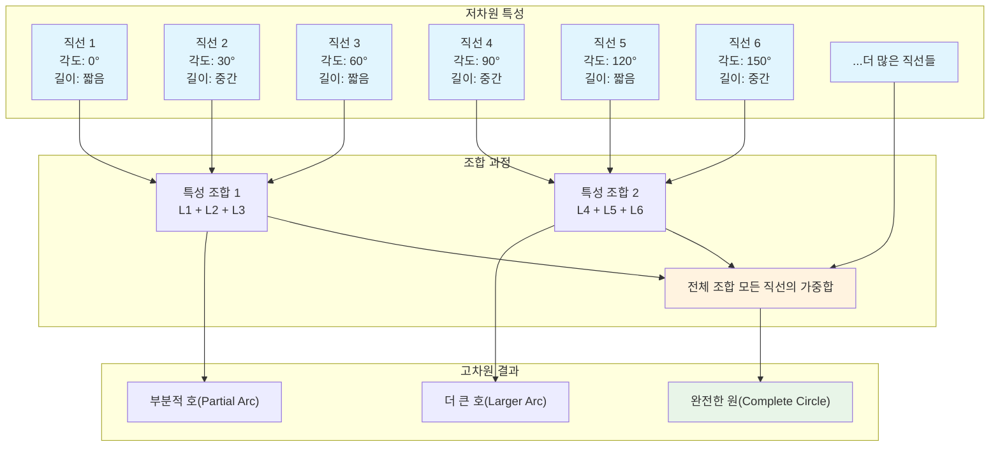
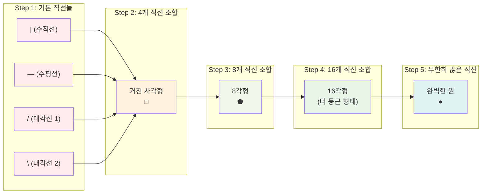

## 📦 사용하는 python package

- torch==2.1.0
- numpy==1.24.3
- matplotlib==3.7.1
- scipy==1.11.1
- scikit-learn==1.3.0

## 🚀 TL;DR

- **생성 모델**은 주어진 데이터의 확률 분포를 학습하여 새로운 데이터를 생성하는 머신러닝 모델
- **판별 모델**은 결정 경계를 학습하고, **생성 모델**은 데이터 분포 자체를 학습한다는 근본적 차이
- **VAE(2014)**, **GAN(2014)**, **Diffusion Model(2015)** 등이 딥러닝 기반 생성 모델의 핵심 기법
- **최대 가능도 추정(MLE)** 과 **KL Divergence** 가 생성 모델 학습의 이론적 기반
- 이미지 생성, 화질 개선, AI 프로필, 텍스트-이미지 변환 등 다양한 실생활 응용 사례 존재
- 현재는 **Stable Diffusion**, **Midjourney** 등으로 개인도 쉽게 고품질 이미지 생성 가능

## 📓 실습 Jupyter Notebook

- [생성 모델 기초 이론과 구현](https://github.com/yuiyeong/notebooks/blob/main/deep_learning/generative_models.ipynb)

## 🔍 생성 모델(Generative Model)이란?

### 언어적 표현 (Linguistic Expression)

생성 모델은 주어진 학습 데이터셋의 **확률 분포를 학습**하는 모델이다. 즉, 주어진 데이터가 어떤 분포를 갖고 있는지 학습하므로, 해당 모델로부터 새로운 데이터를 생성해낼 수 있게 된다.

생성 모델의 핵심 아이디어는 **복잡한 데이터가 저차원의 필수적인 정보의 조합으로 생성될 수 있다**는 것이다. 예를 들어, 사람 얼굴 사진은 "성인", "남성", "안경", "앞머리 없는 헤어스타일" 등의 필수적인 정보로 기술할 수 있다.

**"복잡한 데이터가 여러 간단한 특성들의 조합으로 표현될 수 있다" 의 예시)**





### 수학적/이론적 표현 (Mathematical Expression)

생성 모델은 데이터 $$X$$ 와 특성 $$Y$$의 **결합 분포** $$P(X,Y)$$ 또는 조건부 분포 $$P(X|Y)$$ 를 학습한다.

레이블 $$Y$$ 가 없는 경우에는 데이터의 **주변 분포(Marginal Distribution)** $$P(X)$$ 를 직접 학습한다.

$$P(X) = \int P(X|Y)P(Y)dY$$
## 🎯 확률 분포의 종류와 의미

### 결합 분포 (Joint Distribution) **P(X,Y)**

**결합 분포**는 두 개 이상의 확률 변수가 **동시에 특정 값을 가질 확률**을 나타낸다.

```
P(X,Y) = "데이터 X와 레이블 Y가 동시에 발생할 확률"
```

**예시**

- X: 이미지 데이터 (28×28 픽셀)
- Y: 숫자 레이블 (0~9)
- P(X,Y): "특정 이미지와 특정 숫자가 함께 나타날 확률"

###  조건부 분포 (Conditional Distribution) **P(X|Y)**

**조건부 분포**는 특정 조건(Y)이 주어졌을 때 X가 가질 수 있는 확률 분포이다.

```
P(X|Y) = "레이블 Y가 주어졌을 때, 데이터 X의 확률 분포"
```

**생성 모델에서의 의미**

- **"숫자 7이라는 조건이 주어졌을 때, 어떤 이미지들이 나올 수 있는가?"**
- 조건부 생성: 원하는 클래스의 데이터를 생성

### 주변 분포 (Marginal Distribution) **P(X)**

**주변 분포**는 다른 변수들을 모두 **적분(또는 합)으로 제거**하고 남은 하나의 변수의 분포이다.

```
P(X) = "레이블에 상관없이 데이터 X 자체의 분포"
```

**핵심 공식**
$$P(X) = \int P(X|Y)P(Y)dY$$

이는 **전확률 법칙(Law of Total Probability)** 이다.

## 🎨 고전적 생성 모델들

### 가우시안 혼합 모델 (Gaussian Mixture Model, GMM)

- 여러 가우시안 분포를 조합하여 실제 데이터 분포에 근사
- 각 가우시안의 평균, 분산, 가중치를 학습
- 1981년에 발표

### 제한된 볼츠만 머신 (Restricted Boltzmann Machine, RBM)

- 신경망 기반의 생성 모델
- 볼츠만 분포에 따라 에너지가 낮을수록 확률 밀도가 높아지는 원리 활용
- 1985년에 발표

### 자기회귀 분포 추정 (Auto-Regressive Distribution Estimator)

- 현재 픽셀 값을 이전 픽셀 값들에 의존하여 추정
- 마르코프 체인 가정을 기반으로 순차적 생성
- 2011년에 발표

> 생성 모델은 단순히 새로운 데이터를 만드는 것뿐만 아니라, 데이터의 내재된 구조와 패턴을 이해하여 다양한 작업을 수행할 수 있게 해준다.
{: .prompt-tip}

### 마르코프 체인 (Markov Chain) 이론

**"현재 상태가 미래를 결정하는 데 충분하다"**는 **마르코프 성질(Markov Property)**을 만족하는 확률 과정이다.

**마르코프 성질**

$$P(X_{t+1}|X_t, X_{t-1}, ..., X_1) = P(X_{t+1}|X_t)$$

"미래는 과거와 독립적이고, 오직 현재 상태에만 의존한다."

**마르코프 체인의 핵심 성질**

- 시간 동질성 (Time Homogeneity): 전이 확률이 시간에 따라 변하지 않음
- 정상 분포 (Stationary Distribution): 충분히 오랜 시간 후 도달하는 평형 상태

> 마르코프 체인은 생성 모델에서 **순차적 생성 과정**을 모델링하는 핵심 도구다. "현재 상태만 알면 다음을 예측할 수 있다"는 성질 덕분에 계산상 효율적이면서도 복잡한 시퀀스를 생성할 수 있다.
{: .prompt-tip}

## ⚔️ 판별 모델 vs 생성 모델

### 판별 모델 (Discriminative Model)

판별 모델은 데이터 $X$가 주어졌을 때 특성 $Y$가 나타날 **조건부 확률** $P(Y|X)$를 직접 반환하는 모델이다.

**특징**

- **결정 경계(Decision Boundary)** 를 학습
- 두 클래스 간의 가장 도드라지는 특성만 학습하면 충분
- 학습이 상대적으로 쉽고 빠름
- 객관적인 평가 지표(정확도, F1-score 등) 존재

### 생성 모델 (Generative Model)

생성 모델은 데이터의 **분포 자체**를 학습한다.

**특징**

- 각 클래스가 **어떻게 생겼는지** 모든 특성을 학습
- 복잡하게 얽힌 분포를 학습해야 해서 더 어려움
- 평가 지표가 주관적이고 모호함
- 새로운 데이터 생성 가능

### 비교 예시: 숫자 0과 1 구분

```python
import torch
import torch.nn as nn
import matplotlib.pyplot as plt

# 판별 모델 예시 - 간단한 분류기
class DiscriminativeModel(nn.Module):
    def __init__(self):
        super().__init__()
        self.classifier = nn.Sequential(
            nn.Linear(784, 128),
            nn.ReLU(),
            nn.Linear(128, 1),
            nn.Sigmoid()
        )
    
    def forward(self, x):
        return self.classifier(x.view(-1, 784))

# 생성 모델 예시 - 간단한 생성기
class GenerativeModel(nn.Module):
    def __init__(self):
        super().__init__()
        self.generator = nn.Sequential(
            nn.Linear(10, 128),
            nn.ReLU(),
            nn.Linear(128, 784),
            nn.Sigmoid()
        )
    
    def forward(self, z):
        return self.generator(z).view(-1, 1, 28, 28)

# 판별 모델: "1은 세로선이 많다, 0은 동그랗다"만 학습
discriminative = DiscriminativeModel()

# 생성 모델: "0이 얼마나 동그랗고, 어떻게 분포되는지" 전체를 학습
generative = GenerativeModel()

print("판별 모델 파라미터 수:", sum(p.numel() for p in discriminative.parameters()))
print("생성 모델 파라미터 수:", sum(p.numel() for p in generative.parameters()))
# 판별 모델 파라미터 수: 100609
# 생성 모델 파라미터 수: 101770
```

[시각적 표현 넣기: 판별 모델의 결정 경계 vs 생성 모델의 분포 학습 비교 다이어그램]

> **핵심 차이점**: 판별 모델은 "구분하는 법"을 배우고, 생성 모델은 "만드는 법"을 배운다. 생성 모델이 더 어렵지만, 학습에 성공하면 판별도 가능하고 새로운 데이터도 만들 수 있다. {: .prompt-tip}

## 🚀 딥러닝 시대의 생성 모델 혁명

### 2013년 이전: 고전적 접근법의 한계

2012년 ImageNet 분류기의 성공은 컴퓨터 비전 분야에 딥러닝 열풍을 일으켰고, 이는 자연스럽게 생성 모델로도 확산되었다.

### 2014년: 혁신의 원년

**2014년**은 생성 모델 역사에서 가장 중요한 해다. 이 해에 두 개의 획기적인 모델이 발표되었다:

- **Variational Auto Encoder (VAE)**: 안정적 학습과 빠른 샘플링 속도
- **Generative Adversarial Networks (GAN)**: 두 네트워크의 경쟁적 학습

### 2015-2016년: 다양성의 확장

- **PixelRNN/PixelCNN**: 자기회귀 모델의 발전형
- **Normalizing Flow**: 역산 가능한 점진적 확률 분포 변화
- **Diffusion Model**: 현재 패러다임을 주도하는 모델의 원형

```python
# 생성 모델 발전 과정 시각화
import matplotlib.pyplot as plt
import numpy as np

years = [2013, 2014, 2015, 2016, 2017, 2018, 2019, 2020, 2021, 2022, 2023]
quality_scores = [2, 4, 5, 6, 7, 8, 8.5, 9, 9.5, 9.8, 9.9]  # 가상의 품질 점수

plt.figure(figsize=(12, 6))
plt.plot(years, quality_scores, 'bo-', linewidth=2, markersize=8)
plt.axvline(x=2014, color='red', linestyle='--', alpha=0.7, label='VAE & GAN 등장')
plt.axvline(x=2020, color='green', linestyle='--', alpha=0.7, label='Diffusion 재등장')
plt.xlabel('년도')
plt.ylabel('생성 품질 (상대적)')
plt.title('생성 모델의 발전 과정')
plt.legend()
plt.grid(True, alpha=0.3)
plt.show()
```

[시각적 표현 넣기: VAE, GAN, Diffusion 모델의 생성 결과 비교 이미지]

## 🎯 VAE (Variational Auto Encoder)

### 핵심 개념

VAE는 **인코더-디코더 구조**와 **변분 추론(Variational Inference)**을 결합한 모델이다.

**주요 특징:**

- 안정적인 학습과 빠른 샘플링 속도
- 점진적 변화 제어 가능
- 초기에는 흐린 영상 생성 문제 존재

### 수학적 표현

VAE의 목적 함수는 **Evidence Lower BOund (ELBO)**를 최대화한다:

$$\mathcal{L} = \mathbb{E}_{q_\phi(z|x)}[\log p_\theta(x|z)] - D_{KL}(q_\phi(z|x) | p(z))$$

여기서:

- $q_\phi(z|x)$: 인코더 (recognition model)
- $p_\theta(x|z)$: 디코더 (generative model)
- $D_{KL}$: KL divergence

```python
import torch
import torch.nn as nn
import torch.nn.functional as F

class VAE(nn.Module):
    def __init__(self, input_dim=784, hidden_dim=256, latent_dim=20):
        super(VAE, self).__init__()
        
        # 인코더
        self.encoder = nn.Sequential(
            nn.Linear(input_dim, hidden_dim),
            nn.ReLU(),
            nn.Linear(hidden_dim, hidden_dim),
            nn.ReLU()
        )
        
        # 잠재 분포 파라미터
        self.fc_mu = nn.Linear(hidden_dim, latent_dim)
        self.fc_logvar = nn.Linear(hidden_dim, latent_dim)
        
        # 디코더
        self.decoder = nn.Sequential(
            nn.Linear(latent_dim, hidden_dim),
            nn.ReLU(),
            nn.Linear(hidden_dim, hidden_dim),
            nn.ReLU(),
            nn.Linear(hidden_dim, input_dim),
            nn.Sigmoid()
        )
    
    def encode(self, x):
        h = self.encoder(x)
        mu = self.fc_mu(h)
        logvar = self.fc_logvar(h)
        return mu, logvar
    
    def reparameterize(self, mu, logvar):
        std = torch.exp(0.5 * logvar)
        eps = torch.randn_like(std)
        return mu + eps * std
    
    def decode(self, z):
        return self.decoder(z)
    
    def forward(self, x):
        mu, logvar = self.encode(x.view(-1, 784))
        z = self.reparameterize(mu, logvar)
        recon_x = self.decode(z)
        return recon_x, mu, logvar

# VAE 손실 함수
def vae_loss(recon_x, x, mu, logvar):
    # 재구성 손실 (Reconstruction Loss)
    recon_loss = F.binary_cross_entropy(recon_x, x.view(-1, 784), reduction='sum')
    
    # KL divergence 손실
    kl_loss = -0.5 * torch.sum(1 + logvar - mu.pow(2) - logvar.exp())
    
    return recon_loss + kl_loss

# 모델 초기화
vae = VAE()
print(f"VAE 전체 파라미터 수: {sum(p.numel() for p in vae.parameters()):,}")
# VAE 전체 파라미터 수: 1,149,033
```

## ⚔️ GAN (Generative Adversarial Networks)

### 핵심 개념

GAN은 **생성자(Generator)**와 **판별자(Discriminator)** 두 네트워크가 **적대적으로 경쟁**하며 학습하는 모델이다.

**주요 특징:**

- 명시적 확률 분포 정의 불필요
- 선명한 영상 생성 가능
- 잠재 공간에서 산술 연산 가능
- 학습 불안정성 문제 존재

### 수학적 표현

GAN의 목적 함수는 **minimax 게임**으로 표현된다:

$$\min_G \max_D V(D,G) = \mathbb{E}_{x \sim p_{data}(x)}[\log D(x)] + \mathbb{E}_{z \sim p_z(z)}[\log(1-D(G(z)))]$$

```python
import torch
import torch.nn as nn

class Generator(nn.Module):
    def __init__(self, latent_dim=100, img_shape=(1, 28, 28)):
        super(Generator, self).__init__()
        self.img_shape = img_shape
        
        def block(in_feat, out_feat, normalize=True):
            layers = [nn.Linear(in_feat, out_feat)]
            if normalize:
                layers.append(nn.BatchNorm1d(out_feat, 0.8))
            layers.append(nn.LeakyReLU(0.2, inplace=True))
            return layers
        
        self.model = nn.Sequential(
            *block(latent_dim, 128, normalize=False),
            *block(128, 256),
            *block(256, 512),
            *block(512, 1024),
            nn.Linear(1024, int(np.prod(img_shape))),
            nn.Tanh()
        )
    
    def forward(self, z):
        img = self.model(z)
        img = img.view(img.size(0), *self.img_shape)
        return img

class Discriminator(nn.Module):
    def __init__(self, img_shape=(1, 28, 28)):
        super(Discriminator, self).__init__()
        
        self.model = nn.Sequential(
            nn.Linear(int(np.prod(img_shape)), 512),
            nn.LeakyReLU(0.2, inplace=True),
            nn.Linear(512, 256),
            nn.LeakyReLU(0.2, inplace=True),
            nn.Linear(256, 1),
            nn.Sigmoid()
        )
    
    def forward(self, img):
        img_flat = img.view(img.size(0), -1)
        validity = self.model(img_flat)
        return validity

# GAN 손실 함수
adversarial_loss = nn.BCELoss()

# 모델 초기화
generator = Generator()
discriminator = Discriminator()

print(f"Generator 파라미터 수: {sum(p.numel() for p in generator.parameters()):,}")
print(f"Discriminator 파라미터 수: {sum(p.numel() for p in discriminator.parameters()):,}")
# Generator 파라미터 수: 1,493,324
# Discriminator 파라미터 수: 533,505
```

### GAN의 잠재 공간 산술 연산

GAN의 흥미로운 특성 중 하나는 잠재 공간에서 **벡터 산술 연산**이 가능하다는 것이다:

**안경 쓴 남자 - 남자 + 여자 = 안경 쓴 여자**

[시각적 표현 넣기: GAN 잠재 공간 산술 연산 예시]

## 🌊 Diffusion Model

### 핵심 개념

Diffusion Model은 **비평형 통계역학** 이론을 기반으로 한 생성 모델로, 2015년에 제안되었지만 2020년경부터 주목받기 시작했다.

**동작 원리:**

1. **Forward Process**: 데이터에 점진적으로 노이즈 추가
2. **Reverse Process**: 노이즈로부터 점진적으로 데이터 복원

### 수학적 표현

**Forward Process (노이즈 추가):** $$q(x_t|x_{t-1}) = \mathcal{N}(x_t; \sqrt{1-\beta_t}x_{t-1}, \beta_t I)$$

**Reverse Process (노이즈 제거):** $$p_\theta(x_{t-1}|x_t) = \mathcal{N}(x_{t-1}; \mu_\theta(x_t, t), \Sigma_\theta(x_t, t))$$

```python
import torch
import torch.nn as nn
import math

class DiffusionModel(nn.Module):
    def __init__(self, img_size=28, in_channels=1, time_dim=256):
        super().__init__()
        self.time_dim = time_dim
        
        # 시간 임베딩
        self.time_embed = nn.Sequential(
            nn.Linear(time_dim, time_dim),
            nn.ReLU(),
            nn.Linear(time_dim, time_dim)
        )
        
        # U-Net 구조 (간소화)
        self.down1 = nn.Sequential(
            nn.Conv2d(in_channels, 64, 3, padding=1),
            nn.ReLU(),
            nn.Conv2d(64, 64, 3, padding=1),
            nn.ReLU()
        )
        
        self.down2 = nn.Sequential(
            nn.MaxPool2d(2),
            nn.Conv2d(64, 128, 3, padding=1),
            nn.ReLU(),
            nn.Conv2d(128, 128, 3, padding=1),
            nn.ReLU()
        )
        
        self.up1 = nn.Sequential(
            nn.Upsample(scale_factor=2),
            nn.Conv2d(128, 64, 3, padding=1),
            nn.ReLU(),
            nn.Conv2d(64, 64, 3, padding=1),
            nn.ReLU()
        )
        
        self.final = nn.Conv2d(64, in_channels, 1)
    
    def time_encoding(self, t, dim):
        """Sinusoidal time encoding"""
        half_dim = dim // 2
        emb = math.log(10000) / (half_dim - 1)
        emb = torch.exp(torch.arange(half_dim) * -emb)
        emb = t[:, None] * emb[None, :]
        emb = torch.cat([emb.sin(), emb.cos()], dim=1)
        return emb
    
    def forward(self, x, t):
        # 시간 인코딩
        t_emb = self.time_encoding(t, self.time_dim)
        t_emb = self.time_embed(t_emb)
        
        # U-Net forward pass (시간 정보 통합 생략)
        h1 = self.down1(x)
        h2 = self.down2(h1)
        h3 = self.up1(h2)
        
        return self.final(h3)

# 노이즈 스케줄링
def linear_beta_schedule(timesteps, start=0.0001, end=0.02):
    return torch.linspace(start, end, timesteps)

# Diffusion 학습 과정
def diffusion_loss(model, x_0, t, noise=None):
    if noise is None:
        noise = torch.randn_like(x_0)
    
    # Forward process로 노이즈 추가
    betas = linear_beta_schedule(1000)
    alphas = 1. - betas
    alphas_cumprod = torch.cumprod(alphas, dim=0)
    
    sqrt_alphas_cumprod = torch.sqrt(alphas_cumprod)
    sqrt_one_minus_alphas_cumprod = torch.sqrt(1. - alphas_cumprod)
    
    # 노이즈가 추가된 이미지
    x_t = sqrt_alphas_cumprod[t] * x_0 + sqrt_one_minus_alphas_cumprod[t] * noise
    
    # 모델이 예측한 노이즈
    predicted_noise = model(x_t, t)
    
    # 실제 노이즈와의 차이
    loss = nn.MSELoss()(predicted_noise, noise)
    return loss

diffusion_model = DiffusionModel()
print(f"Diffusion Model 파라미터 수: {sum(p.numel() for p in diffusion_model.parameters()):,}")
# Diffusion Model 파라미터 수: 327,169
```

> **Diffusion Model의 혁신**: 2020년 이후 기존 GAN을 뛰어넘는 품질의 이미지를 생성하며, Stable Diffusion, DALL-E 2 등의 기술적 토대가 되었다. {: .prompt-tip}

## 💼 생성 모델의 실생활 활용 사례

### 이미지 품질 개선

**화질 개선 (Super Resolution)**

- 저화질 영상을 고화질로 변환
- TV의 AI 업스케일링 기능
- 오래된 사진 복구 및 컬러라이제이션

```python
# 화질 개선 모델 예시 (ESRGAN 스타일)
import torch.nn.functional as F

class SuperResolutionGAN(nn.Module):
    def __init__(self, scale_factor=4):
        super().__init__()
        self.scale_factor = scale_factor
        
        # Feature extraction
        self.conv1 = nn.Conv2d(3, 64, 9, padding=4)
        
        # Residual blocks
        self.res_blocks = nn.Sequential(*[
            self._make_residual_block(64) for _ in range(16)
        ])
        
        # Upsampling
        self.upconv1 = nn.Conv2d(64, 256, 3, padding=1)
        self.upconv2 = nn.Conv2d(64, 256, 3, padding=1)
        self.conv_out = nn.Conv2d(64, 3, 9, padding=4)
    
    def _make_residual_block(self, channels):
        return nn.Sequential(
            nn.Conv2d(channels, channels, 3, padding=1),
            nn.BatchNorm2d(channels),
            nn.PReLU(),
            nn.Conv2d(channels, channels, 3, padding=1),
            nn.BatchNorm2d(channels)
        )
    
    def forward(self, x):
        feat = F.relu(self.conv1(x))
        res = self.res_blocks(feat)
        
        # Pixel shuffle for upsampling
        up1 = F.pixel_shuffle(F.relu(self.upconv1(res)), 2)
        up2 = F.pixel_shuffle(F.relu(self.upconv2(up1)), 2)
        
        return torch.tanh(self.conv_out(up2))
```

### 개인화 서비스

**AI 프로필 생성**

- 몇 장의 사진으로 다양한 스타일의 프로필 생성
- 5일 만에 100억 수익을 올린 비즈니스 사례

**가상 시착 (Virtual Try-On)**

- 옷을 실제로 입지 않고도 착용 모습 확인
- 물리적 변형과 그림자 효과까지 고려

### 콘텐츠 생성 도구

**텍스트-이미지 생성**

- **Midjourney**: "Space opera theater" 텍스트로 미술 대회 1등 수상작 생성
- **DALL-E 2**: 창의적이고 예술적인 이미지 생성
- **Stable Diffusion**: 오픈소스로 개인도 쉽게 접근 가능

**동영상 생성 및 변환**

- **RunwayML Gen-2**: 텍스트로 동영상 생성
- **동작 전이**: 정적 사진을 춤추는 동영상으로 변환
- **SadTalker**: 한 장의 사진과 음성으로 말하는 영상 생성

```python
# 텍스트-이미지 생성 파이프라인 예시 (Diffusers 라이브러리 사용)
from diffusers import StableDiffusionPipeline
import torch

# Stable Diffusion 파이프라인 로드
pipe = StableDiffusionPipeline.from_pretrained(
    "runwayml/stable-diffusion-v1-5",
    torch_dtype=torch.float16
)

# GPU 사용 (가능한 경우)
if torch.cuda.is_available():
    pipe = pipe.to("cuda")

# 텍스트 프롬프트로 이미지 생성
prompt = "A cute cat wearing a wizard hat, digital art, highly detailed"
image = pipe(prompt).images[0]

# 이미지 저장
image.save("generated_cat_wizard.png")
print("이미지가 성공적으로 생성되었습니다!")
```

### 음성 및 멀티미디어

**AI 더빙 (ElevenLabs)**

- 비디오의 음성을 다른 언어로 번역하고 입모양까지 동기화
- 실시간 제스처까지 생성하는 가상 아바타

**AI 음악 생성**

- 기존 가수의 목소리와 스타일을 학습하여 새로운 곡 생성
- 목소리 변환 기술로 톤, 피치, 습관까지 재현

[시각적 표현 넣기: 다양한 생성 모델 활용 사례 인포그래픽]

> **비즈니스 임팩트**: 생성 모델은 단순한 기술 데모를 넘어 실제 수익을 창출하는 비즈니스 모델로 성장했다. AI 프로필 서비스가 5일 만에 100억을 벌어들인 사례는 이 기술의 상업적 가치를 보여준다. {: .prompt-warning}

## 📊 최대 가능도 추정 (Maximum Likelihood Estimation)

### 언어적 표현

최대 가능도 추정(MLE)은 관측된 데이터를 가장 잘 설명하는 모델 파라미터를 찾는 방법이다. **"이 데이터가 관측될 가능성(Likelihood)을 최대화하는 파라미터를 찾자"**는 직관적인 아이디어에 기반한다.

### 수학적 표현

주어진 데이터 $\mathcal{D} = {x^{(1)}, x^{(2)}, ..., x^{(n)}}$에 대해 가능도(Likelihood)는:

$$L(\theta) = \prod_{i=1}^{n} p(x^{(i)}|\theta)$$

계산의 편의를 위해 **로그 가능도(Log-Likelihood)**를 사용:

$$\log L(\theta) = \sum_{i=1}^{n} \log p(x^{(i)}|\theta)$$

최대 가능도 추정은 이를 최대화하는 $\theta$를 찾는 것:

$$\hat{\theta}_{MLE} = \arg\max_\theta \log L(\theta)$$

### 동전 던지기 예시

동전을 10번 던져서 앞면 7번, 뒷면 3번이 나왔을 때 앞면이 나올 확률 $\theta$를 추정해보자.

```python
import numpy as np
import matplotlib.pyplot as plt
from scipy.optimize import minimize_scalar

# 동전 던지기 데이터 (1: 앞면, 0: 뒷면)
coin_flips = [1, 1, 0, 1, 1, 1, 0, 1, 0, 1]  # 앞면 7개, 뒷면 3개
heads = sum(coin_flips)
tails = len(coin_flips) - heads

print(f"앞면: {heads}개, 뒷면: {tails}개")

# 로그 가능도 함수 정의
def log_likelihood(theta, heads, tails):
    if theta <= 0 or theta >= 1:
        return -np.inf
    return heads * np.log(theta) + tails * np.log(1 - theta)

# 다양한 theta 값에 대한 로그 가능도 계산
theta_values = np.linspace(0.01, 0.99, 100)
log_likelihoods = [log_likelihood(theta, heads, tails) for theta in theta_values]

# 시각화
plt.figure(figsize=(10, 6))
plt.plot(theta_values, log_likelihoods, 'b-', linewidth=2)
plt.axvline(x=0.7, color='red', linestyle='--', label='θ = 0.7 (직관적 답)')
plt.xlabel('θ (앞면이 나올 확률)')
plt.ylabel('로그 가능도')
plt.title('동전 던지기 로그 가능도 함수')
plt.legend()
plt.grid(True, alpha=0.3)
plt.show()

# 해석적 해 (MLE)
mle_theta = heads / len(coin_flips)
print(f"MLE 추정값: θ = {mle_theta}")

# 앞면: 7개, 뒷면: 3개
# MLE 추정값: θ = 0.7
```

> **직관과 수학의 일치**: 동전을 10번 던져 앞면이 7번 나왔다면, 직관적으로 앞면 확률을 70%로 추정할 것이다. MLE는 이러한 직관을 수학적으로 정당화해준다. {: .prompt-tip}

## 📏 KL Divergence와 분포 간 거리

### KL Divergence 정의

**쿨백-라이블러 발산(Kullback-Leibler Divergence)**는 두 확률 분포 간의 차이를 측정하는 지표다:

$$D_{KL}(P | Q) = \sum_{x} P(x) \log \frac{P(x)}{Q(x)}$$

**특성:**

- 항상 0 이상의 값
- $P = Q$일 때만 0
- 대칭성을 만족하지 않음 ($D_{KL}(P | Q) \neq D_{KL}(Q | P)$)

### KL Divergence와 MLE의 관계

생성 모델 학습에서 KL Divergence를 최소화하는 것과 MLE는 동치다:

$$\min_\theta D_{KL}(P_{data} | P_\theta) = \min_\theta \left[ -\mathbb{E}_{x \sim P_{data}}[\log P_\theta(x)] + \text{const} \right]$$

$$= \max_\theta \mathbb{E}_{x \sim P_{data}}[\log P_\theta(x)] = \max_\theta \log L(\theta)$$

```python
import numpy as np
import matplotlib.pyplot as plt
from scipy.special import rel_entr

# 두 분포 정의
x = np.arange(0, 10)
p = np.array([0.1, 0.15, 0.2, 0.25, 0.15, 0.1, 0.03, 0.01, 0.005, 0.005])  # 실제 분포
q1 = np.array([0.1, 0.1, 0.1, 0.1, 0.1, 0.1, 0.1, 0.1, 0.1, 0.1])  # 균등 분포
q2 = np.array([0.08, 0.12, 0.18, 0.22, 0.18, 0.12, 0.05, 0.03, 0.01, 0.01])  # 개선된 분포

# KL Divergence 계산
kl_div1 = np.sum(rel_entr(p, q1))
kl_div2 = np.sum(rel_entr(p, q2))

print(f"KL(P || Q1): {kl_div1:.4f}")
print(f"KL(P || Q2): {kl_div2:.4f}")

# 시각화
fig, (ax1, ax2, ax3) = plt.subplots(1, 3, figsize=(15, 4))

ax1.bar(x, p, alpha=0.7, label='실제 분포 P')
ax1.set_title('실제 분포 P')
ax1.set_ylim(0, 0.3)

ax2.bar(x, q1, alpha=0.7, color='orange', label='모델 분포 Q1 (균등)')
ax2.set_title(f'모델 Q1\nKL divergence: {kl_div1:.4f}')
ax2.set_ylim(0, 0.3)

ax3.bar(x, q2, alpha=0.7, color='green', label='모델 분포 Q2 (개선)')
ax3.set_title(f'모델 Q2\nKL divergence: {kl_div2:.4f}')
ax3.set_ylim(0, 0.3)

plt.tight_layout()
plt.show()

# KL(P || Q1): 0.3443
# KL(P || Q2): 0.0261
```

### 실제 분포를 알 수 없는 문제

실제 생성 모델 학습에서는 **데이터의 진짜 분포 $P_{data}$를 모른다**는 근본적인 문제가 있다. 우리가 원하는 건 바로 그 분포인데, KL divergence 계산을 위해서는 그 분포를 알아야 하는 모순적 상황이다.

**해결책:**

- **경험적 분포(Empirical Distribution)** 사용
- **변분 추론(Variational Inference)**
- **적대적 학습(Adversarial Training)**
- **점수 매칭(Score Matching)**

> **이론과 실제의 간극**: MLE와 KL divergence는 생성 모델의 이론적 기반을 제공하지만, 실제 구현에서는 진짜 데이터 분포를 모르기 때문에 다양한 근사 방법이 필요하다. {: .prompt-warning}

## 🔮 생성 모델의 미래와 도전과제

### 현재의 한계점

**품질 평가의 어려움**

- 객관적 평가 지표 부족
- 사람마다 다른 품질 기준
- FID, IS 등의 지표도 완전하지 않음

**계산 비용과 효율성**

- 대규모 모델의 높은 학습 비용
- 실시간 생성의 어려움
- 에너지 소비 문제

**제어 가능성과 일관성**

- 원하는 결과를 정확히 생성하기 어려움
- 긴 시퀀스에서의 일관성 유지 문제

### 미래 발전 방향

**멀티모달 통합**

- 텍스트, 이미지, 오디오, 비디오를 아우르는 통합 모델
- 3D 모델과 가상 현실 콘텐츠 생성

**개인화와 맞춤형 생성**

- 개인의 취향과 스타일을 반영한 생성
- 적은 데이터로도 빠른 적응 가능한 모델

**실시간 상호작용**

- 실시간 피드백을 통한 반복적 생성
- 사용자와의 협업적 창작 도구

```python
# 미래의 멀티모달 생성 모델 개념 (의사코드)
class MultiModalGenerativeModel(nn.Module):
    def __init__(self):
        super().__init__()
        # 텍스트, 이미지, 오디오 인코더
        self.text_encoder = TextEncoder()
        self.image_encoder = ImageEncoder()
        self.audio_encoder = AudioEncoder()
        
        # 통합 잠재 공간
        self.unified_latent_space = UnifiedLatentSpace()
        
        # 다양한 모달리티 디코더
        self.image_decoder = ImageDecoder()
        self.video_decoder = VideoDecoder()
        self.audio_decoder = AudioDecoder()
        self.3d_decoder = ThreeDDecoder()
    
    def generate(self, prompt, modality='image', style=None, user_preference=None):
        # 프롬프트를 잠재 공간으로 인코딩
        latent = self.encode_prompt(prompt)
        
        # 사용자 선호도와 스타일 반영
        if user_preference:
            latent = self.apply_user_preference(latent, user_preference)
        
        # 원하는 모달리티로 생성
        if modality == 'image':
            return self.image_decoder(latent)
        elif modality == 'video':
            return self.video_decoder(latent)
        elif modality == '3d':
            return self.3d_decoder(latent)
        # ... 다른 모달리티들
```

> **생성 모델의 미래**: 단순한 이미지 생성을 넘어 개인화된 멀티모달 창작 도구로 발전할 것이다. 누구나 쉽게 고품질 콘텐츠를 만들 수 있는 시대가 다가오고 있다. {: .prompt-tip}

## 📈 생성 모델 학습을 위한 실전 팁

### 데이터 준비

**고품질 데이터셋 구축**

- 일관된 해상도와 품질
- 다양성과 균형성 확보
- 적절한 전처리와 정규화

**데이터 증강 기법**

- 회전, 크기 변경, 색상 조정
- 노이즈 추가와 블러 처리
- 도메인별 특화 증강 기법

```python
import torchvision.transforms as transforms

# 생성 모델용 데이터 전처리
transform = transforms.Compose([
    transforms.Resize((256, 256)),
    transforms.RandomHorizontalFlip(p=0.5),
    transforms.ColorJitter(brightness=0.2, contrast=0.2, saturation=0.2),
    transforms.ToTensor(),
    transforms.Normalize(mean=[0.5, 0.5, 0.5], std=[0.5, 0.5, 0.5])  # [-1, 1] 범위로 정규화
])

# 데이터로더 설정
from torch.utils.data import DataLoader

dataloader = DataLoader(
    dataset,
    batch_size=64,
    shuffle=True,
    num_workers=4,
    pin_memory=True
)
```

### 모델 훈련 전략

**점진적 학습 (Progressive Training)**

- 낮은 해상도부터 시작해서 점진적으로 증가
- 안정적인 학습과 메모리 효율성

**학습률 스케줄링**

- Cosine annealing이나 step decay 사용
- Warmup 단계로 안정적인 초기 학습

**정규화 기법**

- Batch Normalization 대신 Layer Normalization 고려
- Spectral Normalization으로 학습 안정성 개선

```python
# 생성 모델 훈련 루프 예시
import torch.optim as optim
from torch.optim.lr_scheduler import CosineAnnealingLR

# 옵티마이저 설정
optimizer_G = optim.Adam(generator.parameters(), lr=0.0002, betas=(0.5, 0.999))
optimizer_D = optim.Adam(discriminator.parameters(), lr=0.0002, betas=(0.5, 0.999))

# 학습률 스케줄러
scheduler_G = CosineAnnealingLR(optimizer_G, T_max=100)
scheduler_D = CosineAnnealingLR(optimizer_D, T_max=100)

# 훈련 루프
for epoch in range(num_epochs):
    for batch_idx, real_imgs in enumerate(dataloader):
        # Discriminator 훈련
        optimizer_D.zero_grad()
        
        # 실제 이미지에 대한 손실
        real_validity = discriminator(real_imgs)
        real_loss = adversarial_loss(real_validity, torch.ones_like(real_validity))
        
        # 생성된 이미지에 대한 손실
        z = torch.randn(batch_size, latent_dim)
        fake_imgs = generator(z)
        fake_validity = discriminator(fake_imgs.detach())
        fake_loss = adversarial_loss(fake_validity, torch.zeros_like(fake_validity))
        
        d_loss = (real_loss + fake_loss) / 2
        d_loss.backward()
        optimizer_D.step()
        
        # Generator 훈련
        optimizer_G.zero_grad()
        
        fake_validity = discriminator(fake_imgs)
        g_loss = adversarial_loss(fake_validity, torch.ones_like(fake_validity))
        
        g_loss.backward()
        optimizer_G.step()
        
        if batch_idx % 100 == 0:
            print(f'Epoch [{epoch}/{num_epochs}], D_loss: {d_loss.item():.4f}, G_loss: {g_loss.item():.4f}')
    
    scheduler_G.step()
    scheduler_D.step()
```

생성 모델은 현재 AI 분야에서 가장 빠르게 발전하고 있는 영역 중 하나다. 이론적 기반부터 실제 응용까지 폭넓은 이해를 바탕으로, 여러분도 창의적인 AI 프로덕트를 만들어보길 기대한다.