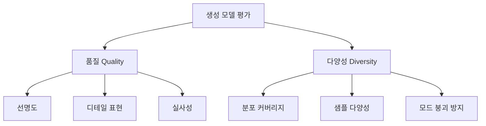
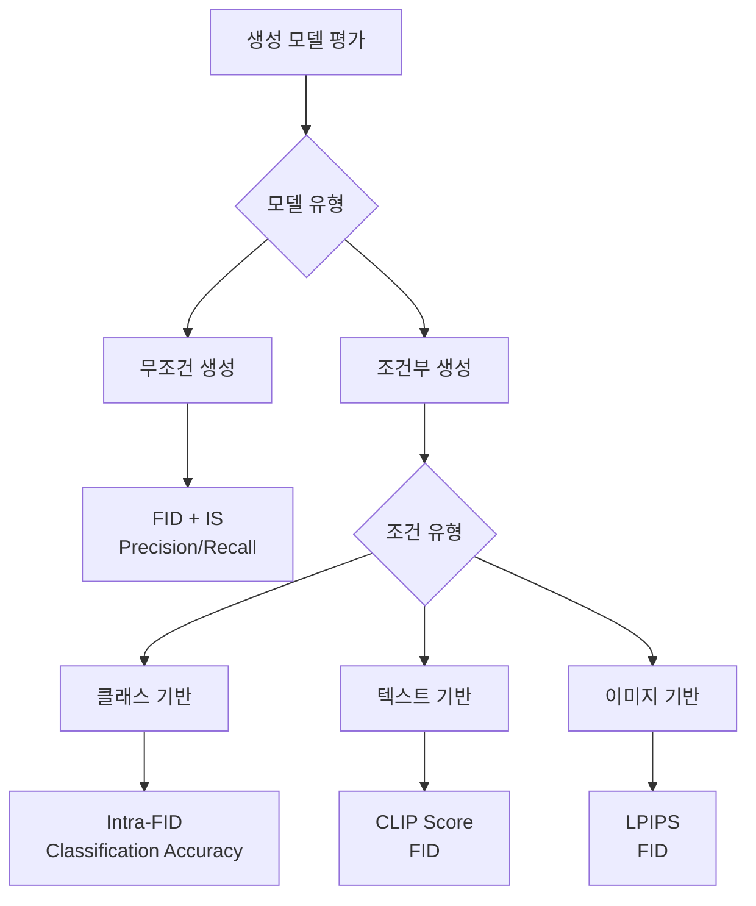

## 📦 사용하는 python package

- torch==2.0.0+
- torchvision==0.15.0+
- numpy==1.21.0+
- scipy==1.7.0+
- PIL==8.3.0+
- clip-by-openai==1.0

## 🚀 TL;DR

- **생성 모델 평가**는 정답이 없어 판별 모델보다 **훨씬 복잡하고 어려운 문제**
- **품질(Quality)**과 **다양성(Diversity)** 두 관점에서 평가해야 하며, 이 둘은 보통 **트레이드오프 관계**
- **Inception Score(IS)**는 품질과 다양성을 동시에 고려하지만 **ImageNet 클래스에만 적용 가능**하고 **adversarial attack에 취약**
- **FID(Fréchet Inception Distance)**는 실제 데이터와 생성 데이터의 **특성 분포 간 거리**를 측정하여 **가장 널리 사용**되는 지표
- **Precision/Recall**은 품질과 다양성을 **각각 분리해서 측정** 가능하지만 **outlier에 민감**하고 **계산량이 큼**
- **조건부 생성**에서는 **LPIPS**(다양성), **CLIP Score**(텍스트-이미지 일치도) 등 **추가 지표** 필요
- 실제로는 **단일 지표로 완벽한 평가 불가능**하여 **여러 지표를 종합적으로 활용**해야 함

## 📓 실습 Jupyter Notebook

- [Image Generation Evaluation Metrics](https://github.com/yuiyeong/notebooks/blob/main/deep_learning/image_generation_metrics.ipynb)

## 🎯 생성 모델 평가의 필요성과 어려움

### 판별 모델 vs 생성 모델의 평가 차이

**판별 모델(Discriminative Model)**은 명확한 정답이 존재하기 때문에 평가가 상대적으로 간단하다. 분류 문제에서는 정확도(Accuracy), 정밀도(Precision), 재현율(Recall) 등을, 회귀 문제에서는 MSE, MAE 등을 사용할 수 있다.

```python
# 판별 모델의 간단한 평가 예시
from sklearn.metrics import accuracy_score, precision_score, recall_score

# 분류 모델 평가
y_true = [0, 1, 1, 0, 1]
y_pred = [0, 1, 0, 0, 1]

accuracy = accuracy_score(y_true, y_pred)  # 0.8
precision = precision_score(y_true, y_pred)  # 1.0 
recall = recall_score(y_true, y_pred)  # 0.67

print(f"정확도: {accuracy}, 정밀도: {precision}, 재현율: {recall}")
# 정확도: 0.8, 정밀도: 1.0, 재현율: 0.6666666666666666
```

하지만 **생성 모델(Generative Model)**은 다음과 같은 근본적인 어려움이 있다:

- **정답이 존재하지 않음**: 새로운 샘플을 생성하므로 학습 데이터와 직접 비교 불가능
- **암기 vs 학습 구분 어려움**: 학습 데이터와 너무 유사하면 단순 암기일 가능성
- **주관적 평가 의존**: 사람의 평가가 필요하지만 주관성과 비용 문제 존재

> 생성 모델의 목표는 **데이터 분포 학습**이지 **데이터 암기**가 아니므로, 단순히 학습 데이터와의 유사도만으로는 평가할 수 없다. {: .prompt-tip}

### 평가의 두 축: 품질과 다양성

생성 모델을 평가할 때는 크게 **두 가지 관점**을 고려해야 한다:

- **품질(Quality/Fidelity)**: 얼마나 실제 데이터처럼 그럴듯하게 생성했는가?
- **다양성(Diversity)**: 얼마나 다양한 샘플을 생성할 수 있는가?



> 품질과 다양성은 보통 **트레이드오프 관계**에 있다. 품질을 높이려면 다양성이 감소하고, 다양성을 높이려면 품질이 떨어지는 경향이 있다. {: .prompt-warning}

## 📊 Inception Score (IS): 품질과 다양성의 첫 번째 시도

### 개념과 동작 원리

**Inception Score**는 사전 훈련된 **Inception-v3 분류기**를 활용하여 생성된 이미지의 품질과 다양성을 동시에 평가하는 지표다.

핵심 아이디어는 다음과 같다:

- **높은 품질**: 분류기가 생성된 이미지를 높은 확신으로 특정 클래스로 분류 → **낮은 조건부 엔트로피**
- **높은 다양성**: 생성된 이미지들이 다양한 클래스에 고르게 분포 → **높은 주변 엔트로피**

### 수학적 표현

**엔트로피(Entropy)**는 불확실성이나 무질서도를 나타내는 지표다:

$$ H(X) = -\sum_{i} p(x_i) \log p(x_i) $$

Inception Score는 다음과 같이 계산된다:

$$ \text{IS} = \exp\left(\mathbb{E}_{x}\left[D_{KL}(p(y|x) \parallel p(y))\right]\right) $$

여기서:

- $$ p(y|x) $$: 이미지 x가 주어졌을 때 클래스 y의 조건부 확률 (품질 측정)
- $$ p(y) $$: 모든 생성 이미지에 대한 클래스의 주변 확률 (다양성 측정)
- $$ D_{KL} $$: KL Divergence

### 구현 예시

```python
import torch
import torch.nn.functional as F
from torchvision import models, transforms
import numpy as np

def calculate_inception_score(images, batch_size=32, splits=10):
    """
    Inception Score 계산
    
    Args:
        images: 생성된 이미지들 (torch.Tensor)
        batch_size: 배치 크기
        splits: 평균을 내기 위한 분할 수
    """
    # 사전 훈련된 Inception-v3 모델 로드
    inception_model = models.inception_v3(pretrained=True, transform_input=False)
    inception_model.eval()
    
    # 이미지 전처리
    preprocess = transforms.Compose([
        transforms.Resize(299),
        transforms.CenterCrop(299),
        transforms.Normalize(mean=[0.485, 0.456, 0.406], 
                           std=[0.229, 0.224, 0.225])
    ])
    
    def get_predictions(images):
        """분류기 예측 확률 계산"""
        predictions = []
        
        for i in range(0, len(images), batch_size):
            batch = images[i:i+batch_size]
            batch = torch.stack([preprocess(img) for img in batch])
            
            with torch.no_grad():
                outputs = inception_model(batch)
                predictions.append(F.softmax(outputs, dim=1))
        
        return torch.cat(predictions, dim=0)
    
    # 예측 확률 계산
    preds = get_predictions(images)
    
    # Inception Score 계산
    scores = []
    
    for i in range(splits):
        part = preds[i * len(preds) // splits:(i + 1) * len(preds) // splits]
        
        # 조건부 엔트로피 (품질)
        kl_div = part * (torch.log(part) - torch.log(torch.mean(part, dim=0, keepdim=True)))
        kl_div = torch.mean(torch.sum(kl_div, dim=1))
        
        scores.append(torch.exp(kl_div))
    
    return torch.mean(torch.stack(scores)), torch.std(torch.stack(scores))

# 사용 예시
# generated_images = torch.randn(1000, 3, 299, 299)  # 생성된 이미지
# is_mean, is_std = calculate_inception_score(generated_images)
# print(f"Inception Score: {is_mean:.2f} ± {is_std:.2f}")
```

### 장점과 한계점

**장점:**

- 품질과 다양성을 동시에 고려
- 구현이 상대적으로 간단
- 널리 사용되어 비교 기준으로 활용

**한계점:**

- **ImageNet 클래스에만 적용 가능**: 얼굴, 풍경 등은 평가 불가
- **Adversarial attack에 취약**: 노이즈 이미지도 높은 점수 가능
- **Mode collapse 탐지 실패**: 각 클래스마다 한 장씩만 생성해도 높은 점수

> IS는 ImageNet과 같은 객체 분류 데이터셋에서만 의미가 있으며, 얼굴이나 풍경 이미지 생성에서는 사용할 수 없다는 치명적 한계가 있다. {: .prompt-warning}

## 🎨 Fréchet Inception Distance (FID): 현재 표준 지표

### 개념과 동작 원리

**FID(Fréchet Inception Distance)**는 Inception Score의 한계를 극복하기 위해 제안된 지표로, **실제 데이터와 생성 데이터의 특성 분포 간 거리**를 측정한다.

핵심 아이디어:

- 사전 훈련된 Inception-v3의 **특성 벡터(feature vector)** 활용 (확률 벡터 대신)
- 실제 데이터와 생성 데이터의 **특성 분포**를 각각 가우시안으로 가정
- 두 가우시안 분포 간의 **Fréchet distance** 계산

### 수학적 표현

실제 데이터와 생성 데이터의 특성이 각각 가우시안 분포를 따른다고 가정:

$$ \mathcal{N}(\mu_r, \Sigma_r), \quad \mathcal{N}(\mu_g, \Sigma_g) $$

FID는 다음과 같이 계산된다:

$$ \text{FID} = |\mu_r - \mu_g|^2 + \text{Tr}(\Sigma_r + \Sigma_g - 2(\Sigma_r \Sigma_g)^{1/2}) $$

여기서:

- $$ \mu_r, \mu_g $$: 실제/생성 데이터 특성의 평균
- $$ \Sigma_r, \Sigma_g $$: 실제/생성 데이터 특성의 공분산 행렬
- $$ \text{Tr} $$: 행렬의 대각합(trace)

### 구현 예시

```python
import torch
import numpy as np
from scipy.linalg import sqrtm
from torchvision import models, transforms

def calculate_fid(real_images, generated_images, batch_size=50):
    """
    FID(Fréchet Inception Distance) 계산
    
    Args:
        real_images: 실제 이미지들
        generated_images: 생성된 이미지들
        batch_size: 배치 크기
    """
    
    # Inception-v3 모델 로드 (분류층 제거)
    inception = models.inception_v3(pretrained=True, transform_input=False)
    inception.fc = torch.nn.Identity()  # 분류층 제거
    inception.eval()
    
    # 이미지 전처리
    preprocess = transforms.Compose([
        transforms.Resize(299),
        transforms.CenterCrop(299),
        transforms.Normalize(mean=[0.485, 0.456, 0.406], 
                           std=[0.229, 0.224, 0.225])
    ])
    
    def extract_features(images):
        """특성 벡터 추출"""
        features = []
        
        for i in range(0, len(images), batch_size):
            batch = images[i:i+batch_size]
            batch = torch.stack([preprocess(img) for img in batch])
            
            with torch.no_grad():
                # Inception-v3의 마지막 pooling layer 출력 (2048차원)
                feat = inception(batch)
                features.append(feat)
        
        return torch.cat(features, dim=0).numpy()
    
    # 특성 추출
    real_features = extract_features(real_images)
    generated_features = extract_features(generated_images)
    
    # 평균과 공분산 계산
    mu_real = np.mean(real_features, axis=0)
    mu_gen = np.mean(generated_features, axis=0)
    
    sigma_real = np.cov(real_features, rowvar=False)
    sigma_gen = np.cov(generated_features, rowvar=False)
    
    # FID 계산
    mu_diff = mu_real - mu_gen
    
    # 공분산 행렬의 제곱근 계산
    covmean = sqrtm(sigma_real.dot(sigma_gen))
    
    # 수치적 안정성을 위한 허수부 제거
    if np.iscomplexobj(covmean):
        covmean = covmean.real
    
    fid = mu_diff.dot(mu_diff) + np.trace(sigma_real + sigma_gen - 2 * covmean)
    
    return fid

# 사용 예시
# real_imgs = torch.randn(1000, 3, 256, 256)
# gen_imgs = torch.randn(1000, 3, 256, 256)
# fid_score = calculate_fid(real_imgs, gen_imgs)
# print(f"FID Score: {fid_score:.2f}")
```

### 장점과 한계점

**장점:**

- **ImageNet에 국한되지 않음**: 모든 종류의 이미지 평가 가능
- **Adversarial attack에 강건**: 특성 벡터 사용으로 노이즈에 덜 민감
- **실제 데이터 활용**: 생성 데이터와 실제 데이터를 모두 고려
- **사람의 인식과 유사**: 시각적 품질과 상관관계 높음

**한계점:**

- **품질과 다양성 분리 불가**: 단일 점수로만 제공
- **충분한 샘플 수 필요**: 통계적 안정성을 위해 많은 샘플 필요
- **계산 비용**: 모든 이미지에 대해 특성 추출 필요

> FID는 현재 **가장 널리 사용되는** 생성 모델 평가 지표로, 대부분의 논문에서 표준 지표로 채택하고 있다. {: .prompt-tip}

## ⚖️ Precision과 Recall: 품질과 다양성의 분리 측정

### 생성 모델에서의 Precision과 Recall

판별 모델의 Precision/Recall 개념을 생성 모델에 적용한 지표다. **품질과 다양성을 각각 분리해서 측정**할 수 있다는 큰 장점이 있다.

**개념적 정의:**

- **Precision (정밀도)**: 생성된 샘플 중 실제 데이터 분포에 속하는 비율 → **품질 측정**
- **Recall (재현율)**: 실제 데이터 분포 중 생성된 샘플로 커버되는 비율 → **다양성 측정**

[시각적 표현 넣기]

### 근방(Neighborhood) 기반 계산

Precision과 Recall 계산을 위해서는 **근방(neighborhood)** 개념을 정의해야 한다:

1. 각 샘플에 대해 가장 가까운 다른 샘플을 찾음
2. 그 거리를 반지름으로 하는 원을 그림
3. 이 원이 해당 샘플의 근방이 됨

### 구현 예시

```python
import torch
import numpy as np
from sklearn.metrics import pairwise_distances
from scipy.spatial.distance import cdist

def calculate_precision_recall(real_features, generated_features, k=3):
    """
    생성 모델의 Precision과 Recall 계산
    
    Args:
        real_features: 실제 데이터의 특성 벡터
        generated_features: 생성 데이터의 특성 벡터  
        k: k번째 가장 가까운 이웃을 근방 반지름으로 사용
    """
    
    def compute_pairwise_distances(X, Y=None):
        """두 데이터셋 간 거리 계산"""
        if Y is None:
            Y = X
        return cdist(X, Y, metric='euclidean')
    
    def get_kth_nearest_distance(X, k):
        """k번째 가장 가까운 이웃까지의 거리 계산"""
        distances = compute_pairwise_distances(X, X)
        # 자기 자신 제외하고 k번째 거리
        kth_distances = np.partition(distances, k, axis=1)[:, k]
        return kth_distances
    
    # 실제 데이터의 k번째 근방 반지름 계산
    real_kth_distances = get_kth_nearest_distance(real_features, k)
    
    # 생성 데이터의 k번째 근방 반지름 계산  
    gen_kth_distances = get_kth_nearest_distance(generated_features, k)
    
    # Precision 계산: 생성된 샘플 중 실제 데이터 근방에 속하는 비율
    real_gen_distances = compute_pairwise_distances(real_features, generated_features)
    precision_count = 0
    
    for i, gen_point in enumerate(generated_features):
        # 가장 가까운 실제 데이터 점 찾기
        min_real_idx = np.argmin(real_gen_distances[:, i])
        min_distance = real_gen_distances[min_real_idx, i]
        
        # 생성 점이 실제 데이터의 근방에 속하는지 확인
        if min_distance <= real_kth_distances[min_real_idx]:
            precision_count += 1
    
    precision = precision_count / len(generated_features)
    
    # Recall 계산: 실제 데이터 중 생성 데이터 근방에 속하는 비율
    gen_real_distances = compute_pairwise_distances(generated_features, real_features)
    recall_count = 0
    
    for i, real_point in enumerate(real_features):
        # 가장 가까운 생성 데이터 점 찾기
        min_gen_idx = np.argmin(gen_real_distances[:, i])
        min_distance = gen_real_distances[min_gen_idx, i]
        
        # 실제 점이 생성 데이터의 근방에 속하는지 확인
        if min_distance <= gen_kth_distances[min_gen_idx]:
            recall_count += 1
    
    recall = recall_count / len(real_features)
    
    return precision, recall

# 시각화를 위한 2D 예시
def visualize_precision_recall():
    """Precision/Recall 개념 시각화"""
    import matplotlib.pyplot as plt
    
    # 샘플 데이터 생성
    np.random.seed(42)
    real_data = np.random.multivariate_normal([2, 2], [[1, 0], [0, 1]], 100)
    gen_data = np.random.multivariate_normal([2.5, 2.5], [[1.5, 0], [0, 1.5]], 80)
    
    plt.figure(figsize=(12, 5))
    
    # 실제 데이터와 생성 데이터 플롯
    plt.subplot(1, 2, 1)
    plt.scatter(real_data[:, 0], real_data[:, 1], 
               alpha=0.6, c='blue', label='Real Data')
    plt.scatter(gen_data[:, 0], gen_data[:, 1], 
               alpha=0.6, c='red', label='Generated Data')
    plt.legend()
    plt.title('Real vs Generated Data')
    plt.grid(True, alpha=0.3)
    
    # Precision/Recall 계산 및 시각화
    precision, recall = calculate_precision_recall(real_data, gen_data)
    
    plt.subplot(1, 2, 2)
    plt.bar(['Precision', 'Recall'], [precision, recall], 
           color=['orange', 'green'], alpha=0.7)
    plt.ylim(0, 1)
    plt.title(f'Precision: {precision:.3f}, Recall: {recall:.3f}')
    plt.grid(True, alpha=0.3)
    
    plt.tight_layout()
    plt.show()

# visualize_precision_recall()
```

### 장점과 한계점

**장점:**

- **품질과 다양성 분리 측정**: 각각을 독립적으로 평가 가능
- **직관적 해석**: 판별 모델의 Precision/Recall과 유사한 해석
- **세밀한 분석**: 모델의 강약점 파악에 유용

**한계점:**

- **Outlier에 민감**: 소수의 이상치가 점수를 크게 좌우
- **샘플링에 의존**: 동일한 분포라도 샘플링에 따라 점수 변동
- **높은 계산 비용**: 모든 쌍에 대한 거리 계산 필요
- **하이퍼파라미터 민감성**: k값에 따라 결과가 크게 달라짐

> Precision과 Recall은 품질과 다양성의 **트레이드오프를 명확히 보여주는** 유일한 지표로, 모델 개선 방향을 결정하는 데 매우 유용하다. {: .prompt-tip}

## 🎭 조건부 생성 모델의 평가 지표

### 조건부 생성 모델이란?

**조건부 생성 모델(Conditional Generative Model)**은 특정 조건(클래스, 텍스트, 이미지 등)이 주어졌을 때 그 조건에 맞는 데이터를 생성하는 모델이다.

```python
# 조건부 생성 예시
def conditional_generation_example():
    """조건부 생성의 개념 설명"""
    
    # 일반 생성 모델: 랜덤 샘플
    # generated_image = model.generate()  # 무엇이 나올지 모름
    
    # 조건부 생성 모델: 조건 지정
    # digit_3 = model.generate(condition="digit_3")  # 숫자 3 생성
    # cat_image = model.generate(condition="cat")     # 고양이 이미지 생성
    # zebra_from_horse = model.generate(condition=horse_image, target="zebra")
    
    print("조건부 생성 모델의 장점:")
    print("1. 생성 결과 제어 가능")
    print("2. 특정 용도에 맞는 데이터 생성")
    print("3. 데이터 변환 작업 수행 가능")

conditional_generation_example()
```

### 기존 지표의 한계

FID, IS, Precision/Recall 등 기존 지표들은 **조건 준수 여부를 평가하지 못한다**는 치명적 한계가 있다.

> 예를 들어, "숫자 3을 생성하라"는 조건을 주었는데 모델이 계속 다른 숫자를 생성해도 기존 지표들은 이를 **페널티로 반영하지 못한다**. {: .prompt-warning}

### Intra-FID: 클래스별 FID

**Intra-FID**는 기존 FID를 클래스별로 나누어 계산한 후 평균을 내는 방식이다.

```python
def calculate_intra_fid(real_images_by_class, generated_images_by_class):
    """
    클래스별 FID 계산 후 평균
    
    Args:
        real_images_by_class: {class_id: [images]} 형태의 실제 이미지
        generated_images_by_class: {class_id: [images]} 형태의 생성 이미지
    """
    
    class_fids = []
    
    for class_id in real_images_by_class.keys():
        if class_id in generated_images_by_class:
            real_imgs = real_images_by_class[class_id]
            gen_imgs = generated_images_by_class[class_id]
            
            # 해당 클래스에 대해서만 FID 계산
            class_fid = calculate_fid(real_imgs, gen_imgs)
            class_fids.append(class_fid)
            
            print(f"Class {class_id} FID: {class_fid:.2f}")
    
    intra_fid = np.mean(class_fids)
    print(f"Intra-FID (평균): {intra_fid:.2f}")
    
    return intra_fid

# 사용 예시 (의사 코드)
# real_by_class = {0: [digit0_images], 1: [digit1_images], ...}
# gen_by_class = {0: [generated_digit0], 1: [generated_digit1], ...}
# intra_fid = calculate_intra_fid(real_by_class, gen_by_class)
```

### Classification Accuracy: 분류기 기반 평가

생성된 이미지를 **사전 훈련된 분류기**에 입력하여 의도한 클래스로 분류되는 비율을 측정한다.

```python
def calculate_classification_accuracy(generated_images, target_labels, classifier):
    """
    생성된 이미지의 분류 정확도 계산
    
    Args:
        generated_images: 생성된 이미지들
        target_labels: 생성 의도한 라벨들
        classifier: 사전 훈련된 분류기
    """
    
    classifier.eval()
    correct = 0
    total = len(generated_images)
    
    with torch.no_grad():
        for img, target in zip(generated_images, target_labels):
            # 분류기 예측
            output = classifier(img.unsqueeze(0))
            predicted = output.argmax(dim=1)
            
            if predicted.item() == target:
                correct += 1
    
    accuracy = correct / total
    print(f"Classification Accuracy: {accuracy:.3f}")
    
    return accuracy

# 향상된 방법: 생성 후 분류기 학습
def enhanced_classification_evaluation(generator, real_data, num_classes):
    """
    생성 후 분류기 학습 방식
    
    1. 생성기로 조건부 이미지 생성
    2. 생성된 이미지로 분류기 학습  
    3. 테스트셋으로 분류기 성능 평가
    """
    
    # 1. 각 클래스별 이미지 생성
    generated_data = []
    generated_labels = []
    
    for class_id in range(num_classes):
        class_images = generator.generate(condition=class_id, num_samples=1000)
        generated_data.extend(class_images)
        generated_labels.extend([class_id] * 1000)
    
    # 2. 생성된 데이터로 분류기 학습
    classifier = train_classifier(generated_data, generated_labels)
    
    # 3. 실제 테스트 데이터로 평가
    test_accuracy = evaluate_classifier(classifier, real_data['test'])
    
    print(f"Enhanced Classification Score: {test_accuracy:.3f}")
    
    return test_accuracy
```

**한계점:**

- **분류기 성능에 의존**: 분류기가 좋지 않으면 평가 자체가 부정확
- **경계 조작 가능**: 분류 경계만 넘으면 되므로 품질이 낮아도 높은 점수
- **다양성 무시**: 동일한 이미지만 반복 생성해도 높은 점수

## 🖼️ LPIPS: 학습된 지각적 유사도

### 개념과 활용

**LPIPS(Learned Perceptual Image Patch Similarity)**는 사전 훈련된 네트워크의 **특성 공간에서 이미지 간 유사도**를 측정하는 지표다.

주요 활용처:

- **이미지 변환 작업**에서 원본과 변환된 이미지 간의 **다양성 측정**
- **Style Transfer**, **Image-to-Image Translation** 등의 평가

### 구현 예시

```python
import torch
import torch.nn as nn
from torchvision import models

class LPIPS(nn.Module):
    """LPIPS 유사도 계산 모듈"""
    
    def __init__(self, net='vgg', version='0.1'):
        super(LPIPS, self).__init__()
        
        # 사전 훈련된 네트워크 로드 (VGG, AlexNet 등)
        if net == 'vgg':
            self.net = models.vgg16(pretrained=True).features
        elif net == 'alex':
            self.net = models.alexnet(pretrained=True).features
        
        # 네트워크 동결
        for param in self.net.parameters():
            param.requires_grad = False
            
        self.net.eval()
    
    def extract_features(self, x, layers=[4, 9, 16, 23, 30]):
        """여러 레이어에서 특성 추출"""
        features = []
        
        for i, layer in enumerate(self.net):
            x = layer(x)
            if i in layers:
                features.append(x)
        
        return features
    
    def forward(self, img1, img2):
        """두 이미지 간 LPIPS 거리 계산"""
        
        # 특성 추출
        feats1 = self.extract_features(img1)
        feats2 = self.extract_features(img2)
        
        # 각 레이어별 거리 계산
        distances = []
        
        for f1, f2 in zip(feats1, feats2):
            # L2 정규화
            f1_norm = f1 / (torch.norm(f1, dim=1, keepdim=True) + 1e-10)
            f2_norm = f2 / (torch.norm(f2, dim=1, keepdim=True) + 1e-10)
            
            # 공간적 평균
            dist = torch.mean((f1_norm - f2_norm) ** 2, dim=[2, 3])
            distances.append(dist)
        
        # 가중 평균 (학습된 가중치 사용)
        total_distance = sum(distances) / len(distances)
        
        return torch.mean(total_distance)

def evaluate_diversity_with_lpips(original_images, generated_images):
    """LPIPS를 사용한 다양성 평가"""
    
    lpips_metric = LPIPS(net='vgg')
    distances = []
    
    for orig, gen in zip(original_images, generated_images):
        # 원본과 생성 이미지 간 거리
        distance = lpips_metric(orig.unsqueeze(0), gen.unsqueeze(0))
        distances.append(distance.item())
    
    avg_distance = np.mean(distances)
    
    print(f"평균 LPIPS 거리: {avg_distance:.4f}")
    print("거리가 클수록 더 다양한 변환을 의미")
    
    return avg_distance

# 사용 예시
# horse_images = [...]  # 말 이미지들
# zebra_images = [...]  # 변환된 얼룩말 이미지들
# diversity_score = evaluate_diversity_with_lpips(horse_images, zebra_images)
```

### 활용 예시: Style Transfer 평가

```python
def evaluate_style_transfer():
    """Style Transfer 결과 평가 예시"""
    
    # 스타일 전이 전후 비교
    content_images = [...]  # 원본 컨텐츠 이미지
    styled_images = [...]   # 스타일 전이된 이미지
    
    lpips_scores = []
    
    for content, styled in zip(content_images, styled_images):
        score = lpips_metric(content, styled)
        lpips_scores.append(score.item())
    
    avg_lpips = np.mean(lpips_scores)
    
    print(f"Style Transfer LPIPS: {avg_lpips:.4f}")
    
    if avg_lpips < 0.3:
        print("변환이 약함 - 원본과 너무 유사")
    elif avg_lpips > 0.7:
        print("변환이 과함 - 원본 정보 손실 위험")
    else:
        print("적절한 수준의 스타일 변환")
    
    return avg_lpips
```

## 🎯 CLIP Score: 텍스트-이미지 일치도 평가

### CLIP 모델 이해

**CLIP(Contrastive Language-Image Pre-training)**은 텍스트와 이미지를 동일한 **임베딩 공간**에서 학습한 멀티모달 모델이다.

핵심 아이디어:

- 텍스트 설명과 해당 이미지의 임베딩을 **가깝게** 학습
- 관련 없는 텍스트-이미지 쌍의 임베딩을 **멀게** 학습

### CLIP Score 계산

**CLIP Score**는 생성된 이미지가 주어진 텍스트 조건을 얼마나 잘 반영하는지 측정한다.

```python
import clip
import torch
from PIL import Image

def calculate_clip_score(images, texts, device='cuda'):
    """
    CLIP Score 계산
    
    Args:
        images: 생성된 이미지들 (PIL Image 또는 tensor)
        texts: 해당하는 텍스트 프롬프트들
        device: 계산 장치
    """
    
    # CLIP 모델 로드
    model, preprocess = clip.load("ViT-B/32", device=device)
    
    clip_scores = []
    
    for image, text in zip(images, texts):
        # 이미지 전처리
        if isinstance(image, Image.Image):
            image_input = preprocess(image).unsqueeze(0).to(device)
        else:
            image_input = preprocess(image).to(device)
        
        # 텍스트 토큰화
        text_input = clip.tokenize([text]).to(device)
        
        with torch.no_grad():
            # 특성 추출
            image_features = model.encode_image(image_input)
            text_features = model.encode_text(text_input)
            
            # 정규화
            image_features = image_features / image_features.norm(dim=-1, keepdim=True)
            text_features = text_features / text_features.norm(dim=-1, keepdim=True)
            
            # 코사인 유사도 계산
            similarity = torch.cosine_similarity(image_features, text_features)
            clip_scores.append(similarity.item())
    
    avg_clip_score = np.mean(clip_scores)
    
    print(f"평균 CLIP Score: {avg_clip_score:.4f}")
    print("점수가 높을수록 텍스트-이미지 일치도가 높음")
    
    return avg_clip_score, clip_scores

def evaluate_text_to_image_generation():
    """텍스트-이미지 생성 모델 평가 예시"""
    
    # 텍스트 프롬프트와 생성된 이미지
    prompts = [
        "a red car driving on a highway",
        "a cat sitting on a windowsill", 
        "a beautiful sunset over the ocean",
        "a person playing guitar in a park"
    ]
    
    # 생성된 이미지들 (실제로는 모델에서 생성)
    generated_images = [...]  # 각 프롬프트에 대응하는 생성 이미지
    
    # CLIP Score 계산
    avg_score, individual_scores = calculate_clip_score(generated_images, prompts)
    
    # 개별 결과 분석
    for i, (prompt, score) in enumerate(zip(prompts, individual_scores)):
        print(f"프롬프트 {i+1}: '{prompt}'")
        print(f"CLIP Score: {score:.4f}")
        
        if score > 0.3:
            print("✅ 텍스트와 잘 일치")
        elif score > 0.2:
            print("⚠️ 부분적 일치")
        else:
            print("❌ 텍스트와 불일치")
        print()
    
    return avg_score

# evaluate_text_to_image_generation()
```

### 다양한 CLIP Score 변형

```python
def directional_clip_score(source_images, target_images, source_texts, target_texts):
    """
    방향성 CLIP Score - 이미지 편집 평가용
    
    편집 전후 이미지의 변화가 텍스트 변화와 일치하는지 측정
    """
    
    model, preprocess = clip.load("ViT-B/32")
    
    # 소스와 타겟의 특성 추출
    source_img_features = []
    target_img_features = []
    source_text_features = []
    target_text_features = []
    
    for src_img, tgt_img, src_txt, tgt_txt in zip(
        source_images, target_images, source_texts, target_texts):
        
        # 이미지 특성
        src_img_feat = model.encode_image(preprocess(src_img).unsqueeze(0))
        tgt_img_feat = model.encode_image(preprocess(tgt_img).unsqueeze(0))
        
        # 텍스트 특성  
        src_txt_feat = model.encode_text(clip.tokenize([src_txt]))
        tgt_txt_feat = model.encode_text(clip.tokenize([tgt_txt]))
        
        source_img_features.append(src_img_feat)
        target_img_features.append(tgt_img_feat)
        source_text_features.append(src_txt_feat)
        target_text_features.append(tgt_txt_feat)
    
    # 방향성 계산
    img_direction = torch.cat(target_img_features) - torch.cat(source_img_features)
    text_direction = torch.cat(target_text_features) - torch.cat(source_text_features)
    
    # 정규화
    img_direction = img_direction / img_direction.norm(dim=-1, keepdim=True)
    text_direction = text_direction / text_direction.norm(dim=-1, keepdim=True)
    
    # 방향성 일치도
    directional_similarity = torch.cosine_similarity(img_direction, text_direction)
    
    return directional_similarity.mean().item()

# 사용 예시: 이미지 편집 평가
# before_images = [...]  # 편집 전 이미지
# after_images = [...]   # 편집 후 이미지  
# before_texts = ["a person with brown hair", ...]
# after_texts = ["a person with blonde hair", ...]
# 
# directional_score = directional_clip_score(
#     before_images, after_images, before_texts, after_texts
# )
```

## 📈 평가 지표 선택 가이드라인

### 생성 모델 유형별 추천 지표



### 지표별 특성 요약

|지표|품질|다양성|조건부|계산비용|적용범위|
|---|---|---|---|---|---|
|**Inception Score**|✅|✅|❌|중간|ImageNet만|
|**FID**|✅|✅|❌|중간|모든 이미지|
|**Precision**|✅|❌|❌|높음|모든 이미지|
|**Recall**|❌|✅|❌|높음|모든 이미지|
|**Intra-FID**|✅|✅|✅|중간|클래스 조건|
|**Classification Acc**|❌|❌|✅|낮음|클래스 조건|
|**LPIPS**|❌|✅|❌|중간|이미지 쌍|
|**CLIP Score**|❌|❌|✅|중간|텍스트 조건|

### 실전 평가 파이프라인

```python
class GenerativeModelEvaluator:
    """생성 모델 종합 평가 클래스"""
    
    def __init__(self, model_type='unconditional'):
        self.model_type = model_type
        self.metrics = {}
    
    def evaluate_unconditional(self, real_images, generated_images):
        """무조건 생성 모델 평가"""
        
        print("=== 무조건 생성 모델 평가 ===")
        
        # 1. FID 계산
        fid_score = calculate_fid(real_images, generated_images)
        self.metrics['FID'] = fid_score
        print(f"FID: {fid_score:.2f}")
        
        # 2. Inception Score 계산 (ImageNet 데이터인 경우)
        try:
            is_mean, is_std = calculate_inception_score(generated_images)
            self.metrics['IS_mean'] = is_mean
            self.metrics['IS_std'] = is_std
            print(f"Inception Score: {is_mean:.2f} ± {is_std:.2f}")
        except:
            print("Inception Score: 계산 불가 (ImageNet 클래스 아님)")
        
        # 3. Precision/Recall 계산
        real_features = extract_inception_features(real_images)
        gen_features = extract_inception_features(generated_images)
        
        precision, recall = calculate_precision_recall(real_features, gen_features)
        self.metrics['Precision'] = precision
        self.metrics['Recall'] = recall
        
        print(f"Precision: {precision:.3f}")
        print(f"Recall: {recall:.3f}")
        
        # 4. 종합 평가
        self._summarize_unconditional()
    
    def evaluate_conditional(self, real_data, generated_data, conditions):
        """조건부 생성 모델 평가"""
        
        print("=== 조건부 생성 모델 평가 ===")
        
        condition_type = self._detect_condition_type(conditions)
        
        if condition_type == 'class':
            self._evaluate_class_conditional(real_data, generated_data, conditions)
        elif condition_type == 'text':
            self._evaluate_text_conditional(generated_data, conditions)
        elif condition_type == 'image':
            self._evaluate_image_conditional(real_data, generated_data)
    
    def _evaluate_class_conditional(self, real_data, generated_data, class_labels):
        """클래스 조건부 평가"""
        
        # 1. Intra-FID
        intra_fid = calculate_intra_fid(real_data, generated_data)
        self.metrics['Intra_FID'] = intra_fid
        print(f"Intra-FID: {intra_fid:.2f}")
        
        # 2. Classification Accuracy  
        classifier = load_pretrained_classifier()
        accuracy = calculate_classification_accuracy(
            generated_data, class_labels, classifier
        )
        self.metrics['Classification_Accuracy'] = accuracy
        print(f"Classification Accuracy: {accuracy:.3f}")
    
    def _evaluate_text_conditional(self, generated_images, text_prompts):
        """텍스트 조건부 평가"""
        
        # CLIP Score 계산
        avg_clip_score, _ = calculate_clip_score(generated_images, text_prompts)
        self.metrics['CLIP_Score'] = avg_clip_score
        print(f"CLIP Score: {avg_clip_score:.3f}")
    
    def _evaluate_image_conditional(self, source_images, generated_images):
        """이미지 조건부 평가 (Image-to-Image)"""
        
        # LPIPS 계산
        lpips_score = evaluate_diversity_with_lpips(source_images, generated_images)
        self.metrics['LPIPS'] = lpips_score
        print(f"LPIPS: {lpips_score:.4f}")
    
    def _summarize_unconditional(self):
        """무조건 생성 결과 해석"""
        
        fid = self.metrics['FID']
        precision = self.metrics['Precision']
        recall = self.metrics['Recall']
        
        print("\n=== 평가 결과 해석 ===")
        
        if fid < 10:
            print("✅ 매우 우수한 전체적 성능")
        elif fid < 50:
            print("✅ 양호한 전체적 성능")
        else:
            print("⚠️ 개선 필요한 성능")
        
        if precision > 0.8 and recall > 0.8:
            print("✅ 품질과 다양성 모두 우수")
        elif precision > 0.8:
            print("✅ 높은 품질, ⚠️ 다양성 부족")
        elif recall > 0.8:
            print("✅ 높은 다양성, ⚠️ 품질 부족")
        else:
            print("⚠️ 품질과 다양성 모두 개선 필요")

# 사용 예시
def comprehensive_evaluation_example():
    """종합 평가 예시"""
    
    evaluator = GenerativeModelEvaluator()
    
    # 데이터 로드 (의사 코드)
    real_images = load_real_images()
    generated_images = load_generated_images()
    
    # 무조건 생성 평가
    evaluator.evaluate_unconditional(real_images, generated_images)
    
    # 조건부 생성 평가 (텍스트 조건)
    text_prompts = ["a dog playing in the park", "a red car", ...]
    conditional_images = load_conditional_images()
    
    evaluator.evaluate_conditional(None, conditional_images, text_prompts)
    
    return evaluator.metrics

# comprehensive_evaluation_example()
```

## 🎯 실무에서의 평가 전략

### 모델 개발 단계별 평가

```python
def development_stage_evaluation():
    """개발 단계별 평가 전략"""
    
    stages = {
        "초기 개발": {
            "주요 지표": ["FID", "IS"],
            "목적": "기본 성능 확인",
            "빈도": "매 에포크"
        },
        
        "중간 개발": {
            "주요 지표": ["FID", "Precision", "Recall"],
            "목적": "품질-다양성 트레이드오프 분석",
            "빈도": "주요 체크포인트"
        },
        
        "최종 평가": {
            "주요 지표": ["전체 지표", "Human Evaluation"],
            "목적": "종합 성능 검증",
            "빈도": "최종 모델"
        }
    }
    
    for stage, info in stages.items():
        print(f"\n=== {stage} ===")
        for key, value in info.items():
            print(f"{key}: {value}")

development_stage_evaluation()
```

### 한계점 인식과 대응 방안

> **중요**: 어떤 단일 지표도 생성 모델을 완벽하게 평가할 수 없다. 각 지표는 특정 측면만을 반영하므로 **여러 지표를 종합적으로 활용**해야 한다. {: .prompt-warning}

**공통 한계점들:**

- **사전 훈련된 모델 의존**: Inception, CLIP 등의 편향이 평가에 영향
- **데이터셋 특성 민감**: 같은 모델도 데이터셋에 따라 점수 변동
- **계산 비용**: 대규모 평가 시 상당한 시간과 자원 필요
- **인간 인식과의 괴리**: 수치적 지표가 항상 인간의 선호와 일치하지 않음

**대응 방안:**

1. **다중 지표 활용**: 최소 3개 이상 지표로 종합 평가
2. **도메인별 특화**: 얼굴은 LPIPS, 자연 이미지는 FID 등
3. **Human Evaluation 병행**: 중요한 결정 시 사람 평가 추가
4. **지속적 모니터링**: 개발 과정 전반에 걸친 지표 추적

이미지 생성 모델의 평가는 여전히 **활발한 연구 분야**이며, 새로운 지표들이 계속 제안되고 있다. **각 지표의 특성과 한계를 정확히 이해**하고 **상황에 맞는 적절한 조합**을 사용하는 것이 가장 중요하다.