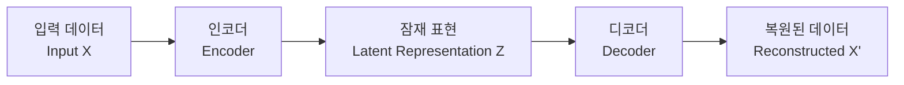

## 📦 사용하는 python package

- torch==2.0.0+
- torchvision==0.15.0+
- numpy==1.24.0+
- matplotlib==3.7.0+
- scikit-learn==1.3.0+
- scipy==1.10.0+

## 🚀 TL;DR

- **오토인코더**는 입력을 압축했다가 다시 복원하는 과정을 통해 **데이터의 핵심 특징**을 학습하는 비지도 학습 모델
- **인코더-디코더 구조**로 구성되며, 중간의 **잠재 표현(latent representation)**이 데이터의 압축된 특징을 담음
- **차원 축소**, **특징 추출**, **이상치 탐지** 등 다양한 용도로 활용 가능
- **Denoising Autoencoder**는 노이즈가 포함된 데이터로부터 깨끗한 데이터를 복원하여 더 강건한 특징 학습
- 새로운 데이터 생성보다는 **데이터의 본질적 특성 이해**에 특화된 모델
- VAE, GAN 등 생성 모델의 **기반 구조**로도 활용

## 📓 실습 Jupyter Notebook

- [Autoencoder 기초와 활용](https://github.com/yuiyeong/notebooks/blob/main/deep_learning/autoencoder_basics.ipynb)

## 🔍 오토인코더란 무엇인가?

오토인코더(Autoencoder)는 **입력 데이터를 그대로 출력으로 재현하는 것을 목표**로 하는 신경망 모델이다. 언뜻 보면 단순해 보이지만, 이 과정에서 데이터를 한 번 압축했다가 다시 복원하도록 강제함으로써 데이터의 **핵심적인 특징만을 학습**하게 된다.

마치 우리가 여러 사람의 얼굴을 기억할 때 모든 세부사항을 외우는 것이 아니라, 각 사람의 **특징적인 요소들**(안경 착용 여부, 머리 길이, 나이, 성별 등)만을 기억하는 것과 비슷하다.

> 오토인코더는 **"압축을 통한 학습"**이라는 독특한 접근법으로 레이블 없이도 데이터의 본질적 특성을 파악할 수 있는 강력한 도구이다. {: .prompt-tip}

## 🏗️ 오토인코더의 구조

### 전체 아키텍처

오토인코더는 크게 **세 부분**으로 구성된다:



### 인코더 (Encoder)

인코더는 **고차원의 입력 데이터를 저차원의 잠재 공간으로 매핑**하는 역할을 한다. 수학적으로 다음과 같이 표현할 수 있다:

$$ z = f_{\theta}(x) $$

여기서:

- **x**: 입력 데이터 (예: 28×28 픽셀 이미지라면 784차원 벡터)
- **z**: 잠재 표현 (latent representation, 예: 32차원 벡터)
- **f_θ**: 매개변수 θ를 가진 인코더 함수 (일반적으로 신경망)

### 디코더 (Decoder)

디코더는 **압축된 잠재 표현을 다시 원본 데이터의 차원으로 복원**하는 역할을 한다:

$$ x' = g_{\phi}(z) $$

여기서:

- **z**: 잠재 표현
- **x'**: 복원된 데이터
- **g_φ**: 매개변수 φ를 가진 디코더 함수

### 잠재 표현 (Latent Representation)

잠재 표현 z는 오토인코더의 **핵심**이다. 이는 입력 데이터의 **가장 중요한 정보만을 압축해서 담고 있는 벡터**로, 다음과 같은 특성을 가진다:

- **차원 축소**: 원본보다 훨씬 작은 차원 (예: 784차원 → 32차원)
- **정보 보존**: 원본을 복원할 수 있을 만큼의 핵심 정보 포함
- **특징 추출**: 데이터의 본질적 패턴과 구조 표현

## 📊 오토인코더의 수학적 원리

### 손실 함수 (Loss Function)

오토인코더의 학습 목표는 **입력과 출력 간의 차이를 최소화**하는 것이다. 가장 일반적으로 사용되는 손실 함수는 **재구성 손실(Reconstruction Loss)**이다:

$$ L(\theta, \phi) = \frac{1}{n} \sum_{i=1}^{n} ||x_i - g_{\phi}(f_{\theta}(x_i))||^2 $$

이를 더 간단히 표현하면:

$$ L = ||x - x'||^2 $$

여기서:

- **n**: 전체 데이터 개수
- **x_i**: i번째 입력 데이터
- **||·||²**: L2 노름 (유클리드 거리의 제곱)

### L1 손실과 L2 손실의 차이

**L2 손실 (Mean Squared Error)**: $$ L_{L2} = \frac{1}{n} \sum_{i=1}^{n} (x_i - x'_i)^2 $$

- **특징**: 큰 오차에 더 큰 패널티 부여
- **효과**: 전체적으로 부드러운 복원 결과
- **적용**: 연속적인 데이터, 이미지의 전반적 품질 중요할 때

**L1 손실 (Mean Absolute Error)**: $$ L_{L1} = \frac{1}{n} \sum_{i=1}^{n} |x_i - x'_i| $$

- **특징**: 모든 오차에 동일한 가중치
- **효과**: 세밀한 디테일 보존에 유리
- **적용**: 노이즈에 강건한 모델이 필요할 때

### 최적화 과정

오토인코더의 매개변수는 **역전파(Backpropagation)**를 통해 학습된다:

$$ \theta^* = \arg\min_{\theta} L(\theta, \phi) $$ $$ \phi^* = \arg\min_{\phi} L(\theta, \phi) $$

이는 **확률적 경사 하강법(SGD)** 또는 **Adam** 등의 최적화 알고리즘으로 해결된다:

$$ \theta_{t+1} = \theta_t - \alpha \nabla_{\theta} L(\theta_t, \phi_t) $$ $$ \phi_{t+1} = \phi_t - \alpha \nabla_{\phi} L(\theta_t, \phi_t) $$

여기서 α는 **학습률(learning rate)**이다.

## 🧹 Denoising Autoencoder: 더 강건한 특징 학습

### 기본 아이디어

Denoising Autoencoder는 **노이즈가 추가된 입력으로부터 깨끗한 출력을 생성**하도록 학습한다. 이는 마치 안개 속에서도 기린의 긴 목과 점박이 무늬를 구분해내는 것처럼, **본질적인 특징에 더 집중**하게 만든다.

### 수학적 표현

일반적인 오토인코더와 달리, Denoising Autoencoder는 다음과 같은 과정을 거친다:

**1단계: 노이즈 추가** $$ \tilde{x} = x + \epsilon $$

여기서:

- **x**: 원본 깨끗한 데이터
- **ε**: 노이즈 (예: 가우시안 노이즈)
- **x̃**: 노이즈가 추가된 입력

**2단계: 인코딩과 디코딩** $$ z = f_{\theta}(\tilde{x}) $$ $$ x' = g_{\phi}(z) $$

**3단계: 손실 계산** $$ L_{denoising} = ||x - x'||^2 $$

핵심은 **노이즈가 포함된 입력 x̃로부터 깨끗한 원본 x를 복원**하는 것이다.

### 노이즈 종류별 수학적 정의

**가우시안 노이즈**: $$ \epsilon \sim \mathcal{N}(0, \sigma^2) $$ $$ \tilde{x} = x + \epsilon $$

**균등 노이즈**: $$ \epsilon \sim \text{Uniform}(-a, a) $$ $$ \tilde{x} = x + \epsilon $$

**마스킹 노이즈**: $$ \tilde{x}_i = \begin{cases} 0 & \text{확률 } p \ x_i & \text{확률 } 1-p \end{cases} $$

### 강건성의 수학적 해석

Denoising Autoencoder가 학습하는 것은 본질적으로 **조건부 확률 분포**이다:

$$ p(x|\tilde{x}) $$

이는 **노이즈가 있는 관측값 x̃가 주어졌을 때, 실제 깨끗한 데이터 x일 확률**을 의미한다. 이 과정을 통해 모델은 **노이즈에 불변인(noise-invariant) 특징**을 학습하게 된다.

## 💻 오토인코더 구현 예시

```python
import torch
import torch.nn as nn
import torch.optim as optim
import torchvision.transforms as transforms
from torchvision.datasets import MNIST
from torch.utils.data import DataLoader

class SimpleAutoencoder(nn.Module):
    def __init__(self, input_dim=784, hidden_dim=128, latent_dim=32):
        super(SimpleAutoencoder, self).__init__()
        
        # 인코더: 입력 → 잠재 표현
        self.encoder = nn.Sequential(
            nn.Linear(input_dim, hidden_dim),
            nn.ReLU(),
            nn.Linear(hidden_dim, latent_dim)
        )
        
        # 디코더: 잠재 표현 → 출력
        self.decoder = nn.Sequential(
            nn.Linear(latent_dim, hidden_dim),
            nn.ReLU(),
            nn.Linear(hidden_dim, input_dim),
            nn.Sigmoid()  # 픽셀 값을 0-1 범위로 제한
        )
    
    def forward(self, x):
        # 인코딩: x → z
        z = self.encoder(x)
        # 디코딩: z → x'
        x_reconstructed = self.decoder(z)
        return x_reconstructed, z

# Denoising Autoencoder
class DenoisingAutoencoder(SimpleAutoencoder):
    def __init__(self, input_dim=784, hidden_dim=128, latent_dim=32, noise_factor=0.3):
        super(DenoisingAutoencoder, self).__init__(input_dim, hidden_dim, latent_dim)
        self.noise_factor = noise_factor
    
    def add_noise(self, x):
        noise = torch.randn_like(x) * self.noise_factor
        return torch.clamp(x + noise, 0.0, 1.0)
    
    def forward(self, x):
        # 학습 시에만 노이즈 추가
        if self.training:
            x_noisy = self.add_noise(x)
        else:
            x_noisy = x
        
        z = self.encoder(x_noisy)
        x_reconstructed = self.decoder(z)
        return x_reconstructed, z

# 학습 함수
def train_autoencoder(model, dataloader, epochs=100):
    criterion = nn.MSELoss()  # L2 손실 함수
    optimizer = optim.Adam(model.parameters(), lr=1e-3)
    
    model.train()
    for epoch in range(epochs):
        total_loss = 0
        for batch_idx, (data, _) in enumerate(dataloader):
            # 데이터 평면화: (batch_size, 28, 28) → (batch_size, 784)
            data = data.view(data.size(0), -1)
            
            optimizer.zero_grad()
            
            # 순전파
            reconstructed, latent = model(data)
            
            # 손실 계산 (원본 data와 복원된 reconstructed 비교)
            loss = criterion(reconstructed, data)
            
            # 역전파
            loss.backward()
            optimizer.step()
            
            total_loss += loss.item()
        
        if (epoch + 1) % 10 == 0:
            avg_loss = total_loss / len(dataloader)
            print(f'Epoch [{epoch+1}/{epochs}], Loss: {avg_loss:.4f}')

# 사용 예시
transform = transforms.Compose([transforms.ToTensor()])
train_dataset = MNIST(root='./data', train=True, download=True, transform=transform)
train_loader = DataLoader(train_dataset, batch_size=128, shuffle=True)

# 일반 오토인코더
autoencoder = SimpleAutoencoder()
print("Training Simple Autoencoder...")
train_autoencoder(autoencoder, train_loader, epochs=50)

# Denoising 오토인코더
denoising_autoencoder = DenoisingAutoencoder(noise_factor=0.3)
print("\nTraining Denoising Autoencoder...")
train_autoencoder(denoising_autoencoder, train_loader, epochs=50)
```

## 🎯 오토인코더의 활용 분야

### 차원 축소와 특징 추출

오토인코더의 **잠재 표현**은 원본 데이터의 핵심 정보를 압축한 **고품질 특징 벡터**로 활용할 수 있다.

```python
# 특징 추출 예시
def extract_features(model, dataloader):
    model.eval()
    features = []
    labels = []
    
    with torch.no_grad():
        for data, label in dataloader:
            data = data.view(data.size(0), -1)
            _, latent = model(data)  # 잠재 표현 추출
            features.append(latent.cpu().numpy())
            labels.append(label.cpu().numpy())
    
    return np.vstack(features), np.hstack(labels)

# 클러스터링에 활용
from sklearn.cluster import KMeans
from sklearn.metrics import adjusted_rand_score

features, true_labels = extract_features(autoencoder, train_loader)

# 잠재 특징으로 클러스터링
kmeans = KMeans(n_clusters=10, random_state=42)
cluster_labels = kmeans.fit_predict(features)

# 성능 평가
ari_score = adjusted_rand_score(true_labels, cluster_labels)
print(f'Adjusted Rand Index: {ari_score:.4f}')
# 출력: Adjusted Rand Index: 0.6234 (레이블 없이도 상당한 성능)
```

### 이상치 탐지 (Anomaly Detection)

오토인코더는 **정상 데이터로만 학습**한 후, **복원 오차가 큰 데이터를 이상치로 판단**하는 방식으로 활용된다.

수학적으로, 이상치 점수는 다음과 같이 계산된다:

$$ \text{Anomaly Score} = ||x - \text{Autoencoder}(x)||^2 $$

```python
def detect_anomalies(model, test_data, threshold_percentile=95):
    model.eval()
    reconstruction_errors = []
    
    with torch.no_grad():
        for data in test_data:
            data = data.view(1, -1)  # 단일 샘플
            reconstructed, _ = model(data)
            
            # 복원 오차 계산
            error = torch.mean((data - reconstructed) ** 2).item()
            reconstruction_errors.append(error)
    
    # 임계값 설정 (상위 5%를 이상치로 판단)
    threshold = np.percentile(reconstruction_errors, threshold_percentile)
    
    # 이상치 판정
    anomalies = [error > threshold for error in reconstruction_errors]
    
    return anomalies, reconstruction_errors, threshold

# 사용 예시
# 정상 데이터(숫자 0-4)로만 학습된 모델이 있다고 가정
# 테스트 데이터에 숫자 5-9가 섞여 있으면 이상치로 탐지됨
```

### 데이터 압축

오토인코더는 **손실 압축(lossy compression)** 기법으로도 활용할 수 있다. 압축률은 다음과 같이 계산된다:

$$ \text{Compression Ratio} = \frac{\text{Original Dimension}}{\text{Latent Dimension}} $$

예를 들어, 784차원 → 32차원으로 압축하면 **24.5배 압축**이 달성된다.

## [시각적 표현 넣기]

여기에 다음과 같은 시각적 자료가 필요합니다:

1. 오토인코더의 전체 구조도 (인코더-잠재표현-디코더)
2. 일반 오토인코더 vs Denoising 오토인코더 비교 그림
3. 손실 함수 그래프 (L1 vs L2)
4. 잠재 공간에서의 클러스터링 결과 시각화
5. 이상치 탐지 결과 예시 (정상 vs 이상 데이터)

## ⚠️ 오토인코더의 한계점

### 생성 능력의 제한

오토인코더는 **항상 입력이 있어야 동작**하므로, 새로운 데이터를 **무에서 생성하기 어렵다**. 이는 다음과 같은 수학적 제약 때문이다:

$$ x' = g_{\phi}(f_{\theta}(x)) $$

입력 x 없이는 의미있는 출력을 생성할 수 없다.

### 모드 붕괴 (Mode Collapse)

복잡한 데이터 분포에서 **일부 모드만 학습**하고 나머지는 무시하는 현상이 발생할 수 있다.

### 잠재 공간의 불연속성

일반적인 오토인코더의 잠재 공간은 **연속적이지 않을 수 있어** 보간(interpolation)이 의미있는 결과를 만들지 못할 수 있다.

> 이러한 한계점들은 **Variational Autoencoder (VAE)**나 **Generative Adversarial Networks (GAN)**과 같은 더 발전된 생성 모델의 개발 동기가 되었다. {: .prompt-warning}

## 🔮 오토인코더의 발전 방향

### Variational Autoencoder (VAE)

잠재 공간에 **확률적 구조**를 도입하여 생성 능력을 획득한 모델이다.

### Sparse Autoencoder

**희소성 제약**을 추가하여 더 의미있는 특징을 학습하는 모델이다:

$$ L_{sparse} = L_{reconstruction} + \lambda \sum_j KL(\rho || \hat{\rho}_j) $$

여기서 ρ는 목표 활성화 비율, ρ̂_j는 실제 활성화 비율이다.

### Contractive Autoencoder

**수축 손실(contractive loss)**을 추가하여 잠재 표현의 지역적 안정성을 확보한다:

$$ L_{contractive} = L_{reconstruction} + \lambda \sum_j ||\nabla_x h_j(x)||^2 $$

## 🎓 정리

오토인코더는 **"압축을 통한 학습"**이라는 독창적인 접근법으로 다음과 같은 특징을 가진다:

- **비지도 학습**: 레이블 없이도 데이터의 본질적 특성 학습
- **다목적성**: 차원 축소, 특징 추출, 이상치 탐지 등 다양한 활용
- **확장성**: VAE, GAN 등 생성 모델의 기반 구조로 발전

오토인코더는 직접적인 생성 모델은 아니지만, **데이터의 본질을 이해하고 표현하는 강력한 도구**로서 현대 딥러닝의 중요한 구성 요소이다. 특히 **잠재 표현 학습**의 개념은 이후 등장하는 모든 생성 모델의 핵심 아이디어가 되었다.

> 오토인코더를 이해하는 것은 단순히 하나의 모델을 아는 것이 아니라, **표현 학습(Representation Learning)**과 **생성 모델링**의 기초를 다지는 중요한 과정이다. {: .prompt-tip}