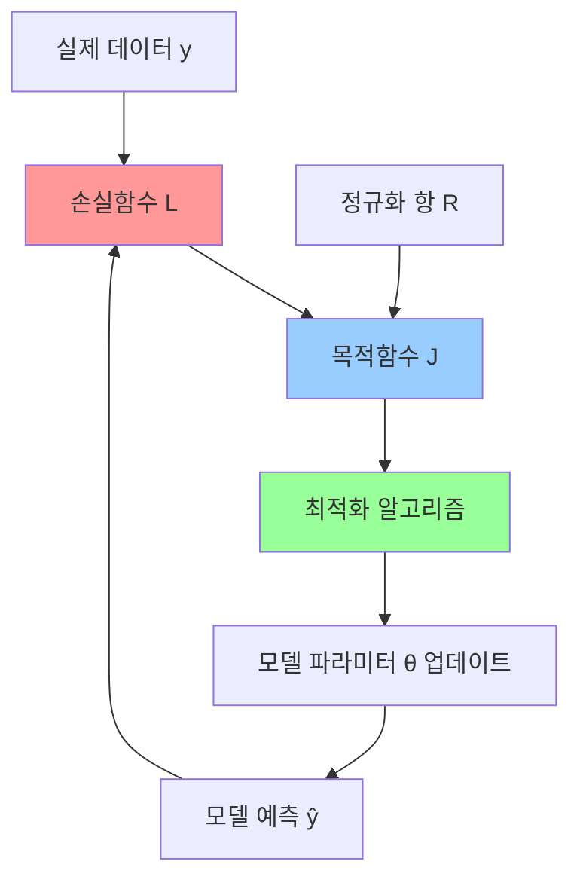
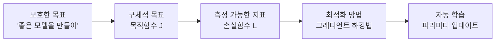
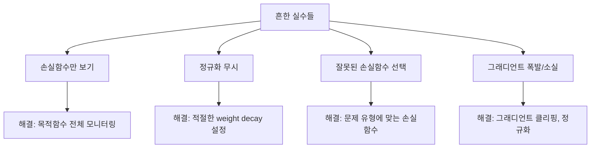

## 📚 1. 개념 이해

### 정의와 관계

- **목적함수 (Objective Function)**: 모델이 **최적화하려는 전체 목표**
- **손실함수 (Loss Function)**: 모델의 **예측과 실제 정답 간의 차이를 수치화**하는 함수



### 수학적 관계

일반적으로 목적함수는 다음과 같이 구성됩니다:

$$J(\theta) = L(y, \hat{y}) + \lambda R(\theta)$$

여기서:

- $J(\theta)$: 목적함수 (Objective Function)
- $L(y, \hat{y})$: 손실함수 (Loss Function)
- $R(\theta)$: 정규화 항 (Regularization)
- $\lambda$: 정규화 강도

## 💡 2. 왜 중요한가?

### 사용자의 질문에 대한 답변

**Q1: 딥러닝 모델은 목적함수의 계수들을 맞추려는 것인가?**

> **정확히 맞습니다!** 딥러닝 모델의 모든 파라미터($\theta$)는 목적함수 $J(\theta)$를 **최소화**하는 방향으로 조정됩니다.

**Q2: 손실함수가 "어떻게"를 제공하는 역할인가?**

> **맞습니다!** 손실함수는 **그래디언트(기울기)**를 통해 파라미터를 어느 방향으로, 얼마나 조정할지 알려줍니다.

### 왜 이 시스템이 필요한가?



## 🔧 3. 구현하기

### 3.1 의사 코드로 이해하기

```
1. 모델에 데이터 입력: prediction = model(X)
2. 손실 계산: loss = loss_function(prediction, y_true)
3. 목적함수 계산: objective = loss + regularization
4. 그래디언트 계산: gradients = ∂objective/∂parameters
5. 파라미터 업데이트: parameters = parameters - learning_rate * gradients
6. 1~5 반복
```

### 3.2 NumPy로 구현하기

```python
import numpy as np
import matplotlib.pyplot as plt

class SimpleLinearModel:
    """간단한 선형 모델로 목적함수와 손실함수 이해하기"""
    
    def __init__(self):
        # 모델 파라미터 (계수들)
        self.w = np.random.randn()  # 가중치
        self.b = np.random.randn()  # 편향
        
        # 학습 기록을 위한 리스트
        self.loss_history = []
        self.objective_history = []
    
    def forward(self, X):
        """예측값 계산"""
        return self.w * X + self.b
    
    def loss_function(self, y_pred, y_true):
        """손실함수: 평균 제곱 오차 (MSE)"""
        mse = np.mean((y_pred - y_true)**2)
        return mse
    
    def regularization(self, lambda_reg=0.01):
        """정규화 항: L2 정규화"""
        return lambda_reg * (self.w**2 + self.b**2)
    
    def objective_function(self, y_pred, y_true, lambda_reg=0.01):
        """목적함수 = 손실함수 + 정규화"""
        loss = self.loss_function(y_pred, y_true)
        reg = self.regularization(lambda_reg)
        return loss + reg, loss, reg
    
    def compute_gradients(self, X, y_pred, y_true, lambda_reg=0.01):
        """그래디언트 계산 (해석적 해)"""
        n = len(X)
        
        # 손실함수에 대한 그래디언트
        dw_loss = (2/n) * np.sum((y_pred - y_true) * X)
        db_loss = (2/n) * np.sum(y_pred - y_true)
        
        # 정규화에 대한 그래디언트
        dw_reg = 2 * lambda_reg * self.w
        db_reg = 2 * lambda_reg * self.b
        
        # 총 그래디언트 = 손실 그래디언트 + 정규화 그래디언트
        dw_total = dw_loss + dw_reg
        db_total = db_loss + db_reg
        
        return dw_total, db_total, dw_loss, db_loss, dw_reg, db_reg
    
    def train_step(self, X, y_true, learning_rate=0.01, lambda_reg=0.01):
        """한 번의 학습 단계"""
        # 1. 순전파: 예측값 계산
        y_pred = self.forward(X)
        
        # 2. 목적함수 계산
        objective, loss, reg = self.objective_function(y_pred, y_true, lambda_reg)
        
        # 3. 그래디언트 계산
        dw_total, db_total, dw_loss, db_loss, dw_reg, db_reg = self.compute_gradients(
            X, y_pred, y_true, lambda_reg
        )
        
        # 4. 파라미터 업데이트
        self.w -= learning_rate * dw_total
        self.b -= learning_rate * db_total
        
        # 5. 기록 저장
        self.loss_history.append(loss)
        self.objective_history.append(objective)
        
        return {
            'objective': objective,
            'loss': loss,
            'regularization': reg,
            'gradients': {
                'dw_total': dw_total, 'db_total': db_total,
                'dw_loss': dw_loss, 'db_loss': db_loss,
                'dw_reg': dw_reg, 'db_reg': db_reg
            },
            'parameters': {'w': self.w, 'b': self.b}
        }

# 데이터 생성
np.random.seed(42)
X = np.linspace(0, 10, 100)
y_true = 2 * X + 1 + np.random.normal(0, 1, 100)  # y = 2x + 1 + 노이즈

# 모델 생성 및 학습
model = SimpleLinearModel()
print(f"초기 파라미터: w={model.w:.3f}, b={model.b:.3f}")

# 학습 과정 시뮬레이션
for epoch in range(100):
    result = model.train_step(X, y_true, learning_rate=0.001, lambda_reg=0.01)
    
    if epoch % 20 == 0:
        print(f"\nEpoch {epoch}:")
        print(f"  목적함수: {result['objective']:.4f}")
        print(f"  손실함수: {result['loss']:.4f}")
        print(f"  정규화: {result['regularization']:.4f}")
        print(f"  파라미터: w={result['parameters']['w']:.3f}, b={result['parameters']['b']:.3f}")
        print(f"  그래디언트: dw={result['gradients']['dw_total']:.4f}, db={result['gradients']['db_total']:.4f}")

print(f"\n최종 파라미터: w={model.w:.3f}, b={model.b:.3f}")
print(f"실제 파라미터: w=2.000, b=1.000")

# 결과 시각화
plt.figure(figsize=(15, 5))

# 1. 데이터와 학습된 모델
plt.subplot(1, 3, 1)
plt.scatter(X, y_true, alpha=0.5, label='실제 데이터')
plt.plot(X, model.forward(X), 'r-', label=f'학습된 모델: y={model.w:.2f}x+{model.b:.2f}')
plt.plot(X, 2*X + 1, 'g--', label='실제 함수: y=2x+1')
plt.xlabel('X')
plt.ylabel('y')
plt.title('모델 학습 결과')
plt.legend()
plt.grid(True, alpha=0.3)

# 2. 손실함수 변화
plt.subplot(1, 3, 2)
plt.plot(model.loss_history, label='손실함수 (Loss)')
plt.xlabel('Epoch')
plt.ylabel('Loss')
plt.title('손실함수 변화')
plt.legend()
plt.grid(True, alpha=0.3)

# 3. 목적함수 vs 손실함수
plt.subplot(1, 3, 3)
plt.plot(model.loss_history, label='손실함수', color='blue')
plt.plot(model.objective_history, label='목적함수 (손실+정규화)', color='red')
plt.xlabel('Epoch')
plt.ylabel('Value')
plt.title('목적함수 vs 손실함수')
plt.legend()
plt.grid(True, alpha=0.3)

plt.tight_layout()
plt.show()

# 그래디언트의 역할 시각화
print("\n=== 그래디언트의 역할 ===")
print("그래디언트는 파라미터를 어느 방향으로 조정할지 알려줍니다:")
print("- 양수 그래디언트: 파라미터를 감소시켜야 함")
print("- 음수 그래디언트: 파라미터를 증가시켜야 함")
print("- 큰 절댓값: 큰 폭으로 조정")
print("- 작은 절댓값: 작은 폭으로 조정")
```

### 3.3 PyTorch로 실무 구현

```python
import torch
import torch.nn as nn
import torch.optim as optim
import matplotlib.pyplot as plt
import numpy as np

class DeepModel(nn.Module):
    """실무용 딥러닝 모델 예제"""
    
    def __init__(self, input_size, hidden_size, output_size):
        super(DeepModel, self).__init__()
        self.layers = nn.Sequential(
            nn.Linear(input_size, hidden_size),
            nn.ReLU(),
            nn.Linear(hidden_size, hidden_size//2),
            nn.ReLU(),
            nn.Linear(hidden_size//2, output_size)
        )
        
        # 학습 기록
        self.train_losses = []
        self.train_objectives = []
        
    def forward(self, x):
        return self.layers(x)
    
    def compute_objective(self, predictions, targets, weight_decay=0.01):
        """목적함수 계산: 손실 + 정규화"""
        
        # 1. 손실함수 (MSE)
        loss = nn.MSELoss()(predictions, targets)
        
        # 2. L2 정규화 (가중치 감소)
        l2_penalty = 0.0
        for param in self.parameters():
            l2_penalty += torch.sum(param ** 2)
        
        # 3. 목적함수 = 손실 + 정규화
        objective = loss + weight_decay * l2_penalty
        
        return objective, loss, l2_penalty

# 실제 사용 예제
def demonstrate_objective_loss():
    """목적함수와 손실함수의 실제 동작 시연"""
    
    # 데이터 생성
    torch.manual_seed(42)
    X = torch.randn(1000, 5)  # 입력 특성 5개
    true_weights = torch.tensor([2.0, -1.5, 0.8, -0.3, 1.2])
    y = X @ true_weights + 0.1 * torch.randn(1000)  # 선형 관계 + 노이즈
    
    # 모델 생성
    model = DeepModel(input_size=5, hidden_size=64, output_size=1)
    optimizer = optim.Adam(model.parameters(), lr=0.01)
    
    print("=== 학습 과정에서 목적함수와 손실함수의 변화 ===")
    
    for epoch in range(200):
        # 순전파
        predictions = model(X).squeeze()
        
        # 목적함수 계산
        objective, loss, l2_penalty = model.compute_objective(
            predictions, y, weight_decay=0.001
        )
        
        # 역전파 및 최적화
        optimizer.zero_grad()  # 그래디언트 초기화
        objective.backward()   # 목적함수에 대한 그래디언트 계산
        optimizer.step()       # 파라미터 업데이트
        
        # 기록 저장
        model.train_losses.append(loss.item())
        model.train_objectives.append(objective.item())
        
        if epoch % 40 == 0:
            print(f"Epoch {epoch:3d}: 목적함수={objective:.4f}, "
                  f"손실={loss:.4f}, 정규화={l2_penalty:.4f}")
    
    return model, X, y

# 다양한 손실함수 비교
class LossFunctionComparison:
    """다양한 손실함수의 특성 비교"""
    
    @staticmethod
    def compare_loss_functions():
        # 예측값과 실제값 생성
        y_true = torch.tensor([1.0, 2.0, 3.0, 4.0, 5.0])
        y_pred_good = torch.tensor([1.1, 2.1, 2.9, 4.2, 4.8])  # 좋은 예측
        y_pred_bad = torch.tensor([2.0, 1.0, 5.0, 2.0, 7.0])   # 나쁜 예측
        
        # 다양한 손실함수들
        loss_functions = {
            'MSE (L2)': nn.MSELoss(),
            'MAE (L1)': nn.L1Loss(),
            'Huber': nn.HuberLoss(),
            'Smooth L1': nn.SmoothL1Loss()
        }
        
        print("\n=== 다양한 손실함수 비교 ===")
        print("y_true:", y_true.tolist())
        print("y_pred_good:", y_pred_good.tolist())
        print("y_pred_bad:", y_pred_bad.tolist())
        print()
        
        for name, loss_fn in loss_functions.items():
            loss_good = loss_fn(y_pred_good, y_true)
            loss_bad = loss_fn(y_pred_bad, y_true)
            print(f"{name:12s}: 좋은 예측={loss_good:.4f}, 나쁜 예측={loss_bad:.4f}")

# 실행 및 시각화
model, X, y = demonstrate_objective_loss()

# 손실함수 비교
LossFunctionComparison.compare_loss_functions()

# 그래디언트 분석
print("\n=== 그래디언트 분석 ===")
model.eval()
X_sample = X[:10]
y_sample = y[:10]

# 그래디언트 계산을 위해 입력에 requires_grad 설정
X_sample.requires_grad_(True)

predictions = model(X_sample).squeeze()
objective, loss, l2_penalty = model.compute_objective(predictions, y_sample)

# 입력에 대한 그래디언트 계산
input_gradients = torch.autograd.grad(objective, X_sample, retain_graph=True)[0]

print(f"입력 데이터의 그래디언트 (처음 3개 샘플):")
for i in range(3):
    print(f"  샘플 {i+1}: {input_gradients[i].detach().numpy()}")

# 시각화
plt.figure(figsize=(15, 10))

# 1. 학습 곡선
plt.subplot(2, 3, 1)
plt.plot(model.train_losses, label='손실함수', color='blue')
plt.plot(model.train_objectives, label='목적함수', color='red')
plt.xlabel('Epoch')
plt.ylabel('Value')
plt.title('학습 곡선: 목적함수 vs 손실함수')
plt.legend()
plt.grid(True, alpha=0.3)

# 2. 예측 결과 (첫 번째 특성만)
plt.subplot(2, 3, 2)
with torch.no_grad():
    final_predictions = model(X).squeeze()
plt.scatter(y.numpy(), final_predictions.numpy(), alpha=0.5)
plt.plot([y.min(), y.max()], [y.min(), y.max()], 'r--', label='Perfect Prediction')
plt.xlabel('실제값')
plt.ylabel('예측값')
plt.title('예측 정확도')
plt.legend()
plt.grid(True, alpha=0.3)

# 3. 손실함수의 기하학적 의미
plt.subplot(2, 3, 3)
errors = (final_predictions - y).numpy()
plt.hist(errors, bins=30, alpha=0.7, edgecolor='black')
plt.xlabel('예측 오차 (예측값 - 실제값)')
plt.ylabel('빈도')
plt.title('예측 오차 분포')
plt.grid(True, alpha=0.3)

# 4. 정규화의 효과 비교
plt.subplot(2, 3, 4)
weight_decays = [0, 0.001, 0.01, 0.1]
final_losses = []

for wd in weight_decays:
    temp_model = DeepModel(5, 64, 1)
    temp_optimizer = optim.Adam(temp_model.parameters(), lr=0.01)
    
    for _ in range(100):
        predictions = temp_model(X).squeeze()
        objective, loss, _ = temp_model.compute_objective(predictions, y, wd)
        temp_optimizer.zero_grad()
        objective.backward()
        temp_optimizer.step()
    
    final_losses.append(loss.item())

plt.bar([str(wd) for wd in weight_decays], final_losses)
plt.xlabel('Weight Decay (정규화 강도)')
plt.ylabel('최종 손실')
plt.title('정규화 강도별 성능')
plt.grid(True, alpha=0.3)

# 5. 그래디언트 크기 시각화
plt.subplot(2, 3, 5)
grad_norms = []
for param in model.parameters():
    if param.grad is not None:
        grad_norms.append(param.grad.norm().item())

plt.bar(range(len(grad_norms)), grad_norms)
plt.xlabel('레이어 번호')
plt.ylabel('그래디언트 크기')
plt.title('레이어별 그래디언트 크기')
plt.grid(True, alpha=0.3)

# 6. 파라미터 분포
plt.subplot(2, 3, 6)
all_params = []
for param in model.parameters():
    all_params.extend(param.data.flatten().numpy())

plt.hist(all_params, bins=50, alpha=0.7, edgecolor='black')
plt.xlabel('파라미터 값')
plt.ylabel('빈도')
plt.title('학습된 파라미터 분포')
plt.grid(True, alpha=0.3)

plt.tight_layout()
plt.show()

print(f"\n학습 완료!")
print(f"최종 손실: {model.train_losses[-1]:.4f}")
print(f"최종 목적함수: {model.train_objectives[-1]:.4f}")
print(f"총 파라미터 수: {sum(p.numel() for p in model.parameters())}")

# 핵심 개념 정리
print("\n" + "="*50)
print("🎯 핵심 정리")
print("="*50)
print("1. 목적함수 = 손실함수 + 정규화")
print("2. 손실함수: 예측과 실제의 차이를 측정")
print("3. 정규화: 모델의 복잡도를 제어")
print("4. 그래디언트: 파라미터 업데이트 방향과 크기 결정")
print("5. 최적화: 목적함수를 최소화하는 파라미터 탐색")
```

## 📊 4. 실습 예제

실제 이미지 분류 문제에서 목적함수와 손실함수가 어떻게 작동하는지 보겠습니다.


```python
import torch
import torch.nn as nn
import torch.optim as optim
import torchvision.transforms as transforms
from torch.utils.data import DataLoader, TensorDataset
import matplotlib.pyplot as plt
import numpy as np

class CNNClassifier(nn.Module):
    """실무용 CNN 분류 모델"""
    
    def __init__(self, num_classes=10):
        super(CNNClassifier, self).__init__()
        
        self.features = nn.Sequential(
            nn.Conv2d(1, 32, 3, padding=1),
            nn.ReLU(),
            nn.MaxPool2d(2),
            nn.Conv2d(32, 64, 3, padding=1),
            nn.ReLU(),
            nn.MaxPool2d(2),
        )
        
        self.classifier = nn.Sequential(
            nn.Flatten(),
            nn.Linear(64 * 7 * 7, 128),
            nn.ReLU(),
            nn.Dropout(0.5),
            nn.Linear(128, num_classes)
        )
        
        # 학습 기록
        self.history = {
            'train_loss': [],
            'train_objective': [],
            'train_accuracy': [],
            'regularization': []
        }
    
    def forward(self, x):
        x = self.features(x)
        x = self.classifier(x)
        return x
    
    def compute_objective_and_metrics(self, outputs, targets, weight_decay=0.01):
        """목적함수와 성능 지표 계산"""
        
        # 1. 손실함수: CrossEntropyLoss
        ce_loss = nn.CrossEntropyLoss()(outputs, targets)
        
        # 2. 정규화: L2 Weight Decay
        l2_penalty = 0.0
        for param in self.parameters():
            l2_penalty += torch.sum(param ** 2)
        
        # 3. 목적함수
        objective = ce_loss + weight_decay * l2_penalty
        
        # 4. 정확도 계산
        _, predicted = torch.max(outputs.data, 1)
        accuracy = (predicted == targets).float().mean()
        
        return {
            'objective': objective,
            'loss': ce_loss,
            'regularization': l2_penalty,
            'accuracy': accuracy
        }

def create_synthetic_data():
    """합성 데이터 생성 (MNIST 스타일)"""
    torch.manual_seed(42)
    
    # 간단한 패턴이 있는 28x28 이미지 생성
    n_samples = 1000
    images = torch.randn(n_samples, 1, 28, 28)
    
    # 레이블 생성 (간단한 규칙 기반)
    labels = torch.zeros(n_samples, dtype=torch.long)
    
    for i in range(n_samples):
        # 이미지의 평균값에 따라 클래스 결정
        if images[i].mean() > 0.2:
            labels[i] = 1
        elif images[i].mean() < -0.2:
            labels[i] = 0
        else:
            labels[i] = 2
    
    return images, labels

def train_with_different_objectives():
    """다양한 목적함수 설정으로 학습 비교"""
    
    # 데이터 준비
    images, labels = create_synthetic_data()
    dataset = TensorDataset(images, labels)
    dataloader = DataLoader(dataset, batch_size=32, shuffle=True)
    
    # 서로 다른 설정으로 모델 학습
    configurations = [
        {'weight_decay': 0.0, 'dropout': False, 'name': '정규화 없음'},
        {'weight_decay': 0.01, 'dropout': False, 'name': 'L2 정규화만'},
        {'weight_decay': 0.0, 'dropout': True, 'name': 'Dropout만'},
        {'weight_decay': 0.01, 'dropout': True, 'name': 'L2 + Dropout'},
    ]
    
    results = {}
    
    print("=== 다양한 목적함수 설정으로 학습 비교 ===")
    
    for config in configurations:
        print(f"\n학습 중: {config['name']}")
        
        # 모델 생성
        model = CNNClassifier(num_classes=3)
        
        # Dropout 설정
        if not config['dropout']:
            for module in model.modules():
                if isinstance(module, nn.Dropout):
                    module.p = 0.0
        
        optimizer = optim.Adam(model.parameters(), lr=0.001)
        
        # 학습
        for epoch in range(50):
            epoch_loss = 0.0
            epoch_objective = 0.0
            epoch_accuracy = 0.0
            epoch_regularization = 0.0
            
            for batch_images, batch_labels in dataloader:
                # 순전파
                outputs = model(batch_images)
                
                # 목적함수 및 지표 계산
                metrics = model.compute_objective_and_metrics(
                    outputs, batch_labels, config['weight_decay']
                )
                
                # 역전파
                optimizer.zero_grad()
                metrics['objective'].backward()
                optimizer.step()
                
                # 배치 지표 누적
                epoch_loss += metrics['loss'].item()
                epoch_objective += metrics['objective'].item()
                epoch_accuracy += metrics['accuracy'].item()
                epoch_regularization += metrics['regularization'].item()
            
            # 에포크 평균 계산
            n_batches = len(dataloader)
            model.history['train_loss'].append(epoch_loss / n_batches)
            model.history['train_objective'].append(epoch_objective / n_batches)
            model.history['train_accuracy'].append(epoch_accuracy / n_batches)
            model.history['train_regularization'].append(epoch_regularization / n_batches)
        
        results[config['name']] = model.history
        print(f"  최종 정확도: {model.history['train_accuracy'][-1]:.3f}")
        print(f"  최종 손실: {model.history['train_loss'][-1]:.3f}")
    
    return results

def visualize_loss_functions():
    """다양한 손실함수의 특성 시각화"""
    
    # 이진 분류 예제
    y_true = torch.tensor([1.0])  # 실제 레이블
    logits = torch.linspace(-3, 3, 100)  # 모델 출력 (로짓)
    
    # 다양한 손실 계산
    bce_losses = []
    hinge_losses = []
    
    for logit in logits:
        # Binary Cross Entropy
        prob = torch.sigmoid(logit)
        bce = -y_true * torch.log(prob + 1e-8)
        bce_losses.append(bce.item())
        
        # Hinge Loss (SVM style)
        hinge = torch.clamp(1 - y_true * logit, min=0)
        hinge_losses.append(hinge.item())
    
    return logits.numpy(), bce_losses, hinge_losses

# 실행
results = train_with_different_objectives()
logits, bce_losses, hinge_losses = visualize_loss_functions()

# 시각화
plt.figure(figsize=(16, 12))

# 1. 학습 곡선 비교
plt.subplot(3, 3, 1)
for name, history in results.items():
    plt.plot(history['train_loss'], label=name)
plt.xlabel('Epoch')
plt.ylabel('손실함수')
plt.title('설정별 손실함수 변화')
plt.legend()
plt.grid(True, alpha=0.3)

plt.subplot(3, 3, 2)
for name, history in results.items():
    plt.plot(history['train_objective'], label=name)
plt.xlabel('Epoch')
plt.ylabel('목적함수')
plt.title('설정별 목적함수 변화')
plt.legend()
plt.grid(True, alpha=0.3)

plt.subplot(3, 3, 3)
for name, history in results.items():
    plt.plot(history['train_accuracy'], label=name)
plt.xlabel('Epoch')
plt.ylabel('정확도')
plt.title('설정별 정확도 변화')
plt.legend()
plt.grid(True, alpha=0.3)

# 2. 정규화 효과
plt.subplot(3, 3, 4)
for name, history in results.items():
    if 'L2' in name:
        plt.plot(history['train_regularization'], label=name)
plt.xlabel('Epoch')
plt.ylabel('정규화 항')
plt.title('L2 정규화 항 변화')
plt.legend()
plt.grid(True, alpha=0.3)

# 3. 손실함수 특성 비교
plt.subplot(3, 3, 5)
plt.plot(logits, bce_losses, label='Binary Cross Entropy', linewidth=2)
plt.plot(logits, hinge_losses, label='Hinge Loss', linewidth=2)
plt.xlabel('모델 출력 (로짓)')
plt.ylabel('손실')
plt.title('손실함수 특성 비교')
plt.legend()
plt.grid(True, alpha=0.3)

# 4. 최종 성능 비교
plt.subplot(3, 3, 6)
final_accuracies = [results[name]['train_accuracy'][-1] for name in results.keys()]
plt.bar(range(len(results)), final_accuracies)
plt.xticks(range(len(results)), [name.replace(' ', '\n') for name in results.keys()], rotation=45)
plt.ylabel('최종 정확도')
plt.title('설정별 최종 성능')
plt.grid(True, alpha=0.3)

# 5. 손실 vs 목적함수 관계
plt.subplot(3, 3, 7)
name = 'L2 + Dropout'
if name in results:
    plt.scatter(results[name]['train_loss'], results[name]['train_objective'], 
                alpha=0.6, s=20)
    plt.xlabel('손실함수')
    plt.ylabel('목적함수')
    plt.title('손실함수 vs 목적함수 관계')
    plt.grid(True, alpha=0.3)

# 6. 과적합 분석
plt.subplot(3, 3, 8)
for name, history in results.items():
    # 학습 초기와 후기의 손실 변화율 계산
    early_loss = np.mean(history['train_loss'][:10])
    late_loss = np.mean(history['train_loss'][-10:])
    reduction = (early_loss - late_loss) / early_loss
    
    plt.bar(name.replace(' ', '\n'), reduction)

plt.ylabel('손실 감소율')
plt.title('과적합 정도 분석')
plt.xticks(rotation=45)
plt.grid(True, alpha=0.3)

# 7. 그래디언트 폭발/소실 시뮬레이션
plt.subplot(3, 3, 9)
# 간단한 그래디언트 크기 시뮬레이션
learning_rates = [0.1, 0.01, 0.001, 0.0001]
gradient_norms = []

for lr in learning_rates:
    # 임의의 그래디언트 크기 계산 (시뮬레이션)
    norm = 1.0 / (lr ** 0.5)  # 학습률에 반비례하는 패턴
    gradient_norms.append(norm)

plt.semilogy(learning_rates, gradient_norms, 'o-')
plt.xlabel('학습률')
plt.ylabel('그래디언트 크기 (로그 스케일)')
plt.title('학습률과 그래디언트 크기')
plt.grid(True, alpha=0.3)

plt.tight_layout()
plt.show()

# 실무 팁 출력
print("\n" + "="*60)
print("🎯 실무에서의 목적함수와 손실함수 활용 팁")
print("="*60)
print("1. 분류: CrossEntropyLoss + L2 정규화")
print("2. 회귀: MSELoss 또는 HuberLoss + L2 정규화")  
print("3. 불균형 데이터: WeightedLoss 또는 FocalLoss")
print("4. 정규화 강도: 0.001~0.01이 일반적")
print("5. 학습률: 손실이 감소하지 않으면 줄이기")
print("6. 조기 종료: 검증 손실이 증가하기 시작하면 멈추기")
print("\n💡 핵심: 목적함수 = 우리가 정말 최적화하고 싶은 것")
print("   손실함수 = 그것을 수치적으로 측정하는 방법")
```

## 🌍 5. 실제 활용 사례

### Netflix의 추천 시스템

- **목적함수**: 사용자 만족도 최대화 = 시청 시간 + 평점 예측 정확도 - 다양성 손실
- **손실함수**: Matrix Factorization의 RMSE + 정규화
- **결과**: 개인화 추천으로 시청 시간 20% 증가

### Tesla의 자율주행

- **목적함수**: 안전한 주행 = 물체 탐지 정확도 + 경로 최적화 - 사고 위험도
- **손실함수**: Multi-task Loss (탐지 + 분할 + 깊이 추정)
- **특징**: 안전 관련 손실에 더 높은 가중치 부여

### Google 번역

- **목적함수**: 번역 품질 최대화 = BLEU 점수 + 유창성 - 지연시간
- **손실함수**: Cross Entropy + Attention 정규화
- **혁신**: Transformer의 self-attention으로 문맥 이해 개선

## ⚠️ 6. 주의사항 및 한계

### 흔한 실수들



### 실무에서 자주 하는 실수

1. **"손실만 줄이면 된다"** ❌
    
    ```python
    # 잘못된 접근
    if loss < best_loss:
        save_model()
    
    # 올바른 접근  
    if validation_loss < best_val_loss and not overfitting:
        save_model()
    ```
    
2. **"정규화는 선택사항"** ❌
    
    ```python
    # 실무에서는 거의 항상 정규화 필요
    objective = loss + weight_decay * l2_penalty + dropout_regularization
    ```
    
3. **"모든 문제에 MSE 사용"** ❌
    
    ```python
    # 분류에는 CrossEntropy, 회귀에는 MSE/MAE/Huber
    classification_loss = nn.CrossEntropyLoss()
    regression_loss = nn.MSELoss()  # 또는 HuberLoss()
    ```

## 🎯 핵심 정리

**사용자 질문에 대한 명확한 답변**

1. **"딥러닝 모델은 목적함수의 계수들을 맞추려는 것인가?"** → **예, 정확합니다!** 모든 파라미터 $\theta$는 목적함수 $J(\theta)$를 최소화하도록 조정됩니다.
    
2. **"손실함수가 '어떻게'를 제공하는 역할인가?"**  
    → **맞습니다!** 손실함수의 그래디언트 $\frac{\partial L}{\partial \theta}$가 파라미터를 어느 방향으로, 얼마나 조정할지 알려줍니다.
    
3. **왜 이 둘이 중요한가?**
    
    - **목적함수**: 우리가 정말 달성하고 싶은 최종 목표
    - **손실함수**: 그 목표를 수치적으로 측정하고 최적화 가능하게 만드는 도구
    - **함께**: 모호한 "좋은 모델"을 구체적이고 자동으로 학습 가능한 문제로 변환

딥러닝의 모든 것은 결국 "올바른 목적함수 설계 → 효과적인 최적화"입니다! 🚀

# 🎯 모든 딥러닝 모델은 목적함수를 어떻게 정의하냐와 손실함수를 어떻게 정의하냐로 구분될 수 있다?

실제로 모든 딥러닝 모델은 **"목적함수 + 손실함수 설계"** 로 구분할 수 있습니다.
이는 딥러닝을 이해하는 가장 본질적인 관점 중 하나입니다.

## 📋 1. 목적함수 관점에서의 모델 분류

### 1.1 **지도학습 (Supervised Learning)**

- **목적**: 입력→출력 매핑 학습
- **목적함수**: 예측 정확도 최대화 + 일반화 능력
- **특징**: 정답이 있는 데이터로 학습

### 1.2 **비지도학습 (Unsupervised Learning)**

- **목적**: 데이터의 숨겨진 구조 발견
- **목적함수**: 데이터 표현 능력 최대화 + 압축/복원 성능
- **특징**: 정답 없이 패턴 발견

### 1.3 **강화학습 (Reinforcement Learning)**

- **목적**: 누적 보상 최대화
- **목적함수**: 장기적 리워드 최대화 + 탐험-활용 균형
- **특징**: 환경과의 상호작용을 통한 학습

### 1.4 **생성모델 (Generative Models)**

- **목적**: 실제 같은 새로운 데이터 생성
- **목적함수**: 실제 데이터 분포 근사 + 다양성 확보
- **특징**: 확률분포 학습

## 📊 2. 손실함수 관점에서의 모델 분류

### 2.1 **예측 기반 손실**

```
분류: CrossEntropy, Focal Loss, Hinge Loss
회귀: MSE, MAE, Huber Loss
순위: Ranking Loss, Triplet Loss
```

### 2.2 **분포 기반 손실**

```
GAN: Adversarial Loss (minimax game)
VAE: Reconstruction + KL Divergence  
Flow: Negative Log-Likelihood
```

### 2.3 **대조학습 기반 손실**

```
SimCLR: Contrastive Loss
CLIP: Cross-modal Contrastive Loss
Word2Vec: Negative Sampling Loss
```

### 2.4 **시퀀스 기반 손실**

```
언어모델: Next Token Prediction
기계번역: Sequence-to-Sequence Loss
음성인식: CTC Loss
```

## 🏗️ 3. 대표적인 모델들의 목적함수+손실함수 조합

### **ResNet (이미지 분류)**

- **목적함수**: 이미지 분류 정확도 최대화 + 모델 안정성
- **손실함수**: CrossEntropy + L2 정규화
- **핵심 혁신**: Skip connection으로 gradient flow 개선

### **BERT (자연어 이해)**

- **목적함수**: 문맥적 언어 이해 + 양방향 정보 활용
- **손실함수**: Masked Language Model + Next Sentence Prediction
- **핵심 혁신**: 양방향 transformer로 문맥 정보 극대화

### **GPT (언어 생성)**

- **목적함수**: 자연스러운 텍스트 생성 + 일관성 유지
- **손실함수**: Next Token Prediction (Autoregressive)
- **핵심 혁신**: 단방향 attention으로 생성 최적화

### **GAN (이미지 생성)**

- **목적함수**: 실제와 구분 불가능한 이미지 생성
- **손실함수**: Adversarial Loss (Generator vs Discriminator)
- **핵심 혁신**: 두 네트워크의 경쟁 학습

### **CLIP (멀티모달)**

- **목적함수**: 이미지-텍스트 매칭 + 일반화 능력
- **손실함수**: Contrastive Loss (positive pairs 가깝게, negative pairs 멀게)
- **핵심 혁신**: 대규모 이미지-텍스트 쌍 대조학습

### **AlphaGo (강화학습)**

- **목적함수**: 바둑 게임 승률 최대화 + 전략적 사고
- **손실함수**: Policy Loss + Value Loss + MCTS 결합
- **핵심 혁신**: 정책망 + 가치망 + 몬테카를로 트리 탐색

## 🔍 4. 이 관점이 중요한 이유

### 4.1 **모델 설계 관점**

새로운 문제를 만나면:

1. **"무엇을 최적화할 것인가?"** → 목적함수 설계
2. **"어떻게 측정할 것인가?"** → 손실함수 선택
3. **"어떤 제약이 있는가?"** → 정규화 추가

### 4.2 **문제 해결 관점**

- **모델이 학습되지 않으면** → 손실함수가 잘못되었을 가능성
- **과적합이 발생하면** → 목적함수에 정규화 추가 필요
- **성능이 plateau되면** → 목적함수 자체를 재검토

### 4.3 **연구 발전 관점**

딥러닝의 주요 돌파구들:

- **ResNet**: Skip connection으로 gradient 문제 해결
- **Attention**: Sequence 모델링의 손실함수 개선
- **GAN**: 생성 문제의 새로운 목적함수 제시
- **Transformer**: Self-attention으로 시퀀스 최적화 혁신

## 🌟 5. 실무에서의 접근법

### **새로운 프로젝트 시작할 때:**

1. **문제 정의**: "진짜 달성하고 싶은 것이 무엇인가?"
2. **목적함수 설계**: "그것을 어떻게 수학적으로 표현할까?"
3. **손실함수 선택**: "어떤 손실함수가 그 목적에 맞을까?"
4. **제약조건 추가**: "어떤 정규화가 필요할까?"
5. **평가지표 정의**: "성공을 어떻게 측정할까?"

### **기존 모델 개선할 때:**

1. **현재 목적함수 분석**: "지금 무엇을 최적화하고 있나?"
2. **문제점 파악**: "실제 원하는 것과 차이가 있나?"
3. **손실함수 수정**: "더 적합한 손실함수가 있을까?"
4. **Multi-task 고려**: "여러 목표를 동시에 최적화할까?"

## 🎯 6. 핵심 통찰

**사용자의 관찰이 정확한 이유:**

### **모든 딥러닝 모델 = 목적함수 설계 + 손실함수 구현**

1. **CNN**: 이미지 특징 추출 최적화 + Spatial Inductive Bias
2. **RNN**: 시퀀스 정보 보존 최적화 + Temporal Dependencies
3. **Transformer**: 전역 attention 최적화 + Self-attention Mechanism
4. **GAN**: 생성 품질 최적화 + Adversarial Training
5. **VAE**: 잠재 표현 학습 최적화 + Variational Inference

### **혁신은 목적함수의 재정의에서 나온다.**

- **ResNet**: "깊은 네트워크 학습"이라는 새로운 목적
- **BERT**: "양방향 문맥 이해"라는 새로운 목적
- **GPT**: "자연스러운 생성"이라는 새로운 목적
- **CLIP**: "크로스모달 이해"라는 새로운 목적

## 🚀 결론

**딥러닝 모델 이해의 핵심 프레임워크**

```
문제 → 목적함수 설계 → 손실함수 선택 → 네트워크 아키텍처 → 최적화 → 평가
```

이 관점으로 보면,

- **같은 아키텍처**도 **다른 손실함수**로 **완전히 다른 모델**이 됩니다
- **새로운 문제**는 **새로운 목적함수** 설계로 해결됩니다
- **모델의 성능**은 **목적함수가 실제 원하는 것과 얼마나 일치하는지**에 달려있습니다

정말 예리한 통찰이었습니다! 이제 어떤 딥러닝 논문을 봐도 "이 모델은 무엇을 최적화하려고 하는가? 어떻게 측정하는가?"라는 관점으로 접근할 수 있겠네요.
