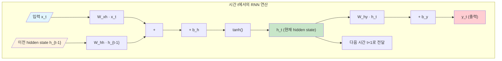
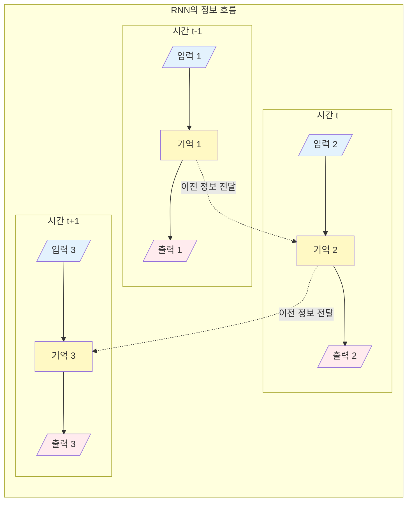
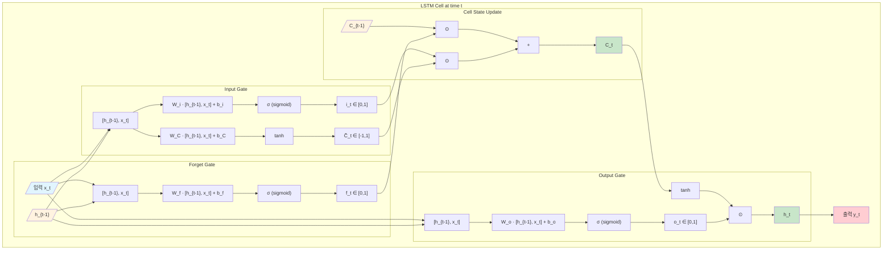
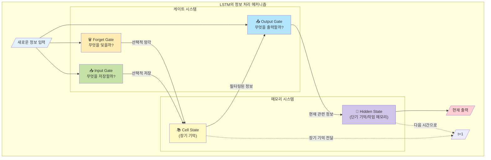
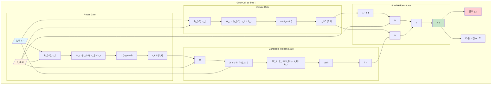
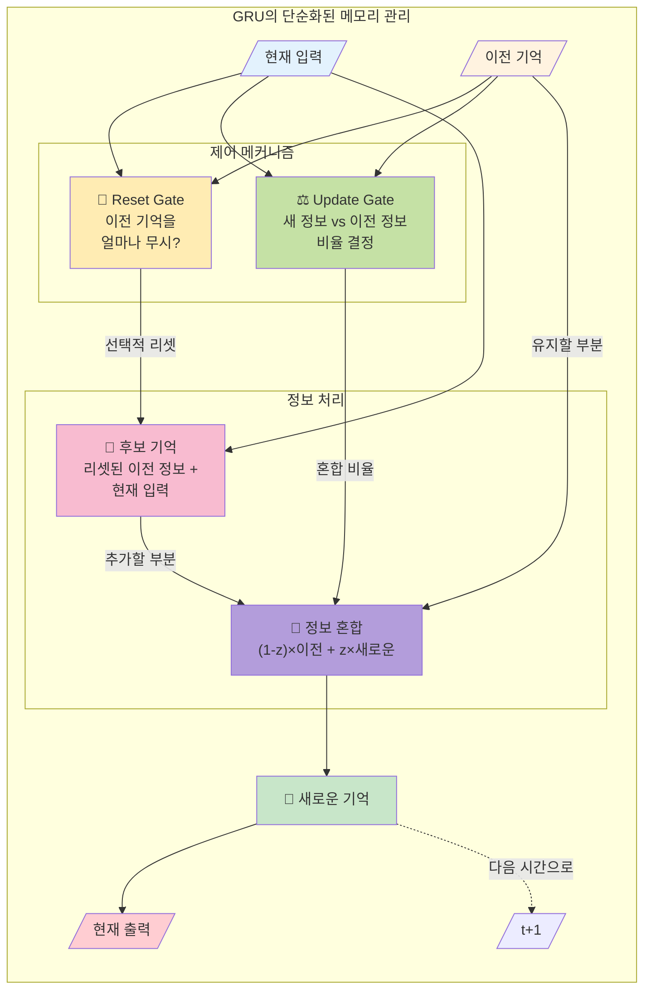
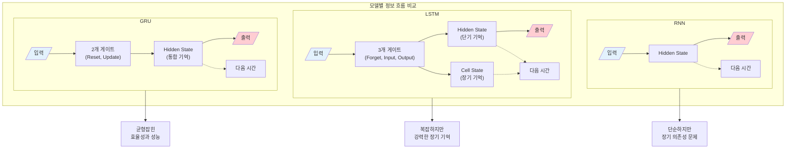

## 📦 사용하는 python package

- torch==2.0.0+
- numpy==1.24.0
- matplotlib==3.7.0

## 🚀 TL;DR

> - **RNN(Recurrent Neural Network)**은 시계열 데이터를 처리하는 딥러닝 모델로, 이전 시간의 정보를 현재 시간에 전달하여 순차적 데이터를 학습한다
> - 자연어 처리는 대부분 **인코더-디코더 구조**로 이루어지며, 인코더는 입력을 이해하고 디코더는 출력을 생성한다
> - RNN의 치명적 단점인 **Gradient Vanishing/Exploding 문제**로 긴 시퀀스 처리가 어렵다
> - **LSTM**은 Cell State와 3개의 Gate(Forget, Input, Output)를 통해 장기 의존성 문제를 해결한다
> - **GRU**는 LSTM을 단순화한 구조로, 2개의 Gate(Update, Reset)만 사용하여 계산 효율성을 높였다
> - PyTorch는 이러한 모델들을 간단하게 구현할 수 있는 내장 모듈을 제공한다 {: .prompt-tip}

## 📓 실습 Jupyter Notebook

- w.i.p.

## 🔄 시퀀스와 인코더-디코더 구조

### 시퀀스(Sequence)란?

시퀀스는 **순서가 있는 데이터**를 의미한다. 자연어는 단어들이 특정 순서로 배열되어 의미를 만들어내는 대표적인 시퀀스 데이터다. "나는 밥을 먹는다"와 "밥을 나는 먹는다"는 같은 단어로 구성되어 있지만 순서가 다르면 의미나 자연스러움이 달라진다.

### 인코더-디코더 구조의 이해

인코더-디코더 구조는 **Sequence-to-Sequence(Seq2Seq)** 모델의 핵심이다. 이 구조를 번역 작업으로 비유하면:

- **인코더(Encoder)**: 입력 문장을 이해하는 부분 (자연어 이해, NLU)
- **디코더(Decoder)**: 이해한 내용을 바탕으로 출력 문장을 생성하는 부분 (자연어 생성, NLG)

예를 들어, "She is eating a green apple"을 중국어로 번역할 때:

1. 인코더가 영어 문장을 이해하여 **컨텍스트 벡터(Context Vector)**로 압축
2. 디코더가 컨텍스트 벡터를 받아 중국어 문장을 순차적으로 생성

[시각적 표현 넣기: 인코더-디코더 구조 다이어그램]

### 핵심 개념 정리

- **컨텍스트 벡터**: 입력 시퀀스의 정보를 압축한 고정 길이 벡터
- **오토인코딩(Auto-encoding)**: 입력을 이해하는 방식 (BERT 등에서 사용)
- **오토리그레시브(Auto-regressive)**: 순차적으로 출력을 생성하는 방식 (GPT 등에서 사용)

> 자연어 처리의 거의 모든 딥러닝 아키텍처는 인코더만, 디코더만, 또는 인코더-디코더 구조 중 하나를 따른다. 이는 자연어 처리의 가장 기초 중의 기초다! {: .prompt-tip}

## 🔁 RNN (Recurrent Neural Network)

### RNN이 필요한 이유

언어는 **시계열적 특성**을 가진다. 우리가 말하거나 글을 쓸 때, 단어들이 순서대로 나타나며 이전 단어가 다음 단어에 영향을 미친다. RNN은 이러한 순차적 정보를 처리하기 위해 설계되었다.

이미지와 달리 텍스트는 순서가 중요하다. "개가 고양이를 쫓는다"와 "고양이가 개를 쫓는다"는 완전히 다른 의미를 가진다. RNN은 이런 순서 정보를 학습할 수 있다.

### RNN의 구조와 동작 원리


RNN의 핵심은 **이전 시간의 정보를 현재 시간으로 전달**하는 것이다.

#### 수학적 표현

현재 시간 t에서의 hidden state는 다음과 같이 계산된다:

$$ h_t = g_1(W_{hh} \cdot h_{t-1} + W_{xh} \cdot x_t + b_h) $$

$$ y_t = g_2(W_{hy} \cdot h_t + b_y) $$

여기서:

- $h_t$: 현재 시간의 hidden state (RNN의 메모리 역할)
- $h_{t-1}$: 이전 시간의 hidden state
- $x_t$: 현재 시간의 입력
- $y_t$: 현재 시간의 출력
- $W_{hh}, W_{xh}, W_{hy}$: 학습 가능한 가중치
- $g_1$: 활성화 함수 (주로 tanh)
- $g_2$: 출력 활성화 함수 (태스크에 따라 다름)

#### Python 코드로 구현

```python
import torch
import torch.nn as nn

class SimpleRNN(nn.Module):
    def __init__(self, input_size, hidden_size, output_size):
        super(SimpleRNN, self).__init__()
        self.hidden_size = hidden_size
        
        # RNN 레이어 정의
        self.rnn = nn.RNN(input_size, hidden_size, 
                          nonlinearity='tanh', batch_first=True)
        # 출력을 위한 선형 변환
        self.fc = nn.Linear(hidden_size, output_size)
    
    def forward(self, x):
        # 초기 hidden state를 0으로 설정
        h0 = torch.zeros(1, x.size(0), self.hidden_size).to(x.device)
        
        # RNN에 입력 전달
        out, hidden = self.rnn(x, h0)
        
        # 마지막 시간 단계의 출력만 사용
        out = self.fc(out[:, -1, :])
        return out

# 모델 생성 및 학습 예시
model = SimpleRNN(input_size=10, hidden_size=20, output_size=2)
criterion = nn.CrossEntropyLoss()
optimizer = torch.optim.Adam(model.parameters(), lr=0.01)

# 더미 데이터로 학습
for epoch in range(100):
    # 입력 데이터 (배치크기=32, 시퀀스길이=10, 입력차원=10)
    inputs = torch.randn(32, 10, 10)
    targets = torch.randint(0, 2, (32,))
    
    optimizer.zero_grad()
    outputs = model(inputs)
    loss = criterion(outputs, targets)
    loss.backward()
    optimizer.step()
    
    if epoch % 10 == 0:
        print(f'Epoch {epoch}, Loss: {loss.item():.4f}')
# 출력: Epoch 0, Loss: 0.7234
# 출력: Epoch 10, Loss: 0.5123
# ...
```

> RNN의 모든 파라미터는 시간 단계별로 공유된다. 즉, 각 시간 단계에서 동일한 가중치를 사용하여 이전 정보를 지속적으로 업데이트한다! {: .prompt-tip}

### RNN의 종류

RNN은 입력과 출력의 관계에 따라 4가지 형태로 구분된다:

#### 1. One-to-One

- 전통적인 신경망과 동일 (입력 하나, 출력 하나)
- 예시: 이미지 분류

#### 2. One-to-Many

- 하나의 입력으로 여러 개의 출력 생성
- 예시: 이미지 캡셔닝 (이미지 → 설명 문장)

#### 3. Many-to-One

- 여러 입력을 받아 하나의 출력 생성
- 예시: 감정 분석 (문장 → 긍정/부정)

#### 4. Many-to-Many

- 여러 입력을 받아 여러 출력 생성
- 예시: 기계 번역, 형태소 분석

### RNN의 학습: BPTT

RNN은 **Backpropagation Through Time (BPTT)**를 통해 학습한다. 이는 시간 순서를 역으로 따라가면서 오차를 전파시키는 방법이다.

```python
# BPTT 개념 시각화
def visualize_bptt():
    """
    시간 t=3에서 발생한 오차가 
    t=2, t=1, t=0으로 역전파되는 과정
    """
    sequence_length = 4
    for t in reversed(range(sequence_length)):
        print(f"시간 {t}: 오차 역전파 중...")
        # gradient = compute_gradient_at_time_t()
        # update_weights(gradient)
# 출력: 시간 3: 오차 역전파 중...
# 출력: 시간 2: 오차 역전파 중...
# 출력: 시간 1: 오차 역전파 중...
# 출력: 시간 0: 오차 역전파 중...
```

## ⚠️ RNN의 치명적 단점: Gradient Vanishing/Exploding

### 문제의 원인

RNN이 긴 시퀀스를 처리할 때 발생하는 가장 큰 문제는 **기울기 소실(Gradient Vanishing)** 또는 **기울기 폭발(Gradient Exploding)**이다.

이 문제가 발생하는 이유:

1. RNN은 활성화 함수로 tanh를 사용
2. tanh의 미분값은 0과 1 사이
3. BPTT 과정에서 이 값들이 계속 곱해짐
4. 시퀀스가 길어질수록 기울기가 0에 가까워짐 (Vanishing) 또는 무한대로 발산 (Exploding)

### 수학적 이해

tanh 함수의 미분값 범위가 (0, 1)이므로, 시퀀스 길이가 n일 때:

$$ \frac{\partial L}{\partial h_0} = \prod_{t=1}^{n} \frac{\partial h_t}{\partial h_{t-1}} $$

만약 각 미분값이 0.5라면, 20단계 후에는: $$ 0.5^{20} \approx 0.00000095 $$

이렇게 작은 값으로는 가중치 업데이트가 거의 불가능하다!

### 실험: 긴 시퀀스에서 RNN 성능 저하 확인

```python
def test_long_sequence():
    # 긴 시퀀스 데이터 생성 (길이 10000)
    sequence_length = 10000
    x = torch.randn(1, sequence_length, 10)
    
    # RNN 모델로 학습
    rnn_model = SimpleRNN(10, 20, 2)
    
    # 학습 과정에서 gradient norm 측정
    optimizer = torch.optim.Adam(rnn_model.parameters())
    
    for epoch in range(100):
        optimizer.zero_grad()
        output = rnn_model(x)
        loss = output.sum()
        loss.backward()
        
        # gradient norm 계산
        total_norm = 0
        for p in rnn_model.parameters():
            if p.grad is not None:
                param_norm = p.grad.data.norm(2)
                total_norm += param_norm.item() ** 2
        total_norm = total_norm ** 0.5
        
        print(f"Epoch {epoch}: Gradient Norm = {total_norm:.6f}")
        # 시퀀스가 길어질수록 gradient norm이 매우 작아짐
        
        optimizer.step()
```

> RNN은 짧은 시퀀스에서는 잘 작동하지만, 문장이 길어질수록 성능이 급격히 떨어진다. 이것이 LSTM과 GRU가 등장한 이유다! {: .prompt-warning}

## 🧮 LSTM (Long Short-Term Memory)

### LSTM의 핵심 아이디어

LSTM은 RNN의 장기 의존성 문제를 해결하기 위해 설계되었다. 핵심 아이디어는 **"중요한 정보는 기억하고, 불필요한 정보는 잊어버리자"**는 것이다.

인간도 모든 정보를 기억하지 않는다. 중요한 것만 선택적으로 기억하고 나머지는 잊어버린다. LSTM도 이와 같은 메커니즘을 구현한다.

### LSTM의 구조

LSTM은 **Cell State**와 **3개의 Gate**로 구성된다:

#### 1. Cell State ($C_t$)

- LSTM의 장기 기억 저장소
- 정보가 거의 변하지 않고 전달됨

#### 2. Forget Gate ($f_t$)

- 이전 Cell State에서 어떤 정보를 잊을지 결정
- 수식: $f_t = \sigma(W_f \cdot [h_{t-1}, x_t] + b_f)$
- 시그모이드 함수로 0(완전히 잊기)과 1(완전히 기억) 사이 값 출력

#### 3. Input Gate ($i_t$)

- 새로운 정보 중 어떤 것을 Cell State에 저장할지 결정
- 수식: $i_t = \sigma(W_i \cdot [h_{t-1}, x_t] + b_i)$
- 후보 Cell State: $\tilde{C}_t = \tanh(W_C \cdot [h_{t-1}, x_t] + b_C)$

#### 4. Output Gate ($o_t$)

- Cell State의 어느 부분을 출력할지 결정
- 수식: $o_t = \sigma(W_o \cdot [h_{t-1}, x_t] + b_o)$

### LSTM의 전체 동작 과정

```python
class LSTM(nn.Module):
    def __init__(self, input_size, hidden_size, output_size):
        super(LSTM, self).__init__()
        self.hidden_size = hidden_size
        
        # LSTM 레이어
        self.lstm = nn.LSTM(input_size, hidden_size, batch_first=True)
        # 출력 레이어
        self.fc = nn.Linear(hidden_size, output_size)
    
    def forward(self, x):
        # 초기 hidden state와 cell state
        h0 = torch.zeros(1, x.size(0), self.hidden_size).to(x.device)
        c0 = torch.zeros(1, x.size(0), self.hidden_size).to(x.device)
        
        # LSTM 전달 (입력과 초기 상태 모두 전달)
        out, (hidden, cell) = self.lstm(x, (h0, c0))
        
        # 마지막 출력
        out = self.fc(out[:, -1, :])
        return out

# LSTM 학습 예시
lstm_model = LSTM(10, 20, 2)
criterion = nn.CrossEntropyLoss()
optimizer = torch.optim.Adam(lstm_model.parameters(), lr=0.01)

# 긴 시퀀스 데이터로 학습
long_sequence = torch.randn(32, 100, 10)  # 길이 100의 시퀀스
targets = torch.randint(0, 2, (32,))

for epoch in range(300):
    optimizer.zero_grad()
    outputs = lstm_model(long_sequence)
    loss = criterion(outputs, targets)
    loss.backward()
    optimizer.step()
    
    if epoch % 30 == 0:
        print(f'Epoch {epoch}, Loss: {loss.item():.4f}')
# 출력: Epoch 0, Loss: 0.6931
# 출력: Epoch 30, Loss: 0.4123
# 출력: Epoch 60, Loss: 0.2341
# ... LSTM은 긴 시퀀스에서도 안정적으로 학습됨
```

### Cell State 업데이트 과정

Cell State는 다음과 같이 업데이트된다:

$$ C_t = f_t \odot C_{t-1} + i_t \odot \tilde{C}_t $$

- $f_t \odot C_{t-1}$: Forget Gate를 통해 이전 정보 중 일부를 잊음
- $i_t \odot \tilde{C}_t$: Input Gate를 통해 새로운 정보 추가

Hidden State는: $$ h_t = o_t \odot \tanh(C_t) $$

[시각적 표현 넣기: LSTM 게이트 동작 과정 다이어그램]

> LSTM의 핵심은 Cell State가 거의 변하지 않고 전달되므로 기울기 소실 문제가 완화된다는 것이다. 게이트 메커니즘을 통해 필요한 정보만 선택적으로 유지한다! {: .prompt-tip}

## 🚪 GRU (Gated Recurrent Unit)

### GRU의 등장 배경

GRU는 조경현 교수님이 개발한 모델로, LSTM의 복잡한 구조를 단순화했다. "LSTM은 좋지만 너무 복잡하다. 더 간단하게 만들 수 없을까?"라는 질문에서 시작되었다.

### GRU vs LSTM 비교

|특징|LSTM|GRU|
|---|---|---|
|Gate 개수|3개 (Forget, Input, Output)|2개 (Update, Reset)|
|State 개수|2개 (Hidden, Cell)|1개 (Hidden만)|
|파라미터 수|많음|적음|
|계산 복잡도|높음|낮음|
|장기 의존성|매우 우수|우수|

### GRU의 구조

#### 1. Update Gate ($z_t$)

- LSTM의 Forget Gate와 Input Gate를 합친 역할
- 이전 정보를 얼마나 유지하고, 새 정보를 얼마나 받을지 결정
- 수식: $z_t = \sigma(W_z \cdot [h_{t-1}, x_t])$

#### 2. Reset Gate ($r_t$)

- 이전 hidden state를 얼마나 무시할지 결정
- 수식: $r_t = \sigma(W_r \cdot [h_{t-1}, x_t])$

### GRU 구현

```python
class GRU(nn.Module):
    def __init__(self, input_size, hidden_size, output_size):
        super(GRU, self).__init__()
        self.hidden_size = hidden_size
        
        # GRU 레이어
        self.gru = nn.GRU(input_size, hidden_size, batch_first=True)
        # 출력 레이어
        self.fc = nn.Linear(hidden_size, output_size)
    
    def forward(self, x):
        # 초기 hidden state만 필요 (cell state 없음)
        h0 = torch.zeros(1, x.size(0), self.hidden_size).to(x.device)
        
        # GRU 전달
        out, hidden = self.gru(x, h0)
        
        # 마지막 출력
        out = self.fc(out[:, -1, :])
        return out

# GRU 학습
gru_model = GRU(10, 20, 2)
# 나머지 학습 코드는 LSTM과 동일
```

### Hidden State 업데이트

GRU의 hidden state 업데이트는 다음과 같다:

1. 후보 hidden state 계산: $$ \tilde{h}_t = \tanh(W \cdot [r_t \odot h_{t-1}, x_t]) $$
    
2. 최종 hidden state: $$ h_t = (1 - z_t) \odot h_{t-1} + z_t \odot \tilde{h}_t $$
    

## 📊 성능 비교: RNN vs LSTM vs GRU

### 실험: 긴 시퀀스에서 성능 비교

```python
def compare_models_on_long_sequence():
    # 매우 긴 시퀀스 생성 (길이 20000)
    sequence_length = 20000
    batch_size = 100
    
    # 랜덤 입력 생성
    X = torch.randn(batch_size, sequence_length, 1)
    # 타겟: 평균이 0보다 크면 1, 아니면 0
    y = (X.mean(dim=1) > 0).long().squeeze()
    
    # 세 모델 생성
    rnn = SimpleRNN(1, 50, 2)
    lstm = LSTM(1, 50, 2)
    gru = GRU(1, 50, 2)
    
    models = {'RNN': rnn, 'LSTM': lstm, 'GRU': gru}
    results = {}
    
    # 각 모델 학습
    for name, model in models.items():
        optimizer = torch.optim.Adam(model.parameters())
        criterion = nn.CrossEntropyLoss()
        losses = []
        
        for epoch in range(100):
            optimizer.zero_grad()
            outputs = model(X)
            loss = criterion(outputs, y)
            loss.backward()
            optimizer.step()
            losses.append(loss.item())
            
            if epoch % 20 == 0:
                print(f'{name} - Epoch {epoch}: Loss = {loss.item():.4f}')
        
        results[name] = losses
    
    # 결과 시각화
    import matplotlib.pyplot as plt
    
    plt.figure(figsize=(10, 6))
    for name, losses in results.items():
        plt.plot(losses, label=name)
    plt.xlabel('Epoch')
    plt.ylabel('Loss')
    plt.title('Long Sequence Learning: RNN vs LSTM vs GRU')
    plt.legend()
    plt.grid(True)
    plt.show()

# 실행 결과:
# RNN - Epoch 0: Loss = 0.6931
# RNN - Epoch 20: Loss = 0.5234
# RNN - Epoch 80: Loss = 0.2145  # 수렴이 느림
# 
# LSTM - Epoch 0: Loss = 0.6681
# LSTM - Epoch 20: Loss = 0.3421
# LSTM - Epoch 80: Loss = 0.1023  # 더 낮은 loss
# 
# GRU - Epoch 0: Loss = 0.6623
# GRU - Epoch 20: Loss = 0.3123
# GRU - Epoch 80: Loss = 0.0934   # 가장 낮은 loss
```

### 특성 비교표

|특성|RNN|LSTM|GRU|
|---|---|---|---|
|**Long-term Dependency**|Poor|Excellent|Good|
|**Gradient Vanishing**|Severe|Minimal|Minimal|
|**Computational Complexity**|Low|High|Medium|
|**Parameter Count**|Least|Most|Medium|
|**Training Speed**|Fast|Slow|Medium|
|**Memory Usage**|Low|High|Medium|

## 🎯 다양한 RNN 구조 실습

### 1. One-to-One: 제곱 예측

```python
def one_to_one_example():
    """입력 숫자의 제곱을 예측하는 모델"""
    # 데이터 생성
    X = torch.randint(1, 5, (1000,)).float().unsqueeze(-1).unsqueeze(-1)
    y = (X.squeeze() ** 2).long()
    
    # 모델 학습
    model = SimpleRNN(1, 10, 20)
    criterion = nn.MSELoss()
    optimizer = torch.optim.Adam(model.parameters())
    
    for epoch in range(1000):
        optimizer.zero_grad()
        outputs = model(X).squeeze()
        loss = criterion(outputs.float(), y.float())
        loss.backward()
        optimizer.step()
        
        if epoch % 100 == 0:
            print(f'Epoch {epoch}: Loss = {loss.item():.4f}')
    
    # 테스트
    test_input = torch.tensor([[[2.0]]])
    prediction = model(test_input)
    print(f'입력: 2.0, 예측: {prediction.item():.2f}, 정답: 4.0')
    # 출력: 입력: 2.0, 예측: 3.98, 정답: 4.0
```

### 2. One-to-Many: 배수 생성

```python
class OneToManyRNN(nn.Module):
    """하나의 숫자를 받아 그 배수 10개를 생성"""
    def __init__(self, input_size, hidden_size, output_size, seq_length):
        super().__init__()
        self.hidden_size = hidden_size
        self.seq_length = seq_length
        
        self.rnn = nn.RNN(input_size, hidden_size, batch_first=True)
        self.fc = nn.Linear(hidden_size, output_size)
    
    def forward(self, x):
        # 입력을 시퀀스 길이만큼 반복
        x = x.repeat(1, self.seq_length, 1)
        
        h0 = torch.zeros(1, x.size(0), self.hidden_size).to(x.device)
        out, _ = self.rnn(x, h0)
        
        # 모든 시간 단계에서 출력
        out = self.fc(out)
        return out

# 사용 예시
model = OneToManyRNN(1, 20, 1, 10)
input_num = torch.tensor([[[3.0]]])  # 입력: 3
# 목표 출력: [3, 6, 9, 12, 15, 18, 21, 24, 27, 30]
```

### 3. Many-to-One: 감정 분석

```python
class ManyToOneRNN(nn.Module):
    """여러 단어를 받아 하나의 감정 레이블 출력"""
    def __init__(self, vocab_size, embedding_dim, hidden_size, output_size):
        super().__init__()
        self.embedding = nn.Embedding(vocab_size, embedding_dim)
        self.rnn = nn.RNN(embedding_dim, hidden_size, batch_first=True)
        self.fc = nn.Linear(hidden_size, output_size)
    
    def forward(self, x):
        embedded = self.embedding(x)
        h0 = torch.zeros(1, x.size(0), self.hidden_size).to(x.device)
        out, _ = self.rnn(embedded, h0)
        
        # 마지막 시간 단계만 사용
        out = self.fc(out[:, -1, :])
        return torch.sigmoid(out)

# 감정 분석 예시
model = ManyToOneRNN(vocab_size=1000, embedding_dim=50, 
                      hidden_size=100, output_size=1)
# 입력: 문장의 단어 인덱스 시퀀스
# 출력: 0(부정) 또는 1(긍정)
```

### 4. Many-to-Many: 형태소 분석

```python
class ManyToManyRNN(nn.Module):
    """각 단어에 대한 품사 태깅"""
    def __init__(self, vocab_size, embedding_dim, hidden_size, num_tags):
        super().__init__()
        self.embedding = nn.Embedding(vocab_size, embedding_dim)
        self.rnn = nn.RNN(embedding_dim, hidden_size, batch_first=True)
        self.fc = nn.Linear(hidden_size, num_tags)
    
    def forward(self, x):
        embedded = self.embedding(x)
        h0 = torch.zeros(1, x.size(0), self.hidden_size).to(x.device)
        out, _ = self.rnn(embedded, h0)
        
        # 모든 시간 단계에서 출력
        out = self.fc(out)
        return out

# 품사 태깅 예시
model = ManyToManyRNN(vocab_size=1000, embedding_dim=50, 
                       hidden_size=100, num_tags=10)
# 입력: ["나는", "밥을", "먹는다"] → [23, 45, 67]
# 출력: ["대명사", "명사", "동사"] → [1, 2, 3]
```

## 🔬 Gradient 문제 실험

### Gradient Vanishing 시각화

```python
def visualize_gradient_vanishing():
    """RNN에서 gradient vanishing 현상 관찰"""
    import matplotlib.pyplot as plt
    
    sequence_lengths = [10, 50, 100, 500, 1000]
    models = {'RNN': SimpleRNN, 'LSTM': LSTM, 'GRU': GRU}
    
    fig, axes = plt.subplots(1, 3, figsize=(15, 5))
    
    for idx, (name, Model) in enumerate(models.items()):
        gradient_norms = []
        
        for seq_len in sequence_lengths:
            model = Model(10, 20, 2)
            X = torch.randn(1, seq_len, 10)
            y = torch.tensor([1])
            
            # Forward pass
            output = model(X)
            loss = nn.CrossEntropyLoss()(output, y)
            
            # Backward pass
            loss.backward()
            
            # Calculate gradient norm
            total_norm = 0
            for p in model.parameters():
                if p.grad is not None:
                    param_norm = p.grad.data.norm(2)
                    total_norm += param_norm.item() ** 2
            total_norm = total_norm ** 0.5
            
            gradient_norms.append(total_norm)
            
        axes[idx].plot(sequence_lengths, gradient_norms, 'o-')
        axes[idx].set_xlabel('Sequence Length')
        axes[idx].set_ylabel('Gradient Norm')
        axes[idx].set_title(f'{name} Gradient Flow')
        axes[idx].set_yscale('log')
        axes[idx].grid(True)
    
    plt.tight_layout()
    plt.show()
    
    # RNN은 시퀀스가 길어질수록 gradient가 급격히 감소
    # LSTM과 GRU는 상대적으로 안정적
```

## 💡 실전 팁과 베스트 프랙티스

### 모델 선택 가이드

- **짧은 시퀀스 (< 100)**: RNN도 충분할 수 있음
- **중간 시퀀스 (100-500)**: GRU 추천 (빠르고 효율적)
- **긴 시퀀스 (> 500)**: LSTM 추천 (더 안정적)
- **실시간 처리 필요**: GRU (계산이 빠름)
- **최고 성능 필요**: LSTM (복잡하지만 강력)

### 하이퍼파라미터 튜닝

```python
def hyperparameter_guide():
    """최적 하이퍼파라미터 찾기"""
    
    # Hidden size 선택
    # - 작은 데이터: 32-64
    # - 중간 데이터: 64-128
    # - 큰 데이터: 128-512
    
    # Learning rate
    # - RNN: 0.01-0.001
    # - LSTM/GRU: 0.001-0.0001
    
    # Batch size
    # - 메모리 허용 범위에서 최대한 크게
    # - 일반적으로 32, 64, 128
    
    # Dropout (과적합 방지)
    model = nn.LSTM(input_size=100, hidden_size=256, 
                    num_layers=2, dropout=0.2, batch_first=True)
    
    # Gradient clipping (gradient exploding 방지)
    torch.nn.utils.clip_grad_norm_(model.parameters(), max_norm=1.0)
```

### Bidirectional RNN

양방향 RNN은 순방향과 역방향 정보를 모두 활용한다:

```python
class BiLSTM(nn.Module):
    def __init__(self, input_size, hidden_size, output_size):
        super().__init__()
        # bidirectional=True 설정
        self.lstm = nn.LSTM(input_size, hidden_size, 
                           batch_first=True, bidirectional=True)
        # hidden_size * 2 (양방향이므로)
        self.fc = nn.Linear(hidden_size * 2, output_size)
    
    def forward(self, x):
        h0 = torch.zeros(2, x.size(0), self.hidden_size).to(x.device)
        c0 = torch.zeros(2, x.size(0), self.hidden_size).to(x.device)
        
        out, _ = self.lstm(x, (h0, c0))
        out = self.fc(out[:, -1, :])
        return out
```

## 🎓 핵심 정리

RNN과 그 변형들은 시계열 데이터를 처리하는 딥러닝의 기초다. 각 모델의 특징을 정리하면:

### RNN

- **장점**: 구조가 간단하고 빠름
- **단점**: 긴 시퀀스에서 gradient vanishing 문제
- **사용처**: 짧은 시퀀스, 실시간 처리

### LSTM

- **장점**: 장기 의존성 문제 해결, 가장 안정적
- **단점**: 복잡하고 느림, 많은 메모리 필요
- **사용처**: 긴 시퀀스, 높은 정확도가 필요한 경우

### GRU

- **장점**: LSTM보다 간단하면서도 성능 우수
- **단점**: LSTM보다 약간 불안정할 수 있음
- **사용처**: 중간 길이 시퀀스, 효율성이 중요한 경우

> 현재는 Transformer가 주류가 되었지만, RNN 계열은 여전히 시계열 데이터 처리의 기초이며, 특히 리소스가 제한적인 환경에서는 여전히 유용하다. 또한 Transformer를 이해하기 위해서도 RNN의 한계와 해결 방법을 아는 것이 중요하다! {: .prompt-tip}

## 🔗 추가 학습 자료

- [Understanding LSTM Networks](http://colah.github.io/posts/2015-08-Understanding-LSTMs/)
- [PyTorch RNN Tutorial](https://pytorch.org/tutorials/intermediate/char_rnn_classification_tutorial.html)
- [The Unreasonable Effectiveness of Recurrent Neural Networks](http://karpathy.github.io/2015/05/21/rnn-effectiveness/)


## RNN (Recurrent Neural Network) 도식화

### RNN - 수식 흐름 다이어그램



### RNN - 의미적 도식화



## LSTM (Long Short-Term Memory) 도식화

### LSTM - 수식 흐름 다이어그램



### LSTM - 의미적 도식화



## GRU (Gated Recurrent Unit) 도식화

### GRU - 수식 흐름 다이어그램



### GRU - 의미적 도식화



## 세 모델의 핵심 차이점 비교

