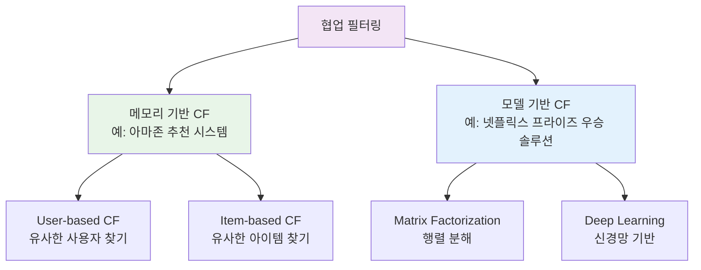
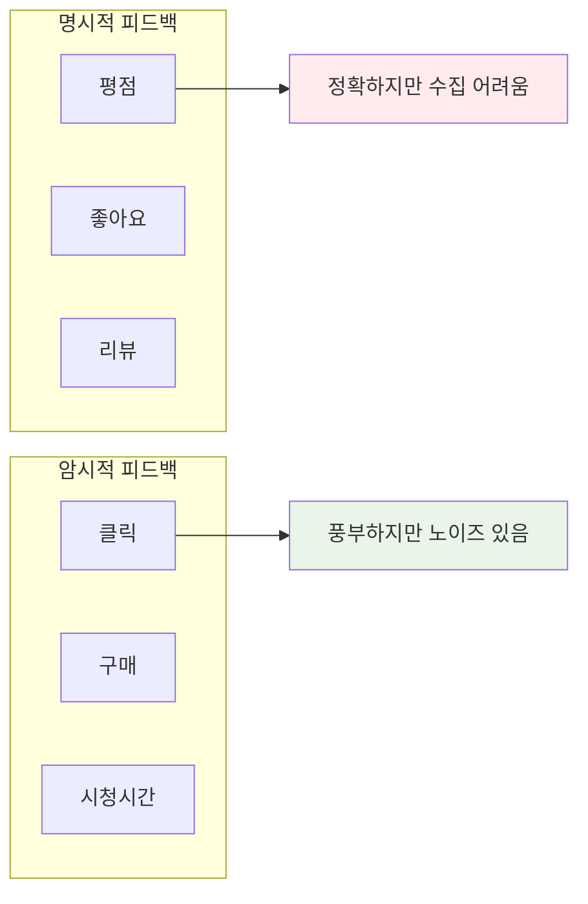
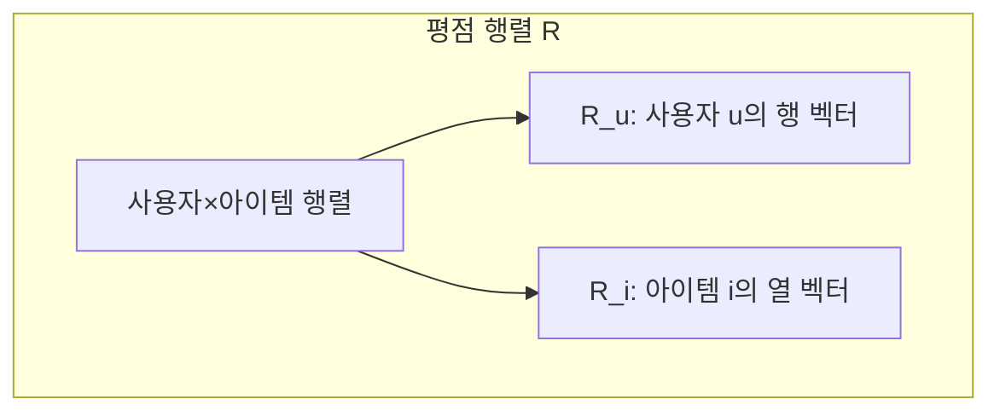
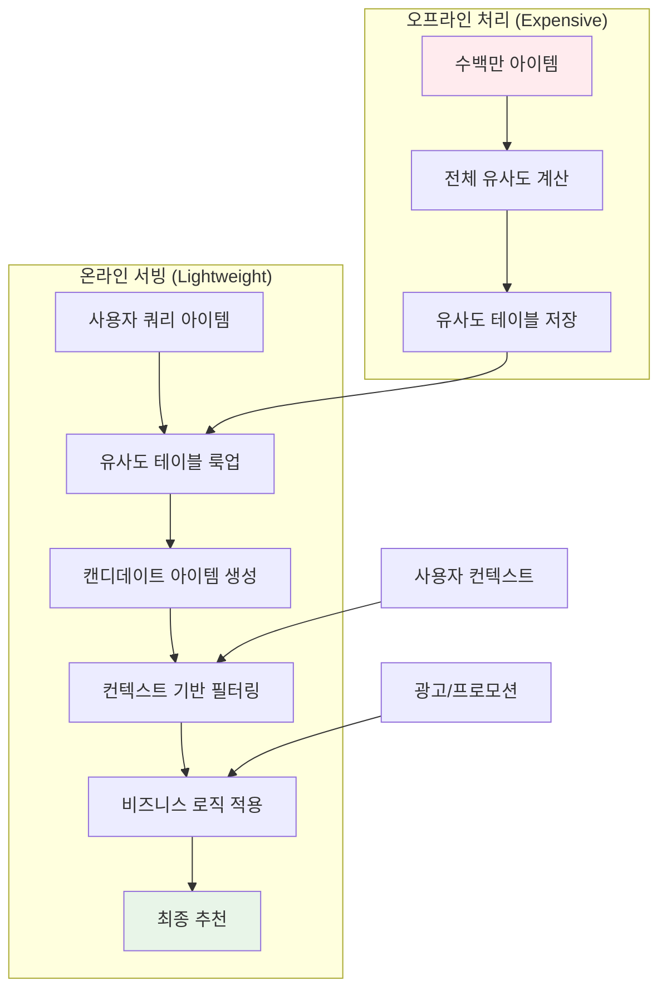

## 📦 사용하는 패키지/기술 버전 정보

- pandas==2.2.3
- numpy==2.3.3
- scikit-learn==1.6.1
- scipy==1.15.2
- matplotlib==3.10.1

## 🚀 TL;DR

- **협업 필터링(Collaborative Filtering)** 은 사용자들의 과거 상호작용 이력을 기반으로 선호도를 예측하는 추천 시스템의 핵심 기법
- 메모리 기반 CF는 **유사도 함수**(자카드, 코사인, 피어슨)를 활용하여 유사한 사용자나 아이템을 찾아 추천하는 방식
- **명시적 피드백**(평점)보다 **암시적 피드백**(클릭, 구매)이 수집이 쉽고 비즈니스 목표와 직접 연관되어 더 많이 활용
- Item-to-Item CF가 User-to-User CF보다 일반적으로 더 좋은 성능을 보이며, 아마존도 이를 활용
- 메모리 기반 CF는 **목적함수가 없는 휴리스틱 방법**이라 성능은 제한적이지만, 구현이 간단하고 해석이 쉬워 베이스라인으로 유용
- 협업의 효과는 사용자나 아이템의 상호작용 수가 많을수록 커지며, 데이터셋이 작을 때는 CF의 효과가 크지 않을 수 있음
- 실제 구현에서는 **zero-based 인덱싱**, **sparse matrix 활용**, **평점 정규화** 등의 테크닉이 중요

## 📓 실습 Jupyter Notebook

- w.i.p.

## 🎯 개인화된 예측: 왜 협업 필터링이 필요한가?

추천 시스템의 핵심은 **개인화된 예측(Personalized Prediction)** 을 수행하는 것이다. 이를 이해하기 위해, 먼저 전통적인 머신러닝 접근법이 왜 개인화에 실패하는지 살펴보자.

### 전통적 접근법의 근본적 문제

사용자와 아이템의 특성을 각각 $X_u$와 $X_i$로 표현하고, 선형 회귀로 평점을 예측한다고 가정해보자.

$$\hat{r}_{ui} = W_u^T X_u + W_i^T X_i + b$$

이 모델에서 사용자 $u$에게 가장 적합한 아이템을 찾으려면:

$$\arg\max_i f(u,i) = \arg\max_i (W_u^T X_u + W_i^T X_i) = \arg\max_i (W_i^T X_i)$$

여기서 중요한 문제가 발생한다. 사용자와 관련된 항 $W_u^T X_u$가 모든 아이템에 대해 상수가 되어 사라지면서, **모든 사용자에게 동일한 아이템을 추천하는 비개인화된(Non-Personalized) 추천**이 되어버린다.

물론 second-order interaction이나 더 복잡한 특성 조합을 고려할 수는 있지만, 이는 비효율적이며 어떤 상호작용이 효과적인지 미리 알 수도 없다. 최악의 경우에는 이러한 특성 자체가 존재하지 않을 수도 있다.

### 협업 필터링의 등장

협업 필터링(Collaborative Filtering, CF)은 이러한 문제를 해결하기 위해 **사용자와 아이템 간의 관계와 패턴을 발견하고 상호작용을 직접 모델링**한다.


핵심 아이디어는 매우 직관적이다.

- "X를 본 사용자가 Y도 보더라"
- "X를 구매한 사용자가 Y를 구매했더라"

이러한 직관을 바탕으로, 나와 비슷한 선호도를 가진 다른 사용자의 행동을 참조하여 추천을 수행한다. 여러 사용자나 아이템 간의 **협력적인 정보 필터링**이 일어나기 때문에 "협업 필터링"이라고 부른다.

중요한 점은 **협업의 효과가 사용자나 아이템의 상호작용 수가 많을수록 커진다**는 것이다. 반대로 말하면, 데이터셋의 크기가 작을 때는 CF의 효과가 크지 않을 수 있다는 점을 유의해야 한다.

## 📊 협업 필터링의 분류 체계

협업 필터링은 전통적인 관점에서 두 가지 방식으로 분류된다.



두 방법 모두 사용자-아이템 상호작용을 입력으로 하지만, **메모리 기반**은 유사도를 중점적으로 활용하고, **모델 기반**은 파라미터를 학습하는 차이가 있다.

## 🔄 추천 시스템 모델링 패러다임

메모리 기반 CF를 추천 시스템의 일반적인 모델링 패러다임에 대입하면 다음과 같은 4단계 프로세스로 이해할 수 있다:


이 패러다임에서 메모리 기반 CF는 별도의 표현 학습 없이 원본 데이터의 행과 열을 그대로 사용자/아이템 표현으로 활용한다는 특징이 있다.

## 💡 피드백의 종류: 명시적 vs 암시적

추천 시스템은 사용자로부터 두 가지 형태의 피드백을 수집할 수 있다.

### 명시적 피드백 (Explicit Feedback)

사용자가 직접 선호도를 표현하는 방식이다:

- IMDB의 1-10점 영화 평점
- YouTube의 좋아요/싫어요
- 제품 리뷰의 별점

### 암시적 피드백 (Implicit Feedback)

사용자 행동에서 간접적으로 선호도를 추론하는 방식이다.

- 클릭, 조회, 구매 이력
- 체류 시간, 스크롤 깊이
- 재방문 횟수



### 왜 암시적 피드백이 대세가 되었는가?

최근 추천 시스템은 평점과 같은 명시적 피드백보다 **암시적 피드백을 주로 활용**하는 추세다. 그 이유를 구체적인 사례로 이해해보자.

#### 해리포터 예시: RMSE 최적화의 함정

OTT 서비스에서 "해리포터와 혼혈왕자"에 5점을 준 사용자를 생각해보자. RMSE를 최적화한 추천 시스템은 과거의 해리포터 시리즈, 즉 "해리포터와 마법사의 돌"을 4.5점으로 예측하여 추천할 수 있다. 평점 예측은 정확하지만, 이미 본 시리즈의 이전 편을 추천하는 것은 추천의 다양성이나 새로운 콘텐츠 발견 측면에서 사용자 만족도가 높지 않다.

#### 넷플릭스의 전략적 변화

이러한 이유로 **넷플릭스도 더 이상 5점 별점 시스템을 사용하지 않고**, 암시적 피드백 또는 Good/Bad의 이진 피드백을 수집하는 형태로 변경했다. 이는 다음과 같은 이점이 있다.

1. **수집이 쉽고 데이터가 풍부** - 사용자가 영상을 계속 클릭하지만 좋아요/싫어요는 잘 누르지 않는 경향
2. **비즈니스 목표와 직접 연관** - CTR, CVR, 매출 최적화에 직접적
3. **실제 행동 기반** - 사용자의 무의식적 행동이 진짜 선호도를 반영
4. **다음 클릭 예측에 적합** - 평점보다 클릭 예측이 추천 태스크에 더 적합

물론 명시적 피드백도 여전히 가치가 있다. 아마존이나 쿠팡 같은 커머스 업체들이 다양한 리뷰 프로모션 이벤트를 진행하여 사용자들의 별점 데이터를 수집하려 노력하는 것도 이 때문이다.

## 🧮 메모리 기반 협업 필터링 심화

메모리 기반 CF는 유사도를 계산하여 추천을 수행한다. 먼저 주요 표기법을 정리하자.

### 핵심 표기법 (Notation)

- $R$: 평점 행렬 (사용자 × 아이템)
- $r_{ui}$: 사용자 $u$가 아이템 $i$에 부여한 평점
- $R_u$: 사용자 $u$의 행 벡터 (사용자 $u$의 모든 평점)
- $R_i$: 아이템 $i$의 열 벡터 (아이템 $i$가 받은 모든 평점)
- $I_u$: 사용자 $u$가 평가한 아이템 집합
- $U_i$: 아이템 $i$를 평가한 사용자 집합
- $S$: 평점의 가능한 범위 (예: 1-5점, Like/Dislike)



### 유사도 함수 상세 분석

#### 1. 자카드 유사도 (Jaccard Similarity)

집합 간의 유사도를 측정하는 가장 직관적인 방법이다. 두 집합이 얼마나 많은 원소를 공유하는지를 측정한다.

$$sim_{Jaccard}(u, v) = \frac{|I_u \cap I_v|}{|I_u \cup I_v|}$$

```python
def jaccard_similarity(set1, set2):
    """자카드 유사도 계산"""
    intersection = set1 & set2  # 교집합
    union = set1 | set2         # 합집합
    
    if len(union) == 0:
        return 0.0
    
    return len(intersection) / len(union)

# 예시: 두 사용자가 평가한 영화 비교
user1_movies = {1, 2, 3, 4, 5}
user2_movies = {3, 4, 5, 6, 7}
similarity = jaccard_similarity(user1_movies, user2_movies)
print(f"자카드 유사도: {similarity:.3f}")  # 출력: 0.429
```

**특징**

- 집합의 크기에 무관하게 공통 원소의 비율만 고려
- 이진 데이터(있다/없다)에 적합
- 아웃라이어에 덜 민감

#### 2. 코사인 유사도 (Cosine Similarity)

벡터 간의 각도를 기반으로 방향성의 유사도를 측정한다. 두 벡터가 같은 방향을 가리킬수록 유사도가 높다.

$$sim_{Cosine}(u, v) = \frac{R_u \cdot R_v}{||R_u|| \times ||R_v||} = \frac{\sum_{i \in I_u \cap I_v} r_{ui} \cdot r_{vi}}{\sqrt{\sum_{i \in I_u} r_{ui}^2} \times \sqrt{\sum_{i \in I_v} r_{vi}^2}}$$

```python
import numpy as np

def cosine_similarity(vec1, vec2):
    """코사인 유사도 계산"""
    # 내적
    dot_product = np.dot(vec1, vec2)
    # 각 벡터의 norm
    norm1 = np.linalg.norm(vec1)
    norm2 = np.linalg.norm(vec2)
    
    if norm1 == 0 or norm2 == 0:
        return 0.0
    
    return dot_product / (norm1 * norm2)

# 예시: 두 사용자의 평점 벡터
user1_ratings = np.array([5, 3, 0, 0, 4, 0])
user2_ratings = np.array([4, 0, 0, 2, 5, 3])
similarity = cosine_similarity(user1_ratings, user2_ratings)
print(f"코사인 유사도: {similarity:.3f}")  # 출력: 0.677
```

**특징**

- 벡터의 크기보다 방향(패턴)에 집중
- 평점 스케일 차이에 강건함
- 고차원 데이터에 효과적
- 내적 연산이 필요하므로 차원이 동일해야 함

#### 3. 피어슨 유사도 (Pearson Similarity)

선형 상관관계를 측정하며, 사용자별 평점 편향을 자동으로 보정한다. 평균으로부터의 편차를 고려하여 계산한다.

$$sim_{Pearson}(u, v) = \frac{\sum_{i \in I_u \cap I_v} (r_{ui} - \bar{r}_u)(r_{vi} - \bar{r}_v)}{\sqrt{\sum_{i \in I_u \cap I_v} (r_{ui} - \bar{r}_u)^2} \times \sqrt{\sum_{i \in I_u \cap I_v} (r_{vi} - \bar{r}_v)^2}}$$

```python
def pearson_similarity(ratings1, ratings2):
    """피어슨 상관계수 계산"""
    # 공통으로 평가한 아이템만 추출
    common_items = [(r1, r2) for r1, r2 in zip(ratings1, ratings2) 
                    if r1 > 0 and r2 > 0]
    
    if len(common_items) == 0:
        return 0.0
    
    r1_common = [r[0] for r in common_items]
    r2_common = [r[1] for r in common_items]
    
    # 평균 계산
    mean1 = np.mean(r1_common)
    mean2 = np.mean(r2_common)
    
    # 편차 계산
    dev1 = r1_common - mean1
    dev2 = r2_common - mean2
    
    # 상관계수 계산
    numerator = np.sum(dev1 * dev2)
    denominator = np.sqrt(np.sum(dev1**2)) * np.sqrt(np.sum(dev2**2))
    
    if denominator == 0:
        return 0.0
    
    return numerator / denominator
```

**특징**

- 사용자별 평점 스케일 차이 자동 보정
- 평균 대비 상대적 선호도 파악
- 명시적 피드백(평점)에 적합
- 벡터의 정규화 과정이 포함됨
- 최근에는 거의 사용되지 않는 추세

### 유사도 함수 선택 가이드

유사도 함수 선택은 본질적으로 휴리스틱한 작업이며, 문제 상황에 따라 최적의 선택이 달라진다.

|상황|추천 유사도|이유|
|---|---|---|
|아웃라이어가 많은 경우|자카드|집합 기반으로 극단값에 덜 민감|
|암시적 피드백|자카드, 코사인|이진 데이터나 빈도 데이터에 적합|
|명시적 피드백 (평점)|피어슨, 코사인|평점 값의 크기를 고려|
|고차원 희소 데이터|코사인|희소 벡터에서 효율적|
|사용자별 평점 편향이 큰 경우|피어슨|자동 정규화 효과|

불확실한 경우, 여러 유사도 함수를 모두 시도해보고 비교하는 것이 바람직하다. **메모리 기반 CF는 목적함수가 없어** 어떤 유사도가 최적인지 이론적으로 결정할 수 없기 때문이다.

### 평점 예측 공식

유사도를 바탕으로 평점을 예측하는 공식은 가중 평균을 사용한다.

#### Item-based 평점 예측

아이템 $i$와 유사한 다른 아이템들에 사용자가 부여한 평점을 참조한다.

$$\hat{r}_{ui} = \frac{\sum_{j \in I_u, j \neq i} sim(i, j) \cdot r_{uj}}{\sum_{j \in I_u, j \neq i} |sim(i, j)|}$$

#### User-based 평점 예측

사용자 $u$와 유사한 다른 사용자들이 해당 아이템에 부여한 평점을 참조한다.

$$\hat{r}_{ui} = \frac{\sum_{v \in U_i, v \neq u} sim(u, v) \cdot r_{vi}}{\sum_{v \in U_i, v \neq u} |sim(u, v)|}$$

일반적으로 **Item-to-Item 방법이 User-to-User보다 더 좋은 성능**을 보인다고 알려져 있다.

### 평점 정규화 기법

사용자마다 평점 기준이 다른 문제를 해결하기 위한 정규화 방법들이다. 예를 들어, 관대한 사용자는 대부분 4-5점을 주고, 까다로운 사용자는 1-2점을 주는 경향이 있다.

#### Mean-Centering

$$r'_{ui} = r_{ui} - \bar{r}_u$$

사용자의 평균 평점을 빼서 정규화한다.

#### Z-Score Normalization

$$r'_{ui} = \frac{r_{ui} - \bar{r}_u}{\sigma_u}$$

평균과 표준편차를 모두 고려하여 정규화한다.

#### 정규화를 적용한 최종 예측 공식

편향(deviation)을 고려한 Item-based 예측:

$$\hat{r}_{ui} = \bar{r}_u + \frac{\sum_{j \in I_u} sim(i, j) \cdot (r_{uj} - \bar{r}_u)}{\sum_{j \in I_u} |sim(i, j)|}$$

User-based도 유사하게 적용할 수 있다:

$$\hat{r}_{ui} = \bar{r}_u + \frac{\sum_{v \in U_i} sim(u, v) \cdot (r_{vi} - \bar{r}_v)}{\sum_{v \in U_i} |sim(u, v)|}$$

## 💻 실전 구현: MovieLens 데이터셋 활용

이제 실제 MovieLens 데이터셋을 사용하여 메모리 기반 CF를 구현해보자. 실습에서는 609명의 사용자와 7,363개의 영화, 총 61,716개의 평점을 다룬다.

### 1. 환경 설정 및 데이터 준비

Google Colab 환경에서 실습을 진행한다.

```python
import pandas as pd
import numpy as np
from scipy.sparse import csr_matrix
from sklearn.metrics.pairwise import cosine_similarity
from collections import defaultdict

# 데이터 로드
ratings = pd.read_csv('ml-latest-small/ratings.csv')
movies = pd.read_csv('ml-latest-small/movies.csv')

# 데이터 정제
ratings.dropna(inplace=True)
movies['genres'].dropna(inplace=True)
ratings['rating'] = ratings['rating'].astype(float)
movies['genres'] = movies['genres'].str.split('|')

# 데이터 탐색
print(f"사용자 수: {ratings['userId'].nunique()}")  # 609명
print(f"영화 수: {ratings['movieId'].nunique()}")   # 7,363개
print(f"총 평점 수: {len(ratings)}")                # 61,716개
print(f"평점 범위: {ratings['rating'].min()}-{ratings['rating'].max()}")  # 0.5-5.0
print(f"평균 평점: {ratings['rating'].mean():.2f}")  # 3.50
```

### 2. 암시적 피드백으로 변환

실습에서는 **3점보다 큰** 평점만을 긍정적 피드백으로 간주한다.

```python
# 3점 초과를 긍정적 피드백으로 변환
sample_ratings = ratings[ratings['rating'] > 3.0].copy()
sample_ratings['rating'] = 1  # 이진 피드백으로 변환

# 컬럼명 표준화
sample_ratings.rename(columns={
    'userId': 'user_id',
    'movieId': 'item_id'
}, inplace=True)
```

### 3. Zero-based 인덱싱 (핵심 테크닉!)

추천 시스템에서 매우 중요한 전처리 단계다. 원본 ID를 0부터 시작하는 연속된 인덱스로 매핑한다.

```python
# 고유 사용자와 아이템 추출
unique_users = sample_ratings['user_id'].unique()
unique_items = sample_ratings['item_id'].unique()

# ID → Index 매핑 딕셔너리 생성
user_id2idx = {uid: idx for idx, uid in enumerate(unique_users)}
item_id2idx = {iid: idx for idx, iid in enumerate(unique_items)}

# 역매핑 (Index → ID)
user_idx2id = {idx: uid for uid, idx in user_id2idx.items()}
item_idx2id = {idx: iid for iid, idx in item_id2idx.items()}

# 데이터프레임에 인덱스 추가
sample_ratings['user_idx'] = sample_ratings['user_id'].map(user_id2idx)
sample_ratings['item_idx'] = sample_ratings['item_id'].map(item_id2idx)

# 편의를 위한 영화 제목 매핑
item2name = {}
for _, row in movies.iterrows():
    item2name[row['movieId']] = row['title']
```

### 4. Sparse Matrix 생성 및 데이터 구조 준비

```python
# CSR (Compressed Sparse Row) 매트릭스 생성
n_users = len(unique_users)
n_items = len(unique_items)

# 평점 값, (행 인덱스, 열 인덱스) 형태로 데이터 준비
data = sample_ratings['rating'].values
row_indices = sample_ratings['user_idx'].values
col_indices = sample_ratings['item_idx'].values

# Sparse matrix 생성
sparse_user_item = csr_matrix(
    (data, (row_indices, col_indices)),
    shape=(n_users, n_items),
    dtype=np.float32
)

print(f"Matrix shape: {sparse_user_item.shape}")  # (609, 7363)
print(f"저장된 원소: {sparse_user_item.nnz}")     # 61,716개

# 사용자별 아이템 이력 및 아이템별 사용자 이력 저장
user2items = defaultdict(set)
item2users = defaultdict(set)

for _, row in sample_ratings.iterrows():
    user = int(row['user_idx'])
    item = int(row['item_idx'])
    user2items[user].add(item)
    item2users[item].add(user)
```

### 5. Item-to-Item 추천 구현

```python
def item_to_item_recommendation(item_idx, top_k=10):
    """아이템 기반 추천 생성"""
    
    # 1. 자카드 유사도 기반 추천
    jaccard_scores = []
    query_users = item2users[item_idx]
    
    for other_item in range(n_items):
        if other_item == item_idx:
            continue
        
        other_users = item2users[other_item]
        
        # 자카드 유사도 계산
        intersection = query_users & other_users
        union = query_users | other_users
        
        if len(union) > 0:
            similarity = len(intersection) / len(union)
            jaccard_scores.append((similarity, other_item))
    
    # 상위 k개 선택
    jaccard_scores.sort(reverse=True)
    jaccard_top_k = jaccard_scores[:top_k]
    
    # 2. 코사인 유사도 기반 추천
    # 전체 아이템 간 코사인 유사도 행렬 계산
    item_item_cosine = cosine_similarity(sparse_user_item.T)
    
    # 해당 아이템의 유사도 벡터
    cosine_scores = item_item_cosine[item_idx]
    cosine_scores[item_idx] = -1  # 자기 자신 제외
    
    top_indices = np.argsort(cosine_scores)[-top_k:][::-1]
    cosine_top_k = [(cosine_scores[idx], idx) for idx in top_indices]
    
    return jaccard_top_k, cosine_top_k

# 결과를 보기 좋게 출력하는 헬퍼 함수
def display_titles(similarity_list):
    """인덱스를 영화 제목으로 변환하여 출력"""
    results = []
    for score, item_idx in similarity_list:
        item_id = item_idx2id[item_idx]
        title = item2name.get(item_id, "Unknown")
        results.append((title, score))
    return results

# 예시: Indiana Jones and the Temple of Doom (1984)에 대한 추천
query_item_idx = 112
query_item_id = item_idx2id[query_item_idx]
query_title = item2name.get(query_item_id)

print(f"쿼리 영화: {query_title}")
print("\n자카드 유사도 기반 추천:")
jaccard_recs, cosine_recs = item_to_item_recommendation(query_item_idx)
for title, score in display_titles(jaccard_recs)[:5]:
    print(f"  {title}: {score:.3f}")

print("\n코사인 유사도 기반 추천:")
for title, score in display_titles(cosine_recs)[:5]:
    print(f"  {title}: {score:.3f}")
```

### 6. User-to-User 추천 구현

```python
def user_to_user_recommendation(user_idx, top_k=10):
    """사용자 기반 추천 생성"""
    
    # 이미 본 영화 제외
    seen_items = user2items[user_idx]
    
    # 유사한 사용자 찾기 (코사인 유사도)
    user_user_cosine = cosine_similarity(sparse_user_item)
    user_similarities = user_user_cosine[user_idx]
    
    # 자기 자신 제외하고 가장 유사한 사용자들
    user_similarities[user_idx] = -1
    similar_users = np.argsort(user_similarities)[-20:][::-1]
    
    # 유사한 사용자들이 본 영화 중 추천
    item_scores = defaultdict(float)
    for similar_user in similar_users:
        similarity = user_similarities[similar_user]
        for item in user2items[similar_user]:
            if item not in seen_items:
                item_scores[item] += similarity
    
    # 상위 k개 추천
    recommendations = sorted(item_scores.items(), 
                           key=lambda x: x[1], 
                           reverse=True)[:top_k]
    
    return recommendations

# 예시: 사용자 1에 대한 추천
user_idx = 1
user_id = user_idx2id[user_idx]

print(f"사용자 {user_id}가 평가한 영화 (일부):")
seen_movies = list(user2items[user_idx])[:5]
for item_idx in seen_movies:
    item_id = item_idx2id[item_idx]
    title = item2name.get(item_id)
    print(f"  - {title}")

# 실제 강의에서 언급된 영화들:
# Tomboy, Gladiator, Good Will Hunting, Kill Bill 등

print("\n사용자 기반 추천:")
recommendations = user_to_user_recommendation(user_idx)
for item_idx, score in recommendations[:5]:
    item_id = item_idx2id[item_idx]
    title = item2name.get(item_id)
    print(f"  {title}: {score:.3f}")
```

## 🏭 아마존의 Item-to-Item CF 사례 분석

2003년 아마존은 약 2,900만 명의 사용자와 수백만 개의 아이템을 대상으로 대규모 시스템에 Item-to-Item CF를 적용한 사례를 발표했다.

### 아마존 시스템의 아키텍처



### 핵심 전략

**오프라인 처리**

- 수백만 개 아이템 간 유사도를 미리 계산 (비용이 큰 연산)
- Co-purchase 패턴 기반 자카드/코사인 유사도 활용
- 주기적으로 업데이트

**온라인 서빙**

- 단순한 테이블 조회만 수행 (빠른 응답)
- 실시간 컨텍스트 반영
- 다양한 후처리 적용

**후처리 과정**

- 고객의 현재 컨텍스트 및 이전 관심 분야 고려
- 이미 조회/구매한 아이템 필터링
- 광고 및 프로모션 아이템 스코어 조정

### 추천 슬레이트 구성 분석

실제 아마존 제품 페이지에서 볼 수 있는 추천 섹션들

1. **"Related to items you've viewed"** - Item-to-Item CF
2. **"Customers who viewed this item also viewed"** - User-based CF (행동 기반)
3. **"Frequently bought together"** - Item-based CF (Co-purchase)
4. **"Sponsored products"** - 개인화 광고
5. **"More items to explore"** - 콘텐츠 기반 또는 탐색적 추천

### 2017년 업데이트: Temporal Factors

최근 논문에서는 다음과 같은 시간적 요소들을 추가로 고려한다.

- **최신성(Recency)**: 최근 출시된 상품 우선
- **주기성(Periodicity)**: 계절 상품, 주기적 구매 패턴
- **트렌드(Trend)**: 인기 급상승 상품
- **다양한 신호**: 조회, 구매, 장바구니, 위시리스트 등

아마존의 사례는 단순한 메모리 기반 CF도 적절한 엔지니어링과 최적화를 통해 대규모 시스템에서 효과적으로 작동할 수 있음을 보여준다.

## 🚀 성능 개선 전략

메모리 기반 CF의 성능을 개선하는 실용적인 방법들을 살펴보자.

### 1. 앙상블 방법

여러 유사도 방법의 결과를 결합하여 더 강건한 추천을 생성한다.

```python
def ensemble_recommendations(user_idx, methods=['jaccard', 'cosine', 'pearson']):
    """여러 유사도 방법을 앙상블"""
    
    all_scores = defaultdict(float)
    
    # 각 방법별 가중치 설정
    weights = {
        'jaccard': 0.3,
        'cosine': 0.5,
        'pearson': 0.2
    }
    
    for method in methods:
        recommendations = get_recommendations(user_idx, method)
        
        for item, score in recommendations:
            all_scores[item] += weights[method] * score
    
    # 최종 추천
    final_recs = sorted(all_scores.items(), 
                       key=lambda x: x[1], 
                       reverse=True)
    
    return final_recs
```

### 2. 다중 기준 아이템 활용

하나의 기준 아이템이 아닌 여러 개를 활용하여 다양성을 확보한다.

```python
def multi_anchor_recommendation(user_idx, n_anchors=3):
    """여러 기준 아이템을 활용한 추천"""
    
    # 사용자의 최근 n개 아이템을 기준으로
    recent_items = get_recent_items(user_idx, n_anchors)
    
    all_recommendations = defaultdict(float)
    
    for i, anchor_item in enumerate(recent_items):
        recs = item_to_item_recommendation(anchor_item)
        
        # 최신 아이템에 더 큰 가중치
        time_weight = 1.0 / (i + 1)  
        
        for item, score in recs:
            all_recommendations[item] += score * time_weight
    
    return sorted(all_recommendations.items(), 
                 key=lambda x: x[1], 
                 reverse=True)
```

### 3. 하이브리드 접근

협업 필터링과 콘텐츠 기반 필터링을 결합하여 Cold Start 문제를 완화한다.

```python
def hybrid_recommendation(user_idx, alpha=0.7):
    """CF와 콘텐츠 기반 추천의 하이브리드"""
    
    # 협업 필터링 점수
    cf_scores = collaborative_filtering_scores(user_idx)
    
    # 콘텐츠 기반 점수 (장르, 태그 등 활용)
    content_scores = content_based_scores(user_idx)
    
    # 가중 결합
    final_scores = {}
    all_items = set(cf_scores.keys()) | set(content_scores.keys())
    
    for item in all_items:
        cf_score = cf_scores.get(item, 0)
        content_score = content_scores.get(item, 0)
        final_scores[item] = alpha * cf_score + (1 - alpha) * content_score
    
    return sorted(final_scores.items(), 
                 key=lambda x: x[1], 
                 reverse=True)
```

### 4. 유사도 함수 비교 전략

상황에 맞는 유사도 함수를 선택하는 것이 중요하다.

- **자카드 + 코사인 앙상블**: 암시적 피드백에 효과적
- **평점 데이터**: 피어슨 유사도로 사용자 편향 보정
- **실시간 서비스**: 계산이 빠른 자카드 우선
- **정확도 중시**: 여러 유사도 앙상블

## 📈 메모리 기반 CF의 장단점 총정리

### 장점

- **구현이 간단하고 직관적** - 유사도 개념이 이해하기 쉬움
- **해석 가능성** - 왜 추천되었는지 설명 가능 ("비슷한 사용자가 좋아함")
- **새 사용자/아이템 추가 용이** - 재학습 없이 즉시 반영
- **좋은 베이스라인** - 다른 복잡한 모델과 비교 기준
- **실시간 업데이트 가능** - 새로운 상호작용 즉시 반영

### 단점

- **확장성 문제** - O(n²) 복잡도로 대규모 시스템에 부담
- **희소성 문제** - 공통 평가 아이템이 적으면 유사도 계산 어려움
- **Cold Start** - 새 사용자/아이템에 대한 추천 불가
- **목적함수 부재** - 휴리스틱 방법으로 최적화 한계
- **데이터 크기 의존성** - 충분한 상호작용 데이터가 필요

### 언제 사용해야 하는가?

**메모리 기반 CF가 적합한 경우**

- 빠른 프로토타이핑이 필요한 경우
- 추천 이유를 설명해야 하는 경우
- 데이터셋이 중간 규모인 경우
- 실시간 업데이트가 중요한 경우

**메모리 기반 CF가 부적합한 경우**

- 매우 대규모 데이터셋 (수백만 × 수백만)
- 극도로 희소한 데이터
- Cold Start 문제가 심각한 경우
- 최고 수준의 정확도가 필요한 경우

## 🎯 결론

협업 필터링은 추천 시스템의 가장 기본적이면서도 중요한 기법이다. 특히 메모리 기반 CF는,

1. **개인화 추천의 핵심 원리**를 이해하는 데 필수적이다
2. **실무에서 빠른 프로토타이핑**과 베이스라인으로 유용하다
3. **대규모 서비스**에서도 적절한 최적화로 활용 가능하다 (아마존 사례)

메모리 기반 CF는 목적함수가 없는 휴리스틱 방법이라는 한계가 있지만, 그 단순함과 해석 가능성 때문에 여전히 중요한 위치를 차지한다. 데이터셋의 크기가 충분하다면 협업 효과가 커지며, 적절한 유사도 함수 선택과 정규화 기법을 통해 성능을 크게 개선할 수 있다.

실제 서비스에서는 이를 기반으로 하되, 모델 기반 방법이나 딥러닝 등 더 발전된 기법과 함께 앙상블하여 사용하는 것이 일반적이다. 넷플릭스가 평점 시스템을 바꾸고, 아마존이 지속적으로 시스템을 개선하는 것처럼, 추천 시스템은 비즈니스 목표와 사용자 행동 변화에 맞춰 계속 진화하고 있다.

다음 단계로는 Matrix Factorization, Deep Learning 기반 추천 등 모델 기반 CF를 학습하여 더욱 정교한 추천 시스템을 구축할 수 있다. 하지만 그 복잡한 모델들도 결국 이 기본적인 협업 필터링의 원리 - "비슷한 사용자는 비슷한 아이템을 좋아한다" - 위에 구축된다는 점을 기억해야 한다.