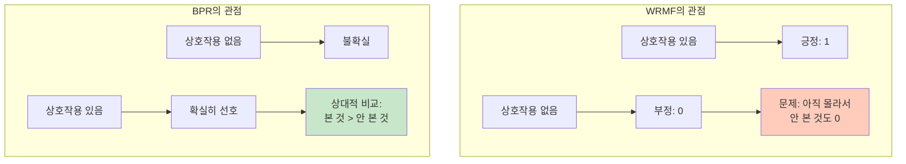
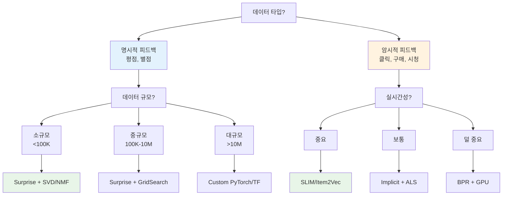

## 📦 사용하는 Python 패키지/버전 정보

- numpy==1.26.4
- pandas==2.2.3
- scikit-learn==1.6.1
- torch==2.6.0
- surprise (추천 시스템 전용 라이브러리)
- implicit (암시적 피드백 처리 라이브러리)
- matplotlib==3.10.1
- scipy==1.15.2

## 🚀 TL;DR

- **모델 기반 협업 필터링**은 메모리 기반 방식의 확장성 문제를 해결하고 더 나은 성능을 제공하는 추천 시스템 접근법이다
- **Matrix Factorization (MF)**은 사용자-아이템 행렬을 저차원 잠재 요인으로 분해하여 숨겨진 패턴을 발견한다
- **WRMF**는 암시적 피드백에서 preference와 confidence를 분리하여 처리하는 혁신적 방법이다
- **BPR (Bayesian Personalized Ranking)**은 암시적 피드백에서 사용자 선호도 순위를 직접 학습한다
- **SLIM**과 같은 User-free 모델은 새로운 사용자에 대한 콜드 스타트 문제를 효과적으로 해결한다
- 시간 기반 데이터 분할과 Leave-One-Last 평가는 실제 서비스 환경을 반영한 평가 방법이다
- 명시적 피드백에는 **Surprise**, 암시적 피드백에는 **Implicit** 라이브러리가 최적화되어 있다

## 📓 실습 Jupyter Notebook

- [모델 기반 협업 필터링 실습 노트북](https://github.com/username/recommender-system-tutorial/blob/main/model_based_cf.ipynb)

## 🔄 협업 필터링의 진화: 메모리 기반에서 모델 기반으로

추천 시스템의 역사를 이해하면 왜 모델 기반 방식이 등장했는지 명확해집니다. 초기의 메모리 기반 협업 필터링은 직관적이었지만, 실제 서비스에서는 치명적인 한계를 보였습니다.

### 메모리 기반 CF의 세 가지 근본적 한계

**1. 확장성(Scalability) 문제**

Netflix나 Amazon 같은 서비스를 생각해보세요. 수백만 사용자와 수십만 아이템이 있을 때, 각 추천마다 모든 유사도를 계산한다면 어떻게 될까요?

```python
# 메모리 기반 CF의 계산 복잡도 예시
n_users = 1_000_000
n_items = 100_000

# 유사도 계산 복잡도
user_similarity_computations = n_users * (n_users - 1) / 2  # O(n²)
print(f"유사도 계산 횟수: {user_similarity_computations:,.0f}")
# 출력: 유사도 계산 횟수: 499,999,500,000

# 각 계산이 0.001ms라고 해도...
time_hours = user_similarity_computations * 0.001 / 1000 / 3600
print(f"예상 시간: {time_hours:,.1f} 시간")
# 출력: 예상 시간: 138.9 시간
```

**2. 희소성(Sparsity) 문제**

대부분의 사용자는 전체 아이템의 1% 미만만 평가합니다. 이는 유사도 계산을 거의 불가능하게 만듭니다.

```python
# 실제 데이터의 희소성
total_possible_interactions = n_users * n_items
actual_interactions = n_users * 20  # 평균 20개 아이템 평가
sparsity = 1 - (actual_interactions / total_possible_interactions)
print(f"희소성: {sparsity:.4%}")
# 출력: 희소성: 99.98%
```

**3. 휴리스틱 방법의 한계**

메모리 기반 CF는 "비슷한 사람은 비슷한 것을 좋아한다"는 직관에 의존합니다. 하지만 이것을 어떻게 최적화할까요? 목적 함수가 없다는 것은 개선 방향을 모른다는 의미입니다.

### 모델 기반 CF: 패러다임의 전환

모델 기반 CF는 이 문제들을 근본적으로 다르게 접근합니다:

```mermaid
graph TB
    subgraph "메모리 기반 접근"
        A[원시 데이터] --> B[유사도 계산<br/>O(n²)]
        B --> C[예측 시마다<br/>전체 탐색]
        C --> D[느린 응답]
    end
    
    subgraph "모델 기반 접근"
        E[원시 데이터] --> F[오프라인 학습<br/>O(k×iterations)]
        F --> G[컴팩트한 모델<br/>k차원 벡터]
        G --> H[빠른 예측<br/>O(k)]
    end
    
    style D fill:#ffccbc
    style H fill:#c8e6c9
```

이제 각 방법의 특징을 자세히 살펴보겠습니다.

## 🎯 Matrix Factorization: 차원 축소의 마법

### 행렬 분해의 직관적 이해

영화 추천을 예로 들어 Matrix Factorization이 어떻게 작동하는지 단계적으로 이해해봅시다.

먼저 우리가 가진 데이터는 거대하고 희소한 평점 행렬입니다:

```python
import numpy as np
import pandas as pd

# 실제 평점 행렬 예시 (7명 사용자, 6개 영화)
movies = ['네로', '율리우스 시저', '해리 만나 샐리', '노팅힐', '타이타닉', '러브 액츄얼리']
users = ['사용자1', '사용자2', '사용자3', '사용자4', '사용자5', '사용자6', '사용자7']

R = np.array([
    [5, 4, 0, 1, 0, 0],  # 사용자1: 역사물 좋아함
    [4, 5, 0, 0, 1, 0],  # 사용자2: 역사물 좋아함
    [0, 4, 5, 0, 0, 1],  # 사용자3: 역사물 좋아함
    [3, 3, 0, 3, 3, 0],  # 사용자4: 모두 좋아함
    [1, 0, 4, 5, 0, 0],  # 사용자5: 로맨스 좋아함
    [0, 1, 0, 4, 5, 0],  # 사용자6: 로맨스 좋아함
    [0, 0, 1, 0, 4, 5],  # 사용자7: 로맨스 좋아함
])

df_ratings = pd.DataFrame(R, index=users, columns=movies)
print("원본 평점 행렬:")
print(df_ratings)
```

MF는 이 행렬을 두 개의 작은 행렬로 분해합니다. 놀라운 점은 **장르 정보를 전혀 제공하지 않았는데도** 패턴을 발견한다는 것입니다:

```python
# MF 적용 후 발견된 잠재 요인
# k=2로 설정 (2개의 잠재 요인)

# 사용자 행렬 P (7×2)
# 각 행은 [역사 선호도, 로맨스 선호도]를 나타냄
P = np.array([
    [0.9, 0.1],  # 사용자1: 역사 강하게 선호
    [0.8, 0.2],  # 사용자2: 역사 선호
    [0.7, 0.3],  # 사용자3: 역사 선호
    [0.5, 0.5],  # 사용자4: 균형
    [0.2, 0.8],  # 사용자5: 로맨스 선호
    [0.1, 0.9],  # 사용자6: 로맨스 강하게 선호
    [0.0, 1.0],  # 사용자7: 로맨스만 선호
])

# 아이템 행렬 Q (2×6)
# 각 열은 영화의 [역사 정도, 로맨스 정도]
Q = np.array([
    [5, 4, 3, 1, 0, 0],  # 역사 특성
    [0, 1, 2, 4, 5, 5],  # 로맨스 특성
])

# 복원된 행렬
R_pred = P @ Q
print("\n복원된 평점 행렬:")
print(pd.DataFrame(R_pred.round(1), index=users, columns=movies))

# 빈 칸이 채워진 것을 확인!
```

### SGD vs ALS: 두 가지 학습 방법의 차이

Matrix Factorization을 학습하는 두 가지 주요 방법이 있습니다. 각각의 장단점을 이해하면 상황에 맞는 선택을 할 수 있습니다.

#### 1. Stochastic Gradient Descent (SGD)

SGD는 각 관측값에 대해 점진적으로 파라미터를 업데이트합니다:

```python
def matrix_factorization_sgd(R, k, steps=5000, alpha=0.002, beta=0.02):
    """
    SGD를 이용한 Matrix Factorization
    
    목적 함수: minimize Σ(r_ui - p_u·q_i)² + λ(||p_u||² + ||q_i||²)
    
    Parameters:
    - R: 평점 행렬 (m×n)
    - k: 잠재 요인 수
    - steps: 학습 반복 횟수
    - alpha: 학습률 (너무 크면 발산, 너무 작으면 느린 수렴)
    - beta: L2 정규화 계수 (과적합 방지)
    """
    m, n = R.shape
    
    # 랜덤 초기화 (작은 값으로 시작)
    P = np.random.normal(scale=1./k, size=(m, k))
    Q = np.random.normal(scale=1./k, size=(k, n))
    
    # 바이어스 항 (글로벌 평균, 사용자 편향, 아이템 편향)
    b = np.mean(R[R > 0])  # 전체 평균
    b_u = np.zeros(m)      # 사용자 바이어스
    b_i = np.zeros(n)      # 아이템 바이어스
    
    # 학습 과정
    samples = [(i, j, R[i,j]) for i in range(m) for j in range(n) if R[i,j] > 0]
    
    for step in range(steps):
        np.random.shuffle(samples)  # 순서 섞기 (더 나은 수렴)
        
        for i, j, r in samples:
            # 예측값 계산
            prediction = b + b_u[i] + b_i[j] + P[i,:] @ Q[:,j]
            
            # 오차 계산
            e = r - prediction
            
            # 그래디언트 기반 업데이트
            # ∂Loss/∂p_u = -2e·q_i + 2λp_u
            # ∂Loss/∂q_i = -2e·p_u + 2λq_i
            b_u[i] += alpha * (e - beta * b_u[i])
            b_i[j] += alpha * (e - beta * b_i[j])
            P[i,:] += alpha * (e * Q[:,j] - beta * P[i,:])
            Q[:,j] += alpha * (e * P[i,:] - beta * Q[:,j])
            
        # 수렴 확인 (선택적)
        if step % 100 == 0:
            loss = 0
            for i, j, r in samples:
                pred = b + b_u[i] + b_i[j] + P[i,:] @ Q[:,j]
                loss += (r - pred)**2
            print(f"Step {step}, Loss: {loss:.4f}")
    
    return P, Q, b, b_u, b_i
```

#### 2. Alternating Least Squares (ALS)

ALS는 한 번에 한 행렬을 고정하고 다른 행렬을 최적화합니다:

```python
def matrix_factorization_als(R, k, iterations=10, lambda_reg=0.01):
    """
    ALS를 이용한 Matrix Factorization
    
    핵심 아이디어: P를 고정하면 Q 최적화는 least squares 문제
                  Q를 고정하면 P 최적화는 least squares 문제
    
    장점:
    - Closed-form 해가 존재 (빠른 수렴)
    - 희소 데이터에 강건
    - 병렬 처리 가능
    """
    m, n = R.shape
    
    # 초기화
    P = np.random.normal(size=(m, k))
    Q = np.random.normal(size=(k, n))
    
    # 관측된 인덱스
    R_indices = [(i, j) for i in range(m) for j in range(n) if R[i,j] > 0]
    
    for iteration in range(iterations):
        # Step 1: P 고정, Q 최적화
        # 각 아이템 j에 대해: q_j = (P_j^T P_j + λI)^(-1) P_j^T r_j
        for j in range(n):
            # j번째 아이템을 평가한 사용자들
            users_j = [i for i in range(m) if R[i,j] > 0]
            if not users_j:
                continue
                
            P_j = P[users_j, :]  # 해당 사용자들의 벡터
            r_j = R[users_j, j]  # 해당 평점들
            
            # Closed-form 해
            A = P_j.T @ P_j + lambda_reg * np.eye(k)
            b = P_j.T @ r_j
            Q[:, j] = np.linalg.solve(A, b)
        
        # Step 2: Q 고정, P 최적화
        # 각 사용자 i에 대해: p_i = (Q_i Q_i^T + λI)^(-1) Q_i r_i^T
        for i in range(m):
            # i번째 사용자가 평가한 아이템들
            items_i = [j for j in range(n) if R[i,j] > 0]
            if not items_i:
                continue
                
            Q_i = Q[:, items_i]  # 해당 아이템들의 벡터
            r_i = R[i, items_i]  # 해당 평점들
            
            # Closed-form 해
            A = Q_i @ Q_i.T + lambda_reg * np.eye(k)
            b = Q_i @ r_i
            P[i, :] = np.linalg.solve(A, b)
        
        # 손실 계산
        loss = 0
        for i, j in R_indices:
            loss += (R[i,j] - P[i,:] @ Q[:,j])**2
        loss += lambda_reg * (np.sum(P**2) + np.sum(Q**2))
        print(f"Iteration {iteration}, Loss: {loss:.4f}")
    
    return P, Q
```

두 방법의 비교:

|특성|SGD|ALS|
|---|---|---|
|수렴 속도|느림|빠름|
|메모리 사용|적음|많음|
|병렬화|어려움|쉬움|
|희소 데이터|보통|강건|
|대규모 데이터|적합|메모리 제한|

## 🎯 WRMF: 암시적 피드백의 정교한 처리

암시적 피드백 데이터는 특별한 처리가 필요합니다. WRMF(Weighted Regularized Matrix Factorization)는 이를 위한 혁신적인 방법입니다.

### Preference vs Confidence: 핵심 개념의 분리

WRMF의 핵심 통찰은 **"사용자가 아이템을 좋아하는지"(preference)와 "그 판단을 얼마나 확신하는지"(confidence)를 분리**하는 것입니다:

```python
def compute_preference_and_confidence(R, alpha=40, epsilon=1e-8):
    """
    WRMF의 핵심: Preference와 Confidence 분리
    
    Preference p_ui:
    - 1 if r_ui > 0 (상호작용 있음 = 선호)
    - 0 if r_ui = 0 (상호작용 없음 = 비선호...일수도?)
    
    Confidence c_ui:
    - 상호작용이 많을수록 더 확신
    - c_ui = 1 + alpha * r_ui
    
    Parameters:
    - R: 상호작용 행렬 (구매 횟수, 시청 시간 등)
    - alpha: confidence 증가율
    """
    # Preference: 이진 값
    P = (R > 0).astype(float)
    
    # Confidence: 가중치
    # 방법 1: 선형 증가
    C = 1 + alpha * R
    
    # 방법 2: 로그 스케일 (대안)
    # C = 1 + alpha * np.log(1 + R/epsilon)
    
    return P, C

# 예시
R_implicit = np.array([
    [0, 5, 0, 1, 0],  # 사용자1: 아이템2를 5번, 아이템4를 1번 구매
    [3, 0, 0, 0, 2],  # 사용자2: 아이템1을 3번, 아이템5를 2번 구매
    [0, 0, 0, 4, 0],  # 사용자3: 아이템4를 4번 구매
])

P, C = compute_preference_and_confidence(R_implicit, alpha=40)

print("Preference 행렬 (선호 여부):")
print(P)
print("\nConfidence 행렬 (확신도):")
print(C)
```

### WRMF의 목적 함수

WRMF는 confidence를 가중치로 사용하여 최적화합니다:

```python
def wrmf_loss(P, C, X, Y, lambda_reg=0.01):
    """
    WRMF 목적 함수
    
    minimize: Σ c_ui (p_ui - x_u^T y_i)² + λ(Σ ||x_u||² + Σ ||y_i||²)
    
    여기서:
    - c_ui가 높은 항목(자주 구매한 아이템)에 더 큰 가중치
    - c_ui가 낮은 항목(미관측)에도 작은 가중치 (0이 아님!)
    """
    m, n = P.shape
    loss = 0
    
    # 가중 제곱 오차
    for u in range(m):
        for i in range(n):
            prediction = X[u] @ Y[i]
            loss += C[u, i] * (P[u, i] - prediction) ** 2
    
    # L2 정규화
    loss += lambda_reg * (np.sum(X**2) + np.sum(Y**2))
    
    return loss
```

### WRMF의 실제 구현

```python
class WRMF:
    """Weighted Regularized Matrix Factorization"""
    
    def __init__(self, n_factors=100, alpha=40, lambda_reg=0.01, iterations=15):
        self.n_factors = n_factors
        self.alpha = alpha
        self.lambda_reg = lambda_reg
        self.iterations = iterations
    
    def fit(self, R):
        """
        ALS를 사용한 WRMF 학습
        """
        m, n = R.shape
        
        # Preference와 Confidence 계산
        self.P = (R > 0).astype(float)
        self.C = 1 + self.alpha * R
        
        # 초기화
        self.X = np.random.normal(size=(m, self.n_factors)) * 0.01
        self.Y = np.random.normal(size=(n, self.n_factors)) * 0.01
        
        # ALS 반복
        for iteration in range(self.iterations):
            # 사용자 벡터 업데이트
            for u in range(m):
                # C^u: u번째 사용자의 confidence 대각 행렬
                Cu = np.diag(self.C[u])
                
                # x_u = (Y^T C^u Y + λI)^(-1) Y^T C^u p_u
                YT_Cu_Y = self.Y.T @ Cu @ self.Y
                YT_Cu_pu = self.Y.T @ Cu @ self.P[u]
                
                self.X[u] = np.linalg.solve(
                    YT_Cu_Y + self.lambda_reg * np.eye(self.n_factors),
                    YT_Cu_pu
                )
            
            # 아이템 벡터 업데이트
            for i in range(n):
                # C^i: i번째 아이템의 confidence 대각 행렬
                Ci = np.diag(self.C[:, i])
                
                # y_i = (X^T C^i X + λI)^(-1) X^T C^i p_i
                XT_Ci_X = self.X.T @ Ci @ self.X
                XT_Ci_pi = self.X.T @ Ci @ self.P[:, i]
                
                self.Y[i] = np.linalg.solve(
                    XT_Ci_X + self.lambda_reg * np.eye(self.n_factors),
                    XT_Ci_pi
                )
            
            # 손실 계산
            loss = self._compute_loss()
            print(f"Iteration {iteration}: loss = {loss:.4f}")
    
    def predict(self, user_idx, n_items=10):
        """Top-N 추천"""
        scores = self.X[user_idx] @ self.Y.T
        top_items = np.argsort(scores)[::-1][:n_items]
        return top_items, scores[top_items]
```

## 🎲 BPR: 순위 학습의 혁명

### 암시적 피드백의 근본적 문제

WRMF가 confidence를 도입했지만, 여전히 문제가 있습니다. **관측되지 않은 항목을 모두 0(부정적)으로 처리**한다는 것입니다. BPR은 이를 다르게 접근합니다.



### BPR의 핵심: Pairwise Ranking

BPR은 절대적 점수가 아닌 **상대적 순위**를 학습합니다:

```python
class BPR:
    """Bayesian Personalized Ranking"""
    
    def __init__(self, n_factors=100, learning_rate=0.01, reg=0.01, n_epochs=10):
        self.n_factors = n_factors
        self.lr = learning_rate
        self.reg = reg
        self.n_epochs = n_epochs
    
    def fit(self, interactions):
        """
        BPR 학습
        
        interactions: (user, item) 튜플의 리스트
        """
        # 사용자별 상호작용 아이템 저장
        self.user_items = {}
        all_items = set()
        
        for user, item in interactions:
            if user not in self.user_items:
                self.user_items[user] = set()
            self.user_items[user].add(item)
            all_items.add(item)
        
        self.all_items = list(all_items)
        n_users = len(self.user_items)
        n_items = len(all_items)
        
        # 파라미터 초기화
        self.W = np.random.normal(size=(n_users, self.n_factors)) * 0.01
        self.H = np.random.normal(size=(n_items, self.n_factors)) * 0.01
        
        # 학습
        for epoch in range(self.n_epochs):
            loss = 0
            n_samples = 0
            
            # 각 사용자에 대해
            for u, items_u in self.user_items.items():
                # 긍정 아이템 샘플링
                for i in items_u:
                    # 부정 아이템 샘플링 (사용자가 상호작용하지 않은 아이템)
                    j = self._sample_negative_item(u)
                    
                    # 선호도 차이 계산
                    x_ui = self.W[u] @ self.H[i]
                    x_uj = self.W[u] @ self.H[j]
                    x_uij = x_ui - x_uj
                    
                    # Sigmoid 함수
                    sigmoid = 1 / (1 + np.exp(-x_uij))
                    
                    # 그래디언트 계산 및 업데이트
                    # ∂L/∂θ = -(1-σ(x_uij)) * ∂x_uij/∂θ
                    grad_multiplier = 1 - sigmoid
                    
                    # 사용자 벡터 업데이트
                    self.W[u] += self.lr * (
                        grad_multiplier * (self.H[i] - self.H[j]) 
                        - self.reg * self.W[u]
                    )
                    
                    # 아이템 벡터 업데이트
                    self.H[i] += self.lr * (
                        grad_multiplier * self.W[u] 
                        - self.reg * self.H[i]
                    )
                    self.H[j] += self.lr * (
                        -grad_multiplier * self.W[u] 
                        - self.reg * self.H[j]
                    )
                    
                    # 손실 누적
                    loss += -np.log(sigmoid) + self.reg * (
                        np.sum(self.W[u]**2) + 
                        np.sum(self.H[i]**2) + 
                        np.sum(self.H[j]**2)
                    )
                    n_samples += 1
            
            avg_loss = loss / n_samples if n_samples > 0 else 0
            print(f"Epoch {epoch}: loss = {avg_loss:.4f}")
    
    def _sample_negative_item(self, user):
        """사용자가 상호작용하지 않은 아이템 샘플링"""
        user_items = self.user_items[user]
        while True:
            j = np.random.choice(self.all_items)
            if j not in user_items:
                return j
    
    def predict(self, user, n_items=10):
        """Top-N 추천"""
        scores = self.W[user] @ self.H.T
        
        # 이미 본 아이템 제외
        seen_items = self.user_items.get(user, set())
        scores_with_idx = [(score, idx) for idx, score in enumerate(scores) 
                          if idx not in seen_items]
        scores_with_idx.sort(reverse=True)
        
        top_items = [idx for score, idx in scores_with_idx[:n_items]]
        top_scores = [score for score, idx in scores_with_idx[:n_items]]
        
        return top_items, top_scores
```

### Negative Sampling 전략

BPR의 성능은 부정 샘플링 전략에 크게 영향을 받습니다:

```python
def advanced_negative_sampling(user_items, all_items, strategy='uniform'):
    """
    다양한 부정 샘플링 전략
    
    strategy:
    - 'uniform': 균등 샘플링 (기본)
    - 'popularity': 인기도 기반 (인기 있는 아이템일수록 자주 샘플링)
    - 'hard': 어려운 부정 샘플 (점수가 높은 미관측 아이템)
    """
    if strategy == 'uniform':
        # 균등 샘플링
        negative_items = [i for i in all_items if i not in user_items]
        return np.random.choice(negative_items)
    
    elif strategy == 'popularity':
        # 인기도 기반 샘플링
        item_popularity = compute_item_popularity()  # 사전 계산된 인기도
        negative_items = [i for i in all_items if i not in user_items]
        probs = [item_popularity[i] for i in negative_items]
        probs = np.array(probs) / np.sum(probs)
        return np.random.choice(negative_items, p=probs)
    
    elif strategy == 'hard':
        # 어려운 부정 샘플 (현재 모델이 높은 점수를 주는 미관측 아이템)
        # 학습을 더 효과적으로 만들 수 있음
        negative_items = [i for i in all_items if i not in user_items]
        scores = [model.score(user, i) for i in negative_items]
        # 상위 20% 중에서 샘플링
        top_indices = np.argsort(scores)[-len(scores)//5:]
        return negative_items[np.random.choice(top_indices)]
```

## 🚫 User-free 모델: 실시간 추천의 해결책

### Cold Start Problem의 본질

협업 필터링의 Cold Start 문제를 CV(Computer Vision)와 비교하면 그 본질이 명확해집니다:

```python
# 이미지 분류 vs 추천 시스템의 차이

# 이미지 분류: Universal Features
class ImageClassifier:
    def predict(self, image):
        # 픽셀은 universal - 어떤 이미지든 같은 형태
        pixels = image.reshape(-1)  # [R, G, B, R, G, B, ...]
        features = self.extract_features(pixels)
        return self.classifier(features)

# 추천 시스템: Non-universal Features  
class RecommenderSystem:
    def predict(self, user_id):
        # user_id는 non-universal - 새 사용자는 처리 불가!
        if user_id not in self.user_embeddings:
            raise KeyError("Unknown user - need retraining!")
        user_embedding = self.user_embeddings[user_id]
        return self.compute_recommendations(user_embedding)
```

이 근본적인 차이가 Cold Start 문제를 만듭니다. User-free 모델은 이를 해결합니다.

### SLIM: 학습된 아이템 유사도

SLIM(Sparse LInear Method)은 아이템 간 유사도를 **학습**합니다:

```python
class SLIM:
    """
    Sparse Linear Method for Top-N Recommendations
    
    핵심: 메모리 기반 CF처럼 보이지만 유사도를 학습!
    """
    
    def __init__(self, l1_reg=0.001, l2_reg=0.0001):
        self.l1_reg = l1_reg
        self.l2_reg = l2_reg
    
    def fit(self, R):
        """
        목적 함수: minimize ||R - RW||² + λ₁||W||₁ + λ₂||W||²
        
        제약조건:
        1. W ≥ 0 (non-negativity)
        2. diag(W) = 0 (자기 자신 사용 금지)
        
        해석:
        - W[i,j]: 아이템 j가 아이템 i 예측에 기여하는 정도
        - L1 정규화: 희소성 (대부분 아이템과 무관)
        - L2 정규화: 과적합 방지
        """
        n_items = R.shape[1]
        self.W = np.zeros((n_items, n_items))
        
        # 각 아이템에 대해 독립적으로 최적화
        for j in range(n_items):
            # j번째 아이템 예측을 위한 가중치 학습
            
            # 목표: r_j ≈ R @ w_j (자기 자신 제외)
            target = R[:, j].copy()
            
            # Elastic Net 회귀 (L1 + L2 정규화)
            from sklearn.linear_model import ElasticNet
            
            # 자기 자신 제외한 다른 아이템들
            X = np.delete(R, j, axis=1)
            
            # Elastic Net 학습
            model = ElasticNet(
                alpha=self.l1_reg + self.l2_reg,
                l1_ratio=self.l1_reg / (self.l1_reg + self.l2_reg),
                positive=True,  # non-negativity 제약
                max_iter=1000
            )
            
            model.fit(X, target)
            
            # 가중치 저장 (대각선 제외)
            w = model.coef_
            self.W[:j, j] = w[:j]
            self.W[j+1:, j] = w[j:]
        
        # 희소성 확인
        sparsity = np.mean(self.W == 0)
        print(f"학습된 W의 희소성: {sparsity:.2%}")
    
    def predict(self, user_vector, n_items=10):
        """
        새로운 사용자도 즉시 추천 가능!
        
        user_vector: 사용자의 아이템 평점/상호작용 벡터
        """
        # 단순 행렬 곱셈으로 예측
        scores = user_vector @ self.W
        
        # 이미 본 아이템 제외
        seen_items = np.where(user_vector > 0)[0]
        scores[seen_items] = -np.inf
        
        # Top-N 선택
        top_items = np.argsort(scores)[::-1][:n_items]
        return top_items, scores[top_items]
```

SLIM의 장점:

- **즉각적인 추천**: 새 사용자도 재학습 없이 추천
- **Long-tail 강점**: 비인기 아이템도 잘 추천
- **해석 가능성**: W 행렬이 아이템 관계를 나타냄

### 다른 User-free 접근법들

```python
# 1. Item2Vec: Word2Vec을 추천에 적용
class Item2Vec:
    """
    세션/시퀀스를 문장으로, 아이템을 단어로 취급
    """
    def train(self, sessions):
        from gensim.models import Word2Vec
        
        # 각 세션을 "문장"으로 취급
        self.model = Word2Vec(
            sentences=sessions,
            vector_size=100,
            window=5,
            min_count=1,
            sg=1  # Skip-gram
        )
        
        # 아이템 임베딩 저장
        self.item_embeddings = {
            item: self.model.wv[item] 
            for item in self.model.wv.index_to_key
        }
    
    def recommend(self, session, n_items=10):
        # 세션의 아이템들의 평균 임베딩
        session_embedding = np.mean([
            self.item_embeddings[item] 
            for item in session if item in self.item_embeddings
        ], axis=0)
        
        # 가장 유사한 아이템 찾기
        similarities = {}
        for item, embedding in self.item_embeddings.items():
            if item not in session:
                similarities[item] = np.dot(session_embedding, embedding)
        
        top_items = sorted(similarities.items(), key=lambda x: x[1], reverse=True)
        return [item for item, _ in top_items[:n_items]]


# 2. AutoRec: Autoencoder 기반
class UserAutoRec:
    """
    사용자 벡터를 재구성하는 Autoencoder
    γ_u를 명시적으로 저장하지 않음!
    """
    def __init__(self, n_items, hidden_size=200):
        self.n_items = n_items
        self.hidden_size = hidden_size
        
        # Encoder와 Decoder
        self.encoder = self._build_encoder()
        self.decoder = self._build_decoder()
    
    def _build_encoder(self):
        import torch.nn as nn
        return nn.Sequential(
            nn.Linear(self.n_items, self.hidden_size),
            nn.ReLU(),
            nn.Dropout(0.5)
        )
    
    def _build_decoder(self):
        import torch.nn as nn
        return nn.Sequential(
            nn.Linear(self.hidden_size, self.n_items),
            nn.Sigmoid()
        )
    
    def forward(self, user_vector):
        # 사용자 벡터를 압축했다가 복원
        hidden = self.encoder(user_vector)
        reconstructed = self.decoder(hidden)
        return reconstructed
    
    def recommend(self, user_vector, n_items=10):
        # 새로운 사용자도 처리 가능!
        reconstructed = self.forward(user_vector)
        
        # 이미 본 아이템 제외하고 Top-N
        seen_items = user_vector > 0
        reconstructed[seen_items] = -float('inf')
        
        top_items = torch.argsort(reconstructed, descending=True)[:n_items]
        return top_items
```

## 📊 평가: 추천 품질의 정확한 측정

### 시간 기반 데이터 분할: 현실적인 평가

실제 서비스에서는 과거 데이터로 미래를 예측해야 합니다. 랜덤 분할은 이를 반영하지 못합니다:

```python
def temporal_train_test_split(df, split_date='2011-10'):
    """
    시간 기반 데이터 분할
    
    왜 중요한가?
    - 실제 서비스: 과거로 미래 예측
    - 랜덤 분할: 미래 정보 유출 (data leakage)
    """
    # 연월 정보 추출
    df['year_month'] = df['InvoiceDate'].dt.strftime('%Y-%m')
    
    # 시간 기준 분할
    train = df[df['year_month'] <= split_date]
    test = df[df['year_month'] > split_date]
    
    # 분할 통계
    print(f"Train: {train['year_month'].min()} ~ {train['year_month'].max()}")
    print(f"Test: {test['year_month'].min()} ~ {test['year_month'].max()}")
    print(f"Train size: {len(train):,} ({len(train)/len(df):.1%})")
    print(f"Test size: {len(test):,} ({len(test)/len(df):.1%})")
    
    # 시각화
    import matplotlib.pyplot as plt
    
    fig, (ax1, ax2) = plt.subplots(1, 2, figsize=(12, 4))
    
    # Train 분포
    train.groupby('year_month').size().plot(kind='bar', ax=ax1, color='blue', alpha=0.7)
    ax1.set_title('Train Set Distribution')
    ax1.set_xlabel('Month')
    ax1.set_ylabel('Number of Transactions')
    
    # Test 분포
    test.groupby('year_month').size().plot(kind='bar', ax=ax2, color='red', alpha=0.7)
    ax2.set_title('Test Set Distribution')
    ax2.set_xlabel('Month')
    ax2.set_ylabel('Number of Transactions')
    
    plt.tight_layout()
    plt.show()
    
    return train, test

# UCI Online Retail 데이터셋 예시
train_df, test_df = temporal_train_test_split(retail_df, '2011-10')
```

### Leave-One-Last 평가: 가장 최근 상호작용 예측

실제 서비스에서는 사용자의 다음 행동을 예측하는 것이 중요합니다:

```python
def leave_one_last_evaluation(test_ratings):
    """
    Leave-One-Last: 각 사용자의 마지막 상호작용만 테스트
    
    장점:
    - 실제 상황 반영 (다음 아이템 예측)
    - 시간 순서 보존
    - 평가 효율성
    """
    # 시간순 정렬
    test_ratings = test_ratings.sort_values(['user_id', 'timestamp'])
    
    # 각 사용자의 마지막 아이템만 선택
    test_last = test_ratings.groupby('user_id').tail(1)
    
    print(f"원본 테스트: {len(test_ratings):,} interactions")
    print(f"Leave-One-Last: {len(test_last):,} interactions")
    print(f"사용자당 평균 1개씩 평가")
    
    return test_last

# 예시
test_last = leave_one_last_evaluation(test_ratings)
```

### Stratified Sampling: 균형잡힌 평가

사용자별 활동량이 다를 때, 균형잡힌 평가가 필요합니다:

```python
from sklearn.model_selection import train_test_split

def stratified_split(ratings, test_size=0.2):
    """
    계층화 샘플링: 각 사용자의 활동 비율 유지
    
    왜 필요한가?
    - Heavy user와 Light user의 균형
    - 각 사용자별로 일정 비율의 테스트 데이터 확보
    """
    train_list = []
    test_list = []
    
    for user_id, user_data in ratings.groupby('user_id'):
        if len(user_data) >= 5:  # 최소 5개 이상 평가한 사용자만
            # 각 사용자별로 test_size 비율 분할
            user_train, user_test = train_test_split(
                user_data,
                test_size=test_size,
                random_state=42
            )
            train_list.append(user_train)
            test_list.append(user_test)
        else:
            # 활동이 적은 사용자는 모두 train에
            train_list.append(user_data)
    
    train = pd.concat(train_list)
    test = pd.concat(test_list) if test_list else pd.DataFrame()
    
    # 분할 검증
    print("사용자별 테스트 비율 분포:")
    for user_id in ratings['user_id'].unique()[:10]:  # 샘플 10명
        user_total = len(ratings[ratings['user_id'] == user_id])
        user_test = len(test[test['user_id'] == user_id]) if len(test) > 0 else 0
        ratio = user_test / user_total if user_total > 0 else 0
        print(f"  User {user_id}: {ratio:.1%}")
    
    return train, test
```

### 평가 지표: 상황에 맞는 선택

```python
class RecommenderEvaluator:
    """추천 시스템 종합 평가 클래스"""
    
    def __init__(self, k_values=[5, 10, 20]):
        self.k_values = k_values
    
    def evaluate_rating_prediction(self, true_ratings, pred_ratings):
        """명시적 피드백 평가 (평점 예측)"""
        from sklearn.metrics import mean_squared_error, mean_absolute_error
        
        rmse = np.sqrt(mean_squared_error(true_ratings, pred_ratings))
        mae = mean_absolute_error(true_ratings, pred_ratings)
        
        return {
            'RMSE': rmse,
            'MAE': mae
        }
    
    def evaluate_ranking(self, recommendations, ground_truth, k=10):
        """암시적 피드백 평가 (랭킹)"""
        metrics = {}
        
        for user_id in ground_truth:
            if user_id not in recommendations:
                continue
                
            rec_items = recommendations[user_id][:k]
            true_items = ground_truth[user_id]
            
            # Precision@K
            hits = len(set(rec_items) & set(true_items))
            precision = hits / k if k > 0 else 0
            
            # Recall@K  
            recall = hits / len(true_items) if true_items else 0
            
            # NDCG@K
            dcg = sum([
                1 / np.log2(i + 2) 
                for i, item in enumerate(rec_items) 
                if item in true_items
            ])
            idcg = sum([
                1 / np.log2(i + 2) 
                for i in range(min(k, len(true_items)))
            ])
            ndcg = dcg / idcg if idcg > 0 else 0
            
            # MAP@K
            avg_precision = 0
            hits_count = 0
            for i, item in enumerate(rec_items):
                if item in true_items:
                    hits_count += 1
                    precision_at_i = hits_count / (i + 1)
                    avg_precision += precision_at_i
            map_score = avg_precision / min(k, len(true_items)) if true_items else 0
            
            # 사용자별 메트릭 저장
            if 'precision' not in metrics:
                metrics['precision'] = []
            metrics['precision'].append(precision)
            metrics['recall'].append(recall)
            metrics['ndcg'].append(ndcg)
            metrics['map'].append(map_score)
        
        # 평균 계산
        return {
            f'Precision@{k}': np.mean(metrics.get('precision', [0])),
            f'Recall@{k}': np.mean(metrics.get('recall', [0])),
            f'NDCG@{k}': np.mean(metrics.get('ndcg', [0])),
            f'MAP@{k}': np.mean(metrics.get('map', [0]))
        }
    
    def plot_metrics_comparison(self, models_metrics):
        """여러 모델의 성능 비교 시각화"""
        import matplotlib.pyplot as plt
        
        fig, axes = plt.subplots(2, 2, figsize=(12, 10))
        
        metrics = ['Precision', 'Recall', 'NDCG', 'MAP']
        
        for idx, metric in enumerate(metrics):
            ax = axes[idx // 2, idx % 2]
            
            for model_name, model_metrics in models_metrics.items():
                k_values = []
                metric_values = []
                
                for k in self.k_values:
                    key = f'{metric}@{k}'
                    if key in model_metrics:
                        k_values.append(k)
                        metric_values.append(model_metrics[key])
                
                ax.plot(k_values, metric_values, marker='o', label=model_name)
            
            ax.set_xlabel('K')
            ax.set_ylabel(metric)
            ax.set_title(f'{metric}@K Comparison')
            ax.legend()
            ax.grid(True, alpha=0.3)
        
        plt.tight_layout()
        plt.show()
```

## 💻 실전 구현: 세 가지 라이브러리 완벽 활용

### 1. Surprise 라이브러리 (명시적 피드백)

Surprise는 명시적 평점 데이터에 최적화되어 있습니다. Jester 데이터셋(농담 평점)을 예로 들어보겠습니다:

```python
import pandas as pd
from surprise import Dataset, Reader, SVD, NMF, SlopeOne, CoClustering
from surprise.model_selection import cross_validate, GridSearchCV

# Jester 데이터셋 로드 (평점: -10 ~ +10)
jester_df = pd.read_csv('jester_ratings.csv')
print(f"데이터 크기: {len(jester_df):,} ratings")
print(f"사용자 수: {jester_df['user_id'].nunique():,}")
print(f"아이템 수: {jester_df['joke_id'].nunique():,}")

# Surprise 형식으로 변환
reader = Reader(rating_scale=(-10, 10))
data = Dataset.load_from_df(
    jester_df[['user_id', 'joke_id', 'rating']], 
    reader
)

# 다양한 알고리즘 비교
algorithms = {
    'NormalPredictor': NormalPredictor(),  # 랜덤 베이스라인
    'BaselineOnly': BaselineOnly(),        # 바이어스만 사용
    'SVD': SVD(n_factors=50),             # 특이값 분해
    'SVD++': SVDpp(n_factors=50),         # 암시적 피드백 고려
    'NMF': NMF(n_factors=50),              # Non-negative MF
    'SlopeOne': SlopeOne(),                # 가중 평균
    'CoClustering': CoClustering()         # 동시 클러스터링
}

# 3-fold 교차 검증으로 성능 비교
results = {}
for name, algorithm in algorithms.items():
    print(f"\n{name} 평가 중...")
    cv_results = cross_validate(
        algorithm, data, 
        measures=['RMSE', 'MAE'], 
        cv=3, 
        n_jobs=-1,
        verbose=False
    )
    
    results[name] = {
        'RMSE': np.mean(cv_results['test_rmse']),
        'MAE': np.mean(cv_results['test_mae']),
        'Fit_time': np.mean(cv_results['fit_time']),
        'Test_time': np.mean(cv_results['test_time'])
    }

# 결과 정리
results_df = pd.DataFrame(results).T
results_df = results_df.sort_values('RMSE')
print("\n=== 알고리즘 성능 비교 ===")
print(results_df)
```

### GridSearchCV로 하이퍼파라미터 최적화

```python
# SVD 하이퍼파라미터 최적화
param_grid = {
    'n_factors': [50, 100, 150],
    'lr_all': [0.002, 0.005, 0.01],
    'reg_all': [0.02, 0.05, 0.1]
}

gs = GridSearchCV(
    SVD, 
    param_grid, 
    measures=['rmse'], 
    cv=3,
    n_jobs=-1
)

gs.fit(data)

# 최적 파라미터
print(f"최적 RMSE: {gs.best_score['rmse']:.4f}")
print(f"최적 파라미터: {gs.best_params['rmse']}")

# 최적 모델로 예측
best_model = gs.best_estimator['rmse']
trainset = data.build_full_trainset()
best_model.fit(trainset)

# 특정 사용자-아이템 예측
user_id = '1'
item_id = '10'
prediction = best_model.predict(user_id, item_id)
print(f"\n사용자 {user_id}의 아이템 {item_id} 예측 평점: {prediction.est:.2f}")
```

### 2. Implicit 라이브러리 (암시적 피드백)

UCI Online Retail 데이터셋을 사용한 실제 구현:

```python
import implicit
from scipy.sparse import csr_matrix
import pandas as pd

# 데이터 로드 및 전처리
retail_df = pd.read_excel('online_retail.xlsx')

# 데이터 정제
retail_df = retail_df[retail_df['CustomerID'].notna()]
retail_df = retail_df[retail_df['Quantity'] > 0]
retail_df['CustomerID'] = retail_df['CustomerID'].astype(int)

# 시간 기반 분할
retail_df['YearMonth'] = retail_df['InvoiceDate'].dt.strftime('%Y-%m')
train_df = retail_df[retail_df['YearMonth'] <= '2011-10']
test_df = retail_df[retail_df['YearMonth'] > '2011-10']

print(f"Train: {train_df['YearMonth'].min()} ~ {train_df['YearMonth'].max()}")
print(f"Test: {test_df['YearMonth'].min()} ~ {test_df['YearMonth'].max()}")

# 구매 횟수를 confidence로 사용
interaction_matrix = train_df.groupby(['CustomerID', 'StockCode'])['Quantity'].sum()
interaction_matrix = interaction_matrix.unstack(fill_value=0)

# Sparse matrix 생성
sparse_user_item = csr_matrix(interaction_matrix.values)
sparse_item_user = sparse_user_item.T

# WRMF 모델 학습
model = implicit.als.AlternatingLeastSquares(
    factors=128,
    regularization=0.01,
    alpha=40,  # confidence = 1 + alpha * interaction
    iterations=15,
    use_gpu=False
)

print("\nWRMF 모델 학습 중...")
model.fit(sparse_item_user)

# 추천 생성 및 평가
def evaluate_implicit_model(model, train_sparse, test_df, k=10):
    """암시적 피드백 모델 평가"""
    
    # 테스트 사용자별 실제 구매 아이템
    test_items_per_user = test_df.groupby('CustomerID')['StockCode'].apply(list).to_dict()
    
    precisions = []
    recalls = []
    
    for user_idx, user_id in enumerate(interaction_matrix.index):
        if user_id in test_items_per_user:
            # 추천 생성
            recommendations, scores = model.recommend(
                userid=user_idx,
                user_items=train_sparse[user_idx],
                N=k,
                filter_already_liked_items=True
            )
            
            # 실제 구매 아이템
            true_items = test_items_per_user[user_id]
            true_item_indices = [
                interaction_matrix.columns.get_loc(item) 
                for item in true_items 
                if item in interaction_matrix.columns
            ]
            
            # Precision & Recall 계산
            hits = len(set(recommendations) & set(true_item_indices))
            precision = hits / k if k > 0 else 0
            recall = hits / len(true_item_indices) if true_item_indices else 0
            
            precisions.append(precision)
            recalls.append(recall)
    
    print(f"\nPrecision@{k}: {np.mean(precisions):.4f}")
    print(f"Recall@{k}: {np.mean(recalls):.4f}")
    
    return np.mean(precisions), np.mean(recalls)

# 평가
evaluate_implicit_model(model, sparse_user_item, test_df, k=10)

# Cold Start 사용자 처리
cold_start_users = set(test_df['CustomerID'].unique()) - set(train_df['CustomerID'].unique())
print(f"\nCold Start 사용자 수: {len(cold_start_users):,}")

# 인기도 기반 폴백
popular_items = train_df['StockCode'].value_counts().head(10).index.tolist()
print(f"Cold Start 사용자를 위한 인기 아이템: {popular_items[:5]}")
```

### 3. PyTorch 구현 (완전한 커스터마이징)

MovieLens 데이터로 MF와 BPR을 직접 구현:

```python
import torch
import torch.nn as nn
from torch.utils.data import Dataset, DataLoader

# 데이터셋 클래스
class RatingsDataset(Dataset):
    def __init__(self, ratings_df):
        self.users = torch.LongTensor(ratings_df['user_idx'].values)
        self.items = torch.LongTensor(ratings_df['item_idx'].values)
        self.ratings = torch.FloatTensor(ratings_df['rating'].values)
    
    def __len__(self):
        return len(self.ratings)
    
    def __getitem__(self, idx):
        return self.users[idx], self.items[idx], self.ratings[idx]

# Matrix Factorization with Bias
class MatrixFactorization(nn.Module):
    def __init__(self, n_users, n_items, n_factors=100):
        super().__init__()
        
        # 임베딩 레이어
        self.user_factors = nn.Embedding(n_users, n_factors)
        self.item_factors = nn.Embedding(n_items, n_factors)
        self.user_bias = nn.Embedding(n_users, 1)
        self.item_bias = nn.Embedding(n_items, 1)
        
        # 글로벌 바이어스
        self.global_bias = nn.Parameter(torch.zeros(1))
        
        # 초기화
        self._init_weights()
    
    def _init_weights(self):
        nn.init.normal_(self.user_factors.weight, std=0.01)
        nn.init.normal_(self.item_factors.weight, std=0.01)
        nn.init.zeros_(self.user_bias.weight)
        nn.init.zeros_(self.item_bias.weight)
    
    def forward(self, user, item):
        # 잠재 요인 내적
        dot = (self.user_factors(user) * self.item_factors(item)).sum(1)
        
        # 바이어스 추가
        rating = (self.global_bias + 
                 self.user_bias(user).squeeze() + 
                 self.item_bias(item).squeeze() + 
                 dot)
        
        return rating
    
    def predict(self, user_idx, n_items=10):
        """특정 사용자를 위한 Top-N 추천"""
        with torch.no_grad():
            user = torch.LongTensor([user_idx])
            items = torch.arange(self.item_factors.num_embeddings)
            
            # 모든 아이템에 대한 점수 계산
            user_factor = self.user_factors(user)
            item_factors = self.item_factors.weight
            
            scores = (user_factor @ item_factors.T).squeeze()
            scores += self.user_bias(user).squeeze()
            scores += self.item_bias.weight.squeeze()
            scores += self.global_bias
            
            # Top-N 선택
            top_scores, top_items = torch.topk(scores, n_items)
            
            return top_items.numpy(), top_scores.numpy()

# BPR with Negative Sampling
class BPRDataset(Dataset):
    def __init__(self, interactions_df, n_items, is_train=True):
        self.is_train = is_train
        self.n_items = n_items
        
        # 사용자별 상호작용 아이템 저장
        self.user_items = interactions_df.groupby('user_idx')['item_idx'].apply(set).to_dict()
        
        # 학습용 데이터
        if is_train:
            self.interactions = [(u, i) for u, items in self.user_items.items() for i in items]
    
    def __len__(self):
        return len(self.interactions) if self.is_train else 0
    
    def __getitem__(self, idx):
        if not self.is_train:
            return None
            
        user, pos_item = self.interactions[idx]
        
        # 부정 샘플링
        neg_item = np.random.randint(self.n_items)
        while neg_item in self.user_items[user]:
            neg_item = np.random.randint(self.n_items)
        
        return user, pos_item, neg_item

class BPRModel(nn.Module):
    def __init__(self, n_users, n_items, n_factors=100):
        super().__init__()
        
        self.user_factors = nn.Embedding(n_users, n_factors)
        self.item_factors = nn.Embedding(n_items, n_factors)
        
        nn.init.normal_(self.user_factors.weight, std=0.01)
        nn.init.normal_(self.item_factors.weight, std=0.01)
    
    def forward(self, user, item_i, item_j):
        user_vec = self.user_factors(user)
        item_i_vec = self.item_factors(item_i)
        item_j_vec = self.item_factors(item_j)
        
        # 점수 계산
        pos_score = (user_vec * item_i_vec).sum(1)
        neg_score = (user_vec * item_j_vec).sum(1)
        
        return pos_score, neg_score
    
    def predict(self, user_idx, user_items, n_items=10):
        """BPR 추천 생성"""
        with torch.no_grad():
            user = torch.LongTensor([user_idx])
            user_vec = self.user_factors(user)
            
            # 모든 아이템 점수
            scores = (user_vec @ self.item_factors.weight.T).squeeze()
            
            # 이미 본 아이템 제외
            scores[list(user_items)] = -float('inf')
            
            # Top-N
            top_scores, top_items = torch.topk(scores, n_items)
            
            return top_items.numpy(), top_scores.numpy()

# 학습 함수
def train_model(model, train_loader, val_loader, n_epochs=10, lr=0.001):
    """모델 학습 함수"""
    
    optimizer = torch.optim.Adam(model.parameters(), lr=lr)
    
    # MF용 손실 함수
    if isinstance(model, MatrixFactorization):
        criterion = nn.MSELoss()
    # BPR용 손실 함수
    else:
        criterion = lambda pos, neg: -torch.log(torch.sigmoid(pos - neg)).mean()
    
    train_losses = []
    val_losses = []
    
    for epoch in range(n_epochs):
        # Training
        model.train()
        train_loss = 0
        
        for batch in train_loader:
            if isinstance(model, MatrixFactorization):
                user, item, rating = batch
                prediction = model(user, item)
                loss = criterion(prediction, rating)
            else:
                user, pos_item, neg_item = batch
                pos_score, neg_score = model(user, pos_item, neg_item)
                loss = criterion(pos_score, neg_score)
            
            optimizer.zero_grad()
            loss.backward()
            optimizer.step()
            
            train_loss += loss.item()
        
        avg_train_loss = train_loss / len(train_loader)
        train_losses.append(avg_train_loss)
        
        # Validation
        model.eval()
        val_loss = 0
        
        with torch.no_grad():
            for batch in val_loader:
                if isinstance(model, MatrixFactorization):
                    user, item, rating = batch
                    prediction = model(user, item)
                    loss = criterion(prediction, rating)
                else:
                    user, pos_item, neg_item = batch
                    pos_score, neg_score = model(user, pos_item, neg_item)
                    loss = criterion(pos_score, neg_score)
                
                val_loss += loss.item()
        
        avg_val_loss = val_loss / len(val_loader) if len(val_loader) > 0 else 0
        val_losses.append(avg_val_loss)
        
        print(f"Epoch {epoch+1}: Train Loss = {avg_train_loss:.4f}, Val Loss = {avg_val_loss:.4f}")
    
    return train_losses, val_losses

# 실제 사용
# MovieLens 데이터 로드 (생략)
# ...

# 모델 생성 및 학습
mf_model = MatrixFactorization(n_users, n_items, n_factors=100)
bpr_model = BPRModel(n_users, n_items, n_factors=100)

# 학습
train_losses_mf, val_losses_mf = train_model(mf_model, train_loader_mf, val_loader_mf)
train_losses_bpr, val_losses_bpr = train_model(bpr_model, train_loader_bpr, val_loader_bpr)

# 성능 비교 시각화
import matplotlib.pyplot as plt

fig, (ax1, ax2) = plt.subplots(1, 2, figsize=(12, 4))

# MF 손실
ax1.plot(train_losses_mf, label='Train', color='blue')
ax1.plot(val_losses_mf, label='Validation', color='red')
ax1.set_title('Matrix Factorization Learning Curve')
ax1.set_xlabel('Epoch')
ax1.set_ylabel('MSE Loss')
ax1.legend()
ax1.grid(True, alpha=0.3)

# BPR 손실
ax2.plot(train_losses_bpr, label='Train', color='blue')
ax2.plot(val_losses_bpr, label='Validation', color='red')
ax2.set_title('BPR Learning Curve')
ax2.set_xlabel('Epoch')
ax2.set_ylabel('BPR Loss')
ax2.legend()
ax2.grid(True, alpha=0.3)

plt.tight_layout()
plt.show()
```

## 🚀 실전 적용 가이드

### 상황별 최적 전략 선택



### 실제 서비스 파이프라인

```python
class ProductionRecommenderPipeline:
    """프로덕션 레벨 추천 파이프라인"""
    
    def __init__(self):
        self.main_model = None
        self.fallback_model = None
        self.popular_items = None
    
    def train_pipeline(self, interactions_df):
        """전체 파이프라인 학습"""
        
        print("1. 데이터 검증 및 전처리...")
        interactions_df = self.validate_and_clean(interactions_df)
        
        print("2. 시간 기반 분할...")
        train_df, val_df, test_df = self.temporal_split(interactions_df)
        
        print("3. 메인 모델 학습 (WRMF)...")
        self.main_model = self.train_main_model(train_df, val_df)
        
        print("4. 폴백 모델 준비 (인기도)...")
        self.popular_items = self.compute_popular_items(train_df)
        
        print("5. User-free 모델 학습 (SLIM)...")
        self.fallback_model = self.train_slim(train_df)
        
        print("6. 평가...")
        metrics = self.evaluate(test_df)
        
        return metrics
    
    def serve_recommendations(self, user_id, user_history=None, n_items=10):
        """실시간 추천 서빙"""
        
        try:
            # 1차: 메인 모델
            if self.main_model and user_id in self.main_model.user_mapping:
                recs = self.main_model.recommend(user_id, n_items)
                return recs, 'main_model'
            
            # 2차: User-free 모델 (신규 사용자)
            elif self.fallback_model and user_history:
                recs = self.fallback_model.recommend(user_history, n_items)
                return recs, 'user_free_model'
            
            # 3차: 인기도 기반
            else:
                recs = self.popular_items[:n_items]
                return recs, 'popularity_fallback'
                
        except Exception as e:
            # 에러 시 안전한 폴백
            print(f"Error in recommendation: {e}")
            return self.popular_items[:n_items], 'error_fallback'
    
    def update_incremental(self, new_interactions):
        """증분 학습 (일일 배치)"""
        
        # 새로운 인기 아이템 업데이트
        self.popular_items = self.compute_popular_items(
            new_interactions, 
            decay=0.95  # 시간 감쇠
        )
        
        # SLIM 모델 부분 업데이트
        if hasattr(self.fallback_model, 'partial_fit'):
            self.fallback_model.partial_fit(new_interactions)
        
        # 메인 모델은 주기적 재학습 (예: 주 1회)
        
    def monitor_performance(self):
        """실시간 성능 모니터링"""
        
        metrics = {
            'coverage': self.compute_coverage(),
            'diversity': self.compute_diversity(),
            'novelty': self.compute_novelty(),
            'cold_start_rate': self.compute_cold_start_rate()
        }
        
        return metrics
```

## 🎯 마무리: 핵심 체크리스트

모델 기반 협업 필터링을 마스터하기 위한 핵심 포인트를 다시 한 번 정리하면:

**이론적 이해:**

- Matrix Factorization은 희소 행렬을 밀집 저차원 표현으로 변환한다
- WRMF는 preference와 confidence를 분리하여 암시적 피드백을 정교하게 처리한다
- BPR은 pairwise 비교로 순위를 직접 학습한다
- User-free 모델은 Cold Start 문제의 실용적 해결책이다

**실무 적용:**

- 시간 기반 데이터 분할이 실제 서비스 환경을 반영한다
- Leave-One-Last는 효율적이고 현실적인 평가 방법이다
- Stratified Sampling으로 균형잡힌 평가가 가능하다
- 상황에 맞는 라이브러리 선택이 중요하다

**성능 최적화:**

- SGD vs ALS: 데이터 특성에 따른 선택
- Negative Sampling 전략이 BPR 성능을 좌우
- GridSearchCV로 체계적인 하이퍼파라미터 튜닝
- 다단계 폴백 전략으로 안정성 확보

이러한 기술들을 체계적으로 조합하면, Netflix나 Amazon 수준의 추천 시스템을 구축할 수 있는 기초를 갖추게 됩니다. 각 방법의 장단점을 이해하고 상황에 맞게 적용하는 것이 성공의 열쇠입니다!