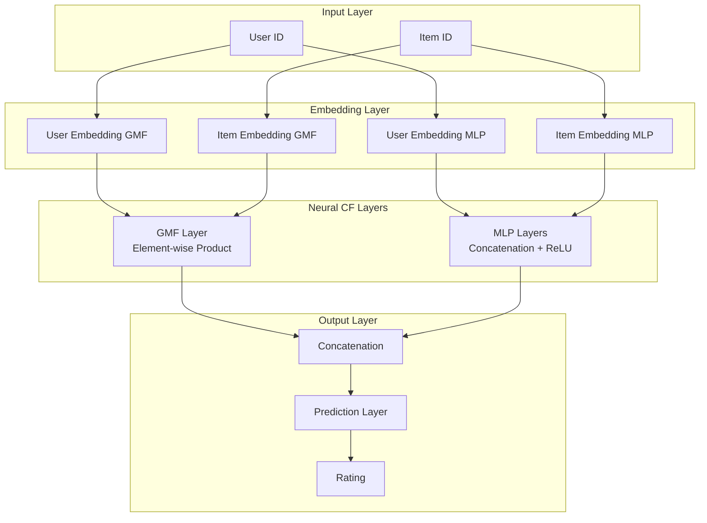
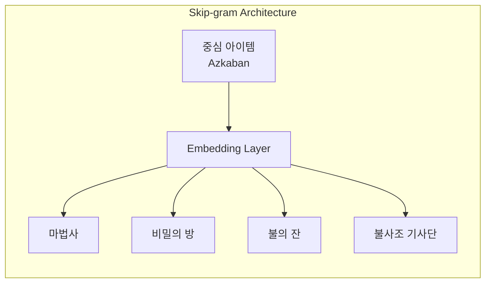
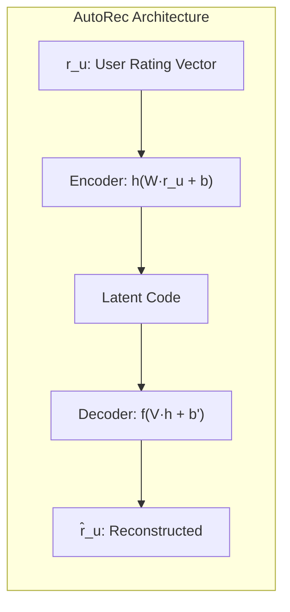
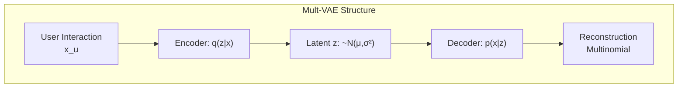
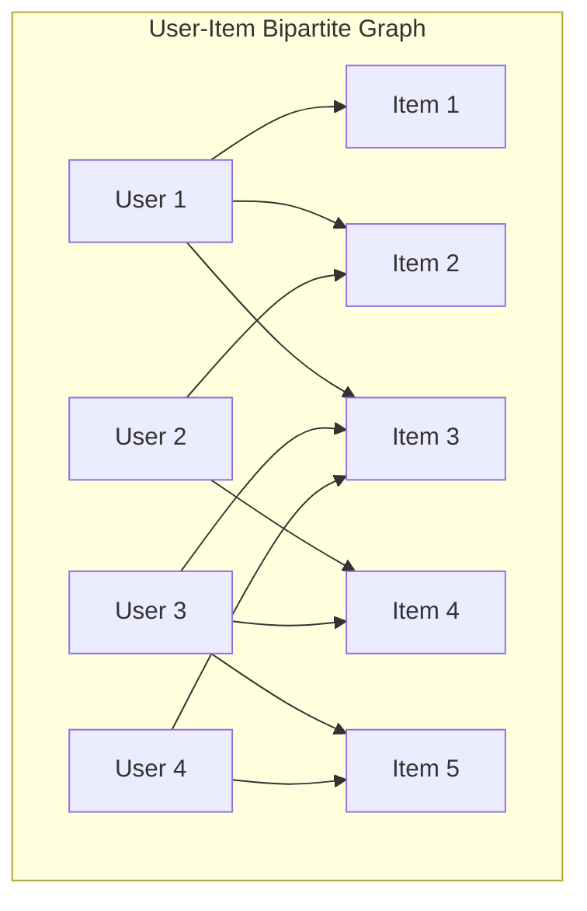
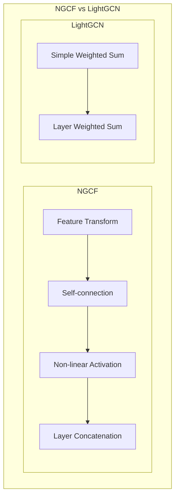

## 📦 사용하는 패키지/기술 버전 정보

- torch==2.8.0
- numpy==1.26.4
- pandas==2.2.3
- scikit-learn==1.6.1
- scipy==1.15.2
- matplotlib==3.10.1
- gensim==4.3.0 (Word2Vec/Item2Vec용)
- tensorflow==2.x (일부 모델 구현시)

## 🚀 TL;DR

- 딥러닝 기반 추천 시스템은 전통적 Matrix Factorization의 선형적 한계를 비선형 활성화 함수로 극복하여 복잡한 유저-아이템 상호작용 패턴을 포착한다
- Neural Collaborative Filtering(NCF)은 GMF와 MLP를 결합하여 선형적/비선형적 상호작용을 동시에 모델링한다
- Item2Vec은 Word2Vec의 Skip-gram with Negative Sampling을 아이템 세션 데이터에 적용하여 아이템 임베딩을 학습한다
- AutoEncoder 기반 접근법(AutoRec, CDAE, Mult-VAE)은 입력 복원 과정을 통해 잠재적 패턴을 학습한다
- Graph Neural Network(NGCF, LightGCN)는 고차원 연결성을 고려하여 유저-아이템 상호작용을 그래프 구조로 모델링한다
- **중요: 학계 연구에 따르면 딥러닝이 항상 최선은 아니며, 잘 튜닝된 전통적 방법이 더 나을 수 있다**
- 산업계에서는 Netflix, YouTube, Pinterest 등이 딥러닝 도입으로 9~40%의 성능 향상을 달성했다

## 📓 실습 Jupyter Notebook

- w.i.p.

## 🎯 딥러닝 기반 추천 시스템의 등장 배경

### 전통적 Matrix Factorization의 한계

전통적인 Matrix Factorization(MF)은 유저와 아이템의 잠재 요인(latent factor)을 **내적(inner product)** 으로 결합하여 선호도를 예측한다. 하지만 이러한 선형적 접근은 표현력에 한계가 있다.

```python
# 전통적 MF의 예측 방식
rating_prediction = np.dot(user_factor, item_factor)  # 단순 내적
```

예를 들어, 3명의 사용자와 5개의 아이템이 있는 상황에서 Jaccard 유사도를 계산하면:

- U2와 U3: 0.66 (가장 유사)
- U1과 U2: 0.5
- U1과 U3: 0.4 (가장 덜 유사)

새로운 유저 U4가 U1과 가장 유사할 때, 잠재 공간에서 이를 표현하려면 모순이 발생한다. U4를 U1 가까이 위치시키면 데이터와 달리 U4가 U3보다 U2에 더 가까워지는 문제가 발생한다.

### 딥러닝의 장점과 한계

**장점**

- **Non-linear Transformation**: ReLU, Sigmoid 같은 비선형 활성화 함수로 복잡한 패턴 포착
- **Representation Learning**: 수동 피처 엔지니어링 불필요, 멀티모달 데이터 처리 용이
- **Sequence Modeling**: NLP에서 검증된 시퀀셜 모델링 기법 적용 가능
- **Flexibility**: 다양한 네트워크 구조 결합 가능, PyTorch/TensorFlow 등 오픈소스 활용

**한계**

- **Interpretability**: 블랙박스 특성으로 해석 어려움
- **Data Requirement**: 대량의 학습 데이터 필요
- **Extensive Hyperparameter Tuning**: 복잡한 하이퍼파라미터 튜닝 필요

## ⚠️ 딥러닝이 항상 최선일까? - 비판적 시각의 중요성

딥러닝 추천 시스템이 널리 사용되고 있지만, 최근 학계에서는 그 효과성에 대해 중요한 의문을 제기하고 있다. 이러한 비판적 연구들을 이해하는 것은 실무에서 올바른 모델 선택을 위해 매우 중요하다.

### "정말로 진보하고 있는가?" - 재현 가능성 문제

2019년 발표된 "Are we really making much progress?" 논문은 도발적인 제목만큼이나 충격적인 결과를 보여준다. 연구진이 학회에 발표된 딥러닝 추천 알고리즘들을 재현하려 시도한 결과:

```python
# 연구 결과 요약
total_algorithms = 18  # 검토한 딥러닝 알고리즘 수
reproducible = 7       # 재현 가능했던 알고리즘 수
better_than_baseline = 1  # 단순 휴리스틱보다 성능이 좋았던 알고리즘 수

print(f"재현 성공률: {reproducible/total_algorithms:.1%}")  # 38.9%
print(f"베이스라인 대비 개선: {better_than_baseline/reproducible:.1%}")  # 14.3%
```

이 연구가 시사하는 바는 명확하다. **발표된 딥러닝 모델 중 상당수가 재현조차 어렵고, 재현되더라도 메모리 기반이나 그래프 기반의 간단한 휴리스틱 방법보다 성능이 떨어진다는 것이다.**

### Neural CF vs Matrix Factorization 재검토

Neural CF 논문은 MLP가 내적(inner product)보다 더 나은 compatibility function이라고 주장했다. 하지만 후속 연구에서는 이를 반박하는 결과를 제시한다:

```python
# 실제 실험 결과 예시
def compare_models(dataset):
    # 단순 내적 기반 MF
    mf_score = matrix_factorization(dataset)
    
    # 복잡한 MLP 기반 Neural CF
    ncf_score = neural_cf(dataset)
    
    # 많은 경우에서...
    if dataset.is_sparse:
        # 희소 데이터셋에서는 MF가 더 나은 경우가 많음
        return mf_score > ncf_score  # True인 경우가 많음
```

연구 결과, **compatibility function으로 단순한 내적이 복잡한 MLP보다 더 효과적인 경우가 많다는 것이 밝혀졌다.** 특히 데이터가 희소한 경우, 복잡한 모델은 오히려 과적합되기 쉽다.

### IALS의 놀라운 경쟁력

Implicit ALS(IALS)는 오래된 Matrix Factorization 기법이지만, 적절히 튜닝하면 최신 딥러닝 모델과 경쟁할 수 있다:

```python
# 성능 비교 실험 결과 (MovieLens 20M 데이터셋)
results = {
    'IALS (2008년 모델)': {'recall@20': 0.395, 'training_time': '5분'},
    'Neural CF (2017년)': {'recall@20': 0.403, 'training_time': '2시간'},
    'NGCF (2019년)': {'recall@20': 0.412, 'training_time': '5시간'},
}

# IALS는 훨씬 빠른 학습 시간으로 비슷한 성능 달성
performance_per_time = {
    model: info['recall@20'] / (info['training_time'].split('시간')[0] if '시간' in info['training_time'] else 1/12)
    for model, info in results.items()
}
```

### 실무에서의 교훈: 현명한 모델 선택

이러한 비판적 연구들이 우리에게 주는 교훈은 명확하다. **복잡한 모델이 항상 더 나은 것은 아니며, 문제의 특성에 맞는 적절한 모델 선택이 중요하다.**

```python
def choose_recommendation_model(dataset_characteristics):
    """
    데이터 특성에 따른 추천 모델 선택 가이드
    """
    
    # 데이터가 매우 희소한 경우
    if dataset_characteristics['sparsity'] > 0.99:
        # EASE나 IALS 같은 단순 모델이 더 효과적
        return 'EASE or Tuned IALS'
    
    # 충분한 데이터와 컴퓨팅 자원이 있는 경우
    elif dataset_characteristics['num_interactions'] > 1e8 and \
         dataset_characteristics['computing_resource'] == 'high':
        # 딥러닝 모델의 장점을 활용할 수 있음
        return 'Deep Learning Models (NGCF, LightGCN)'
    
    # 실시간 업데이트가 중요한 경우
    elif dataset_characteristics['real_time_requirement']:
        # 빠른 업데이트가 가능한 단순 모델
        return 'Memory-based CF or Simple MF'
    
    # 해석 가능성이 중요한 경우
    elif dataset_characteristics['interpretability_required']:
        # 설명 가능한 전통적 방법
        return 'Item-based CF or MF with explicit factors'
    
    else:
        # 대부분의 일반적 상황에서는 균형잡힌 접근
        return 'Start with MF, experiment with deep models'
```

### 왜 산업계에서는 성공하는가?

학계의 비판적 연구에도 불구하고 Netflix, YouTube, Pinterest 등은 딥러닝으로 큰 성과를 거두고 있다. 이 간극은 어디서 오는 것일까?

**1. 데이터 규모의 차이**: 대기업들은 학계 벤치마크와 비교할 수 없는 규모의 데이터를 보유하고 있다. 딥러닝은 충분한 데이터가 있을 때 진가를 발휘한다.

**2. 엔지니어링 노하우**: 산업계는 모델 자체보다 전체 시스템 최적화에 더 많은 자원을 투입한다. A/B 테스팅, 실시간 학습, 앙상블 기법 등이 결합되어 성능을 높인다.

**3. 다양한 신호 활용**: 단순 클릭 데이터뿐 아니라 체류 시간, 스크롤 패턴, 검색 기록 등 다양한 신호를 통합한다.

```python
# 산업계의 실제 접근법 예시
class IndustryRecommendationSystem:
    def __init__(self):
        # 다양한 모델의 앙상블
        self.models = {
            'short_term': ItemBasedCF(),      # 빠른 반응
            'long_term': MatrixFactorization(), # 안정적 선호도
            'deep': NeuralCF(),                # 복잡한 패턴
            'graph': LightGCN()                # 관계성 활용
        }
        
    def predict(self, user, context):
        # 상황에 따라 가중치 동적 조정
        if context['is_new_user']:
            # 신규 유저는 단순 모델 위주
            weights = {'short_term': 0.7, 'long_term': 0.2, 
                      'deep': 0.05, 'graph': 0.05}
        else:
            # 충분한 이력이 있는 유저는 복잡한 모델 활용
            weights = {'short_term': 0.2, 'long_term': 0.3, 
                      'deep': 0.3, 'graph': 0.2}
        
        # 앙상블 예측
        return self.ensemble_predict(user, weights)
```

## 🔍 Feed-forward Neural Network 기반 CF

### Neural Collaborative Filtering (NCF)

NCF는 Generalized Matrix Factorization(GMF)과 Multi-Layer Perceptron(MLP)를 결합한 구조다.



#### GMF (Generalized Matrix Factorization)

GMF는 기존 MF를 일반화한 형태로, element-wise product를 사용한다.

```python
class GMF(nn.Module):
    def __init__(self, num_users, num_items, factor_num):
        super(GMF, self).__init__()
        self.embed_user_GMF = nn.Embedding(num_users, factor_num)
        self.embed_item_GMF = nn.Embedding(num_items, factor_num)
        self.predict_layer = nn.Linear(factor_num, 1)
        
    def forward(self, user, item):
        embed_user = self.embed_user_GMF(user)
        embed_item = self.embed_item_GMF(item)
        
        # Element-wise product (Hadamard product)
        output_GMF = embed_user * embed_item
        
        # 최종 예측
        prediction = self.predict_layer(output_GMF)
        return prediction
```

수식으로 표현하면, $$\hat{y}_{ui} = a_{out}(h^T(p_u^G \odot q_i^G))$$

여기서:

- $p_u^G$: GMF의 유저 임베딩
- $q_i^G$: GMF의 아이템 임베딩
- $\odot$: element-wise product
- $h$: weight vector
- $a_{out}$: 활성화 함수

#### MLP 구조

MLP는 유저와 아이템 임베딩을 concatenation하여 비선형 변환을 수행한다.

```python
class MLP(nn.Module):
    def __init__(self, num_users, num_items, factor_num, num_layers, dropout):
        super(MLP, self).__init__()
        # 임베딩 차원을 레이어가 깊어질수록 줄어들게 설정
        embed_dim = factor_num * (2 ** (num_layers - 1))
        
        self.embed_user_MLP = nn.Embedding(num_users, embed_dim)
        self.embed_item_MLP = nn.Embedding(num_items, embed_dim)
        
        # MLP 레이어 구성 (피라미드 구조)
        MLP_modules = []
        for i in range(num_layers):
            input_size = factor_num * (2 ** (num_layers - i))
            output_size = factor_num * (2 ** (num_layers - i - 1))
            MLP_modules.append(nn.Linear(input_size, output_size))
            MLP_modules.append(nn.ReLU())
            MLP_modules.append(nn.Dropout(p=dropout))
            
        self.MLP_layers = nn.Sequential(*MLP_modules)
        
    def forward(self, user, item):
        embed_user = self.embed_user_MLP(user)
        embed_item = self.embed_item_MLP(item)
        
        # Concatenation
        interaction = torch.cat((embed_user, embed_item), -1)
        
        # MLP layers 통과
        output_MLP = self.MLP_layers(interaction)
        return output_MLP
```

### Item2Vec: Word2Vec의 추천 시스템 응용

Item2Vec은 Word2Vec의 Skip-gram with Negative Sampling(SGNS)을 아이템 세션 데이터에 적용한다.

#### Skip-gram 모델 구조



#### 학습 데이터 구성

하나의 세션에 속한 아이템들은 서로 유사하다고 가정한다.

```python
# 세션 데이터 예시
session = ["해리포터_마법사의돌", "해리포터_비밀의방", "해리포터_아즈카반", "해리포터_불의잔"]

# Item2Vec 학습을 위한 데이터 구성
training_pairs = []
for center_item in session:
    for context_item in session:
        if center_item != context_item:
            # Positive samples (같은 세션 = 유사함)
            training_pairs.append((center_item, context_item, 1))
            
# Negative sampling (다른 세션의 랜덤 아이템)
negative_items = random.sample(all_items - set(session), k=5)
for neg_item in negative_items:
    training_pairs.append((center_item, neg_item, 0))
```

#### Gensim을 활용한 구현

```python
from gensim.models import Word2Vec

# 사용자별 세션 데이터 준비
def prepare_sessions(ratings_df, threshold=4.0):
    # 평점 4.0 이상 영화들을 하나의 세션으로
    liked_movies = ratings_df[ratings_df['rating'] >= threshold]
    sessions = liked_movies.groupby('userId')['movieId'].apply(list).tolist()
    return sessions

# Item2Vec 모델 학습
model = Word2Vec(
    sentences=sessions,          # 아이템 세션 리스트
    size=100,                    # 임베딩 차원
    window=20,                   # 윈도우 크기 (세션 기반이므로 크게 설정)
    min_count=10,                # 최소 등장 횟수
    sg=1,                        # Skip-gram 사용
    negative=5,                  # Negative sampling 개수
    workers=4                    # 병렬 처리
)

# 유사 아이템 찾기
similar_items = model.wv.most_similar("Toy_Story", topn=5)
```

## 🔄 AutoEncoder 기반 CF

### AutoRec: 기본 AutoEncoder 구조

AutoRec은 유저-아이템 행렬의 행(user-based) 또는 열(item-based)을 입력으로 받아 복원한다.



```python
class AutoRec(nn.Module):
    def __init__(self, num_items, hidden_dim):
        super(AutoRec, self).__init__()
        self.encoder = nn.Linear(num_items, hidden_dim)
        self.decoder = nn.Linear(hidden_dim, num_items)
        
    def forward(self, rating_vector):
        # 관측되지 않은 rating은 0으로 설정
        h = torch.sigmoid(self.encoder(rating_vector))
        reconstruction = self.decoder(h)
        
        # 관측된 rating에 대해서만 loss 계산
        return reconstruction
```

목적함수는 다음과 같다.

$$\min_{\theta} \sum_{u} ||r_u - h(r_u; \theta)||^2_{\mathcal{O}} + \lambda \cdot ||\theta||^2_F$$

여기서 $\mathcal{O}$는 관측된 rating의 집합이다.

### CDAE (Collaborative Denoising AutoEncoder)

CDAE는 Denoising AutoEncoder에 유저 노드를 추가하여 협업적 특성을 강화한다.

```python
class CDAE(nn.Module):
    def __init__(self, num_users, num_items, hidden_dim, corruption_ratio=0.2):
        super(CDAE, self).__init__()
        self.user_embedding = nn.Embedding(num_users, hidden_dim)
        self.encoder = nn.Linear(num_items, hidden_dim)
        self.decoder = nn.Linear(hidden_dim, num_items)
        self.corruption_ratio = corruption_ratio
        
    def forward(self, user_id, item_vector):
        # Corruption: 랜덤하게 일부 입력을 0으로
        corrupted_input = F.dropout(item_vector, p=self.corruption_ratio)
        
        # Encoding with user bias
        user_bias = self.user_embedding(user_id)
        h = torch.sigmoid(self.encoder(corrupted_input) + user_bias)
        
        # Decoding
        reconstruction = self.decoder(h)
        return reconstruction
```

### Mult-VAE: Multinomial Variational AutoEncoder

Mult-VAE는 다항분포를 사용하여 사용자의 한정된 예산(시간, 돈)을 모델링한다.



**특징**

- **Multinomial likelihood**: 각 아이템들의 확률 합이 1
- **KL Annealing**: 학습 초기에는 β=0에서 시작하여 점진적 증가
- **ELBO 목적함수** 
$$\mathcal{L} = \mathbb{E}_{q(z|x)}[\log p(x|z)] - \beta \cdot KL(q(z|x)||p(z))$$

### EASE (Embarrassingly Shallow AutoEncoders)

EASE는 단순한 선형 구조로 item-to-item similarity matrix를 학습한다.

```python
class EASE:
    def __init__(self, lambda_reg=100):
        self.lambda_reg = lambda_reg
        self.B = None  # Item-to-item similarity matrix
        
    def fit(self, X):
        # X: user-item interaction matrix
        G = X.T @ X  # Gram matrix
        diag_indices = np.diag_indices(G.shape[0])
        G[diag_indices] += self.lambda_reg
        
        # Closed-form solution
        P = np.linalg.inv(G)
        self.B = P / (-np.diag(P))
        self.B[diag_indices] = 0  # 대각 원소는 0
        
    def predict(self, X):
        return X @ self.B
```

**특징**

- **Closed-form solution**: SGD 불필요
- **대각 제약**: B의 대각 원소를 0으로 설정하여 trivial solution 방지
- **단순하지만 효과적**: 특히 sparse 데이터셋에서 우수한 성능

## 📊 Graph Neural Network 기반 CF

### 그래프 구조의 장점

유저-아이템 상호작용을 그래프로 표현하면 고차원 연결성을 자연스럽게 모델링할 수 있다:



고차원 연결성 예시)

- **1차 연결**: U1 → {I1, I2, I3}
- **2차 연결**: U1 → I3 → {U3, U4}
- **3차 연결**: U1 → I3 → U3 → {I4, I5}

### NGCF (Neural Graph Collaborative Filtering)

NGCF는 GNN을 활용하여 embedding propagation을 수행한다.

#### Message Construction & Aggregation

```python
class NGCFLayer(nn.Module):
    def __init__(self, in_dim, out_dim):
        super(NGCFLayer, self).__init__()
        self.W1 = nn.Linear(in_dim, out_dim)
        self.W2 = nn.Linear(in_dim, out_dim)
        
    def forward(self, ego_embeddings, neighbor_embeddings, norm_factors):
        # Message construction
        # m_ui = 1/sqrt(|N_u| * |N_i|) * (W1 * e_i + W2 * (e_i ⊙ e_u))
        side_embeddings = self.W1(neighbor_embeddings)
        interaction = self.W2(neighbor_embeddings * ego_embeddings)
        messages = (side_embeddings + interaction) * norm_factors
        
        # Message aggregation
        # e_u^(k+1) = LeakyReLU(m_uu + Σ m_ui)
        all_embeddings = torch.sum(messages, dim=1)
        ego_embeddings = F.leaky_relu(ego_embeddings + all_embeddings)
        
        return ego_embeddings
```

#### Multi-layer Propagation

L개 레이어를 쌓아 L-hop 이웃 정보를 집계한다.

```python
class NGCF(nn.Module):
    def __init__(self, num_users, num_items, embed_dim, num_layers):
        super(NGCF, self).__init__()
        self.user_embedding = nn.Embedding(num_users, embed_dim)
        self.item_embedding = nn.Embedding(num_items, embed_dim)
        
        self.layers = nn.ModuleList([
            NGCFLayer(embed_dim, embed_dim) for _ in range(num_layers)
        ])
        
    def forward(self, users, items, user_item_graph):
        user_embeds = [self.user_embedding(users)]
        item_embeds = [self.item_embedding(items)]
        
        # L-layer propagation
        for layer in self.layers:
            user_embed = layer(user_embeds[-1], item_embeds, norm_factors)
            item_embed = layer(item_embeds[-1], user_embeds, norm_factors)
            
            user_embeds.append(user_embed)
            item_embeds.append(item_embed)
        
        # Layer combination (concatenation)
        user_final = torch.cat(user_embeds, dim=1)
        item_final = torch.cat(item_embeds, dim=1)
        
        # Prediction
        score = torch.sum(user_final * item_final, dim=1)
        return score
```

### LightGCN: 경량화된 GCN

LightGCN은 NGCF에서 불필요한 연산을 제거한 경량 모델이다.



#### Light Graph Convolution

```python
class LightGCN(nn.Module):
    def __init__(self, num_users, num_items, embed_dim, num_layers):
        super(LightGCN, self).__init__()
        self.user_embedding = nn.Embedding(num_users, embed_dim)
        self.item_embedding = nn.Embedding(num_items, embed_dim)
        self.num_layers = num_layers
        
    def forward(self, normalized_adj_matrix):
        # Initial embeddings
        ego_embeddings = torch.cat([
            self.user_embedding.weight,
            self.item_embedding.weight
        ])
        
        all_embeddings = [ego_embeddings]
        
        # Simple propagation without transformation
        for k in range(self.num_layers):
            # e^(k+1) = (D^-1/2 * A * D^-1/2) * e^(k)
            ego_embeddings = torch.sparse.mm(normalized_adj_matrix, ego_embeddings)
            all_embeddings.append(ego_embeddings)
        
        # Layer combination with uniform weights
        final_embeddings = torch.stack(all_embeddings, dim=1)
        final_embeddings = torch.mean(final_embeddings, dim=1)
        
        user_embeds, item_embeds = torch.split(
            final_embeddings, [self.num_users, self.num_items]
        )
        
        return user_embeds, item_embeds
```

**핵심 단순화**

- **No feature transformation**: W 행렬 제거
- **No self-connection**: 자기 연결 제거
- **No non-linear activation**: 활성화 함수 제거
- **Simple layer combination**: Concatenation 대신 weighted sum

**성능 비교 결과**

- 더 단순한 구조에도 NGCF보다 우수한 성능
- 학습 속도 대폭 향상
- 메모리 사용량 감소

## 💼 실제 산업 적용 사례

### 성공 사례

|기업|모델|성능 향상|
|---|---|---|
|Netflix|Deep Learning 추천|CTR +25%|
|YouTube|Two-tower DNN|Watch Time +20%|
|Pinterest|PinSage (GNN)|Engagement +30%|
|Walmart|Deep CF|Conversion +15%|
|Spotify|Song2Vec|Discovery +40%|
|아프리카TV|Live2Vec|체류시간 +18%|
|Criteo|Meta-Prod2Vec|CTR +12%|

### 실무 적용시 고려사항

**데이터 준비**

- 세션 정의가 중요 (시간 기반 vs 행동 기반)
- Cold-start 문제 해결 방안 필요
- 실시간 업데이트 파이프라인 구축

**모델 선택 기준**

- **데이터 밀도 높음**: Neural CF, NGCF
- **데이터 매우 희소**: EASE, LightGCN
- **시퀀셜 패턴 중요**: Item2Vec, RNN 기반
- **해석가능성 필요**: 전통적 CF + 단순 DNN

**하이퍼파라미터 튜닝**

```python
# Item2Vec 핵심 하이퍼파라미터
hyperparameters = {
    'embedding_dim': [50, 100, 200],      # 임베딩 차원
    'window_size': [5, 10, 20],           # 컨텍스트 윈도우
    'negative_samples': [5, 10, 15],      # 네거티브 샘플 수
    'min_count': [5, 10, 20],             # 최소 등장 횟수
    'epochs': [10, 20, 30]                # 학습 에폭
}

# Neural CF 핵심 하이퍼파라미터
ncf_params = {
    'factors': [8, 16, 32, 64],           # 잠재 요인 수
    'layers': [64, 32, 16, 8],            # MLP 레이어 구조
    'dropout': [0.0, 0.2, 0.5],           # 드롭아웃 비율
    'lr': [0.001, 0.005, 0.01],           # 학습률
    'batch_size': [256, 512, 1024]        # 배치 크기
}
```

## 🎓 마무리 및 향후 전망

딥러닝 기반 추천 시스템은 전통적 방법의 한계를 극복하며 지속적으로 발전하고 있다. 특히 다음과 같은 방향으로 연구가 진행되고 있다:

**Explainable Recommendation**

- Attention 메커니즘을 활용한 설명 가능한 추천
- Knowledge Graph 결합으로 추천 이유 제시

**Multi-modal Recommendation**

- 이미지, 텍스트, 오디오 등 다양한 모달리티 통합
- Cross-modal 학습으로 더 풍부한 표현 학습

**Few-shot/Zero-shot Learning**

- 적은 데이터로도 효과적인 추천
- Meta-learning 기법 활용

**Real-time Adaptation**

- 온라인 학습으로 실시간 선호도 변화 반영
- Contextual Bandit 알고리즘 결합

딥러닝 추천 시스템을 구현할 때는 단순히 최신 모델을 따라가기보다, 자신의 데이터 특성과 비즈니스 요구사항에 맞는 적절한 모델을 선택하는 것이 중요하다. **때로는 단순한 EASE 모델이나 잘 튜닝된 IALS가 복잡한 NGCF보다 더 좋은 성능을 낼 수 있다는 점을 항상 기억해야 한다.**

실무에서는 다양한 모델을 실험하고, A/B 테스트를 통해 실제 비즈니스 지표에 미치는 영향을 검증하는 것이 중요하다. 학계의 벤치마크 성능과 실제 서비스에서의 성능은 다를 수 있으므로, 항상 비판적 시각을 유지하며 데이터 기반의 의사결정을 내려야 한다.
