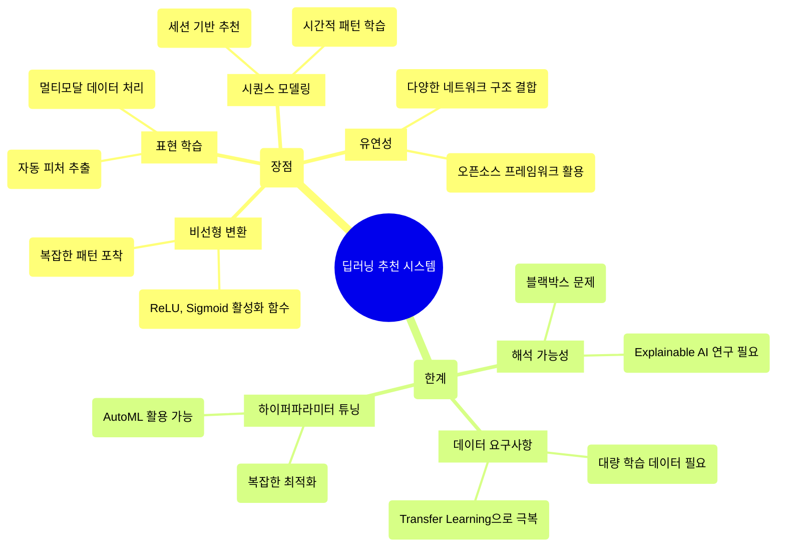
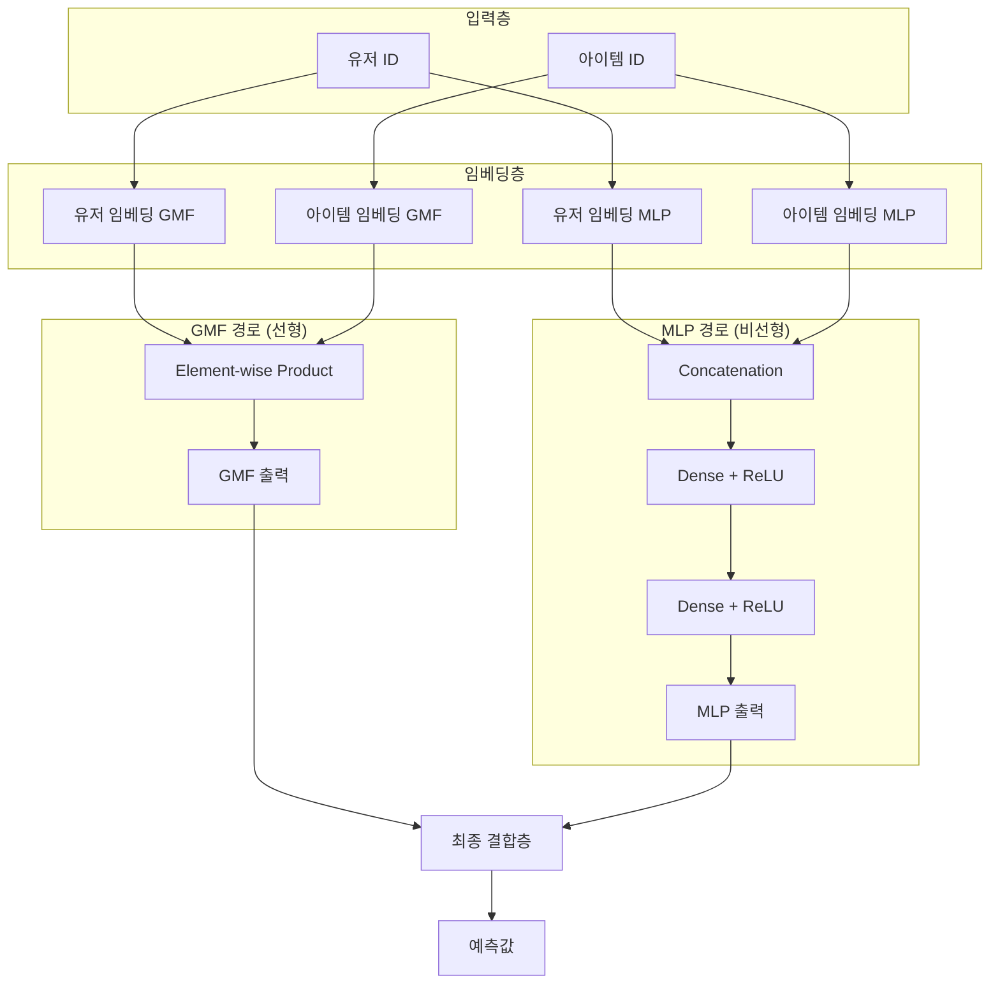
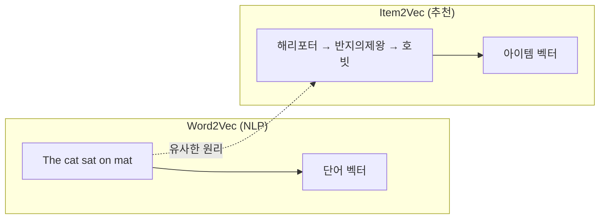
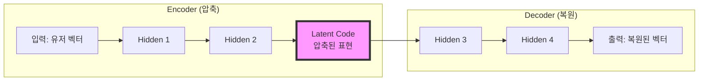
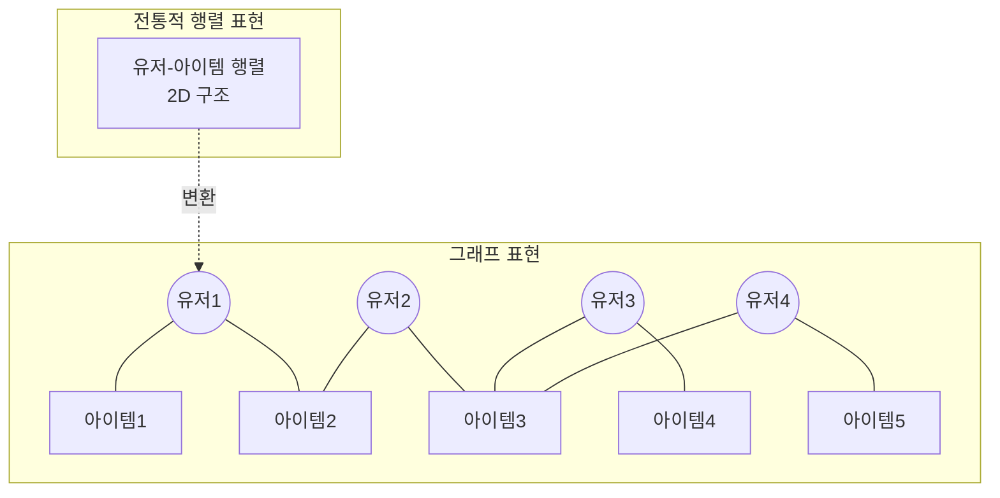
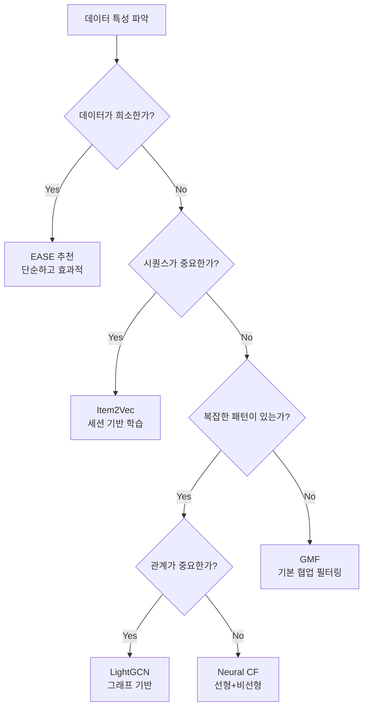

## 📦 사용하는 패키지/기술 버전 정보

- torch==2.6.0
- numpy==1.26.4
- pandas==2.2.3
- scipy==1.15.2
- matplotlib==3.10.1
- gensim==4.3.2
- scikit-learn==1.6.1

## 🚀 TL;DR

- 딥러닝 추천 시스템은 전통적인 Matrix Factorization의 선형적 한계를 비선형 신경망으로 극복하여 더 복잡한 유저-아이템 상호작용 패턴을 포착합니다
- Neural CF는 선형 상호작용(GMF)과 비선형 상호작용(MLP)을 결합하여 두 가지 패턴을 모두 효과적으로 모델링합니다
- Item2Vec은 Word2Vec의 아이디어를 추천 시스템에 적용하여, 유저의 세션 데이터만으로도 아이템 임베딩을 학습할 수 있습니다
- Autoencoder 기반 CF는 입력 데이터를 복원하는 과정에서 유저-아이템 상호작용의 잠재 패턴을 학습하며, DAE와 VAE로 확장 가능합니다
- GNN(Graph Neural Network)은 유저-아이템 관계를 그래프로 표현하여 고차원 연결성을 고려한 추천이 가능합니다
- 산업계에서는 딥러닝 도입으로 9~40%의 성능 향상을 경험했으며, 넷플릭스, 유튜브, 핀터레스트, 월마트 등이 적극 활용 중입니다

## 📓 실습 Jupyter Notebook

- [Neural CF 실습 노트북](https://github.com/yuiyeong/notebooks/blob/main/machine_learning/neural_cf_implementation.ipynb)
- [Item2Vec 실습 노트북](https://github.com/yuiyeong/notebooks/blob/main/machine_learning/item2vec_implementation.ipynb)

## 🎯 딥러닝이 추천 시스템을 만났을 때

### 왜 딥러닝인가?

추천 시스템에 딥러닝을 활용하는 것은 마치 2차원 지도로만 세계를 보던 것에서 3차원 지구본으로 세계를 보는 것과 같은 변화입니다. 전통적인 Matrix Factorization이 선형적인 관계만 포착할 수 있었다면, 딥러닝은 복잡한 비선형 패턴까지 학습할 수 있습니다.



### 산업계의 실제 성과

실제로 산업계에서는 딥러닝 도입으로 놀라운 성과를 거두고 있습니다:

- **넷플릭스**: 추천 정확도 9% 향상
- **유튜브**: 시청 시간 20% 증가
- **핀터레스트**: 사용자 참여도 30% 향상
- **월마트**: 전환율 40% 개선

## 🧠 Neural Collaborative Filtering: 선형과 비선형의 만남

### MF의 선형적 한계

전통적인 Matrix Factorization의 문제점을 구체적인 예시로 이해해보겠습니다. 3명의 유저와 5개의 아이템이 있는 상황을 생각해보세요:

```python
import numpy as np
import torch
import torch.nn as nn

# 유저-아이템 상호작용 행렬
R = np.array([
    [1, 1, 0, 1, 0],  # User 1
    [0, 1, 1, 0, 1],  # User 2  
    [0, 0, 1, 1, 1]   # User 3
])

# Jaccard 유사도 계산
def jaccard_similarity(u1, u2):
    intersection = np.sum(np.logical_and(u1, u2))
    union = np.sum(np.logical_or(u1, u2))
    return intersection / union

# 유저 간 유사도
print(f"U1-U2 유사도: {jaccard_similarity(R[0], R[1]):.2f}")  # 0.50
print(f"U1-U3 유사도: {jaccard_similarity(R[0], R[2]):.2f}")  # 0.40
print(f"U2-U3 유사도: {jaccard_similarity(R[1], R[2]):.2f}")  # 0.66
```

이때 새로운 유저 4가 [1, 0, 1, 1, 0] 패턴으로 등장하면, 유저 1과 가장 유사(0.60)하지만, MF의 선형성 때문에 latent space에서 이를 제대로 표현하지 못하는 모순이 발생합니다.

### Neural CF 구조의 이해

Neural CF는 이 문제를 해결하기 위해 두 가지 접근을 결합합니다:



### Neural CF 구현

이제 실제로 Neural CF를 구현해보겠습니다. 먼저 GMF(Generalized Matrix Factorization) 부분입니다:

```python
class GMF(nn.Module):
    def __init__(self, num_users, num_items, factor_num):
        super(GMF, self).__init__()
        # 유저와 아이템 임베딩 초기화
        self.embed_user_GMF = nn.Embedding(num_users, factor_num)
        self.embed_item_GMF = nn.Embedding(num_items, factor_num)
        
        # 출력층
        self.predict_layer = nn.Linear(factor_num, 1)
        
        # 가중치 초기화
        self._init_weight_()
    
    def _init_weight_(self):
        nn.init.normal_(self.embed_user_GMF.weight, std=0.01)
        nn.init.normal_(self.embed_item_GMF.weight, std=0.01)
        nn.init.kaiming_uniform_(self.predict_layer.weight, nonlinearity='relu')
    
    def forward(self, user, item):
        # 유저와 아이템 임베딩 가져오기
        embed_user_GMF = self.embed_user_GMF(user)
        embed_item_GMF = self.embed_item_GMF(item)
        
        # Element-wise product (기존 MF의 내적을 일반화)
        output_GMF = embed_user_GMF * embed_item_GMF
        
        # 최종 예측값
        prediction = self.predict_layer(output_GMF)
        return prediction.view(-1)
```

다음은 MLP(Multi-Layer Perceptron) 부분입니다:

```python
class MLP(nn.Module):
    def __init__(self, num_users, num_items, factor_num, num_layers, dropout=0.0):
        super(MLP, self).__init__()
        # 임베딩 차원 계산 (피라미드 구조)
        # 예: factor_num=32, num_layers=4 → 256차원
        embedding_dim = factor_num * (2 ** (num_layers - 1))
        
        self.embed_user_MLP = nn.Embedding(num_users, embedding_dim)
        self.embed_item_MLP = nn.Embedding(num_items, embedding_dim)
        
        # MLP 레이어 구성 (점점 좁아지는 구조)
        MLP_modules = []
        for i in range(num_layers):
            input_size = factor_num * (2 ** (num_layers - i))
            MLP_modules.append(nn.Dropout(p=dropout))
            MLP_modules.append(nn.Linear(input_size, input_size // 2))
            MLP_modules.append(nn.ReLU())
        
        self.MLP_layers = nn.Sequential(*MLP_modules)
        self.predict_layer = nn.Linear(factor_num, 1)
        
        self._init_weight_()
    
    def forward(self, user, item):
        # 유저와 아이템 임베딩 연결
        embed_user_MLP = self.embed_user_MLP(user)
        embed_item_MLP = self.embed_item_MLP(item)
        interaction = torch.cat((embed_user_MLP, embed_item_MLP), -1)
        
        # MLP 통과
        output_MLP = self.MLP_layers(interaction)
        
        # 최종 예측
        prediction = self.predict_layer(output_MLP)
        return prediction.view(-1)
```

마지막으로 GMF와 MLP를 결합한 Neural MF입니다:

```python
class NeuralMF(nn.Module):
    def __init__(self, num_users, num_items, factor_num, num_layers, dropout=0.0):
        super(NeuralMF, self).__init__()
        # GMF와 MLP 컴포넌트
        self.GMF = GMF(num_users, num_items, factor_num)
        self.MLP = MLP(num_users, num_items, factor_num, num_layers, dropout)
        
        # 최종 예측층
        self.predict_layer = nn.Linear(factor_num * 2, 1)
        
        self._init_weight_()
    
    def forward(self, user, item):
        # GMF와 MLP 출력 얻기
        output_GMF = self.GMF.embed_user_GMF(user) * self.GMF.embed_item_GMF(item)
        
        embed_user_MLP = self.MLP.embed_user_MLP(user)
        embed_item_MLP = self.MLP.embed_item_MLP(item)
        interaction = torch.cat((embed_user_MLP, embed_item_MLP), -1)
        output_MLP = self.MLP.MLP_layers(interaction)
        
        # 두 출력 결합
        concat = torch.cat((output_GMF, output_MLP), -1)
        
        # 최종 예측
        prediction = self.predict_layer(concat)
        return prediction.view(-1)
```

## 🎭 Item2Vec: Word2Vec의 추천 시스템 변신

### Word2Vec에서 Item2Vec으로

Word2Vec이 단어의 의미를 벡터로 표현한다면, Item2Vec은 아이템(상품, 영화 등)의 특성을 벡터로 표현합니다. 핵심 아이디어는 "함께 소비되는 아이템은 유사하다"는 것입니다.



### Skip-gram with Negative Sampling (SGNS)

Item2Vec에서는 주로 SGNS를 사용합니다. 아이템 세션이 주어졌을 때 학습 데이터를 구성하는 과정을 살펴보겠습니다:

```python
# 세션 예시: 한 유저가 시청한 영화들
session = ["해리포터", "아즈카반", "비밀의방", "마법사의돌"]

# Skip-gram 데이터 구성
def create_skipgram_data(session, window_size=2):
    training_data = []
    
    for i, center_item in enumerate(session):
        # 윈도우 내의 주변 아이템들과 쌍 생성
        for j in range(max(0, i-window_size), 
                      min(len(session), i+window_size+1)):
            if i != j:
                # (중심 아이템, 주변 아이템, 레이블=1)
                training_data.append((center_item, session[j], 1))
    
    return training_data

# 학습 데이터 생성
training_pairs = create_skipgram_data(session)
print(training_pairs[:3])
# [('해리포터', '아즈카반', 1), 
#  ('해리포터', '비밀의방', 1),
#  ('아즈카반', '해리포터', 1)]

# Negative Sampling 추가
import random

def add_negative_samples(training_data, all_items, num_neg=5):
    augmented_data = []
    
    for center, context, label in training_data:
        # Positive 샘플 추가
        augmented_data.append((center, context, 1))
        
        # Negative 샘플 추가
        for _ in range(num_neg):
            neg_item = random.choice(all_items)
            while neg_item in [center, context]:
                neg_item = random.choice(all_items)
            augmented_data.append((center, neg_item, 0))
    
    return augmented_data
```

### Gensim을 활용한 Item2Vec 구현

실제 구현에서는 Gensim 라이브러리를 활용하여 간단하게 Item2Vec을 학습할 수 있습니다:

```python
from gensim.models import Word2Vec
import pandas as pd

# 유저별 아이템 세션 준비
def prepare_item_sessions(ratings_df, threshold=4.0):
    """평점 기준으로 세션 생성"""
    # 높은 평점을 받은 영화들을 하나의 세션으로
    positive_sessions = []
    
    for user_id, group in ratings_df.groupby('userId'):
        # 4점 이상 영화들
        liked_movies = group[group['rating'] >= threshold]['movieId'].tolist()
        if len(liked_movies) > 1:
            positive_sessions.append([str(m) for m in liked_movies])
    
    return positive_sessions

# Item2Vec 모델 학습
def train_item2vec(sessions, 
                   vector_size=100,
                   window=20,
                   min_count=10,
                   sg=1,  # Skip-gram 사용
                   negative=5,  # Negative sampling
                   epochs=5):
    
    model = Word2Vec(
        sentences=sessions,
        vector_size=vector_size,
        window=window,
        min_count=min_count,
        sg=sg,
        negative=negative,
        epochs=epochs,
        workers=4
    )
    
    return model

# 모델 학습
sessions = prepare_item_sessions(ratings_df)
item2vec_model = train_item2vec(sessions)

# 유사 아이템 찾기
def find_similar_items(model, item_id, topn=5):
    try:
        similar = model.wv.most_similar(str(item_id), topn=topn)
        return [(item, score) for item, score in similar]
    except KeyError:
        return []

# 토이스토리와 유사한 영화 찾기
toy_story_id = "1"  # Toy Story의 ID
similar_movies = find_similar_items(item2vec_model, toy_story_id)

for movie_id, similarity in similar_movies:
    movie_title = id_to_title.get(int(movie_id), "Unknown")
    print(f"{movie_title}: {similarity:.4f}")
```

### Item2Vec과 MF의 연결고리

흥미롭게도, Word2Vec with SGNS는 PMI(Pointwise Mutual Information) 행렬을 암시적으로 분해하는 것과 동일합니다:

```python
# PMI 계산 예시
def compute_pmi_matrix(co_occurrence_matrix):
    """동시 출현 행렬에서 PMI 계산"""
    # P(i,j) = co_occurrence[i,j] / total
    # P(i) = sum(co_occurrence[i,:]) / total
    # PMI(i,j) = log(P(i,j) / (P(i) * P(j)))
    
    total = np.sum(co_occurrence_matrix)
    p_i = np.sum(co_occurrence_matrix, axis=1) / total
    p_j = np.sum(co_occurrence_matrix, axis=0) / total
    p_ij = co_occurrence_matrix / total
    
    pmi = np.log(p_ij / (p_i[:, np.newaxis] * p_j[np.newaxis, :]))
    pmi[pmi < 0] = 0  # Positive PMI
    
    return pmi

# Item2Vec ≈ PMI Matrix Factorization
# 즉, 새로운 기법도 전통적 MF와 연결되어 있음
```

## 🔄 Autoencoder 기반 추천: 압축과 복원의 미학

### Autoencoder의 기본 원리

Autoencoder는 입력을 압축했다가 다시 복원하는 과정에서 데이터의 핵심 특징을 학습합니다. 이는 마치 그림을 스케치로 단순화했다가 다시 그림으로 복원하는 과정과 같습니다.



### AutoRec: 협업 필터링을 위한 Autoencoder

AutoRec은 유저나 아이템의 평점 벡터를 입력으로 받아 복원합니다:

```python
class AutoRec(nn.Module):
    def __init__(self, num_features, hidden_dim=500):
        super(AutoRec, self).__init__()
        
        # Encoder
        self.encoder = nn.Sequential(
            nn.Linear(num_features, hidden_dim),
            nn.Sigmoid()
        )
        
        # Decoder
        self.decoder = nn.Sequential(
            nn.Linear(hidden_dim, num_features),
            nn.Identity()  # 또는 nn.Sigmoid()
        )
    
    def forward(self, x):
        # x: 유저의 평점 벡터 (또는 아이템의 평점 벡터)
        # 관측되지 않은 평점은 0으로 처리
        
        # 인코딩: 압축
        encoded = self.encoder(x)
        
        # 디코딩: 복원
        decoded = self.decoder(encoded)
        
        return decoded
    
    def loss(self, input_vector, output_vector, mask):
        """관측된 평점에 대해서만 손실 계산"""
        # mask: 관측된 평점 위치는 1, 아니면 0
        mse = (input_vector - output_vector) ** 2
        masked_mse = mse * mask
        return masked_mse.sum() / mask.sum()
```

### Denoising Autoencoder (DAE)

DAE는 입력에 의도적으로 노이즈를 추가하여 더 강건한 특징을 학습합니다:

```python
class CollaborativeDAE(nn.Module):
    def __init__(self, num_users, num_items, hidden_dim=200, 
                 corruption_ratio=0.3):
        super(CollaborativeDAE, self).__init__()
        
        self.num_items = num_items
        self.corruption_ratio = corruption_ratio
        
        # 유저별 bias 추가 (Collaborative 부분)
        self.user_bias = nn.Embedding(num_users, hidden_dim)
        
        # Encoder
        self.encoder = nn.Linear(num_items, hidden_dim)
        
        # Decoder
        self.decoder = nn.Linear(hidden_dim, num_items)
    
    def add_noise(self, x):
        """입력에 드롭아웃 노이즈 추가"""
        if self.training:
            mask = torch.rand_like(x) > self.corruption_ratio
            return x * mask.float()
        return x
    
    def forward(self, x, user_id):
        # 노이즈 추가
        x_corrupted = self.add_noise(x)
        
        # 인코딩 (유저 bias 추가)
        hidden = torch.sigmoid(
            self.encoder(x_corrupted) + self.user_bias(user_id)
        )
        
        # 디코딩
        output = self.decoder(hidden)
        
        return output
```

### Variational Autoencoder (VAE)

VAE는 확률적 접근을 통해 더 풍부한 표현을 학습합니다:

```python
class MultVAE(nn.Module):
    """Multinomial VAE for collaborative filtering"""
    def __init__(self, num_items, hidden_dim=[600, 200]):
        super(MultVAE, self).__init__()
        
        # Encoder
        self.encoder = nn.Sequential(
            nn.Linear(num_items, hidden_dim[0]),
            nn.Tanh(),
            nn.Linear(hidden_dim[0], hidden_dim[1] * 2)  # mean과 logvar
        )
        
        # Decoder
        self.decoder = nn.Sequential(
            nn.Linear(hidden_dim[1], hidden_dim[0]),
            nn.Tanh(),
            nn.Linear(hidden_dim[0], num_items)
        )
    
    def encode(self, x):
        h = self.encoder(x)
        # 평균과 로그 분산으로 분리
        mu, logvar = torch.chunk(h, 2, dim=-1)
        return mu, logvar
    
    def reparameterize(self, mu, logvar):
        """Reparameterization trick"""
        if self.training:
            std = torch.exp(0.5 * logvar)
            eps = torch.randn_like(std)
            return mu + eps * std
        return mu
    
    def forward(self, x):
        mu, logvar = self.encode(x)
        z = self.reparameterize(mu, logvar)
        return self.decoder(z), mu, logvar
    
    def loss(self, recon_x, x, mu, logvar, beta=1.0):
        """ELBO loss with beta annealing"""
        # Reconstruction loss (multinomial likelihood)
        recon_loss = -torch.sum(
            x * torch.log_softmax(recon_x, dim=-1), dim=-1
        ).mean()
        
        # KL divergence
        kld = -0.5 * torch.sum(
            1 + logvar - mu.pow(2) - logvar.exp(), dim=-1
        ).mean()
        
        return recon_loss + beta * kld
```

### EASE: 단순하지만 강력한 선형 모델

EASE는 복잡한 딥러닝 구조 없이도 경쟁력 있는 성능을 보입니다:

```python
class EASE:
    """Embarrassingly Shallow Autoencoder"""
    def __init__(self, lambda_reg=500):
        self.lambda_reg = lambda_reg
        self.B = None
    
    def fit(self, X):
        """X: 유저-아이템 상호작용 행렬"""
        # Gram matrix 계산
        G = X.T @ X
        
        # 대각 원소를 0으로 (자기 자신 예측 방지)
        diag_indices = np.diag_indices(G.shape[0])
        G[diag_indices] += self.lambda_reg
        
        # Closed-form solution
        P = np.linalg.inv(G)
        self.B = P / (-np.diag(P))
        self.B[diag_indices] = 0
        
        return self
    
    def predict(self, X):
        """추천 점수 계산"""
        return X @ self.B
    
    # 학습과 예측이 매우 간단함!
    ease = EASE(lambda_reg=500)
    ease.fit(train_matrix)
    scores = ease.predict(train_matrix)
```

## 🕸️ Graph Neural Network: 관계의 네트워크

### 왜 그래프인가?

추천 시스템의 유저-아이템 관계는 본질적으로 그래프 구조입니다. GNN은 이러한 관계를 직접적으로 모델링할 수 있습니다:



### NGCF: Neural Graph Collaborative Filtering

NGCF는 고차원 연결성을 고려하여 임베딩을 학습합니다:

```python
class NGCF(nn.Module):
    def __init__(self, num_users, num_items, embedding_dim, 
                 num_layers=3):
        super(NGCF, self).__init__()
        
        self.num_users = num_users
        self.num_items = num_items
        self.num_layers = num_layers
        
        # 초기 임베딩
        self.user_embedding = nn.Embedding(num_users, embedding_dim)
        self.item_embedding = nn.Embedding(num_items, embedding_dim)
        
        # 각 레이어별 transformation weights
        self.W1 = nn.ModuleList()
        self.W2 = nn.ModuleList()
        
        for l in range(num_layers):
            self.W1.append(nn.Linear(embedding_dim, embedding_dim))
            self.W2.append(nn.Linear(embedding_dim, embedding_dim))
    
    def forward(self, users, items, graph_adj):
        # 초기 임베딩
        user_emb = self.user_embedding(users)
        item_emb = self.item_embedding(items)
        
        # 메시지 전파 (L층)
        all_embeddings = []
        
        for l in range(self.num_layers):
            # 메시지 구성
            message = self.construct_message(user_emb, item_emb, graph_adj, l)
            
            # 메시지 집계
            user_emb, item_emb = self.aggregate_message(message)
            
            all_embeddings.append((user_emb, item_emb))
        
        # 모든 레이어 결합
        final_user = torch.cat([emb[0] for emb in all_embeddings], dim=-1)
        final_item = torch.cat([emb[1] for emb in all_embeddings], dim=-1)
        
        # 예측
        scores = torch.sum(final_user * final_item, dim=-1)
        return scores
    
    def construct_message(self, user_emb, item_emb, adj, layer):
        """이웃 노드로부터 메시지 구성"""
        # m_ui = (1/sqrt(|N_u||N_i|)) * (W1 * e_i + W2 * (e_i ⊙ e_u))
        
        W1 = self.W1[layer]
        W2 = self.W2[layer]
        
        # 자기 자신 정보
        self_msg = W1(item_emb)
        
        # 상호작용 정보
        interaction_msg = W2(item_emb * user_emb)
        
        # 정규화
        norm_factor = torch.sqrt(
            torch.tensor(len(adj[user]) * len(adj[item]))
        )
        
        message = (self_msg + interaction_msg) / norm_factor
        return message
```

### LightGCN: 단순함의 미학

LightGCN은 NGCF의 복잡한 연산을 제거하고 핵심만 남겼습니다:

```python
class LightGCN(nn.Module):
    def __init__(self, num_users, num_items, embedding_dim, 
                 num_layers=3, alpha=None):
        super(LightGCN, self).__init__()
        
        self.num_users = num_users
        self.num_items = num_items
        self.num_layers = num_layers
        
        # 초기 임베딩만 학습 가능
        self.user_embedding = nn.Embedding(num_users, embedding_dim)
        self.item_embedding = nn.Embedding(num_items, embedding_dim)
        
        # Layer combination weights
        if alpha is None:
            # 균등 가중치
            self.alpha = [1/(num_layers+1)] * (num_layers+1)
        else:
            self.alpha = alpha
    
    def forward(self, users, items, graph):
        # 모든 임베딩
        all_emb = torch.cat([
            self.user_embedding.weight,
            self.item_embedding.weight
        ])
        
        embs = [all_emb]
        
        # Light Graph Convolution
        for layer in range(self.num_layers):
            # 단순 이웃 집계 (가중 평균)
            all_emb = torch.sparse.mm(graph, all_emb)
            embs.append(all_emb)
        
        # Layer combination (weighted sum)
        embs = torch.stack(embs, dim=1)
        light_out = torch.sum(
            embs * torch.tensor(self.alpha).view(1, -1, 1),
            dim=1
        )
        
        # 유저와 아이템 임베딩 분리
        users_emb = light_out[:self.num_users]
        items_emb = light_out[self.num_users:]
        
        # 특정 유저와 아이템의 임베딩 추출
        user_emb = users_emb[users]
        item_emb = items_emb[items]
        
        # 내적으로 점수 계산
        scores = torch.sum(user_emb * item_emb, dim=-1)
        return scores
```

## 🎯 실전 활용 가이드

### 모델 선택 가이드

각 모델은 특정 상황에서 강점을 가집니다:



### 성능 최적화 팁

딥러닝 추천 시스템의 성능을 향상시키는 실전 팁들입니다:

```python
# 1. 임베딩 초기화 최적화
def init_embeddings(embedding_layer, method='xavier'):
    if method == 'xavier':
        nn.init.xavier_uniform_(embedding_layer.weight)
    elif method == 'he':
        nn.init.kaiming_uniform_(embedding_layer.weight, nonlinearity='relu')
    elif method == 'normal':
        nn.init.normal_(embedding_layer.weight, std=0.01)

# 2. 학습률 스케줄링
from torch.optim.lr_scheduler import ReduceLROnPlateau

scheduler = ReduceLROnPlateau(
    optimizer, 
    mode='min',
    patience=5,
    factor=0.5,
    verbose=True
)

# 3. Early Stopping
class EarlyStopping:
    def __init__(self, patience=10, min_delta=0):
        self.patience = patience
        self.min_delta = min_delta
        self.counter = 0
        self.best_loss = None
        self.early_stop = False
    
    def __call__(self, val_loss):
        if self.best_loss is None:
            self.best_loss = val_loss
        elif val_loss > self.best_loss - self.min_delta:
            self.counter += 1
            if self.counter >= self.patience:
                self.early_stop = True
        else:
            self.best_loss = val_loss
            self.counter = 0

# 4. 배치 정규화 활용
class ImprovedMLP(nn.Module):
    def __init__(self, input_dim, hidden_dims, dropout=0.2):
        super(ImprovedMLP, self).__init__()
        
        layers = []
        prev_dim = input_dim
        
        for hidden_dim in hidden_dims:
            layers.extend([
                nn.Linear(prev_dim, hidden_dim),
                nn.BatchNorm1d(hidden_dim),
                nn.ReLU(),
                nn.Dropout(dropout)
            ])
            prev_dim = hidden_dim
        
        self.mlp = nn.Sequential(*layers)
    
    def forward(self, x):
        return self.mlp(x)
```

### 평가 메트릭 구현

추천 시스템의 성능을 정확히 평가하기 위한 메트릭들입니다:

```python
def evaluate_model(model, test_loader, top_k=10):
    """추천 모델 평가"""
    model.eval()
    
    precisions = []
    recalls = []
    ndcgs = []
    
    with torch.no_grad():
        for users, items, ratings in test_loader:
            # 예측
            predictions = model(users, items)
            
            # Top-K 추천
            _, top_indices = torch.topk(predictions, k=top_k)
            
            # Precision@K
            relevant = (ratings[top_indices] > 3.5).float()
            precision = relevant.sum() / top_k
            precisions.append(precision)
            
            # Recall@K
            total_relevant = (ratings > 3.5).sum()
            if total_relevant > 0:
                recall = relevant.sum() / total_relevant
                recalls.append(recall)
            
            # NDCG@K
            dcg = torch.sum(
                relevant / torch.log2(torch.arange(2, top_k+2).float())
            )
            idcg = torch.sum(
                torch.ones(min(top_k, total_relevant.item())) / 
                torch.log2(torch.arange(2, min(top_k, total_relevant.item())+2).float())
            )
            if idcg > 0:
                ndcg = dcg / idcg
                ndcgs.append(ndcg)
    
    return {
        'precision@k': np.mean(precisions),
        'recall@k': np.mean(recalls),
        'ndcg@k': np.mean(ndcgs)
    }
```

## 🚀 실습 프로젝트: 영화 추천 시스템 구축

MovieLens 데이터셋을 활용한 완전한 추천 시스템을 구축해봅시다:

```python
import pandas as pd
import numpy as np
import torch
import torch.nn as nn
from torch.utils.data import DataLoader, Dataset

# 1. 데이터 준비
class MovieLensDataset(Dataset):
    def __init__(self, ratings_file):
        self.ratings = pd.read_csv(ratings_file)
        
        # 유저와 아이템 ID 매핑
        self.user_ids = self.ratings['userId'].unique()
        self.item_ids = self.ratings['movieId'].unique()
        
        self.user2idx = {u: i for i, u in enumerate(self.user_ids)}
        self.item2idx = {i: j for j, i in enumerate(self.item_ids)}
        
        # 인덱스로 변환
        self.ratings['user_idx'] = self.ratings['userId'].map(self.user2idx)
        self.ratings['item_idx'] = self.ratings['movieId'].map(self.item2idx)
    
    def __len__(self):
        return len(self.ratings)
    
    def __getitem__(self, idx):
        row = self.ratings.iloc[idx]
        return (
            torch.tensor(row['user_idx'], dtype=torch.long),
            torch.tensor(row['item_idx'], dtype=torch.long),
            torch.tensor(row['rating'], dtype=torch.float)
        )

# 2. 모델 학습 함수
def train_model(model, train_loader, val_loader, epochs=50):
    optimizer = torch.optim.Adam(model.parameters(), lr=0.001)
    criterion = nn.MSELoss()
    
    train_losses = []
    val_losses = []
    
    for epoch in range(epochs):
        # Training
        model.train()
        train_loss = 0
        for users, items, ratings in train_loader:
            optimizer.zero_grad()
            predictions = model(users, items)
            loss = criterion(predictions, ratings)
            loss.backward()
            optimizer.step()
            train_loss += loss.item()
        
        # Validation
        model.eval()
        val_loss = 0
        with torch.no_grad():
            for users, items, ratings in val_loader:
                predictions = model(users, items)
                loss = criterion(predictions, ratings)
                val_loss += loss.item()
        
        train_losses.append(train_loss / len(train_loader))
        val_losses.append(val_loss / len(val_loader))
        
        if epoch % 10 == 0:
            print(f"Epoch {epoch}: Train Loss = {train_losses[-1]:.4f}, "
                  f"Val Loss = {val_losses[-1]:.4f}")
    
    return train_losses, val_losses

# 3. 전체 파이프라인
def build_recommendation_system():
    # 데이터 로드
    dataset = MovieLensDataset('ratings.csv')
    
    # Train/Test 분할
    train_size = int(0.8 * len(dataset))
    val_size = len(dataset) - train_size
    train_dataset, val_dataset = torch.utils.data.random_split(
        dataset, [train_size, val_size]
    )
    
    # DataLoader 생성
    train_loader = DataLoader(train_dataset, batch_size=256, shuffle=True)
    val_loader = DataLoader(val_dataset, batch_size=256, shuffle=False)
    
    # 모델 초기화
    num_users = len(dataset.user_ids)
    num_items = len(dataset.item_ids)
    
    model = NeuralMF(
        num_users=num_users,
        num_items=num_items,
        factor_num=64,
        num_layers=3,
        dropout=0.2
    )
    
    # 학습
    train_losses, val_losses = train_model(
        model, train_loader, val_loader, epochs=50
    )
    
    # 평가
    metrics = evaluate_model(model, val_loader, top_k=10)
    print(f"\nFinal Performance:")
    print(f"Precision@10: {metrics['precision@k']:.4f}")
    print(f"Recall@10: {metrics['recall@k']:.4f}")
    print(f"NDCG@10: {metrics['ndcg@k']:.4f}")
    
    return model, dataset

# 실행
model, dataset = build_recommendation_system()
```

## 💡 맺음말

딥러닝 기반 추천 시스템은 전통적인 방법의 한계를 극복하고 더 정교한 개인화를 가능하게 합니다. Neural CF는 선형과 비선형을 결합하고, Item2Vec은 세션 데이터를 활용하며, Autoencoder는 잠재 패턴을 학습하고, GNN은 관계의 네트워크를 직접 모델링합니다.

중요한 것은 각 방법이 만능이 아니라는 점입니다. 데이터의 특성과 비즈니스 요구사항에 따라 적절한 방법을 선택하고, 때로는 단순한 EASE 같은 모델이 복잡한 딥러닝보다 나을 수 있다는 것을 기억해야 합니다.

추천 시스템의 미래는 멀티모달 데이터의 활용, 실시간 학습, 그리고 설명 가능한 AI로 나아가고 있습니다. 이 여정에서 딥러닝은 강력한 도구이지만, 데이터의 품질과 도메인 지식이 여전히 가장 중요한 성공 요소임을 잊지 말아야 합니다.