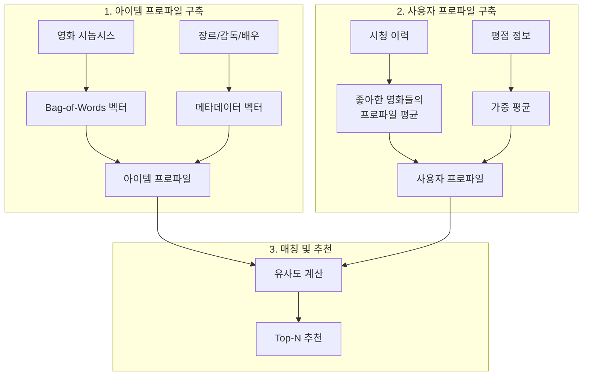
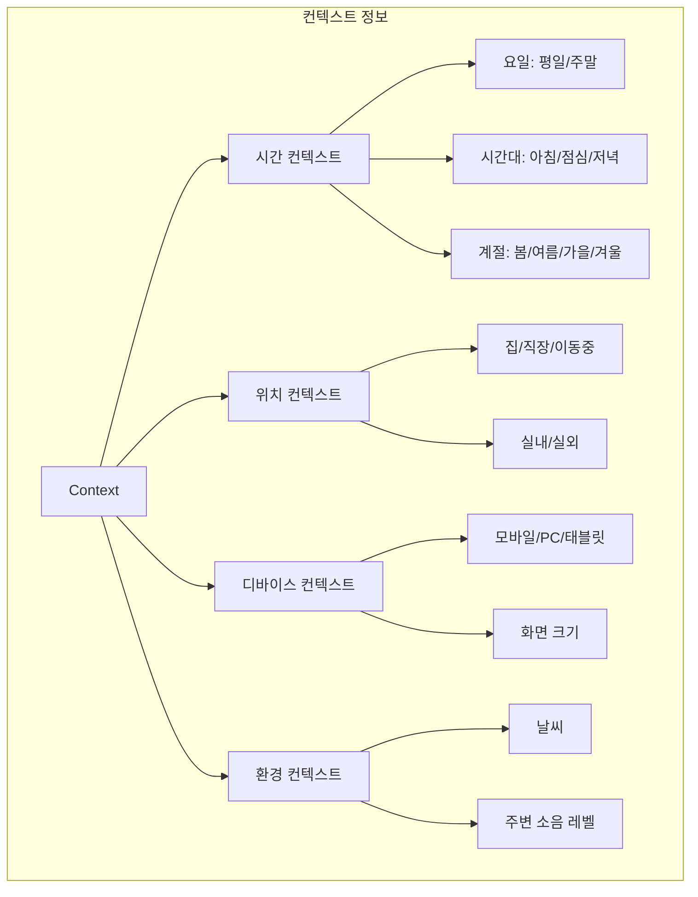

## 📦 사용하는 패키지/기술 버전 정보

- pandas==2.2.3
- numpy==2.3.3
- matplotlib==3.10.1
- scikit-learn==1.6.1
- torch==2.8.0
- deepctr-torch==0.2.9
- scipy==1.15.2

## 🚀 TL;DR

- Collaborative Filtering(CF)은 상호작용 데이터만 사용하기에 콜드 스타트, 시간적 변화, 설명가능성 등에서 한계를 보인다
- Content-based(CB)는 아이템/사용자의 메타데이터를 활용하여 콜드 스타트 문제를 해결하지만 뻔한 추천이 단점이다
- TF-IDF는 문서의 중요 단어를 찾아내는 기법으로, 책 요약 간 유사도를 계산해 컨텐츠 기반 추천을 구현할 수 있다
- Context-aware는 시간, 위치, 디바이스 등 맥락 정보를 활용하여 F(u,i,c) 형태로 추천을 확장한다
- CTR 예측은 클릭 확률을 예측하는 이진 분류 문제로, dense/sparse/embedding feature를 모두 활용한다
- Factorization Machine은 feature 간 2차 상호작용을 모델링하며, MF와 로지스틱 회귀의 일반화로 볼 수 있다
- Wide & Deep은 암기(Wide)와 일반화(Deep)를 결합했고, DeepFM은 여기서 feature engineering을 자동화했다
- 실제 CTR 예측에서 0.37% AUC 개선도 비즈니스적으로 큰 의미를 가진다

## 📓 실습 Jupyter Notebook

- w.i.p.

## 🔍 왜 Collaborative Filtering만으로는 부족한가?

추천 시스템을 처음 배울 때, 우리는 보통 Collaborative Filtering(CF)부터 시작합니다. CF는 "비슷한 사용자들이 좋아한 아이템을 추천하자"는 직관적인 아이디어에서 출발합니다. 하지만 실제 서비스를 운영하다 보면 CF만으로는 해결할 수 없는 상황들을 자주 만나게 됩니다.

### CF의 기본 가정과 한계

CF는 상호작용 데이터만으로도 충분히 사용자의 취향을 파악할 수 있다고 가정합니다. 수식으로 표현하면 compatibility function을 다음과 같이 정의합니다:

$$F(u, i) = \beta_u^T \gamma_i$$

여기서 $\beta_u$는 사용자 u의 잠재 요인(latent factor), $\gamma_i$는 아이템 i의 잠재 요인입니다. 이 두 벡터의 내적이 크면 사용자가 해당 아이템을 좋아할 가능성이 높다고 예측하는 것입니다.

그런데 이 방식에는 근본적인 문제가 있습니다. 만약 새로운 사용자가 가입했거나 새로운 아이템이 등록되었다면 어떻게 될까요? 상호작용 데이터가 없으니 $\beta_u$나 $\gamma_i$를 학습할 수 없고, 결국 추천을 할 수 없게 됩니다. 이것이 바로 **콜드 스타트 문제(Cold Start Problem)**입니다.

### 시간의 흐름을 무시하는 CF

또 다른 문제는 시간적 변화입니다. 사용자의 취향은 시간에 따라 변합니다. 여름에는 시원한 음료를 선호하다가 겨울에는 따뜻한 음료를 찾게 되죠. 이런 시간적 특성(temporal dynamics)을 반영하려면 다음과 같은 형태가 필요합니다:

$$F(u, i, t) \text{ 또는 } F(u(t), i(t))$$

하지만 전통적인 CF는 시간 t를 고려하지 않습니다. 모든 상호작용을 동일한 시점의 것으로 취급하죠.

### 그 외의 CF 한계 상황들

CF가 잘 작동하지 않는 상황을 정리하면 다음과 같습니다:

```mermaid
mindmap
  root((CF의 한계))
    (Cold Start)
      [신규 사용자]
      [신규 아이템]
      [상호작용 부족]
    (시간적 역동성)
      [선호도 변화]
      [트렌드 변화]
      [계절성]
    (특수 요구사항)
      [추천 이유 설명]
      [친구 추천]
      [광고 예산 제약]
    (데이터 특성)
      [희소성(Sparsity)]
      [인기도 편향]
      [긴 꼬리 분포]
```

특히 설명가능성(interpretability)은 중요한 이슈입니다. 사용자에게 "왜 이 아이템을 추천했는지" 설명해야 하는 경우, CF의 잠재 요인들은 해석이 어렵습니다. 반면 "당신이 좋아한 영화와 같은 감독의 작품입니다"라는 설명은 훨씬 직관적이죠.

## 📚 Content-based 접근법: 메타데이터의 힘

### CB의 핵심 아이디어

Content-based(CB) 방법은 아이템이나 사용자의 부가 정보, 즉 **사이드 정보(side information)**를 활용합니다. 왜 '사이드'라고 부를까요? 유저-아이템 상호작용이 '메인' 데이터이고, 그 외의 정보는 '부가적'이라는 의미에서입니다.

CB의 기본 원리를 요리에 비유해보겠습니다. 당신이 이탈리안 파스타를 자주 먹는다면, 추천 시스템은 다른 이탈리안 요리나 파스타 종류를 추천할 것입니다. 이것이 CB의 작동 방식입니다.

### CB 추천 시스템의 3단계 프로세스



예를 들어, 라라랜드를 좋아한 사용자에게 CB 방법을 적용하면:

1. 라라랜드의 특징을 추출합니다 (뮤지컬, 로맨스, 라이언 고슬링 주연)
2. 이 특징들과 유사한 다른 영화를 찾습니다
3. 시카고, 위대한 쇼맨 같은 뮤지컬 영화들을 추천합니다

이것이 때로는 "뻔한 추천"이 되는 이유이기도 합니다. 하지만 콜드 스타트 상황에서는 매우 효과적입니다.

### 콜드 스타트를 해결하는 Pairwise Preference Regression

상호작용 데이터가 전혀 없는 극단적인 상황을 생각해봅시다. 이때도 추천이 가능할까요? 답은 "예"입니다. 사용자 특성 X와 아이템 특성 Z만으로도 선호도를 예측할 수 있습니다:

$$S_{ui} = \sum_{a=1}^{A} \sum_{b=1}^{B} X_{u,a} \cdot W_{a,b} \cdot Z_{i,b}$$

여기서:

- $X_{u,a}$는 사용자 u의 a번째 특성 (예: 나이가 20대인지)
- $Z_{i,b}$는 아이템 i의 b번째 특성 (예: 액션 영화인지)
- $W_{a,b}$는 두 특성 간 상호작용의 강도 (예: 20대가 액션 영화를 얼마나 좋아하는지)

이 방식은 상호작용 데이터 없이도 "20대 남성은 액션 영화를 좋아할 가능성이 높다"같은 일반적인 패턴을 학습할 수 있습니다.

### CB와 CF의 상세 비교

|기준|Collaborative Filtering|Content-based|
|---|---|---|
|**사용 데이터**|상호작용 행렬만|메타데이터 + (선택적)상호작용|
|**User Cold Start**|해결 불가|여전히 어려움|
|**Item Cold Start**|해결 불가|메타데이터로 해결 가능|
|**설명가능성**|낮음 ("비슷한 사용자가 좋아함")|높음 ("같은 장르/감독")|
|**추천 품질**|Popularity bias 문제|뻔한 추천 문제|
|**추천 다양성**|예상치 못한 발견 가능|기존 취향에 제한|
|**계산 복잡도**|사용자/아이템 증가에 따라 증가|특성 수에 비례|

실무에서는 두 방법의 장점을 모두 취하기 위해 하이브리드 접근을 사용합니다. 최근에는 CB라고 하면 대부분 상호작용 데이터도 함께 사용하는 하이브리드 방법을 의미합니다.

## 🔬 TF-IDF로 구현하는 Content-based 추천

### TF-IDF의 직관적 이해

TF-IDF(Term Frequency-Inverse Document Frequency)를 이해하기 위해 도서관을 상상해봅시다. 당신이 "양자역학"에 관한 책을 찾고 있다고 합시다. 어떤 책이 가장 관련이 있을까요?

- "the", "is", "are" 같은 단어가 많이 나오는 책? 아닙니다. 이런 단어는 모든 책에 다 나옵니다.
- "양자", "슈뢰딩거", "불확정성" 같은 단어가 자주 나오는 책? 맞습니다! 이런 단어는 특정 주제의 책에만 나옵니다.

TF-IDF는 바로 이 직관을 수식화한 것입니다:

$$\text{TF-IDF}(t, d) = \text{TF}(t, d) \times \text{IDF}(t)$$

여기서:

- **TF(Term Frequency)**: 문서 d에서 단어 t가 나오는 빈도
- **IDF(Inverse Document Frequency)**: $\log \frac{N}{df(t)}$ (N은 전체 문서 수, df(t)는 단어 t가 나오는 문서 수)

### TF-IDF 계산 예시

4개의 문서로 구체적인 계산을 해봅시다:

|문서|내용|
|---|---|
|문서1|"사과 바나나"|
|문서2|"사과 오렌지 바나나"|
|문서3|"바나나 바나나 포도"|
|문서4|"오렌지"|

**Step 1: TF 계산**

- 문서3에서 "바나나"의 TF = 2/3 = 0.667 (문서3은 총 3개 단어, 바나나가 2번)

**Step 2: IDF 계산**

- "바나나"의 IDF = log(4/3) = 0.287 (전체 4개 문서 중 3개에 등장)
- "포도"의 IDF = log(4/1) = 0.693 (전체 4개 문서 중 1개에만 등장)

**Step 3: TF-IDF 계산**

- 문서3에서 "바나나"의 TF-IDF = 0.667 × 0.287 = 0.191
- 문서3에서 "포도"의 TF-IDF = 0.333 × 0.693 = 0.231

"포도"가 더 높은 TF-IDF 값을 갖는 이유는 이 단어가 문서3을 특징짓는 고유한 단어이기 때문입니다.

### Book Crossing 데이터셋 실습

이제 실제 데이터로 추천 시스템을 만들어봅시다. Book Crossing 데이터셋은 27만 권의 책과 114만 개의 평점을 포함합니다.

```python
import pandas as pd
import numpy as np
import matplotlib.pyplot as plt
from sklearn.feature_extraction.text import TfidfVectorizer
from sklearn.metrics.pairwise import linear_kernel

# 데이터 로드 및 전처리
books_df = pd.read_csv('BX-Books.csv', sep=';', encoding='latin-1')

# 영어 책만 선택
books_english = books_df[books_df['Language'] == 'en']

# 컬럼명을 소문자로 변환 (작업 편의성을 위해)
books_english.columns = [col.lower() for col in books_english.columns]

# 평가가 100개 이상인 책만 선택 (신뢰성 확보)
counts = books_english['book_title'].value_counts()
books_to_include = counts[counts >= 100].index
books_filtered = books_english[books_english['book_title'].isin(books_to_include)]

print(f"필터링 후 책 수: {len(books_filtered)}")
```

### 데이터 탐색 (EDA)

추천 시스템을 만들기 전에 데이터를 이해해야 합니다. 특히 흥미로운 것은 독자 연령대 분석입니다:

```python
# 해리포터, 다빈치 코드, Wild Animus의 독자 연령대 분석
def analyze_reader_age(book_title, books_df):
    """특정 책의 독자 연령대 분석"""
    readers = books_df[books_df['book_title'] == book_title]
    
    # 연령대 구간 정의
    age_bins = [0, 18, 29, 35, 100]
    age_labels = ['12-18', '19-29', '30-35', '36+']
    
    # 연령대별 독자 수 계산
    readers['age_group'] = pd.cut(readers['age'], bins=age_bins, labels=age_labels)
    age_distribution = readers['age_group'].value_counts(normalize=True)
    
    return age_distribution

# 세 책의 독자 분포 비교
books_to_analyze = ['Harry Potter and the Sorcerer\'s Stone', 
                   'The Da Vinci Code', 
                   'Wild Animus']

age_comparison = pd.DataFrame()
for book in books_to_analyze:
    age_dist = analyze_reader_age(book, books_filtered)
    age_comparison[book] = age_dist

# 시각화
age_comparison.plot(kind='bar', figsize=(10, 6))
plt.title('독자 연령대 분포 비교')
plt.ylabel('비율')
plt.xlabel('연령대')
plt.legend(title='도서')
plt.xticks(rotation=0)
plt.show()
```

분석 결과의 인사이트:

- **해리포터**: 35세 이상이 41%로 가장 많음 (어린이 책이지만 어른들도 많이 읽음)
- **다빈치 코드**: 30세 이상이 약 80% (성인 독자 중심)
- **Wild Animus**: 19세 이상에서 균등 분포 (평점 1점인 책, 모든 연령대가 싫어함)

### TF-IDF 기반 추천 시스템 구현

```python
# TF-IDF 벡터화 (핵심 단계)
# stop_words='english'는 'the', 'is' 같은 불용어를 자동 제거
tfidf_vectorizer = TfidfVectorizer(
    stop_words='english',
    max_features=5000  # 상위 5000개 단어만 사용
)

# 책 요약 데이터를 TF-IDF 벡터로 변환
# fillna('')는 요약이 없는 책을 빈 문자열로 처리
books_summary = books_filtered.groupby(['book_title', 'summary'])['rating'].mean().reset_index()
tfidf_matrix = tfidf_vectorizer.fit_transform(books_summary['summary'].fillna(''))

# 코사인 유사도 계산
# linear_kernel은 실제로 코사인 유사도를 계산하는 효율적인 방법
cosine_sim = linear_kernel(tfidf_matrix, tfidf_matrix)

# 책 제목과 인덱스를 매핑하는 딕셔너리 생성
indices = pd.Series(books_summary.index, index=books_summary['book_title']).drop_duplicates()

def get_recommendations(title, cosine_sim=cosine_sim):
    """
    주어진 책과 유사한 책을 추천하는 함수
    
    작동 원리:
    1. 입력된 책의 인덱스를 찾음
    2. 해당 책과 다른 모든 책의 유사도를 추출
    3. 유사도가 높은 순으로 정렬
    4. 상위 5개 추천 (자기 자신 제외)
    """
    # 책 제목을 인덱스로 변환
    idx = indices[title]
    
    # 모든 책과의 유사도 점수 가져오기
    sim_scores = list(enumerate(cosine_sim[idx]))
    
    # 유사도 기준 내림차순 정렬
    sim_scores = sorted(sim_scores, key=lambda x: x[1], reverse=True)
    
    # 가장 유사한 5개 책 선택 (자기 자신 제외)
    sim_scores = sim_scores[1:6]
    
    # 책 인덱스 추출
    book_indices = [i[0] for i in sim_scores]
    
    # 책 제목 반환
    return books_summary['book_title'].iloc[book_indices].tolist()

# 추천 테스트
print("Harry Potter와 유사한 책들:")
recommendations = get_recommendations('Harry Potter and the Sorcerer\'s Stone')
for i, book in enumerate(recommendations, 1):
    print(f"{i}. {book}")
```

결과 분석:

- 해리포터를 입력하면 대부분 해리포터 시리즈가 추천됩니다
- 이는 CB의 한계를 보여줍니다: 같은 시리즈, 같은 작가의 작품이 너무 자주 추천됨
- 하지만 콜드 스타트 상황에서는 이런 추천도 의미가 있습니다

## 🌐 Context-aware 추천: 상황을 이해하는 AI

### 컨텍스트의 중요성

같은 사용자라도 상황에 따라 선호가 달라집니다. 예를 들어:

- **평일 아침 출근길**: 빠른 템포의 음악, 뉴스 팟캐스트
- **주말 오후 집에서**: 편안한 재즈, 긴 다큐멘터리
- **운동 중**: 강렬한 비트의 운동 음악

이런 맥락(context)을 고려하면 추천의 품질이 크게 향상됩니다. 수식으로 표현하면:

$$F(u, i) \rightarrow F(u, i, c)$$

여기서 c는 컨텍스트 벡터로, 시간, 위치, 날씨, 디바이스 등의 정보를 포함합니다.

### 컨텍스트의 종류와 활용



### Context-aware를 지도학습으로 접근하기

Context-aware 추천은 일반적인 지도학습 문제로 변환할 수 있습니다:

|User ID|Item ID|Time|Location|Device|Rating (Target)|
|---|---|---|---|---|---|
|U1|I1|월요일_아침|집|모바일|5|
|U1|I1|금요일_저녁|직장|PC|3|
|U2|I3|주말_오후|카페|태블릿|4|

같은 사용자-아이템 쌍이라도 컨텍스트에 따라 평점이 다른 것을 볼 수 있습니다. 이것이 Context-aware의 핵심입니다.

## 💡 CTR 예측: Context-aware의 대표적 응용

### CTR 예측 문제의 정의

CTR(Click-Through Rate) 예측은 "사용자가 이 광고/아이템을 클릭할 확률은?"을 묻는 문제입니다. 수식으로 표현하면:

$$P(\text{click} | \text{user}, \text{item}, \text{context}) \in [0, 1]$$

이는 이진 분류 문제로, 실제 비즈니스에 직접적인 영향을 미칩니다. 넷플릭스의 연구에 따르면, AUC 0.002(0.2%) 개선이 온라인에서 3.9%의 앱 설치 증가로 이어졌습니다.

### CTR 예측에 사용되는 Feature 타입

CTR 예측에서는 다양한 종류의 feature를 활용합니다:

**1. Dense Features (연속형 변수)**

- 정의: 실수 값을 갖는 numeric 변수
- 예시:
    - 사용자의 평균 클릭률: 0.023
    - 현재 기온: 25.5도
    - 특정 카테고리의 평균 CTR: 0.15
    - 사용자의 앱 사용 시간: 45.3분

**2. Sparse Features (범주형 변수)**

- 정의: 대부분이 0이고 소수만 1인 변수
- One-hot encoding 예시:
    
    ```
    요일 = 화요일 → [0, 1, 0, 0, 0, 0, 0]  # 7차원 벡터
    ```
    
- Multi-hot encoding 예시:
    
    ```
    선호 장르 = [액션, SF] → [1, 0, 1, 0, 0, 0]  # 액션과 SF만 1
    ```
    

**3. Embedding Features**

- 정의: 다른 ML 모델에서 학습된 dense 벡터
- 예시:
    - Word2Vec으로 학습한 단어 임베딩
    - 사전 학습된 이미지 특성
    - BERT에서 추출한 문장 임베딩

## 🏗️ Factorization Machine: Feature 상호작용의 모델링

### FM의 직관적 이해

Factorization Machine(FM)을 이해하기 위해 영화 추천 예시를 들어봅시다. Alice가 Titanic을 평가하는 상황을 생각해보면:

```
Alice(사용자) × Titanic(영화) × 5월(시간) × 이전에_본_영화(컨텍스트) = 평점
```

FM은 이런 모든 feature 간의 상호작용을 모델링합니다. 수식으로 표현하면:

$$\hat{y} = w_0 + \sum_{i=1}^{n} w_i x_i + \sum_{i=1}^{n} \sum_{j=i+1}^{n} \langle v_i, v_j \rangle x_i x_j$$

각 항의 의미:

- $w_0$: 전역 바이어스 (모든 평점의 평균)
- $\sum w_i x_i$: 선형 효과 (각 feature의 독립적 영향)
- $\sum \sum \langle v_i, v_j \rangle x_i x_j$: 2차 상호작용 (feature 쌍의 시너지)

### FM을 구체적인 데이터로 이해하기

실제 데이터가 어떻게 FM의 입력이 되는지 봅시다:

**원시 데이터:**

```
Alice, Titanic, 2009년 5월, 평점 5
Bob, Notting Hill, 2009년 6월, 평점 3
```

**Feature 벡터로 변환:**

||User:Alice|User:Bob|User:Charlie|Movie:Titanic|Movie:Notting Hill|Other Movies|Time|Last Movie|Rating|
|---|---|---|---|---|---|---|---|---|---|
|데이터1|1|0|0|1|0|[0.5, 0.5, 0, 0]|13|[0,1,0,0]|5|
|데이터2|0|1|0|0|1|[0.33, 0, 0.33, 0.33]|15|[1,0,0,0]|3|

각 feature의 의미:

- **User, Movie**: One-hot encoding (해당하는 것만 1)
- **Other Movies Rated**: 사용자가 평가한 다른 영화들 (multi-hot, 정규화)
- **Time**: 2009년 1월부터 경과한 개월 수
- **Last Movie Rated**: 바로 이전에 본 영화

FM은 이 모든 feature의 상호작용을 학습합니다. 예를 들어:

- Alice × Titanic의 상호작용
- Titanic × 5월의 상호작용
- Alice × 이전에_본_영화의 상호작용

## 🌉 Wide & Deep Learning: 암기와 일반화의 조화

### 두 컴포넌트의 역할

Wide & Deep 모델은 서로 다른 강점을 가진 두 부분을 결합합니다:

```mermaid
graph TB
    subgraph "입력 데이터"
        I1[원시 Features]
        I2[범주형 Features]
    end
    
    subgraph "Wide Component (암기)"
        I1 --> W1[Cross-product<br/>Transformation]
        W1 --> W2[로지스틱 회귀]
        W2 --> W3[특정 패턴 암기]
    end
    
    subgraph "Deep Component (일반화)"
        I2 --> D1[Embedding<br/>Layer]
        D1 --> D2[Hidden Layer 1<br/>(ReLU)]
        D2 --> D3[Hidden Layer 2<br/>(ReLU)]
        D3 --> D4[Hidden Layer 3<br/>(ReLU)]
        D4 --> D5[패턴 일반화]
    end
    
    W3 --> O[결합]
    D5 --> O
    O --> S[Sigmoid]
    S --> P[P(click)]
```

### Wide Component의 구체적 작동

Wide 파트는 cross-product transformation을 사용합니다. 이게 무엇일까요?

예시: "성별=여성" AND "언어=영어"

```python
# Cross-product 계산
gender_female = 1  # 여성이면 1
language_english = 1  # 영어면 1
cross_product = gender_female * language_english  # = 1

# 둘 다 만족할 때만 1, 아니면 0
```

Wide 모델의 수식: $$y = w^T x + w^T_{cross} \phi(x) + b$$

여기서 $\phi(x)$는 cross-product transformation입니다.

**장점**: "프라이드 치킨을 주문한 사람은 와플도 주문한다"같은 특정 패턴을 정확히 기억 **단점**: 본 적 없는 조합은 예측 못함 (예: "프라이드 치킨 + 팬케이크")

### Deep Component의 학습 과정

Deep 파트는 임베딩을 통해 의미를 학습합니다:

1. **범주형 변수를 임베딩으로 변환**
    
    - "프라이드 치킨" → [0.2, -0.5, 0.8, ...] (32차원 벡터)
    - "버거" → [0.3, -0.4, 0.7, ...] (유사한 벡터)
2. **임베딩 공간에서 유사성 발견**
    
    - 프라이드 치킨과 버거가 가까운 위치 → 둘 다 패스트푸드
3. **일반화된 패턴 학습**
    
    - "패스트푸드를 좋아하는 사람"이라는 일반 패턴 학습

**장점**: 새로운 조합도 예측 가능 **단점**: 때로는 과도한 일반화 (얼죽아인데 따뜻한 라떼 추천)

### 실제 성능: 오프라인 vs 온라인

Wide & Deep의 구글 플레이스토어 실험 결과:

|메트릭|Wide only|Deep only|Wide & Deep|
|---|---|---|---|
|오프라인 AUC|0.726|0.722|0.728 (+0.275%)|
|온라인 앱 설치|baseline|+2.9%|+3.9%|

주목할 점:

- 오프라인에서는 Wide가 Deep보다 좋았지만
- 온라인에서는 Deep이 Wide보다 좋았고
- 결합 모델이 항상 최고 성능

이는 오프라인 평가와 실제 서비스 성능이 다를 수 있음을 보여줍니다.

## 🚀 DeepFM: Feature Engineering의 자동화

### Wide & Deep의 한계와 DeepFM의 해결책

Wide & Deep에서는 어떤 feature를 cross-product할지 수동으로 정해야 했습니다. 예를 들어:

- "installed_apps × impression_apps"는 넣을까?
- "gender × language"는 어떻게?

이런 결정을 사람이 해야 한다는 것이 부담입니다. DeepFM은 이를 자동화합니다.

### DeepFM의 구조

```mermaid
graph LR
    subgraph "입력층"
        I[Sparse Features] --> E[Shared Embeddings]
    end
    
    subgraph "FM Component"
        E --> FM1[Addition:<br/>Σxi]
        E --> FM2[Inner Product:<br/>ΣΣ⟨vi,vj⟩xixj]
    end
    
    subgraph "DNN Component"
        E --> D1[Concatenate]
        D1 --> D2[Dense(400)]
        D2 --> D3[Dense(400)]
        D3 --> D4[Dense(400)]
        D4 --> D5[Dense(1)]
    end
    
    FM1 --> ADD[+]
    FM2 --> ADD
    D5 --> ADD
    ADD --> OUT[ŷ]
```

핵심 차이점:

- **Wide & Deep**: Wide와 Deep이 다른 입력 사용
- **DeepFM**: FM과 DNN이 **같은 임베딩 공유**

이로 인한 장점:

1. End-to-end 학습 (feature engineering 불필요)
2. 저차원과 고차원 상호작용 동시 포착
3. 학습이 더 효율적 (임베딩 공유)

### 성능 비교

다양한 데이터셋에서의 성능 (AUC, 높을수록 좋음):

|모델|Criteo|Company|
|---|---|---|
|LR (Logistic Regression)|0.7749|0.8322|
|FM|0.7900|0.8377|
|FNN|0.7958|0.8395|
|PNN|0.7946|0.8401|
|Wide & Deep|0.7991|0.8443|
|**DeepFM**|**0.8007**|**0.8472**|

개선폭:

- Wide & Deep 대비: +0.16% (Criteo), +0.29% (Company)
- LR 대비: +2.58% (Criteo), +1.50% (Company)

작은 개선으로 보이지만, 실제 비즈니스에서는:

- 0.275% AUC 개선 → 3.9% 앱 설치 증가 (구글 사례)
- 1% CTR 개선 → 연간 수백만 달러 추가 매출 (대형 플랫폼)

## 🛠️ DeepFM 실습: Book Crossing 데이터로 평점 예측

### 데이터 준비와 전처리

DeepCTR-Torch 라이브러리를 사용하여 DeepFM을 구현해봅시다:

```python
import pandas as pd
import numpy as np
from sklearn.preprocessing import LabelEncoder
from sklearn.model_selection import train_test_split
from deepctr_torch.inputs import SparseFeat, get_feature_names
from deepctr_torch.models import DeepFM
import torch

# 1. 데이터 로드
books_df = pd.read_csv('book_crossing.csv')
print(f"원본 데이터 shape: {books_df.shape}")

# 2. 데이터 정제
# 0점 평점 제거 (0점이 지나치게 많음)
books_df = books_df[books_df['rating'] > 0]
print(f"0점 제거 후: {books_df.shape}")

# 3. Feature 선택 (유니크 값이 너무 많지 않은 것들)
print("\n각 컬럼의 유니크 값 개수:")
for col in books_df.columns:
    print(f"{col}: {books_df[col].nunique()}")

# 적절한 feature 선택
selected_features = ['age', 'year_of_publication', 'category', 
                    'country', 'publisher', 'book_author']
```

### Feature Engineering의 중요성

CTR 예측에서 feature engineering이 왜 중요한지 봅시다:

```python
# 빈도 기반 필터링 - 왜 필요한가?
# 예: author가 10만 명이고 데이터가 10만 개면 
# 각 author당 평균 1개 데이터 → 학습 불가능

# 100번 이상 등장하는 저자만 선택
author_counts = books_df['book_author'].value_counts()
print(f"전체 저자 수: {len(author_counts)}")
print(f"1번만 등장하는 저자: {sum(author_counts == 1)}")

popular_authors = author_counts[author_counts >= 100].index
books_df = books_df[books_df['book_author'].isin(popular_authors)]
print(f"필터링 후 저자 수: {books_df['book_author'].nunique()}")

# 연속 변수를 범주형으로 변환
# Age: 실제 나이 → 연령대로 그룹화
books_df['age_group'] = (books_df['age'] / 10).round().astype(int)
# 0: 0-9세, 1: 10-19세, ..., 9: 90-99세

# Year: 실제 연도 → 10년 단위로 그룹화  
books_df['year_group'] = ((books_df['year_of_publication'] - 1900) / 10).round().astype(int)
# 예: 1995년 → 9, 2005년 → 10
```

### DeepCTR 형식으로 데이터 변환

```python
# Sparse features 정의
sparse_features = ['user_id', 'isbn', 'year_group', 
                   'age_group', 'category', 'book_author']

# Label Encoding - 왜 필요한가?
# 범주형 변수를 정수로 변환해야 임베딩 레이어에서 사용 가능
label_encoders = {}
for feat in sparse_features:
    lbe = LabelEncoder()
    books_df[feat] = lbe.fit_transform(books_df[feat])
    label_encoders[feat] = lbe  # 나중에 역변환을 위해 저장

# DeepCTR의 SparseFeat 객체 생성
fixlen_feature_columns = []
for feat in sparse_features:
    fixlen_feature_columns.append(
        SparseFeat(
            name=feat,
            vocabulary_size=books_df[feat].nunique(),  # 범주 개수
            embedding_dim=32  # 임베딩 차원 (보통 8~64)
        )
    )

# 왜 32차원 임베딩?
# - 너무 작으면: 표현력 부족
# - 너무 크면: 과적합, 메모리 낭비
# - 경험적으로: sqrt(vocabulary_size) ~ log2(vocabulary_size) * 4
```

### 모델 구성과 학습

```python
# DeepFM 모델 초기화
model = DeepFM(
    linear_feature_columns=fixlen_feature_columns,  # FM 파트용
    dnn_feature_columns=fixlen_feature_columns,     # DNN 파트용 (같은 것 사용)
    task='regression',  # 평점 예측 (CTR은 'binary')
    device='cuda' if torch.cuda.is_available() else 'cpu'
)

# 모델 컴파일
model.compile(
    optimizer="adam",
    loss="mse",  # 회귀 문제이므로 MSE
    metrics=["mse"]
)

# 데이터 분할
train, test = train_test_split(books_df, test_size=0.1, random_state=42)

# Dictionary 형식으로 변환 (DeepCTR 요구사항)
feature_names = get_feature_names(fixlen_feature_columns)
train_model_input = {name: train[name].values for name in feature_names}
test_model_input = {name: test[name].values for name in feature_names}

# 학습
history = model.fit(
    train_model_input, 
    train['rating'].values,
    batch_size=256,
    epochs=10,
    validation_split=0.2,
    verbose=2
)

# 학습 과정 시각화
import matplotlib.pyplot as plt

plt.figure(figsize=(12, 4))
plt.subplot(1, 2, 1)
plt.plot(history.history['loss'], label='Train Loss')
plt.plot(history.history['val_loss'], label='Validation Loss')
plt.xlabel('Epoch')
plt.ylabel('MSE')
plt.legend()
plt.title('학습 곡선')

plt.subplot(1, 2, 2)
# 실제값 vs 예측값 산점도
predictions = model.predict(test_model_input, batch_size=256)
plt.scatter(test['rating'].values, predictions, alpha=0.5)
plt.plot([1, 10], [1, 10], 'r--')  # 완벽한 예측선
plt.xlabel('실제 평점')
plt.ylabel('예측 평점')
plt.title('예측 성능')
plt.show()
```

### 성능 평가와 해석

```python
# 1. DeepFM 성능
from sklearn.metrics import mean_squared_error, mean_absolute_error

deepfm_mse = mean_squared_error(test['rating'].values, predictions)
deepfm_mae = mean_absolute_error(test['rating'].values, predictions)
print(f"DeepFM MSE: {deepfm_mse:.4f}")
print(f"DeepFM MAE: {deepfm_mae:.4f}")

# 2. Baseline과 비교 (평균값 예측)
train_mean = train['rating'].mean()
baseline_predictions = np.full(len(test), train_mean)
baseline_mse = mean_squared_error(test['rating'].values, baseline_predictions)
print(f"\nBaseline (평균값) MSE: {baseline_mse:.4f}")

# 3. 개선율 계산
improvement = (baseline_mse - deepfm_mse) / baseline_mse * 100
print(f"개선율: {improvement:.2f}%")

# 실습 결과 해석
if improvement > 0:
    print(f"\n✅ DeepFM이 단순 평균보다 {improvement:.2f}% 좋은 성능!")
    print("하지만 실제 서비스에서는:")
    print("- 더 많은 feature 추가 필요")
    print("- 하이퍼파라미터 튜닝 필요")
    print("- A/B 테스트로 실제 효과 검증 필요")
```

### 실습에서 배운 핵심 포인트

1. **Feature Engineering의 중요성**
    
    - 빈도 기반 필터링으로 희소성 문제 해결
    - 연속 변수를 적절한 범주형으로 변환
2. **임베딩 차원 선택**
    
    - vocabulary_size와 데이터 크기를 고려
    - 보통 8~64 차원 사용
3. **DeepFM의 장점 확인**
    
    - Feature engineering 없이도 상호작용 학습
    - FM과 DNN의 시너지 효과
4. **작은 개선도 의미 있음**
    
    - 7.4% MSE 개선이 작아 보여도
    - 대규모 서비스에서는 큰 비즈니스 임팩트

## 🎯 실무 적용 가이드

### 추천 시스템 방법론 선택 플로우차트

```mermaid
flowchart TD
    Start[새로운 추천 시스템 구축] --> Q1{서비스 단계?}
    
    Q1 -->|초기 서비스| CB[Content-based로 시작]
    Q1 -->|성숙 서비스| Q2{데이터 양?}
    
    CB --> Q3{성능 충분?}
    Q3 -->|아니오| CB2[메타데이터 추가]
    Q3 -->|예| Monitor1[모니터링하며<br/>데이터 수집]
    
    Q2 -->|적음| Hybrid1[CB + 간단한 CF]
    Q2 -->|많음| Q4{콜드 스타트<br/>문제 심각?}
    
    Q4 -->|예| Hybrid2[CF + CB 하이브리드]
    Q4 -->|아니오| Q5{컨텍스트<br/>중요?}
    
    Q5 -->|예| CARS[Context-aware<br/>(DeepFM 등)]
    Q5 -->|아니오| CF[Pure CF<br/>(MF, ALS 등)]
    
    Monitor1 --> Growth[데이터 증가시<br/>CF/CARS로 전환]
```

### 각 상황별 추천 전략

**신규 서비스 (콜드 스타트)**

1. Content-based로 시작 (메타데이터 활용)
2. 인기도 기반 추천 병행
3. 사용자 온보딩시 선호도 조사

**데이터가 쌓인 후**

1. CF 도입으로 serendipity 확보
2. 하이브리드 앙상블로 안정성 향상
3. A/B 테스트로 점진적 전환

**대규모 서비스**

1. Context-aware로 정교한 개인화
2. 실시간 feature engineering
3. 온라인 학습으로 빠른 적응

### 성공적인 추천 시스템을 위한 체크리스트

✅ **데이터 준비**

- [ ] 충분한 상호작용 데이터 (사용자당 10개 이상)
- [ ] 품질 좋은 메타데이터
- [ ] 컨텍스트 정보 수집 체계

✅ **모델 선택**

- [ ] 서비스 특성에 맞는 방법론
- [ ] 콜드 스타트 대응 전략
- [ ] 확장 가능한 아키텍처

✅ **평가와 개선**

- [ ] 오프라인 평가 지표 설정
- [ ] A/B 테스트 환경 구축
- [ ] 사용자 피드백 수집

✅ **운영 고려사항**

- [ ] 실시간 서빙 가능 여부
- [ ] 모델 업데이트 주기
- [ ] 설명가능한 추천 제공

## 💭 마무리: 추천 시스템의 진화와 미래

추천 시스템은 단순한 "비슷한 것 찾기"에서 시작해 이제는 사용자의 상황과 맥락을 이해하는 지능형 시스템으로 진화했습니다.

이 진화 과정을 정리하면:

1. **CF 시대**: 상호작용 데이터의 패턴 발견
2. **CB 시대**: 콘텐츠 이해와 콜드 스타트 해결
3. **Context-aware 시대**: 상황 인지와 실시간 개인화
4. **딥러닝 시대**: 자동 feature 학습과 end-to-end 최적화

앞으로의 추천 시스템은 더욱 복잡하고 정교해질 것입니다. 하지만 핵심은 변하지 않습니다: **사용자가 원하는 것을, 원하는 시점에, 적절한 방식으로 제공하는 것**. 이를 위해서는 CF, CB, Context-aware 모든 방법론을 이해하고 적절히 조합할 수 있어야 합니다.

넷플릭스의 사례에서 배웠듯이, 처음에는 딥러닝 모델이 전통적 방법보다 성능이 낮았지만, 다양한 heterogeneous feature를 추가하자 비로소 우월한 성과를 보였습니다. 이는 모델의 복잡성보다 **적절한 정보의 활용**이 더 중요함을 시사합니다.

여러분이 추천 시스템을 만들 때는 가장 단순한 방법부터 시작하세요. 데이터가 쌓이고 서비스가 성장하면서 점진적으로 고도화하는 것이 성공의 열쇠입니다.