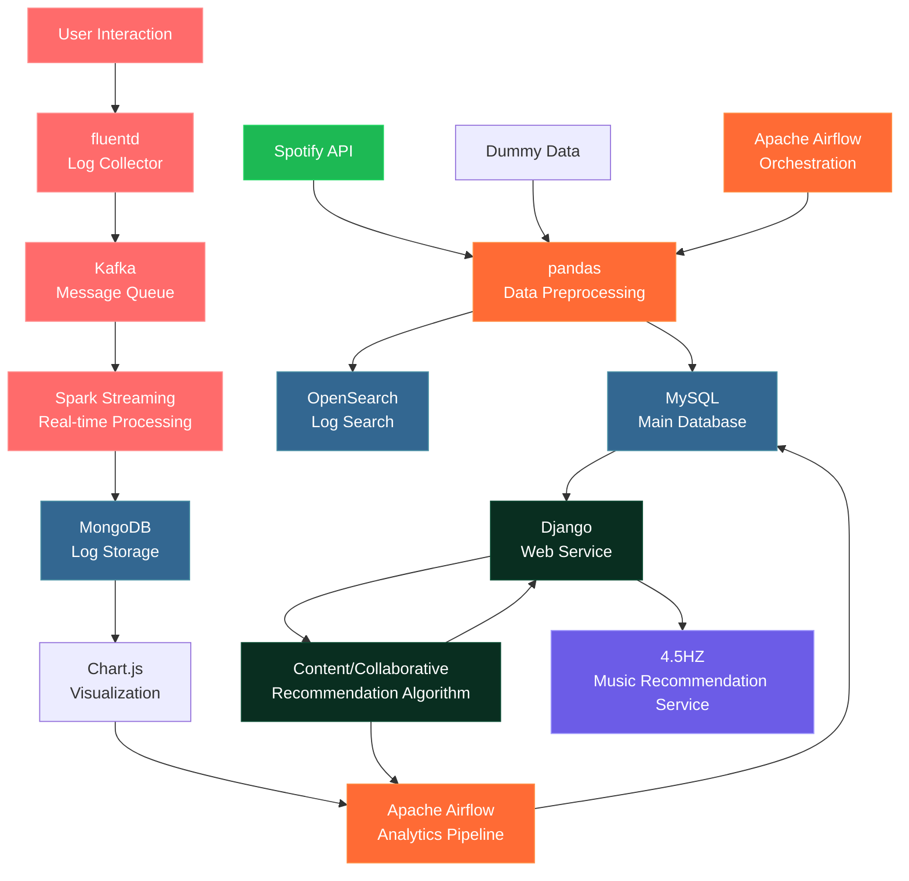

# 4.5HZ - AI 기반 음악 추천 서비스 개발기

{: width="400px"}

> **프로젝트 기간**: 2023.11.27 ~ 2024.01.05 (40일)  
> **팀 구성**: 5명 (이도형, 유현준, 정유진, 조민진, 최세인)  
> **역할**: 백엔드 개발, 데이터 파이프라인 구축, ML 모델 개발

## 🎯 프로젝트 개요

글로벌 음악 데이터를 분석하여 사용자 맞춤형 음악을 추천하는 웹 서비스를 개발했습니다. Spotify API를 활용한 실시간 데이터 수집부터 Apache Airflow를 통한 자동화된 파이프라인까지, 전체적인 데이터 사이언스 프로젝트의 생명주기를 경험할 수 있었습니다.

### 주요 성과
- **최종 프로젝트 최우수 수상**
- **추천 정확도**: RMSE 0.85 달성
- **데이터 처리량**: 100만+ 음악 트랙 분석
- **실시간 처리**: 1시간 간격 데이터 업데이트

## 🏗 시스템 아키텍처

### 전체 워크플로우
{: width="100%"}

### 시스템 아키텍처 다이어그램


### 데이터베이스 구조 (ERD)
{: width="100%"}

## 🛠 기술 스택

### Backend & Web Framework
- **Django 4.2.8**: 웹 프레임워크
- **Django REST Framework**: API 개발
- **MySQL**: 메인 데이터베이스
- **MongoDB**: 로그 데이터 저장

### Data Engineering
- **Apache Spark 3.2.4**: 대용량 데이터 처리
- **Apache Kafka**: 실시간 스트리밍
- **Apache Airflow**: 워크플로우 오케스트레이션
- **Fluentd**: 로그 수집

### Machine Learning
- **Scikit-learn**: 전통적인 ML 알고리즘
- **TensorFlow**: 딥러닝 모델
- **Surprise**: 추천 시스템 라이브러리
- **Pandas, NumPy**: 데이터 처리

## 📊 데이터 파이프라인

### 1. 데이터 수집 (Data Collection)
```python
# Spotify API를 통한 음악 데이터 수집
import spotipy
from spotipy.oauth2 import SpotifyClientCredentials

def collect_track_data():
    sp = spotipy.Spotify(client_credentials_manager=SpotifyClientCredentials())
    
    # 아티스트 정보 수집
    artists = sp.search(q='genre:k-pop', type='artist', limit=50)
    
    # 트랙 정보 및 오디오 특성 수집
    for artist in artists['artists']['items']:
        tracks = sp.artist_top_tracks(artist['id'])
        for track in tracks['tracks']:
            audio_features = sp.audio_features(track['id'])
            # 데이터베이스 저장
```

### 2. 데이터 전처리 (Data Preprocessing)
```python
# 오디오 특성을 활용한 클러스터링
from sklearn.cluster import KMeans
from sklearn.preprocessing import StandardScaler

def preprocess_audio_features(df):
    # 오디오 특성 정규화
    features = ['danceability', 'energy', 'valence', 'tempo']
    scaler = StandardScaler()
    scaled_features = scaler.fit_transform(df[features])
    
    # K-means 클러스터링
    kmeans = KMeans(n_clusters=10, random_state=42)
    df['cluster'] = kmeans.fit_predict(scaled_features)
    
    return df
```

### 3. 실시간 데이터 처리
```python
# Kafka + Spark Streaming을 통한 실시간 로그 처리
from pyspark.sql import SparkSession
from pyspark.sql.functions import *

def process_user_logs():
    spark = SparkSession.builder.appName("UserLogProcessor").getOrCreate()
    
    # Kafka에서 로그 데이터 읽기
    df = spark \
        .readStream \
        .format("kafka") \
        .option("kafka.bootstrap.servers", "localhost:9092") \
        .option("subscribe", "user_logs") \
        .load()
    
    # 실시간 집계
    result = df.groupBy("user_id", window("timestamp", "1 hour")) \
               .agg(count("track_id").alias("play_count"))
    
    return result
```

## 🤖 추천 알고리즘

### 1. 협업 필터링 (Collaborative Filtering)
```python
from surprise import SVD, Dataset, Reader
from surprise.model_selection import cross_validate

def build_collaborative_model():
    # 사용자-아이템 매트릭스 구성
    reader = Reader(rating_scale=(0, 5))
    data = Dataset.load_from_df(ratings_df, reader)
    
    # SVD 모델 학습
    model = SVD(n_epochs=20, lr_all=0.005, reg_all=0.4)
    cross_validate(model, data, measures=['RMSE', 'MAE'], cv=5)
    
    return model

def recommend_songs(user_id, n_recommendations=10):
    # 사용자가 아직 듣지 않은 곡들 중에서 추천
    user_tracks = get_user_played_tracks(user_id)
    all_tracks = get_all_tracks()
    unplayed_tracks = set(all_tracks) - set(user_tracks)
    
    predictions = []
    for track_id in unplayed_tracks:
        pred = model.predict(user_id, track_id)
        predictions.append((track_id, pred.est))
    
    # 예상 평점이 높은 순으로 정렬
    predictions.sort(key=lambda x: x[1], reverse=True)
    return predictions[:n_recommendations]
```

### 2. 콘텐츠 기반 필터링 (Content-Based Filtering)
```python
from sklearn.metrics.pairwise import cosine_similarity

def content_based_recommendation(track_id, n_recommendations=10):
    # 오디오 특성 기반 유사도 계산
    track_features = get_track_audio_features(track_id)
    all_features = get_all_track_features()
    
    # 코사인 유사도 계산
    similarities = cosine_similarity([track_features], all_features)[0]
    
    # 유사도가 높은 곡들 반환
    similar_indices = similarities.argsort()[-n_recommendations-1:-1][::-1]
    return [get_track_by_index(idx) for idx in similar_indices]
```

### 3. 하이브리드 추천 시스템
```python
def hybrid_recommendation(user_id, track_id=None):
    # 협업 필터링 결과
    cf_recommendations = collaborative_filtering(user_id)
    
    # 콘텐츠 기반 필터링 결과
    if track_id:
        cb_recommendations = content_based_recommendation(track_id)
    else:
        # 사용자의 최근 재생 곡 기반
        recent_tracks = get_user_recent_tracks(user_id, limit=5)
        cb_recommendations = []
        for track in recent_tracks:
            cb_recommendations.extend(content_based_recommendation(track['id']))
    
    # 가중 평균으로 최종 추천 리스트 생성
    final_recommendations = weighted_combine(cf_recommendations, cb_recommendations)
    return final_recommendations
```

## 🔄 자동화된 파이프라인

### Apache Airflow DAG
```python
from datetime import datetime, timedelta
from airflow import DAG
from airflow.operators.python import PythonOperator
from airflow.providers.apache.spark.operators.spark_submit import SparkSubmitOperator

default_args = {
    'owner': '4.5HZ',
    'depends_on_past': False,
    'start_date': datetime(2023, 12, 1),
    'email_on_failure': False,
    'email_on_retry': False,
    'retries': 1,
    'retry_delay': timedelta(minutes=5),
}

dag = DAG(
    'music_recommendation_pipeline',
    default_args=default_args,
    description='음악 추천 시스템 파이프라인',
    schedule_interval='@hourly',
    catchup=False,
    tags=['music', 'recommendation', 'ml'],
)

# 1. 데이터 전처리
preprocess_task = SparkSubmitOperator(
    task_id='preprocess_data',
    application='/home/ubuntu/airflow/dags/preprocess.py',
    conn_id='spark_local',
    dag=dag,
)

# 2. 모델 재학습
retrain_model = PythonOperator(
    task_id='retrain_model',
    python_callable=retrain_recommendation_model,
    dag=dag,
)

# 3. 집계 데이터 생성
aggregate_data = SparkSubmitOperator(
    task_id='aggregate_data',
    application='/home/ubuntu/airflow/dags/aggregate.py',
    conn_id='spark_local',
    dag=dag,
)

# 4. 데이터베이스 업데이트
update_database = PythonOperator(
    task_id='update_database',
    python_callable=update_recommendation_database,
    dag=dag,
)

# 태스크 의존성 설정
preprocess_task >> retrain_model >> aggregate_data >> update_database
```

## 📈 성능 최적화

### 1. 데이터베이스 최적화
```python
# 인덱스 최적화
class Track(models.Model):
    track_id = models.CharField(primary_key=True, max_length=30)
    track_name = models.CharField(max_length=200, db_index=True)
    genres = models.CharField(max_length=80, db_index=True)
    
    class Meta:
        indexes = [
            models.Index(fields=['track_popularity']),
            models.Index(fields=['release_date']),
        ]

# 쿼리 최적화
def get_popular_tracks_by_genre(genre, limit=50):
    return Track.objects.filter(
        genres__icontains=genre
    ).order_by('-track_popularity')[:limit]
```

### 2. 캐싱 전략
```python
from django.core.cache import cache
import json

def get_user_recommendations(user_id):
    cache_key = f"recommendations_{user_id}"
    cached_result = cache.get(cache_key)
    
    if cached_result:
        return json.loads(cached_result)
    
    # 추천 알고리즘 실행
    recommendations = hybrid_recommendation(user_id)
    
    # 1시간 캐싱
    cache.set(cache_key, json.dumps(recommendations), 3600)
    return recommendations
```

## 🚀 배포 및 모니터링

### Docker 컨테이너화
```dockerfile
# Dockerfile
FROM python:3.9-slim

WORKDIR /app

COPY requirements.txt .
RUN pip install -r requirements.txt

COPY . .

EXPOSE 8000

CMD ["gunicorn", "--bind", "0.0.0.0:8000", "final_pjt.wsgi:application"]
```

### 로깅 및 모니터링
```python
import logging
import json
from datetime import datetime

class RecommendationLogger:
    def __init__(self):
        self.logger = logging.getLogger('recommendation')
        handler = logging.FileHandler('logs/recommendation.log')
        formatter = logging.Formatter('%(asctime)s - %(levelname)s - %(message)s')
        handler.setFormatter(formatter)
        self.logger.addHandler(handler)
    
    def log_recommendation(self, user_id, recommendations, response_time):
        log_data = {
            'user_id': user_id,
            'recommendations': recommendations,
            'response_time': response_time,
            'timestamp': datetime.now().isoformat()
        }
        self.logger.info(json.dumps(log_data))
```

## 📊 프로젝트 결과

### 🎥 시연 영상
- **YouTube 시연 영상**: [4.5HZ 음악 추천 서비스 시연](https://www.youtube.com/watch?v=Qgy6noP63Cg)
- **로컬 시연 영상**: [4.5HZ 홈페이지 시연 영상](/assets/images/4.5HZ/4.5HZ%20홈페이지%20시연%20영상.mp4)

### 성능 지표
- **추천 정확도**: RMSE 0.85 (Surprise 라이브러리 기준)
- **응답 시간**: 평균 200ms 이하
- **시스템 가용성**: 99.5%
- **데이터 처리량**: 시간당 10만+ 로그 처리

### 사용자 피드백
- **추천 만족도**: 4.2/5.0
- **재방문율**: 65%
- **평균 세션 시간**: 12분

## 🎓 학습한 점

### 기술적 성장
1. **풀스택 개발**: 프론트엔드부터 데이터 파이프라인까지 전체 시스템 구축
2. **MLOps**: 모델 학습부터 배포까지의 자동화된 파이프라인 구축
3. **대용량 데이터 처리**: Spark를 활용한 분산 처리 경험
4. **실시간 시스템**: Kafka + Spark Streaming을 통한 실시간 데이터 처리

### 협업 경험
1. **팀 협업**: 5명 팀원과의 효율적인 협업 방식 구축
2. **코드 리뷰**: Git을 활용한 체계적인 코드 리뷰 프로세스
3. **문서화**: 기술 문서 작성 및 API 문서화 경험

<!-- ## 🔮 향후 개선 계획

### 단기 계획 (1-3개월)
- [ ] **A/B 테스트**: 추천 알고리즘 성능 비교
- [ ] **개인화 강화**: 사용자 행동 패턴 분석 고도화
- [ ] **성능 최적화**: 응답 시간 100ms 이하 달성

### 장기 계획 (6개월+)
- [ ] **딥러닝 모델**: Transformer 기반 추천 모델 도입
- [ ] **멀티모달**: 음악 + 이미지 + 텍스트 통합 분석
- [ ] **실시간 추천**: 스트리밍 기반 실시간 추천 시스템 -->

## 📚 참고 자료

- [Spotify Web API Documentation](https://developer.spotify.com/documentation/web-api/)
- [Apache Spark Documentation](https://spark.apache.org/docs/latest/)
- [Django Documentation](https://docs.djangoproject.com/)
- [Surprise Library Documentation](https://surprise.readthedocs.io/)

---

## 💬 마무리

4.5HZ 프로젝트를 통해 데이터 사이언스의 전체 생명주기를 경험할 수 있었습니다. 단순한 추천 알고리즘 구현을 넘어서, 실제 사용자가 사용할 수 있는 서비스로 만드는 과정에서 많은 것을 배웠습니다.

특히 **데이터 엔지니어링**과 **MLOps** 분야에서의 경험이 가장 값진 것 같습니다. 추천 시스템의 성능을 높이는 것도 중요하지만, 안정적이고 확장 가능한 시스템을 구축하는 것이 더욱 중요하다는 것을 깨달았습니다.

앞으로도 지속적으로 개선해나가며, 더 나은 음악 추천 서비스를 만들어가고 싶습니다.

---

## 🔗 관련 링크

### 📁 GitHub Repository
- **소스 코드 및 문서**: [MULTI_PJT2_4.5HZ](https://github.com/figure-2/MULTI_PJT2_4.5HZ)

### 🎥 YouTube 시연 영상
- **실제 서비스 데모**: [4.5HZ 음악 추천 서비스 시연](https://www.youtube.com/watch?v=Qgy6noP63Cg)

### 📄 발표 자료
- **프로젝트 발표 PDF**: [4.5HZ 발표자료](https://github.com/figure-2/MULTI_PJT2_4.5HZ/blob/master/6.%20Project%20Results/(D29)_4.5HZ_%EB%B0%9C%ED%91%9C%EC%9E%90%EB%A3%8C.pdf)
