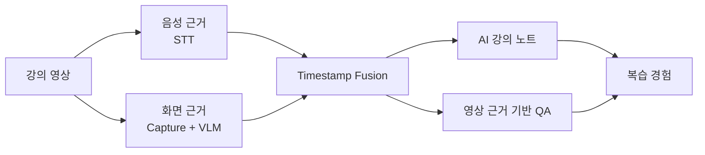
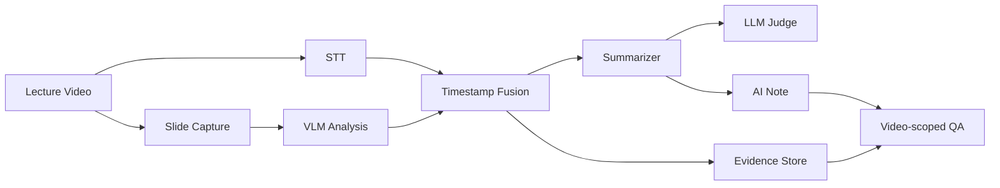
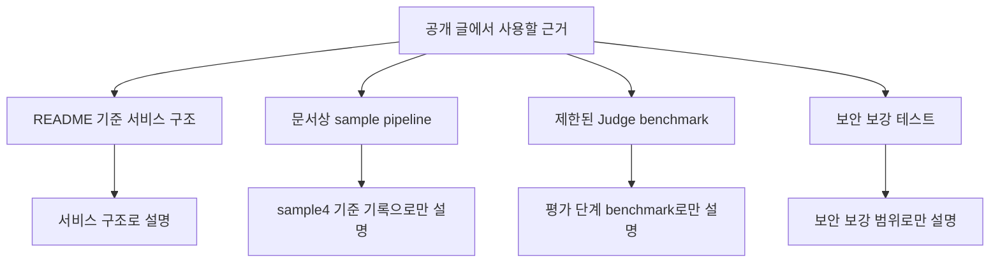

# 01. SeSAC:Note - 멀티모달 AI 강의 노트 서비스 개발기

SeSAC:Note는 강의 영상의 음성 정보와 화면 정보를 시간축으로 결합해, 영상 없이도 복습 가능한 AI 강의 노트와 영상별 질의응답을 제공하는 멀티모달 AI 서비스다.

이 글은 SeSAC:Note README와 프로젝트 정리 문서를 기준으로, 공개 가능한 기능, 아키텍처, 검증 범위를 정리한다. 개인 식별 정보와 민감한 실행 환경 정보는 제외하고 서비스 구조와 개발 흐름만 다룬다.

## 왜 STT-only 요약으로 부족했나

강의 영상은 일반 문서와 다르다. 핵심 정보가 한 곳에 있지 않고, 음성 설명과 화면 자료가 시간축 위에 흩어져 있다.

음성에는 강사의 설명이 있다. 화면에는 수식, 표, 도표, 코드, 슬라이드 제목, 강조 표시가 있다. STT 결과만 요약하면 음성으로 말하지 않은 화면 정보가 빠진다. 반대로 화면만 보면 강사가 왜 그 장표를 설명했는지 알기 어렵다.

그래서 이 프로젝트의 목표는 단순히 영상을 짧게 요약하는 것이 아니었다. 목표는 화면과 음성을 함께 근거로 삼아, 학습자가 영상을 계속 되돌려 보지 않아도 이해 가능한 독립형 강의 노트를 만드는 것이었다.

## 해결 구조

SeSAC:Note의 처리 흐름은 다음과 같다.

먼저 영상에서 음성을 추출하고 STT로 변환한다. 동시에 의미 있는 화면 변화를 찾아 슬라이드를 캡처한다. 캡처된 화면은 VLM이 텍스트, 수식, 표, 도표 같은 시각 정보를 구조화한다. 이후 STT와 VLM 결과를 timestamp 기준으로 묶어 segment를 만들고, 이 segment를 바탕으로 Summarizer가 강의 노트를 생성한다.

생성된 노트는 Judge가 groundedness와 note quality 관점에서 점검한다. 마지막으로 사용자는 요약 노트를 읽고, 특정 영상의 summary, segment, evidence 범위 안에서 질문할 수 있다.

## 사용자 흐름

사용자 입장에서 흐름은 단순하다.

1. 강의 영상을 업로드한다.
2. 처리 상태를 확인한다.
3. 생성된 노트를 읽는다.
4. 필요한 경우 원본 영상의 근거 구간을 확인한다.
5. 챗봇에 질문한다.

서비스 관점에서는 이 단순한 흐름 뒤에 긴 비동기 파이프라인이 있다. FastAPI 백엔드는 업로드, 처리 시작, 상태 조회, 요약 조회, 근거 조회, 채팅 요청을 담당한다. React/Vite 프론트엔드는 업로드와 진행 상태, 요약, 영상 재생, 챗봇 UI를 제공한다. Supabase와 Storage/R2 계열 저장소는 영상, 캡처 이미지, 처리 상태, segment, summary, judge 결과를 보관한다.

## 주요 구현 축

이 프로젝트에서 핵심으로 정리할 수 있는 구현 축은 네 가지다.

| 축 | 내용 |
| --- | --- |
| 멀티모달 근거 수집 | STT와 VLM을 통해 음성 설명과 화면 정보를 함께 수집 |
| 시간축 결합 | STT와 캡처/VLM 결과를 segment 단위로 정렬 |
| 생성 품질 점검 | Summarizer와 Judge를 분리해 요약 결과를 보조 평가 |
| 서비스화 | 업로드, 상태 조회, DB 저장, 영상별 QA, 보안 보강 흐름으로 연결 |

이 글에서 말하는 구현 흐름은 프로젝트 개발 흐름을 공개용으로 재구성한 것이다. 특정 개인이 전체 파이프라인을 혼자 만들었다는 의미가 아니다.

## 검증 근거와 한계

검증 근거는 기준을 나누어 봐야 한다.

| 기준 | 사용할 수 있는 표현 |
| --- | --- |
| README 기준 서비스 구조 | FastAPI, React/Vite, Supabase, Storage/R2를 연결한 서비스 구조 |
| 문서상 sample pipeline | sample4 기준 처리 결과가 기록됨 |
| 제한된 Judge benchmark | Judge 버전별 평가 시간, 토큰, 통과 여부 비교 |
| 보안 보강 기록 | media ticket, upload validation 등 일부 보안 흐름의 테스트 기록 |

반대로 현재 공개 글에서는 운영 환경에서의 성공, 모든 영상 유형에 대한 일반화, 전체 구간 재실행 검증을 주장하지 않는다. Judge 역시 품질을 최종 판정하는 장치가 아니라, 생성 결과를 근거와 비교해 점검하는 보조 gate로 본다.

## 시리즈 구성

이 프로젝트는 한 글로 끝내면 중요한 판단들이 묻힌다. 이후 글에서는 문제 정의, 아키텍처, 캡처/VLM 개선, 비동기 처리, 영상 근거 기반 QA, Judge 평가, 검증과 보안 범위를 나누어 정리한다.

- 다음 글: [02. SeSAC:Note README 기준 프로젝트 구조 정리]()
