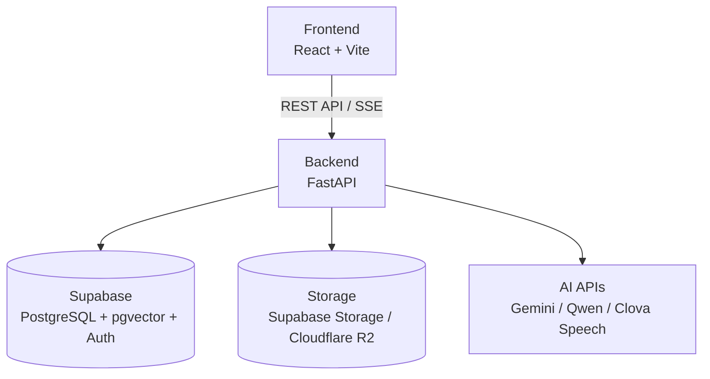
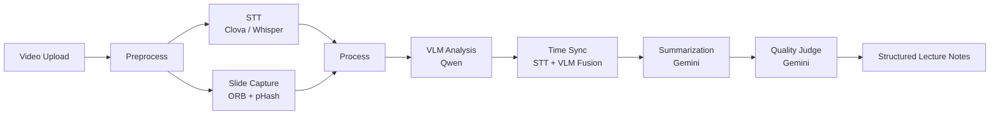

# 02. SeSAC:Note 핵심 기능과 구조

이 글은 SeSAC:Note README에 정리된 실제 구현 내용을 기준으로 프로젝트의 기능, 아키텍처, 기술 스택, 실행 구조를 상위 관점에서 정리한 글이다.

공개 글에서는 개인 식별 정보와 민감한 실행 환경 정보는 제외한다. 대신 README에 정리된 기능과 구조를 바탕으로, 이 프로젝트가 어떤 입력을 받아 어떤 파이프라인으로 AI 강의 노트를 만드는지에 집중한다.

## 프로젝트 한 줄 설명

SeSAC:Note는 강의 영상에서 슬라이드를 자동 추출하고, 음성을 텍스트로 변환한 뒤, 시각 정보와 청각 정보를 시간축 기준으로 결합해 독립형 AI 강의 노트를 생성하는 멀티모달 AI 서비스다.

README의 핵심 문장은 "강의 영상을 보지 않아도 이해할 수 있는 AI 강의 노트"다. 이 표현은 단순 요약보다 더 넓은 목표를 갖는다. 영상의 음성, 화면, 시간 정보를 함께 정리해야 하며, 생성된 노트는 사용자가 영상 없이도 복습할 수 있어야 한다.

## 핵심 기능

README 기준 핵심 기능은 여덟 가지로 정리된다.

| 기능 | 블로그에서의 해석 |
| --- | --- |
| Smart Slide Capture | ORB 특징점, 지속성 분석, Smart ROI, adaptive resizing으로 의미 있는 슬라이드 화면을 추출 |
| Dual STT Engine | Clova Speech를 primary로, Whisper를 fallback으로 두는 음성 인식 구조 |
| VLM Slide Analysis | Qwen VLM으로 슬라이드의 텍스트, 수식, 도표를 구조화 |
| Time-Synchronized Fusion | STT와 VLM 결과를 timestamp 기준 segment로 결합 |
| AI Summarization with Quality Judge | Gemini 기반 요약과 Judge 보조 평가를 분리 |
| Batch Processing & Resume | 긴 강의를 batch 단위로 처리하고 중단 지점 이후 재개 가능 |
| Video-scoped QA | LangGraph 기반으로 영상 근거 범위 안에서 질의응답 |
| Real-time Status | SSE로 처리 상태와 증분 요약 흐름을 전달 |

README에는 일부 기능이 강하게 표현되어 있지만, 공개 블로그에서는 더 좁게 해석한다. 예를 들어 Judge는 품질을 보증하는 장치가 아니라 요약 결과를 근거와 비교해 보조 점검하는 장치로 쓴다. QA도 전체 지식 검색 시스템이 아니라 특정 영상의 summary, segment, evidence 범위 안에서 답하는 흐름으로 제한한다.

## 전체 아키텍처

README의 아키텍처는 frontend, backend, database, storage, AI APIs로 나뉜다.

프론트엔드는 영상 업로드, 진행 상태, 노트, 영상 재생, 챗봇 UI를 담당한다. 백엔드는 업로드와 처리 요청, 상태 조회, 요약 조회, 근거 조회, 채팅 API를 연결한다. DB에는 처리 상태와 구조화 결과가 남고, Storage 계층에는 영상과 캡처 이미지 같은 객체가 저장된다.

## 파이프라인 흐름

README의 Pipeline Flow는 `Preprocess`와 `Process` 단계로 나뉜다.

이 흐름에서 중요한 점은 STT와 화면 분석이 분리되어 있다가 Fusion 단계에서 다시 합쳐진다는 것이다. SeSAC:Note는 transcript를 바로 요약하는 서비스가 아니라, 음성 설명과 슬라이드 정보를 같은 시간 구간의 근거로 묶은 뒤 요약과 QA에 사용한다.

## 기술 스택

README 기준 backend와 frontend 기술 스택은 다음처럼 정리된다.

| 영역 | 기술 |
| --- | --- |
| Backend Language | Python 3.10+ |
| Backend Framework | FastAPI + Uvicorn |
| AI/LLM | Google Gemini, Qwen VLM, Google ADK |
| STT | Clova Speech API, OpenAI Whisper |
| Computer Vision | OpenCV, ORB, pHash, ROI Detection |
| Orchestration | LangGraph |
| Database | Supabase PostgreSQL + pgvector |
| Storage | Supabase Storage + Cloudflare R2 |
| Container / CI-CD | Docker, GitHub Actions, Cloud Run 설정 |
| Frontend | React 19.2, Vite 7.2, React Router |
| UI / 문서 렌더링 | Tailwind CSS, KaTeX, react-markdown |

CI/CD와 배포 관련 기술은 README 구조에 포함되어 있지만, 공개 글에서는 현재 운영 환경 성공으로 확장하지 않는다. 여기서는 프로젝트가 어떤 배포/실행 구조를 갖도록 설계되었는지만 설명한다.

## 코드 구조

README의 Project Structure를 기능 단위로 압축하면 다음과 같다.

| 디렉터리 | 역할 |
| --- | --- |
| `src/process_api.py` | FastAPI main server |
| `src/audio` | Clova + Whisper STT module |
| `src/capture` | slide capture engine, ORB, pHash, ROI |
| `src/vlm` | Qwen VLM slide analysis |
| `src/fusion` | time sync, summarizer, judge 연결 |
| `src/judge` | multi-axis quality evaluation |
| `src/pipeline` | pipeline orchestration, stages |
| `src/db` | Supabase adapter, R2 storage adapter |
| `src/services` | chat, LangGraph session, pipeline service |
| `frontend/src` | API client, UI components, auth/context/hooks/pages |
| `config` | audio, capture, fusion, vlm, judge, pipeline 설정 |
| `docs` | pipeline, chatbot, local E2E, project guide 문서 |

이 구조를 보면 SeSAC:Note는 단일 LLM 호출 스크립트가 아니라, 입력 처리, AI 분석, 저장, 상태 관리, 프론트엔드 조회까지 이어지는 서비스 구조로 만들어졌다는 점이 드러난다.

## 실행 구조

README에는 backend, frontend, Docker, CLI 실행 방식이 정리되어 있다. 공개 글에서는 민감한 환경 변수와 외부 계정 정보를 제외하고 구조만 남긴다.

| 실행 방식 | 의미 |
| --- | --- |
| Backend server | FastAPI 서버를 8080 포트 기준으로 실행 |
| Frontend dev server | frontend 개발 서버를 5173 포트 기준으로 실행 |
| Docker | backend 이미지를 build하고 컨테이너로 실행 |
| End-to-End CLI | 영상 파일을 입력으로 pipeline demo 실행 |
| Step-by-Step CLI | preprocess와 process를 나누어 실행 |
| Fusion only | prompt 수정 후 Fusion 단계만 재실행 |

이 실행 구조는 개발과 검증을 나누기 위한 장치다. 전체 파이프라인을 한 번에 실행할 수도 있고, STT/Capture, VLM/Fusion/Summary/Judge, Fusion 재실행처럼 단계를 쪼개 확인할 수도 있다.

## 공개 글에서 제외하는 것

README에는 실제 개발과 운영에 필요한 항목이 많지만, 블로그에 그대로 옮기면 안 되는 정보도 있다.

| 제외 항목 | 이유 |
| --- | --- |
| 개인 식별 정보 | 프로젝트 설명과 무관하며 공개 노출 리스크가 있음 |
| 개인 식별 항목 | 공개 글에서는 하나의 프로젝트 흐름으로 정리하기 위함 |
| 환경 변수 예시 | 인증 정보 구조를 공개 글에 남기지 않기 위함 |
| 외부 발표/이슈 링크 | 접근 권한과 공개 범위가 불명확할 수 있음 |
| 강한 보증 표현 | 실제 검증 범위를 넘어설 수 있음 |

따라서 이후 글들은 README를 상위 기준으로 삼되, 상세 구현 회고는 공개 가능한 범위로 재작성한다.

- 이전 글: [01. SeSAC:Note 프로젝트 개요: 강의 영상을 AI 학습 노트로 바꾸기]()
- 다음 글: [03. 6장으로 보는 SeSAC:Note 포트폴리오 요약]()
