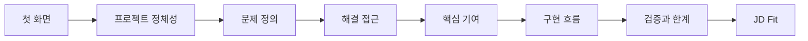
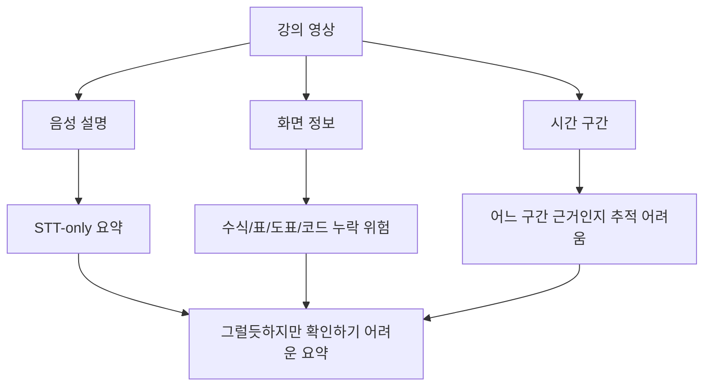
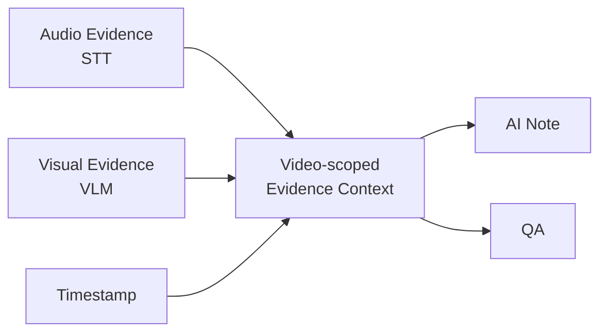
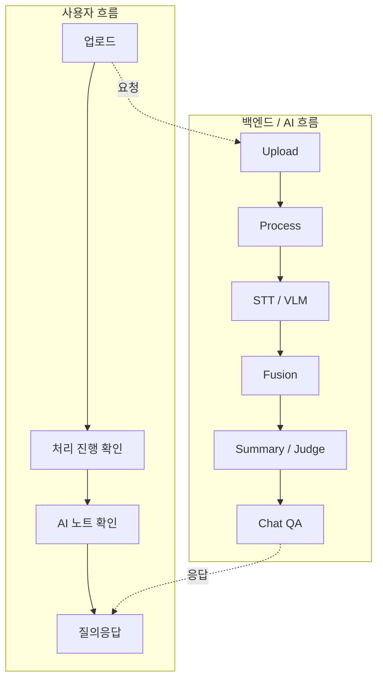

# 03. SeSAC:Note Visual Portfolio - 6장으로 보는 프로젝트 요약

이 글은 SeSAC:Note 프로젝트를 기술 상세보다 먼저 빠르게 이해하기 위한 시각 요약본이다. 원본 웹 포트폴리오 산출물은 밝은 배경, 얇은 보더, 카드형 UI, 민트/틸 포인트를 기준으로 만들었고, 이미지 자체를 붙이는 방식보다 텍스트와 카드, 도식을 수정 가능한 구조로 정리하는 방향을 잡았다.

블로그에서는 원본 화면을 그대로 이미지로 붙이지 않는다. 대신 각 화면의 메시지를 Mermaid와 표로 재구성한다. 이렇게 해야 나중에 문장, claim boundary, 검증 기준을 수정하기 쉽다.

## 포트폴리오의 목적

포트폴리오 글의 목적은 모든 구현 디테일을 설명하는 것이 아니다. 30초 안에 "무슨 프로젝트인지", "어떤 문제를 풀었는지", "어디까지 검증했는지"를 보여주는 것이 먼저다.

이 순서를 잡은 이유는 간단하다. 채용 담당자나 면접관이 처음 보는 화면에서 먼저 알아야 하는 것은 모델 이름이 아니라, 이 프로젝트가 어떤 사용자 문제를 어떤 서비스 구조로 풀었는지다.

## 1. Hero: 한 문장으로 프로젝트를 고정한다

Hero 화면의 핵심 문장은 다음 방향으로 잡는다.

> 강의 영상을 AI 노트와 근거 기반 질의응답으로 바꾸는 멀티모달 AI 서비스

여기서 중요한 단어는 세 개다.

| 단어 | 이유 |
| --- | --- |
| 강의 영상 | 일반 문서 요약이 아니라 영상 기반 문제임을 고정 |
| AI 노트 | 단순 요약이 아니라 학습자가 읽는 결과물임을 강조 |
| 근거 기반 질의응답 | 챗봇이 영상 evidence 범위 안에서 답한다는 점을 명시 |

Hero에서는 기술 스택을 길게 나열하지 않는다. 대신 `AI Service Developer`, `AI Engineer`, `Evidence-grounded QA`처럼 역할과 강점을 짧게 보여주는 편이 낫다.

## 2. Problem: 긴 영상은 다시 찾기 어렵다

문제 화면은 STT-only 요약의 한계를 먼저 보여준다.

문제는 "영상이 길다"에서 끝나지 않는다. 실제 문제는 필요한 근거가 음성, 화면, 시간에 나뉘어 있다는 점이다. 따라서 포트폴리오에서는 긴 검색 시간, STT-only 한계, 근거 없는 답변 위험을 한 화면에 압축한다.

## 3. Approach: 음성, 화면, 시간을 하나의 근거로 묶는다

접근 화면은 이 프로젝트의 핵심 구조를 보여준다.

여기서 `Evidence Context`가 중심이다. 영상 구간 단위로 음성 설명과 화면 정보를 묶어야 요약도, QA도 같은 근거를 바라볼 수 있다.

## 4. Contribution: 기여를 네 축으로 좁힌다

원본 포트폴리오 화면은 기여를 네 축으로 정리한다.

| 축 | 공개 글에서의 표현 |
| --- | --- |
| AI 파이프라인 연동 | STT, Capture, VLM, Summary, Judge 결과를 서비스 흐름으로 연결 |
| 영상 구간 기반 QA | 특정 영상의 evidence 안에서 답변하는 QA 흐름 |
| Judge 품질 점검 | groundedness와 note quality를 보조 평가하는 gate |
| 보안 보강 | media ticket, upload validation 등 보안 흐름 정리 |

여기서 조심할 점은 ownership 표현이다. 프로젝트 전체를 한 사람이 모두 수행한 것처럼 보이면 안 된다. 공개 글에서는 `프로젝트에서 정리한 구현 축`, `개발 과정에서 다룬 문제`, `설명 가능한 흐름`으로 표현한다.

## 5. Core Implementation: 사용자 흐름과 백엔드 흐름을 분리한다

웹 포트폴리오의 구현 화면은 사용자 흐름과 백엔드/AI 흐름을 분리해 보여준다.

이 구분이 있으면 프로젝트가 단순 모델 호출 데모가 아니라 서비스 흐름으로 읽힌다. 사용자는 업로드와 결과 확인을 보고, 백엔드는 처리 상태와 AI 파이프라인을 관리한다.

## 6. Validation & JD Fit: 확인한 것과 주장하지 않는 것을 분리한다

포트폴리오에서 가장 중요한 안전장치는 claim boundary다.

| 기준 | 공개 표현 |
| --- | --- |
| README 기준 서비스 구조 | 공개 프로젝트 구조와 사용자 흐름 |
| 보안 보강과 문서화 | 로컬/개발 환경 기준 보완과 문서화 |
| Sample / Benchmark | 제한된 조건의 Judge, 시간, token 비교 |
| Test / Build | 코드, 테스트, 빌드 기준 확인 범위 |

반대로 cloud 전체 재현, 운영 환경 성공, 모든 강의에 대한 일반화, 환각 제거는 주장하지 않는다. 이 제한을 먼저 적어야 프로젝트가 더 약해지는 것이 아니라, 오히려 신뢰 가능한 case study가 된다.

JD Fit은 다음 우선순위로 정리한다.

| 우선순위 | 포지션 | 근거 |
| --- | --- | --- |
| Primary | AI 서비스 개발자 | AI 결과를 API, DB, Storage, 상태 관리와 연결 |
| Strong | AI Engineer | STT, VLM, Fusion, Judge 기반 멀티모달 처리 |
| Support | AI Agent 개발자 | LangGraph 기반 video-scoped QA workflow |

## 블로그 시리즈에서 이 글의 위치

이 글은 기술 상세로 들어가기 전의 포트폴리오 요약본이다. 따라서 대표 케이스스터디 다음에 두는 것이 맞다. 이후 글에서 문제 정의, 아키텍처, 캡처/VLM, 비동기 처리, QA, Judge, 검증과 회고를 하나씩 자세히 보면 된다.

- 이전 글: [02. SeSAC:Note README 기준 프로젝트 구조 정리]()
- 다음 글: [04. 강의 영상 요약 문제를 어떻게 재정의했는가]()
