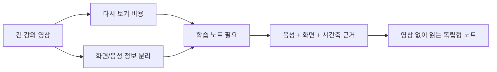
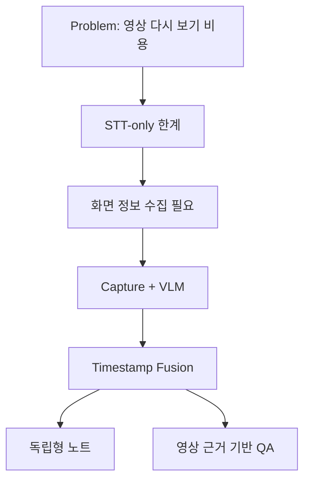

# 04. 문제 정의: STT 요약을 넘어 독립형 강의 노트로

SeSAC:Note의 출발점은 "강의 영상을 요약하자"가 아니었다. 더 정확한 문제는 "학습자가 영상을 다시 보지 않아도 핵심 개념과 근거를 읽을 수 있게 만들 수 있는가"였다.

이 차이가 중요했다. 영상 요약이라고만 정의하면 결과물은 짧은 문단 몇 개로 끝나기 쉽다. 하지만 학습 노트라고 정의하면 화면, 음성, 시간, 근거, 질의응답까지 함께 설계해야 한다.

## 강의 영상 학습의 문제

강의 영상은 탐색 비용이 크다. 30분짜리 영상을 다시 보면서 특정 개념이 나온 구간을 찾는 일은 생각보다 피곤하다. 학습자는 보통 다음 일을 반복한다.

1. 영상을 다시 튼다.
2. 특정 장표나 설명이 나온 위치를 찾는다.
3. 필요한 문장만 다시 듣는다.
4. 필기와 영상 내용을 맞춰 본다.

문제는 강의 내용이 시간축 위에 흩어져 있다는 점이다. 한 개념을 이해하려면 강사의 말, 슬라이드 제목, 도표, 수식, 예시 코드가 함께 필요할 수 있다. 하지만 영상 플레이어는 이 정보를 학습자가 직접 찾게 만든다.

소개 자료에서 드러나는 또 다른 문제는 학습자의 인지 부담이다. 온라인 강의 학습자는 시청, 이해, 필기, 구간 탐색을 동시에 해야 한다. 특히 기술 강의에서는 전문 용어, 수식, 코드, 도표가 빠르게 지나가므로 필기에 집중하다가 설명 맥락을 놓치기 쉽다.

| 학습자가 동시에 하는 일 | 부담 |
| --- | --- |
| 영상 시청 | 강사의 설명 흐름을 따라가야 함 |
| 화면 해석 | 수식, 도표, 코드, 판서를 읽어야 함 |
| 필기 | 나중에 볼 수 있게 요약해야 함 |
| 구간 탐색 | 놓친 내용을 다시 찾기 위해 시간을 되돌려야 함 |

따라서 이 프로젝트의 문제는 단순히 "요약이 필요하다"가 아니라, 학습자가 영상 안의 근거를 반복해서 직접 찾아야 하는 부담을 줄이는 것이었다.

## STT-only 요약의 한계

STT-only 요약은 구현이 간단하다. 음성을 텍스트로 바꾸고, 그 텍스트를 LLM에 넣으면 된다. 하지만 강의에서는 화면에만 존재하는 정보가 많다.

| 화면에만 남기 쉬운 정보 | STT-only 요약에서 생기는 문제 |
| --- | --- |
| 수식 | 강사가 "이 식"이라고만 말하면 실제 식이 사라진다 |
| 표 | 행과 열의 관계가 요약에 반영되지 않는다 |
| 도표 | 변화 방향이나 구조가 텍스트로 복원되지 않는다 |
| 코드 | 함수명, 인자, 실행 흐름이 누락될 수 있다 |
| 판서/강조 | 중요한 위치나 강조 정보가 사라진다 |

강사의 음성은 화면을 전제로 한다. "여기서 중요한 건 이 부분입니다"라는 말은 화면 정보 없이 독립적으로 이해하기 어렵다. 그래서 STT만 요약하면 문장은 자연스러워도 학습 근거가 부족한 결과가 나올 수 있다.

발표 정리 자료에서도 이 문제가 직접 언급된다. 강의자는 화면의 특정 수식이나 개념을 가리키며 "이것", "여기", "다음 식"처럼 말할 수 있다. STT에는 지시어만 남고, 화면의 실제 수식이나 표는 빠진다. 이 경우 요약 모델은 문맥을 일반 지식으로 메우기 쉬워진다.

## 화면 정보가 빠질 때 생기는 손실

학습 노트에서 가장 위험한 손실은 "그럴듯하지만 확인하기 어려운 요약"이다. 예를 들어 STT에는 "모델 A가 더 좋다"는 말만 있고, 화면에는 비교 표가 있었다고 하자. 화면 표를 보지 못하면 어떤 기준에서 더 좋은지, 수치 차이가 얼마나 나는지, 예외 조건이 있는지 빠질 수 있다.

SeSAC:Note는 이 문제를 화면과 음성을 함께 다루는 방식으로 접근했다. 음성은 STT로, 화면은 캡처와 VLM으로, 두 결과는 timestamp로 결합한다. 이렇게 하면 요약은 단순 transcript 요약이 아니라 segment 단위의 근거를 바탕으로 만들어진다.

## 목표 정의: 독립형 강의 노트

이 프로젝트의 목표는 짧은 요약문이 아니라 독립형 강의 노트였다.

독립형 노트는 다음 조건을 만족해야 한다.

| 조건 | 의미 |
| --- | --- |
| 영상 없이 읽을 수 있음 | 핵심 개념과 설명이 노트 안에 정리되어야 함 |
| 근거를 추적할 수 있음 | 어떤 segment와 화면 정보에서 나온 내용인지 연결되어야 함 |
| 질문에 답할 수 있음 | 영상 전체가 아니라 해당 영상의 근거 범위 안에서 답해야 함 |
| 처리 상태를 보여줄 수 있음 | 긴 영상 분석 중 사용자가 현재 단계를 알 수 있어야 함 |

이 목표 때문에 프로젝트의 구조도 달라졌다. 단순 batch script가 아니라 업로드, 상태 관리, 저장, 요약 조회, 영상별 QA까지 포함하는 서비스 구조가 필요했다.

## 범위 밖으로 둔 것

범위를 명확히 잡는 것도 중요했다. 이 프로젝트는 모든 강의 유형을 즉시 잘 처리하는 범용 시스템을 목표로 하지 않았다.

| 범위 밖 | 이유 |
| --- | --- |
| 즉시 처리되는 실시간 분석 | 긴 영상과 외부 모델 호출이 있어 latency가 존재 |
| 모든 강의 유형에 대한 일반화 | 슬라이드형, 코딩형, 판서형 강의의 난도가 다름 |
| 최종 품질 판정 | LLM Judge는 보조 평가 장치이지 정답 보증 장치가 아님 |
| 범용 지식 검색 | 질문은 특정 영상의 summary, segment, evidence 범위로 제한 |

범위를 줄였기 때문에 오히려 설계가 선명해졌다. 핵심은 "모든 것을 아는 AI"가 아니라 "이 영상 안의 근거를 바탕으로 노트와 답변을 제공하는 서비스"였다.

## 이후 아키텍처로 이어지는 판단

문제 정의가 바뀌면 아키텍처도 바뀐다. STT-only 요약이면 STT와 LLM만 있으면 된다. 하지만 독립형 강의 노트가 목표라면 다음 구조가 필요하다.

다음 글에서는 이 판단이 실제 파이프라인 구조로 어떻게 이어졌는지 정리한다.

- 이전 글: [03. 6장으로 보는 SeSAC:Note 포트폴리오 요약]()
- 다음 글: [05. 아키텍처: STT, VLM, Fusion을 연결하는 방법]()
