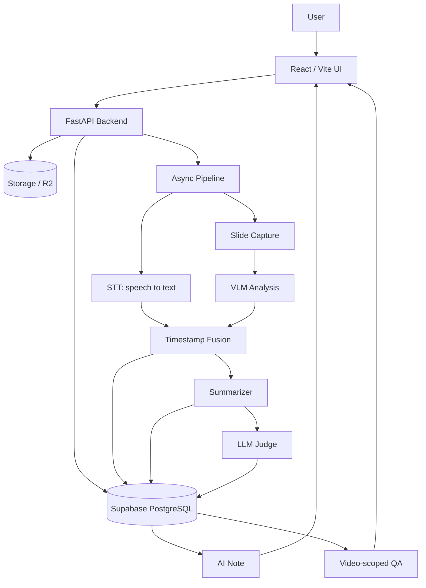

# 05. 아키텍처: STT, VLM, Fusion을 연결하는 방법

SeSAC:Note의 핵심 구조는 `영상 -> 음성 근거 + 화면 근거 -> 시간축 결합 -> 노트와 QA`다. 이 구조를 만들기 위해 STT, 슬라이드 캡처, VLM, Fusion, Summarizer, Judge, QA 흐름을 하나의 서비스 파이프라인으로 연결했다.

## 전체 처리 흐름

전체 흐름은 아래처럼 볼 수 있다.

사용자는 프론트엔드에서 영상을 업로드한다. 백엔드는 영상 파일과 메타데이터를 저장하고, 비동기 파이프라인을 시작한다. 파이프라인은 음성과 화면을 별도로 분석한 뒤 timestamp 기준으로 결합한다. 결과는 DB에 저장되고, 사용자는 처리 상태, 요약, 근거, 챗봇 답변을 조회한다.

## STT: 음성 설명과 timestamp 생성

STT 단계는 영상에서 음성을 추출하고, 강사의 설명을 timestamp가 있는 텍스트로 변환한다. 강의에서는 "이 부분", "여기", "다음 식" 같은 지시어가 자주 나오기 때문에 timestamp가 중요하다.

STT 결과는 단순 transcript가 아니라 이후 Fusion 단계의 한쪽 입력이다. 음성 설명이 어느 시간대에 등장했는지를 알아야 화면 캡처와 연결할 수 있다.

## Capture: 의미 있는 화면 변화 추출

화면은 매 프레임을 저장하면 안 된다. 중복 이미지가 많아지고, VLM 호출 비용과 처리 시간이 늘어난다. 그래서 캡처 단계의 목표는 모든 화면을 저장하는 것이 아니라 학습에 의미 있는 변화만 골라내는 것이다.

이 프로젝트의 캡처 흐름은 dHash, ORB, pHash+ORB, Smart ROI, adaptive resize 같은 개선을 거치며 발전했다. 자세한 개선 과정은 별도 글에서 다룬다.

## VLM: 슬라이드 정보를 구조화

캡처된 슬라이드는 VLM 분석으로 넘어간다. VLM은 화면 속 텍스트, 수식, 표, 도표, 코드, 레이아웃 정보를 구조화한다. 이 단계의 출력 품질이 낮으면 이후 요약 품질도 낮아진다.

따라서 VLM prompt는 단순 설명문을 얻기보다 요약에 쓰기 좋은 구조를 만드는 방향으로 설계했다. 핵심 내용과 보조 정보, 시각 근거를 분리하면 downstream LLM이 불필요한 정보를 덜 섞어 쓰게 된다.

## Fusion: STT와 VLM을 segment로 결합

Fusion은 이 프로젝트의 중심이다. STT와 VLM은 서로 다른 modality에서 온다. 하나는 음성 설명이고, 하나는 화면 근거다. 두 결과를 timestamp 기준으로 묶어야 비로소 "이 시간대에 어떤 화면을 보며 어떤 설명을 들었는가"를 알 수 있다.

Fusion 결과는 segment 단위로 정리된다.

| segment 구성 요소 | 의미 |
| --- | --- |
| 시간 범위 | 해당 설명과 화면이 연결되는 구간 |
| STT text | 강사의 음성 설명 |
| VLM output | 슬라이드의 시각 정보 |
| evidence | 요약과 QA가 참조할 근거 |

이 segment는 Summarizer, Judge, QA가 공유하는 근거 단위가 된다.

## Summary, Judge, QA로 이어지는 downstream

Summarizer는 segment를 바탕으로 영상 없이 읽을 수 있는 노트를 생성한다. Judge는 생성된 노트를 원본 segment와 비교해 groundedness, note quality, multimodal use를 점검한다. QA는 전체 인터넷이나 임의 지식이 아니라 특정 영상의 summary, segment, evidence 안에서 답하도록 제한한다.

이렇게 downstream을 나눈 이유는 각 단계의 책임을 분리하기 위해서다. Summarizer는 노트를 만들고, Judge는 보조 평가를 하고, QA는 사용자의 질문에 영상 근거를 바탕으로 답한다.

## DB와 Storage에 남는 결과

서비스로 만들려면 결과가 파일 시스템에만 남아서는 안 된다. 프론트엔드가 조회할 수 있도록 처리 상태와 결과가 DB에 남아야 한다.

| 저장 대상 | 예시 |
| --- | --- |
| 영상 메타데이터 | videos |
| 처리 작업 상태 | jobs |
| 화면 캡처 | captures |
| STT 결과 | stt |
| 결합 근거 | segments |
| 요약 결과 | summaries, summary_results |
| 평가 결과 | judge |

Storage/R2 계열 저장소는 원본 영상과 캡처 이미지를 담당하고, Supabase PostgreSQL은 상태와 구조화 결과를 담당한다. 이 분리가 있어야 업로드, 진행률, 요약 조회, 영상별 QA가 웹 서비스 흐름으로 이어질 수 있다.

## 다음 글로 이어지는 지점

이 구조에서 가장 먼저 병목이 드러난 곳은 화면 캡처와 VLM 입력이었다. 중복 슬라이드가 많으면 VLM 호출이 늘고, VLM 출력이 흔들리면 요약과 Judge까지 흔들린다. 다음 글에서는 이 부분을 어떻게 줄였는지 정리한다.

- 이전 글: [04. 문제 정의: STT 요약을 넘어 독립형 강의 노트로]()
- 다음 글: [06. 캡처와 VLM 개선: 중복 슬라이드와 입력 품질 다루기]()
