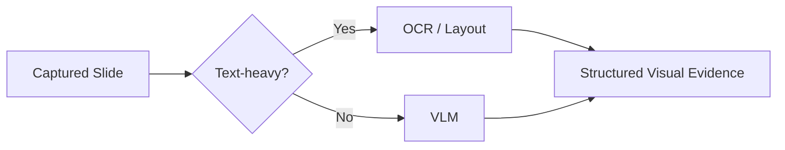

# 06. 슬라이드 중복 캡처와 VLM 입력 품질을 줄이는 과정

SeSAC:Note에서 화면 정보는 요약 품질의 출발점이다. 캡처가 중복되면 VLM 비용이 늘고, 캡처가 부정확하면 STT와 화면의 연결이 흔들린다. VLM 입력이 나쁘면 Summarizer와 Judge까지 영향을 받는다.

이 글은 개발 과정에서 정리한 CV/VLM 개선 흐름이다. 핵심은 "모든 프레임을 많이 넣자"가 아니라, "의미 있는 화면만 안정적으로 추출하고, VLM이 요약에 쓰기 좋은 구조로 출력하게 만들자"였다.

## 문제: 동일 슬라이드 반복 캡처와 VLM 비용 증가

초기 캡처는 화면 변화 감지에 집중했다. 하지만 강의 영상에서는 같은 슬라이드가 오래 유지되거나, 포인터와 작은 애니메이션만 바뀌는 경우가 많다. 이런 장면을 모두 저장하면 실제로는 같은 슬라이드인데 VLM에는 여러 장의 이미지가 들어간다.

문제는 두 가지였다.

| 문제 | 영향 |
| --- | --- |
| 동일 슬라이드 반복 캡처 | VLM 호출량과 저장량 증가 |
| 유사 프레임 연속 저장 | timestamp와 slide timeline 품질 저하 |

프로젝트 기록 기준으로 pHash+ORB 중복 제거를 추가한 뒤 VLM 호출량을 약 50% 줄이는 방향의 개선이 정리되어 있다. 이 수치는 해당 실험 조건에서의 기록이며, 모든 영상에서 동일하게 보장되는 값은 아니다.

## dHash에서 ORB, pHash+ORB로

캡처 알고리즘은 단계적으로 개선됐다.

| 버전 | 접근 | 관찰된 문제 | 개선 방향 |
| --- | --- | --- | --- |
| v1 | dHash 기반 변화 감지 | 작은 변화와 의미 있는 전환을 구분하기 어려움 | 특징점 기반 접근 필요 |
| v2 | ORB 기반 전환 감지 | 전환 정확도는 높아졌지만 유사 프레임 중복 저장 발생 | 중복 제거 추가 |
| v3 | pHash+ORB | 중복 슬라이드 그룹화와 최적 프레임 선별 가능 | VLM 입력량 감소 |

ORB는 특징점 기반으로 화면 변화를 더 잘 감지할 수 있다. 하지만 "바뀌었다"를 잘 찾는 것과 "중복을 줄인다"는 다른 문제다. 그래서 pHash를 함께 사용해 유사 이미지를 묶고, 최종적으로 VLM에 넘길 대표 이미지를 줄이는 방향으로 개선했다.

## Smart ROI와 adaptive resize

강의 화면 전체가 항상 중요한 것은 아니다. 슬라이드 영역, 코드 영역, 도표 영역처럼 실제 정보가 있는 부분이 중요하다. Smart ROI는 화면 안에서 유효 정보가 있는 영역을 더 잘 잡기 위한 접근이다.

adaptive resize는 VLM 입력 품질과 비용 사이의 균형을 맞추기 위한 장치다. 해상도를 무조건 크게 넣으면 비용과 latency가 늘고, 너무 줄이면 텍스트와 수식이 깨진다. 그래서 화면 특성에 따라 입력 크기를 조정하는 방향이 필요했다.

## OCR-first로 VLM 호출을 줄이는 판단

모든 화면을 VLM으로 보내는 것도 비효율적이었다. 텍스트 중심 슬라이드는 OCR로 충분히 처리할 수 있는 경우가 있다. 반대로 도표, 이미지, 복잡한 배치가 있는 화면은 VLM이 더 적합하다.

그래서 OCR-first 접근이 정리됐다.

프로젝트 기록 기준으로 텍스트 화면 처리에서 VLM 평균 7초가 Layout+OCR 162ms 수준으로 줄어든 실험이 있다. 이 역시 특정 처리 조건의 기록이며, 화면 유형에 따라 달라질 수 있다. 다만 설계 판단은 명확하다. VLM이 꼭 필요한 화면에 VLM을 쓰고, OCR로 충분한 화면은 더 가볍게 처리한다.

또한 30분 영상에서 캡처가 30~60장 수준으로 쌓이면 VLM 처리만 3~7분까지 늘어날 수 있다는 문제가 기록되어 있었다. 이 수치는 긴 영상과 캡처 수가 결합될 때 입력량 관리가 왜 중요한지 보여준다.

## VLM prompt를 구조화한 이유

VLM 출력은 최종 결과가 아니다. VLM 출력은 Summarizer가 사용할 근거 데이터다. 따라서 보기 좋은 자연어 설명보다 안정적인 구조가 더 중요했다.

VLM prompt는 다음 방향으로 정리했다.

| 출력 요소 | 목적 |
| --- | --- |
| main content | 요약에 반드시 반영해야 할 핵심 |
| auxiliary content | 배경, 부가 설명, 노이즈 후보 |
| visual evidence | 표, 도표, 코드, 수식 등 화면 근거 |
| layout cue | 제목, 강조, 위치 관계 |

이렇게 분리하면 요약 모델이 핵심과 보조 정보를 섞어 쓰는 위험을 줄일 수 있다. VLM에서 객체명, 수량, 레이아웃 설명이 흔들리면 요약도 흔들린다. 따라서 prompt 개선의 목표는 환각 제거가 아니라 환각 가능성을 줄이는 방향의 입력 품질 개선이었다.

## Fusion, Summarizer, Judge에 미치는 영향

캡처와 VLM은 앞단 작업처럼 보이지만 실제로는 전체 품질에 영향을 준다.

| 앞단 품질 | downstream 영향 |
| --- | --- |
| 중복 캡처 감소 | VLM 비용과 처리 시간 감소 |
| 정확한 slide timeline | STT와 화면 근거 결합 품질 개선 |
| 구조화된 VLM 출력 | Summarizer 입력 품질 개선 |
| main/aux 분리 | Judge가 근거성을 보기 쉬워짐 |

멀티모달 서비스에서 좋은 요약은 마지막 LLM prompt만으로 만들어지지 않는다. 어떤 화면을 캡처했고, 어떤 정보를 VLM이 추출했으며, 그 정보가 어떤 음성 설명과 결합됐는지가 먼저 결정한다.

## 남은 한계

이 개선에도 한계가 있다. 슬라이드형 강의, 코딩형 강의, 판서형 강의는 화면 변화 패턴이 다르다. OCR-first도 텍스트 중심 화면에서는 유리하지만, 도표와 복합 레이아웃에서는 VLM이 필요하다. 따라서 이 구조는 모든 강의 유형에서 동일 성능을 보장하는 방식이 아니라, 입력량과 품질을 관리하기 위한 설계로 보는 것이 맞다.

다음 글에서는 이렇게 만들어진 입력이 긴 영상 처리에서 어떤 병목을 만들고, 비동기 파이프라인으로 어떻게 다뤘는지 정리한다.

- 이전 글: [05. STT, VLM, Fusion으로 강의 영상을 노트로 바꾸는 구조]()
- 다음 글: [07. 긴 영상 처리에서 상태 추적과 체감 대기시간을 다룬 방법]()
