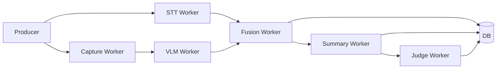
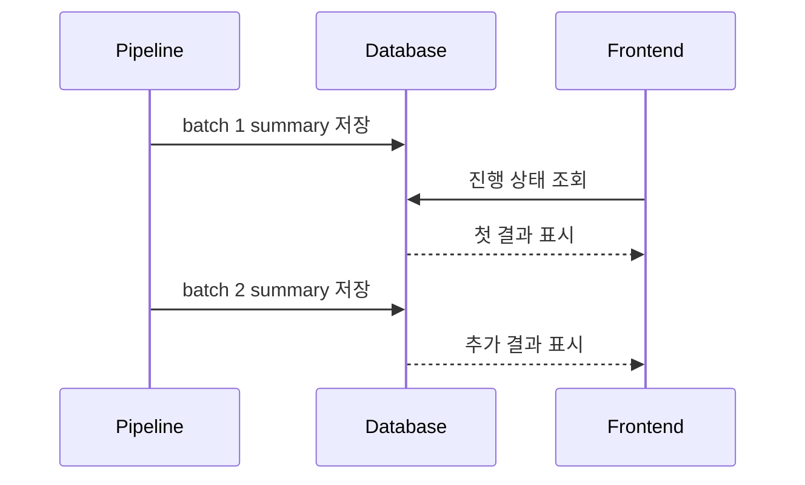

# 07. 비동기 처리: 긴 영상의 대기시간과 상태 추적 줄이기

강의 영상 분석은 짧은 API 요청처럼 끝나지 않는다. STT, 캡처, VLM, Fusion, Summary, Judge가 순서대로 또는 병렬로 실행되고, 각 단계마다 외부 모델 호출과 저장이 발생한다. 사용자는 이 긴 과정을 기다려야 한다.

이 글은 SeSAC:Note에서 긴 영상 처리의 병목을 어떻게 나누고, 상태 추적과 체감 대기시간을 어떻게 다뤘는지 정리한 것이다.

## 긴 영상 처리의 문제

긴 영상 처리에서 문제는 단순히 "느리다"가 아니다. 서비스 관점에서는 다음 문제가 동시에 생긴다.

| 문제 | 서비스 영향 |
| --- | --- |
| 단계별 처리 시간이 다름 | 사용자가 현재 상태를 알기 어려움 |
| 중간 실패 가능성 | 어디까지 성공했는지 추적 필요 |
| 외부 모델 호출 많음 | rate limit과 retry 고려 필요 |
| 결과가 늦게 나옴 | 사용자가 기다림을 포기할 수 있음 |
| DB와 파일 결과가 분리됨 | 프론트엔드에서 결과 조회가 어려움 |

초기 구조에서는 STT와 캡처처럼 독립적인 작업도 직렬로 처리되기 쉬웠다. 이러면 앞단에서부터 대기 시간이 쌓인다.

## STT와 capture 직렬 실행 병목

STT와 화면 캡처는 서로 독립적인 작업이다. 음성을 텍스트로 바꾸는 일과 화면 변화를 찾는 일은 동시에 진행할 수 있다. 그런데 직렬로 실행하면 STT가 끝난 뒤 캡처가 시작되거나, 반대로 캡처가 끝난 뒤 STT가 시작된다.

프로젝트 기록 기준으로 전처리 단계에서 다음 개선이 정리되어 있다.

| 버전 | 구조 | 기록된 처리 시간 | 해석 |
| --- | --- | --- | --- |
| v1 | 직렬 전처리 | 15.1초 | STT와 캡처 대기 발생 |
| v2 | asyncio 병렬 전처리 | 9.0초 | 독립 작업을 동시에 실행 |

이 수치는 해당 실험 조건의 전처리 결과다. 중요한 점은 수치 자체보다 병목을 보는 방식이다. 서로 독립적인 단계는 worker로 분리하고, 의존성이 있는 단계만 순서를 유지한다.

## worker 분리와 asyncio 병렬화

비동기 파이프라인은 단계별 책임을 나누는 방식으로 정리됐다.

Producer는 작업을 만들고, 각 worker는 자신이 맡은 단계를 처리한다. 외부 모델 호출에는 rate limit이 있으므로 동시성을 무제한으로 늘릴 수는 없다. 세마포어 같은 제한 장치를 두면 동시 실행과 호출 안정성 사이의 균형을 잡을 수 있다.

개발 기록에는 30분 강의 기준 전체 파이프라인 시간이 3분 32초에서 1분 57초로 줄어든 흐름이 정리되어 있다. 이 역시 특정 조건의 결과이며, 영상 길이, 캡처 수, 외부 모델 응답 속도에 따라 달라질 수 있다.

## batch 단위 처리와 첫 결과 노출

사용자가 가장 답답하게 느끼는 지점은 "아무것도 안 보이는 대기"다. 전체 결과가 끝날 때까지 기다리게 하면 실제 처리 시간이 같아도 더 느리게 느껴진다.

그래서 batch 단위 처리 흐름이 필요했다.

프로젝트 기록 기준으로 6분 영상에서 첫 응답까지의 지연이 2분 30초에서 30초로 줄어든 사례가 정리되어 있다. 이 수치는 해당 조건에서의 체감 대기시간 개선 기록이다. 전체 처리가 즉시 끝난다는 의미가 아니라, 앞부분 결과를 먼저 보여주는 UX 개선으로 보는 것이 맞다.

## DB 상태 동기화와 resume

비동기 처리는 빠를 수 있지만, 상태가 DB에 안정적으로 남지 않으면 서비스에서 쓰기 어렵다. 프론트엔드는 "지금 처리 중인지", "어느 단계까지 끝났는지", "중간 결과가 있는지"를 API로 확인해야 한다.

그래서 jobs와 videos 계열 상태, STT 결과, captures, segments, summaries, judge 결과를 DB에 저장하는 흐름이 중요했다. 중간 결과가 남아 있으면 실패 후 resume을 설계할 수 있고, 사용자는 완성된 일부 결과를 먼저 볼 수 있다.

## SSE로 사용자에게 진행 상태 전달

상태 조회는 polling으로도 가능하지만, 긴 작업에서는 SSE가 더 자연스럽다. SSE는 서버가 진행 상태를 이벤트로 보내고, 프론트엔드는 이를 받아 UI를 갱신한다.

SeSAC:Note에서 SSE는 "처리가 빠르다"는 주장을 위한 장치가 아니다. 긴 처리가 있음을 인정하고, 사용자가 현재 상태를 이해할 수 있게 만드는 UX 장치다.

## latency claim의 한계

latency 수치는 항상 조건이 붙어야 한다.

| 수치 | 표현 기준 |
| --- | --- |
| 15.1초 -> 9.0초 | 기록된 전처리 실험 기준 |
| 3분 32초 -> 1분 57초 | 30분 강의 기준으로 정리된 프로젝트 기록 |
| 2분 30초 -> 30초 | 6분 영상의 첫 응답 지연 기준 기록 |

이 수치를 전체 서비스 성능으로 일반화하지 않는다. 외부 모델 응답, 영상 길이, 캡처 수, 네트워크, 저장소 상태에 따라 결과는 달라질 수 있다. 안전한 해석은 "긴 영상 처리에서 병목을 단계별로 나누고, 첫 결과 노출과 상태 추적으로 체감 대기시간을 줄이는 방향으로 구조를 바꿨다"이다.

다음 글에서는 이렇게 만들어진 summary, segment, evidence를 사용자가 질문할 수 있는 QA 흐름으로 어떻게 연결했는지 정리한다.

- 이전 글: [06. 캡처와 VLM 개선: 중복 슬라이드와 입력 품질 다루기]()
- 다음 글: [08. QA 설계: 영상 근거 안에서만 답하게 만들기]()
