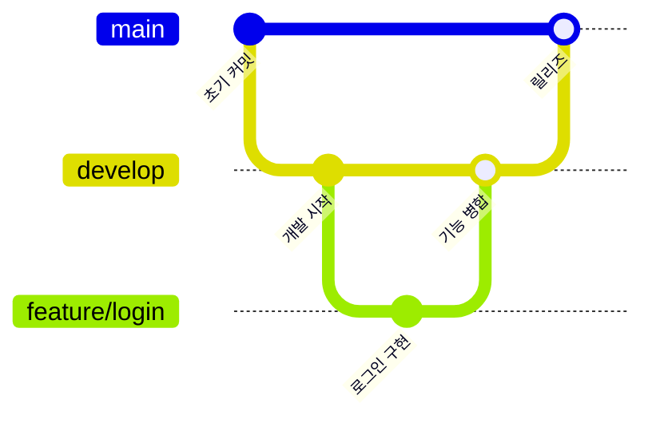

## Git

> **한줄 정의**
> 분산 버전 관리 시스템. 코드 변경 이력을 추적하고 협업을 가능하게 한다.

## 핵심 이해

Git의 핵심은 **커밋(Commit)**, **브랜치(Branch)**, **머지(Merge)** 세 가지 개념이다. 커밋은 변경 사항의 스냅샷이고, 브랜치는 독립적인 작업 공간이며, 머지는 브랜치를 통합한다. `git add → git commit → git push` 워크플로우가 기본이다.

**Git Flow**는 협업을 위한 브랜치 전략이다. `main`(프로덕션), `develop`(개발), `feature/*`(기능), `hotfix/*`(긴급 수정) 브랜치를 체계적으로 운용한다. Pull Request(PR)는 코드 리뷰와 병합을 위한 GitHub의 협업 메커니즘이다.

## 관련 강의

- W03D02-Git-기본-심화
- W03D03-GitHub-협업

## 브랜치 전략

## 관련 개념

- CI-CD - Git 기반 자동화 파이프라인
- Docker - 컨테이너 이미지 버전 관리

## 참고 자료

- [Pro Git Book](https://git-scm.com/book/ko/v2)
- [Git Flow](https://nvie.com/posts/a-successful-git-branching-model/)
