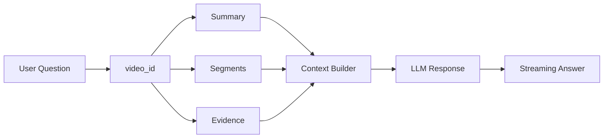

# 08. 단순 챗봇이 아니라 영상 근거 안에서 답하는 QA 흐름 만들기

SeSAC:Note의 QA는 범용 챗봇을 붙이는 문제가 아니었다. 사용자가 기대하는 것은 "아무 지식이나 답하는 AI"가 아니라 "내가 올린 이 강의 영상의 근거 안에서 답하는 AI"였다.

그래서 이 글에서는 QA 흐름을 `video-scoped evidence-grounded QA`로 정리한다. 일반적인 vector DB RAG 전체를 구현했다고 표현하지 않고, 특정 영상의 summary, segment, evidence 안에서 답변하는 QA 흐름으로 제한한다.

## 단순 LLM QA의 문제

가장 간단한 방식은 사용자의 질문을 LLM에 그대로 넣는 것이다. 하지만 이 방식은 강의 복습 서비스에 맞지 않는다.

| 단순 LLM QA 문제 | 영향 |
| --- | --- |
| 영상 근거를 모름 | 강의에서 다룬 내용인지 확인하기 어려움 |
| 답변 범위가 넓음 | 일반 지식 답변으로 흐를 수 있음 |
| 출처 추적이 약함 | 어떤 segment에서 나온 답인지 알기 어려움 |
| 긴 요약 전체 주입 | token 비용과 latency 증가 |

강의 영상 기반 QA에서는 답변보다 먼저 범위를 제한해야 한다. 이 질문은 어떤 영상에 대한 것인지, 어떤 segment가 관련되는지, 어떤 summary와 evidence를 근거로 삼을지 정해야 한다.

## video_id 기준 context 제한

QA 흐름의 기본 단위는 `video_id`다. 사용자가 질문하면 시스템은 전체 데이터가 아니라 해당 영상의 summary, segment, evidence를 기준으로 context를 구성한다.

이 구조의 목적은 답변을 좁히는 것이다. "이 영상에서는 무엇을 설명했는가"에 답하게 만들고, 외부 지식으로 과하게 확장되는 것을 줄인다.

## summary, segment, evidence를 답변 근거로 쓰는 방식

QA context는 하나의 텍스트 덩어리가 아니다. 역할이 다른 정보를 묶어야 한다.

| context 요소 | 역할 |
| --- | --- |
| summary | 강의 내용을 읽기 쉬운 노트로 정리한 결과 |
| segment | timestamp 기준으로 묶인 음성+화면 근거 |
| evidence | 답변이 참조할 수 있는 원본 근거 |
| video metadata | 어떤 영상에 대한 질문인지 제한 |

이 구조에서는 답변이 영상 밖으로 나가면 안 된다. 필요한 경우 "이 영상의 근거만으로는 확인하기 어렵다"는 답변도 가능해야 한다.

## LangGraph를 쓴 이유

LangGraph는 대화 흐름을 상태 기반으로 구성하기 위해 사용했다. QA는 단순히 `question -> answer`가 아니다. 세션, 영상 범위, 이전 질문, context 구성, 답변 streaming, 후속 질문 제안이 함께 움직인다.

LangGraph를 사용하면 다음 책임을 분리할 수 있다.

| 책임 | 설명 |
| --- | --- |
| state 관리 | 현재 video_id, 대화 기록, context 상태 유지 |
| context 구성 | summary, segment, evidence를 질문에 맞게 조합 |
| response 생성 | 영상 근거 안에서 답변 생성 |
| follow-up | 사용자가 이어서 물을 만한 질문 제안 |

여기서 중요한 것은 LangGraph라는 도구 자체가 아니다. 중요한 것은 QA를 영상 근거와 상태 흐름 안에 묶었다는 점이다.

## streaming response와 follow-up question

긴 답변은 한 번에 늦게 보여주는 것보다 streaming으로 보여주는 편이 낫다. 사용자는 답변이 생성되고 있다는 것을 볼 수 있고, 프론트엔드는 대화 상태를 자연스럽게 업데이트할 수 있다.

follow-up question은 학습 UX와 연결된다. 사용자가 어떤 질문을 해야 할지 모를 때, 영상 내용 기반의 다음 질문 후보를 제공하면 복습 흐름이 이어진다. 다만 이 역시 영상 근거 범위 안에서 생성되어야 한다.

## batch-level retrieval 아이디어와 claim 제한

개발 과정에서는 batch 단위 요약을 embedding하고, 질문과 관련 있는 batch만 검색하는 아이디어도 정리됐다. 전체 요약을 매번 context로 넣으면 token 비용과 latency가 커지고, 관련 없는 내용이 답변에 섞일 수 있기 때문이다.

다만 공개 글에서는 이 부분을 일반적인 vector DB RAG 전체 구현으로 과장하지 않는다. 안전한 표현은 다음과 같다.

> 영상별 batch summary나 segment를 질문과 연결해 context를 좁히는 방향을 검토했다. 이 글에서는 이를 범용 지식 검색 시스템이 아니라 특정 영상 안의 근거 선택 문제로 다룬다.

## 일반 RAG/Autonomous Agent라고 말하지 않는 이유

이 프로젝트의 QA는 다음과 같이 제한해서 설명하는 것이 맞다.

| 말하지 않는 표현 | 이유 |
| --- | --- |
| 범용 RAG 시스템 | 전체 지식 검색 시스템으로 검증한 것이 아님 |
| Autonomous Agent | 스스로 목표를 세우고 장기 행동하는 구조가 아님 |
| 전체 지식 검색 | 특정 영상 근거 범위가 핵심 |
| AI Agent 완성 | 도구 이름보다 서비스 흐름과 근거 제한이 중요 |

따라서 이 글의 결론은 단순하다. SeSAC:Note의 QA는 "더 똑똑한 챗봇"이 아니라 "영상 근거를 벗어나지 않도록 제한한 QA workflow"다.

다음 글에서는 이 QA와 함께 요약 품질을 점검하는 Judge 구조를 정리한다.

- 이전 글: [07. 긴 영상 처리에서 상태 추적과 체감 대기시간을 다룬 방법]()
- 다음 글: [09. LLM Judge로 요약 품질을 점검할 때 조심해야 할 것]()
