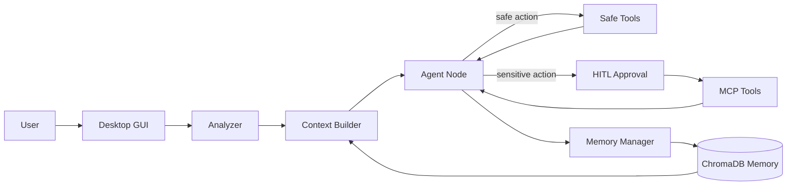

Lumi_agent는 개인 PC 환경에서 검색, 일정, 메시지 같은 외부 도구를 대화로 실행하고, 이전 대화 맥락을 기억하는 데스크톱 AI Agent 비서다.

이 프로젝트의 핵심은 캐릭터 UI 자체가 아니다. 더 중요한 축은 `Agent가 어떤 도구를 호출할지 판단하고`, `민감한 실행은 사용자 승인 뒤에 진행하며`, `대화가 길어져도 기억 구조로 맥락을 유지하는 것`이다.

## 문제

개인 PC에서 일할 때 사용자는 여러 도구를 오간다.

| 작업 | 일반적인 흐름 |
| --- | --- |
| 웹 정보 찾기 | 브라우저 검색, 결과 확인, 요약 |
| 일정 관리 | 캘린더 열기, 빈 시간 확인, 일정 추가 |
| 메시지 전달 | 메신저 열기, 채널 찾기, 내용 전송 |
| 이전 대화 참조 | 대화 기록 찾기, 맥락 다시 설명 |

챗봇이 답변만 생성하면 이 흐름을 줄이기 어렵다. 개인 비서라면 답변 생성뿐 아니라 외부 도구 실행, 실행 권한 경계, 과거 맥락 기억이 함께 필요하다.

## 해결 방향

Lumi_agent는 이 문제를 네 가지 구조로 나눴다.

| 축 | 역할 |
| --- | --- |
| LangGraph workflow | Agent 실행 흐름을 노드 단위로 분리 |
| MCP Tool Calling | 검색, 메시지, 일정 도구를 외부 실행 도구로 연결 |
| HITL 승인 경계 | 민감 도구는 사용자 승인 뒤 실행 |
| Memory/RAG | 단기 기억, 요약, 장기 기억 검색으로 맥락 유지 |

전체 흐름은 다음처럼 볼 수 있다.

## 주요 구현 축

첫 번째 축은 `LangGraph StateGraph`다. Agent 실행을 하나의 긴 함수로 만들지 않고, Analyzer, Context Builder, Agent, Tools, Memory Manager로 나눴다. 이 덕분에 도구 호출 전후 흐름과 메모리 업데이트 지점을 설명하기 쉬워졌다.

두 번째 축은 `MCP Tool Calling`이다. 검색, Discord, Slack, Calendar 같은 외부 서비스를 도구로 연결해 Agent가 실제 작업 흐름에 접근하도록 했다.

세 번째 축은 `HITL`이다. 모든 도구를 자동 실행하면 편하지만 위험하다. 반대로 모든 도구에 승인을 요구하면 사용성이 떨어진다. 그래서 검색처럼 비교적 안전한 도구와 메시지 전송, 일정 변경처럼 외부 상태를 바꾸는 도구를 분리했다.

네 번째 축은 `Memory/RAG`다. 개인 비서는 사용자의 이전 맥락을 기억해야 한다. Lumi_agent는 현재 대화 흐름을 단기 기억으로 관리하고, 길어진 대화는 요약 후 장기 기억으로 저장해 다시 검색할 수 있게 했다.

## 경계

이 프로젝트를 과장해서 설명하면 오히려 약해진다.

| 표현 | 판단 |
| --- | --- |
| 개인 PC 환경 AI Agent 비서 | 사용 가능 |
| MCP 기반 외부 도구 실행 구조 | 사용 가능 |
| 민감 도구 승인 흐름 | 사용 가능 |
| 모든 작업을 자동으로 처리하는 Agent | 사용하지 않음 |
| 외부 API 안정 운영 검증 | 사용하지 않음 |
| 테스트로 전체 품질 입증 | 사용하지 않음 |

당시 회고에는 Tool Call이 가끔 불안정했고, 애니메이션과 UX에도 개선 여지가 있었다는 내용이 남아 있다. 따라서 이 시리즈는 “완성된 서비스”가 아니라 “Agent 실행 구조를 어디까지 설계하고 연결했는가”에 초점을 둔다.

## 시리즈 구성

| 순서 | 글 |
| --- | --- |
| 01 | 이 글 |
| 02 | [웹/모바일 AI 비서의 한계를 PC Agent 문제로 바꾸기]() |
| 03 | [MCP prototype에서 LangGraph Agent까지의 개발 흐름]() |
| 04 | [Lumi_agent 전체 아키텍처]() |
| 05 | [LangGraph StateGraph로 Agent 실행 흐름을 분리한 이유]() |
| 06 | [MCP Tool Calling과 HITL 승인 경계 설계]() |
| 07 | [단기 기억, 요약, ChromaDB로 대화 맥락 유지하기]() |
| 08 | [PySide6와 qasync로 데스크톱 Agent UX를 연결하기]() |
| 09 | [Agent 품질을 어떻게 평가하려 했는가]() |
| 10 | [Tool Call 불안정성, 평가 한계, 그리고 Lumi_agent 회고]() |
