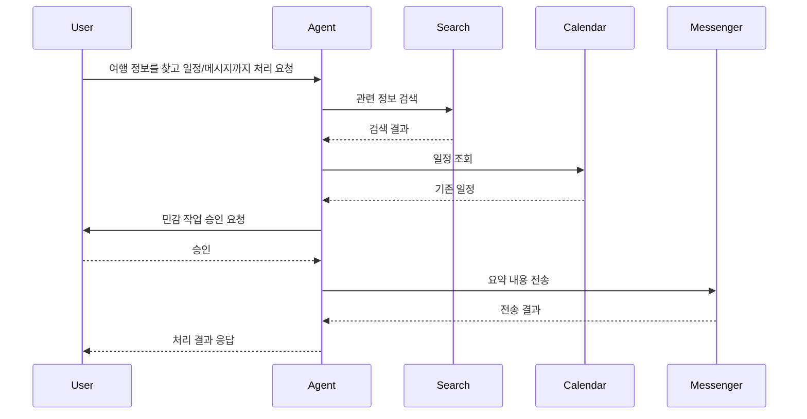

“제주도 맛집을 찾아서 메신저 채널에 보내줘.”

이 요청은 단순 질문이 아니다. 검색하고, 결과를 고르고, 내용을 요약하고, 보낼 채널을 찾고, 실제 전송까지 이어지는 작업이다. 일반 챗봇은 답변을 만들 수 있지만, 이 흐름을 끝까지 실행하려면 Agent 구조가 필요하다.

## 왜 PC Agent인가

기존 AI 비서는 웹이나 모바일 앱 안에서 잘 동작한다. 하지만 사용자가 실제로 일하는 PC 환경에서는 도구가 흩어져 있다.

| 상황 | 사용자가 직접 하던 일 |
| --- | --- |
| 정보 검색 | 브라우저에서 검색하고 결과를 복사 |
| 일정 관리 | Calendar를 열고 날짜와 빈 시간을 확인 |
| 메시지 공유 | Slack이나 Discord 채널을 찾아 전송 |
| 이전 맥락 확인 | 과거 대화를 다시 찾아 설명 |

Lumi_agent의 문제 정의는 “답변을 잘하는 챗봇”이 아니었다. 목표는 개인 PC 위에서 사용자의 업무 도구를 연결하고, 필요한 작업을 대화 흐름 안에서 실행하는 Agent 비서였다.

## 데모 흐름

데모 흐름은 크게 세 가지로 나눌 수 있다.

| 시나리오 | 흐름 |
| --- | --- |
| Calendar 관리 | 일정 조회, 빈 시간 확인, 일정 등록 또는 삭제 |
| Search + Calendar | 행사 정보를 검색한 뒤 일정과 겹치는지 확인 |
| Search + Messenger | 검색 결과를 요약하고 Discord 또는 Slack으로 전달 |

이 흐름의 핵심은 하나의 도구 호출이 아니라 여러 도구가 이어지는 것이다. 예를 들어 검색, 일정 확인, 메시지 전송이 이어지는 3단계 흐름은 PC Agent가 다뤄야 할 대표적인 멀티홉 작업이다.

## 문제를 다시 정의한 이유

처음부터 모든 기능을 안정적으로 자동화하는 것은 현실적이지 않다. 그래서 Lumi_agent는 “모든 일을 대신하는 비서”보다 다음 문제를 먼저 풀었다.

| 질문 | 설계 판단 |
| --- | --- |
| Agent가 어떤 도구를 쓸지 판단할 수 있는가 | Tool Calling 구조 필요 |
| 외부 상태 변경을 어떻게 제한할 것인가 | HITL 승인 필요 |
| 이전 대화를 어떻게 이어갈 것인가 | Memory/RAG 필요 |
| GUI가 멈추지 않고 응답할 수 있는가 | 비동기 GUI 구조 필요 |

이 네 가지가 연결되어야 데스크톱 Agent라고 부를 수 있다.

## 범위 밖으로 둔 것

Lumi_agent는 운영 성과보다 구조 검증에 초점을 둔 프로토타입이다. 당시 회고에서도 Tool Call 안정성과 애니메이션 UX는 개선 과제로 남아 있었다.

따라서 이 프로젝트의 성과는 외부 API 운영 성과가 아니라, 개인 PC Agent에 필요한 실행 흐름, 권한 경계, 기억 구조, GUI 연결을 하나의 프로토타입으로 엮었다는 점이다.

## 다음 글

다음 글에서는 개발 흐름을 기준으로 MCP prototype에서 LangGraph Agent까지 어떻게 구조가 바뀌었는지 정리한다.

[03. MCP prototype에서 LangGraph Agent까지의 개발 흐름]()
