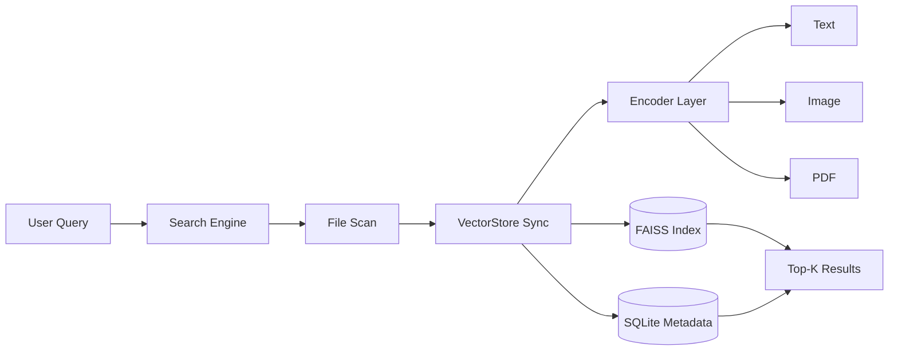

LocalLens는 로컬에 흩어진 텍스트, 이미지, PDF 파일을 자연어 질의로 찾기 위한 멀티모달 검색 엔진이다. 파일명이나 정확한 키워드를 기억하지 못해도, 파일의 내용과 시각 정보를 임베딩해 의미 기반으로 Top-K 결과를 반환하는 구조를 목표로 했다.

핵심은 검색 대상을 하나의 형식으로 강제로 맞추는 것이 아니라, 파일 타입별 인코더를 나누고 검색 흐름은 하나로 묶는 것이다.

## 문제 정의

로컬 파일 검색은 보통 파일명과 키워드에 의존한다. 이 방식은 사용자가 정확한 파일명을 기억하고 있을 때는 충분하지만, 다음 상황에서는 약하다.

| 상황 | 키워드 검색의 한계 |
| --- | --- |
| 사진 파일 | 파일명에 내용이 없으면 검색이 어려움 |
| PDF 문서 | 표, 그래프, 이미지 같은 시각 정보가 검색되지 않음 |
| 여러 형식이 섞인 폴더 | 텍스트, 이미지, 문서를 각각 다른 방식으로 찾아야 함 |
| 자주 바뀌는 로컬 폴더 | 삭제/수정된 파일과 검색 인덱스가 어긋날 수 있음 |

LocalLens는 이 문제를 `파일명 검색`이 아니라 `로컬 멀티모달 Retrieval` 문제로 보았다. 텍스트 파일은 텍스트 인코더로, 이미지는 이미지 인코더로, PDF는 텍스트 추출과 시각 정보 설명을 결합해 임베딩한다. 이후 자연어 질의를 파일 벡터와 비교해 유사한 결과를 찾는다.

## 해결 구조

LocalLens의 전체 흐름은 네 단계로 정리할 수 있다.

| 단계 | 역할 |
| --- | --- |
| File Scan | 검색 대상 폴더에서 지원 확장자 파일을 수집 |
| VectorStore Sync | SQLite metadata와 로컬 파일 상태를 비교 |
| Encoding | 파일 타입에 맞는 인코더로 임베딩 생성 |
| Search | FAISS에서 유사도 기반 Top-K 검색 수행 |

이 구조에서 중요한 지점은 FAISS와 SQLite를 함께 쓰는 방식이다. FAISS는 벡터 검색에 집중하고, SQLite는 파일 경로, 수정 시간, 확장자, 타입 같은 metadata를 관리한다. 이렇게 나누면 검색과 파일 상태 동기화를 각각 단순하게 유지할 수 있다.

## 기술 스택

| 영역 | 사용 기술 |
| --- | --- |
| Language | Python |
| Text Embedding | `intfloat/multilingual-e5-small` |
| Image Embedding | `google/siglip2-so400m-patch16-naflex` |
| PDF Processing | PyMuPDF |
| Visual Caption | Clova Studio VLM |
| Vector Search | FAISS |
| Metadata | SQLite |
| GUI | Tkinter |
| Config | Hydra, OmegaConf |
| Packaging | PyInstaller |

LocalLens는 local-first를 지향하지만 순수 오프라인 구조는 아니다. PDF 내부 이미지 captioning에는 외부 VLM 호출이 사용된다. 그래서 이 프로젝트는 “local-first를 지향한 구조”에 가깝고, “오프라인 전용 검색기”라고 부르기는 어렵다.

## 주요 구현 축

첫 번째 축은 `VectorStore`다. 로컬 파일은 계속 바뀐다. 파일이 삭제되었는데 벡터 인덱스에 남아 있거나, 파일이 수정되었는데 이전 벡터로 검색되면 결과가 실제 폴더 상태와 맞지 않는다. LocalLens는 `mtime` 기준으로 신규, 수정, 삭제 파일을 분류하고 변경된 파일만 다시 임베딩한다.

두 번째 축은 `Encoder Layer`다. 텍스트, 이미지, PDF는 입력 방식이 다르지만 검색 흐름에서는 같은 인터페이스로 다뤄야 한다. 그래서 `BaseEncoder`를 기준으로 `TextEncoder`, `ImageEncoder`, `PdfEncoder`를 나누고, 통합 Encoder가 파일 타입별 라우팅을 맡는다.

세 번째 축은 `PDF+VLM`이다. PDF는 텍스트만 있는 문서가 아니다. 표, 그래프, 이미지가 섞여 있을 수 있다. LocalLens는 PyMuPDF로 텍스트와 이미지를 추출하고, 이미지 요소를 VLM caption으로 바꾼 뒤 원본 텍스트와 결합한다.

네 번째 축은 `Desktop UX`다. 사용자는 검색 대상 폴더, 확장자, Top-K를 지정하고 결과 파일을 바로 열 수 있어야 한다. GUI는 검색 엔진 자체보다 보조적인 층이지만, 로컬 검색 경험에서는 중요한 연결 지점이다.

## 시리즈 구성

| 순서 | 글 |
| --- | --- |
| 01 | 이 글 |
| 02 | [파일명 검색의 한계를 의미 기반 검색으로 바꾸기]() |
| 03 | [LocalLens 검색 파이프라인 구조]() |
| 04 | [FAISS와 SQLite로 VectorStore를 나눈 이유]() |
| 05 | [Text, Image, PDF Encoder를 하나의 검색 흐름으로 묶기]() |
| 06 | [PDF 안의 표와 그래프를 검색 맥락으로 바꾸기]() |
| 07 | [정량 평가, 테스트 한계, 그리고 LocalLens 회고]() |
