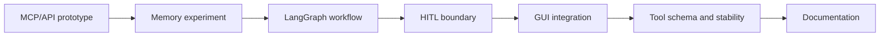

Lumi_agent의 개발 흐름은 “처음부터 완성된 Agent”가 아니라, MCP 도구 실험에서 시작해 Memory, LangGraph, HITL, GUI 안정화로 확장된 과정에 가깝다.

git history를 기준으로 보면 구조 변화는 다음 순서로 읽힌다.

## 개발 타임라인

| 날짜 | 흐름 | 의미 |
| --- | --- | --- |
| 2026-01-21 | Tool routing, Calendar, Discord/Slack mock, Native LangGraph, Hybrid HITL | Agent 실행 구조와 권한 경계 실험 |
| 2026-01-22 | Sliding Window, Summary API, RAG, memory 실험 | 대화 기억 구조 실험 |
| 2026-01-23 | Multi-server MCP architecture, setup guide | 외부 도구 서버 실행 구조 정리 |
| 2026-01-29 | MCP servers와 Clova routing agent 통합 | 도구 실행과 LLM Agent 연결 |
| 2026-02-02 | `graph.py` 추가, MCP agent refactoring | LangGraph workflow 분리 |
| 2026-02-03 | persona, context template, HITL 추가 | 동적 프롬프트와 승인 경계 보강 |
| 2026-02-04 | HITL, `as_node` 수정 | 승인 후 graph state 처리 보강 |
| 2026-02-05 | GUI 실행 파일 통합, animation, emotion analyzer | 데스크톱 UX와 Agent 연결 |
| 2026-02-06 | tool schema, Discord discovery, persona tone, GUI stability | Tool Call 안정성 보강 |
| 2026-02-10 | architecture 문서화 | 공개 설명 가능한 구조로 정리 |

## 구조 변화

초기에는 외부 API를 붙이는 실험이 중심이었다. Calendar, Discord, Slack, Search 같은 도구를 Agent가 사용할 수 있게 만드는 것이 먼저였다.

그다음 문제는 기억이었다. 개인 비서가 이전 대화를 계속 넣고 가면 context window가 금방 길어진다. 그래서 Sliding Window, Summary, ChromaDB 기반 장기 기억 구조가 들어갔다.

이후에는 Agent 실행 흐름을 명시적으로 관리하기 위해 LangGraph 구조가 추가됐다. 단순 wrapper보다 노드와 route가 보이는 구조가 필요했기 때문이다.

## 왜 타임라인 글이 필요한가

프로젝트를 결과만 보면 여러 기술을 붙인 것처럼 보인다. 하지만 history를 보면 각 기술이 들어간 이유가 분명하다.

| 문제 | 추가된 구조 |
| --- | --- |
| 외부 서비스를 실행해야 함 | MCP server, tool wrapper |
| 대화 맥락이 길어짐 | Sliding Window, Summary, ChromaDB |
| 도구 실행 흐름이 불투명함 | LangGraph StateGraph |
| 메시지 전송/일정 변경이 위험함 | Safe/Sensitive Tool, HITL |
| CLI와 GUI 이벤트 루프가 충돌함 | PySide6 + qasync |

이 순서를 따라가면 Lumi_agent는 단순 기능 목록이 아니라 “Agent 시스템을 만들면서 부딪힌 문제와 해결 순서”로 설명할 수 있다.

## 한계

git history만으로 정량 성능을 주장할 수는 없다. commit 메시지는 구현 흐름을 보여주지만, 평가 결과표를 대신하지 않는다. 따라서 이 글에서는 개발 경과와 설계 판단까지만 다룬다.

## 다음 글

다음 글에서는 현재 구조를 기준으로 GUI, Agent, MCP, Memory가 어떻게 연결되는지 정리한다.

[04. Lumi_agent 전체 아키텍처: GUI, Agent, MCP, Memory 연결]()
