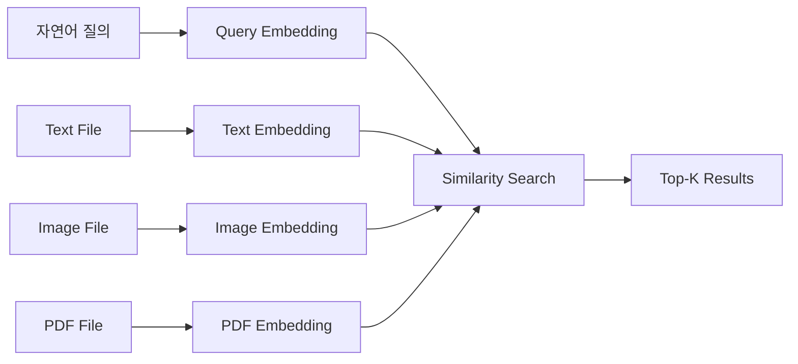

“강아지가 뛰어노는 사진”을 찾고 싶은데 파일명이 `20230322_084848.jpg`라면 파일명 검색은 도움이 되지 않는다. PDF 안의 그래프를 찾고 싶은데 해당 단어가 본문 텍스트에 없다면 일반 텍스트 검색도 놓칠 수 있다.

LocalLens의 출발점은 이 지점이었다. 사용자가 기억하는 것은 파일명이 아니라 대략적인 장면, 주제, 의미인 경우가 많다.

## 기존 검색 방식의 문제

로컬 파일 검색에서 흔한 입력은 파일명, 확장자, 일부 키워드다. 이 방식은 빠르고 단순하지만 검색 대상이 비정형 데이터로 넓어지면 한계가 커진다.

| 검색 대상 | 기존 방식의 문제 |
| --- | --- |
| 이미지 | 파일명에 내용이 없으면 검색할 수 없음 |
| 텍스트 문서 | 같은 의미라도 단어가 다르면 놓칠 수 있음 |
| PDF | 텍스트, 이미지, 표, 그래프가 섞여 있어 단일 방식으로 처리하기 어려움 |
| 로컬 폴더 | 파일이 계속 추가/수정/삭제되어 인덱스 동기화가 필요함 |

LocalLens는 파일을 “이름”이 아니라 “검색 가능한 의미 단위”로 바꾸는 구조를 택했다. 검색어도 단순 문자열이 아니라 query embedding이 되고, 파일도 타입별 embedding으로 변환된다.

## 사용자가 보는 흐름

사용자에게 노출되는 흐름은 단순하다.

| 단계 | 사용자가 하는 일 |
| --- | --- |
| 1 | 검색할 폴더를 선택한다 |
| 2 | 이미지, 텍스트, PDF 중 검색할 파일 타입을 고른다 |
| 3 | 자연어로 검색어를 입력한다 |
| 4 | Top-K 값을 정한다 |
| 5 | 결과 경로를 확인하고 파일을 연다 |

내부적으로는 더 많은 일이 일어난다. 폴더가 스캔되고, 기존 metadata와 비교해 변경된 파일만 추려지고, 필요한 파일은 인코더로 넘어간다. 이후 FAISS 인덱스에서 타입별로 검색하고 SQLite metadata를 통해 실제 파일 경로를 복원한다.

## 데모에서 보여준 것

발표 자료의 데모 흐름은 세 가지를 확인하는 데 집중했다.

| 데모 | 의미 |
| --- | --- |
| 텍스트 검색 | 정확한 키워드가 없어도 관련 문서를 의미 기반으로 찾는 흐름 |
| 이미지 검색 | 자연어 설명으로 이미지 파일을 찾는 흐름 |
| PDF 검색 | 텍스트와 시각 정보를 함께 고려해 문서를 찾는 흐름 |

이 데모는 대규모 운영 검증이 아니라 기능 흐름 검증에 가깝다. 핵심 성과는 “모든 파일을 잘 찾는다”가 아니라, “텍스트, 이미지, PDF를 같은 검색 UX로 연결했다”는 점이다.

## 제품 방향

LocalLens는 범용 클라우드 검색 서비스를 대체하려는 프로젝트가 아니다. 목표는 로컬 폴더 안의 파일을 사용자가 기억하는 의미로 찾는 것이다.

그래서 제품 방향도 명확하다.

| 방향 | 설명 |
| --- | --- |
| local-first | 원본 파일을 로컬 폴더 기준으로 다룸 |
| semantic search | 파일명보다 내용과 의미를 기준으로 검색 |
| multimodal | 텍스트, 이미지, PDF를 같은 검색 흐름에 연결 |
| desktop UX | 결과 파일을 사용자가 바로 열 수 있게 함 |

이 문제 정의가 뒤의 아키텍처를 결정했다. 파일은 계속 바뀌므로 sync가 필요했고, 파일 타입이 다르므로 encoder abstraction이 필요했고, PDF에는 시각 요소가 있으므로 VLM caption이 필요했다.

## 다음 글

다음 글에서는 이 문제 정의가 실제 검색 파이프라인으로 어떻게 연결되는지 정리한다.

[03. LocalLens 검색 파이프라인 구조]()
