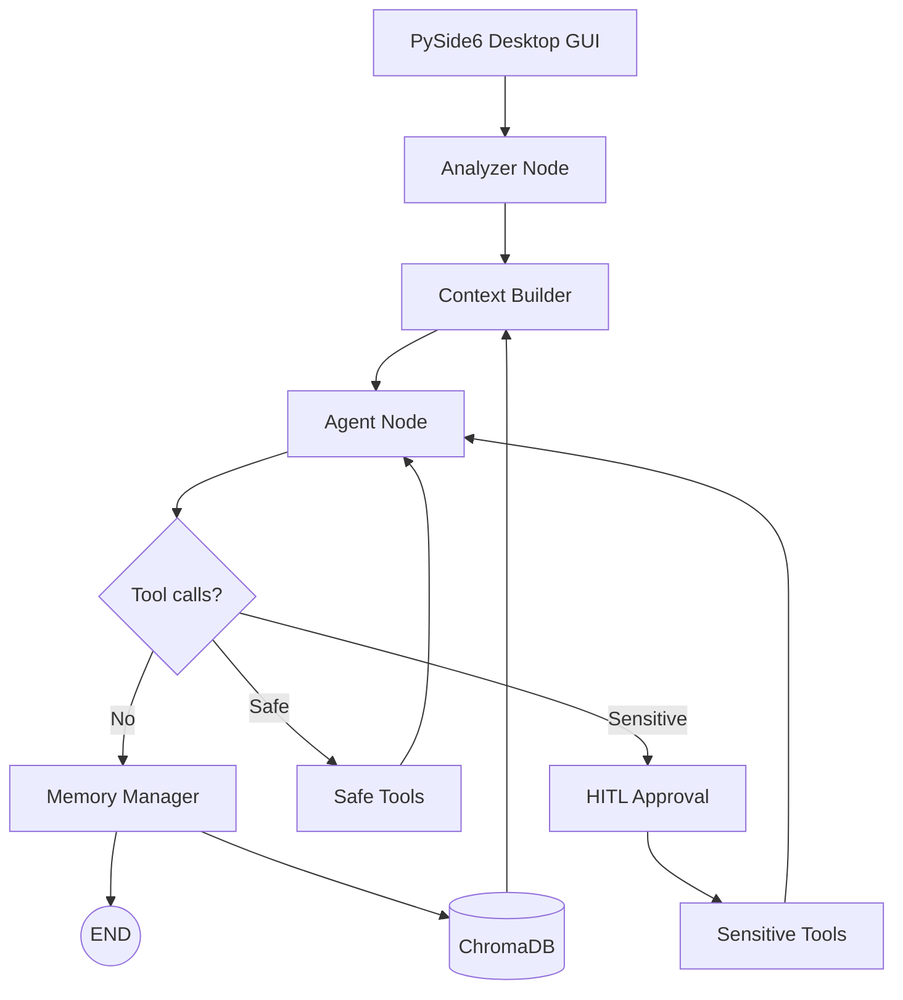

Lumi_agent의 전체 구조는 `Desktop GUI -> Analyzer -> Context Builder -> Agent Node -> MCP Tools -> Memory Manager` 흐름으로 이어진다.

사용자는 캐릭터형 GUI와 대화하지만, 내부에서는 감정/관계 상태, 기억 검색, 도구 라우팅, 승인 경계, 메모리 저장이 순서대로 움직인다.

## 전체 흐름

## 컴포넌트별 책임

| 컴포넌트 | 책임 |
| --- | --- |
| PySide6 GUI | 사용자 입력, 캐릭터 표시, 승인 팝업 |
| Analyzer Node | 감정 상태, 호감도 변화, 호칭/관계 변경 감지 |
| Context Builder | 관련 기억 검색, 페르소나/도구 지침/system prompt 조립 |
| Agent Node | LLM 응답 생성, 도구 호출 판단 |
| Safe Tools | 검색/조회처럼 비교적 안전한 도구 실행 |
| Sensitive Tools | 메시지 전송, 일정 변경처럼 외부 상태를 바꾸는 도구 실행 |
| Memory Manager | 토큰 관리, 요약, 장기 기억 저장 |

이 구조에서 중요한 점은 Agent가 모든 일을 직접 들고 있지 않다는 것이다. 감정 분석, context 구성, 도구 실행, 기억 관리를 노드로 분리해 각 단계의 책임을 나눴다.

## Context Builder 설정

코드 기준 Context Builder에는 다음 설정이 있다.

| 설정 | 값 | 의미 |
| --- | ---: | --- |
| `max_memories` | 5 | 한 번에 가져올 관련 기억 수 |
| `similarity_threshold` | 0.3 | 장기 기억 검색 최소 유사도 |
| `memory_token_budget` | 2048 | 기억을 prompt에 넣을 때의 예산 |

이 값은 정량 성능 claim이 아니라 설계 기준이다. Agent가 모든 기억을 넣는 대신, 관련 기억 일부만 가져와 system prompt에 결합하도록 설계했다.

## 상태 흐름

Agent state에는 단순 메시지만 들어가지 않는다.

| 상태 | 용도 |
| --- | --- |
| `messages` | 대화와 도구 응답 누적 |
| `system_prompt` | Context Builder가 만든 통합 지시문 |
| `retrieved_memories` | 검색된 장기 기억 |
| `context_metadata` | 검색 결과 수, prompt 길이 등 |
| `intimacy_level` | 호감도 상태 |
| `current_emotion` | 현재 감정 상태 |
| `user_profile` | 호칭, 관계, 첫 만남 정보 |

이 상태들이 합쳐져서 Lumi_agent는 매 턴 같은 프롬프트를 쓰지 않는다. 사용자 입력, 기억 검색 결과, 감정 상태, 도구 목록에 따라 system prompt가 다시 조립된다.

## 아키텍처의 의미

이 프로젝트의 핵심은 모델 하나를 잘 호출하는 것이 아니다. 모델 호출 전후에 어떤 맥락을 넣고, 어떤 도구를 허용하고, 어떤 실행은 멈춰서 승인받을지 정하는 구조다.

그래서 Lumi_agent는 `LLM 응답 UI`보다 `Agent workflow를 가진 데스크톱 비서`에 가깝다.

## 다음 글

다음 글에서는 LangGraph StateGraph로 실행 흐름을 분리한 이유를 더 자세히 정리한다.

[05. LangGraph StateGraph로 Agent 실행 흐름을 분리한 이유]()
