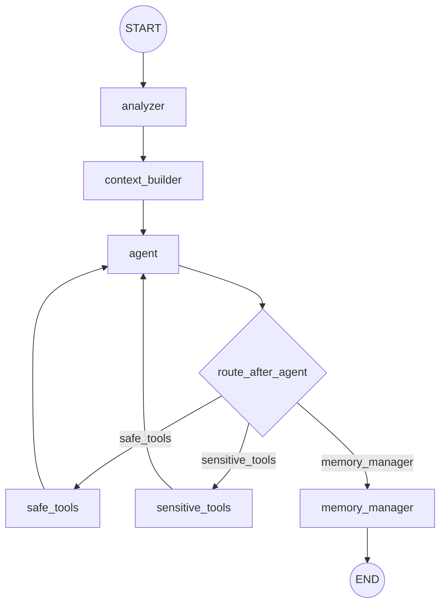

Lumi_agent에서 LangGraph를 쓴 이유는 “Agent를 만들 수 있어서”가 아니라 “실행 흐름을 보이게 만들 수 있어서”다.

외부 도구를 호출하는 Agent는 단순히 답변을 생성하는 챗봇보다 실패 지점이 많다. 도구를 호출할지, 어떤 도구가 안전한지, 실행 후 다시 생각할지, 마지막에 기억을 저장할지 결정해야 한다.

## wrapper 방식의 한계

Agent wrapper를 쓰면 빠르게 만들 수 있다. 하지만 실행 흐름이 라이브러리 안쪽에 숨으면 다음 질문에 답하기 어려워진다.

| 질문 | 필요한 제어 |
| --- | --- |
| 도구 호출 전 무엇을 prompt에 넣었나 | Context Builder 분리 |
| 민감 도구인지 어떻게 판단했나 | route 함수와 tool set 분리 |
| 도구 실행 후 어디로 돌아가나 | graph edge 명시 |
| 대화가 끝난 뒤 기억을 어디서 관리하나 | Memory Manager node |

Lumi_agent는 이 흐름을 `StateGraph`로 분리했다.

## 실행 흐름

Agent Node는 LLM 호출과 tool binding을 담당한다. Analyzer는 사용자 메시지에서 감정/호감도 상태를 읽고, Context Builder는 기억과 페르소나/도구 지침을 조립한다.

## route_after_agent

Agent 응답에 tool call이 없으면 Memory Manager로 이동한다. tool call이 있으면 호출된 도구 이름을 보고 safe 또는 sensitive 경로로 보낸다.

| 조건 | 이동 |
| --- | --- |
| tool call 없음 | `memory_manager` |
| 민감 도구 포함 | `sensitive_tools` |
| 그 외 도구 | `safe_tools` |

이 분기 덕분에 검색과 메시지 전송을 같은 방식으로 다루지 않는다.

## 단일 Agent와 분리된 노드

Lumi_agent의 Agent Node는 Reasoning, Tool Calling, Final Answer의 중심이다. 하지만 모든 기능을 Agent Node 안에 넣지는 않는다.

| 노드 | 분리 이유 |
| --- | --- |
| Analyzer | 감정/호감도 분석을 응답 생성과 분리 |
| Context Builder | 기억 검색과 prompt 조립을 LLM 호출 전 단계로 분리 |
| Tool Nodes | 안전 도구와 민감 도구 실행 경계를 분리 |
| Memory Manager | 응답 이후 기록 정리와 장기 저장을 분리 |

이 방식은 디버깅에도 유리하다. 어느 단계에서 실패했는지, 도구 호출 전 prompt가 어떤 상태였는지, memory update가 어디서 일어났는지 추적할 수 있다.

## 실패 대응

코드에는 LLM 호출 실패 시 기본 응답을 반환하는 fallback과 rate limit 계열 오류의 1회 재시도 흐름이 있다. 이것은 운영 안정성을 보장한다는 뜻이 아니라, Agent workflow가 실패를 완전히 무시하지 않도록 최소한의 응답 경로를 둔 것이다.

## 다음 글

다음 글에서는 MCP 도구와 HITL 승인 경계를 어떻게 나눴는지 정리한다.

[06. MCP Tool Calling과 HITL 승인 경계 설계]()
