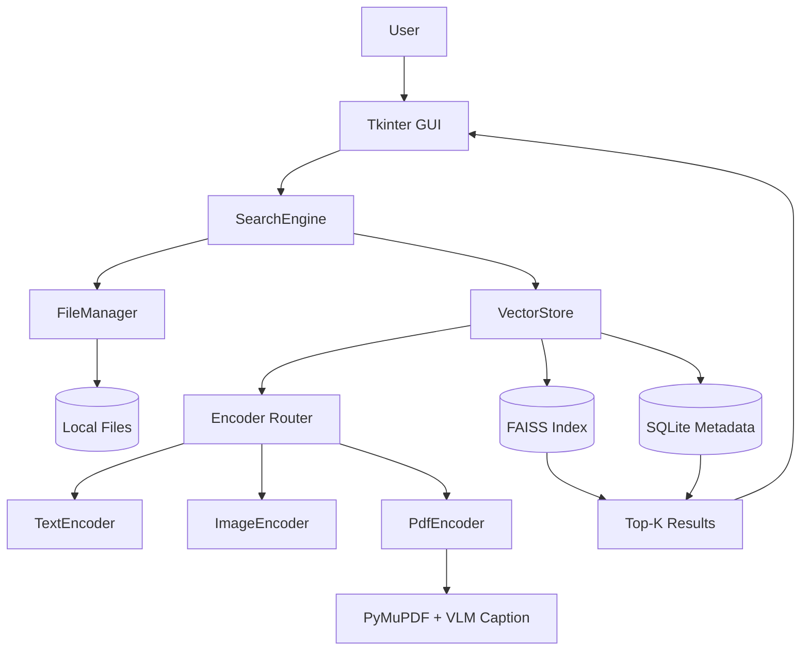

LocalLens의 검색은 `GUI -> SearchEngine -> FileManager -> VectorStore -> Encoder -> FAISS/SQLite -> Result` 흐름으로 이어진다. 사용자는 검색창 하나를 보지만, 내부에서는 파일 상태 동기화와 타입별 임베딩, 벡터 검색이 순서대로 실행된다.

## 전체 구조



구조를 이렇게 나눈 이유는 책임을 분리하기 위해서다. 검색 요청을 받는 코드, 파일을 찾는 코드, 벡터 저장소를 관리하는 코드, 파일을 임베딩하는 코드를 한 곳에 몰아두면 파일 타입이 늘어날수록 수정 지점이 커진다.

## SearchEngine

`SearchEngine`은 검색 흐름의 조정자다. 사용자가 입력한 query, target directory, extension filter, Top-K 값을 받아 다음 순서로 처리한다.

| 순서 | 작업 |
| --- | --- |
| 1 | 대상 폴더 스캔 |
| 2 | VectorStore 초기화 |
| 3 | 로컬 파일과 metadata 동기화 |
| 4 | query embedding 생성 |
| 5 | FAISS 검색 |
| 6 | 타입별 결과 반환 |

SearchEngine 자체가 모델을 직접 다루지는 않는다. 모델 로딩과 임베딩은 Encoder 계층에 맡기고, 파일 상태와 벡터 저장은 VectorStore에 맡긴다.

## FileManager

`FileManager`는 지정된 루트 폴더를 순회하며 지원 확장자만 모은다.

```text
image: .jpg, .jpeg, .png
text:  .txt, .md
docs:  .pdf
```

이 단계는 단순해 보이지만 중요하다. 검색 대상 타입을 먼저 나누어야 이후 Encoder가 필요한 모델만 로드할 수 있고, VectorStore도 타입별 인덱스를 관리할 수 있다.

## VectorStore

VectorStore는 두 가지 저장소를 함께 다룬다.

| 저장소 | 역할 |
| --- | --- |
| FAISS | 임베딩 벡터 저장과 유사도 검색 |
| SQLite | 파일 경로, 수정 시간, 확장자, 타입 metadata 관리 |

검색 결과에서 필요한 것은 벡터 ID만이 아니다. 사용자가 실제로 열 수 있는 파일 경로가 필요하다. 그래서 FAISS가 유사한 벡터 ID를 찾으면, SQLite metadata를 통해 파일 경로와 타입을 복원한다.

## Encoder Router

Encoder Router는 파일 타입에 맞는 인코더를 고른다.

| 타입 | 인코더 | 처리 방식 |
| --- | --- | --- |
| text | TextEncoder | 파일 텍스트를 읽고 passage embedding 생성 |
| image | ImageEncoder | 이미지를 로드하고 image embedding 생성 |
| docs | PdfEncoder | PDF 텍스트와 시각 설명을 결합해 embedding 생성 |

사용자의 query도 타입별로 다르게 임베딩된다. 텍스트 검색에서는 텍스트 query embedding을 만들고, 이미지 검색에서는 이미지 인코더의 text feature를 사용해 자연어 query와 image embedding을 비교한다.

## GUI의 역할

GUI는 검색 엔진의 핵심은 아니지만 사용 흐름을 완성한다. 사용자는 폴더를 고르고, 검색어를 입력하고, 확장자를 선택하고, Top-K 값을 조절한다. 검색 중에는 진행 상태를 확인하고, 결과가 나오면 파일 경로를 클릭해 바로 열 수 있다.

이 구조는 “모델 하나를 붙인 데모”보다 “로컬 파일 검색 흐름을 끝까지 연결한 데스크톱 검색기”에 가깝다.

## 다음 글

다음 글에서는 이 구조의 핵심인 VectorStore와 파일 동기화 방식을 정리한다.

[04. FAISS와 SQLite로 VectorStore를 나눈 이유]()
