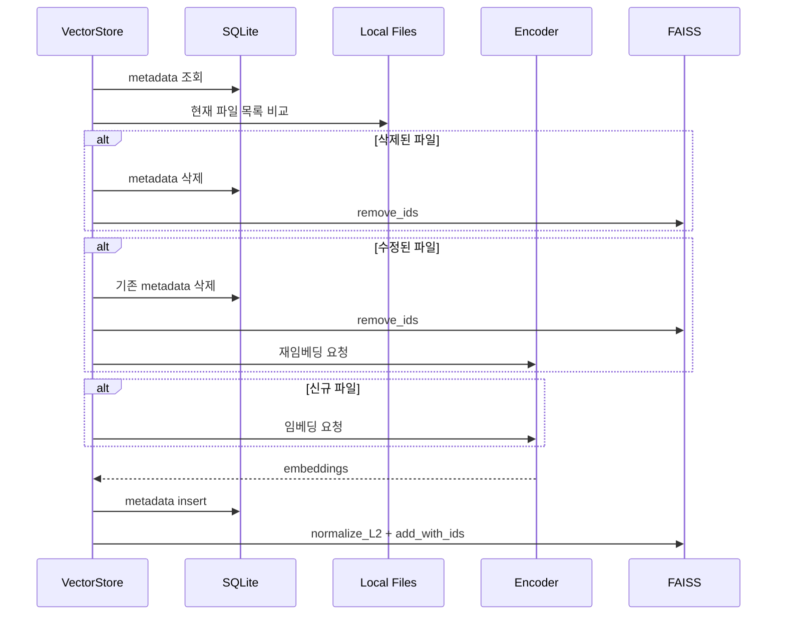

로컬 검색에서 어려운 문제는 벡터 검색 자체만이 아니다. 파일은 계속 추가되고, 수정되고, 삭제된다. VectorStore가 이 변화를 따라가지 못하면 검색 결과는 실제 폴더 상태와 어긋난다.

LocalLens는 이 문제를 FAISS와 SQLite의 역할 분리로 풀었다.

| 구성 | 책임 |
| --- | --- |
| FAISS | 벡터 저장, cosine similarity 기반 검색 |
| SQLite | 파일 경로, 수정 시간, 확장자, 타입 metadata |
| Sync Logic | 로컬 파일과 metadata를 비교해 변경분만 처리 |

## 왜 둘을 나눴나

FAISS는 벡터 검색에 적합하지만 파일 상태 관리용 DB는 아니다. 반대로 SQLite는 경량 metadata 관리에 좋지만 벡터 유사도 검색 엔진은 아니다.

그래서 LocalLens는 벡터와 파일 정보를 분리했다.

```text
FAISS  -> id, embedding vector
SQLite -> id, file_path, mtime, extension, type
```

이 분리 덕분에 검색 시에는 FAISS가 유사한 ID를 찾고, SQLite가 해당 ID의 파일 경로를 제공한다. 삭제나 수정이 발생하면 SQLite metadata와 FAISS index를 같은 ID 기준으로 정리한다.

## 동기화 흐름



동기화 기준은 `mtime`이다. SQLite에 저장된 수정 시간과 현재 파일의 수정 시간이 다르면 수정된 파일로 판단한다. DB에는 있지만 로컬 폴더에는 없으면 삭제된 파일로 판단한다. 로컬에는 있지만 DB에 없으면 신규 파일이다.

## 변경 파일만 임베딩하기

모든 검색 요청마다 전체 파일을 다시 임베딩하면 로컬 데스크톱 검색기로 쓰기 어렵다. 특히 이미지와 PDF는 임베딩 비용이 더 크다.

LocalLens는 변경된 파일만 임베딩 대상으로 보낸다.

| 파일 상태 | 처리 |
| --- | --- |
| unchanged | 임베딩 생략 |
| new | 임베딩 생성 후 추가 |
| modified | 기존 벡터 삭제 후 재임베딩 |
| deleted | metadata와 FAISS ID 삭제 |

이 방식은 검색 품질을 직접 높이는 기법은 아니다. 대신 로컬 검색기가 실제 폴더 상태와 계속 맞춰지도록 만드는 운영 구조에 가깝다.

## 타입별 인덱스

LocalLens는 파일 타입별로 인덱스를 나눠 관리한다. 이미지, 텍스트, PDF는 서로 다른 인코더를 거치기 때문이다.

```text
index_image.faiss
index_text.faiss
index_docs.faiss
metadata.db
```

사용자가 이미지와 텍스트를 함께 검색하면 VectorStore는 타입별 인덱스를 순회하면서 query embedding을 만들고 검색한다. 결과는 타입별 파일 경로와 score 목록으로 반환된다.

## 설계상 한계

`mtime` 기반 동기화는 단순하고 빠르지만 모든 변경 상황을 세밀하게 설명하지는 않는다. 예를 들어 파일 내용은 바뀌었지만 수정 시간이 보존된 경우에는 감지하지 못할 수 있다. 더 엄밀한 방식이 필요하다면 content hash를 함께 저장하는 방향으로 확장할 수 있다.

또한 FAISS와 SQLite를 같이 업데이트하므로, 중간 실패 시 일관성 복구 전략이 필요하다. 프로젝트 범위에서는 local desktop prototype 수준에서 sync 흐름을 구현했고, 대규모 운영 저장소 수준의 복구 시스템까지 다루지는 않았다.

## 다음 글

다음 글에서는 VectorStore 뒤에서 실제 임베딩을 처리하는 Encoder 구조와 모델 선택을 정리한다.

[05. Text, Image, PDF Encoder를 하나의 검색 흐름으로 묶기]()
