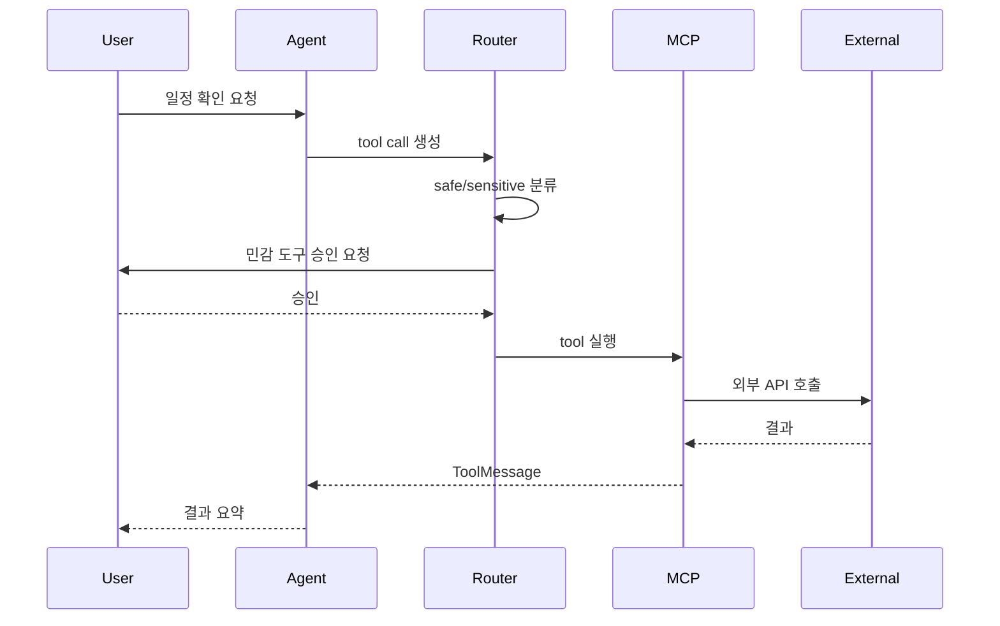

“검색해줘”와 “메시지 보내줘”는 같은 도구 호출이 아니다.

검색은 결과가 마음에 들지 않으면 다시 하면 된다. 하지만 메시지 전송이나 일정 변경은 외부 상태를 바꾼다. Lumi_agent가 Safe Tool과 Sensitive Tool을 나눈 이유는 이 차이 때문이다.

## MCP Tool Calling 구조

Lumi_agent는 여러 외부 도구를 MCP 기반으로 연결한다.

| 도구 범주 | 예시 |
| --- | --- |
| Search | Naver Search 계열 검색 |
| Messenger | Discord, Slack |
| Calendar | Google Calendar |
| Knowledge | Wikipedia 계열 일반 지식 검색 |

Agent는 사용자의 요청을 보고 필요한 도구를 선택한다. 도구 실행 결과는 다시 Agent로 돌아오고, Agent는 결과를 해석해 응답하거나 다음 도구 호출을 판단한다.

## Safe Tool과 Sensitive Tool

코드 기준 민감 도구 목록에는 메시지 조회/전송, reaction 추가, Slack 대화 조회/전송, Calendar 조회/생성/수정/삭제가 포함된다.

| 구분 | 실행 방식 | 이유 |
| --- | --- | --- |
| Safe Tool | 자동 실행 가능 | 검색/조회처럼 위험이 낮은 작업 |
| Sensitive Tool | 사용자 승인 후 실행 | 메시지 전송, 일정 변경처럼 외부 상태를 바꾸는 작업 |

중요한 점은 모든 도구를 무조건 막지 않았다는 것이다. 검색까지 매번 승인받으면 사용성이 떨어진다. 반대로 메시지 전송까지 자동으로 두면 권한 경계가 약해진다.

## HITL 승인 흐름

Lumi_agent는 graph compile 단계에서 민감 도구 실행 전에 interrupt를 둔다. GUI에서는 승인 다이얼로그로 사용자에게 실행할 도구와 매개변수를 보여준다.

승인되면 sensitive tool node가 실행된다. 거부되면 Agent에게 거부 사실을 ToolMessage로 전달하고, 다른 대안을 안내하거나 실행하지 않은 상태를 설명하도록 한다.

## 이 설계가 필요한 이유

AI Agent는 “할 수 있다”보다 “해도 되는가”가 중요하다. 검색 결과를 가져오는 것과 외부 채널에 메시지를 보내는 것은 위험도가 다르다.

Lumi_agent의 HITL은 단독 보안 대책으로 볼 수 없다. 다만 민감 도구 실행 전 사용자가 개입하는 경계를 명시했다는 점에서 Agent 실행 설계의 핵심 축이다.

## 남은 과제

Tool Call 안정성은 후속 개선이 필요한 지점으로 남았다. 개선 방향은 다음과 같다.

| 과제 | 개선 방향 |
| --- | --- |
| 잘못된 도구 선택 | tool schema 검증, 라우팅 로그 분석 |
| 반복 호출 | 호출 횟수 제한, 동일 파라미터 반복 방지 |
| 승인 UX | 실행 전 변경되는 외부 상태를 더 명확히 표시 |
| 실패 처리 | retry 정책과 fallback 응답 분리 |

## 다음 글

다음 글에서는 대화 맥락을 유지하기 위한 Memory/RAG 구조를 정리한다.

[07. 단기 기억, 요약, ChromaDB로 대화 맥락 유지하기]()
