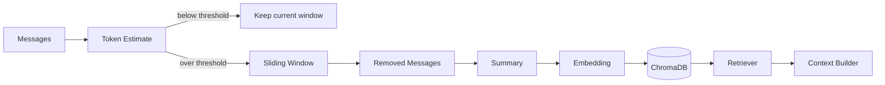

개인 비서는 한 번의 질문만 처리하면 부족하다. 사용자가 이전에 말한 취향, 약속, 맥락을 다시 불러올 수 있어야 한다.

Lumi_agent의 Memory 구조는 단기 기억과 장기 기억을 분리한다. 현재 대화 흐름은 단기 기억으로 유지하고, 길어진 대화는 요약 후 벡터화해 장기 기억으로 저장한다.

## Memory 흐름

## 단기 기억과 장기 기억

| 구분 | 역할 |
| --- | --- |
| 단기 기억 | 현재 대화 흐름과 최근 메시지 유지 |
| 요약 | 오래된 대화를 압축해 장기 저장 가능한 형태로 변환 |
| 장기 기억 | 요약된 대화와 metadata를 ChromaDB에 저장 |
| 검색 | 사용자 입력과 관련된 과거 기억을 Context Builder로 전달 |

이 구조는 모든 대화를 계속 prompt에 넣지 않기 위한 장치다. Context window는 유한하고, 기억이 늘어날수록 페르소나와 도구 지침이 밀릴 수 있기 때문이다.

## 기본 설정과 실행 설정

Memory Manager의 기본 설정은 다음과 같다.

| 설정 | 값 | 의미 |
| --- | ---: | --- |
| `token_threshold` | 2000 | 이 값을 넘으면 trimming 대상 |
| `max_tokens_after_trim` | 1000 | trimming 후 남길 최대 토큰 기준 |
| `chars_per_token` | 1.5 | 한글 기준 토큰 추정에 사용 |
| `archive_removed` | true | 제거된 메시지를 요약/저장 |

GUI 통합 흐름에서는 `token_threshold=8192`, `max_tokens_after_trim=4000`으로 더 긴 대화 맥락을 유지하도록 조정한 지점도 확인된다. 이 수치는 서비스 품질 지표가 아니라 메모리 관리 로직의 기준값이다.

## ChromaDB 저장과 검색

장기 기억은 ChromaDB에 저장된다. 저장 시에는 user id, type, message count, created at 같은 metadata를 함께 넣는다.

Context Builder는 마지막 사용자 메시지에서 검색 쿼리를 추출하고, ChromaDB에서 관련 기억을 가져온다. 기본 검색은 최대 5개 기억을 가져오며, 유사도 threshold는 0.3이다. GUI 통합 흐름에서는 threshold를 0.7로 조정해 더 가까운 기억만 쓰도록 한 설정도 확인된다.

| 단계 | 설명 |
| --- | --- |
| query 추출 | 마지막 사용자 메시지를 검색 쿼리로 사용 |
| memory search | 관련 기억을 ChromaDB에서 검색 |
| threshold filter | 낮은 관련도 결과 제거 |
| prompt injection | system prompt에 관련 과거 대화 기록으로 삽입 |

## 왜 RAG라고 볼 수 있나

여기서 RAG는 문서 검색 QA가 아니다. 과거 대화 요약을 검색해 현재 응답 맥락으로 넣는 구조다.

정확한 표현은 “대화 기억 기반 Memory/RAG”다. 장기 기억 품질을 보장한다고 말할 수는 없지만, 과거 맥락을 저장하고 검색해 prompt에 반영하는 구조는 구현되어 있다.

## 한계

요약이 잘못되면 장기 기억도 잘못 저장된다. 검색 threshold가 낮으면 관련 없는 기억이 들어올 수 있고, 높으면 필요한 기억을 놓칠 수 있다. 따라서 Memory/RAG 구조는 후속 평가가 필요하다.

## 다음 글

다음 글에서는 데스크톱 GUI와 Agent 실행을 어떻게 연결했는지 정리한다.

[08. PySide6와 qasync로 데스크톱 Agent UX를 연결하기]()
