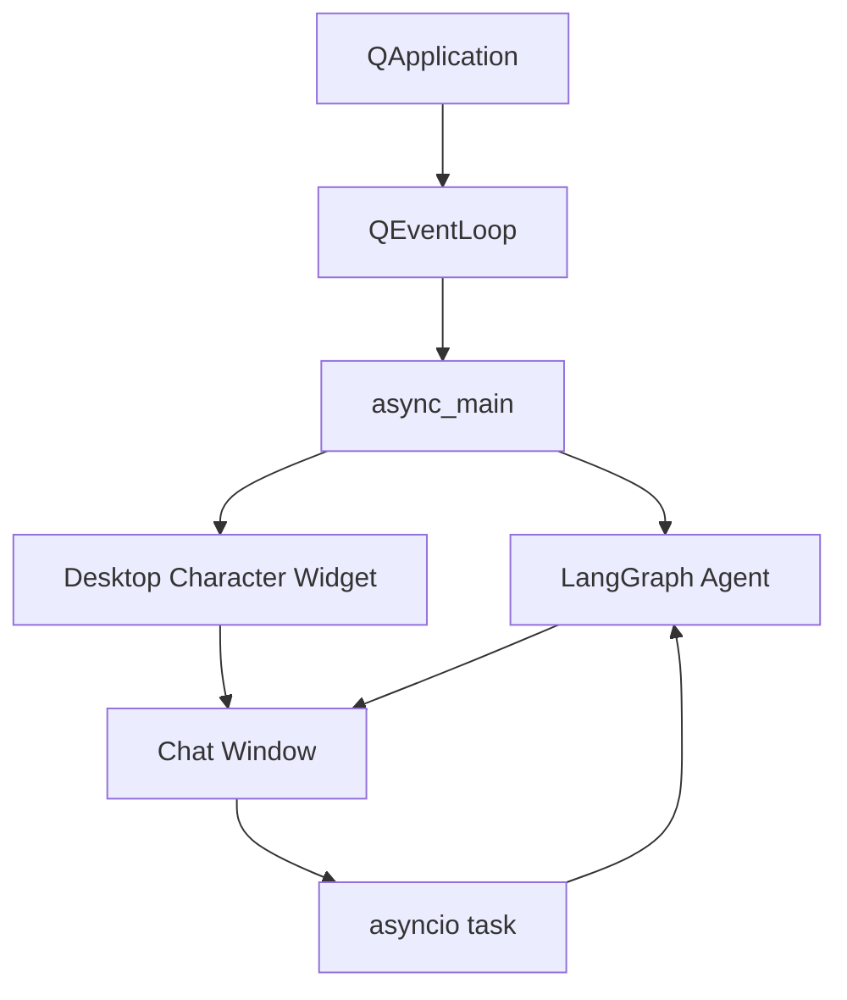

데스크톱 Agent에서 어려운 점은 LLM 호출만이 아니다. 사용자가 메시지를 보내는 동안 GUI가 멈추면 비서처럼 느껴지지 않는다.

Lumi_agent는 PySide6 GUI와 비동기 Agent 실행을 연결하기 위해 qasync를 사용했다. Qt 이벤트 루프와 asyncio 작업을 하나의 흐름으로 묶는 것이 핵심이었다.

## GUI 통합 전 문제

초기 구조에서는 CLI Agent와 GUI가 서로 다른 입력 루프를 갖는다.

| 구성 | 문제 |
| --- | --- |
| CLI Agent | `input()` 기반 대화 루프 |
| PySide6 GUI | Qt 이벤트 루프 |
| asyncio Agent 실행 | 별도 비동기 이벤트 루프 |

이 셋을 단순히 합치면 GUI가 멈추거나 이벤트 루프 충돌이 생긴다.

## qasync 구조

qasync를 사용하면 Qt 이벤트 처리와 Agent 비동기 호출을 같은 이벤트 루프에서 다룰 수 있다. 사용자가 메시지를 보내도 GUI는 계속 반응하고, Agent 응답이 오면 화면에 결과를 표시한다.

## HITL 승인 UX

민감 도구가 호출되면 GUI는 승인 다이얼로그를 띄운다. 사용자는 실행될 도구와 매개변수를 보고 승인하거나 거부할 수 있다.

이 UX는 단순 확인창이 아니다. Agent가 외부 상태를 바꾸기 전에 사람의 판단을 끼워 넣는 지점이다.

## Persona와 감정 상태

Lumi_agent는 단순 작업 비서만 목표로 하지 않았다. 감정 상태와 호감도에 따라 말투와 반응이 바뀌는 캐릭터형 Agent UX도 함께 다뤘다.

구현 기준 감정 상태는 7종으로 다뤄진다.

| 상태 | 의미 |
| --- | --- |
| basic | 기본 |
| happy | 긍정 |
| love | 높은 호감 |
| sad | 슬픔 |
| angry | 화남 |
| pouting | 삐침 |
| busy | 도구 실행 중 |

호감도는 0~100 범위에서 관리되고, 말투는 10단계 구간으로 나뉜다. 분석 노드는 한 번의 입력에서 변화 폭을 제한하고, 이 값은 UI 반응과 페르소나 prompt에 반영된다.

## 왜 UX 글이 필요한가

Agent 프로젝트를 설명할 때 GUI를 장식처럼 보면 안 된다. Lumi_agent에서 GUI는 사용자 입력, 응답 표시, 민감 도구 승인, 감정 상태 표현을 모두 담당한다.

즉, GUI는 모델 결과를 보여주는 껍데기가 아니라 Agent 실행 경계와 사용자의 개입을 연결하는 인터페이스다.

## 한계

애니메이션 동작이 고정적이라는 한계는 남아 있다. 따라서 이 글의 결론은 “완성도 높은 캐릭터 UX”가 아니라 “데스크톱 GUI와 Agent workflow를 연결한 구조”다.

## 다음 글

다음 글에서는 Agent 품질을 어떻게 평가하려 했는지, 그리고 왜 결과 수치를 단정하지 않는지 정리한다.

[09. Agent 품질을 어떻게 평가하려 했는가]()
