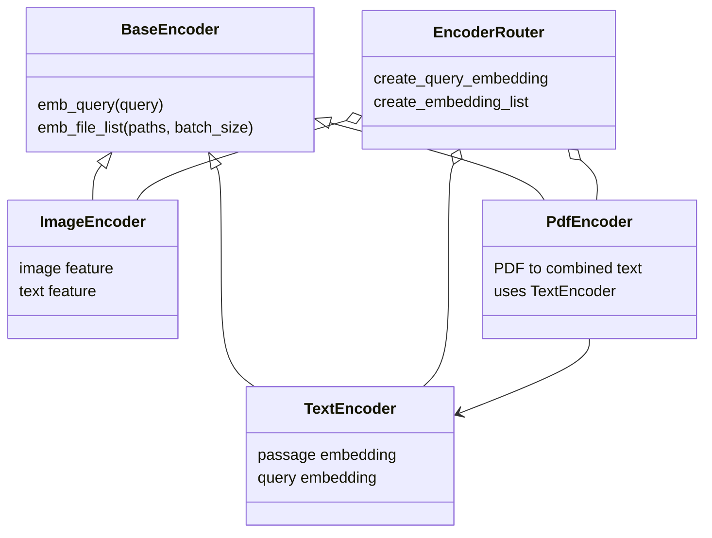
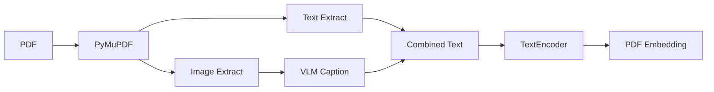

LocalLens에서 검색 대상은 텍스트, 이미지, PDF다. 세 파일 타입은 전처리도 다르고 사용하는 모델도 다르다. 하지만 검색 결과는 하나의 흐름으로 돌아와야 한다.

그래서 Encoder 계층은 “타입별 처리”와 “공통 검색 인터페이스”를 분리했다.



## 공통 인터페이스

각 인코더는 두 가지 일을 해야 한다.

| 메서드 | 의미 |
| --- | --- |
| `emb_query(query)` | 사용자 질의를 검색용 벡터로 변환 |
| `emb_file_list(paths, batch_size)` | 파일 목록을 임베딩 벡터 목록으로 변환 |

이 인터페이스 덕분에 VectorStore는 파일 타입별 세부 구현을 몰라도 된다. VectorStore는 “이 타입의 파일들을 임베딩해 달라”고 요청하고, Encoder Router가 적절한 인코더로 넘긴다.

## TextEncoder

텍스트 파일은 `intfloat/multilingual-e5-small`로 임베딩한다. 파일 본문은 passage embedding으로 만들고, 사용자 질의는 query embedding으로 만든다.

이때 query와 passage prefix를 구분한다.

```text
query: 사용자의 검색어
passage: 파일 본문
```

이 구분은 검색 모델이 질의와 문서의 역할을 다르게 이해하도록 돕는다.

## ImageEncoder

이미지 검색은 이미지와 자연어를 같은 벡터 공간에서 비교해야 한다. LocalLens는 SigLIP2 계열 모델을 사용해 이미지 파일은 image feature로, 자연어 query는 text feature로 변환한다.

사용자는 이미지 파일명을 몰라도 “강아지”, “그래프”, “문서 캡처”처럼 시각적 내용을 설명하는 검색어를 입력할 수 있다.

## PdfEncoder

PDF는 별도 처리가 필요하다. 텍스트만 추출하면 표, 그래프, 이미지 같은 시각 요소가 빠질 수 있다.

PdfEncoder는 다음 순서로 동작한다.



결국 PDF도 검색 인덱스에는 하나의 텍스트 기반 임베딩으로 들어간다. 차이는 그 텍스트가 단순 추출 텍스트가 아니라, 필요할 때 시각 정보 설명을 포함한다는 점이다.

## 모델 선택 기준

발표자료 기준으로 텍스트 인코더 선택은 정확도만 보지 않았다. 로컬 데스크톱 검색기에서는 문서가 많아질수록 인덱싱 시간이 사용자 경험에 직접 영향을 준다.


발표자료의 MIRACL 기준 후보 모델 비교는 다음처럼 정리할 수 있다.

| 모델 | 모델 크기 | MIRACL 점수 |
| --- | ---: | ---: |
| BAAI/bge-m3 | 0.57B | 69.59 |
| Snowflake/snowflake-arctic-embed-l-v2.0 | 0.57B | 66.53 |
| google/embeddinggemma-300m | 0.31B | 66.20 |
| intfloat/multilingual-e5-small | 0.12B | 60.09 |
| ibm-granite/granite-embedding-107m-multilingual | 0.11B | 57.25 |

점수만 보면 더 높은 후보가 있다. 하지만 LocalLens의 목표는 로컬 폴더를 빠르게 인덱싱하고 다시 검색할 수 있는 구조였다.


발표자료의 500개 문서 처리 실험 기준으로는 다음 차이가 있었다.

| 모델 | 500개 총 소요 시간 | 개당 평균 |
| --- | ---: | ---: |
| Snowflake/snowflake-arctic-embed-l-v2.0 | 962.07초 | 1.92초 |
| intfloat/multilingual-e5-small | 62.07초 | 0.12초 |

따라서 LocalLens에서는 절대 점수가 가장 높은 모델보다, 로컬 환경에서 사용 가능한 속도와 품질의 균형을 우선했다. 이 수치는 발표자료 기준이며, 모든 환경에서 같은 처리 시간을 보장하는 값은 아니다.

## 다음 글

다음 글에서는 PDF 내부 시각 정보를 어떻게 검색 맥락으로 바꾸었는지 정리한다.

[06. PDF 안의 표와 그래프를 검색 맥락으로 바꾸기]()
