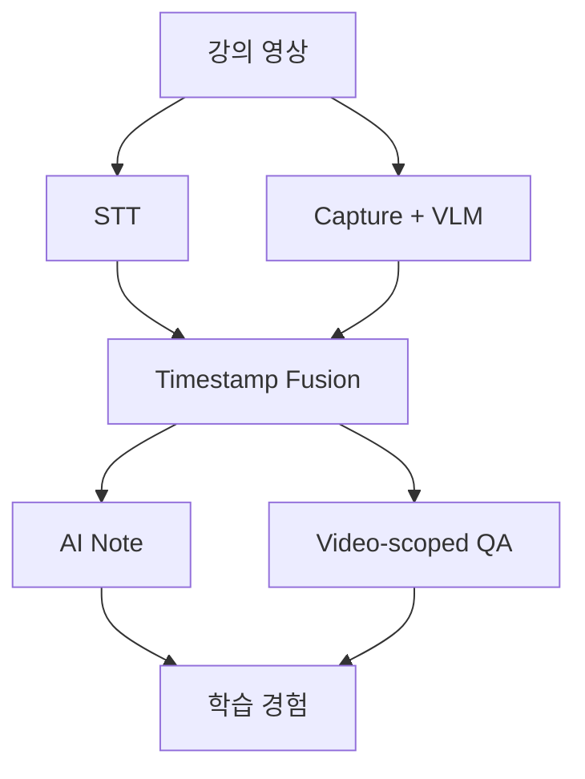
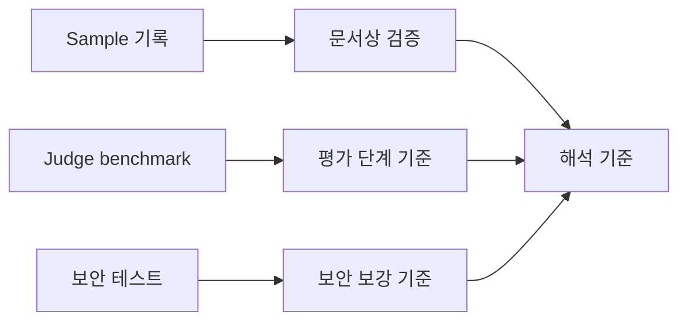

SeSAC:Note를 만들면서 가장 크게 배운 점은 AI 서비스가 모델 호출만으로 완성되지 않는다는 것이다. STT, VLM, Summarizer, Judge, QA가 각각 좋아도 중간 연결이 약하면 사용자는 안정적인 학습 노트를 얻기 어렵다.

## 연결 구조가 품질을 만든다

멀티모달 AI 서비스에서 품질은 마지막 LLM prompt에서만 결정되지 않는다. 앞단에서 어떤 화면을 캡처했는지, STT와 VLM 결과를 어떻게 같은 시간 구간으로 묶었는지, 그 segment가 요약과 QA에 어떻게 전달되는지가 전체 품질을 좌우한다.

| 연결 지점 | 배운 점 |
| --- | --- |
| Capture -> VLM | 중복 슬라이드가 많으면 비용과 지연이 커짐 |
| STT + VLM -> Fusion | 화면과 음성을 같은 segment로 묶어야 근거가 생김 |
| Fusion -> Summary | 구조화된 입력이 있어야 노트 품질이 안정됨 |
| Summary -> Judge | 생성 결과를 근거와 비교하는 보조 점검이 필요함 |
| Summary/Segment -> QA | 질문이 영상 밖으로 벗어나지 않게 범위를 제한해야 함 |

이 프로젝트에서 가장 중요한 설계 판단은 "모든 것을 한 번에 잘하는 LLM"을 기대하지 않는 것이었다. 각 단계의 역할을 나누고, 중간 산출물을 저장하고, 다음 단계가 사용할 수 있는 형태로 넘기는 구조가 더 중요했다.

## 확인한 것

프로젝트 기록에는 sample pipeline, Judge benchmark, 보안 테스트, frontend build처럼 서로 다른 종류의 확인 결과가 남아 있다.

| 확인 항목 | 해석 |
| --- | --- |
| sample pipeline | STT, batch, segment, Judge 결과가 단계별로 남는 흐름 확인 |
| Judge benchmark | prompt 버전별 평가 시간과 token 사용량 비교 |
| 보안 테스트 | media ticket, upload validation 등 일부 부정 경로 확인 |
| frontend build | 프론트엔드 빌드 가능성 확인 |

특히 sample4 기준 기록에서는 `Video DONE`, `STT 42개`, `Batch 2/2`, `Segment 8개`, `Judge Scores 8.26 / 8.96` 흐름이 남아 있다. Judge benchmark에서는 v3 기준 평균 평가 시간 14.7초, 평균 토큰 14,734 tokens, benchmark 조건 5/5 통과가 기록되어 있다. 이 수치들은 설계 판단의 근거로 볼 수 있지만, 모든 영상에서 같은 결과를 보장하는 지표는 아니다.

## 다음 개선 방향

마지막으로 남은 개선 방향은 세 가지로 압축된다.

| 개선 방향 | 해석 |
| --- | --- |
| 응답 속도 최적화 | VLM 호출과 요약 생성 구간의 병목을 계속 줄여야 함 |
| 서빙 역량 강화 | 외부 API 의존도를 낮추는 자체 서빙 구조가 장기 과제 |
| 판서 인식 확장 | 슬라이드 중심 구조를 판서형 강의까지 넓히려는 방향 |

이 항목들은 완료된 성과가 아니라 후속 과제다. 따라서 "구현 완료"가 아니라 "남은 개선 방향"으로만 적는 것이 맞다.

## 전체 시리즈

이번 시리즈는 SeSAC:Note를 하나의 긴 개발 흐름으로 정리했다.

1. [01. SeSAC:Note 프로젝트 개요: 강의 영상을 AI 학습 노트로 바꾸기]()
2. [02. SeSAC:Note 핵심 기능과 구조]()
3. [03. 6장으로 보는 SeSAC:Note 포트폴리오 요약]()
4. [04. 문제 정의: STT 요약을 넘어 독립형 강의 노트로]()
5. [05. 아키텍처: STT, VLM, Fusion을 연결하는 방법]()
6. [06. 캡처와 VLM 개선: 중복 슬라이드와 입력 품질 다루기]()
7. [07. 비동기 처리: 긴 영상의 대기시간과 상태 추적 줄이기]()
8. [08. QA 설계: 영상 근거 안에서만 답하게 만들기]()
9. [09. Judge 설계: 요약 품질을 보조 평가하는 방법]()
10. [10. 프로젝트 회고: 멀티모달 AI 서비스에서 배운 것]()

- 이전 글: [09. Judge 설계: 요약 품질을 보조 평가하는 방법]()
