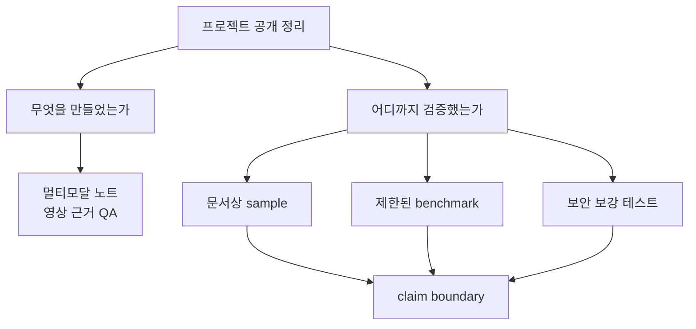
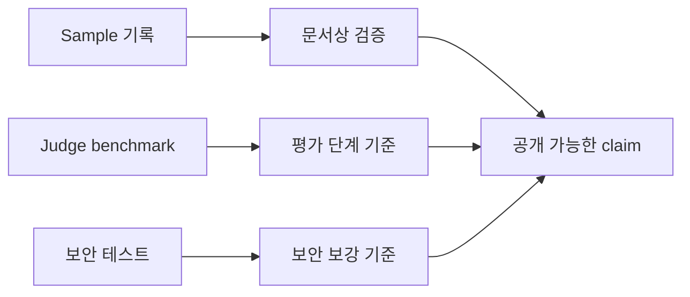

# 10. 프로젝트 회고: 검증 범위, 보안 보강, 남은 한계

SeSAC:Note를 공개 프로젝트 글로 정리할 때 가장 중요한 것은 "무엇을 만들었는가"만이 아니었다. "무엇을 어디까지 검증했는가"를 같은 비중으로 적어야 했다.

SeSAC:Note는 공개 README 기준으로 정리한 프로젝트다. 검증 근거는 문서상 sample pipeline, 제한된 Judge benchmark, 보안 보강 테스트처럼 기준이 서로 다르다. 이 기준을 섞으면 실제보다 넓은 claim처럼 보일 수 있다.

## 검증을 기준별로 나누는 이유

검증에는 종류가 있다. 문서상 sample 실행 기록, Judge benchmark, 보안 단위 테스트, frontend build는 서로 다른 의미를 가진다.

| 검증 기준 | 의미 |
| --- | --- |
| 문서상 sample pipeline | 특정 sample 기준으로 파이프라인 결과가 기록됨 |
| 제한된 Judge benchmark | Judge prompt 버전별 평가 시간, 토큰, 통과 여부 비교 |
| 보안 보강 테스트 | 일부 보안 흐름의 부정 경로 확인 |
| frontend build | 프론트엔드 빌드 가능성 확인 |

이것들을 하나로 묶어 "전체 서비스가 검증됐다"고 말하면 안 된다. 각 검증은 범위와 조건이 다르다.

## 문서상 sample pipeline 검증

프로젝트 기록에는 sample4 기준 pipeline 결과가 남아 있다.

| 항목 | 문서상 sample4 기준 기록 |
| --- | --- |
| Video 상태 | DONE |
| STT 결과 | 42개 |
| Batch | 2/2 |
| Segment | 8개 |
| Judge Scores | 8.26 / 8.96 |

이 결과는 pipeline이 어떤 식으로 결과를 남기는지 보여주는 근거로 사용할 수 있다. 다만 현재 시점에 전체 cloud 환경에서 같은 과정을 다시 실행했다는 의미는 아니다. 따라서 표현은 "문서상 sample4 기준으로 기록됐다"로 제한한다.

## Judge benchmark 검증

Judge benchmark는 요약 품질 점검 prompt를 비교하기 위한 자료다. 제한된 benchmark 기준으로 Judge v3는 평균 평가 시간 14.7초, 평균 토큰 14,734 tokens, 통과율 100%로 기록되어 있다. 이때 100%는 benchmark 조건에서 5개 설정이 모두 통과했다는 뜻이다.

또한 v1 대비 Judge 평가 단계 시간이 53.5% 줄고, token 사용량이 10.0% 절감된 것으로 정리되어 있다. 이 수치는 전체 서비스 처리 시간 개선이 아니라 Judge 평가 단계의 비교 결과로만 해석한다.

## 보안 보강 테스트

보안 보강은 프로젝트 전체에 무제한으로 확대해서 말하지 않는다. README 기준으로 media ticket과 upload security 관련 테스트가 12 passed로 기록되어 있다.

| 보안 흐름 | 목적 |
| --- | --- |
| media ticket scope | video_id와 purpose를 제한해 접근 범위를 좁힘 |
| upload validation | 확장자, MIME, 크기, 빈 파일 같은 부정 경로 확인 |
| storage object check | 업로드 완료 시 실제 object 상태 확인 |
| owner check | 사용자별 접근 범위 확인 |

여기서도 표현은 신중해야 한다. "보안이 완성됐다"가 아니라 "노출 시 피해 범위를 줄이도록 scope와 검증을 보강했다"가 맞다.

## frontend build와 재실행 보류

README 기준 frontend build 성공 기록은 있다. 하지만 build 성공은 배포 성공이나 전체 서비스 검증과 다르다. 또한 공개 글 작성 시점에서 동일 cloud 환경의 upload, process, summary, chat 전체 구간을 재실행했다고 주장하지 않는다.

검증 범위는 다음처럼 정리한다.

| 말할 수 있는 것 | 말하지 않는 것 |
| --- | --- |
| sample pipeline 기록이 있다 | 모든 영상에서 동일하게 동작한다 |
| Judge benchmark 기록이 있다 | Judge 결과를 품질 보증으로 해석한다 |
| 보안 테스트 12 passed | 프로젝트 전체 보안 범위로 확대 해석 |
| frontend build 기록이 있다 | 배포 환경 검증이 끝났다 |

## 발표와 소개 자료에서 제외한 것

발표 영상과 소개 페이지는 프로젝트 설명 근거로 유용하지만, 공개 블로그에 그대로 옮기면 안 되는 항목도 포함한다.

| 제외 항목 | 이유 |
| --- | --- |
| 개인 이름과 식별자 | 프로젝트 구조 설명에 필요하지 않고 공개 노출 리스크가 있음 |
| 공개용 인증 예시 | 인증 정보에 해당할 수 있으므로 공개 글에서 제외 |
| 서비스 접속 링크 | 접근 가능 범위와 현재 운영 상태를 보장할 수 없음 |
| 내부 역할 자료 | 공개 글에서는 사람 단위가 아니라 구현 흐름 중심으로 정리 |
| 강한 성공 표현 | 실제 검증 범위를 넘어선 claim으로 읽힐 수 있음 |

따라서 이번 시리즈에서는 발표/소개 자료를 "기능과 구조를 확인하는 근거"로만 사용한다. 공개 글의 주어도 특정 개인이 아니라 SeSAC:Note의 구조, 개발 과정, 설계 판단으로 둔다.

## 회고: AI 기능보다 연결 구조가 중요했다

이 프로젝트에서 가장 크게 배운 점은 AI 서비스가 모델 호출만으로 완성되지 않는다는 것이다.

STT, VLM, Summarizer, Judge는 각각 중요하다. 하지만 실제 서비스에서는 그 사이의 연결이 더 중요해진다. 화면과 음성을 어떻게 같은 segment로 묶을지, 중간 결과를 어디에 저장할지, 사용자가 긴 처리 상태를 어떻게 볼지, 질문이 영상 근거를 벗어나지 않게 할지, 보안 claim을 어디까지 말할지 모두 설계 대상이었다.

특히 멀티모달 AI 서비스에서는 앞단 입력 품질이 뒤쪽 생성 품질을 좌우한다. 캡처 중복이 줄어야 VLM 비용이 줄고, VLM 출력이 구조화되어야 Summarizer가 안정적으로 쓰며, segment가 정리되어야 Judge와 QA도 근거를 따라갈 수 있다.

발표 정리 자료에서 제시된 향후 개선 방향은 세 가지로 압축된다.

| 개선 방향 | 공개 글에서의 해석 |
| --- | --- |
| 응답 속도 최적화 | VLM 호출과 요약 생성 구간의 병목을 계속 줄여야 함 |
| 서빙 역량 강화 | 외부 API 의존도를 낮추는 자체 서빙 구조가 장기 과제 |
| 판서 인식 확장 | 슬라이드 중심 구조를 판서형 강의까지 넓히려는 방향 |

이 항목들은 완료된 성과가 아니라 후속 과제다. 따라서 "구현 완료"가 아니라 "남은 개선 방향"으로만 적는 것이 맞다.

## 전체 시리즈

이번 시리즈는 SeSAC:Note를 하나의 긴 개발 흐름으로 정리했다.

1. [01. SeSAC:Note 프로젝트 개요: 강의 영상을 AI 학습 노트로 바꾸기]()
2. [02. SeSAC:Note 핵심 기능과 구조]()
3. [03. 6장으로 보는 SeSAC:Note 포트폴리오 요약]()
4. [04. 문제 정의: STT 요약을 넘어 독립형 강의 노트로]()
5. [05. 아키텍처: STT, VLM, Fusion을 연결하는 방법]()
6. [06. 캡처와 VLM 개선: 중복 슬라이드와 입력 품질 다루기]()
7. [07. 비동기 처리: 긴 영상의 대기시간과 상태 추적 줄이기]()
8. [08. QA 설계: 영상 근거 안에서만 답하게 만들기]()
9. [09. Judge 설계: 요약 품질을 보조 평가하는 방법]()
10. [10. 프로젝트 회고: 검증 범위, 보안 보강, 남은 한계]()

- 이전 글: [09. Judge 설계: 요약 품질을 보조 평가하는 방법]()
