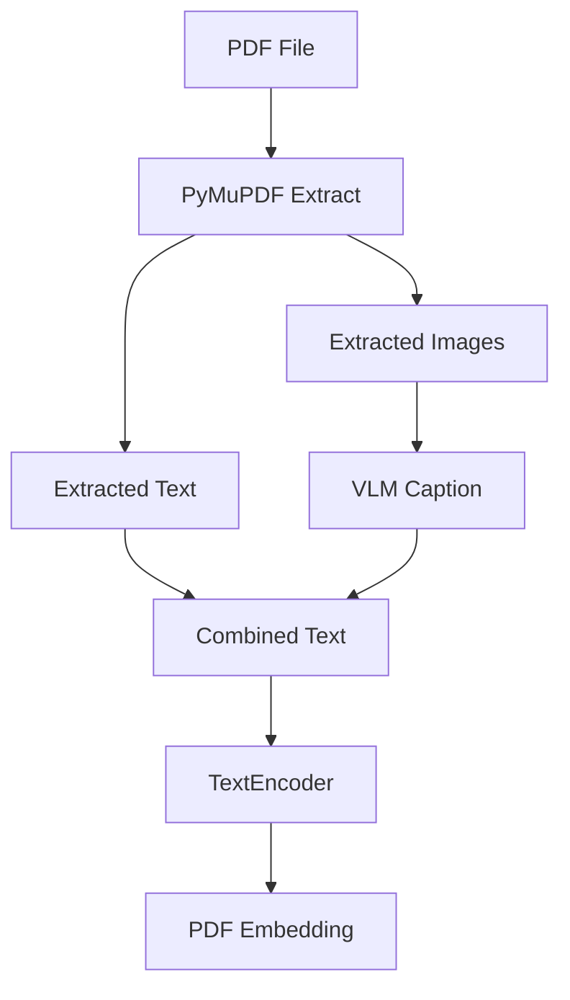

PDF 검색은 텍스트 파일 검색보다 까다롭다. PDF 안에는 본문 텍스트뿐 아니라 표, 그래프, 다이어그램, 이미지가 함께 들어갈 수 있다. 텍스트만 추출하면 검색해야 할 맥락 일부가 빠진다.

LocalLens는 PDF를 `텍스트 추출 + 이미지 설명 + 텍스트 임베딩` 흐름으로 처리했다.


## PDF 처리 흐름



PyMuPDF는 PDF에서 텍스트와 이미지를 추출한다. 텍스트는 그대로 검색 맥락이 된다. 이미지, 표, 그래프처럼 텍스트로 바로 검색하기 어려운 요소는 VLM caption으로 설명 문장을 만든다.

최종적으로는 다음 형태의 텍스트를 만든다.

```text
PDF에서 추출한 본문 텍스트

[이미지/표/그래프 설명]

VLM이 생성한 시각 요소 설명
```

이 combined text를 TextEncoder에 넣어 PDF embedding을 만든다.

## 왜 VLM caption을 붙였나

PDF 안의 그래프는 사람에게는 정보지만, 단순 텍스트 추출기에는 빈 영역에 가깝다. 표나 다이어그램도 마찬가지다. 검색어가 시각 요소와 관련되어 있다면 텍스트만 추출한 embedding은 충분하지 않을 수 있다.

VLM caption은 이 빈틈을 줄이기 위한 방법이다.

| 방식 | 장점 | 한계 |
| --- | --- | --- |
| Text only | 빠르고 단순함 | 이미지/표/그래프 정보가 빠질 수 있음 |
| Text + VLM caption | 시각 정보를 검색 맥락에 추가 | 외부 VLM 호출과 caption 품질 의존 |

발표 기준으로 PDF text-only 방식과 text+VLM caption 방식을 비교했고, text+VLM 방식이 평가 지표에서 소폭이지만 일관된 개선을 보였다고 정리되어 있다. 다만 구체 수치를 재현할 표나 재실행 결과가 충분히 남아 있지는 않아, 여기서는 개선 방향까지만 기록한다.

## 코드 구조상 처리 지점

PDF 처리의 책임은 크게 두 곳에 나뉜다.

| 컴포넌트 | 역할 |
| --- | --- |
| PdfProcessor | 텍스트와 이미지 추출, VLM caption 생성, combined text 구성 |
| PdfEncoder | combined text를 TextEncoder로 임베딩 |

PdfEncoder가 직접 VLM 호출 세부 사항을 모두 들고 있지 않고, PDF 처리 유틸리티가 combined text를 만든다. 이후 PdfEncoder는 TextEncoder를 재사용한다.

이 구조는 PDF를 “새로운 벡터 모델이 필요한 파일”이 아니라 “텍스트와 시각 설명을 결합해 텍스트 임베딩으로 보낼 파일”로 다룬다.

## Local-first 표현의 경계

PDF+VLM 구조 때문에 LocalLens를 순수 오프라인 검색기라고 표현하면 부정확하다. 텍스트와 이미지 파일 검색은 로컬 파일 시스템과 로컬 VectorStore 중심으로 돌아가지만, PDF 내부 이미지 captioning에는 외부 VLM 호출이 들어간다.

그래서 이 프로젝트의 정확한 표현은 다음에 가깝다.

| 표현 | 판단 |
| --- | --- |
| local-first를 지향한 로컬 파일 검색 구조 | 사용 가능 |
| PDF 이미지 captioning에는 외부 VLM 호출 사용 | 사용 가능 |
| 오프라인 전용 검색기 | 사용하지 않음 |
| 모든 PDF 시각 정보 처리 | 사용하지 않음 |

## 개선 방향

PDF+VLM 구조의 후속 개선은 세 가지다.

| 개선 | 이유 |
| --- | --- |
| caption caching | 같은 PDF를 반복 처리할 때 호출 비용과 시간을 줄임 |
| local VLM 검토 | 외부 호출 의존도를 낮춤 |
| 평가 데이터 보강 | text-only, OCR, text+VLM 방식을 더 명확히 비교 |

이 글의 핵심은 VLM을 붙였다는 사실이 아니다. PDF의 시각 요소를 검색 가능한 텍스트 맥락으로 바꾸고, 그 맥락을 기존 TextEncoder 흐름에 태웠다는 점이다.

## 다음 글

다음 글에서는 발표 기준 정량 평가, 현재 테스트 코드의 한계, 그리고 이 프로젝트를 공개 포트폴리오로 정리할 때의 claim boundary를 정리한다.

[07. 정량 평가, 테스트 한계, 그리고 LocalLens 회고]()
