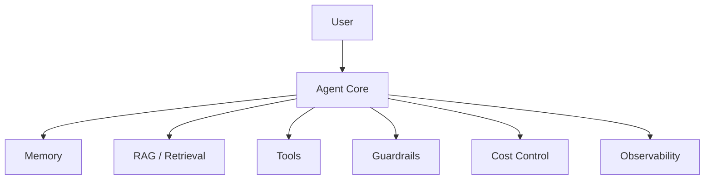
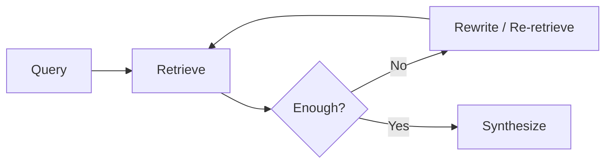
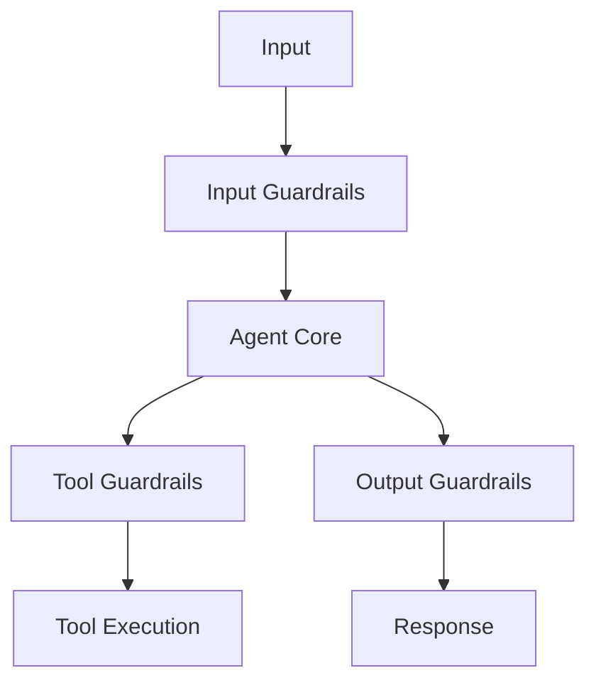

AI Agent를 실제 서비스로 만들 때는 모델 호출보다 운영 구조가 더 중요해진다. Memory, RAG, guardrails, protocol, cost control이 붙는 순간 Agent는 단순 챗봇이 아니라 상태를 가진 실행 시스템이 된다.

## 핵심 구성 요소

| 구성 요소 | 역할 |
| --- | --- |
| Memory | 현재 작업 맥락과 장기 지식을 유지 |
| RAG | 외부 문서와 지식을 검색해 grounding 제공 |
| Tools | API, DB, code execution 등 외부 행동 수행 |
| Guardrails | 입력, 출력, 도구 실행의 위험 제한 |
| Cost Control | 반복 실행과 tool call 비용 관리 |
| Observability | trace, latency, token, failure reason 기록 |

## Agent Memory

Agent memory는 단순히 대화 로그를 저장하는 것이 아니다. 현재 작업에 필요한 짧은 기억과, 세션을 넘어 유지해야 하는 장기 기억을 구분해야 한다.

| memory 유형 | 의미 | 구현 예 |
| --- | --- | --- |
| Short-term Memory | 현재 대화와 작업 맥락 | context window, working memory |
| Long-term Memory | 세션을 넘어 유지되는 사실과 규칙 | vector DB, knowledge graph |
| Episodic Memory | 과거 경험과 유사 상황 | semantic retrieval, event log |

좋은 memory 설계는 "무엇을 기억할 것인가"보다 "무엇을 잊을 것인가"를 함께 정의한다. 모든 기록을 넣으면 context noise가 커지고, 중요한 정보가 묻힌다.

## Agentic RAG vs Traditional RAG

Traditional RAG는 보통 한 번 검색하고 한 번 답한다. Agentic RAG는 검색 결과를 평가하고, 부족하면 query를 바꾸거나 다른 source를 찾아 다시 검색한다.

| 구분 | Traditional RAG | Agentic RAG |
| --- | --- | --- |
| 검색 횟수 | 주로 단일 검색 | 반복 검색 가능 |
| 판단 주체 | pipeline code | LLM + evaluator |
| 실패 대응 | fallback 또는 낮은 품질 답변 | 재검색, source 변경, tool 사용 |
| 적합한 상황 | 단순 문서 QA | 복합 질문, multi-source 조사 |

Agentic RAG는 더 강력하지만 비용과 latency가 증가한다. 단순 QA에는 Traditional RAG가 더 안정적일 수 있다.

## Guardrails

가드레일은 하나의 필터가 아니라 계층적 방어 구조로 보는 편이 맞다.

| 위치 | 예 |
| --- | --- |
| Input Guardrails | PII 감지, prompt injection 방어, 유해 요청 차단 |
| Tool Guardrails | 권한 확인, 실행 전 validation, Human-in-the-Loop |
| Output Guardrails | hallucination 점검, 민감정보 제거, 형식 검증 |

특히 tool guardrail이 중요하다. Agent가 외부 API, DB, 파일 시스템, 결제, 발송 기능을 호출할 수 있다면 답변 품질 문제가 아니라 실제 행동 위험이 생긴다.

## Cost Control

Agent loop는 단일 LLM 호출보다 token 사용량이 크게 늘 수 있다. tool schema, memory, retrieved context, intermediate reasoning, retry가 모두 비용으로 이어진다.

| 전략 | 기대 효과 | 설명 |
| --- | --- | --- |
| Prompt Caching | 반복 prompt 비용 절감 | system prompt와 tool schema 재사용 |
| Multi-Model Routing | 작업별 모델 비용 최적화 | 단순 분류는 작은 모델, 복잡한 추론은 큰 모델 |
| Batch Processing | 비동기 작업 비용 절감 | 대량 작업을 batch로 처리 |
| Prompt Compaction | token 사용량 감소 | 불필요한 설명, 사용하지 않는 tool 제거 |
| Max Steps | loop 비용 상한 설정 | 무한 반복 방지 |

비용 최적화는 품질을 낮추자는 뜻이 아니다. 비싼 모델을 써야 하는 구간과 그렇지 않은 구간을 분리하자는 뜻이다.

## MCP와 A2A

Agent ecosystem에서는 도구와 데이터 연결, agent 간 통신을 표준화하려는 흐름이 있다. 대표적으로 MCP와 A2A를 나눠 볼 수 있다.

| 프로토콜 | 방향 | 핵심 역할 |
| --- | --- | --- |
| MCP | Agent -> Tools / Data | LLM이 외부 도구와 data source에 접근하는 방식 표준화 |
| A2A | Agent -> Agent | agent 간 작업 위임, 상태 교환, 결과 전달 표준화 |

MCP는 tool integration 문제를 줄이는 데 초점이 있고, A2A는 여러 agent가 협업할 때의 통신 방식을 다룬다. 둘은 경쟁 관계라기보다 서로 다른 계층을 담당하는 보완 관계로 이해하는 편이 자연스럽다.

## 정리

운영 가능한 Agent는 `LLM + prompt`로 끝나지 않는다. memory는 상태를 유지하고, RAG는 외부 지식을 가져오며, guardrails는 행동 범위를 제한하고, cost control은 반복 실행이 비용 폭주로 이어지지 않게 막는다.

이 네 요소 중 하나라도 빠지면 데모는 가능해도 운영 안정성은 낮아진다.
