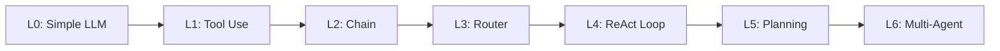
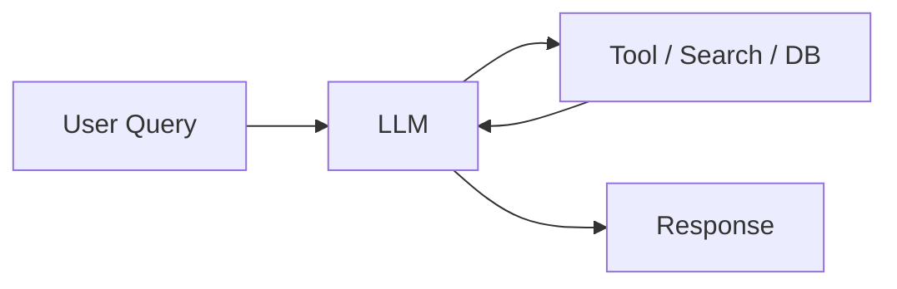
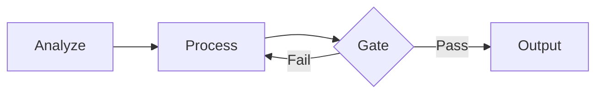
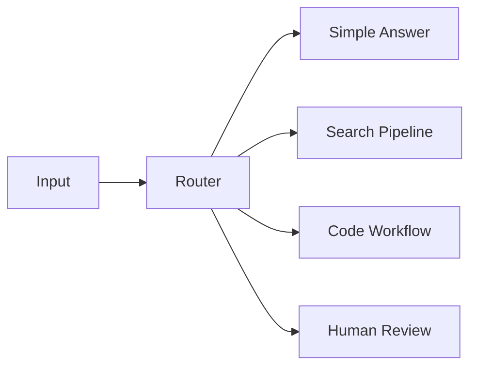
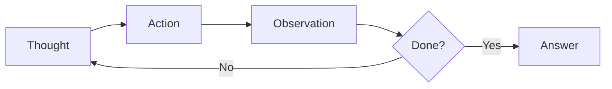
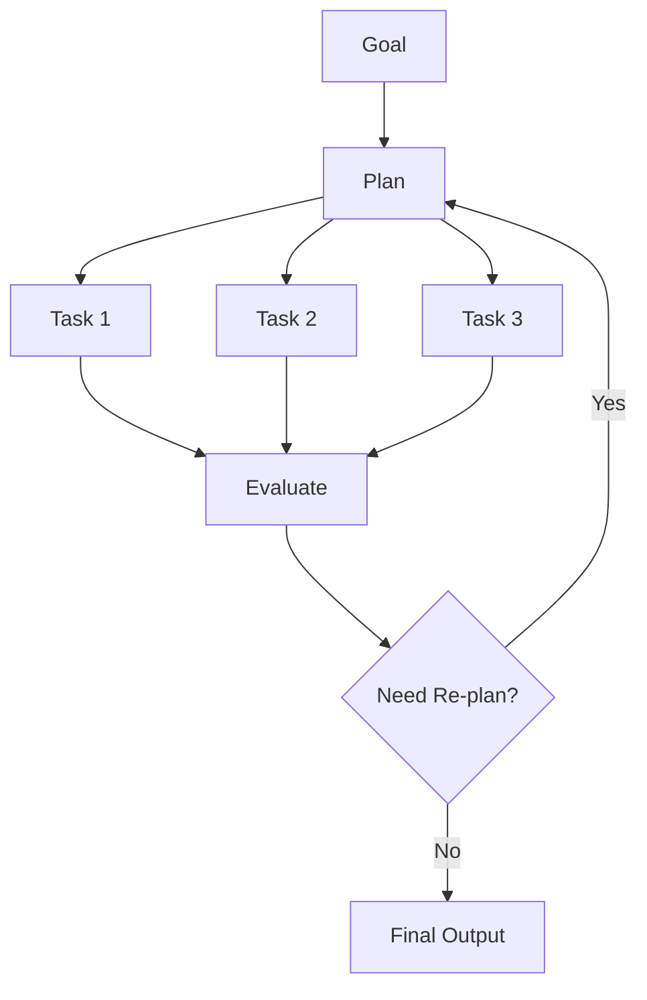

AI Agent는 한 번에 복잡해지는 것이 아니다. 단순 LLM 호출에서 시작해 도구 사용, 순차 실행, 분기, 반복, 계획, 멀티 에이전트 구조로 점점 자율성과 운영 난도가 올라간다.

중요한 것은 높은 단계가 항상 좋은 선택은 아니라는 점이다. 성숙도 단계는 "더 복잡하게 만들기 위한 순서"가 아니라, 문제에 필요한 최소 복잡도를 고르기 위한 기준이다.

| 레벨 | 이름 | 핵심 차이 | 적합한 상황 |
| --- | --- | --- | --- |
| L0 | Simple LLM Call | 도구와 기억 없이 한 번 응답 | 초안 작성, 설명, 단순 변환 |
| L1 | Augmented LLM | 검색/API/DB를 한 번 호출 | 최신 정보, 사내 문서, 계산 필요 |
| L2 | Chained Agent | 정해진 단계대로 여러 작업 실행 | 번역, 요약, 코드 생성 파이프라인 |
| L3 | Router Agent | 입력에 따라 실행 경로 선택 | 고객지원, 문서 분류, 작업 유형 분기 |
| L4 | ReAct / Loop Agent | 관찰 결과를 보고 반복 실행 | 리서치, 디버깅, 탐색형 작업 |
| L5 | Planning Agent | 장기 목표를 계획하고 재계획 | 보고서 작성, 경쟁사 분석, 장기 작업 |
| L6 | Multi-Agent System | 역할이 나뉜 여러 에이전트 협업 | 대규모 코드 작업, 복합 분석, 조직형 workflow |

## L0. Simple LLM Call

가장 기본적인 형태다. 사용자가 prompt를 넣으면 LLM이 한 번 응답한다. 외부 도구, memory, 검색이 없기 때문에 구현은 쉽지만 최신 정보나 사내 데이터에는 접근할 수 없다.

| 관점 | 내용 |
| --- | --- |
| 흐름 | User prompt -> LLM -> Response |
| 장점 | 빠르고 단순하며 비용 예측이 쉬움 |
| 한계 | 최신 정보 접근 불가, hallucination 위험 |
| 예시 | 이메일 초안, 코드 리뷰 초안, 마케팅 카피 |

## L1. Augmented LLM

LLM이 필요할 때 외부 도구를 한 번 호출한다. 검색, API, DB query, 계산기, code interpreter가 여기에 들어간다. Naive RAG도 이 단계로 볼 수 있다.

| 도구 유형 | 예 |
| --- | --- |
| 검색 | RAG, web search |
| API | 날씨, 주가, 업무 시스템 |
| 실행 | 계산기, code interpreter |

한 번의 cycle로 끝나기 때문에 결과가 부족해도 스스로 재검색하거나 계획을 바꾸지는 않는다.

## L2. Chained / Sequential Agent

여러 단계를 미리 정의된 순서대로 실행한다. 앞 단계의 출력이 다음 단계의 입력이 되고, 중간에 gate를 넣어 품질을 확인할 수 있다.

예를 들어 문서 번역 파이프라인은 `문맥 분석 -> 초벌 번역 -> 용어 검증 -> 최종 다듬기`로 나눌 수 있다. 코드 생성 파이프라인은 `요구사항 분석 -> 코드 생성 -> lint/test -> 리뷰/수정`으로 구성할 수 있다.

이 단계는 agent처럼 보일 수 있지만, 전체 실행 흐름은 코드가 정한다. LLM은 각 단계의 작업자에 가깝다.

## L3. Router / Branching Agent

입력을 분석해서 적절한 경로로 분기한다. LLM이 classifier 역할을 수행하거나, 규칙 기반 router와 함께 쓰인다.

고객지원 시스템에서는 환불 요청, 기술 문의, 일반 문의를 서로 다른 workflow로 보낼 수 있다. 이 구조는 모든 요청에 무거운 agent loop를 돌리지 않아도 되기 때문에 비용과 latency를 줄이는 데 유리하다.

## L4. ReAct / Loop Agent

여기서부터 agent다운 구조가 시작된다. LLM이 상황을 판단하고, 도구를 선택하고, 결과를 관찰한 뒤 다음 행동을 다시 정한다.

리서치 agent가 좋은 예다. 처음 검색 결과가 부족하면 query를 바꾸고, 다른 source를 확인하고, 필요한 경우 다시 검색한다. 이 구조에는 반드시 `max_iterations`, 비용 한도, tool permission, 실패 시 fallback이 필요하다.

## L5. Planning Agent

실행 전에 전체 계획을 세우고, 하위 task로 나눈 뒤, 실행 결과를 보고 계획을 수정한다. long-horizon task에 적합하다.

예를 들어 "경쟁사 분석 보고서 작성"은 경쟁사 리스트 확정, 재무 데이터 수집, 제품 비교, SWOT 분석, 보고서 작성으로 나눌 수 있다. 중간에 데이터가 부족하면 계획을 바꿔 다른 source를 찾는다.

## L6. Multi-Agent System

여러 agent가 각자의 역할, 도구, prompt, context를 가지고 협업한다. orchestrator가 작업을 분배하고 결과를 통합하거나, agent 간 handoff로 진행할 수 있다.

| 패턴 | 설명 | 예 |
| --- | --- | --- |
| Orchestrator-Worker | 중앙 agent가 작업을 나누고 결과를 통합 | Claude Code sub-agent 구조 |
| Evaluator-Optimizer | generator가 만들고 evaluator가 평가 | 코드 리뷰, 번역 개선 |
| Debate / Adversarial | 서로 다른 관점의 agent가 주장과 반론 수행 | 의사결정 지원 |

Multi-Agent는 context window 한계를 줄이고 역할 전문화를 만들 수 있지만, 디버깅과 관측 난도가 높다. 단일 agent로 충분한 문제에 먼저 multi-agent를 붙이면 비용과 실패 지점만 늘어난다.

## 단계별 비교

| 레벨 | 자율성 | 도구 사용 | 흐름 결정 | 대표 기술 |
| --- | --- | --- | --- | --- |
| L0 | 없음 | 없음 | 코드 | 기본 LLM 호출 |
| L1 | 낮음 | 단일 턴 | 코드 + LLM | RAG, Function Calling |
| L2 | 낮음 | 순차 | 코드 | Chains, Workflow |
| L3 | 중간 | 분기 | 코드 + LLM | Router, Classifier |
| L4 | 높음 | 반복 | LLM | ReAct, Tool Use Loop |
| L5 | 높음 | 계획 + 반복 | LLM | Plan-and-Execute |
| L6 | 매우 높음 | 분산 | 다수 LLM | CrewAI, AutoGen, Sub-agents |

## 선택 기준

Agent 성숙도는 목표가 아니라 선택 기준이다. 복잡도를 올리기 전에는 세 가지를 먼저 확인한다.

1. 이 문제는 단일 LLM 호출로 해결되지 않는가?
2. 도구 호출이나 검색이 실제로 필요한가?
3. 실행 중 재계획이나 반복이 품질을 유의미하게 높이는가?

이 질문에 답하지 못하면 높은 단계의 agent를 쓰는 것이 아니라, 디버깅하기 어려운 workflow를 만드는 것에 가깝다.
