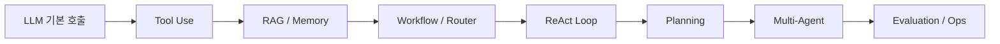

AI Agent를 학습할 때는 프레임워크 이름보다 실행 구조를 먼저 이해해야 한다. LangGraph, CrewAI, AutoGen, ADK, Agents SDK는 모두 유용하지만, 어떤 문제에 어떤 실행 구조가 필요한지 모르면 도구만 바꿔가며 같은 실수를 반복하게 된다.

이 글은 Agent 학습 순서를 `개념 -> 도구 사용 -> memory/RAG -> 평가 -> 운영 -> framework` 흐름으로 정리한다.

## 학습 순서

| 단계 | 학습 목표 | 실습 예 |
| --- | --- | --- |
| 1 | LLM 입출력과 prompt 구조 이해 | 단일 질의응답, structured output |
| 2 | tool calling 이해 | search, calculator, DB query |
| 3 | RAG와 memory 연결 | 문서 기반 QA, 사용자 preference 저장 |
| 4 | workflow와 router 설계 | 문의 유형 분류, 작업별 handler |
| 5 | ReAct loop 구현 | 검색-관찰-재검색 loop |
| 6 | planning과 replanning | 보고서 작성 agent |
| 7 | multi-agent orchestration | researcher, coder, reviewer 분리 |
| 8 | evaluation과 observability | trace, cost, latency, regression test |

## 주요 프레임워크 비교

프레임워크는 문제 유형에 맞춰 선택한다. 처음부터 multi-agent framework를 고르는 것보다, 필요한 state 관리와 관측 수준을 먼저 정하는 것이 좋다.

| 프레임워크 | 중심 구조 | 강점 | 적합한 상황 |
| --- | --- | --- | --- |
| LangGraph | graph-based workflow | 상태 관리, 조건부 분기, durable execution | 복잡한 workflow와 production agent |
| CrewAI | role-based multi-agent | 역할 전문화, 작업 위임 | 팀 시뮬레이션, 관점 분리 작업 |
| AutoGen | event-driven multi-agent | 메시지 교환, 분산 구조 | 엔터프라이즈급 multi-agent 실험 |
| Google ADK | code-first agent runtime | streaming, eval, cloud 연계 | Google Cloud 기반 agent |
| OpenAI Agents SDK | minimal Python primitives | handoff, guardrail, tracing | 빠른 prototype, 단순 agent |
| Claude Code | terminal coding agent | codebase 작업, permission gate, sub-agent | 멀티파일 코드 변경과 개발 자동화 |

## 에이전트 구축 시 흔한 실수

Agent 프로젝트의 실패는 모델 성능보다 설계 방식에서 자주 나온다.

| 실수 | 왜 문제인가 |
| --- | --- |
| 과도한 엔지니어링 | 단순 workflow로 충분한 문제에 multi-agent를 붙이면 디버깅만 어려워짐 |
| 데이터 품질 무시 | 불완전한 데이터 위에서는 agent가 더 그럴듯하게 틀림 |
| 평가 프레임워크 부재 | 개선과 회귀를 구분할 수 없음 |
| 관찰 도구 누락 | tool call, 비용, 실패 지점을 추적할 수 없음 |
| RPA처럼 취급 | agent는 배포 후에도 prompt, tool, memory를 계속 조정해야 함 |
| 도구 과다 등록 | 불필요한 tool schema가 token과 판단 비용을 늘림 |
| Human-in-the-Loop 부재 | 위험한 결정을 자동화하면 사고 비용이 커짐 |
| 비용 관리 실패 | loop agent는 단일 호출보다 token 사용량이 크게 늘 수 있음 |
| 도구 설명 부실 | tool description이 모호하면 잘못된 tool을 호출함 |
| 종료 조건 미설정 | max step과 exit criteria가 없으면 무한 loop 위험이 있음 |

## 실무 권장 사항

1. Simple first: 단일 LLM, RAG, 정해진 workflow로 해결되는지 먼저 확인한다.
2. Evaluate early: golden set, LLM-as-judge, regression test를 먼저 만든다.
3. Human-in-the-Loop: 결제, 삭제, 권한 변경, 대량 발송에는 사람 승인을 둔다.
4. Observe everything: trace, tool call, token cost, latency, failure reason을 남긴다.
5. Limit tools: agent가 실제로 써야 하는 tool만 노출한다.

## 핵심 논문과 자료

| 자료 | 연결되는 주제 | 핵심 의미 |
| --- | --- | --- |
| Chain-of-Thought Prompting | reasoning | 단계별 추론의 출발점 |
| MRKL Systems | routing, tool use | LLM과 외부 모듈을 결합하는 구조 |
| ReAct | agent loop | reasoning과 acting을 반복 |
| Toolformer | tool use | 모델이 도구 사용을 학습하는 접근 |
| Generative Agents | memory | observation, reflection, retrieval 기반 memory 구조 |
| Reflexion | self-improvement | 언어적 자기 반성으로 시행착오를 축적 |
| Tree of Thoughts | planning | 사고 경로를 탐색하는 추론 구조 |
| HuggingGPT | orchestration | LLM을 controller로 두고 전문 모델을 조합 |
| Building Effective Agents | practical patterns | 단순하게 시작하고 필요한 패턴만 추가 |
| LLM Powered Autonomous Agents | architecture | Agent = LLM + Memory + Planning + Tools |

## 주요 벤치마크

| 벤치마크 | 보는 능력 |
| --- | --- |
| SWE-bench Verified | 실제 GitHub issue 해결 능력 |
| GAIA | tool use와 multi-modal reasoning |
| AgentBench | 다양한 환경에서의 agent 작업 수행 |

벤치마크 수치는 모델과 시점에 따라 바뀐다. 중요한 것은 특정 점수보다 어떤 능력을 측정하는 benchmark인지 이해하는 것이다.

## 정리

AI Agent 학습은 프레임워크 사용법이 아니라 실행 구조를 이해하는 순서로 진행해야 한다. 먼저 단일 agent의 입출력, tool call, 실패 로그, 평가 기준을 잡고, 그다음 orchestration과 multi-agent로 확장하는 흐름이 안정적이다.
