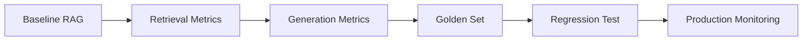

RAG 평가는 검색과 생성을 분리해서 봐야 한다. 좋은 답변이 나오지 않았을 때 검색 실패인지, context 구성 실패인지, 생성 실패인지 구분할 수 있어야 개선이 가능하다.

## RAG 평가하기

RAG 시스템의 품질은 answer quality 하나로 평가하기 어렵다. retrieval quality, context quality, faithfulness, citation accuracy를 나눠 봐야 한다.

| 영역 | 메트릭 | 질문 |
| --- | --- | --- |
| Generation | Faithfulness | 응답이 검색된 문서에 충실한가 |
| Generation | Answer Relevancy | 응답이 질문에 적절한가 |
| Retrieval | Context Precision | 검색된 문서 중 관련 문서 비율은 높은가 |
| Retrieval | Context Recall | 필요한 문서를 빠짐없이 찾았는가 |
| Citation | Citation Accuracy | 출처가 실제 근거 문장을 가리키는가 |

| 메트릭 | 계산 관점 |
| --- | --- |
| Faithfulness | 문서로 뒷받침되는 주장 수 / 전체 주장 수 |
| Answer Relevancy | 생성 답변과 원 질문의 관련성 |
| Context Precision | 관련 문서 수 / 검색된 전체 문서 수 |
| Context Recall | 검색된 관련 문서 수 / 전체 관련 문서 수 |

## 평가 도구

| 도구 | 용도 |
| --- | --- |
| RAGAS | faithfulness, relevancy, context precision/recall 자동 계산 |
| DeepEval | CI/CD에 통합 가능한 unit test 스타일 평가 |
| TruLens | production 환경의 tracing과 feedback 기반 품질 추적 |
| RAGBench | 여러 도메인의 RAG benchmark 비교 |

## 도입 로드맵

처음부터 모든 평가를 자동화하려고 하면 오래 걸린다. 먼저 작은 golden set을 만들고, 검색 결과와 생성 답변을 분리해 기록하는 것부터 시작하는 편이 현실적이다.

## 주요 논문 타임라인

| 연도 | 논문 / 흐름 | 핵심 의미 |
| --- | --- | --- |
| 2020 | RAG: Retrieval-Augmented Generation | DPR + BART 결합, RAG-Sequence와 RAG-Token 제안 |
| 2020 | Dense Passage Retrieval | dense vector 기반 문서 검색의 표준화 |
| 2022 | HyDE | 질문 대신 가상 답변을 만들어 검색 |
| 2023 | Self-RAG | reflection token으로 검색 필요성과 응답 품질 판단 |
| 2024 | CRAG | 검색 결과를 correct / incorrect / ambiguous로 분류 후 보정 |
| 2024 | RAPTOR | recursive clustering과 요약으로 다단계 tree 구성 |
| 2024 | GraphRAG | 지식 그래프와 community summary로 global question 대응 |
| 2024 | Contextual Retrieval | chunk에 문서 수준 context를 추가, BM25 결합 시 검색 실패율 67% 감소 |
| 2024 | Adaptive RAG | 질문 복잡도에 따라 no retrieval, single-step, multi-step 선택 |
| 2024 | Late Chunking | 전체 문서를 먼저 embedding한 뒤 token vector에서 chunk 추출 |
| 2024 | RAFT | RAG와 fine-tuning 결합, distractor를 무시하도록 학습 |
| 2025 | SimRAG | 비라벨 corpus에서 QA 쌍 생성과 self-training |
| 2025 | MCP | 모델과 외부 도구/데이터 연결 표준화 |
| 2026 | Context Engineering | RAG, memory, tool 연결을 더 넓은 context 설계로 통합 |

## 정리

답변이 틀렸을 때 원인은 여러 가지일 수 있다. 검색이 틀렸는지, 맞는 문서를 찾았지만 context에 못 넣었는지, context는 맞지만 모델이 무시했는지, citation이 잘못 붙었는지 분리해야 한다.

논문 타임라인은 이 문제들이 어떤 순서로 발견되고 보완되어 왔는지 보는 기준으로 활용하면 된다.
