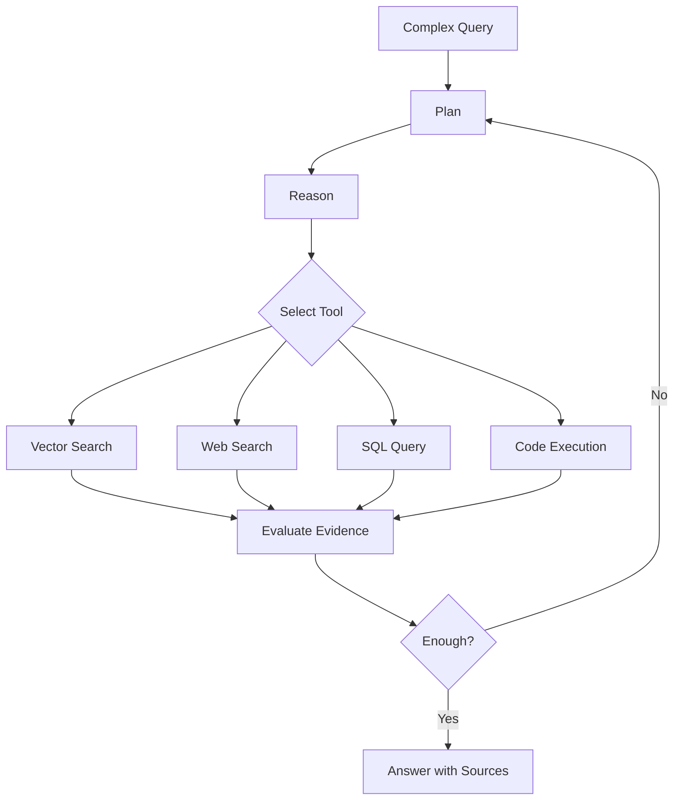

RAG는 단순한 `Query -> Retrieve -> Generate` 구조에서 시작해, 검색 전후 최적화와 동적 모듈 조합으로 확장되어 왔다. 이 글은 Naive, Advanced, Modular, Agentic RAG가 어떤 문제를 해결하려고 등장했는지 정리한다.

## RAG의 진화

RAG는 3세대에 걸쳐 발전해 왔다. 각 세대는 이전 구조의 한계를 보완하는 방식으로 확장됐다.

### Naive RAG (2020~2022)

고정된 파이프라인. Query → Retrieve → Generate. 단순하지만 한계가 명확합니다.

Query → Retrieve → Generate

### Advanced RAG (2023~2024)

검색 전/중/후를 최적화. 쿼리 리라이팅, 하이브리드 검색, 리랭킹 등을 추가합니다.

Query 최적화 → Hybrid Retrieve → Rerank → Generate

### Modular RAG (2024~)

모듈 단위 조합. 라우터, 평가기, 반복 검색 등을 태스크에 맞게 동적으로 구성합니다.

Router → [동적 모듈 조합] → 자체 평가 → 반복/완료

## Naive RAG

가장 기본적인 "Retrieve → Read" 파이프라인. RAG의 출발점이지만, 한계가 분명합니다.

```text
INDEXING PHASE (오프라인)
QUERY PHASE (온라인)
Documents
PDF, DB, Web, API
Chunking
고정 크기 분할
Chunk 1
Chunk 2
Chunk N
Embedding Model
텍스트 → 벡터 변환
[0.12, -0.45, 0.78,
0.33, -0.91, ...]
Vector DB
?
User Query
사용자 질문 입력
Query Embedding
질문도 벡터로 변환
Similarity Search
코사인 유사도 Top-K
벡터 검색
Prompt + Context
질문 + 검색 문서 결합
LLM
응답 생성
Response (답변)
```

### Naive RAG의 한계

#### Garbage In, Garbage Out

검색 품질이 낮으면 응답도 함께 망가집니다. 관련 없는 문서가 검색되면 LLM은 그걸 기반으로 엉뚱한 답을 만듭니다.

#### 단순한 청킹

고정 크기로 문서를 자르면 문맥이 잘리거나, 하나의 청크에 여러 주제가 섞여 노이즈가 됩니다.

#### 무분별한 전달

검색된 문서가 질문과 관련 없어도 그대로 LLM에 전달합니다. 필터링이나 품질 평가가 없습니다.

#### 중복/상충 미처리

중복 문서, 서로 모순되는 정보에 대한 처리 로직이 없어서 LLM이 혼란에 빠질 수 있습니다.

## Advanced RAG

Naive RAG의 한계를 검색 전/중/후 각 단계에서 체계적으로 보완합니다.

```text
PRE-RETRIEVAL
RETRIEVAL
POST-RETRIEVAL
GENERATE
User Query
원본 질문
Query Rewriting
질문 최적화 / 분해
HyDE
Multi-Query
Optimized Query
Hybrid Search
Dense (Vector)
시맨틱 유사도
Sparse (BM25)
키워드 매칭
RRF 결합
Top-K 문서
Vector DB + BM25 Index
멀티 인덱스 전략
Post-Processing
Reranker
Cross-Encoder 재순위화
Compression
관련 부분만 추출
Dedup & Filter
중복 제거, MMR
Refined Context
Prompt
Q + Context
LLM
생성
Response
쿼리 최적화
하이브리드 검색
후처리 (Rerank + 압축)
```

#### Query Rewriting

사용자 질문을 검색에 유리한 형태로 변환합니다. 구어체 → 검색 쿼리, 복합 질문 → 단일 질문 분리 등.

"우리 회사 휴가 어떻게 쓰는 거야?"

→

"연차 휴가 사용 절차 및 규정"

#### HyDE Gao et al., 2022

Hypothetical Document Embeddings — LLM이 먼저 가상의 답변을 생성하고, 그 답변의 임베딩으로 검색합니다. 질문보다 답변이 문서와 더 유사하다는 통찰.

질문

→

가상 답변 생성

→

답변 임베딩으로 검색

#### Query Expansion

하나의 질문을 여러 관점에서 확장해서 검색 범위를 넓힙니다. Multi-Query, Sub-Question Decomposition 등의 기법이 있습니다.

#### 청킹 전략 고도화

고정 크기가 아닌 의미 단위로 문서를 분할합니다.

Recursive

구분자 계층으로 재귀 분할. 가장 안정적 (69% 승률)

Semantic

의미 변화 지점에서 분할. 높은 재현율

Parent-Child

작은 청크로 검색, 큰 청크로 컨텍스트 제공

Sentence Window

문장 단위 검색 + 주변 문장 포함

#### Contextual Retrieval Anthropic, 2024

각 청크에 문서 수준의 맥락을 접두사로 추가한 뒤 임베딩합니다. "이 청크는 2024년 매출 보고서의 3분기 실적 섹션에서 발췌한 내용입니다" 같은 맥락 정보를 붙여서 검색 정확도를 크게 향상시킵니다.

#### 메타데이터 태깅

문서에 날짜, 출처, 카테고리, 작성자 등 부가 정보를 부착합니다. 필터링과 결합하면 검색 정밀도가 크게 올라갑니다.

#### 하이브리드 검색

Dense(벡터) 검색과 Sparse(BM25 키워드) 검색을 결합합니다. 의미 유사성 + 키워드 정확성을 동시에 잡아 가장 안정적인 성능을 제공합니다.

Dense (벡터)

의미 유사성 기반

+

Sparse (BM25)

키워드 매칭 기반

=

Hybrid

최적의 검색 결과

#### Fine-tuned Embedding

도메인 특화 데이터로 임베딩 모델을 추가 학습합니다. 일반 모델 대비 12~30% 성능 향상이 보고됩니다. 의료, 법률, 금융 등 전문 도메인에서 효과가 큽니다.

#### Multi-Index 전략

요약 인덱스, 원문 인덱스, 메타데이터 인덱스 등을 계층화합니다. 요약으로 먼저 관련 문서를 좁히고, 원문에서 세부 정보를 가져오는 방식.

#### Late Interaction (ColBERT)

토큰별 임베딩을 저장하고 MaxSim 연산으로 유사도를 계산합니다. Bi-Encoder의 속도와 Cross-Encoder의 정확도 사이에서 좋은 균형을 잡습니다. ColPali/ColQwen은 이를 멀티모달로 확장.

#### Reranker (재순위화)

검색 결과를 Cross-Encoder로 다시 평가해서 순위를 재조정합니다. 질문-문서 쌍을 함께 보기 때문에 더 정밀한 관련성 판단이 가능합니다.

검색 결과 (Before)

문서 A

0.82

문서 B

0.79

문서 C

0.77

문서 D

0.75

Rerank

재순위 (After)

문서 C

0.95

문서 A

0.88

문서 D

0.72

문서 B

0.45

MAP(Mean Average Precision) 52% 향상 보고 — Cohere Rerank, bge-reranker, FlashRank 등

#### 문서 압축 (Compression)

검색된 문서에서 관련 있는 부분만 추출해서 컨텍스트 윈도우를 절약합니다. LongLLMLingua 등의 방식으로 핵심 문장만 남깁니다.

#### 중복 제거 및 필터링

유사도 임계값, MMR(Maximal Marginal Relevance) 등으로 중복 문서를 제거하고 다양성을 확보합니다.

## Modular RAG

파이프라인을 고정된 순서가 아닌 모듈 단위로 분리해서 태스크에 맞게 조합하는 패러다임입니다.

```text
Query
사용자 질문
Router
질문 유형 판단
경로 결정
Direct LLM
검색 불필요 → 바로 생성
단순 질문
Retrieval
Multi-Source 검색
Vector / Web / SQL
Judge
충분한가?
품질 평가
충분
부족 → 재검색
Web Search
보조 소스
모호
Generate
LLM 응답 생성
+ 출처 첨부
Self
Eval
품질 OK?
Response
재생성
복잡 질문
Iterative Retrieval + Memory
멀티스텝 검색-생성 반복
통과 경로
재시도 루프
보정 경로
```

#### Router

질문 유형을 판단해서 검색이 필요한지, 어떤 소스를 쓸지 결정합니다. 단순 질문은 바로 LLM 생성으로.

#### Judge / Critic

검색 결과가 충분한지 평가합니다. 부족하면 재검색을 트리거하거나 다른 소스로 전환합니다.

#### Adaptive Retrieval

LLM이 스스로 "지금 검색이 필요한 시점인가?"를 판단합니다. 불필요한 검색을 줄여 효율성을 높입니다.

#### Multi-Source

벡터 DB, 웹 검색, SQL DB, API 등 여러 소스를 동적으로 선택합니다.

#### Iterative Retrieval

한 번이 아니라 여러 차례 검색-생성을 반복하며 답변을 정제합니다.

#### Memory

이전 대화나 검색 이력을 활용해서 맥락을 유지합니다.

### 대표 구현 패턴

| 패턴 | 핵심 아이디어 | 의미 |
| --- | --- | --- |
| Self-RAG | LLM이 검색 필요 여부, 문서 관련성, 응답 근거성을 reflection token으로 판단 | 모든 질문에 검색하지 않고 필요한 경우에만 검색 |
| CRAG | 검색 결과를 correct / incorrect / ambiguous로 분류한 뒤 보정 경로 선택 | 검색 실패를 감지하고 web search나 문서 정제로 보완 |
| Graph RAG | 지식 그래프를 구축해 entity 관계 기반 검색 수행 | 여러 문서에 흩어진 관계형 질문에 강함 |
| RAPTOR | chunk를 clustering하고 재귀적으로 요약해 tree 구조 생성 | 세부 질문은 leaf, 요약 질문은 상위 node에서 검색 |

Self-RAG는 불필요한 검색을 줄이는 방향이고, CRAG는 검색 실패를 감지해 보정하는 방향이다. Graph RAG와 RAPTOR는 검색 단위를 단순 chunk에서 graph나 tree 구조로 확장한다.

## Agentic RAG

AI Agent가 검색을 도구로 사용하면서 계획-실행-반성 루프를 돌리는 방식입니다. 복잡한 멀티스텝 질문에 효과적입니다.



#### Multi-Agent 아키텍처

검색 전문 에이전트, 요약 에이전트, 평가 에이전트 등 역할별로 분리된 에이전트들이 협력합니다. 모달리티별 전문가 에이전트(텍스트, 이미지, 테이블 등)를 둘 수도 있습니다.

#### Tool Use

벡터 검색 외에도 웹 검색, SQL 쿼리, 계산기, 코드 실행 등 다양한 도구를 상황에 맞게 선택해서 사용합니다.

#### Adaptive Retrieval

모든 질문에 검색하지 않습니다. 질문 복잡도를 판단해서 단순 질문은 즉시 답변, 복잡한 질문만 멀티스텝 검색을 수행합니다.

"파이썬이 뭐야?" → 바로 답변

"우리 회사의 3Q 매출을 작년 동기 대비 분석해줘" → 멀티스텝 검색

#### Speculative RAG

작은 전문가 모델이 여러 개의 초안(draft)을 병렬로 생성하고, 큰 범용 모델이 이를 검증하는 방식. Draft-then-Verify 패턴으로 정확도와 지연시간 모두 개선합니다.

## 정리

Naive RAG는 빠르게 만들 수 있지만 실패 원인 분리가 어렵다. Advanced RAG는 query rewriting, reranking, metadata filtering으로 품질을 올린다. Modular RAG는 각 단계를 교체 가능한 모듈로 만들고, Agentic RAG는 검색 전략 자체를 실행 중에 선택한다.

RAG의 발전 방향은 단순히 검색을 붙이는 것에서, context를 설계하고 검증하는 쪽으로 이동한다.
