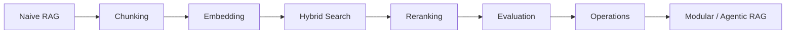

RAG를 실무에 적용할 때는 최신 기법을 한 번에 넣는 것보다 작은 baseline을 만들고, 검색 품질과 평가 체계를 순서대로 붙이는 편이 안전하다.

RAG 학습은 개념보다 실패 유형을 기준으로 잡는 편이 좋다. 검색 실패, chunk 실패, context noise, hallucination, citation 오류를 하나씩 줄이는 방식으로 접근하면 실무 감각이 생긴다.

## 추천 학습 순서

## 추천 프로덕션 스택

| 계층 | 선택지 | 판단 기준 |
| --- | --- | --- |
| Application | LangChain, LlamaIndex, Custom | 빠른 실험은 framework, 장기 운영은 custom boundary 필요 |
| LLM | Claude, GPT, Gemini, open-source | 품질, 비용, latency, 배포 조건 |
| Embedding | Cohere, OpenAI, BGE, E5 | 언어, 도메인, self-host 필요 여부 |
| Search | Hybrid search | dense semantic search와 BM25를 함께 사용 |
| Reranker | Cohere Rerank, bge-reranker, FlashRank | 정확도와 latency trade-off |
| Vector DB | Pinecone, Weaviate, Qdrant, pgvector, Chroma | 운영 규모, filter, 비용, infra 선호 |

## 단계별 도입 로드맵

| 단계 | 목표 | 설명 |
| --- | --- | --- |
| 1. MVP | Naive RAG | 고정 크기 chunking, 단순 vector search, LLM generation으로 baseline 구축 |
| 2. 검색 품질 향상 | Hybrid + Reranker | BM25와 dense search를 결합하고 reranker로 Top-K를 재정렬 |
| 3. 청킹 최적화 | Recursive / Semantic / Contextual | 문서 유형에 맞는 chunk 단위를 찾고 metadata를 붙임 |
| 4. 평가 체계 구축 | RAGAS, golden set, regression | 변경 전후 품질을 정량적으로 비교 |
| 5. 운영화 | cache, monitoring, fallback | latency, token cost, 실패율, citation 품질을 관측 |
| 6. 고도화 | Modular / Agentic RAG | multi-step question, multi-source retrieval, router, loop 도입 |

## 청킹 전략 비교

| 전략 | 방식 | 장점 | 단점 | 추천 상황 |
| --- | --- | --- | --- | --- |
| Fixed-size | 고정 토큰 수로 분할 | 구현 간단, 예측 가능 | 문맥 단절 | 빠른 prototype |
| Recursive | 구분자 계층으로 재귀 분할 | 안정적 | 구분자 설정 필요 | 범용 기본값 |
| Semantic | 의미 변화 지점에서 분할 | 높은 recall | 조각이 너무 작아질 수 있음 | 다주제 문서 |
| Parent-Child | 작은 chunk로 검색, 큰 chunk 반환 | 정밀 검색과 풍부한 context | index 구조 복잡 | 긴 문서, 보고서 |
| Sentence Window | 문장 단위 + 주변 문장 | 문장 수준 정밀도 | 짧은 문서엔 비효율 | FAQ, 매뉴얼 |

## 실무 기준

### 256~512 토큰부터 시작

chunk 크기는 256~512 토큰 구간에서 먼저 실험하는 것이 안정적이다. 너무 작으면 맥락이 부족하고, 너무 크면 노이즈가 늘어난다.

### 검색 최적화가 먼저

LLM을 바꾸기 전에 검색 품질을 먼저 본다. 같은 모델에서도 chunking, embedding, hybrid search, reranking만 바꿔도 결과가 크게 달라질 수 있다.

### 측정 없이 개선 없음

평가 파이프라인을 먼저 만들고, 변경할 때마다 metric을 비교한다. 감으로 좋아졌다고 판단하면 다음 변경에서 회귀를 놓치기 쉽다.

### RAG는 제품이다

RAG는 한 번 만들고 끝나는 기능이 아니다. 문서 업데이트, 모델 교체, embedding migration, index rebuild, cache invalidation, fallback 응답까지 운영 대상이다.

## 정리

RAG 로드맵은 기법 나열이 아니라 실패를 줄이는 순서다. 먼저 작은 문서셋으로 baseline을 만들고, 그다음 chunking, embedding, hybrid search, reranking, evaluation을 하나씩 붙이는 방식이 가장 안전하다.
