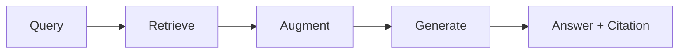

RAG는 LLM이 답변을 만들기 전에 외부 지식을 검색해 참고하도록 만드는 구조다. 모델의 기억만 믿는 방식보다 최신성, 근거성, 도메인 지식 보강에 유리하다.

이 글은 RAG가 필요한 이유와 기본 파이프라인을 먼저 정리한다. 이후 글에서 Naive RAG, Advanced RAG, Modular RAG, Production RAG로 확장한다.

## 왜 RAG가 필요한가?

LLM은 강력하지만 혼자서는 해결하기 어려운 한계가 있다.

| 한계 | 설명 |
| --- | --- |
| 할루시네이션 | 학습 데이터에 없는 내용도 그럴듯하게 생성할 수 있음 |
| 지식 단절 | 학습 시점 이후의 최신 정보에 접근하지 못함 |
| 도메인 지식 부족 | 회사 내부 문서나 특정 업무 지식을 모름 |
| 출처 불투명 | 답변 근거를 사용자가 확인하기 어려움 |

RAG는 이 문제를 "모델이 모든 것을 기억하게 만들자"가 아니라 "답변 시점에 필요한 지식을 찾아 context로 넣자"는 방식으로 푼다.

## RAG란 무엇인가?

Retrieval-Augmented Generation은 검색으로 보강된 생성이다. LLM이 답변을 만들기 전에 관련 문서를 검색하고, 검색 결과를 prompt context로 함께 전달한다.

| 방식 | 비유 | 특징 |
| --- | --- | --- |
| 일반 LLM | 클로즈드북 시험 | 모델 내부 지식에 의존 |
| RAG | 오픈북 시험 | 참고 자료를 검색한 뒤 답변 |

## 핵심 파이프라인

| 단계 | 역할 | 실패하면 생기는 문제 |
| --- | --- | --- |
| Query | 사용자 질문을 입력으로 받음 | 질문이 모호하면 검색 방향이 흔들림 |
| Retrieve | 관련 문서를 검색 | 관련 없는 context가 올라감 |
| Augment | 검색 결과를 prompt에 삽입 | context가 너무 길거나 노이즈가 많아짐 |
| Generate | LLM이 답변 생성 | 근거와 다른 답변이나 citation 오류 발생 |

RAG를 이해할 때는 네 단계를 한 덩어리로 보지 말고, 각각의 실패 지점을 나누어 보는 편이 좋다.

## Embedding

embedding은 텍스트를 숫자 vector로 바꾸는 작업이다. 의미가 가까운 단어와 문장은 vector 공간에서도 가까운 위치에 놓이도록 학습된다.

예를 들어 "고양이"와 "cat"은 다른 문자열이지만 의미가 비슷하므로 가까운 vector로 표현될 수 있다. 반대로 "자동차"나 "급여 협상"은 다른 영역에 위치한다.

이 덕분에 키워드가 정확히 일치하지 않아도 의미 기반 검색이 가능해진다.

## Vector Database

vector database는 embedding vector를 저장하고, 질문 vector와 가까운 문서를 빠르게 찾기 위한 저장소다.

대표 선택지는 Pinecone, Weaviate, Chroma, Qdrant, pgvector 등이 있다. 어떤 DB를 쓰느냐보다 중요한 것은 metadata filter, index 갱신, 권한 분리, 검색 latency를 함께 설계하는 것이다.

## Semantic Search

semantic search는 키워드 일치가 아니라 의미 유사성으로 검색한다. 예를 들어 "연봉 인상 방법"이라는 질문은 "급여 협상 전략", "보상 체계 가이드" 같은 문서를 함께 찾을 수 있다.

| 검색 결과 예 | 의미 유사도 해석 |
| --- | --- |
| 급여 협상 전략 | 매우 가까움 |
| 보상 체계 가이드 | 관련 있음 |
| 회사 복리후생 | 일부 관련 |

실제 구현에서는 cosine similarity, dot product, ANN index, hybrid search 같은 요소가 검색 품질과 latency를 좌우한다.

## 원 논문

RAG는 Lewis et al.의 "Retrieval-Augmented Generation for Knowledge-Intensive NLP Tasks"에서 대표적으로 정리됐다. 해당 연구는 DPR로 문서를 검색하고 BART로 답변을 생성하는 구조를 제안했다.

이후 RAG는 Naive RAG에서 Advanced RAG, Modular RAG, Agentic RAG로 확장됐다. 하지만 기본 원리는 변하지 않는다. 답변 품질은 결국 좋은 context를 찾아 올리는 능력에 크게 의존한다.
