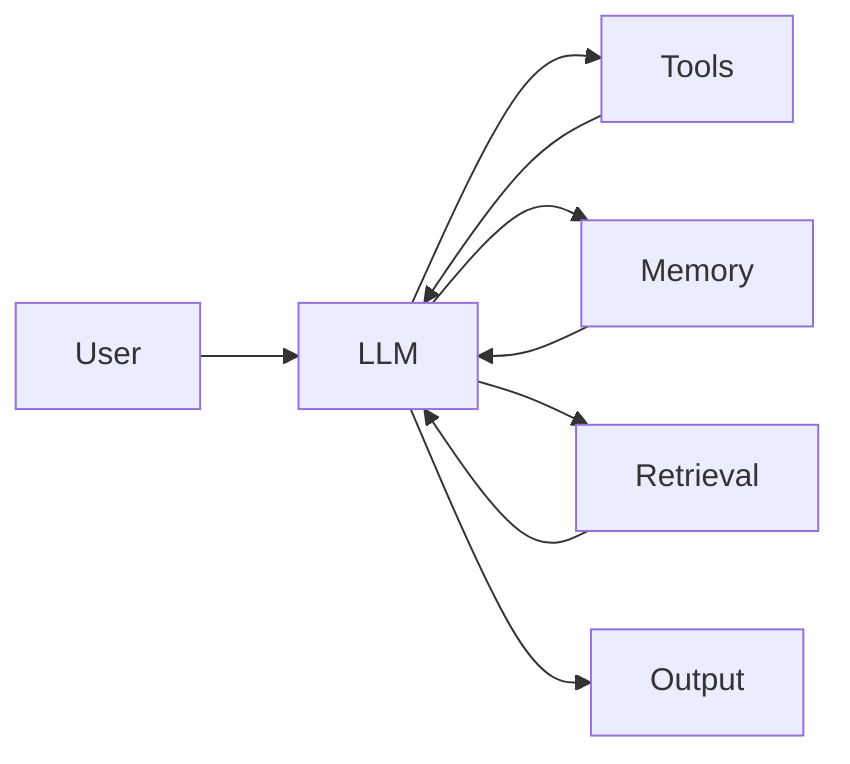
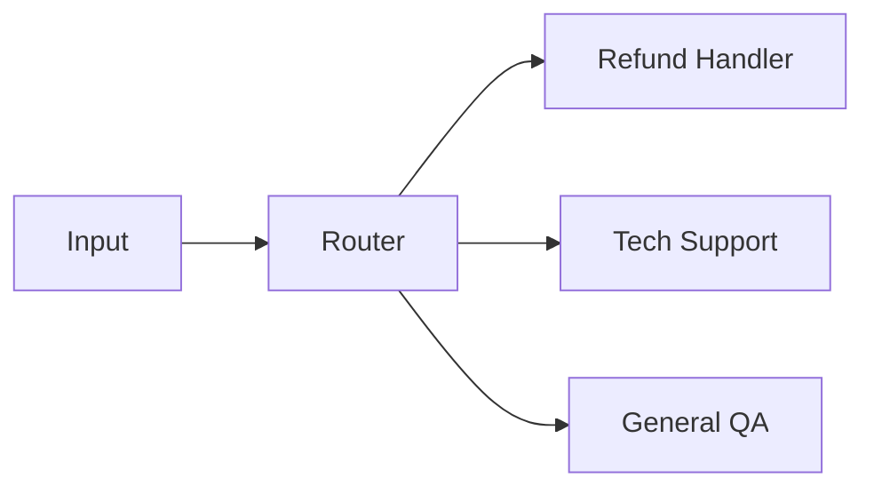
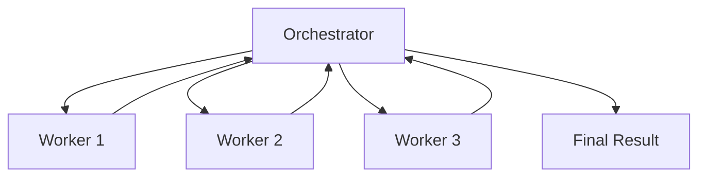
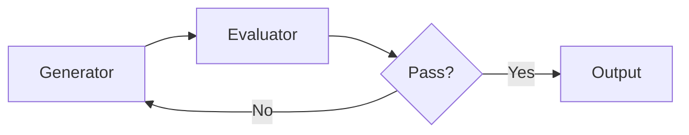

Agentic Workflow의 패턴은 결국 `LLM + Tools + Memory + Retrieval` 블록을 어떻게 연결하느냐의 문제다. 아래 8가지 패턴은 단순한 순차 처리부터 자율 실행, Human-in-the-Loop까지 복잡도가 점점 올라간다.

## 전체 요약

| 패턴 | 핵심 구조 | 적합한 상황 |
| --- | --- | --- |
| Augmented LLM | LLM에 tools, memory, retrieval을 결합 | 모든 agentic system의 기본 블록 |
| Prompt Chaining | 이전 단계 출력이 다음 단계 입력 | 고정된 순차 작업 |
| Routing | 입력을 분류해 전문 handler로 전달 | 입력 유형이 명확히 갈릴 때 |
| Parallelization | 여러 관점을 병렬 실행 후 집계 | 독립 하위 작업이 있을 때 |
| Orchestrator-Workers | 중앙 orchestrator가 worker를 동적 배정 | 작업 분해가 실행 중 결정될 때 |
| Multi-agent Topologies | 여러 agent가 역할을 나눠 협업 | 규모가 크고 책임 분리가 필요할 때 |
| Evaluator-Optimizer | 생성과 평가를 반복 | 품질 기준이 명확할 때 |
| Human-in-the-Loop | 위험 작업 전 사람 승인 | 비용이 큰 실수나 권한 작업 |

## 1. Augmented LLM

가장 기본 블록이다. LLM이 도구, memory, retrieval을 사용할 수 있게 확장한 구조다.

모든 agentic pattern은 이 블록을 어떻게 연결하고 제어하느냐의 문제로 볼 수 있다.

## 2. Prompt Chaining

작업을 순차 단계로 나누고, 앞 단계의 출력이 다음 단계의 입력이 된다. 중간에 gate를 넣어 기준에 맞지 않으면 중단하거나 재시도할 수 있다.

| 관점 | 내용 |
| --- | --- |
| 적합한 상황 | 작업을 고정된 단계로 나눌 수 있을 때 |
| 예 | 마케팅 카피: outline -> draft -> edit -> translate |
| 실패 모드 | 앞 단계 오류가 뒤 단계로 전파 |
| 대응 | 각 단계 사이에 validation gate 추가 |

## 3. Routing

입력을 분류해서 적절한 handler로 보낸다. 각 handler는 자기 작업에만 특화되므로 prompt가 단순해지고 품질이 안정된다.

Router는 작은 모델이나 규칙 기반으로 처리하고, handler에는 작업에 맞는 모델을 쓰면 비용을 줄일 수 있다.

## 4. Parallelization

작업을 독립적인 하위 작업으로 나눠 병렬 실행한 뒤 결과를 합친다. Sectioning은 서로 다른 하위 작업을 나누는 방식이고, Voting은 같은 작업을 여러 번 실행해 신뢰도를 높이는 방식이다.

| 방식 | 설명 | 예 |
| --- | --- | --- |
| Sectioning | 서로 다른 관점을 병렬 검토 | 보안, 성능, 스타일 코드 리뷰 |
| Voting | 같은 문제를 여러 번 풀고 다수결 | 분류, 판정, 품질 평가 |

병렬화는 latency를 줄일 수 있지만, 결과를 합치는 merge logic이 필요하다.

## 5. Orchestrator-Workers

중앙 orchestrator가 실행 중에 하위 작업을 나누고 worker에게 위임한다. 서브태스크를 미리 정해두기 어려운 문제에 적합하다.

Prompt Chaining과 다른 점은 작업 분해가 실행 중에 결정된다는 점이다. Claude Code의 sub-agent 구조나 복잡한 리서치 workflow가 여기에 가깝다.

## 6. Multi-Agent Topologies

Orchestrator-Workers가 확장되면 여러 agent가 역할을 나눠 협업하는 topology가 된다.

| topology | 제어 구조 | 장점 | 단점 |
| --- | --- | --- | --- |
| Supervisor | 중앙 agent가 조정 | 통제와 디버깅이 쉬움 | 중앙 병목 가능 |
| Swarm | agent 간 handoff | 유연함 | 추적과 재현이 어려움 |
| Hierarchical | 다층 supervisor | 큰 조직형 작업에 적합 | 구조가 복잡함 |

Multi-agent는 멋있어 보이지만 운영 난도가 높다. 단일 agent나 workflow로 충분한 문제라면 굳이 도입하지 않는 편이 좋다.

## 7. Evaluator-Optimizer

Generator가 결과를 만들고 Evaluator가 평가한 뒤, 기준을 만족할 때까지 반복한다.

번역, 글쓰기, 코드 리팩터링처럼 정답은 하나가 아니지만 품질 기준은 명확한 작업에 적합하다. 단, 최대 반복 횟수를 제한하지 않으면 비용과 latency가 커질 수 있다.

## 8. Autonomous Agent

LLM이 스스로 도구 사용과 실행 경로를 결정한다. 환경에서 feedback을 받고 계획을 수정하며 종료 조건까지 판단한다.

| 필수 가드레일 | 이유 |
| --- | --- |
| max steps | 무한 loop 방지 |
| 비용 한도 | token 폭주 방지 |
| human check-in | 위험 행동 전 승인 |
| sandbox | 파일, 네트워크, 권한 피해 제한 |

Autonomous Agent는 열린 문제에 강하지만 실패 위험도 크다. 실무에서는 처음부터 자율성을 크게 주기보다 관측과 중단 지점을 먼저 설계해야 한다.

## 9. Human-in-the-Loop

중요한 결정 직전에 agent가 멈추고 사람의 검토, 승인, 수정을 기다린 뒤 재개하는 패턴이다.

| 필요한 상황 | 예 |
| --- | --- |
| 되돌리기 어려운 작업 | 결제, 발송, 삭제, 권한 변경 |
| 법적/보안 리스크 | 계약, 개인정보, 접근 제어 |
| 품질 책임이 큰 산출물 | PR merge, 고객 공지, 보고서 제출 |

Human-in-the-Loop는 agent의 실패를 인정하는 장치가 아니라, 실무에서 자율성과 안전성을 함께 가져가기 위한 기본 설계다.

## 정리

8가지 패턴은 서로 경쟁하는 기술이 아니라 조합 가능한 설계 블록이다. 고정 절차는 Prompt Chaining, 입력 유형 분기는 Routing, 병렬 검토는 Parallelization, 실행 중 작업 분해는 Orchestrator-Workers, 위험한 행동은 Human-in-the-Loop로 다루는 식으로 문제에 맞게 선택해야 한다.
