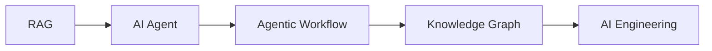

`3.STUDY`는 교육 과정이나 프로젝트에 직접 묶이지 않는 개인 학습 글을 모아두는 공간이다.

`1.TIL`은 수업과 과정 기반 기록, `2.PROJECT`는 프로젝트 결과와 회고, `3.STUDY`는 AI 엔지니어링 주제를 따로 공부하며 정리한 글로 구분한다.

## 카테고리 구조

```text
3.STUDY
  3-1.PYTHON
  3-2.RAG
  3-3.AI_AGENT
  3-4.AGENTIC_WORKFLOW
  3-5.KNOWLEDGE_GRAPH
  3-7.AI_ENGINEERING
```

## 읽는 순서

처음 읽는다면 `RAG -> AI_AGENT -> AGENTIC_WORKFLOW -> KNOWLEDGE_GRAPH -> AI_ENGINEERING` 순서가 자연스럽다. RAG와 Agent는 실제 AI 서비스 설계의 기본 축이고, Knowledge Graph와 AI Engineering은 운영과 데이터 구조를 이해하는 데 이어진다.



## RAG

RAG는 LLM이 외부 지식을 검색해 답변에 활용하는 구조다. 기본 파이프라인부터 운영 환경의 chunking, retrieval, reranking, evaluation까지 나눠 정리했다.

| 글 | 핵심 내용 |
| --- | --- |
| [RAG 완전 가이드 1: 필요성과 기본 구조]() | RAG가 필요한 이유와 기본 파이프라인 |
| [RAG 완전 가이드 2: Naive, Advanced, Modular, Agentic RAG]() | RAG 구조의 진화 |
| [RAG 완전 가이드 3: 평가, 도입 로드맵, 논문 타임라인]() | 평가 기준과 학습 로드맵 |
| [Production RAG Engineering 1: 아키텍처와 설계 지점]() | 운영형 RAG 아키텍처 |
| [Production RAG Engineering 2: Chunking, Embedding, Retrieval, Reranking]() | 검색 품질을 좌우하는 핵심 전략 |
| [Production RAG Engineering 3: Evaluation, Operations, Checklist]() | 평가, 관측, 운영 체크리스트 |

## AI Agent

AI Agent는 LLM에 memory, planning, tools를 결합해 작업을 수행하게 만드는 구조다. 단순 LLM 호출과 Agent를 구분하고, 성숙도와 운영 요소를 분리해 정리했다.

| 글 | 핵심 내용 |
| --- | --- |
| [AI Agent 완벽 가이드 1: 정의와 Workflow 구분]() | Agent의 정의와 Workflow와의 차이 |
| [AI Agent 완벽 가이드 2: Agent 성숙도 7단계]() | L0부터 L6까지 Agent 복잡도 |
| [AI Agent 완벽 가이드 3: Memory, RAG, Guardrails, Cost]() | Agent 운영에 필요한 구성 요소 |
| [Agent Engineering]() | Agent를 제품으로 만들 때 필요한 엔지니어링 관점 |
| [Hermes Agent vs OpenClaw]() | 두 Agent 프로젝트의 설계 비교 |
| [AI Assistant Engineering]() | Assistant를 서비스로 만들 때의 설계 기준 |

## Agentic Workflow

Agentic Workflow는 LLM을 단일 호출로 쓰지 않고, 여러 단계의 판단과 실행으로 구성하는 방식이다. 무조건 자율 Agent로 가는 것이 아니라 문제에 맞는 패턴을 선택하는 것이 핵심이다.

| 글 | 핵심 내용 |
| --- | --- |
| [Agentic AI 패턴 가이드 1: Workflow vs Agent]() | 결정론적 workflow와 동적 agent의 구분 |
| [Agentic AI 패턴 가이드 2: 8가지 패턴]() | Prompt chaining, routing, parallelization 등 핵심 패턴 |
| [Agentic AI 패턴 가이드 3: 선택 기준, 비용, 토폴로지]() | 비용, 지연, topology 기준의 선택법 |
| [바이브코딩 & Claude Code 교육 자료]() | AI 코딩 도구를 학습하고 가르치는 방법 |
| [AI 코딩의 Cognitive Debt]() | AI 코딩에서 생기는 이해 부채와 관리법 |

## Knowledge Graph

Knowledge Graph는 지식을 entity와 relation 중심으로 구조화하는 방법이다. RAG가 문서 검색 중심이라면, Knowledge Graph는 관계와 제약을 명시적으로 다루는 데 강점이 있다.

| 글 | 핵심 내용 |
| --- | --- |
| [온톨로지 & 지식 그래프 가이드 1: 개념, 스펙트럼, 트리플]() | ontology, taxonomy, triple의 기본 개념 |
| [온톨로지 & 지식 그래프 가이드 2: GraphRAG, 도구, 시작법]() | GraphRAG와 도구 생태계 |
| [Knowledge Graph 학습 로드맵]() | 학습 순서와 실습 방향 |

## AI Engineering

AI Engineering은 모델 하나가 아니라 데이터, 팀 운영, 개발 경험, 프롬프트 변화, 작은 모델 학습까지 포함하는 넓은 주제다.

| 글 | 핵심 내용 |
| --- | --- |
| [AI Native 팀 운영 가이드]() | AI Native 팀의 운영 방식 |
| [AI Engineering 학습 로드맵]() | AI 엔지니어링 학습 순서 |
| [AI-Ready Data 가이드]() | AI 시스템이 사용할 수 있는 데이터 조건 |
| [AX 시대를 위한 DX]() | AI Transformation과 Developer Experience |
| [모델 변경과 프롬프트 변화]() | 모델이 바뀔 때 프롬프트도 바뀌는 이유 |
| [Tiny LLM from Scratch]() | 작은 LLM을 직접 구현하며 이해하는 구조 |

## 정리 기준

이 카테고리의 글은 자료 목록을 모으는 것보다, 실제로 판단에 쓸 수 있는 기준을 남기는 데 초점을 둔다. 개념은 정의에서 끝내지 않고, 언제 쓰고 언제 쓰지 않을지까지 함께 정리한다.
